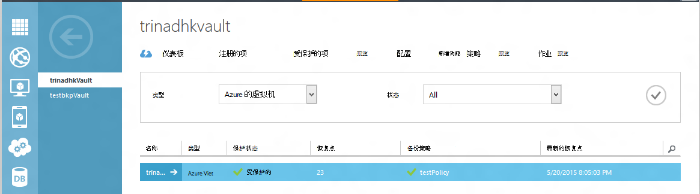
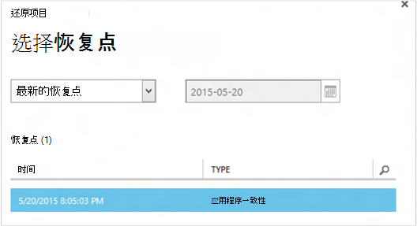
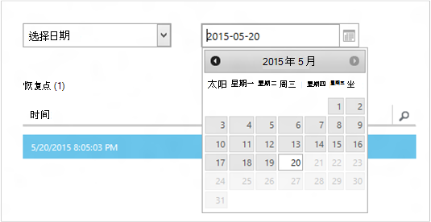
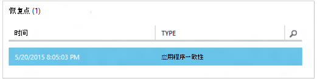
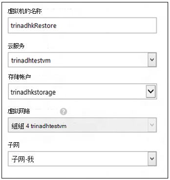
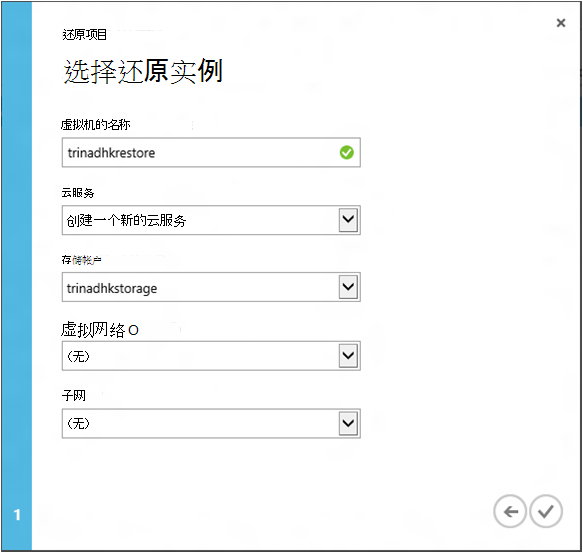
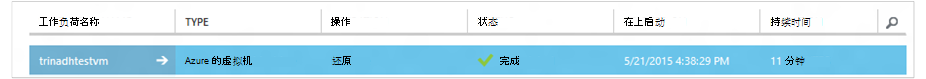

<properties
    pageTitle="从备份中还原虚拟机 |Microsoft Azure"
    description="了解如何从一个恢复点还原 Azure 的虚拟机"
    services="backup"
    documentationCenter=""
    authors="trinadhk"
    manager="shreeshd"
    editor=""
    keywords="还原备份;如何还原;恢复点;"/>

<tags
    ms.service="backup"
    ms.workload="storage-backup-recovery"
    ms.tgt_pltfrm="na"
    ms.devlang="na"
    ms.topic="article"
    ms.date="08/02/2016"
    ms.author="trinadhk; jimpark;"/>

# 还原在 Azure 中的虚拟机

> [AZURE.SELECTOR]
- [在 Azure 门户网站还原虚拟机](backup-azure-arm-restore-vms.md)
- [在传统门户网站还原虚拟机](backup-azure-restore-vms.md)

将虚拟机从下列步骤 Azure 备份存储库中存储的备份恢复到新的虚拟机。

## 恢复工作流

### 1.选择要还原的项目

1. 导航到**受保护的项**选项卡并选择您想要还原到新的虚拟机的虚拟机。

    

    **受保护的项**页中的**恢复点**列会告诉您的虚拟机的恢复点数量。 **最新的恢复点**列告诉您可以从其还原虚拟机的最新备份的时间。

2. 单击**还原**以打开**还原项目**向导。

    

### 2.选择恢复点

1. 在**选择恢复点**屏幕中，您可以恢复从最新的恢复点，或从以前的点时间。 打开向导时选择的默认选项是*最新的恢复点*。

    

2. 及时领取早些时候，在下拉列表中选择**选择日期**选项并通过单击**日历图标**在日历控件中选择一个日期。 在控件中，已恢复点的所有日期都是浅灰色底纹，可由用户选择。

    

    一旦单击日历控件中的日期，点上可用的日期将显示在下表恢复点恢复。 **时间**列指示拍摄快照时的时间。 **类型**列显示[一致性](https://azure.microsoft.com/documentation/articles/backup-azure-vms/#consistency-of-recovery-points)的恢复点。 表格标题显示可用的恢复点的数量用括号括起来的那一天。

    

3. 从**恢复点**表中选择恢复点并单击下箭头以转到下一屏。

### 3.指定的目标位置

1. 在屏幕上**选择还原实例**指定还原虚拟机的位置的详细信息。

  - 指定虚拟机名称︰ 给定的云服务，在虚拟机的名称应该是唯一。 我们不支持覆盖现有的虚拟机。 
  - 选择虚拟机的云服务︰ 这是必填字段来创建一个虚拟机。 您可以选择使用现有的云服务，或者创建一个新的云服务。

        Whatever cloud service name is picked should be globally unique. Typically, the cloud service name gets associated with a public-facing URL in the form of [cloudservice].cloudapp.net. Azure will not allow you to create a new cloud service if the name has already been used. If you choose to create select create a new cloud service, it will be given the same name as the virtual machine – in which case the VM name picked should be unique enough to be applied to the associated cloud service.

        We only display cloud services and virtual networks that are not associated with any affinity groups in the restore instance details. [Learn More](../virtual-network/virtual-networks-migrate-to-regional-vnet.md).

2. 为虚拟机选择存储帐户︰ 这是必填字段来创建虚拟机。 您可以选择从现有存储帐户在 Azure 备份存储库为同一个地区。 我们不支持存储帐户的冗余或高级存储类型的区域。

    如果没有使用受支持的配置存储帐户，请创建存储帐户的受支持的配置，在开始还原操作之前。

    

3. 选择一个虚拟网络︰ 创建虚拟机的时候，应选择虚拟机的虚拟网络 (VNET)。 还原用户界面显示可用于该订阅中的所有 VNETs。 不强制要求恢复 vm 选择 VNET — 您将能够即使不应用 VNET 通过 internet 连接到已还原的虚拟机。

    如果选择的云服务与虚拟网络，则不能更改的虚拟网络。

    

4. 选择一个子网︰ VNET 具有子网的情况下，默认情况下第一个子网将选择。 从下拉列表选项中选择您所选择的子网。 子网的详细信息，转到[门户主页](https://manage.windowsazure.com/)中的网络扩展，转到**虚拟网络**和选择的虚拟网络深入到配置子网的详细信息，请参阅。

    

5. 单击提交详细信息并创建一个恢复作业向导中的**提交**图标。

## 跟踪执行还原操作
输入到还原向导的所有信息并将其提交后 Azure 备份将尝试创建一个作业来跟踪执行还原操作。

如果作业创建成功，您将看到 toast 通知，指示已创建作业。 可以通过单击**查看作业**按钮将带您到**作业**选项卡来获取更多详细信息。

还原操作完成后，将被标记为已完成**的作业**选项卡中。

虚拟机在还原后可能需要重新安装现有的原始虚拟机和虚拟机在 Azure 门户[修改终结点](../virtual-machines/virtual-machines-windows-classic-setup-endpoints.md)上的扩展。

## 恢复后的步骤
如果您使用 Ubuntu，云初始化基于 Linux 分发出于安全原因，密码将被阻止还原后。 请在对[重置密码](../virtual-machines/virtual-machines-linux-classic-reset-access.md)恢复 VM 上，使用 VMAccess 扩展名。 我们建议使用这些分配上的 SSH 密钥以免重置密码后恢复。 

## 还原虚拟机的的备份
如果具有相同名称与最初备份虚拟机还原到同一个云服务 VM，备份将继续恢复 VM 后上。 如果您在还原到不同的云服务的虚拟机，或指定另一个名称还原虚拟机，这将被视为一个新的虚拟机并需安装备份的还原虚拟机。

## 在 Azure 数据中心灾难恢复 VM
Azure 备份允许还原备份虚拟机到成对的数据中心在主数据中心的虚拟机正在运行体验灾难和配置备份存储库成为 geo 多余的情况下。 在这种情况下，您需要选择一个成对的数据中心中存在对存储帐户和恢复过程的其余部分保持相同。 Azure 备份使用成对的地理计算服务创建还原的虚拟机。 

## 还原域控制器虚拟机
备份域控制器 (DC) 虚拟机是使用 Azure 备份受支持的方案。 但是一些格外小心，必须在恢复过程中。 恢复体验是虚拟机与多 DC 配置中的单个 DC 配置为域控制器虚拟机非常不同。

### 单个 DC
虚拟机可以从 Azure 还原 （类似于任何其他 VM) 门户网站或使用 PowerShell。

### 多个域控制器
当有多个 DC 环境时，域控制器都具有自己的方法使数据保持同步。 还原*不适当的防范措施的情况下*较旧的备份点时，USN 回滚进程可以造成很多直流环境中的大破坏。 若要恢复此类虚拟机的正确方法是引导它以 DSRM 模式。

由于 DSRM 模式不存在在 Azure 中，因此会出现所面临的挑战。 因此若要恢复此类虚拟机，则无法使用 Azure 的门户。 唯一受支持的恢复机制是使用 PowerShell 的基于磁盘的恢复。

>[AZURE.WARNING] 对于多直流环境中的域控制器虚拟机，不要使用 Azure 门户恢复 ！ 支持仅基于 PowerShell 还原

阅读有关[USN 回滚问题](https://technet.microsoft.com/library/dd363553)并建议解决办法的策略详细信息。

## 特殊的网络配置还原虚拟机
Azure 备份支持遵守特殊的网络配置虚拟机的备份。

- 在负载平衡器 （内部的和外部的） 的虚拟机
- 与多个保留 ip 地址的虚拟机
- 具有多个 Nic 的虚拟机

这些配置要求后还原它们时的注意事项。

>[AZURE.TIP] 请使用基于 PowerShell 还原流重新创建虚拟机恢复后的特殊的网络配置。

### 从用户界面中恢复︰
从用户界面时，**总是选择新的云服务**还原时。 请注意，由于门户期间还原流只是强制性参数，虚拟机还原使用用户界面将失去他们所拥有的特殊的网络配置。 换句话说，虚拟机还原将普通虚拟机无需配置负载平衡器或多个 NIC 或多个保留的 IP。

### 从 PowerShell 还原︰
PowerShell 已不仅仅是从备份中还原虚拟机磁盘并创建虚拟机的能力。 当还原虚拟机需要特定的网络配置 mentined 上面的这是很有帮助。

为了完全重新创建虚拟机后恢复磁盘，请执行以下步骤︰

1. 请将磁盘恢复使用[Azure 备份 PowerShell](../backup-azure-vms-classic-automation.md#restore-an-azure-vm)的备份存储库中

2. 创建虚拟机配置所需的负载平衡器/多个 NIC/多保留 IP 使用 PowerShell cmdlet 和使用它创建的虚拟机所需配置。
    - 在[内部负载平衡器](https://azure.microsoft.com/documentation/articles/load-balancer-internal-getstarted/)使用云服务中创建虚拟机
    - 创建虚拟机连接到 [互联网面临负载平衡器] (https://azure.microsoft.com/en-us/documentation/articles/load-balancer-internet-getstarted/)
    - 创建具有[多个 Nic](https://azure.microsoft.com/documentation/articles/virtual-networks-multiple-nics/)的 VM
    - 创建具有[多个保留 ip 地址](https://azure.microsoft.com/documentation/articles/virtual-networks-reserved-public-ip/)的虚拟机

## 下一步行动
- [解决错误](backup-azure-vms-troubleshoot.md#restore)
- [管理虚拟机](backup-azure-manage-vms.md)
