<properties
   pageTitle="从 Azure 使用资源管理器部署模型将数据还原到 Windows 服务器的 Windows 客户端 |Microsoft Azure"
   description="了解如何从 Windows 服务器或 Windows 客户端还原。"
   services="backup"
   documentationCenter=""
   authors="saurabhsensharma"
   manager="shivamg"
   editor=""/>

<tags
   ms.service="backup"
   ms.workload="storage-backup-recovery"
     ms.tgt_pltfrm="na"
     ms.devlang="na"
     ms.topic="article"
     ms.date="08/02/2016"
     ms.author="trinadhk; jimpark; markgal;"/>

# 将文件还原到 Windows 服务器或 Windows 客户端计算机使用资源管理器部署模型

> [AZURE.SELECTOR]
- [Azure 门户](backup-azure-restore-windows-server.md)
- [传统的门户网站](backup-azure-restore-windows-server-classic.md)

本文介绍了执行两种类型的还原操作所需的步骤︰

- 将数据还原到从中备份拍摄的同一台计算机。
- 将数据恢复到任何其他计算机。

在这两种情况下，从 Azure 恢复服务存储库检索数据。

[AZURE.INCLUDE [learn-about-deployment-models](../../includes/learn-about-deployment-models-rm-include.md)]经典的部署模型。

## 将数据恢复到同一台计算机
如果您意外地删除一个文件，并希望将其还原到同一台计算机 （从中获取备份），以下步骤将帮助您恢复数据。

1. 打开**Microsoft Azure 备份**管理单元。
2. 单击**恢复数据**来启动工作流。

    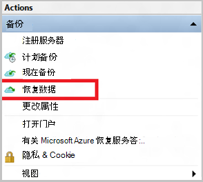

3. 选择**此服务器 (*yourmachinename*) * * 选项可还原备份的同一台计算机上的文件。

    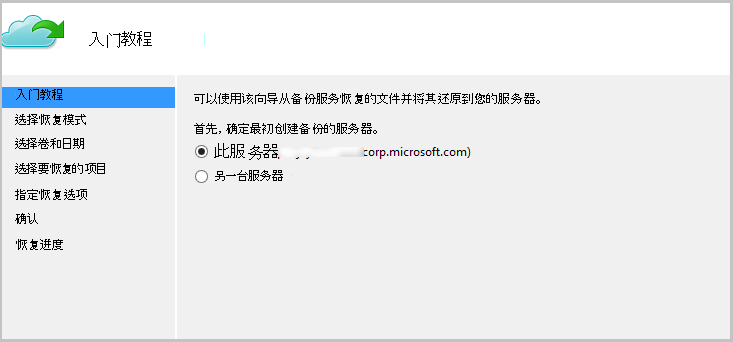

4. 选择**浏览文件**或**搜索文件**。

    如果您打算恢复其路径已知的一个或多个文件，请保留默认选项。 如果不能确定的文件夹结构，但想要搜索的文件，请选择**文件搜索**选项。 为便于本部分中，我们将继续使用默认选项。

    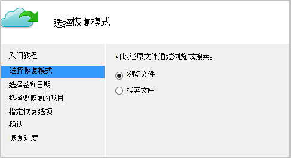

5. 选择想要还原的文件的卷。

    可以从任何时间点恢复时间。 中**以粗体显示**在日历控件中显示的日期表示可用还原点的日期。 一旦选择了日期，根据备份计划 （并成功的备份操作），您可以选择点时间从**时间**放在向下。

    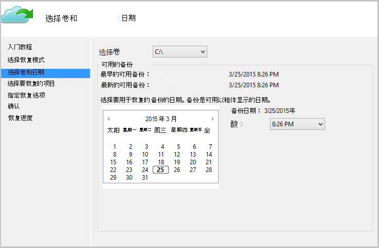

6. 选择要恢复的项目。 您可以想要还原多项选择的文件夹/文件。

    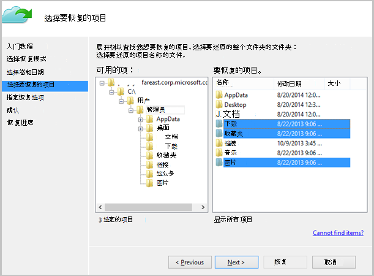

7. 指定的故障恢复参数。

    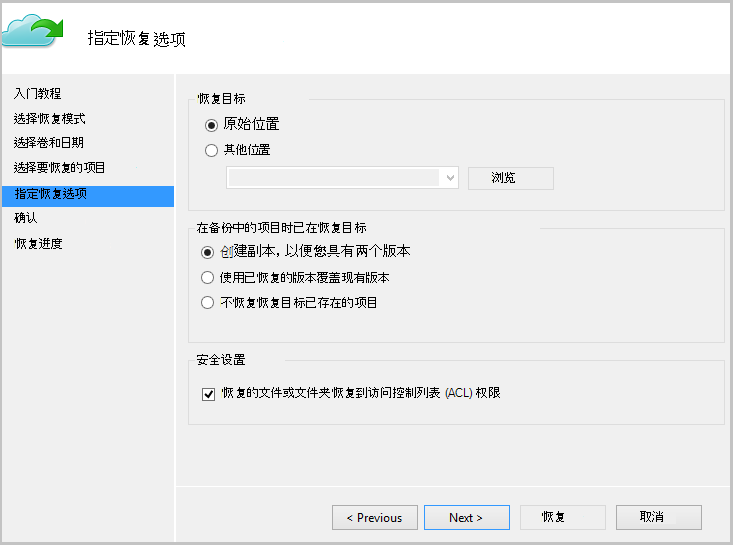

  - 有一个选项，将还原到原始位置 （在其中的文件/文件夹将被改写） 或同一台计算机中的其他位置。
  - 如果您想要还原的文件/文件夹存在于目标位置，可以创建副本 （同一文件的两个版本），覆盖目标位置中的文件或跳过的文件在目标中存在的恢复。
  - 强烈建议您保持默认选项，恢复将恢复的文件上的 Acl。

8. 一旦提供了这些输入，请单击**下一步**。 将文件还原到此计算机，恢复工作流将开始。

## 恢复到备用计算机
如果整个服务器不可用，则可以到另一台计算机，从 Azure 备份恢复数据。 以下步骤说明了工作流。  

在以下步骤中使用的术语包括︰

- *源计算机*-从备份和当前无法使用与原始计算机。
- *目标计算机*– 数据恢复到的计算机。
- *存储库的示例*– 注册了*源计算机*和*目标计算机*的恢复服务的存储库。  

> [AZURE.NOTE] 从一台计算机备份无法还原的计算机运行的是早期版本的操作系统上。 例如，如果从 Windows 7 计算机进行备份，它可以还原 Windows 8 上或机器上面。 但是相反不为真。

1. 打开**Microsoft Azure 备份**快照在*目标计算机*上。
2. 确保*目标计算机*和*源计算机*到相同的恢复服务存储库中的注册。
3. 单击**恢复数据**来启动工作流。

    

4. 选择**另一个服务器**

    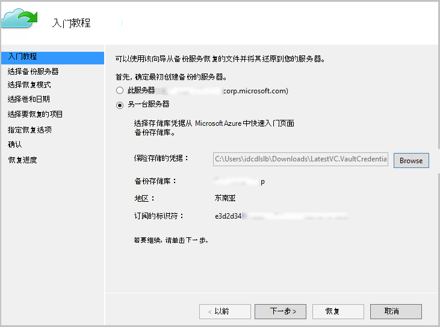

5. 提供到*示例存储库*存储库凭据文件相对应的。 如果存储库凭据文件无效 （或过期） 从 Azure 门户中的*示例存储库*下载新的存储库凭据文件。 一旦提供该存储库凭据文件，将显示恢复服务存储库存储库凭据文件。

6. 选择从列表中显示的计算机的*源计算机*。

    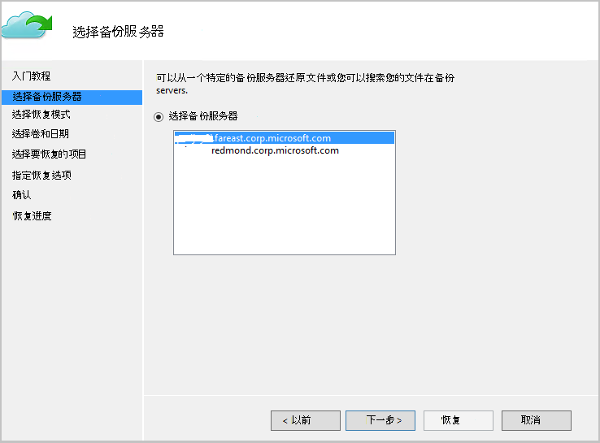

7. 选择**搜索文件**或**浏览文件**选项。 为便于本部分中，我们将使用**搜索文件**选项。

    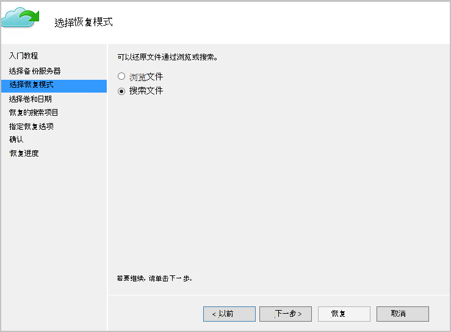

8. 在下一个屏幕中选择的数量和日期。 搜索要还原的文件夹/文件名称。

    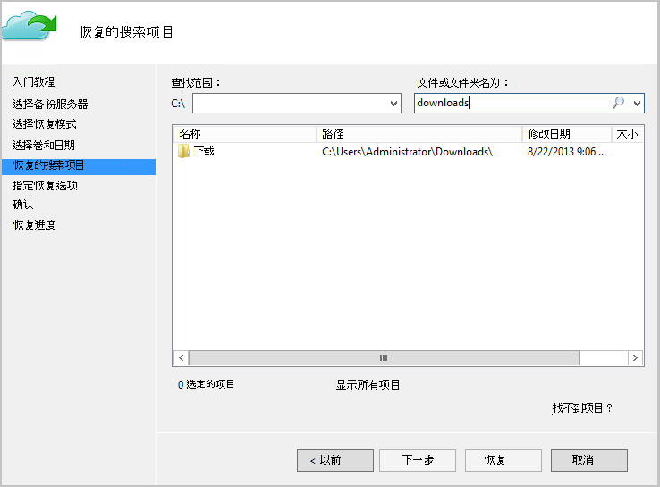

9. 选择需要恢复的文件的位置。

    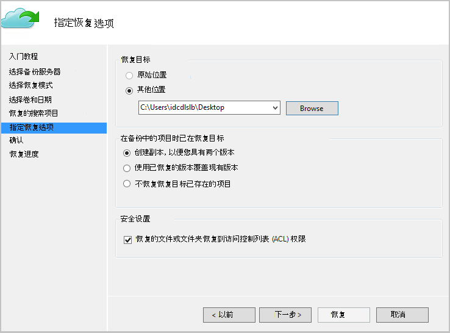

10. 提供到*示例存储库*在*源计算机上的*注册过程中提供的加密密码。

    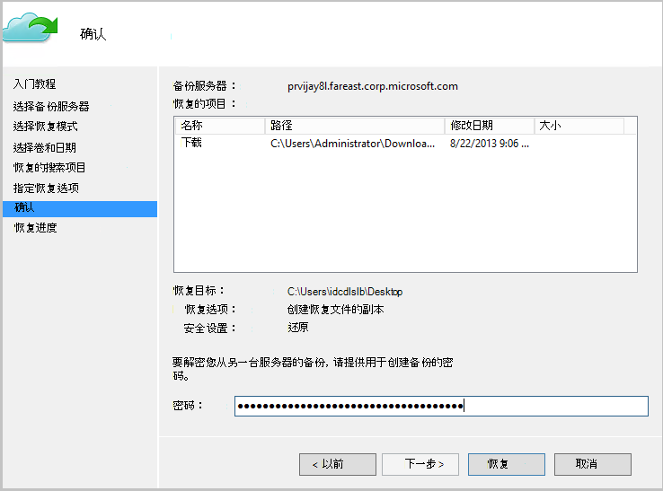

11. 一旦提供输入，请单击**恢复**，从而触发到目的地提供备份的文件还原。

## 下一步行动
- 现在，您已经恢复文件和文件夹，您可以[管理您的备份](backup-azure-manage-windows-server.md)。
