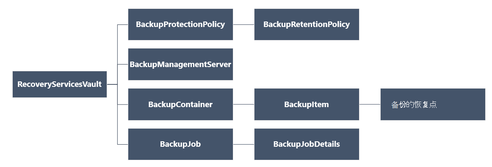

<properties
   pageTitle="部署和管理备份资源管理器部署的虚拟机使用 PowerShell |Microsoft Azure"
   description="使用 PowerShell 来部署和管理 Azure 中的备份资源管理器部署虚拟机"
   services="backup"
   documentationCenter=""
   authors="markgalioto"
   manager="cfreeman"
   editor=""/>

<tags
   ms.service="backup"
   ms.devlang="na"
   ms.topic="article"
   ms.tgt_pltfrm="na"
   ms.workload="storage-backup-recovery"
   ms.date="08/03/2016"
   ms.author="markgal; trinadhk"/>

# <a name="deploy-and-manage-backups-for-resource-manager-deployed-vms-using-powershell"></a>部署和管理的资源管理器部署的虚拟机使用 PowerShell 的备份

> [AZURE.SELECTOR]
- [资源管理器](backup-azure-vms-automation.md)
- [经典](backup-azure-vms-classic-automation.md)

本文介绍了如何使用 Azure PowerShell cmdlet 来备份和恢复服务存储库从恢复 Azure 的虚拟机 (VM)。 恢复服务存储库是 Azure 资源管理器的资源，和用于保护数据和资产在 Azure 备份和 Azure 站点恢复服务。 恢复服务存储库可用于保护 Azure 服务管理器部署的虚拟机，以及 Azure 资源管理器部署的虚拟机。

>[AZURE.NOTE] Azure 具有用于创建和使用资源的两种部署模型︰[资源管理器和经典](../resource-manager-deployment-model.md)。 本文是用于与使用资源管理器模型创建的虚拟机。

本文将指导您完成使用 PowerShell 保护虚拟机，并从恢复点恢复数据。

## <a name="concepts"></a>概念

如果您尚不熟悉的 Azure 备份服务，有关的服务，概述签出[Azure 备份是什么？](backup-introduction-to-azure-backup.md) 在开始之前，确保您介绍有关使用 Azure 备份和当前虚拟机备份解决方案的限制所需系统必备要素。

为了有效地使用 PowerShell，有必要了解层次结构的对象，并从何处开始。



若要查看 AzureRmRecoveryServicesBackup PowerShell cmdlet 参考，请参阅[Azure 备份-恢复服务 Cmdlet](https://msdn.microsoft.com/library/mt723320.aspx) Azure 的库中。
若要查看 AzureRmRecoveryServicesVault PowerShell cmdlet 参考，请参阅[Azure 恢复服务 Cmdlet](https://msdn.microsoft.com/library/mt643905.aspx)。


## <a name="setup-and-registration"></a>安装和注册

开始︰

1. [下载最新版本的 PowerShell](https://github.com/Azure/azure-powershell/releases)(所需的最低版本是︰ 1.4.0 版)

2. 通过键入以下命令查找可用的 Azure 备份 PowerShell cmdlet:

```
PS C:\> Get-Command *azurermrecoveryservices*

CommandType     Name                                               Version    Source
-----------     ----                                               -------    ------
Cmdlet          Backup-AzureRmRecoveryServicesBackupItem           1.4.0      AzureRM.RecoveryServices.Backup
Cmdlet          Disable-AzureRmRecoveryServicesBackupProtection    1.4.0      AzureRM.RecoveryServices.Backup
Cmdlet          Enable-AzureRmRecoveryServicesBackupProtection     1.4.0      AzureRM.RecoveryServices.Backup
Cmdlet          Get-AzureRmRecoveryServicesBackupContainer         1.4.0      AzureRM.RecoveryServices.Backup
Cmdlet          Get-AzureRmRecoveryServicesBackupItem              1.4.0      AzureRM.RecoveryServices.Backup
Cmdlet          Get-AzureRmRecoveryServicesBackupJob               1.4.0      AzureRM.RecoveryServices.Backup
Cmdlet          Get-AzureRmRecoveryServicesBackupJobDetails        1.4.0      AzureRM.RecoveryServices.Backup
Cmdlet          Get-AzureRmRecoveryServicesBackupManagementServer  1.4.0      AzureRM.RecoveryServices.Backup
Cmdlet          Get-AzureRmRecoveryServicesBackupProperties        1.4.0      AzureRM.RecoveryServices
Cmdlet          Get-AzureRmRecoveryServicesBackupProtectionPolicy  1.4.0      AzureRM.RecoveryServices.Backup
Cmdlet          Get-AzureRMRecoveryServicesBackupRecoveryPoint     1.4.0      AzureRM.RecoveryServices.Backup
Cmdlet          Get-AzureRmRecoveryServicesBackupRetentionPolic... 1.4.0      AzureRM.RecoveryServices.Backup
Cmdlet          Get-AzureRmRecoveryServicesBackupSchedulePolicy... 1.4.0      AzureRM.RecoveryServices.Backup
Cmdlet          Get-AzureRmRecoveryServicesVault                   1.4.0      AzureRM.RecoveryServices
Cmdlet          Get-AzureRmRecoveryServicesVaultSettingsFile       1.4.0      AzureRM.RecoveryServices
Cmdlet          New-AzureRmRecoveryServicesBackupProtectionPolicy  1.4.0      AzureRM.RecoveryServices.Backup
Cmdlet          New-AzureRmRecoveryServicesVault                   1.4.0      AzureRM.RecoveryServices
Cmdlet          Remove-AzureRmRecoveryServicesProtectionPolicy     1.4.0      AzureRM.RecoveryServices.Backup
Cmdlet          Remove-AzureRmRecoveryServicesVault                1.4.0      AzureRM.RecoveryServices
Cmdlet          Restore-AzureRMRecoveryServicesBackupItem          1.4.0      AzureRM.RecoveryServices.Backup
Cmdlet          Set-AzureRmRecoveryServicesBackupProperties        1.4.0      AzureRM.RecoveryServices
Cmdlet          Set-AzureRmRecoveryServicesBackupProtectionPolicy  1.4.0      AzureRM.RecoveryServices.Backup
Cmdlet          Set-AzureRmRecoveryServicesVaultContext            1.4.0      AzureRM.RecoveryServices
Cmdlet          Stop-AzureRmRecoveryServicesBackupJob              1.4.0      AzureRM.RecoveryServices.Backup
Cmdlet          Unregister-AzureRmRecoveryServicesBackupContainer  1.4.0      AzureRM.RecoveryServices.Backup
Cmdlet          Unregister-AzureRmRecoveryServicesBackupManagem... 1.4.0      AzureRM.RecoveryServices.Backup
Cmdlet          Wait-AzureRmRecoveryServicesBackupJob              1.4.0      AzureRM.RecoveryServices.Backup
```


使用 PowerShell 可以自动执行以下任务︰

- 创建恢复服务存储库
- 备份或保护 Azure 的虚拟机
- 触发备份作业
- 监视备份作业
- 还原 Azure 的虚拟机

## <a name="create-a-recovery-services-vault"></a>创建恢复服务存储库

以下步骤将指导您完成创建恢复服务电子仓库。 恢复服务电子仓库是不同于备份存储库。

1. 如果您第一次使用 Azure 备份，必须使用**[注册 AzureRMResourceProvider](https://msdn.microsoft.com/library/mt679020.aspx)** cmdlet Azure 恢复服务提供商与您的订阅。

    ```
    PS C:\> Register-AzureRmResourceProvider -ProviderNamespace "Microsoft.RecoveryServices"
    ```

2. 恢复服务存储库是资源管理器的资源，因此您需要将其放在资源组中。 您可以使用现有资源组，或**[新建 AzureRmResourceGroup](https://msdn.microsoft.com/library/mt678985.aspx)** cmdlet 使用创建新的资源组。 创建新的资源组时，指定的名称和资源组的位置。  

    ```
    PS C:\> New-AzureRmResourceGroup –Name "test-rg" –Location "West US"
    ```

3. 使用**[新建 AzureRmRecoveryServicesVault](https://msdn.microsoft.com/library/mt643910.aspx)** cmdlet 来创建新的存储库。 一定要与所用资源组指定为该存储库相同的位置。

    ```
    PS C:\> New-AzureRmRecoveryServicesVault -Name "testvault" -ResourceGroupName " test-rg" -Location "West US"
    ```

4. 指定类型的存储冗余来使用;您可以使用[本地冗余存储 (LRS)](../storage/storage-redundancy.md#locally-redundant-storage)或[地理冗余存储 (GRS)](../storage/storage-redundancy.md#geo-redundant-storage)。 下面的示例演示为 testVault-BackupStorageRedundancy 选项设置为 GeoRedundant。

    ```
    PS C:\> $vault1 = Get-AzureRmRecoveryServicesVault –Name "testVault"
    PS C:\> Set-AzureRmRecoveryServicesBackupProperties  -Vault $vault1 -BackupStorageRedundancy GeoRedundant
    ```

    > [AZURE.TIP] 许多 Azure 备份 cmdlet 都需要恢复服务存储库对象作为输入。 鉴于此，可以很方便在变量中存储的备份恢复服务存储库对象。

## <a name="view-the-vaults-in-a-subscription"></a>在订阅查看电子仓库
使用**[Get AzureRmRecoveryServicesVault](https://msdn.microsoft.com/library/mt643907.aspx)**来查看当前的订阅中的所有存储库的列表。 检查已创建新的存储库，或者若要查看哪些电子仓库在预订中可用，您可以使用此命令。

运行命令，获取-AzureRmRecoveryServicesVault，并列出在预订中的所有存储库。

```
PS C:\> Get-AzureRmRecoveryServicesVault
Name              : Contoso-vault
ID                : /subscriptions/1234
Type              : Microsoft.RecoveryServices/vaults
Location          : WestUS
ResourceGroupName : Contoso-docs-rg
SubscriptionId    : 1234-567f-8910-abc
Properties        : Microsoft.Azure.Commands.RecoveryServices.ARSVaultProperties
```


## <a name="backup-azure-vms"></a>备份 Azure 的虚拟机
现在，您已经创建了恢复服务存储库，可用于保护虚拟机。 但是可以将保护应用之前，您必须设置存储库上下文，并且想要验证的保护策略。 存储库上下文存储库中定义的受保护的数据的类型。 保护策略为运行备份作业时，和每个备份的快照保留多长时间的计划。

在启用之前在 VM 上的保护，您必须设置存储库上下文。 上下文被应用于所有后续的 cmdlet。

```
PS C:\> Get-AzureRmRecoveryServicesVault -Name testvault | Set-AzureRmRecoveryServicesVaultContext
```

### <a name="create-a-protection-policy"></a>创建保护策略

当您创建新的存储库时，它附带了一个默认策略。 此策略会触发备份作业在每天指定的时间。 每个默认策略中，备份快照保留 30 天。 可以使用默认策略以快速保护 VM 并编辑的策略，以后有不同的详细信息。

使用**[Get AzureRmRecoveryServicesBackupProtectionPolicy](https://msdn.microsoft.com/library/mt723300.aspx)**查看存储库中的可用策略的列表︰

```
PS C:\> Get-AzureRmRecoveryServicesBackupProtectionPolicy -WorkloadType AzureVM
Name                 WorkloadType       BackupManagementType BackupTime                DaysOfWeek
----                 ------------       -------------------- ----------                ----------
DefaultPolicy        AzureVM            AzureVM              4/14/2016 5:00:00 PM
```

> [AZURE.NOTE] BackupTime 字段中 PowerShell 的时区是 UTC。 但是，当 Azure 门户中显示备份的时间，是与您的本地时区调整时间。

备份保护策略是与至少一种保留策略相关联。  保留策略定义了多长时间恢复点保持与 Azure 的备份。 使用**Get AzureRmRecoveryServicesBackupRetentionPolicyObject**查看默认的保留策略。  同样可以使用**Get AzureRmRecoveryServicesBackupSchedulePolicyObject**以获取默认的调度策略。 时间表和保留策略对象用作输入到**新建 AzureRmRecoveryServicesBackupProtectionPolicy** cmdlet。

备份保护策略定义了某一项的备份时间和频率完成。 新 AzureRmRecoveryServicesBackupProtectionPolicy cmdlet 创建 PowerShell 对象包含备份的策略信息。 作为启用 AzureRmRecoveryServicesBackupProtection cmdlet 的输入使用备份的策略。

```
PS C:\> $schPol = Get-AzureRmRecoveryServicesBackupSchedulePolicyObject -WorkloadType "AzureVM"
PS C:\>  $retPol = Get-AzureRmRecoveryServicesBackupRetentionPolicyObject -WorkloadType "AzureVM"
PS C:\>  New-AzureRmRecoveryServicesBackupProtectionPolicy -Name "NewPolicy" -WorkloadType AzureVM -RetentionPolicy $retPol -SchedulePolicy $schPol
Name                 WorkloadType       BackupManagementType BackupTime                DaysOfWeek
----                 ------------       -------------------- ----------                ----------
NewPolicy           AzureVM            AzureVM              4/24/2016 1:30:00 AM
```

### <a name="enable-protection"></a>启用保护

启用保护涉及到的项目和策略对象。 这两个对象都需要启用该存储库上的保护。 该策略与电子仓库关联后，在策略计划中定义的时间触发备份工作流。

若要启用非加密 ARM Vm 上的保护

```
PS C:\> $pol=Get-AzureRmRecoveryServicesBackupProtectionPolicy -Name "NewPolicy"
PS C:\> Enable-AzureRmRecoveryServicesBackupProtection -Policy $pol -Name "V2VM" -ResourceGroupName "RGName1"
```

若要启用加密 [加密使用 BEK 和 KEK] 的虚拟机上的保护，您需要为 Azure 备份服务密钥存储库中读取键和机密信息的权限。 

```
PS C:\> Set-AzureRmKeyVaultAccessPolicy -VaultName 'KeyVaultName' -ResourceGroupName 'RGNameOfKeyVault' -PermissionsToKeys backup,get,list -PermissionsToSecrets get,list -ServicePrincipalName 262044b1-e2ce-469f-a196-69ab7ada62d3
PS C:\> $pol=Get-AzureRmRecoveryServicesBackupProtectionPolicy -Name "NewPolicy"
PS C:\> Enable-AzureRmRecoveryServicesBackupProtection -Policy $pol -Name "V2VM" -ResourceGroupName "RGName1"
```

ASM 的基于虚拟机

```
PS C:\>  $pol=Get-AzureRmRecoveryServicesBackupProtectionPolicy -Name "NewPolicy"
PS C:\>  Enable-AzureRmRecoveryServicesBackupProtection -Policy $pol -Name "V1VM" -ServiceName "ServiceName1"
```

### <a name="modify-a-protection-policy"></a>修改保护策略

要修改的策略，修改 BackupSchedulePolicyObject 或 BackupRetentionPolicy 对象并修改策略使用一组 AzureRmRecoveryServicesBackupProtectionPolicy

下面的示例更改保留计数为 365。

```
PS C:\> $retPol = Get-AzureRmRecoveryServicesBackupRetentionPolicyObject -WorkloadType "AzureVM"
PS C:\> $retPol.DailySchedule.DurationCountInDays = 365
PS C:\> $pol= Get-AzureRmRecoveryServicesBackupProtectionPolicy -Name NewPolicy
PS C:\> Set-AzureRmRecoveryServicesBackupProtectionPolicy -Policy $pol  -RetentionPolicy  $RetPol
```

## <a name="run-an-initial-backup"></a>运行初始备份

备份时间表上重新为该物料的初始备份触发完整。 在后续备份，备份是增量复制。 如果您想要强制在特定时间或甚至立即发生的初始备份，然后使用**[备份 AzureRmRecoveryServicesBackupItem](https://msdn.microsoft.com/library/mt723312.aspx)** cmdlet:

```
PS C:\> $namedContainer = Get-AzureRmRecoveryServicesBackupContainer -ContainerType "AzureVM" -Status "Registered" -Name "V2VM"
PS C:\> $item = Get-AzureRmRecoveryServicesBackupItem -Container $namedContainer -WorkloadType "AzureVM"
PS C:\> $job = Backup-AzureRmRecoveryServicesBackupItem -Item $item
WorkloadName     Operation            Status               StartTime                 EndTime                   JobID
------------     ---------            ------               ---------                 -------                   ----------
V2VM              Backup               InProgress            4/23/2016 5:00:30 PM                       cf4b3ef5-2fac-4c8e-a215-d2eba4124f27
```

> [AZURE。注意︰ 在 PowerShell 的开始时间和结束时间字段的时区是 UTC。 但是，当时间显示在 Azure 的门户时，是与您的本地时区调整时间。

## <a name="monitoring-a-backup-job"></a>监视备份作业

Azure 备份中的大多数长时间运行操作是作为作业来模拟。 这便于跟踪进度，无需保留 Azure 的门户打开任何时候。

若要获取正在工作的最新状态，使用 Get AzureRmRecoveryservicesBackupJob cmdlet。

```
PS C:\ > $joblist = Get-AzureRmRecoveryservicesBackupJob –Status InProgress
PS C:\ > $joblist[0]
WorkloadName     Operation            Status               StartTime                 EndTime                   JobID
------------     ---------            ------               ---------                 -------                   ----------
V2VM             Backup               InProgress            4/23/2016 5:00:30 PM           cf4b3ef5-2fac-4c8e-a215-d2eba4124f27
```

而不是轮询完成-这是不必要的额外代码-这些作业使用**[等待 AzureRmRecoveryServicesBackupJob](https://msdn.microsoft.com/library/mt723321.aspx)** cmdlet。 此 cmdlet 暂停执行，直至作业完成或到达指定的超时值。

```
PS C:\> Wait-AzureRmRecoveryServicesBackupJob -Job $joblist[0] -Timeout 43200
```

## <a name="restore-an-azure-vm"></a>还原 Azure 的虚拟机

没有还原虚拟机使用 Azure 门户和还原虚拟机使用 PowerShell 有重要区别。 使用 PowerShell，还原操作已完成，一旦创建了磁盘和恢复点中的配置信息。 还原操作不会创建一个虚拟机。 提供了从磁盘中创建虚拟机的说明。 但是，要完全还原虚拟机，您需要完成以下步骤︰

- 选择虚拟机
- 选择恢复点
- 请将磁盘恢复
- 从存储的磁盘创建虚拟机

下图显示了从 BackupRecoveryPoint 到 RecoveryServicesVault 的对象层次结构。


若要还原备份数据，备份项和保存的时间点数据恢复点的标识。 然后使用**[还原 AzureRmRecoveryServicesBackupItem](https://msdn.microsoft.com/library/mt723316.aspx)** cmdlet 将存储库中的数据还原到客户的帐户。

### <a name="select-the-vm"></a>选择虚拟机

获取标识合适的备份项的 PowerShell 对象，开始从该存储库中的容器和对象层次结构中下一路做。 若要选择表示该 VM 的容器，使用**[Get AzureRmRecoveryServicesBackupContainer](https://msdn.microsoft.com/library/mt723319.aspx)** cmdlet 和传送到**[获取 AzureRmRecoveryServicesBackupItem](https://msdn.microsoft.com/library/mt723305.aspx)** cmdlet 的。

```
PS C:\> $namedContainer = Get-AzureRmRecoveryServicesBackupContainer  -ContainerType AzureVM –Status Registered -Name 'V2VM'
PS C:\> $backupitem = Get-AzureRmRecoveryServicesBackupItem –Container $namedContainer  –WorkloadType "AzureVM"
```

### <a name="choose-a-recovery-point"></a>选择恢复点

使用**[Get AzureRmRecoveryServicesBackupRecoveryPoint](https://msdn.microsoft.com/library/mt723308.aspx)** cmdlet 以列出所有的备份项的恢复点。 然后，选择要恢复的恢复点。 如果您不确定要使用的恢复点，最好选择最新的 RecoveryPointType = AppConsistent 列表中的位置。

在下面的脚本中，该变量， **$rp**，是选定的备份项的恢复点的数组。 该数组的使用时间并位于索引 0 处的最新恢复点按相反的顺序排序。 使用标准 PowerShell 数组索引选择恢复点。 例如︰ $rp [0] 将选择最新的恢复点。

```
PS C:\> $startDate = (Get-Date).AddDays(-7)
PS C:\> $endDate = Get-Date
PS C:\> $rp = Get-AzureRmRecoveryServicesBackupRecoveryPoint -Item $backupitem -StartDate $startdate.ToUniversalTime() -EndDate $enddate.ToUniversalTime()
PS C:\> $rp[0]
RecoveryPointAdditionalInfo :
SourceVMStorageType         : NormalStorage
Name                        : 15260861925810
ItemName                    : VM;iaasvmcontainer;RGName1;V2VM
RecoveryPointId             : /subscriptions/XX/resourceGroups/ RGName1/providers/Microsoft.RecoveryServices/vaults/testvault/backupFabrics/Azure/protectionContainers/IaasVMContainer;iaasvmcontainer;RGName1;V2VM/protectedItems/VM;iaasvmcontainer; RGName1;V2VM
                              /recoveryPoints/15260861925810
RecoveryPointType           : AppConsistent
RecoveryPointTime           : 4/23/2016 5:02:04 PM
WorkloadType                : AzureVM
ContainerName               : IaasVMContainer;iaasvmcontainer; RGName1;V2VM
ContainerType               : AzureVM
BackupManagementType        : AzureVM
```


### <a name="restore-the-disks"></a>请将磁盘恢复

使用**[还原 AzureRmRecoveryServicesBackupItem](https://msdn.microsoft.com/library/mt723316.aspx)** cmdlet 还原数据和配置备份项，到恢复点。 一旦您确定恢复点将其用作值**的恢复点**参数。 在前面的示例代码中， **$rp [0]**已被选作恢复点使用。 在下面的示例代码中， **$rp [0]**被指定为用于将还原到磁盘的恢复点。

若要还原的磁盘和配置信息

```
PS C:\> $restorejob = Restore-AzureRmRecoveryServicesBackupItem -RecoveryPoint $rp[0] -StorageAccountName DestAccount -StorageAccountResourceGroupName DestRG
PS C:\> $restorejob
WorkloadName     Operation          Status               StartTime                 EndTime            JobID
------------     ---------          ------               ---------                 -------          ----------
V2VM              Restore           InProgress           4/23/2016 5:00:30 PM                        cf4b3ef5-2fac-4c8e-a215-d2eba4124f27
```

一旦完成的还原作业，使用**[Get AzureRmRecoveryServicesBackupJobDetails](https://msdn.microsoft.com/library/mt723310.aspx)** cmdlet 还原操作的详细信息。 JobDetails 属性已重新生成虚拟机所需的信息。

```
PS C:\> $restorejob = Get-AzureRmRecoveryServicesBackupJob -Job $restorejob
PS C:\> $details = Get-AzureRmRecoveryServicesBackupJobDetails
```

一旦恢复磁盘，请转至下一节的信息创建虚拟机。

### <a name="create-a-vm-from-restored-disks"></a>从还原的磁盘创建一个虚拟机

还原磁盘之后，可以使用这些步骤来创建和配置虚拟机的磁盘。

1. 查询有关作业详细信息还原的磁盘属性。

    ```
    PS C:\> $properties = $details.properties
    PS C:\> $storageAccountName = $properties["Target Storage Account Name"]
    PS C:\> $containerName = $properties["Config Blob Container Name"]
    PS C:\> $blobName = $properties["Config Blob Name"]
    ```

2. 设置 Azure 存储上下文和还原 JSON 配置文件。

    ```
    PS C:\> Set-AzureRmCurrentStorageAccount -Name $storageaccountname -ResourceGroupName testvault
    PS C:\> $destination_path = "C:\vmconfig.json"
    PS C:\> Get-AzureStorageBlobContent -Container $containerName -Blob $blobName -Destination $destination_path
    PS C:\> $obj = ((Get-Content -Path $destination_path -Encoding Unicode)).TrimEnd([char]0x00) | ConvertFrom-Json
    ```

3. 使用 JSON 配置文件创建的虚拟机配置。

    ```
  PS C:\> $vm = New-AzureRmVMConfig -VMSize $obj.HardwareProfile.VirtualMachineSize -VMName "testrestore"
    ```

4. 将操作系统磁盘和数据磁盘。

      非加密的虚拟机

       ```
       PS C:\> Set-AzureRmVMOSDisk -VM $vm -Name "osdisk" -VhdUri $obj.StorageProfile.OSDisk.VirtualHardDisk.Uri -CreateOption “Attach”
       PS C:\> $vm.StorageProfile.OsDisk.OsType = $obj.StorageProfile.OSDisk.OperatingSystemType foreach($dd in $obj.StorageProfile.DataDisks)
       {
       $vm = Add-AzureRmVMDataDisk -VM $vm -Name "datadisk1" -VhdUri $dd.VirtualHardDisk.Uri -DiskSizeInGB 127 -Lun $dd.Lun -CreateOption Attach
       }
       ```
      加密的虚拟机，您需要指定[密钥存储库信息](https://msdn.microsoft.com/library/dn868052.aspx)之前，您可以将附加的磁盘。
      
      ```
      PS C:\> Set-AzureRmVMOSDisk -VM $vm -Name "osdisk" -VhdUri $obj.StorageProfile.OSDisk.VirtualHardDisk.Uri -DiskEncryptionKeyUrl "https://ContosoKeyVault.vault.azure.net:443/secrets/ContosoSecret007" -DiskEncryptionKeyVaultId "/subscriptions/abcdedf007-4xyz-1a2b-0000-12a2b345675c/resourceGroups/ContosoRG108/providers/Microsoft.KeyVault/vaults/ContosoKeyVault" -KeyEncryptionKeyUrl "https://ContosoKeyVault.vault.azure.net:443/keys/ContosoKey007" -KeyEncryptionKeyVaultId "subscriptions/abcdedf007-4xyz-1a2b-0000-12a2b345675c/resourceGroups/ContosoRG108/providers/Microsoft.KeyVault/vaults/ContosoKeyVault" -CreateOption "Attach" -Windows
      PS C:\> $vm.StorageProfile.OsDisk.OsType = $obj.StorageProfile.OSDisk.OperatingSystemType foreach($dd in $obj.StorageProfile.DataDisks)
       {
       $vm = Add-AzureRmVMDataDisk -VM $vm -Name "datadisk1" -VhdUri $dd.VirtualHardDisk.Uri -DiskSizeInGB 127 -Lun $dd.Lun -CreateOption Attach
       }
      ```
      
5. 设置网络设置。

    ```
    PS C:\> $nicName="p1234"
    PS C:\> $pip = New-AzureRmPublicIpAddress -Name $nicName -ResourceGroupName "test" -Location "WestUS" -AllocationMethod Dynamic
    PS C:\> $vnet = Get-AzureRmVirtualNetwork -Name "testvNET" -ResourceGroupName "test"
    PS C:\> $nic = New-AzureRmNetworkInterface -Name $nicName -ResourceGroupName "test" -Location "WestUS" -SubnetId $vnet.Subnets[$subnetindex].Id -PublicIpAddressId $pip.Id
    PS C:\> $vm=Add-AzureRmVMNetworkInterface -VM $vm -Id $nic.Id
    ```

6. 创建虚拟机。

    ```
    PS C:\> $vm.StorageProfile.OsDisk.OsType = $obj.StorageProfile.OSDisk.OperatingSystemType
    PS C:\> New-AzureRmVM -ResourceGroupName "test" -Location "WestUS" -VM $vm
    ```

## <a name="next-steps"></a>下一步行动

如果您更喜欢使用 PowerShell Azure 资源与接洽，签出 PowerShell 文章保护 Windows 服务器上，[部署和管理 Windows 服务器的备份](./backup-client-automation.md)。 此外提供了用于管理 DPM 备份、[部署和管理备份 DPM](./backup-dpm-automation.md)PowerShell 文章。 这些文章都具有为经典部署或资源管理器部署的版本。  
