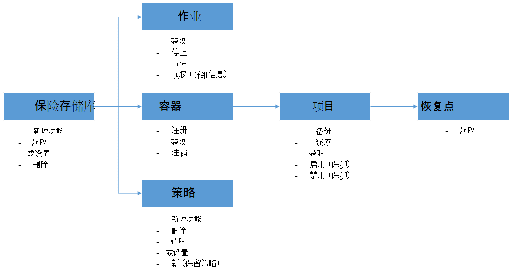

<properties
    pageTitle="部署和管理使用 PowerShell 的 Azure Vm 备份 |Microsoft Azure"
    description="了解如何部署和管理使用 PowerShell 的 Azure 备份"
    services="backup"
    documentationCenter=""
    authors="markgalioto"
    manager="cfreeman"
    editor=""/>

<tags
    ms.service="backup"
    ms.workload="storage-backup-recovery"
    ms.tgt_pltfrm="na"
    ms.devlang="na"
    ms.topic="article"
    ms.date="08/08/2016"
    ms.author="markgal;trinadhk;jimpark" />


# <a name="deploy-and-manage-backup-for-azure-vms-using-powershell"></a>部署和使用 PowerShell 的 Azure Vm 的管理备份

> [AZURE.SELECTOR]
- [资源管理器](backup-azure-vms-automation.md)
- [经典](backup-azure-vms-classic-automation.md)

这篇文章演示了如何使用 Azure PowerShell Azure 的虚拟机的备份和恢复。 Azure 具有用于创建和使用资源的两种不同的部署模型︰ 资源管理器和经典。 本文介绍如何使用经典的部署模型。 Microsoft 建议最新的部署使用资源管理器模型。

## <a name="concepts"></a>概念


本文提供了用于备份虚拟机的 PowerShell cmdlet 的特定信息。 关于保护 Azure Vm 的介绍性信息，请参阅[计划在 Azure VM 备份基础架构](backup-azure-vms-introduction.md)。

> [AZURE.NOTE] 在开始之前，请阅读使用 Azure 备份和当前虚拟机备份解决方案的[限制](backup-azure-vms-prepare.md#limitations)所需[的前提条件](backup-azure-vms-prepare.md)。

若要有效地使用 PowerShell，花些时间了解层次结构的对象，并从何处开始。



最重要的两个流是启用保护虚拟机，并从恢复点恢复数据。 本文的重点是帮助您熟练地使用 PowerShell cmdlet 以启用这两个方案。


## <a name="setup-and-registration"></a>安装和注册
开始︰

1. [下载最新的 PowerShell](https://github.com/Azure/azure-powershell/releases)(所需的最低版本是︰ 1.0.0 版)

2. 通过键入以下命令查找可用的 Azure 备份 PowerShell cmdlet:

```
PS C:\> Get-Command *azurermbackup*

CommandType     Name                                               Version    Source
-----------     ----                                               -------    ------
Cmdlet          Backup-AzureRmBackupItem                           1.0.1      AzureRM.Backup
Cmdlet          Disable-AzureRmBackupProtection                    1.0.1      AzureRM.Backup
Cmdlet          Enable-AzureRmBackupContainerReregistration        1.0.1      AzureRM.Backup
Cmdlet          Enable-AzureRmBackupProtection                     1.0.1      AzureRM.Backup
Cmdlet          Get-AzureRmBackupContainer                         1.0.1      AzureRM.Backup
Cmdlet          Get-AzureRmBackupItem                              1.0.1      AzureRM.Backup
Cmdlet          Get-AzureRmBackupJob                               1.0.1      AzureRM.Backup
Cmdlet          Get-AzureRmBackupJobDetails                        1.0.1      AzureRM.Backup
Cmdlet          Get-AzureRmBackupProtectionPolicy                  1.0.1      AzureRM.Backup
Cmdlet          Get-AzureRmBackupRecoveryPoint                     1.0.1      AzureRM.Backup
Cmdlet          Get-AzureRmBackupVault                             1.0.1      AzureRM.Backup
Cmdlet          Get-AzureRmBackupVaultCredentials                  1.0.1      AzureRM.Backup
Cmdlet          New-AzureRmBackupProtectionPolicy                  1.0.1      AzureRM.Backup
Cmdlet          New-AzureRmBackupRetentionPolicyObject             1.0.1      AzureRM.Backup
Cmdlet          New-AzureRmBackupVault                             1.0.1      AzureRM.Backup
Cmdlet          Register-AzureRmBackupContainer                    1.0.1      AzureRM.Backup
Cmdlet          Remove-AzureRmBackupProtectionPolicy               1.0.1      AzureRM.Backup
Cmdlet          Remove-AzureRmBackupVault                          1.0.1      AzureRM.Backup
Cmdlet          Restore-AzureRmBackupItem                          1.0.1      AzureRM.Backup
Cmdlet          Set-AzureRmBackupProtectionPolicy                  1.0.1      AzureRM.Backup
Cmdlet          Set-AzureRmBackupVault                             1.0.1      AzureRM.Backup
Cmdlet          Stop-AzureRmBackupJob                              1.0.1      AzureRM.Backup
Cmdlet          Unregister-AzureRmBackupContainer                  1.0.1      AzureRM.Backup
Cmdlet          Wait-AzureRmBackupJob                              1.0.1      AzureRM.Backup
```

以下安装和注册任务可以使用 PowerShell 自动化︰

- 创建备份存储库
- 注册 Azure 备份服务的虚拟机

### <a name="create-a-backup-vault"></a>创建备份存储库

> [AZURE.WARNING] 对于第一次使用 Azure 备份的客户，您需要注册 Azure 备份提供程序用于您的订购。 这可以通过运行下面的命令︰ 登记 AzureRmResourceProvider ProviderNamespace"Microsoft.Backup"

您可以创建新的备份存储库使用**New AzureRmBackupVault** cmdlet。 备份存储库是 ARM 的资源，因此您需要将其放在资源组中。 在提升的 Azure PowerShell 控制台中，运行以下命令︰

```
PS C:\> New-AzureRmResourceGroup –Name “test-rg” –Location “West US”
PS C:\> $backupvault = New-AzureRmBackupVault –ResourceGroupName “test-rg” –Name “test-vault” –Region “West US” –Storage GeoRedundant
```

在给定的订阅使用**Get AzureRmBackupVault** cmdlet 可以备份的所有存储库的列表。

> [AZURE.NOTE] 很方便到变量中存储的备份存储库对象。 作为许多 Azure 备份 cmdlet 的输入需要存储库对象。


### <a name="registering-the-vms"></a>注册虚拟机
使用 Azure 备份配置备份的第一步是 Azure 备份的存储库中注册您的计算机或虚拟机。 **注册 AzureRmBackupContainer** cmdlet 使用 Azure IaaS 虚拟机的输入的信息并注册指定的存储库。 注册操作将 Azure 的虚拟机与备份存储库相关联，并跟踪虚拟机备份周期。

Azure 备份服务中注册您的虚拟机创建一个顶级容器对象。 一个容器通常包含多个项，可以进行备份，但在虚拟机的情况下将只有一个备份项的容器。

```
PS C:\> $registerjob = Register-AzureRmBackupContainer -Vault $backupvault -Name "testvm" -ServiceName "testvm"
```

## <a name="backup-azure-vms"></a>备份 Azure 的虚拟机

### <a name="create-a-protection-policy"></a>创建保护策略
不强制要求创建新的保护策略来开始您的虚拟机的备份。 保险存储带有默认策略，可以用来快速启用保护，和右边的详细信息与以后再编辑。 可以使用**Get AzureRmBackupProtectionPolicy** cmdlet 获取存储库中的可用策略的列表︰

```
PS C:\> Get-AzureRmBackupProtectionPolicy -Vault $backupvault

Name                      Type               ScheduleType       BackupTime
----                      ----               ------------       ----------
DefaultPolicy             AzureVM            Daily              26-Aug-15 12:30:00 AM
```

> [AZURE.NOTE] BackupTime 字段中 PowerShell 的时区是 UTC。 但是，当 Azure 门户中显示备份的时间，到本地系统的 UTC 偏移量以及对齐时区。

备份策略是与至少一种保留策略相关联。 保留策略定义了多长时间恢复点保持与 Azure 的备份。 **新 AzureRmBackupRetentionPolicy** cmdlet 创建 PowerShell 对象包含保留策略信息。 这些保留策略对象将用作输入到*新建 AzureRmBackupProtectionPolicy* cmdlet，或直接以*启用 AzureRmBackupProtection* cmdlet。

备份策略定义了某一项的备份时间和频率完成。 **新 AzureRmBackupProtectionPolicy** cmdlet 创建 PowerShell 对象包含备份的策略信息。 作为*启用 AzureRmBackupProtection* cmdlet 的输入使用备份的策略。

```
PS C:\> $Daily = New-AzureRmBackupRetentionPolicyObject -DailyRetention -Retention 30
PS C:\> $newpolicy = New-AzureRmBackupProtectionPolicy -Name DailyBackup01 -Type AzureVM -Daily -BackupTime ([datetime]"3:30 PM") -RetentionPolicy $Daily -Vault $backupvault

Name                      Type               ScheduleType       BackupTime
----                      ----               ------------       ----------
DailyBackup01             AzureVM            Daily              01-Sep-15 3:30:00 PM
```

### <a name="enable-protection"></a>启用保护
启用保护涉及两个对象的项目和政策，并且两者都必须属于相同的存储库。 该策略与项关联后，备份工作流将进入已定义的日程安排。

```
PS C:\> Get-AzureRmBackupContainer -Type AzureVM -Status Registered -Vault $backupvault | Get-AzureRmBackupItem | Enable-AzureRmBackupProtection -Policy $newpolicy
```

### <a name="initial-backup"></a>初始备份
对于后续的备份操作的项完全初始复制和增量复制将负责备份时间表。 但是，如果您想要强制在特定时间或甚至立即发生的初始备份使用**备份 AzureRmBackupItem** cmdlet:

```
PS C:\> $container = Get-AzureRmBackupContainer -Vault $backupvault -Type AzureVM -Name "testvm"
PS C:\> $backupjob = Get-AzureRmBackupItem -Container $container | Backup-AzureRmBackupItem
PS C:\> $backupjob

WorkloadName    Operation       Status          StartTime              EndTime
------------    ---------       ------          ---------              -------
testvm          Backup          InProgress      01-Sep-15 12:24:01 PM  01-Jan-01 12:00:00 AM
```

> [AZURE.NOTE] 开始时间和结束时间字段示 PowerShell 的时区是 UTC。 但是，在 Azure 门户，显示类似信息时时区对齐到您的本地系统时钟。

### <a name="monitoring-a-backup-job"></a>监视备份作业
Azure 备份中的大多数长时间运行操作是作为作业来模拟。 这便于跟踪进度，无需保留 Azure 的门户打开任何时候。

若要获取正在工作的最新状态，使用**Get AzureRmBackupJob** cmdlet。

```
PS C:\> $joblist = Get-AzureRmBackupJob -Vault $backupvault -Status InProgress
PS C:\> $joblist[0]

WorkloadName    Operation       Status          StartTime              EndTime
------------    ---------       ------          ---------              -------
testvm          Backup          InProgress      01-Sep-15 12:24:01 PM  01-Jan-01 12:00:00 AM
```

而不是轮询完成-这是不必要的额外代码-这些作业是使用**等待 AzureRmBackupJob** cmdlet 更简单。 脚本中使用时，该 cmdlet 将暂停执行，直至作业完成或到达指定的超时值。

```
PS C:\> Wait-AzureRmBackupJob -Job $joblist[0] -Timeout 43200
```


## <a name="restore-an-azure-vm"></a>还原 Azure 的虚拟机

若要还原备份数据，您需要确定备份项和持有的时间点数据恢复点。 此信息提供给恢复 AzureRmBackupItem cmdlet 以启动恢复的数据从保险存储到客户的帐户。

### <a name="select-the-vm"></a>选择虚拟机

若要获取标识合适的备份项的 PowerShell 对象，您需要开始从该存储库中的容器和对象层次结构中下一路做。 若要选择表示该 VM 的容器，使用**Get AzureRmBackupContainer** cmdlet 和传送到**获取 AzureRmBackupItem** cmdlet 的。

```
PS C:\> $backupitem = Get-AzureRmBackupContainer -Vault $backupvault -Type AzureVM -name "testvm" | Get-AzureRmBackupItem
```

### <a name="choose-a-recovery-point"></a>选择恢复点

现在可以列出所有使用**Get AzureRmBackupRecoveryPoint** cmdlet，备份项的恢复点，然后选择要恢复的恢复点。 通常用户在列表中选取最近的*AppConsistent*点。

```
PS C:\> $rp =  Get-AzureRmBackupRecoveryPoint -Item $backupitem
PS C:\> $rp

RecoveryPointId    RecoveryPointType  RecoveryPointTime      ContainerName
---------------    -----------------  -----------------      -------------
15273496567119     AppConsistent      01-Sep-15 12:27:38 PM  iaasvmcontainer;testvm;testv...
```

该变量```$rp```是数组的恢复点，为所选的备份项，排序次序反转的时间-最新的恢复点是位于索引 0 处。 使用标准 PowerShell 数组索引选择恢复点。 例如︰```$rp[0]```将选择最新的恢复点。

### <a name="restoring-disks"></a>恢复磁盘

没有完成通过 Azure 的门户和 Azure PowerShell 的还原操作有重要区别。 使用 PowerShell，还原操作停止在从恢复点恢复以及磁盘配置信息。 它不会创建一个虚拟机。

> [AZURE.WARNING] 还原-AzureRmBackupItem 不会创建一个虚拟机。 它只将磁盘还原到指定的存储帐户。 这不是您将体验到 Azure 门户中相同的行为。

```
PS C:\> $restorejob = Restore-AzureRmBackupItem -StorageAccountName "DestAccount" -RecoveryPoint $rp[0]
PS C:\> $restorejob

WorkloadName    Operation       Status          StartTime              EndTime
------------    ---------       ------          ---------              -------
testvm          Restore         InProgress      01-Sep-15 1:14:01 PM   01-Jan-01 12:00:00 AM
```

您可以使用**Get AzureRmBackupJobDetails** cmdlet 的还原作业完成后执行还原操作的详细信息。 *ErrorDetails*属性会重新生成虚拟机所需的信息。

```
PS C:\> $restorejob = Get-AzureRmBackupJob -Job $restorejob
PS C:\> $details = Get-AzureRmBackupJobDetails -Job $restorejob
```

### <a name="build-the-vm"></a>生成虚拟机

可以完成构建 VM 从已还原的磁盘，使用较旧的 Azure 服务管理 PowerShell cmdlet，Azure 资源管理器新建模板，或甚至使用 Azure 的门户。 在一个快速的示例，我们将演示如何实现使用 Azure 服务管理 cmdlet。

```
 $properties  = $details.Properties

 $storageAccountName = $properties["Target Storage Account Name"]
 $containerName = $properties["Config Blob Container Name"]
 $blobName = $properties["Config Blob Name"]

 $keys = Get-AzureStorageKey -StorageAccountName $storageAccountName
 $storageAccountKey = $keys.Primary
 $storageContext = New-AzureStorageContext -StorageAccountName $storageAccountName -StorageAccountKey $storageAccountKey


 $destination_path = "C:\Users\admin\Desktop\vmconfig.xml"
 Get-AzureStorageBlobContent -Container $containerName -Blob $blobName -Destination $destination_path -Context $storageContext


$obj = [xml](((Get-Content -Path $destination_path -Encoding UniCode)).TrimEnd([char]0x00))
 $pvr = $obj.PersistentVMRole
 $os = $pvr.OSVirtualHardDisk
 $dds = $pvr.DataVirtualHardDisks
 $osDisk = Add-AzureDisk -MediaLocation $os.MediaLink -OS $os.OS -DiskName "panbhaosdisk"
 $vm = New-AzureVMConfig -Name $pvr.RoleName -InstanceSize $pvr.RoleSize -DiskName $osDisk.DiskName

 if (!($dds -eq $null))
 {
     foreach($d in $dds.DataVirtualHardDisk)
     {
         $lun = 0
         if(!($d.Lun -eq $null))
         {
             $lun = $d.Lun
         }
         $name = "panbhadataDisk" + $lun
     Add-AzureDisk -DiskName $name -MediaLocation $d.MediaLink
     $vm | Add-AzureDataDisk -Import -DiskName $name -LUN $lun
    }
}

New-AzureVM -ServiceName "panbhasample" -Location "SouthEast Asia" -VM $vm
```

有关如何生成还原磁盘从一个虚拟机的详细信息，阅读有关以下 cmdlet:

- [添加 AzureDisk](https://msdn.microsoft.com/library/azure/dn495252.aspx)
- [新 AzureVMConfig](https://msdn.microsoft.com/library/azure/dn495159.aspx)
- [新 AzureVM](https://msdn.microsoft.com/library/azure/dn495254.aspx)

## <a name="code-samples"></a>代码示例

### <a name="1-get-the-completion-status-of-job-sub-tasks"></a>1.获得作业的子任务的完成状态

若要跟踪单个子任务的完成状态，您可以使用**Get AzureRmBackupJobDetails** cmdlet:

```
PS C:\> $details = Get-AzureRmBackupJobDetails -JobId $backupjob.InstanceId -Vault $backupvault
PS C:\> $details.SubTasks

Name                                                        Status
----                                                        ------
Take Snapshot                                               Completed
Transfer data to Backup vault                               InProgress
```

### <a name="2-create-a-dailyweekly-report-of-backup-jobs"></a>2.创建备份作业的每日/每周报告

管理员通常想要知道在最近的 24 小时内，这些备份作业的状态中运行的备份作业。 此外，传输的数据量，管理员可以估计其每月的数据使用的方法。 下面的脚本中提取原始数据从 Azure 备份服务，PowerShell 控制台中显示的信息。

```
param(  [Parameter(Mandatory=$True,Position=1)]
        [string]$backupvaultname,

        [Parameter(Mandatory=$False,Position=2)]
        [int]$numberofdays = 7)


#Initialize variables
$DAILYBACKUPSTATS = @()
$backupvault = Get-AzureRmBackupVault -Name $backupvaultname
$enddate = ([datetime]::Today).AddDays(1)
$startdate = ([datetime]::Today)

for( $i = 1; $i -le $numberofdays; $i++ )
{
    # We query one day at a time because pulling 7 days of data might be too much
    $dailyjoblist = Get-AzureRmBackupJob -Vault $backupvault -From $startdate -To $enddate -Type AzureVM -Operation Backup
    Write-Progress -Activity "Getting job information for the last $numberofdays days" -Status "Day -$i" -PercentComplete ([int]([decimal]$i*100/$numberofdays))

    foreach( $job in $dailyjoblist )
    {
        #Extract the information for the reports
        $newstatsobj = New-Object System.Object
        $newstatsobj | Add-Member -Type NoteProperty -Name Date -Value $startdate
        $newstatsobj | Add-Member -Type NoteProperty -Name VMName -Value $job.WorkloadName
        $newstatsobj | Add-Member -Type NoteProperty -Name Duration -Value $job.Duration
        $newstatsobj | Add-Member -Type NoteProperty -Name Status -Value $job.Status

        $details = Get-AzureRmBackupJobDetails -Job $job
        $newstatsobj | Add-Member -Type NoteProperty -Name BackupSize -Value $details.Properties["Backup Size"]
        $DAILYBACKUPSTATS += $newstatsobj
    }

    $enddate = $enddate.AddDays(-1)
    $startdate = $startdate.AddDays(-1)
}

$DAILYBACKUPSTATS | Out-GridView
```

如果您想要添加到此报表输出图表制作功能，了解从 TechNet 博客文章[与 PowerShell 的图表](http://blogs.technet.com/b/richard_macdonald/archive/2009/04/28/3231887.aspx)

## <a name="next-steps"></a>下一步行动

如果您更喜欢使用 PowerShell Azure 资源与接洽，签出 PowerShell 文章保护 Windows 服务器上，[部署和管理 Windows 服务器的备份](./backup-client-automation-classic.md)。 此外提供了用于管理 DPM 备份、[部署和管理备份 DPM](./backup-dpm-automation-classic.md)PowerShell 文章。 这些文章都具有为经典部署或资源管理器部署的版本。
