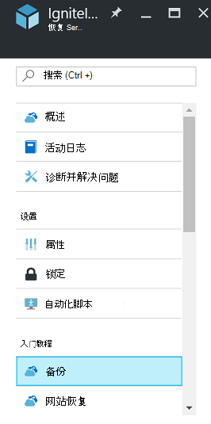

<properties
   pageTitle="备份和还原加密的虚拟机使用 Azure 备份"
   description="这篇文章谈到备份和恢复经验为虚拟机加密使用 Azure 磁盘加密。"
   services="backup"
   documentationCenter=""
   authors="JPallavi"
   manager="vijayts"
   editor=""/>
<tags
   ms.service="backup"
   ms.devlang="na"
   ms.topic="article"
   ms.tgt_pltfrm="na"
   ms.workload="storage-backup-recovery"
   ms.date="10/25/2016"
   ms.author="markgal; jimpark; trinadhk"/>

# 备份和还原加密的虚拟机使用 Azure 备份

这篇文章谈到备份和恢复使用 Azure 备份虚拟机的步骤。 它还提供有关受支持的方案、 必备组件，以及故障排除步骤的详细信息的错误情况。

## 受支持的方案

> [AZURE.NOTE]
1.  资源管理器部署的虚拟机仅用于支持加密的虚拟机的备份和恢复。 不支持传统的虚拟机。  
2.  它仅支持使用 BitLocker 加密密钥和密钥加密密钥加密的虚拟机。 不支持虚拟机仅使用 BitLocker 加密密钥加密。  

## 必备组件

1.  已使用[Azure 磁盘加密](../security/azure-security-disk-encryption.md)加密的虚拟机。 应加密使用 BitLocker 加密密钥和密钥加密密钥。
2.  已创建恢复服务存储库和存储复制设置使用文章[准备您的备份环境](backup-azure-arm-vms-prepare.md)中所提到的步骤。

## 备份加密的虚拟机
使用以下步骤来设置备份目标、 定义策略、 配置项和触发备份。

### 配置备份

1. 如果您已打开一个恢复服务电子仓库，请继续执行下一步。 如果没有打开，保险存储恢复服务，但又在 Azure 的门户中，在中心菜单上，单击**浏览**。

  - 在资源的列表中，键入**恢复服务**。
  - 在您开始键入时，列表筛选器根据您的输入。 当您看到**恢复服务存储库**时，请单击它。
  
        

    恢复服务存储库列表中的出现。 从恢复服务存储库列表中，选择存储库。

    所选电子仓库操控板打开。

2. 从列表中的项目显示在存储库下，单击要打开备份刀片式服务器的**备份**。

       
    
3. 在备份刀片式服务器，请单击打开备份目标刀片式服务器的**备份目标**。

       
    
4.   在备份目标刀片式服务器，设置**在运行您的负载**到 Azure 和**您要备份**到虚拟机，然后单击**确定**。

    备份目标刀片式服务器关闭并打开备份策略刀片式服务器。

       

5. 备份策略刀片式服务器，选择要应用于该存储库并单击**确定**的备份策略。

       

    详细信息中列出了默认策略的详细信息。 如果您想要创建一个策略，选择**新建从下拉菜单。** 当您单击**确定**时，备份策略是与该存储库相关联。

    下一步选择要存储库相关联的 Vm。
    
6. 选择加密的虚拟机，以指定的策略相关联，然后单击**确定**。

      
   
7. 此页显示有关密钥存储库选择加密的虚拟机相关联的消息。 备份服务需要只读访问的密钥和密钥存储库中的机密信息。 它使用这些备份的密钥和密钥，以及相关联的虚拟机的权限。 

      

      现在，您已经定义保险存储，备份刀片式服务器中的所有设置请都单击底部的页上启用备份。 启用备份到该存储库和虚拟机部署策略。

8. 在准备中的下一个阶段安装虚拟机代理或确保 VM 代理安装。 若要执行相同的操作，使用文章[准备您的备份环境](backup-azure-arm-vms-prepare.md)中所提到的步骤。 

### 触发备份作业
使用触发器备份作业的[备份与恢复服务存储库的 Azure Vm](backup-azure-arm-vms.md)文章中所提到的步骤。

## 还原加密的虚拟机
加密和非加密的虚拟机还原体验是相同的。 使用[还原 Azure 门户中的虚拟机](backup-azure-arm-restore-vms.md)中提到的步骤来恢复加密的虚拟机。 以防您需要还原密钥和机密信息，则必须确保该密钥存储库，以将它们还原应该存在。

## 解决错误

| 操作 | 错误详细信息 | 解析 |
| -------- | -------- | -------|
| 备份 | 验证失败，因为虚拟机使用单独的 BEK 进行加密。 备份只适用与 BEK 和 KEK 加密的虚拟机。 | 应该使用 BEK 和 KEK 加密的虚拟机。 在此之后，应启用备份。 |
| 还原 | 无法还原此加密的虚拟机，因为不存在与此虚拟机相关联的密钥存储库。 | 创建密钥存储库使用[入门 Azure 密钥存储库](../key-vault/key-vault-get-started.md)。 请参阅文章[还原密钥存储库的密钥和密钥使用 Azure 备份](backup-azure-restore-key-secret.md)恢复密钥和密码，如果它们不存在。 |
| 还原 | 由于不存在密钥和密码与此虚拟机相关联，则无法还原此加密的虚拟机。 | 请参阅文章[还原密钥存储库的密钥和密钥使用 Azure 备份](backup-azure-restore-key-secret.md)恢复密钥和密码，如果它们不存在。 |
