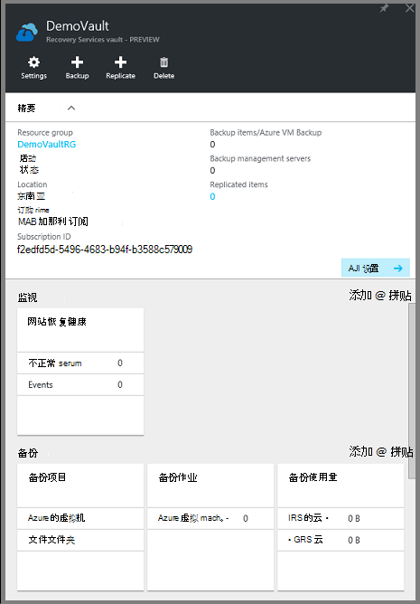
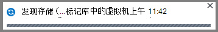
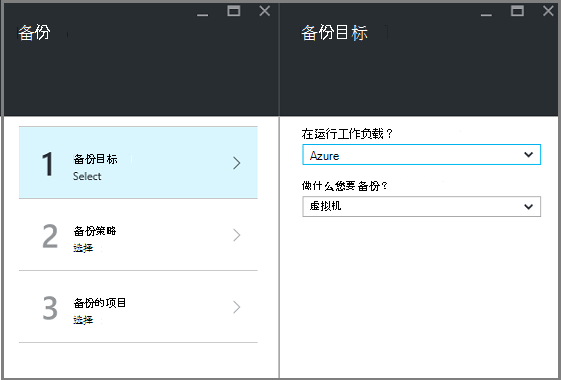
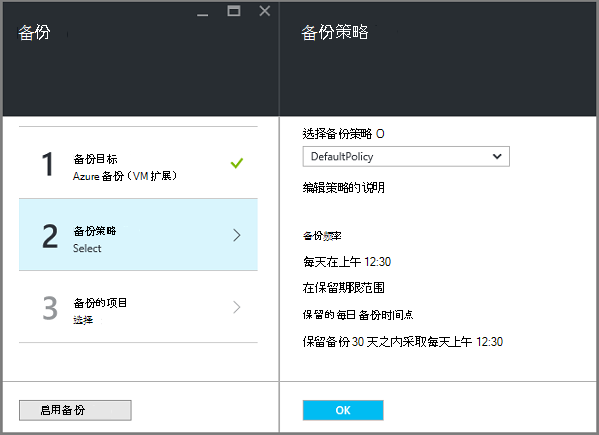
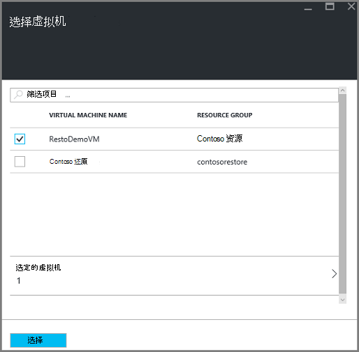
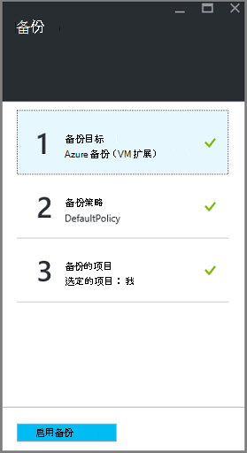
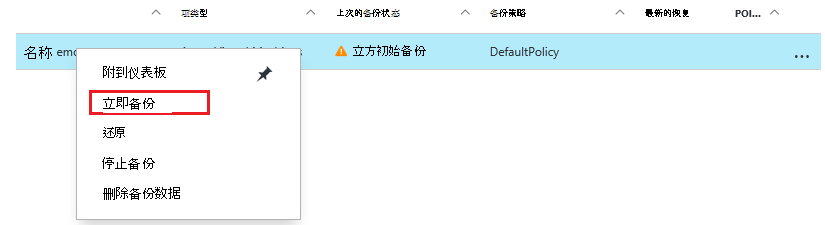
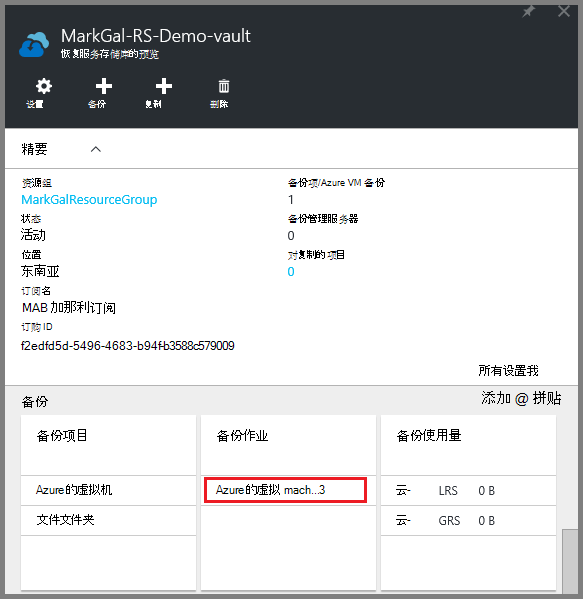

<properties
    pageTitle="先睹为快︰ 保护与恢复服务电子仓库的 Azure Vm |Microsoft Azure"
    description="保护与恢复服务电子仓库 Azure 的虚拟机。 使用资源管理器部署的虚拟机、 经典部署虚拟机和高级存储虚拟机的备份来保护您的数据。 创建并注册一个恢复服务的电子仓库。 注册虚拟机，创建策略，并保护在 Azure 中的虚拟机。"
    services="backup"
    documentationCenter=""
    authors="markgalioto"
    manager="cfreeman"
    editor=""
    keyword="backups; vm backup"/>

<tags
    ms.service="backup"
    ms.workload="storage-backup-recovery"
    ms.tgt_pltfrm="na"
    ms.devlang="na"
    ms.topic="hero-article"
    ms.date="10/13/2016"
    ms.author="markgal; jimpark"/>

# 先睹为快︰ 保护与恢复服务电子仓库的 Azure 的虚拟机

> [AZURE.SELECTOR]
- [保护虚拟机与恢复服务电子仓库](backup-azure-vms-first-look-arm.md)
- [保护虚拟机备份存储库](backup-azure-vms-first-look.md)

本教程将指导您完成创建恢复服务存储库和备份 Azure 的虚拟机 (VM) 的步骤。 保护恢复服务存储库︰

- Azure 的资源管理器部署虚拟机
- 经典的虚拟机
- 标准的存储的虚拟机
- 高级存储的虚拟机
- 与 BEK 和 KEK 使用 Azure 磁盘加密、 加密的虚拟机

有关保护高级存储虚拟机的详细信息，请参阅[备份和恢复高级存储的虚拟机](backup-introduction-to-azure-backup.md#back-up-and-restore-premium-storage-vms)

>[AZURE.NOTE] 本教程假设您 Azure 的订阅中已经有虚拟机和您采取措施，以允许访问 VM 备份服务。

[AZURE.INCLUDE [learn-about-Azure-Backup-deployment-models](../../includes/backup-deployment-models.md)]

在高级别上，下面是您将完成的步骤。  

1. 为虚拟机创建恢复服务存储库。
2. 使用 Azure 门户网站选择方案、 设置策略，并确定要保护的项目。
3. 运行初始备份。

## 为虚拟机创建恢复服务存储库

恢复服务存储库是存储的所有备份和恢复点随着时间的推移已创建的实体。 恢复服务存储库还包含应用于受保护的虚拟机的备份策略。

>[AZURE.NOTE] 备份虚拟机是本地进程。 您不能备份虚拟机从一个位置到另一位置恢复服务存储库。 因此，对于具有 Vm 备份每个 Azure 位置，至少一个恢复服务存储库必须存在于该位置。

若要创建一个恢复服务存储库︰

1. 登录到[Azure 的门户](https://portal.azure.com/)。

2. 中心的菜单上，单击**浏览**，在资源的列表中，键入**恢复服务**。 在您开始键入时，列表筛选器根据您的输入。 单击**恢复服务存储库**。

      

    恢复服务存储库列表中的显示。

3. 在**恢复服务存储库**菜单上，单击**添加**。

    

    恢复服务存储库刀片式服务器将打开，并提示您提供的**名称**、**订阅**、**资源组**和**位置**。

    

4. 对于**名称**，输入好记的名称来标识该存储库。 名称必须是唯一的 Azure 的订阅。 键入包含 2 至 50 个字符的名称。 它必须以字母开头，可以包含字母、 数字和连字符。

5. 单击以查看可用的订阅的**订阅**。 如果您不能确定要使用哪种订阅，使用默认值 （或建议） 订阅。 如果您组织的帐户与多个 Azure 订阅关联，有多个选项。

6. 单击**资源组**来查看可用资源组列表，或单击**新建**以创建资源组。 有关资源组的完整信息，请参阅[Azure 资源管理器概述](../azure-resource-manager/resource-group-overview.md)

7. 单击以选择该存储库的地理区域的**位置**。 保险存储，**必须**是在同一区域作为您想要保护的虚拟机。

    >[AZURE.IMPORTANT] 如果您不确定您的虚拟机所在的位置，存储库创建对话框，关闭并转到门户中的虚拟机的列表。 如果必须在多个区域中的虚拟机，每个区域中创建恢复服务存储库。 在转到下一个位置之前在第一个位置中创建该存储库。 没有必要以指定存储帐户备份数据 — 恢复服务存储库存储和备份 Azure 服务自动处理这。

8. 单击**创建**。 它可能需要一段时间的恢复服务存储库，以创建。 监视在门户上方右侧区域中的状态通知。 创建存储库后，它的恢复服务存储库列表中显示。

    

现在，您已经创建了您的存储库，了解如何设置存储复制。

### 设置存储复制

存储复制选项允许您选择地理冗余存储到本地冗余存储之间。 默认情况下，您的存储库具有地理冗余存储。 保留设置为地理冗余存储，如果这是您主要的备份选项。 如果要为持久不便宜选项，请选择本地冗余存储。 阅读更多关于[地理冗余](../storage/storage-redundancy.md#geo-redundant-storage)和[Azure 存储复制概述](../storage/storage-redundancy.md)中的[本地冗余](../storage/storage-redundancy.md#locally-redundant-storage)存储选项。

若要编辑存储复制设置︰

1. 选择您的存储库，以打开存储库面板，并设置刀片式服务器。 如果未打开刀片式服务器**的设置**，单击存储库面板中的**所有设置**。

2. 在**设置**刀片式服务器，单击**备份基础架构** > 要打开刀片式服务器**备份配置**的**备份配置**。 在**备份配置**刀片式服务器，选择存储复制选项为您的存储库。

    

    在选择了您的存储库的存储选项之后, 您就可以存储库相关联的虚拟机。 若要开始该关联，应发现并注册 Azure 的虚拟机。

## 选择备份目标、 策略设置和定义项保护

在注册之前的保险库中，虚拟机运行搜索过程，以确保已添加到该订阅任何新的虚拟机的标识。 在订阅中，及其他信息的虚拟机的列表处理查询 Azure 如云服务名称和地区。 在 Azure 的门户中，方案指的是您要放在恢复服务存储库。 策略是频率以及何时被采取恢复点的计划。 策略还包含恢复点的保留范围。

1. 如果您已打开保险存储恢复服务，请继续步骤 2。 如果您没有的恢复服务保险打开，但在 Azure 的门户，在中心菜单上，单击**浏览**。

  - 在资源的列表中，键入**恢复服务**。
  - 在您开始键入时，列表筛选器根据您的输入。 当您看到**恢复服务存储库**时，请单击它。

      

    恢复服务存储库列表中的出现。
  - 从恢复服务存储库列表中，选择存储库。

    所选电子仓库操控板打开。

    

2. 从存储库面板菜单中，单击要打开备份刀片式服务器的**备份**。

    

    当打开刀片式服务器时，备份服务搜索订阅中任何新的虚拟机。

    

3. 在备份刀片式服务器，请单击打开备份目标刀片式服务器的**备份目标**。

    

4. 在备份目标刀片式服务器，设置**在运行您的负载**到 Azure 和**您要备份**到虚拟机，然后单击**确定**。

    备份目标刀片式服务器关闭并打开备份策略刀片式服务器。

    

5. 备份策略刀片式服务器，选择要应用于该存储库并单击**确定**的备份策略。

    

    详细信息中列出了默认策略的详细信息。 如果您想要创建一个策略，选择**新建从下拉菜单。** 下拉菜单中还提供了一个选项来切换时拍摄快照，到下午 7 点的时间。 有关定义的备份策略的说明，请参阅[定义的备份策略](backup-azure-vms-first-look-arm.md#defining-a-backup-policy)。 当您单击**确定**时，备份策略是与该存储库相关联。

    下一步选择要存储库相关联的 Vm。

6. 选择虚拟机指定的策略相关联，并单击**选择**。

    

    如果看不到所需的虚拟机，检查它存在相同的 Azure 恢复服务存储库位置中。

7. 现在，您已经定义保险存储，备份刀片式服务器中的所有设置请都单击底部的页上**启用备份**。 这将策略部署到该存储库和虚拟机。

    

## 初始备份

在虚拟机上，并不意味着在部署的备份策略后数据已备份。 默认情况下，第一个计划的备份 （在备份策略中定义） 为初始备份。 直到初始备份时，**备份作业**刀片上上次的备份状态将显示为**警告 （初始备份挂起）**。

除非您初始备份的截止日期即将开始，建议您**立即备份**运行。

若要运行**立即备份**:

1. 在存储库操控板上**备份**拼贴，请单击**Azure 的虚拟机**  
    

    打开**备份项**刀片式服务器。

2. 在**备份项**刀片式服务器，右键单击想要备份该存储的库并单击**立即备份**。

    

    触发备份作业。  

    

3. 若要查看您的初始备份已完成，在存储库面板在**备份作业**图块上，单击**Azure 的虚拟机**。

    

    打开备份作业刀片式服务器。

4. 在备份作业刀片式服务器，您可以看到所有作业的状态。

    

    >[AZURE.NOTE] 作为备份操作的一部分，备份 Azure 服务到备份扩展每个虚拟机将刷新所有写操作，并采取一致的快照中发出命令。

    备份作业完成后，状态为*已完成*。

[AZURE.INCLUDE [backup-create-backup-policy-for-vm](../../includes/backup-create-backup-policy-for-vm.md)]

## 在虚拟机上安装虚拟机代理

在需要的情况下提供此信息。 必须为备份扩展工作 Azure 的虚拟机上安装 Azure VM 代理。 但是，如果您的虚拟机创建从 Azure 的库，然后 VM 代理已存在虚拟机上。 迁移从内部数据中心将不具有虚拟机安装代理的虚拟机。 在这种情况下，需要安装虚拟机代理。 如果有备份 Azure VM 的问题，检查 Azure VM 代理已正确安装在虚拟机上 （请参见下表）。 如果您创建一个自定义的虚拟机，且配置虚拟机之前[确保**安装虚拟机代理**复选框处于选中状态](../virtual-machines/virtual-machines-windows-classic-agents-and-extensions.md)。

了解有关[VM 代理](https://go.microsoft.com/fwLink/?LinkID=390493&clcid=0x409)以及[如何安装它](../virtual-machines/virtual-machines-windows-classic-manage-extensions.md)。

下表提供了有关 VM 代理为 Windows 和 Linux 虚拟机的附加信息。

| **操作** | **窗口** | **Linux** |
| --- | --- | --- |
| 安装虚拟机代理 | <li>下载并安装[代理 MSI](http://go.microsoft.com/fwlink/?LinkID=394789&clcid=0x409)。 您需要管理员权限才能完成安装。 <li>[更新虚拟机的属性](http://blogs.msdn.com/b/mast/archive/2014/04/08/install-the-vm-agent-on-an-existing-azure-vm.aspx)，以指示已安装代理。 | <li> 从 GitHub 安装最新的[Linux 代理](https://github.com/Azure/WALinuxAgent)。 您需要管理员权限才能完成安装。 <li> [更新虚拟机的属性](http://blogs.msdn.com/b/mast/archive/2014/04/08/install-the-vm-agent-on-an-existing-azure-vm.aspx)，以指示已安装代理。 |
| 正在更新虚拟机代理 | 更新虚拟机代理是简单，只需重新安装[虚拟机代理的二进制文件](http://go.microsoft.com/fwlink/?LinkID=394789&clcid=0x409)。  确保 VM 代理更新时运行任何备份操作。 | 按照说明[更新 Linux 虚拟机代理](../virtual-machines-linux-update-agent.md)。  确保 VM 代理更新时运行任何备份操作。 |
| 正在验证虚拟机代理安装 | <li>导航到 Azure VM 中的*C:\WindowsAzure\Packages*文件夹。 <li>您应该发现存在 WaAppAgent.exe 文件。<li> 用鼠标右键单击该文件，转到**属性**，然后选择**详细信息**选项卡。 产品版本字段应为 2.6.1198.718 或更高版本。 | N/A |

### 备份扩展名

一旦在虚拟机上安装了 VM 代理，Azure 备份服务将安装到虚拟机代理备份扩展名。 备份 Azure 服务无缝升级和修补程序的扩展名为备份而无需用户干预。

备份服务是否正在运行 VM 安装备份扩展名。 一个正在运行的虚拟机提供了最大的机会获取应用程序一致性的恢复点。 但是，Azure 备份服务将继续备份 VM，即使它关闭，而不能安装该扩展。 这被称为脱机虚拟机。 在这种情况下，恢复点将*崩溃一致*。

## 故障排除信息
如果必须完成的一些任务在这篇文章中的问题，请参阅[故障排除指南](backup-azure-vms-troubleshoot.md)。

## 定价
Azure VM 备份将收取根据受保护实例模型。 了解更多有关[备份价格](https://azure.microsoft.com/pricing/details/backup/)

## 问题？
如果您有问题，或[向我们发送反馈](http://aka.ms/azurebackup_feedback)您想要查看包含，任何功能。
