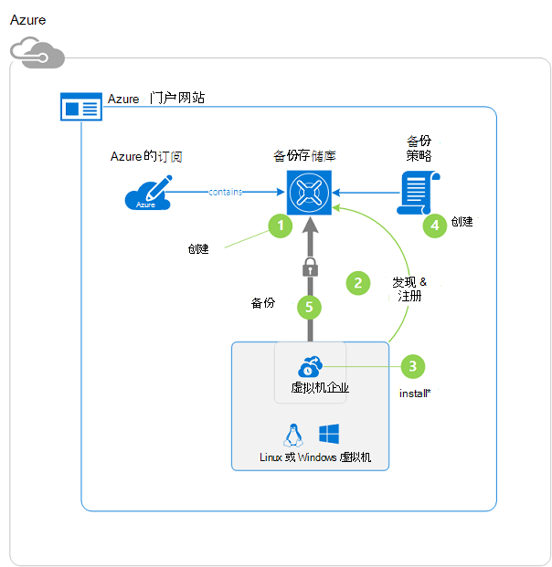
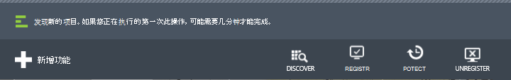
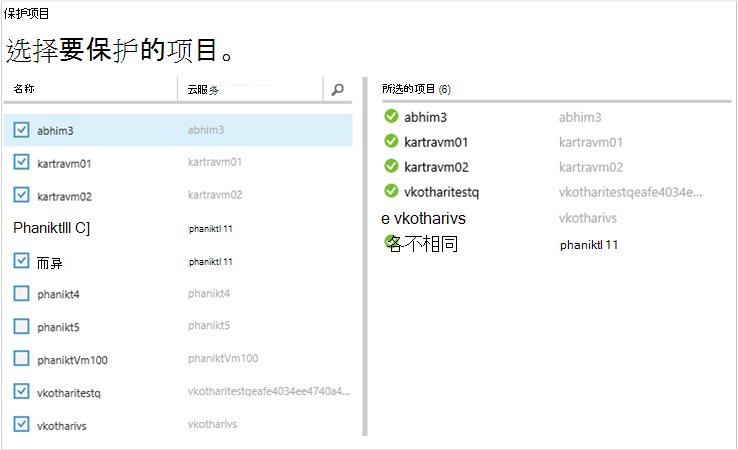
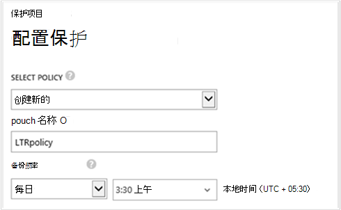
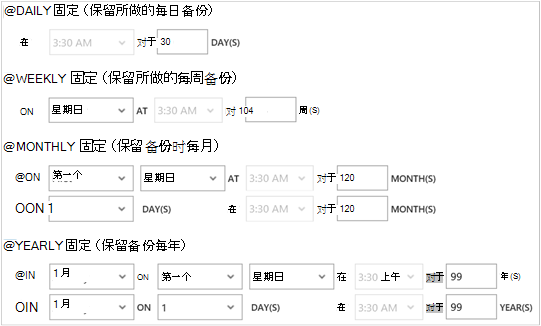

<properties
    pageTitle="先睹为快︰ 保护 Azure Vm 备份存储库与 |Microsoft Azure"
    description="与备份存储库来保护 Azure 的虚拟机。 教程说明创建存储库、 注册虚拟机、 创建策略和保护在 Azure 中的虚拟机。"
    services="backup"
    documentationCenter=""
    authors="markgalioto"
    manager="cfreeman"
    editor=""/>

<tags
    ms.service="backup"
    ms.workload="storage-backup-recovery"
    ms.tgt_pltfrm="na"
    ms.devlang="na"
    ms.topic="hero-article"
    ms.date="09/15/2016"
    ms.author="markgal; jimpark"/>

# 先睹为快︰ 备份 Azure 的虚拟机

> [AZURE.SELECTOR]
- [保护虚拟机与恢复服务电子仓库](backup-azure-vms-first-look-arm.md)
- [保护备份存储库使用 Azure 的虚拟机](backup-azure-vms-first-look.md)

本教程将引导您逐步的 Azure 的虚拟机 (VM) 备份到 Azure 中备份存储库。 本文介绍了经典模式或服务管理器部署模型，用于备份虚拟机。 如果您有兴趣备份虚拟机到所属的资源组故障恢复服务存储库，请参阅[先睹为快︰ 保护与恢复服务保险存储的虚拟机](backup-azure-vms-first-look-arm.md)。 若要成功完成本教程，必须满足这些系统必备组件︰

- 在 Azure 订购，您已创建虚拟机。
- VM 都有到 Azure 的公用 IP 地址的连接。 有关其他信息，请参阅[网络连接](./backup-azure-vms-prepare.md#network-connectivity)。

若要备份一个虚拟机，有五个主要步骤︰  

创建备份存储库或标识现有备份存储库。  
使用 Azure 传统门户网站发现并注册虚拟机。  
安装虚拟机代理。  
创建的策略保护虚拟机。  
运行备份。

>[AZURE.NOTE] Azure 具有用于创建和使用资源的两种部署模型︰[资源管理器和经典](../resource-manager-deployment-model.md)。 本教程是使用虚拟机可以在 Azure 传统门户网站中创建的。 Azure 备份服务支持基于资源管理器的虚拟机。 备份虚拟机到恢复服务存储库的详细信息，请参阅[第一个查找范围︰ 保护与恢复服务保险存储的虚拟机](backup-azure-vms-first-look-arm.md)。

## 步骤 1-创建一个虚拟机备份存储库

备份存储库是存储的所有备份和恢复点随着时间的推移已创建的实体。 备份存储库还包含应用于备份虚拟机的备份策略。

1. 登录到[Azure 经典的门户](http://manage.windowsazure.com/)。

2. 在 Azure 门户的左下角，单击**新建**

    

3. 在快速创建向导中，单击**数据服务** > **恢复服务** > **备份存储库** > **快速创建**。

    

    向导会提示您输入**名称**和**区域**。 如果管理多个订阅，请选择订阅对话框出现。

4. 对于**名称**，输入好记的名称来标识该存储库。 名称必须是唯一的 Azure 的订阅。

5. 在**区域**中，选择该存储库的地理区域。 保险存储，**必须**是在同一区域，作为其保护虚拟机。

    如果您不知道您的虚拟机所在的区域，关闭此向导并单击**虚拟机**的 Azure 服务列表中。 位置列提供的区域的名称。 如果必须在多个区域中的虚拟机，每个区域中创建备份的存储库。

6. 如果在该向导中没有**订阅**对话框，请跳过下一步。 如果您使用多个订阅，则选择与新的备份存储库相关联的订阅。

    

7. 单击**创建存储库**。 它可以需要备份的存储库，以创建一段时间。 监视入口的底部的状态通知。

    

    一条消息，确认已成功创建存储库。 为**活动状态**，它将列在**恢复服务**页。

    

8. 在**恢复服务**页上的存储库列表中，选择存储库创建的用来启动的**快速启动**页。

    

9. 在**快速启动**页上，单击**配置**以打开存储复制选项。
    

10. **存储复制**选项中，选择复制选项为您的存储库。

    

    默认情况下，您的存储库具有地理冗余存储。 如果这是您主要的备份，请选择地理冗余存储。 如果希望不是很一样持久便宜选项，请选择本地冗余存储。 了解有关在[Azure 存储复制概述](../storage/storage-redundancy.md)地理冗余和本地冗余存储选项详细信息。

在选择了您的存储库的存储选项之后, 您就可以存储库相关联的虚拟机。 若要开始该关联，发现并注册 Azure 的虚拟机。

## 步骤 2-发现并注册 Azure 的虚拟机
在存储库中注册 VM 之前, 先运行识别任何新的虚拟机的发现过程。 这将返回在订阅中，类似的云服务名称和该区域的其他信息以及虚拟机的列表。

1. 登录到[Azure 经典门户](http://manage.windowsazure.com/)

2. 在 Azure 经典门户中，单击**恢复服务**以打开恢复服务存储库列表中的。
    

3. 从存储库列表中，选择要备份一个虚拟机的电子仓库。

    当您选择您的存储库时，则在**快速启动**页中打开

4. 从存储库菜单中，单击**注册项**。

    

5. 从**类型**菜单中，选择**Azure 虚拟机**。

    

6. 单击页面底部的**探索**。
    

    搜索过程可能需要几分钟，虽然在表格中的虚拟机。 没有一个通知告诉您该进程运行在屏幕的底部。

    

    通知更改过程后完成。

    

7. 单击页面底部的**注册**。
    

8. 在**注册项**的快捷菜单中，选择要注册的虚拟机。

    >[AZURE.TIP] 可以一次注册多个虚拟机。

    对于每个所选的虚拟机将创建一个作业。

9. 通知以转到**作业**页中，单击**查看作业**。

    

    虚拟机也会出现在列表中已登记的物料，以及注册操作的状态。

    

    在操作完成时，则状态将更改以反映的*注册*状态。

    

## 步骤 3-虚拟机上安装虚拟机代理

必须为备份扩展工作 Azure 的虚拟机上安装 Azure VM 代理。 如果 VM 已创建从 Azure 库，VM 代理已在虚拟机上。 为[保护您的虚拟机](backup-azure-vms-first-look.md#step-4-protect-azure-virtual-machines)，则可以跳过。

如果从内部数据中心迁移 VM，VM 可能没有安装 VM 代理。 您必须之前来保护虚拟机虚拟机上安装虚拟机代理。 安装虚拟机代理的详细步骤，请参见[VM 代理备份 Vm 文章部分](backup-azure-vms-prepare.md#vm-agent)。

## 第 4 步-创建的备份策略
备份快照时，触发初始备份作业之前，设置日程安排。 计划备份的快照，并长时间这些快照保留、 备份策略。 保留的信息取决于祖父-父-子备份循环方案。

1. 导航到备份下**恢复服务**存储库在 Azure 经典的门户中，然后单击**注册项**。
2. 从下拉菜单中选择**Azure 的虚拟机**。

    

3. 单击页面底部的**保护**。
    

    **保护项目向导**出现，其中列出*只*是注册并不受保护的虚拟机。

    

4. 选择包含您想要保护的虚拟机。

    如果存在具有相同名称的两个或多个虚拟机，可以使用云服务虚拟机之间进行区分。

5. **配置保护**菜单上选择现有策略或创建新的策略来保护您标识虚拟机。

    新的备份存储库具有与存储库相关联的默认策略。 这个策略在使用快照每个晚上，每日，每日快照保留 30 天。 每个备份策略可以有多个与之相关联的虚拟机。 然而，虚拟机只能与一个策略一次。

    

    >[AZURE.NOTE] 备份策略包括用于定时备份的保留方案。 如果您选择一个现有的备份策略，您将无法修改的下一步的保留选项。

6. 在**保留期限范围**定义对于特定的备份点每日、 每周、 每月和每年的范围。

    

    保留策略指定用于存储备份的时间的长度。 您可以指定在进行备份时根据不同的保留策略。

7. 单击要查看的**配置保护**作业列表的**作业**。

    

    现在，您已经建立了策略，请转到下一步并运行初始备份。

## 第 5 步-初始备份

一旦虚拟机处于保护状态的策略，可以在**受保护的项**选项卡上查看该关系。 初始备份之前，**保护状态**将显示为**受保护的 （等待初始备份）**。 默认情况下，第一次定时的备份是*初始备份*。

立即启动初始备份︰

1. 在**受保护的项**页上，单击**立即备份**页面底部。
    

    备份 Azure 服务创建初始备份操作的备份作业。

2. 单击**作业**选项卡以查看作业的列表。

    

    初始备份完成后，**受保护的项**选项卡中的虚拟机的状态是*受保护*。

    

    >[AZURE.NOTE] 备份虚拟机是本地进程。 您不能备份虚拟机从一个地区到另一个区域中备份存储库。 因此，需要进行备份的 Vm 都有每个 Azure 所在地区，至少一个备份存储库必须在创建该区域。

## 下一步行动
成功备份虚拟机，则就几个感兴趣的可能的下一步行动。 最合乎逻辑的步骤是熟悉使用将数据还原到虚拟机。 不过，有将帮助您了解如何保护您的数据安全和最小化成本的管理任务。

- [管理和监视您的虚拟机](backup-azure-manage-vms.md)
- [还原虚拟机](backup-azure-restore-vms.md)
- [故障排除指南](backup-azure-vms-troubleshoot.md)

## 问题？
如果您有问题，或[向我们发送反馈](http://aka.ms/azurebackup_feedback)您想要查看包含，任何功能。
