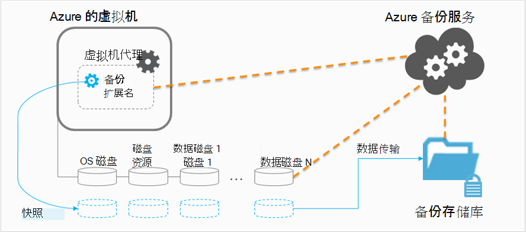

<properties
    pageTitle="规划虚拟机备份基础结构在 Azure |Microsoft Azure"
    description="计划备份虚拟机在 Azure 时的重要注意事项"
    services="backup"
    documentationCenter=""
    authors="markgalioto"
    manager="cfreeman"
    editor=""
    keywords="备份虚拟机的备份虚拟机"/>

<tags
    ms.service="backup"
    ms.workload="storage-backup-recovery"
    ms.tgt_pltfrm="na"
    ms.devlang="na"
    ms.topic="article"
    ms.date="10/19/2016"
    ms.author="trinadhk; jimpark; markgal;"/>

# <a name="plan-your-vm-backup-infrastructure-in-azure"></a>计划在 Azure VM 备份基础架构
本文提供了性能和资源以帮助您规划您的 VM 备份基础架构的建议。 它还定义了关键方面的备份服务;这些方面可以是确定您的体系结构，关键容量规划和时间安排。 如果您已经[准备好您的环境](backup-azure-vms-prepare.md)，这是下一步之前首先[备份虚拟机](backup-azure-vms.md)。 如果您需要有关 Azure 的虚拟机的详细信息，请参阅[虚拟机文档](https://azure.microsoft.com/documentation/services/virtual-machines/)。

## <a name="how-does-azure-back-up-virtual-machines"></a>如何进行 Azure 备份虚拟机？
当 Azure 备份服务启动备份作业在预定的时间时，就会引发快照的时间点备份扩展名。 此快照采取协调与卷影复制服务 (VSS) 在虚拟机中获得一致的快照的磁盘，而无需将其关闭。

在拍摄快照后，数据由备份 Azure 服务传输到备份存储库中。 以提高备份过程的效率，服务标识，并将仅有自上次备份以来更改的数据块传输。



完成数据传输时，快照将被删除并创建一个恢复点。

### <a name="data-consistency"></a>数据一致性
正在运行备份和恢复关键数据很复杂的一个事实，即必须备份业务关键型数据的应用程序生成数据时的业务。 若要解决此问题，Azure 备份提供了应用程序一致性的备份对于 Microsoft 工作负载使用 VSS 要确保数据正确写入存储。

>[AZURE.NOTE] 对于 Linux 虚拟机，只有文件一致的备份是可能的由于 Linux 没有到 VSS 等效平台

Azure 的备份将 VSS 完整备份 Windows 虚拟机 （了解更多关于[VSS 完整备份](http://blogs.technet.com/b/filecab/archive/2008/05/21/what-is-the-difference-between-vss-full-backup-and-vss-copy-backup-in-windows-server-2008.aspx)）。 若要启用 VSS 复制备份，下面注册表项需要在 VM 上设置。

```
[HKEY_LOCAL_MACHINE\SOFTWARE\MICROSOFT\BCDRAGENT]
"USEVSSCOPYBACKUP"="TRUE"
```


此表说明的类型的一致性和 Azure 虚拟机过程中出现在下的条件备份和恢复过程。

| 一致性 | 基于 VSS 的 | 解释和详细信息 |
|-------------|-----------|---------|
| 应用程序一致性 | 是的 | 这是 Microsoft 工作负载的理想选择一致性类型，因为它可确保︰<ol><li> *启动*虚拟机。 <li>没有*任何损坏*。 <li>不没有*丢失任何数据*。<li> 数据的一致性，给应用程序使用数据，涉及时应用程序的备份 — 使用 vss。</ol> 大多数 Microsoft 工作负荷有 VSS 编写器执行特定工作负载的操作相关的数据的一致性。 例如，Microsoft SQL Server 有 VSS 编写器，可确保事务日志文件和数据库的写入操作都正确完成。<br><br> 对于 Azure VM 备份，获取应用程序一致性恢复点意味着备份扩展名时能够调用 VSS 工作流和 VM 快照之前*正确*完成。 当然，这意味着已同时调用 VSS 编写器的 Azure VM 中的所有应用程序。<br><br>（ [VSS 的基础知识](http://blogs.technet.com/b/josebda/archive/2007/10/10/the-basics-of-the-volume-shadow-copy-service-vss.aspx)的学习和深入了解[它是如何工作](https://technet.microsoft.com/library/cc785914%28v=ws.10%29.aspx)的详细信息）。 |
| 文件系统的一致性 | 是的-对于基于 Windows 的计算机 | 有两个方案其中恢复点可以是*文件系统的一致性*︰<ul><li>Linux 在 Azure，由于 Linux 没有到 VSS 等效平台中的虚拟机的备份<li>VSS 在 Windows Azure 中的虚拟机的备份过程中的故障。</li></ul> 以下两种情况下，最好的可以完成的任务是确保︰ <ol><li> *启动*虚拟机。 <li>没有*任何损坏*。<li>不没有*丢失任何数据*。</ol> 应用程序需要还原的数据在实现自己"修复"机制。|
| 故障一致性 | 不 | 这种情况等同于虚拟机出现"崩溃"（通过软或硬复位）。 这通常发生在 Azure 的虚拟机关闭时备份的时间。 对于 Azure 虚拟机备份，获取故障一致性恢复点意味着该 Azure 备份提供不保证数据的一致性有关的存储介质，从操作系统的角度来看，也可以从应用程序的角度来看。 只有在备份磁盘已存在的数据是什么获取捕获和备份。 <br/> <br/> 虽然不能保证，在大多数情况下，将启动操作系统。 这通常被跟磁盘检查过程中，类似 chkdsk，要修复任何损坏错误。 任何内存中的数据或不完全刷新到磁盘的写入操作将会丢失。 在需要执行数据回滚的情况下，应用程序通常遵循具有其自己的验证机制。 <br><br>举一个例子，如果事务日志条目不只存在于数据库中，然后数据库软件执行回退直到数据是一致的。 当数据分散在多个虚拟磁盘 （如跨区卷） 时，崩溃一致的恢复点提供不能保证数据的正确性。|


## <a name="performance-and-resource-utilization"></a>性能和资源利用率
像是已部署的内部部署的备份软件，您应该规划容量和资源利用率需要备份虚拟机在 Azure 时。 [Azure 存储限制](azure-subscription-service-limits.md#storage-limits)定义如何构建 VM 部署以获得最大性能运行工作负载的影响最小。

规划备份性能时，请特别注意以下的 Azure 存储限制︰

- 每个存储帐户的最大出口
- 每个存储帐户的总请求速率

### <a name="storage-account-limits"></a>存储帐户限制
只要备份数据从一个存储帐户复制，它都将计入每秒钟 (IOPS) 和出口 （或吞吐量） 的输入/输出操作的存储帐户的指标。 同时，虚拟机正在运行，并且消耗 IOPS 和吞吐量。 目标是确保不超过总的流量-备份和虚拟机的存储帐户限制。

### <a name="number-of-disks"></a>磁盘数
备份过程将尝试尽可能快地完成备份作业。 这样做的时候，它会占用尽可能多的资源，因为它可以。 但是，所有的 I/O 操作被限制*单个 Blob 的目标吞吐量*，其中有 60 MB / 秒的限制。 在试图最大化其速度，尝试备份每个虚拟机的磁盘*并行*备份过程。 因此，如果虚拟机有四个磁盘，然后尝试为 Azure 备份备份并行的所有四个磁盘。 正因为如此，最重要的因素，确定退出客户存储帐户的备份通信量**的磁盘数**正在备份存储帐户。

### <a name="backup-schedule"></a>备份计划
影响性能的另一个因素是**备份时间表**。 如果您配置策略，以便同时备份所有的虚拟机，您安排了交通堵塞。 备份过程将尝试备份并行的所有磁盘。 减少备份数据流量从一个存储客户的一种方法 — 确保不同虚拟机备份在不同的时间，一天，没有重叠。

## <a name="capacity-planning"></a>容量规划
将所有这些因素放在一起意味着存储帐户的使用需要进行正确的规划。 下载[虚拟机备份容量规划 Excel 电子表格](https://gallery.technet.microsoft.com/Azure-Backup-Storage-a46d7e33)以查看磁盘和备份计划选项的影响。

### <a name="backup-throughput"></a>备份吞吐量
对于每个要备份的磁盘，Azure 备份读取磁盘上的块，并将存储只将更改的数据 （增量备份）。 下表显示了您可以期望从 Azure 备份平均吞吐量值。 利用这一点，可以估计将花费一个给定大小的磁盘备份的时间量。

| 备份操作 | 最佳吞吐量 |
| ---------------- | ---------- |
| 初始备份 | 160 Mbps |
| 增量备份 (DR) | 640 Mbps <br><br> 如果没有大量需要备份该磁盘上的分散改动，此吞吐量可以显著下降。 |

## <a name="total-vm-backup-time"></a>总的 VM 备份时间
虽然大部分的备份时间花费在阅读和复制数据，有备份虚拟机所需的总时间为提供其他操作︰

- [安装或更新备份扩展](backup-azure-vms.md#offline-vms)所需的时间。
- 快照时，将触发一个快照所需的时间。 计划的备份时间接近，将触发快照。
- 排队等待时间。 由于备份服务正在处理从多个客户的备份时，将备份数据从快照复制到备份或恢复服务存储库可能不会立即启动。 在高峰期的时间加载，等待可以拉伸由于备份处理的数量多达 8 个小时。 但是，总的 VM 备份时间将不超过 24 小时，每日的备份策略。

## <a name="best-practices"></a>最佳做法
我们建议您遵循这些做法配置虚拟机的备份时︰

- 不计划超过四个经典的虚拟机从相同的云服务，备份一次。 建议的备份启动时间错开一小时，如果您想要从同一个云服务备份多个 Vm。
- 不要安排 40 多个资源管理器部署虚拟机备份一次。
- 在非高峰时间安排虚拟机备份，以便备份服务将 IOPS 用于将数据从客户存储帐户转移到备份或恢复服务保险。
- 确保策略，解决跨不同的存储帐户的虚拟机。 建议不超过 20 个策略来保护从单个存储帐户的总磁盘。 如果您有大于 20 个磁盘中存储帐户，分布在多个策略来备份过程转移阶段获取必需的 IOPS 这些虚拟机。
- 没有还原到同一个存储帐户高级存储设备上运行的 VM。 如果还原操作过程符合备份操作时，它减少了备份的可用 IOPS。
- 我们建议以确保提供最佳备份性能不同的最优存储帐户上运行每个特优 VM。

## <a name="data-encryption"></a>数据加密

Azure 的备份不加密数据，作为备份过程的一部分。 但是，可以对在虚拟机中的数据进行加密和受保护的数据无缝地备份 （了解更多关于[加密数据的备份](backup-azure-vms-encryption.md)）。


## <a name="how-are-protected-instances-calculated"></a>受保护的实例是如何计算的？
[Azure 备份定价](https://azure.microsoft.com/pricing/details/backup/)受到 azure 通过 Azure 备份备份虚拟机。 受保护实例计算基于虚拟机的虚拟机-不包括"资源磁盘"中的所有数据之和的*实际*大小。

您是*不*计入基于附加到虚拟机，每个数据磁盘支持的最大大小而数据磁盘中存储的实际数据。 同样，备份存储清单基于与 Azure 备份，这每个恢复点中的实际数据之和存储的数据量。

例如，采用 A2 标准大小的虚拟机具有 1 TB 的最大的两个其他数据磁盘。 下表提供了每个这些磁盘上存储的实际数据︰

|磁盘类型|最大大小|实际数据存在|
|---------|--------|------|
| 磁盘操作系统 | 1023 GB | 17 GB |
| 本地磁盘 / 资源磁盘 | 135 GB | 5 GB （不包括用于备份） |
| 数据磁盘 1 | 1023 GB | 30 GB |
| 数据磁盘 2 | 1023 GB | 0 GB |

在这种情况下，虚拟机的*实际*大小是 17 GB + 30 GB + 0 GB = 47 GB。 这将成为基于每月帐单的受保护实例大小。 随着虚拟机中的数据量的增长，保护实例的大小用于计费也将做出相应更改。

第一个成功的备份完成后才启动计费。 在这种情况下，将开始用于存储和保护实例的帐单。 只要虚拟机*与 Azure 备份存储在任何备份数据*会继续付费。 停止保护操作不停止计费如果保留备份数据。

为指定的虚拟计算机的帐单将停止仅保护是否已停止*并*删除任何备份数据。 时没有活动备份作业 （已停止保护） 时，虚拟机在上次成功备份时的大小将成为基于每月帐单的受保护实例大小。

## <a name="questions"></a>问题？
如果您有问题，或[向我们发送反馈](http://aka.ms/azurebackup_feedback)您想要查看包含，任何功能。

## <a name="next-steps"></a>下一步行动

- [备份虚拟机](backup-azure-vms.md)
- [管理虚拟机备份](backup-azure-manage-vms.md)
- [还原虚拟机](backup-azure-restore-vms.md)
- [虚拟机备份问题的疑难解答](backup-azure-vms-troubleshoot.md)
