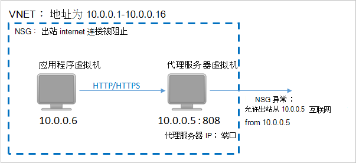
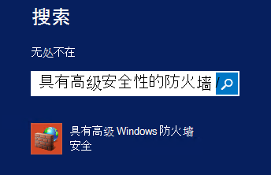
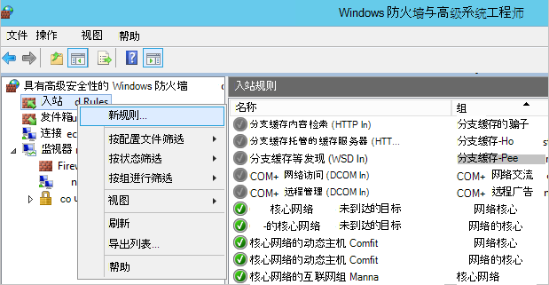

<properties
    pageTitle="准备您的环境以 Azure 虚拟机备份 |Microsoft Azure"
    description="确保您的环境已经做好准备的 Azure 中的虚拟机备份"
    services="backup"
    documentationCenter=""
    authors="markgalioto"
    manager="cfreeman"
    editor=""
    keywords="备份;备份;"/>

<tags
    ms.service="backup"
    ms.workload="storage-backup-recovery"
    ms.tgt_pltfrm="na"
    ms.devlang="na"
    ms.topic="article"
    ms.date="08/26/2016"
    ms.author="trinadhk; jimpark; markgal;"/>


# <a name="prepare-your-environment-to-back-up-azure-virtual-machines"></a>准备您的环境以备份 Azure 的虚拟机

> [AZURE.SELECTOR]
- [资源管理器模型](backup-azure-arm-vms-prepare.md)
- [经典模型](backup-azure-vms-prepare.md)

您可以备份 Azure 的虚拟机 (VM) 之前，有三所必须满足的条件。

- 您需要创建备份存储库或标识现有备份存储库*在您的虚拟机作为同一个地区*。
- 建立 Azure 公用的 Internet 地址和 Azure 存储端点之间的网络连接。
- 在虚拟机上安装虚拟机代理。

如果您知道您的环境中已存在这些条件然后进入[备份您的虚拟机的文章](backup-azure-vms.md)。 否则，继续学习，这篇文章将引导您完成这些步骤来准备您的环境以备份 Azure VM。


## <a name="limitations-when-backing-up-and-restoring-a-vm"></a>备份和还原 VM 时的限制

>[AZURE.NOTE] Azure 具有用于创建和使用资源的两种部署模型︰[资源管理器和经典](../resource-manager-deployment-model.md)。 下面的列表提供了限制时在经典模型中部署。

- 不支持备份与 16 个以上的数据磁盘的虚拟机。
- 不支持备份虚拟机与保留的 IP 地址和任何已定义的终结点。
- 备份数据并不包括安装网络驱动器连接到虚拟机。 
- 不支持在还原期间替换现有的虚拟机。 首先删除现有的虚拟机和相关联的任何磁盘，然后再从备份中还原数据。
- 不支持跨区域的备份和恢复。
- 备份虚拟机使用 Azure 备份服务支持的 Azure 的所有公共区域中 （请参见[清单](https://azure.microsoft.com/regions/#services)的支持的地区）。 如果您正在寻找该地区目前的不受支持，它不会在下拉列表中的电子仓库创建过程。
- 通过使用 Azure 备份服务备份虚拟机仅用于选择操作系统版本支持︰
  - **Linux**: Azure 备份支持除核心操作系统 Linux [，都认可通过 Azure 的分配的列表](../virtual-machines/virtual-machines-linux-endorsed-distros.md)。 其他携带-您的自己的 Linux 发行版本还可能只要 VM 代理的虚拟计算机上可用的工作和支持对于 Python 存在。
  - **Windows Server**︰ 不支持的版本早于 Windows Server 2008 R2。
- 还原域控制器只有通过 PowerShell 支持 (DC) 虚拟机是多 DC 配置的一部分。 了解有关信息[还原多个 DC 域控制器](backup-azure-restore-vms.md#restoring-domain-controller-vms)。
- 只有通过 PowerShell 支持还原虚拟机具有以下特殊的网络配置。 还原操作完成后，您在用户界面中使用还原工作流创建的虚拟机不会有这些网络配置。 若要了解详细信息，请参阅[还原特殊的网络配置的虚拟机](backup-azure-restore-vms.md#restoring-vms-with-special-netwrok-configurations)。
    - 在负载平衡器配置 （内部的和外部的） 下的虚拟机
    - 具有多个保留的 IP 地址的虚拟机
    - 具有多个网络适配器的虚拟机

## <a name="create-a-backup-vault-for-a-vm"></a>为虚拟机创建备份的存储库

备份存储库是存储的所有备份和恢复点随着时间的推移已创建的实体。 备份存储库还包含将应用到虚拟机正在备份的备份策略。

此图显示各个 Azure 备份实体之间的关系︰     

若要创建备份存储库︰

1. 登录到[Azure 的门户](http://manage.windowsazure.com/)。

2. 在 Azure 的门户网站中单击**新建** > **混合集成** > **备份**。 单击**备份**时，将自动切换到经典门户 （后注意所示）。

    

    >[AZURE.NOTE] 如果您的订阅已最后用经典的门户，您的订阅可能会打开经典门户中。 在此情况下，若要创建备份的存储库，请单击**新建** > **数据服务** > **恢复服务** > **备份存储库** > **快速创建**（见下图）。

    

3. 对于**名称**，输入好记的名称来标识该存储库。 名称必须是唯一的 Azure 的订阅。 键入包含 2 至 50 个字符的名称。 它必须以字母开头，可以包含字母、 数字和连字符。

4. 在**区域**中，选择该存储库的地理区域。 该存储库必须是在同一区域作为您想要保护的虚拟机。 如果必须在多个区域中的虚拟机，必须在每个地区创建备份的存储库。 没有必要指定存储帐户存储的备份数据，备份存储库和备份 Azure 服务句柄自动。

5. 在**订阅**中，选择您希望备份的存储库相关联的订阅。 将多个选项，如果您组织的帐户与多个 Azure 订阅关联。

6. 单击**创建存储库**。 它可以需要备份的存储库，以创建一段时间。 监视入口的底部的状态通知。

    

7. 一条消息将确认已成功创建存储库。 它将被列为**恢复服务**页上**活动**。 请确保在创建存储库后选择适当的存储冗余选项正确。 了解有关[设置存储冗余选项备份存储库中的](backup-configure-vault.md#azure-backup---storage-redundancy-options)详细信息。

    

8. 单击备份的存储库，以转到**快速启动**页显示备份 Azure 的虚拟机的说明了。

    


## <a name="network-connectivity"></a>网络连接

为了管理虚拟机快照，备份扩展需要连接到 Azure 的公用 IP 地址。 不合适的互联网连接，虚拟机的 HTTP 请求的超时时间，则备份操作将失败。 如果您的部署访问限制 （通过网络安全组 (NSG)，例如），然后选择其中一个选项来为备份的通信提供了道路︰

- [白名单的 Azure 数据中心 IP 范围](http://www.microsoft.com/en-us/download/details.aspx?id=41653)的有关如何到白名单的 IP 地址，请参阅有关的说明文章。
- 将部署 HTTP 代理服务器的路由通信。

在决定使用哪个选项时，权衡是可管理性、 精细的控制和成本之间。

|选项|优势|缺点|
|------|----------|-------------|
|白名单的 IP 地址范围| 没有额外的成本。<br><br>在 NSG 打开访问，使用<i>一组 AzureNetworkSecurityRule</i> cmdlet。 | 复杂，不易管理，为受影响的 IP 范围随时间变化。<br><br>提供对整个 Azure，并不只是存储访问。|
|HTTP 代理服务器| 在代理服务器中对允许存储 Url 的精确控制。<br>单个点的互联网访问的虚拟机。<br>不受 Azure IP 地址更改。| 使用代理服务器软件运行虚拟机的附加成本。|

### <a name="whitelist-the-azure-datacenter-ip-ranges"></a>白名单 Azure 数据中心 IP 范围

到白名单 Azure 数据中心 IP 地址范围，请在 IP 地址范围，并说明参阅[Azure 网站](http://www.microsoft.com/en-us/download/details.aspx?id=41653)了解详细信息。

### <a name="using-an-http-proxy-for-vm-backups"></a>为虚拟机备份使用 HTTP 代理服务器
当备份虚拟机，请在虚拟机上的备份扩展快照管理将命令发送到 Azure 存储使用 HTTPS API。 路由通过 HTTP 代理服务器的备份扩展通信，因为它是唯一的组件配置为公用的 Internet 访问。

>[AZURE.NOTE] 没有无代理软件时应使用的建议。 请确保您选择下面的配置步骤与兼容的代理。

下面的示例图像显示使用 HTTP 代理服务器所需的三个配置步骤︰

- 应用程序虚拟机将路由代理 VM 通过公共互联网发往所有 HTTP 通信量。
- 代理服务器虚拟机允许传入通讯量从虚拟机中的虚拟网络。
- 网络安全组 (NSG) 名为 NSF 锁定需要安全规则允许出站 Internet 通讯从代理的虚拟机。



若要使用 HTTP 代理服务器为公用的 Internet 通信，请执行以下步骤︰

#### <a name="step-1-configure-outgoing-network-connections"></a>第 1 步。 配置传出网络连接
###### <a name="for-windows-machines"></a>对于 Windows 机器
这将设置代理服务器配置为本地系统帐户。

1. [PsExec](https://technet.microsoft.com/sysinternals/bb897553)的下载
2. 从提升提示符下，运行下面的命令

     ```
     psexec -i -s "c:\Program Files\Internet Explorer\iexplore.exe"
     ```
     它会打开 internet 浏览器窗口。
3. 请转到工具-> Internet 选项-> 连接-> LAN 设置。
4. 验证系统帐户的代理服务器设置。 设置代理服务器的 IP 和端口。
5. 关闭 Internet Explorer。

这将设置计算机范围的代理配置，并将用于所有传出的 HTTP/HTTPS 通信。

如果您有安装代理服务器上的当前用户帐户 （不是本地系统帐户），使用下面的脚本将它们应用于 SYSTEMACCOUNT:

```
   $obj = Get-ItemProperty -Path Registry::”HKEY_CURRENT_USER\Software\Microsoft\Windows\CurrentVersion\Internet Settings\Connections"
   Set-ItemProperty -Path Registry::”HKEY_USERS\S-1-5-18\Software\Microsoft\Windows\CurrentVersion\Internet Settings\Connections" -Name DefaultConnectionSettings -Value $obj.DefaultConnectionSettings
   Set-ItemProperty -Path Registry::”HKEY_USERS\S-1-5-18\Software\Microsoft\Windows\CurrentVersion\Internet Settings\Connections" -Name SavedLegacySettings -Value $obj.SavedLegacySettings
   $obj = Get-ItemProperty -Path Registry::”HKEY_CURRENT_USER\Software\Microsoft\Windows\CurrentVersion\Internet Settings"
   Set-ItemProperty -Path Registry::”HKEY_USERS\S-1-5-18\Software\Microsoft\Windows\CurrentVersion\Internet Settings" -Name ProxyEnable -Value $obj.ProxyEnable
   Set-ItemProperty -Path Registry::”HKEY_USERS\S-1-5-18\Software\Microsoft\Windows\CurrentVersion\Internet Settings" -Name Proxyserver -Value $obj.Proxyserver
```

>[AZURE.NOTE] 如果您在代理服务器日志中观察"(407) 代理服务器要求身份验证"，请检查您 authrntication 已安装正确。

######<a name="for-linux-machines"></a>对于 Linux 机器

添加以下行```/etc/environment```文件︰

```
http_proxy=http://<proxy IP>:<proxy port>
```

添加以下行到```/etc/waagent.conf```文件︰

```
HttpProxy.Host=<proxy IP>
HttpProxy.Port=<proxy port>
```

#### <a name="step-2-allow-incoming-connections-on-the-proxy-server"></a>第 2 步。 在代理服务器上允许的传入连接︰

1. 在代理服务器上，打开 Windows 防火墙。 最简单的方法来访问防火墙是搜索具有高级安全性的 Windows 防火墙。

    

2. 在 Windows 防火墙对话框中，右键单击**入站规则**，请单击**新规则...**。

    

3. 在**新建入站规则向导**中，选择**规则类型****自定义**选项，并单击**下一步**。

4. 在页面上选择的**程序**，选择**所有程序**，然后单击**下一步**。

5. 在**协议和端口**页上，输入以下信息并单击**下一步**︰

    

    - 为*协议类型*选择*TCP*
    - *本地*端口选择*特定的端口*，在下面的字段中指定```<Proxy Port>```已配置。
    - 对于*远程端口*中，选择*所有端口*

    向导的其余部分，请单击到最后，为此规则指定一个名称。

#### <a name="step-3-add-an-exception-rule-to-the-nsg"></a>第 3 步。 加入 NSG 的例外规则︰

在 Azure PowerShell 命令提示符处，输入以下命令︰

以下命令将添加到 NSG 的异常。 此异常将允许从 10.0.0.5 上的任何端口到端口 80 (HTTP) 或 443 (HTTPS) 上任何 Internet 地址的 TCP 通信。 如果您需要在公共 Internet 中某个特定的端口，请确保添加到该端口```-DestinationPortRange```也。

```
Get-AzureNetworkSecurityGroup -Name "NSG-lockdown" |
Set-AzureNetworkSecurityRule -Name "allow-proxy " -Action Allow -Protocol TCP -Type Outbound -Priority 200 -SourceAddressPrefix "10.0.0.5/32" -SourcePortRange "*" -DestinationAddressPrefix Internet -DestinationPortRange "80-443"
```

*确保使用适合于您的部署的详细信息，替换示例中的名称。*


## <a name="vm-agent"></a>虚拟机代理

可以将 Azure 的虚拟机备份之前，应确保 Azure VM 代理已正确安装在虚拟机上。 由于 VM 代理在创建虚拟机时的时间是一个可选组件，请确保之前配置虚拟机，选择虚拟机代理复选框。

### <a name="manual-installation-and-update"></a>手动安装和更新

VM 代理已存在于从 Azure 库创建的虚拟机。 但是，从内部数据中心迁移的虚拟机不会安装了 VM 代理。 这样的虚拟机的虚拟机工程师需要显式安装。 了解有关[安装在现有的 VM 虚拟机代理](http://blogs.msdn.com/b/mast/archive/2014/04/08/install-the-vm-agent-on-an-existing-azure-vm.aspx)详细信息。

| **操作** | **窗口** | **Linux** |
| --- | --- | --- |
| 安装虚拟机代理 | <li>下载并安装[代理 MSI](http://go.microsoft.com/fwlink/?LinkID=394789&clcid=0x409)。 您需要管理员权限才能完成安装。 <li>[更新虚拟机的属性](http://blogs.msdn.com/b/mast/archive/2014/04/08/install-the-vm-agent-on-an-existing-azure-vm.aspx)，以指示已安装代理。 | <li> 从 GitHub 安装最新的[Linux 代理](https://github.com/Azure/WALinuxAgent)。 您需要管理员权限才能完成安装。 <li> [更新虚拟机的属性](http://blogs.msdn.com/b/mast/archive/2014/04/08/install-the-vm-agent-on-an-existing-azure-vm.aspx)，以指示已安装代理。 |
| 正在更新虚拟机代理 | 更新虚拟机代理是简单，只需重新安装[虚拟机代理的二进制文件](http://go.microsoft.com/fwlink/?LinkID=394789&clcid=0x409)。 <br><br>确保 VM 代理更新时运行任何备份操作。 | 按照说明[更新 Linux 虚拟机代理](../virtual-machines-linux-update-agent.md)。 <br><br>确保 VM 代理更新时运行任何备份操作。 |
| 正在验证虚拟机安装代理 | <li>导航到 Azure VM 中的*C:\WindowsAzure\Packages*文件夹。 <li>您应该发现存在 WaAppAgent.exe 文件。<li> 用鼠标右键单击该文件，转到**属性**，然后选择**详细信息**选项卡。 产品版本字段应为 2.6.1198.718 或更高版本。 | N/A |


了解有关[VM 代理](https://go.microsoft.com/fwLink/?LinkID=390493&clcid=0x409)以及[如何安装它](https://azure.microsoft.com/blog/2014/04/15/vm-agent-and-extensions-part-2/)。

### <a name="backup-extension"></a>备份扩展名

要备份虚拟机，Azure 备份服务于 VM 代理安装扩展。 备份 Azure 服务无缝升级和修补程序的扩展名为备份而无需用户干预。

如果虚拟机正在运行，安装了备份扩展名。 一个正在运行的虚拟机还提供了最大的机会获取应用程序一致性的恢复点。 但是，Azure 备份服务将继续备份 VM-，即使它已关闭，并且不能扩展安装 （也称为脱机虚拟机）。 在这种情况下，恢复点将*崩溃一致*，如上所述。


## <a name="questions"></a>问题？
如果您有问题，或[向我们发送反馈](http://aka.ms/azurebackup_feedback)您想要查看包含，任何功能。

## <a name="next-steps"></a>下一步行动
现在，您已经准备您的环境的备份 VM，您的下一个逻辑步骤是创建一个备份。 规划的文章提供了有关备份虚拟机的更多详细的信息。

- [备份虚拟机](backup-azure-vms.md)
- [规划您的 VM 备份基础结构](backup-azure-vms-introduction.md)
- [管理虚拟机备份](backup-azure-manage-vms.md)
