<properties
    pageTitle="Azure 虚拟机备份 |Microsoft Azure"
    description="发现、 注册和备份虚拟机使用 Azure 虚拟机备份这些过程。"
    services="backup"
    documentationCenter=""
    authors="markgalioto"
    manager="jwhit"
    editor=""
    keywords="虚拟机备份;备份虚拟机;备份和灾难恢复;虚拟机备份"/>

<tags
    ms.service="backup"
    ms.workload="storage-backup-recovery"
    ms.tgt_pltfrm="na"
    ms.devlang="na"
    ms.topic="article"
    ms.date="09/28/2016"
    ms.author="trinadhk; jimpark; markgal;"/>

# 备份 Azure 的虚拟机

> [AZURE.SELECTOR]
- [备份到恢复服务保险存储的虚拟机](backup-azure-arm-vms.md)
- [备份到备份存储库的虚拟机](backup-azure-vms.md)

这篇文章提供了备份到备份存储库的经典部署 Azure 虚拟机 (VM) 的过程。 有几个任务，您需要在 Azure 的虚拟机备份之前的关照。 如果尚未执行此操作，完成[系统必备组件](backup-azure-vms-prepare.md)以准备您的环境的备份虚拟机。

有关其他信息，请参阅[规划虚拟机备份基础结构在 Azure](backup-azure-vms-introduction.md)和[Azure 的虚拟机](https://azure.microsoft.com/documentation/services/virtual-machines/)上的文章。

>[AZURE.NOTE] Azure 具有用于创建和使用资源的两种部署模型︰[资源管理器和经典](../resource-manager-deployment-model.md)。 备份存储库只能保护经典部署虚拟机。 不能保护资源管理器部署的虚拟机与备份电子仓库。 有关使用恢复服务存储库的详细信息，请参阅[备份恢复服务保险存储的虚拟机](backup-azure-arm-vms.md)。

Azure 虚拟机备份涉及以下三个关键步骤︰

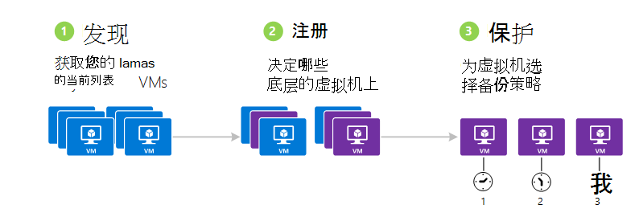

>[AZURE.NOTE] 备份虚拟机是本地进程。 无法将一个区域中的虚拟机备份到另一个区域中备份存储库。 因此，您必须在每个 Azure 地区创建备份存储库有将备份虚拟机。

## 步骤 1-发现 Azure 的虚拟机
以确保任何新的虚拟机 (Vm) 添加到订阅标识在注册之前，运行搜索进程。 在订阅中，及其他信息的虚拟机的列表处理查询 Azure 如云服务名称和地区。

1. 登录到[经典门户](http://manage.windowsazure.com/)

2. 在 Azure 服务列表中，单击**恢复服务**以打开备份和恢复网站的电子仓库的列表。
    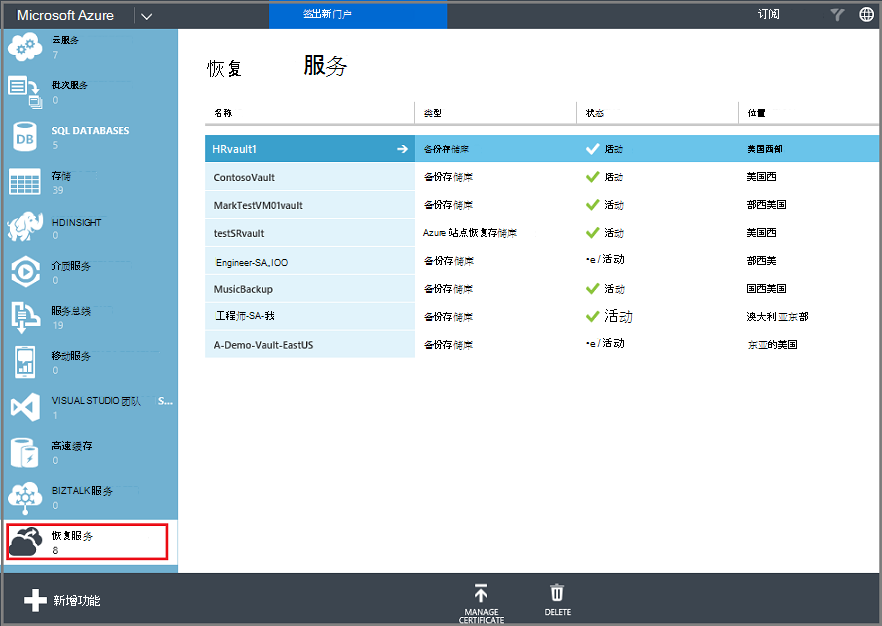

3. 在备份存储库列表中，选择要备份一个虚拟机的电子仓库。

    如果这是新的存储库到**快速启动**页将打开门户。

    

    如果先前已配置存储库，门户将打开最近使用的菜单。

4. 从保险存储菜单 （位于页面的顶部） 中，单击**注册项**。

    

5. 从**类型**菜单中，选择**Azure 虚拟机**。

    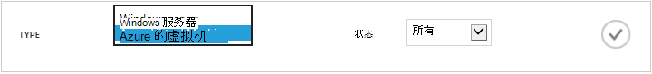

6. 单击页面底部的**探索**。
    

    搜索过程可能需要几分钟，虽然在表格中的虚拟机。 没有一个通知告诉您该进程运行在屏幕的底部。

    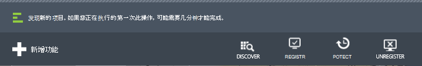

    通知更改过程后完成。 如果发现过程未发现虚拟机，首先要确保虚拟机存在。 如果虚拟机存在，请确保虚拟机处于同一区域作为备份存储库。 如果虚拟机存在，在同一区域，确保虚拟机不到备份存储库已注册。 如果将虚拟机分配给备份存储库不可用，要分配给其他备份存储库。

    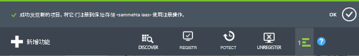

    一旦有发现新的项目，请转到步骤 2 并注册您的 Vm。

##  步骤 2-注册 Azure 的虚拟机
注册 Azure 的虚拟机，将它与 Azure 备份服务相关联。 这通常是一次性的活动。

1. 导航到备份下**恢复服务**存储库在 Azure 的门户中，，然后单击**注册项**。

2. 从下拉菜单中选择**Azure 的虚拟机**。

    

3. 单击页面底部的**注册**。
    

4. 在**注册项**的快捷菜单中，选择要注册的虚拟机。 如果存在具有相同名称的两个或多个虚拟机，可以使用云服务来区分它们。

    >[AZURE.TIP] 可以一次注册多个虚拟机。

    对于每个所选的虚拟机将创建一个作业。

5. 通知以转到**作业**页中，单击**查看作业**。

    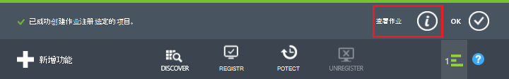

    虚拟机也会出现在列表中已登记的物料，以及注册操作的状态。

    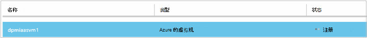

    在操作完成时，则状态将更改以反映的*注册*状态。

    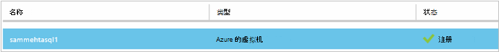

## 第 3 步 – 保护 Azure 的虚拟机
现在，您可以设置虚拟机的备份和保留策略。 可以使用单个保护多个虚拟机保护行动。

Azure 创建后可能 2015年附带的备份存储库的默认策略构建到保险存储中。 此默认策略附带了默认保留 30 天及每日一次的备份时间表。

1. 导航到备份下**恢复服务**存储库在 Azure 的门户中，，然后单击**注册项**。
2. 从下拉菜单中选择**Azure 的虚拟机**。

    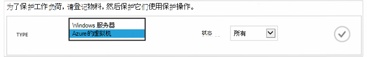

3. 单击页面底部的**保护**。

    将出现**保护项目向导**。 向导只列出被注册和不受保护的虚拟机。 选择包含您想要保护的虚拟机。

    如果存在具有相同名称的两个或多个虚拟机，可以使用云服务虚拟机之间进行区分。

    >[AZURE.TIP] 您可以一次保护多个虚拟机。

    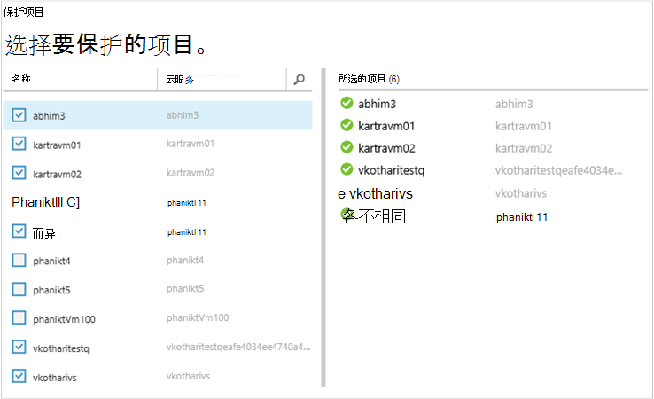

4. 选择一个**备份时间表**备份所选的虚拟机。 您可以从现有组策略中选择或定义一个新。

    每个备份策略可以有多个与之相关联的虚拟机。 但是，虚拟机只能与在任何给定点的一个策略相关联的时间。

    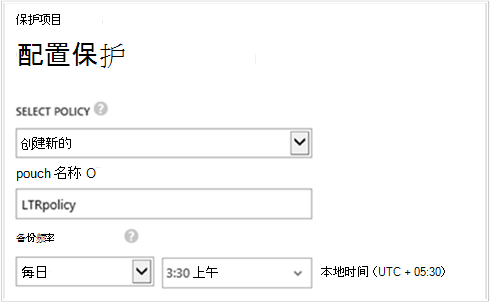

    >[AZURE.NOTE] 备份策略包括用于定时备份的保留方案。 如果您选择一个现有的备份策略，您不能修改下一步中的保留选项。

5. 选择**保留范围**与备份相关联。

    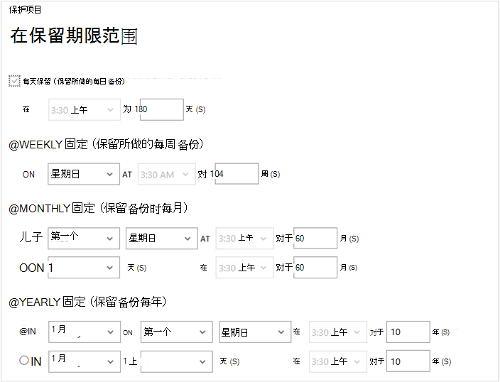

    保留策略指定用于存储备份的时间的长度。 您可以指定在进行备份时根据不同的保留策略。 例如，某一备份点每天拍摄 （它充当操作恢复点） 可能会保留 90 天。 相比之下，（用于审核目的） 每个季度结束时采取某一备份点可能需要被保留数月或数年。

    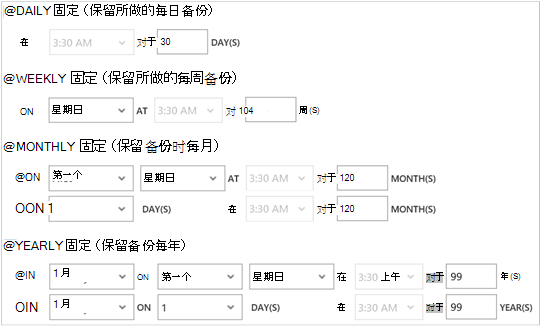

    在此示例图像︰

    - **每天保留策略**︰ 执行每日备份存储 30 天。
    - **每周保留策略**︰ 104 周保留备份每周星期日。
    - **每月保留策略**︰ 每月最后一个星期日进行的备份会保留 120 个月。
    - **每年的保留策略**︰ 每年 1 月的第一个星期日的备份会保留为 99 年。

    创建一个作业配置的保护策略，并将该策略选择每个虚拟机的虚拟机相关联。

6. 若要查看列表中**配置保护**作业，从存储库菜单中，单击**作业**，从**操作**筛选器中选择**配置保护**。

    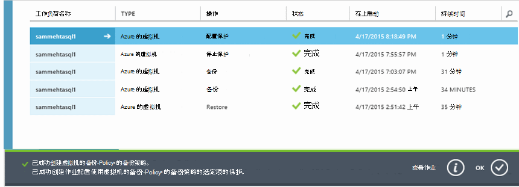

## 初始备份
后一个策略受保护虚拟机，它显示**受保护的项**选项卡与*受保护的 （等待初始备份）*的状态下。 默认情况下，第一次定时的备份是*初始备份*。

若要配置保护后立即触发初始备份︰

1. 在**受保护的项**页的底部，单击**立即备份**。

    备份 Azure 服务创建初始备份操作的备份作业。

2. 单击**作业**选项卡以查看作业的列表。

    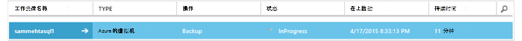

>[AZURE.NOTE] 在备份操作，备份 Azure 服务到备份扩展每个虚拟机将刷新所有写入作业，并采取一致的快照中发出命令。

完成初始备份之后，**受保护的项**选项卡中的虚拟机的状态是*受保护*。

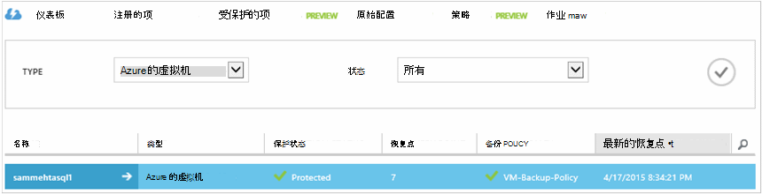

## 查看备份状态和详细信息
一旦受到保护，虚拟机次数还会增加摘要**仪表板**页面中。 **仪表板**页面还显示最近 24 小时的*成功*、 有*失败*，以及正在*进行*中的作业数。 在**作业**页中，使用**状态**、**操作**或**从**和**到**菜单来筛选作业。

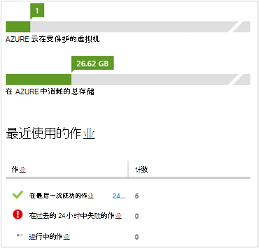

在仪表板中的值来刷新记录每 24 小时一次。

## 解决错误
如果您的虚拟机上运行入时后备的问题，查看[VM 疑难解答文章](backup-azure-vms-troubleshoot.md)有关的帮助。

## 下一步行动

- [管理和监视您的虚拟机](backup-azure-manage-vms.md)
- [还原虚拟机](backup-azure-restore-vms.md)
