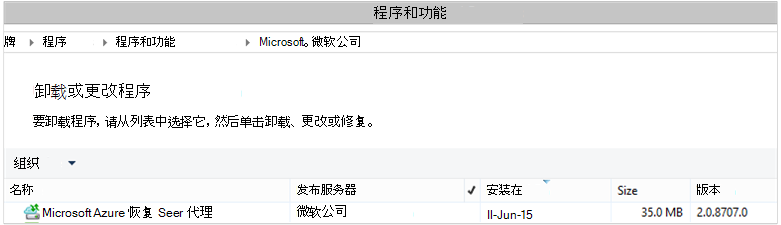

<properties
    pageTitle="部署和管理的 Windows 服务器/客户端使用 PowerShell 的备份 |Microsoft Azure"
    description="了解如何部署和管理使用 PowerShell 的 Azure 备份"
    services="backup"
    documentationCenter=""
    authors="saurabhsensharma"
    manager="shivamg"
    editor=""/>

<tags
    ms.service="backup"
    ms.workload="storage-backup-recovery"
    ms.tgt_pltfrm="na"
    ms.devlang="na"
    ms.topic="article"
    ms.date="09/01/2016"
    ms.author="saurabhsensharma;markgal;jimpark;nkolli;trinadhk"/>


# <a name="deploy-and-manage-backup-to-azure-for-windows-serverwindows-client-using-powershell"></a>部署和管理备份到 Azure 的 Windows 服务器/Windows 客户端使用 PowerShell

> [AZURE.SELECTOR]
- [ARM](backup-client-automation.md)
- [经典](backup-client-automation-classic.md)

本文介绍了如何使用 PowerShell Azure 备份 Windows 服务器或 Windows 客户端上设置和管理备份和恢复。

## <a name="install-azure-powershell"></a>安装 Azure PowerShell

[AZURE.INCLUDE [learn-about-deployment-models](../../includes/learn-about-deployment-models-include.md)]

在 10 月 2015 Azure PowerShell 1.0 发布。 此版本已成功 0.9.8 释放并带动一些重大更改，特别是在这些 cmdlet 的命名模式。 1.0 cmdlet 遵循命名模式 {动词}-AzureRm {名词};而 0.9.8 名称不包含**Rm** (例如，新建的 AzureRmResourceGroup 而不是新建 AzureResourceGroup)。 当使用 Azure PowerShell 0.9.8 时，必须先启用的资源管理器模式运行**开关 AzureMode AzureResourceManager**命令。 此命令不需要在 1.0 或更高版本。

如果要使用您为 0.9.8 编写的脚本环境中，在 1.0 或更高版本环境中之前，应仔细测试预生产环境中的脚本使用它们在生产中以避免意外的影响。

[下载最新的 PowerShell 版本](https://github.com/Azure/azure-powershell/releases)(所需的最低版本是︰ 1.0.0 版)


[AZURE.INCLUDE [arm-getting-setup-powershell](../../includes/arm-getting-setup-powershell.md)]


## <a name="create-a-backup-vault"></a>创建备份存储库

> [AZURE.WARNING] 对于第一次使用 Azure 备份的客户，您需要注册 Azure 备份提供程序用于您的订购。 这可以通过运行下面的命令︰ 登记 AzureProvider ProviderNamespace"Microsoft.Backup"

您可以创建新的备份存储库使用**New AzureRMBackupVault** cmdlet。 备份存储库是 ARM 的资源，因此您需要将其放在资源组中。 在提升的 Azure PowerShell 控制台中，运行以下命令︰

```
PS C:\> New-AzureResourceGroup –Name “test-rg” -Region “West US”
PS C:\> $backupvault = New-AzureRMBackupVault –ResourceGroupName “test-rg” –Name “test-vault” –Region “West US” –Storage GeoRedundant
```

使用**Get AzureRMBackupVault** cmdlet 列出备份电子仓库在订阅中。


## <a name="installing-the-azure-backup-agent"></a>安装 Azure 备份代理
安装 Azure 备份代理程序之前，您需要具有 Windows 服务器上安装程序下载和存在。 从[Microsoft 下载中心获取](http://aka.ms/azurebackup_agent)或备份存储库的仪表板页面，您可以获取最新版本的安装程序。 将安装程序保存到便于访问的位置像 * C:\Downloads\*。

要安装代理，请在提升 PowerShell 控制台运行以下命令︰

```
PS C:\> MARSAgentInstaller.exe /q
```

这将具有所有默认选项安装代理。 在后台，安装需要几分钟。 如果不指定*/nu*选项**Windows 更新**窗口中将打开要检查有任何更新的安装的结尾。 安装完成后，代理将显示在已安装程序列表中。

若要查看已安装的程序列表，请转到**控制面板** > **程序** > **程序和功能**。



### <a name="installation-options"></a>安装选项

若要查看所有可用通过命令行选项，请使用下面的命令︰

```
PS C:\> MARSAgentInstaller.exe /?
```

可用的选项包括︰

| 选项 | 详细信息 | 默认 |
| ---- | ----- | ----- |
| /q | 安静模式安装 | - |
| /p:"位置" | Azure 备份代理的安装文件夹的路径。 | C:\Program 该 Azure 恢复服务代理 |
| /s:"位置" | Azure 备份代理的缓存文件夹的路径。 | C:\Program 该 Azure 恢复服务 Agent\Scratch |
| /m | 自愿参加到 Microsoft 更新 | - |
| /nu | 安装完成后不检查更新 | - |
| /d | 卸载 Microsoft Azure 恢复服务代理 | - |
| /ph | 代理主机地址 | - |
| /po | 代理主机的端口号 | - |
| /pu | 代理主机的用户名 | - |
| /pw | 代理服务器密码 | - |


## <a name="registering-with-the-azure-backup-service"></a>注册 Azure 备份服务
您可以注册 Azure 备份服务之前，您需要确保满足[先决条件](backup-configure-vault.md)。 您必须︰

- 具有有效的 Azure 订购
- 已备份的存储库

若要下载的存储库凭据，Azure PowerShell 控制台中运行**Get AzureRMBackupVaultCredentials** cmdlet 并将其存储在一个方便的位置，如 * C:\Downloads\*。

```
PS C:\> $credspath = "C:\"
PS C:\> $credsfilename = Get-AzureRMBackupVaultCredentials -Vault $backupvault -TargetLocation $credspath
PS C:\> $credsfilename
f5303a0b-fae4-4cdb-b44d-0e4c032dde26_backuprg_backuprn_2015-08-11--06-22-35.VaultCredentials
```

存储库中注册计算机完成使用[开始 OBRegistration](https://technet.microsoft.com/library/hh770398%28v=wps.630%29.aspx) cmdlet:

```
PS C:\> $cred = $credspath + $credsfilename
PS C:\> Start-OBRegistration -VaultCredentials $cred -Confirm:$false

CertThumbprint      : 7a2ef2caa2e74b6ed1222a5e89288ddad438df2
SubscriptionID      : ef4ab577-c2c0-43e4-af80-af49f485f3d1
ServiceResourceName : test-vault
Region              : West US

Machine registration succeeded.
```

> [AZURE.IMPORTANT] 不要使用相对路径来指定存储库凭据文件。 作为该 cmdlet 的输入，您必须提供绝对路径。

## <a name="networking-settings"></a>网络设置
通过代理服务器连接到 internet 的 Windows 计算机时，也可以向代理提供的代理服务器设置。 在此示例中，没有任何代理服务器，因此我们正在显式清除与代理有关的任何信息。

此外可以使用的选项控制带宽使用```work hour bandwidth```和```non-work hour bandwidth```为一组给定的星期数。

设置代理服务器和带宽的详细信息都使用[一组 OBMachineSetting](https://technet.microsoft.com/library/hh770409%28v=wps.630%29.aspx) cmdlet:

```
PS C:\> Set-OBMachineSetting -NoProxy
Server properties updated successfully.

PS C:\> Set-OBMachineSetting -NoThrottle
Server properties updated successfully.
```

## <a name="encryption-settings"></a>加密设置
发送到 Azure 备份的备份数据进行加密以保护数据的机密性。 加密密码为"密码"对数据进行解密时的还原。

```
PS C:\> ConvertTo-SecureString -String "Complex!123_STRING" -AsPlainText -Force | Set-OBMachineSetting
Server properties updated successfully
```

> [AZURE.IMPORTANT] 安全设置后，就保留密码信息。 您将不能从 Azure 中还原数据，没有该密码的情况下。

## <a name="back-up-files-and-folders"></a>备份文件和文件夹
所有备份 Windows 服务器和客户端从 Azure 备份都受策略。 策略包括三个部分︰

1. 指定备份需要拍摄并将与该服务同步**备份时间表**。
2. 指定多长时间保留在 Azure 中的恢复点**保留计划**。
3. 决定什么应备份**文件包含/排除规范**。

在本文中，我们正在自动化备份，因为我们假设没有任何已配置。 我们首先创建一个新的备份策略使用[New OBPolicy](https://technet.microsoft.com/library/hh770416.aspx) cmdlet 和使用它。

```
PS C:\> $newpolicy = New-OBPolicy
```

这一次的策略是空和其他 cmdlet 都需要定义项目将包括或排除，当备份将运行，而且将存储备份的位置。

### <a name="configuring-the-backup-schedule"></a>配置备份计划
策略 3 部分的第一种是使用[New OBSchedule](https://technet.microsoft.com/library/hh770401) cmdlet 创建的备份时间表。 备份时间表定义时需要执行备份。 在制定计划时，您需要指定 2 输入的参数︰

- 备份应运行的**每周天数**。 您可以运行备份作业上只需一天，或一周，每一天之间的任意组合。
- **一天的时间**时应运行备份。 您可以定义每日备份时将会触发最多 3 个不同的时间。

例如，您可以配置每个星期六和星期天下午 4 时在运行一个备份策略。

```
PS C:\> $sched = New-OBSchedule -DaysofWeek Saturday, Sunday -TimesofDay 16:00
```

备份的计划需要与策略相关联，这可以通过[设置 OBSchedule](https://technet.microsoft.com/library/hh770407) cmdlet 来实现。

```
PS C:> Set-OBSchedule -Policy $newpolicy -Schedule $sched
BackupSchedule : 4:00 PM Saturday, Sunday, Every 1 week(s) DsList : PolicyName : RetentionPolicy : State : New PolicyState : Valid
```
### <a name="configuring-a-retention-policy"></a>配置的保留策略
保留策略定义的恢复点创建的备份作业会保留多长时间。 在创建时使用[New OBRetentionPolicy](https://technet.microsoft.com/library/hh770425) cmdlet 新保留策略，可以指定备份和恢复点需要使用 Azure 备份要保留的天数。 下面的示例中设置的保留策略为 7 天。

```
PS C:\> $retentionpolicy = New-OBRetentionPolicy -RetentionDays 7
```

保留策略必须与主策略使用 cmdlet[集 OBRetentionPolicy](https://technet.microsoft.com/library/hh770405)相关联︰

```
PS C:\> Set-OBRetentionPolicy -Policy $newpolicy -RetentionPolicy $retentionpolicy

BackupSchedule  : 4:00 PM
                  Saturday, Sunday,
                  Every 1 week(s)
DsList          :
PolicyName      :
RetentionPolicy : Retention Days : 7

                  WeeklyLTRSchedule :
                  Weekly schedule is not set

                  MonthlyLTRSchedule :
                  Monthly schedule is not set

                  YearlyLTRSchedule :
                  Yearly schedule is not set

State           : New
PolicyState     : Valid
```
### <a name="including-and-excluding-files-to-be-backed-up"></a>包括和排除要备份的文件
```OBFileSpec```对象定义的文件包括和排除在备份中。 这是一组范围的受保护的文件和文件夹的计算机上的规则。 您可以有很多文件可以根据需要包含或排除规则并将它们与策略相关联。 创建新的 OBFileSpec 对象时，您可以︰

- 指定的文件和文件夹，包括
- 指定的文件和文件夹中排除
- 设置指定递归文件夹 （或） 是否应该备份仅在指定的文件夹中的顶级文件中的数据的备份。

后者被通过新的 OBFileSpec 命令中使用-非递归标志。

在下面的示例中，我们将备份卷 c︰ 和 d:，并排除操作系统二进制文件在 Windows 文件夹和任何临时文件夹中。 为此，我们将创建两个文件规范使用[New OBFileSpec](https://technet.microsoft.com/library/hh770408) cmdlet-一个用于包含和排除。 一旦创建了文件规范，它们关联与使用[添加 OBFileSpec](https://technet.microsoft.com/library/hh770424) cmdlet 的策略。

```
PS C:\> $inclusions = New-OBFileSpec -FileSpec @("C:\", "D:\")

PS C:\> $exclusions = New-OBFileSpec -FileSpec @("C:\windows", "C:\temp") -Exclude

PS C:\> Add-OBFileSpec -Policy $newpolicy -FileSpec $inclusions

BackupSchedule  : 4:00 PM
                  Saturday, Sunday,
                  Every 1 week(s)
DsList          : {DataSource
                  DatasourceId:0
                  Name:C:\
                  FileSpec:FileSpec
                  FileSpec:C:\
                  IsExclude:False
                  IsRecursive:True

                  , DataSource
                  DatasourceId:0
                  Name:D:\
                  FileSpec:FileSpec
                  FileSpec:D:\
                  IsExclude:False
                  IsRecursive:True

                  }
PolicyName      :
RetentionPolicy : Retention Days : 7

                  WeeklyLTRSchedule :
                  Weekly schedule is not set

                  MonthlyLTRSchedule :
                  Monthly schedule is not set

                  YearlyLTRSchedule :
                  Yearly schedule is not set

State           : New
PolicyState     : Valid


PS C:\> Add-OBFileSpec -Policy $newpolicy -FileSpec $exclusions

BackupSchedule  : 4:00 PM
                  Saturday, Sunday,
                  Every 1 week(s)
DsList          : {DataSource
                  DatasourceId:0
                  Name:C:\
                  FileSpec:FileSpec
                  FileSpec:C:\
                  IsExclude:False
                  IsRecursive:True
                  ,FileSpec
                  FileSpec:C:\windows
                  IsExclude:True
                  IsRecursive:True
                  ,FileSpec
                  FileSpec:C:\temp
                  IsExclude:True
                  IsRecursive:True

                  , DataSource
                  DatasourceId:0
                  Name:D:\
                  FileSpec:FileSpec
                  FileSpec:D:\
                  IsExclude:False
                  IsRecursive:True

                  }
PolicyName      :
RetentionPolicy : Retention Days : 7

                  WeeklyLTRSchedule :
                  Weekly schedule is not set

                  MonthlyLTRSchedule :
                  Monthly schedule is not set

                  YearlyLTRSchedule :
                  Yearly schedule is not set

State           : New
PolicyState     : Valid
```

### <a name="applying-the-policy"></a>应用策略
现在的策略对象已完成并有关联的备份时间表，保留策略和包含/排除列表中的文件。 现在可以承诺的 Azure 备份使用此策略。 在应用之前新创建的策略将确保没有任何现有的备份策略，通过[删除 OBPolicy](https://technet.microsoft.com/library/hh770415) cmdlet 与服务器相关联。 正在删除策略将提示进行确认。 若要跳过确认使用```-Confirm:$false```使用 cmdlet 的标志。

```
PS C:> Get-OBPolicy | Remove-OBPolicy
Microsoft Azure Backup Are you sure you want to remove this backup policy? This will delete all the backed up data. [Y] Yes [A] Yes to All [N] No [L] No to All [S] Suspend [?] Help (default is "Y"):
```

完成提交策略对象使用[一组 OBPolicy](https://technet.microsoft.com/library/hh770421) cmdlet。 这将要求进行确认。 若要跳过确认使用```-Confirm:$false```使用 cmdlet 的标志。

```
PS C:> Set-OBPolicy -Policy $newpolicy
Microsoft Azure Backup Do you want to save this backup policy ? [Y] Yes [A] Yes to All [N] No [L] No to All [S] Suspend [?] Help (default is "Y"):
BackupSchedule : 4:00 PM Saturday, Sunday, Every 1 week(s)
DsList : {DataSource
         DatasourceId:4508156004108672185
         Name:C:\
         FileSpec:FileSpec
         FileSpec:C:\
         IsExclude:False
         IsRecursive:True,

         FileSpec
         FileSpec:C:\windows
         IsExclude:True
         IsRecursive:True,

         FileSpec
         FileSpec:C:\temp
         IsExclude:True
         IsRecursive:True,

         DataSource
         DatasourceId:4508156005178868542
         Name:D:\
         FileSpec:FileSpec
         FileSpec:D:\
         IsExclude:False
         IsRecursive:True
    }
PolicyName : c2eb6568-8a06-49f4-a20e-3019ae411bac
RetentionPolicy : Retention Days : 7
              WeeklyLTRSchedule :
              Weekly schedule is not set

              MonthlyLTRSchedule :
              Monthly schedule is not set

              YearlyLTRSchedule :
              Yearly schedule is not set
State : Existing PolicyState : Valid
```

您可以查看使用[Get OBPolicy](https://technet.microsoft.com/library/hh770406) cmdlet 的现有备份策略的详细信息。 您可以向下钻取更多备份时间表和保留策略[获取 OBRetentionPolicy](https://technet.microsoft.com/library/hh770427) cmdlet 使用[Get OBSchedule](https://technet.microsoft.com/library/hh770423) cmdlet

```
PS C:> Get-OBPolicy | Get-OBSchedule
SchedulePolicyName : 71944081-9950-4f7e-841d-32f0a0a1359a
ScheduleRunDays : {Saturday, Sunday}
ScheduleRunTimes : {16:00:00}
State : Existing

PS C:> Get-OBPolicy | Get-OBRetentionPolicy
RetentionDays : 7
RetentionPolicyName : ca3574ec-8331-46fd-a605-c01743a5265e
State : Existing

PS C:> Get-OBPolicy | Get-OBFileSpec
FileName : *
FilePath : \?\Volume{b835d359-a1dd-11e2-be72-2016d8d89f0f}\
FileSpec : D:\
IsExclude : False
IsRecursive : True

FileName : *
FilePath : \?\Volume{cdd41007-a22f-11e2-be6c-806e6f6e6963}\
FileSpec : C:\
IsExclude : False
IsRecursive : True

FileName : *
FilePath : \?\Volume{cdd41007-a22f-11e2-be6c-806e6f6e6963}\windows
FileSpec : C:\windows
IsExclude : True
IsRecursive : True

FileName : *
FilePath : \?\Volume{cdd41007-a22f-11e2-be6c-806e6f6e6963}\temp
FileSpec : C:\temp
IsExclude : True
IsRecursive : True
```

### <a name="performing-an-ad-hoc-backup"></a>执行临时备份
备份策略设置后将按时间表进行备份。 还是使用[开始 OBBackup](https://technet.microsoft.com/library/hh770426) cmdlet 可能触发点对点备份︰

```
PS C:> Get-OBPolicy | Start-OBBackup
Taking snapshot of volumes...
Preparing storage...
Estimating size of backup items...
Estimating size of backup items...
Transferring data...
Verifying backup...
Job completed.
The backup operation completed successfully.
```

## <a name="restore-data-from-azure-backup"></a>从 Azure 备份还原数据
这一节将指导您完成自动化从 Azure 备份中的恢复数据的步骤。 这样做涉及以下步骤︰

1. 选择源卷
2. 选择要还原的备份点
3. 选择要还原的项目
4. 触发器的还原过程

### <a name="picking-the-source-volume"></a>领料源卷
为了从 Azure 备份还原项，首先需要确定项的来源。 因为我们一台 Windows 服务器或 Windows 客户端的上下文中执行的命令，已标识计算机。 标识源的下一步是确定它包含的卷。 可以通过执行[Get OBRecoverableSource](https://technet.microsoft.com/library/hh770410) cmdlet 检索卷或从此计算机备份的源的列表。 该命令返回一个数组，从该服务器/客户端备份的所有源。

```
PS C:> $source = Get-OBRecoverableSource
PS C:> $source
FriendlyName : C:\
RecoverySourceName : C:\
ServerName : myserver.microsoft.com

FriendlyName : D:\
RecoverySourceName : D:\
ServerName : myserver.microsoft.com
```

### <a name="choosing-a-backup-point-to-restore"></a>选择要还原的备份点
可以通过执行[Get OBRecoverableItem](https://technet.microsoft.com/library/hh770399.aspx) cmdlet 带有相应参数检索备份点的列表。 在我们的示例中，我们将选择*d:*源卷的最新备份时间点，并使用它来恢复特定文件。

```
PS C:> $rps = Get-OBRecoverableItem -Source $source[1]
IsDir : False
ItemNameFriendly : D:\
ItemNameGuid : \?\Volume{b835d359-a1dd-11e2-be72-2016d8d89f0f}\
LocalMountPoint : D:\
MountPointName : D:\
Name : D:\
PointInTime : 18-Jun-15 6:41:52 AM
ServerName : myserver.microsoft.com
ItemSize :
ItemLastModifiedTime :

IsDir : False
ItemNameFriendly : D:\
ItemNameGuid : \?\Volume{b835d359-a1dd-11e2-be72-2016d8d89f0f}\
LocalMountPoint : D:\
MountPointName : D:\
Name : D:\
PointInTime : 17-Jun-15 6:31:31 AM
ServerName : myserver.microsoft.com
ItemSize :
ItemLastModifiedTime :
```
该对象```$rps```是备份点的数组。 第一个元素是最新的点和第 n 个元素是最早的点。 要选择最新的点，我们将使用```$rps[0]```。

### <a name="choosing-an-item-to-restore"></a>选择要还原的项目
若要标识的确切的文件或文件夹还原，以递归方式使用[Get OBRecoverableItem](https://technet.microsoft.com/library/hh770399.aspx) cmdlet。 通过这种方式，可以单独使用浏览文件夹层次结构```Get-OBRecoverableItem```。

在此示例中，如果我们要恢复文件*finances.xls*我们可以引用，使用该对象```$filesFolders[1]```。

```
PS C:> $filesFolders = Get-OBRecoverableItem $rps[0]
PS C:> $filesFolders
IsDir : True
ItemNameFriendly : D:\MyData\
ItemNameGuid : \?\Volume{b835d359-a1dd-11e2-be72-2016d8d89f0f}\MyData\
LocalMountPoint : D:\
MountPointName : D:\
Name : MyData
PointInTime : 18-Jun-15 6:41:52 AM
ServerName : myserver.microsoft.com
ItemSize :
ItemLastModifiedTime : 15-Jun-15 8:49:29 AM

PS C:> $filesFolders = Get-OBRecoverableItem $filesFolders[0]
PS C:> $filesFolders
IsDir : False
ItemNameFriendly : D:\MyData\screenshot.oxps
ItemNameGuid : \?\Volume{b835d359-a1dd-11e2-be72-2016d8d89f0f}\MyData\screenshot.oxps
LocalMountPoint : D:\
MountPointName : D:\
Name : screenshot.oxps
PointInTime : 18-Jun-15 6:41:52 AM
ServerName : myserver.microsoft.com
ItemSize : 228313
ItemLastModifiedTime : 21-Jun-14 6:45:09 AM

IsDir : False
ItemNameFriendly : D:\MyData\finances.xls
ItemNameGuid : \?\Volume{b835d359-a1dd-11e2-be72-2016d8d89f0f}\MyData\finances.xls
LocalMountPoint : D:\
MountPointName : D:\
Name : finances.xls
PointInTime : 18-Jun-15 6:41:52 AM
ServerName : myserver.microsoft.com
ItemSize : 96256
ItemLastModifiedTime : 21-Jun-14 6:43:02 AM
```

您还可以搜索要还原使用的项目```Get-OBRecoverableItem```cmdlet。 在我们的示例中， *finances.xls*搜索我们无法得到一个句柄文件通过运行此命令︰

```
PS C:\> $item = Get-OBRecoverableItem -RecoveryPoint $rps[0] -Location "D:\MyData" -SearchString "finance*"
```

### <a name="triggering-the-restore-process"></a>触发还原过程
要触发的恢复进程，我们首先需要指定恢复选项。 这可以通过使用[New OBRecoveryOption](https://technet.microsoft.com/library/hh770417.aspx) cmdlet。 对于本示例，我们假设我们想要将文件还原到*C:\temp*。 我们还假设我们想要跳上*C:\temp*的目标文件夹的文件已存在。 若要创建这样一个恢复选项，请使用下面的命令︰

```
PS C:\> $recovery_option = New-OBRecoveryOption -DestinationPath "C:\temp" -OverwriteType Skip
```

现在通过使用所选[开始 OBRecovery](https://technet.microsoft.com/library/hh770402.aspx)命令来触发恢复```$item```的输出```Get-OBRecoverableItem```cmdlet:

```
PS C:\> Start-OBRecovery -RecoverableItem $item -RecoveryOption $recover_option
Estimating size of backup items...
Estimating size of backup items...
Estimating size of backup items...
Estimating size of backup items...
Job completed.
The recovery operation completed successfully.
```


## <a name="uninstalling-the-azure-backup-agent"></a>卸载 Azure 备份代理
可以通过使用下面的命令卸载 Azure 备份代理程序︰

```
PS C:\> .\MARSAgentInstaller.exe /d /q
```

从计算机中卸载代理的二进制文件有需要考虑一些结果︰

- 从机器的文件筛选器中移除并停止跟踪更改。
- 从机器中，删除所有策略信息，但策略信息仍然存储在服务。
- 所有备份时间表被删除，而采取任何进一步的备份。

但是，数据存储在 Azure 的保留，并由您保留根据保留策略设置。 旧的点自动已清除的。

## <a name="remote-management"></a>远程管理
围绕 Azure 备份代理、 策略和数据源的所有管理可以都通过远程 PowerShell。 将远程管理的计算机需要正确地准备。

默认情况下，WinRM 服务配置为手动启动。 启动类型必须设置为*自动*并应启动该服务。 若要验证 WinRM 服务在运行，状态属性的值应该是*运行*。

```
PS C:\> Get-Service WinRM

Status   Name               DisplayName
------   ----               -----------
Running  winrm              Windows Remote Management (WS-Manag...
```

PowerShell 应配置为远程处理。

```
PS C:\> Enable-PSRemoting -force
WinRM is already set up to receive requests on this computer.
WinRM has been updated for remote management.
WinRM firewall exception enabled.

PS C:\> Set-ExecutionPolicy unrestricted -force
```

机器可以现在进行远程管理-从代理的安装开始。 例如，以下脚本复制到远程计算机的代理，并将其安装。

```
PS C:\> $dloc = "\\REMOTESERVER01\c$\Windows\Temp"
PS C:\> $agent = "\\REMOTESERVER01\c$\Windows\Temp\MARSAgentInstaller.exe"
PS C:\> $args = "/q"
PS C:\> Copy-Item "C:\Downloads\MARSAgentInstaller.exe" -Destination $dloc - force

PS C:\> $s = New-PSSession -ComputerName REMOTESERVER01
PS C:\> Invoke-Command -Session $s -Script { param($d, $a) Start-Process -FilePath $d $a -Wait } -ArgumentList $agent $args
```

## <a name="next-steps"></a>下一步行动
有关 Azure 备份为 Windows 服务器/客户端查看详细信息

- [Azure 备份简介](backup-introduction-to-azure-backup.md)
- [备份 Windows 服务器](backup-configure-vault.md)
