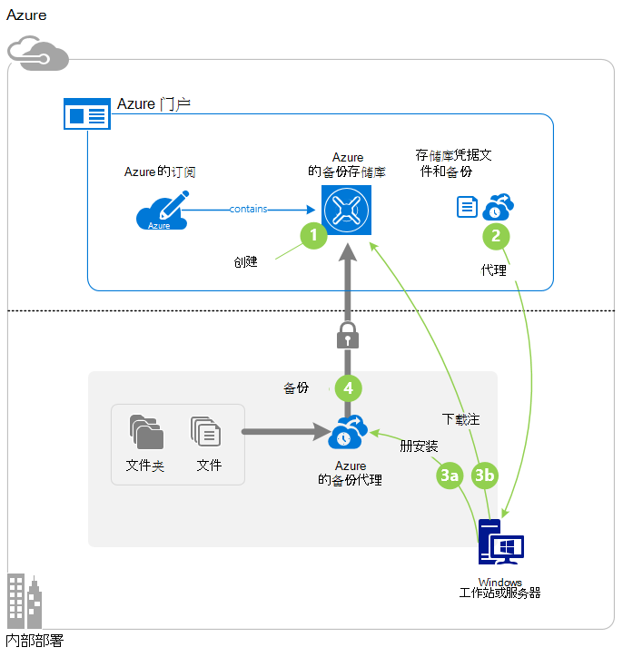
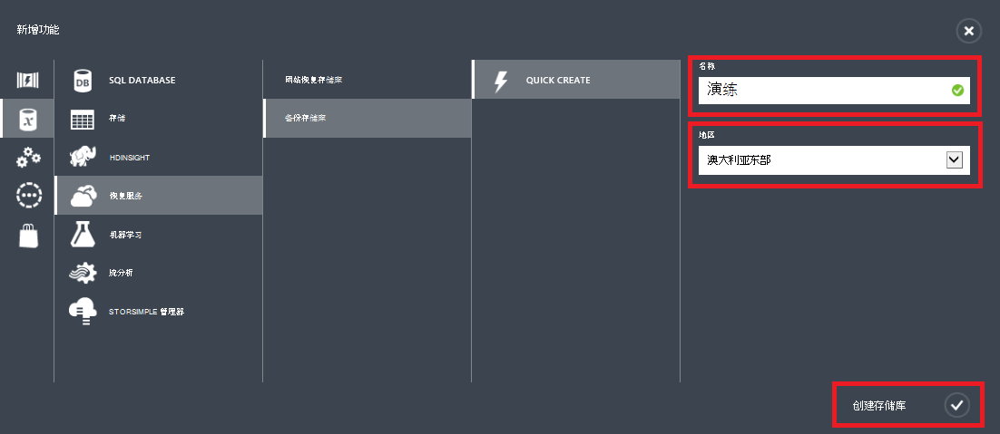
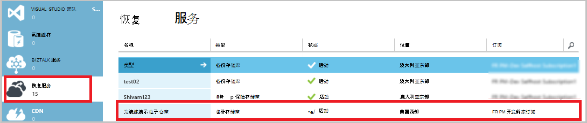
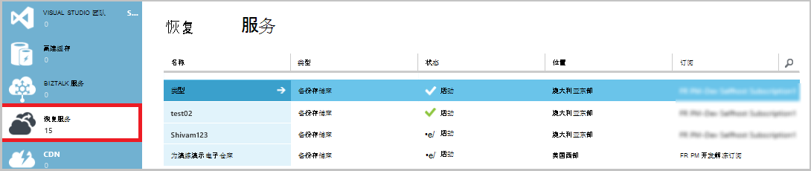
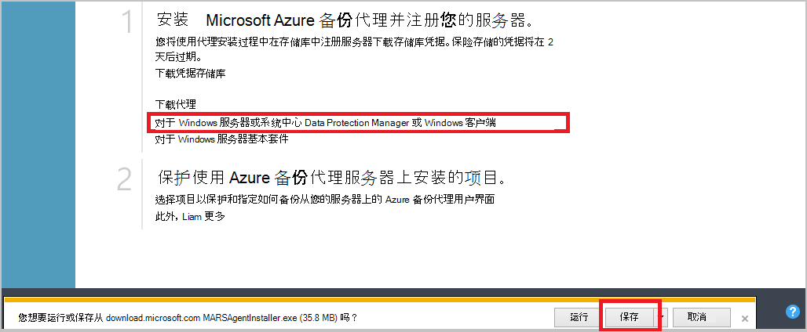
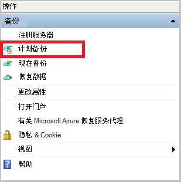
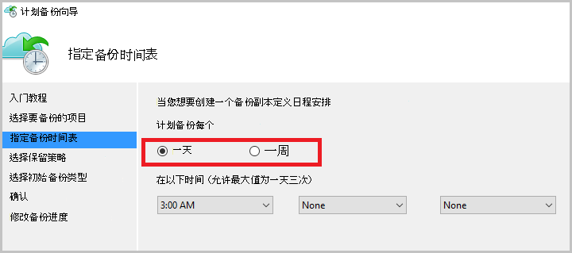
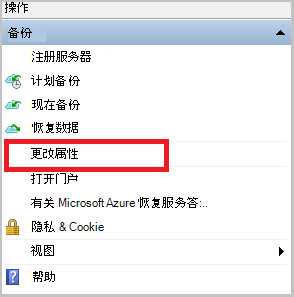
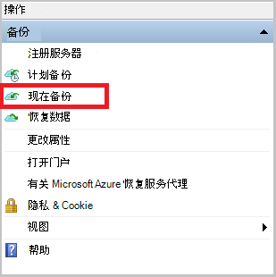
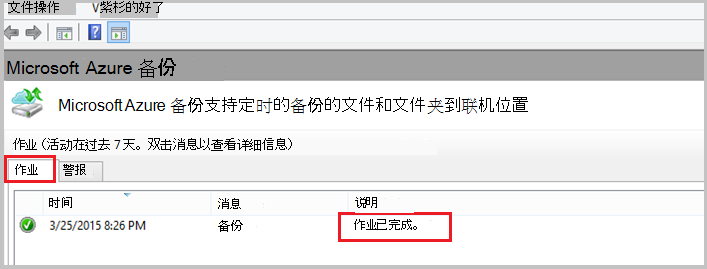

<properties
    pageTitle="备份 Windows 服务器或客户端到 Azure 使用传统部署模型 |Microsoft Azure"
    description="备份 Windows 服务器或客户端到 Azure 创建备份的存储库，下载凭据、 安装备份代理程序，并完成初始文件和文件夹的备份。"
    services="backup"
    documentationCenter=""
    authors="markgalioto"
    manager="cfreeman"
    editor=""
    keywords="备份存储库;备份 Windows 服务器;备份窗口;"/>

<tags
    ms.service="backup"
    ms.workload="storage-backup-recovery"
    ms.tgt_pltfrm="na"
    ms.devlang="na"
    ms.topic="article"
    ms.date="08/08/2016"
    ms.author="jimpark; trinadhk; markgal"/>

# Windows 服务器或客户机备份到 Azure 使用传统部署模型

> [AZURE.SELECTOR]
- [传统的门户网站](backup-configure-vault-classic.md)
- [Azure 门户](backup-configure-vault.md)

这篇文章讲述到 Azure 需要遵循准备您的环境和备份 Windows 服务器 （或客户端） 的过程。 它还介绍了您的备份解决方案的部署注意事项。 如果您感兴趣第一次尝试 Azure 备份，这篇文章迅速引导您完成此过程。

>[AZURE.IMPORTANT] Azure 具有用于创建和使用资源的两种不同的部署模型︰ 资源管理器和经典。 本文介绍如何使用经典的部署模型。 Microsoft 建议最新的部署使用资源管理器模型。

## 在开始之前
要到 Azure 备份服务器或客户端，您需要一个 Azure 帐户。 如果您没有一个，您可以在几分钟创建一个[免费帐户](https://azure.microsoft.com/free/)。

## 步骤 1︰ 创建备份存储库
若要从服务器或客户端备份的文件和文件夹，您需要创建要用来存储数据的地理区域中备份存储库。

### 要创建备份的存储库

1. 登录到[经典的门户](https://manage.windowsazure.com/)。

2. 单击**新建** > **数据服务** > **恢复服务** > **备份存储库**，然后选择**快速创建**。

3. **Name**参数，请输入备份存储库的友好名称。 键入包含 2 至 50 个字符的名称。 它必须以字母开头，可以包含字母、 数字和连字符。 此名称必须是唯一的每个订阅。

4. 对于**区域**参数，选择备份的存储库的地理区域。 此选择确定的地理区域发送备份数据的位置。 通过选择您所在的位置靠近一个地理区域，您可以备份到 Azure 时减少网络延迟。

5. 单击**创建存储库**。

    

    它可以需要备份的存储库，以创建一段时间。 若要检查状态，监视底部的传统门户网站的通知。

    在创建备份存储库后，您将看到一条消息指出已成功创建存储库。 它还显示为**活动****恢复服务**的资源列表中。

    

4. 选择存储冗余按照此处所述的步骤。

    >[AZURE.IMPORTANT] 确定您的存储冗余选项的最佳时间是存储库创建之后立即和之前任何计算机注册到该存储库。 一项已经注册到该存储库之后，存储冗余选项将被锁定，不能修改。

    如果您正在使用 Azure 作为主备份存储终结点 （例如，要备份到 Azure 从 Windows 服务器），考虑选择 （默认值）[地理冗余存储](../storage/storage-redundancy.md#geo-redundant-storage)选项。

    如果您正在使用 Azure 作为第三级的备份存储终结点 （例如，使用系统中心 Data Protection Manager 存储部署本地备份副本以及为长期保留需要使用 Azure），可以考虑选择[本地冗余存储](../storage/storage-redundancy.md#locally-redundant-storage)。 这将同时提供耐用性较低级别的数据，可能是可接受的第三份在 Azure，存储数据的成本。

    **要选择存储冗余选项︰**

    一。 单击刚创建的电子仓库。

    b。 在快速启动页上，选择**配置**。

    

    c。 选择适当的存储冗余选项。

    如果您选择**本地冗余**，您需要 （因为**地理冗余**是默认选项），请单击**保存**。

    d。 在左侧的导航窗格中，单击**恢复服务**的恢复服务返回的资源的列表。

## 步骤 2︰ 存储库凭据文件下载
内部机器需要进行身份验证的备份存储库之前它可以备份到 Azure 数据。 身份验证被通过*存储库凭据*。 存储库凭据文件是通过安全通道从传统的门户网站下载。 证书的专用密钥不能持续在门户网站或服务。

了解有关[使用保险存储与备份服务进行身份验证的凭据](backup-introduction-to-azure-backup.md#what-is-the-vault-credential-file)。

### 若要存储库凭据文件下载到本地计算机

1. 在左侧的导航窗格中，单击**恢复服务**，然后选择创建备份存储库。

    

2.  在快速启动页上，单击**下载存储库凭据**。

    传统的门户网站使用电子仓库名称和当前日期的组合生成存储库凭据。 存储库凭据文件仅在登记工作流中使用，将在 48 小时后到期。

    从门户网站，可以下载存储库凭据文件。

3. 单击**保存**以存储库凭据文件下载到本地帐户的下载文件夹。 您还可以从**保存**菜单来指定存储库凭据文件的位置选择**另存为**。

    >[AZURE.NOTE] 请确保存储库凭据文件将保存在可从您的计算机访问的位置。 如果它存储在文件共享或服务器消息块中，确认您有访问它的权限。

## 第 3 步︰ 下载、 安装和注册备份代理
创建备份存储区和存储库凭据文件下载后，必须在每个 Windows 计算机上安装代理。

### 若要下载、 安装和注册代理

1. 单击**恢复服务**，然后选择您想要向服务器注册备份存储库。

2. 在快速启动页上，单击**代理的 Windows 服务器或系统中心 Data Protection Manager 或 Windows 客户端**的代理。 然后单击**保存**。

    

3. 已下载的 MARSagentinstaller.exe 文件之后，单击**运行**（或双击**MARSAgentInstaller.exe**从保存的位置）。

4. 选择安装文件夹和所需的代理缓存文件夹，然后单击**下一步**。 指定的缓存位置必须有可用空间等于至少 5%的备份数据。

5. 您可以继续连接到互联网，通过默认代理设置。          如果您使用代理服务器连接到互联网，在代理配置页面上选择**使用自定义代理服务器设置**复选框，然后输入代理服务器的详细信息。 如果您使用经过身份验证的代理服务器，输入用户名称和密码的详细信息，，然后单击**下一步**。

7. 单击**安装**以开始安装代理。 备份代理安装.NET Framework 4.5 和 Windows PowerShell （如果尚未安装） 来完成安装。

8. 安装代理之后，单击**注册继续执行**继续执行工作流。

9. 在存储库标识页上，浏览到并选择您以前下载的存储库凭据文件。

    仅 48 小时之后从门户网站上下载,，存储库凭据文件是有效的。 如果您遇到的错误在此页面中的 （例如"保险存储凭据提供文件已过期"），登录到门户并再次下载存储库凭据文件。

    确保存储库凭据文件在安装应用程序可以访问的位置中可用。 如果您遇到与访问相关的错误时，将存储库凭据文件复制到同一台计算机上的临时位置并重试该操作。

    如果您遇到如"提供凭据无效的保险存储"存储库凭据错误，该文件已损坏或不具有最新的凭据与恢复服务无关。 重试后从门户网站下载新的存储库凭据文件操作。 如果用户单击几次连续快速地**下载存储库凭据**选项，也可发生此错误。 在这种情况下，只有最后一个存储库凭据文件是有效的。

9. 在加密设置页中，可以生成密码短语或提供一个密码短语 （16 个字符的最小值）。 请记住要将密码保存在安全的位置。

10. 单击**完成**。 注册服务器向导注册备份服务器。

    >[AZURE.WARNING] 如果您丢失或忘记了密码短语时，Microsoft 无法帮助您恢复备份的数据。 拥有加密密码短语，并且 Microsoft 没有了解您所使用的密码。 在一个安全位置保存该文件，因为它需要在恢复操作过程。

11. 设置加密密钥后，请选中，**启动 Microsoft Azure 恢复服务代理**复选框，然后单击**关闭**。

## 第 4 步︰ 完成初始备份

初始备份包括两个主要任务︰

- 创建备份时间表
- 第一次备份的文件和文件夹

初始备份的备份策略完成后，它会创建备份点，如果需要恢复数据，您可以使用。 备份策略这样做是基于您定义的计划。

### 安排备份

1. 打开 Microsoft Azure 备份代理。 （它会自动打开如果保留**启动 Microsoft Azure 恢复服务代理**复选框，选择当关闭注册服务器向导。）您可以通过搜索**Microsoft Azure 备份**您的计算机中发现。

    

2. 在备份代理，请单击**日程安排备份**。

    

3. 在计划备份向导的入门页面上，单击**下一步**。

4. 在备份页中选择的项目，单击**添加项目**。

5. 选择的文件和您希望备份的文件夹，然后单击**好了**。

6. 单击**下一步**。

7. 在**指定备份计划**页上指定的**备份时间表**并单击**下一步**。

    您可以计划 （速度最大每日三次） 的每日或每周备份。

    

    >[AZURE.NOTE] 有关如何指定备份时间表的详细信息，请参阅文章[使用 Azure 备份来替换您的磁带基础结构](backup-azure-backup-cloud-as-tape.md)。

8. 在**选择保留策略**页上，选择备份副本的**保留策略**。

    保留策略指定的持续时间，将为其存储备份。 而不是只指定备份的所有点"平面策略"，您可以指定备份发生时根据不同的保留策略。 您可以修改每日、 每周、 每月和每年的保留策略，以满足您的需要。

9. 在选择初始备份类型页上选择的初始备份类型。 保留**在网络上自动**选择，选项，然后单击**下一步**。

    您可以自动通过网络备份，也可以离线备份。 本文的其余部分介绍了自动备份的过程。 如果您希望执行脱机备份，请查看文章[在 Azure 备份脱机备份工作流](backup-azure-backup-import-export.md)的其他信息。

10. 在确认页上查看信息，，然后单击**完成**。

11. 在向导完成创建备份时间表后，单击**关闭**。

### 启用网络限制 （可选）

备份代理提供网络限制。 限制的控件在数据传输过程中网络带宽的使用方式。 此控件可以是有帮助的如果需要备份数据在工作时间，但不是希望备份过程干扰其他互联网通信。 限制应用于备份和恢复活动。

**若要启用网络限制**

1. 在备份代理，请单击**更改属性**。

    

2. 在**带宽限制**选项卡上选择**启用互联网带宽使用率限制备份操作**复选框。

    

3. 您已启用了带宽限制后，**工作时间**和**非工作时间的**过程中指定允许备份数据传输带宽。

    带宽值 512 千比特每秒 (Kbps) 开始，然后可以转达 1023 兆字节每秒 (MBps)。 此外可以指定开始和完成**的工作时间**，和一周中的哪些天是考虑的工作天。 小时以外指定工作时间被视为非工作几个小时。

4. 单击**确定**。

### 立即备份

1. 备份代理程序，在单击**立即备份**完成初始种子通过网络。

    

2. 在确认页上查看备份现在向导将使用备份计算机的设置。 然后单击**备份**。

3. 单击**关闭**以关闭向导。 如果您执行此操作之前备份过程完成后，向导将继续运行在后台。

初始备份完成后，**作业完成**状态出现在备份控制台。

## 下一步行动
- 注册一个[免费的 Azure 帐户](https://azure.microsoft.com/free/)。

有关备份 Vm 或其他工作负载的其他信息，请参阅︰

- [IaaS Vm 备份](backup-azure-vms-prepare.md)
- [备份到 Azure 与 Microsoft Azure 备份服务器的工作负载](backup-azure-microsoft-azure-backup.md)
- [到 Azure 使用 DPM 备份工作负载](backup-azure-dpm-introduction.md)
