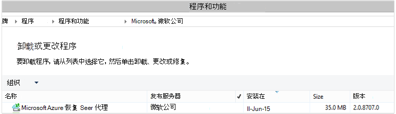

<properties
    pageTitle="Azure 备份-部署和重新为 DPM 使用 PowerShell 管理 |Microsoft Azure"
    description="了解如何部署和管理的 Data Protection Manager (DPM) 使用 PowerShell 的 Azure 备份"
    services="backup"
    documentationCenter=""
    authors="Nkolli1"
    manager="shreeshd"
    editor=""/>

<tags
    ms.service="backup"
    ms.workload="storage-backup-recovery"
    ms.tgt_pltfrm="na"
    ms.devlang="na"
    ms.topic="article"
    ms.date="09/27/2016"
    ms.author="jimpark; trinadhk; anuragm; markgal"/>


# <a name="deploy-and-manage-backup-to-azure-for-data-protection-manager-dpm-servers-using-powershell"></a>部署和管理备份到 Azure 使用 PowerShell 的 Data Protection Manager (DPM) 服务器

> [AZURE.SELECTOR]
- [ARM](backup-dpm-automation.md)
- [经典](backup-dpm-automation-classic.md)

本文介绍了如何设置 Azure 备份在 DPM 服务器上，使用 PowerShell 和管理备份和恢复。

## <a name="setting-up-the-powershell-environment"></a>设置 PowerShell 环境

[AZURE.INCLUDE [learn-about-deployment-models](../../includes/learn-about-deployment-models-include.md)]

您可以使用 PowerShell 到 Azure 从 Data Protection Manager 管理备份之前，需要继续有正确的环境。 在 PowerShell 会话开始时，请确保您运行以下命令来导入适当的模块，可以正确地引用 DPM cmdlet:

```
PS C:> & "C:\Program Files\Microsoft System Center 2012 R2\DPM\DPM\bin\DpmCliInitScript.ps1"

Welcome to the DPM Management Shell!

Full list of cmdlets: Get-Command
Only DPM cmdlets: Get-DPMCommand
Get general help: help
Get help for a cmdlet: help <cmdlet-name> or <cmdlet-name> -?
Get definition of a cmdlet: Get-Command <cmdlet-name> -Syntax
Sample DPM scripts: Get-DPMSampleScript
```

## <a name="setup-and-registration"></a>安装和注册
开始︰

1. [下载最新的 PowerShell](https://github.com/Azure/azure-powershell/releases)(所需的最低版本是︰ 1.0.0 版)
2. 通过使用**开关 AzureMode** commandlet 到*AzureResourceManager*模式切换启用 Azure 备份 commandlets:

```
PS C:\> Switch-AzureMode AzureResourceManager
```

以下安装和注册任务可以使用 PowerShell 自动化︰

- 创建备份存储库
- 安装 Azure 备份代理
- 注册 Azure 备份服务
- 网络设置
- 加密设置

### <a name="create-a-backup-vault"></a>创建备份存储库

> [AZURE.WARNING] 对于第一次使用 Azure 备份的客户，您需要注册 Azure 备份提供程序用于您的订购。 这可以通过运行下面的命令︰ 登记 AzureProvider ProviderNamespace"Microsoft.Backup"

您可以创建新的备份存储库使用**New AzureRMBackupVault** commandlet。 备份存储库是 ARM 的资源，因此您需要将其放在资源组中。 在提升的 Azure PowerShell 控制台中，运行以下命令︰

```
PS C:\> New-AzureResourceGroup –Name “test-rg” -Region “West US”
PS C:\> $backupvault = New-AzureRMBackupVault –ResourceGroupName “test-rg” –Name “test-vault” –Region “West US” –Storage GRS
```

您可以备份的所有存储库的列表中给定的订阅使用**Get AzureRMBackupVault** commandlet。


### <a name="installing-the-azure-backup-agent-on-a-dpm-server"></a>在 DPM 服务器上安装的 Azure 备份代理
安装 Azure 备份代理程序之前，您需要具有 Windows 服务器上安装程序下载和存在。 从[Microsoft 下载中心获取](http://aka.ms/azurebackup_agent)或备份存储库的仪表板页面，您可以获取最新版本的安装程序。 将安装程序保存到便于访问的位置像 * C:\Downloads\*。

要安装代理，请在提升 PowerShell 控制台**在 DPM 服务器上**运行下面的命令︰

```
PS C:\> MARSAgentInstaller.exe /q
```

这将具有所有默认选项安装代理。 在后台，安装需要几分钟。 如果您不指定*/nu*选项**Windows 更新**窗口中将打开要检查有任何更新的安装的结尾。

该代理将显示在已安装程序列表中。 若要查看已安装的程序列表，请转到**控制面板** > **程序** > **程序和功能**。



#### <a name="installation-options"></a>安装选项
若要查看所有可用通过命令行选项，请使用下面的命令︰

```
PS C:\> MARSAgentInstaller.exe /?
```

可用的选项包括︰

| 选项 | 详细信息 | 默认 |
| ---- | ----- | ----- |
| /q | 安静模式安装 | - |
| /p:"位置" | Azure 备份代理的安装文件夹的路径。 | C:\Program 该 Azure 恢复服务代理 |
| /s:"位置" | Azure 备份代理的缓存文件夹的路径。 | C:\Program 该 Azure 恢复服务 Agent\Scratch |
| /m | 自愿参加到 Microsoft 更新 | - |
| /nu | 安装完成后不检查更新 | - |
| /d | 卸载 Microsoft Azure 恢复服务代理 | - |
| /ph | 代理主机地址 | - |
| /po | 代理主机的端口号 | - |
| /pu | 代理主机的用户名 | - |
| /pw | 代理服务器密码 | - |

### <a name="registering-with-the-azure-backup-service"></a>注册 Azure 备份服务
您可以注册 Azure 备份服务之前，您需要确保满足[先决条件](backup-azure-dpm-introduction.md)。 您必须︰

- 具有有效的 Azure 订购
- 已备份的存储库

若要下载的存储库凭据，Azure PowerShell 控制台中运行**Get AzureBackupVaultCredentials** commandlet 并将其存储在一个方便的位置，如 * C:\Downloads\*。

```
PS C:\> $credspath = "C:\"
PS C:\> $credsfilename = Get-AzureRMBackupVaultCredentials -Vault $backupvault -TargetLocation $credspath
PS C:\> $credsfilename
f5303a0b-fae4-4cdb-b44d-0e4c032dde26_backuprg_backuprn_2015-08-11--06-22-35.VaultCredentials
```

存储库中注册计算机完成使用[开始 DPMCloudRegistration](https://technet.microsoft.com/library/jj612787) cmdlet:

```
PS C:\> $cred = $credspath + $credsfilename
PS C:\> Start-DPMCloudRegistration -DPMServerName "TestingServer" -VaultCredentialsFilePath $cred
```

这将注册 DPM 服务器名为"TestingServer"与 Microsoft Azure 存储库使用指定存储库凭据。

> [AZURE.IMPORTANT] 不要使用相对路径来指定存储库凭据文件。 作为该 cmdlet 的输入，您必须提供绝对路径。

### <a name="initial-configuration-settings"></a>初始配置设置
DPM 服务器注册后使用 Azure 备份存储库，它将启动使用默认订阅设置。 这些订阅设置包括网络、 加密和临时区域。 要开始更改订阅设置您需要先使用[Get DPMCloudSubscriptionSetting](https://technet.microsoft.com/library/jj612793) cmdlet 的现有 （默认设置） 设置获取句柄︰

```
$setting = Get-DPMCloudSubscriptionSetting -DPMServerName "TestingServer"
```

对此本地 PowerShell 对象进行的所有修改```$setting```，则完整的对象是提交到 DPM 和 Azure 备份，可以使用[一组 DPMCloudSubscriptionSetting](https://technet.microsoft.com/library/jj612791) cmdlet 将其保存。 您需要使用```–Commit```标志，以确保所做的更改将保留。 设置将不应用和使用 Azure 备份，除非提交。

```
PS C:\> Set-DPMCloudSubscriptionSetting -DPMServerName "TestingServer" -SubscriptionSetting $setting -Commit
```

### <a name="networking"></a>网络连接
如果连接到 internet 上的 Azure 备份服务的 DPM 计算机是通过代理服务器，代理服务器设置应供备份成功。 这通过使用```-ProxyServer```， ```-ProxyPort```， ```-ProxyUsername``` ，```ProxyPassword```与[集 DPMCloudSubscriptionSetting](https://technet.microsoft.com/library/jj612791) cmdlet 的参数。 在此示例中，是没有代理服务器过程，因此我们正在显式清除与代理有关的任何信息。

```
PS C:\> Set-DPMCloudSubscriptionSetting -DPMServerName "TestingServer" -SubscriptionSetting $setting -NoProxy
```

此外可以使用选项控制带宽使用```-WorkHourBandwidth```和```-NonWorkHourBandwidth```为一组给定的星期数。 在此示例中我们没有设置任何限制。

```
PS C:\> Set-DPMCloudSubscriptionSetting -DPMServerName "TestingServer" -SubscriptionSetting $setting -NoThrottle
```

### <a name="configuring-the-staging-area"></a>配置临时区域
在 DPM 服务器上运行的 Azure 备份代理需要用来从云 （本地临时区域） 恢复数据临时存储。 配置临时区域使用[一组 DPMCloudSubscriptionSetting](https://technet.microsoft.com/library/jj612791) cmdlet 和```-StagingAreaPath```参数。

```
PS C:\> Set-DPMCloudSubscriptionSetting -DPMServerName "TestingServer" -SubscriptionSetting $setting -StagingAreaPath "C:\StagingArea"
```

在上面的示例中，临时区域将被设置为*C:\StagingArea* PowerShell 对象中```$setting```。 请确保指定的文件夹已经存在，否则订阅设置的最终提交会失败。


### <a name="encryption-settings"></a>加密设置
发送到 Azure 备份的备份数据进行加密以保护数据的机密性。 加密密码为"密码"对数据进行解密时的还原。 务必要保持此信息的安全设置后。

在下面的示例中，第一个命令将转换字符串```passphrase123456789```为安全字符串，并将此安全字符串的变量名为```$Passphrase```。 第二个命令设置此安全字符串中```$Passphrase```作为密码加密备份。

```
PS C:\> $Passphrase = ConvertTo-SecureString -string "passphrase123456789" -AsPlainText -Force

PS C:\> Set-DPMCloudSubscriptionSetting -DPMServerName "TestingServer" -SubscriptionSetting $setting -EncryptionPassphrase $Passphrase
```

> [AZURE.IMPORTANT] 安全设置后，就保留密码信息。 您将不能从 Azure 中还原数据，没有该密码的情况下。

此时，您应所做给所有需要的更改```$setting```对象。 请记住要提交的更改。

```
PS C:\> Set-DPMCloudSubscriptionSetting -DPMServerName "TestingServer" -SubscriptionSetting $setting -Commit
```

## <a name="protect-data-to-azure-backup"></a>保护 Azure 备份的数据
在本节中，将生产服务器添加到 DPM，然后保护到本地 DPM 存储再到 Azure 备份的数据。 在示例中，我们将演示如何备份文件和文件夹。 逻辑可以轻松地扩展备份任何 DPM 支持数据源。 所有 DPM 备份都控制通过保护组 (PG) 与四个部分︰

1. **组成员**是所有可以受保护对象 (也称为*数据源*在 DPM 中) 您想要保护的相同的保护组中的一个列表。 例如，您可以保护它们可能具有不同的备份要求生产一个保护组和另一个保护组中的 SQL Server 数据库中的虚拟机。 可以备份任何数据源在您需要以确保生产服务器之前 DPM 代理服务器上安装并受 DPM。 请按照[安装 DPM 代理](https://technet.microsoft.com/library/bb870935.aspx)并将其链接到相应的 DPM 服务器的步骤。
2. **数据保护方法**指定目标备份位置的磁带、 磁盘和云。 在我们的示例中，我们将保护数据到本地磁盘和云。
3. 指定需要执行备份和数据在 DPM 服务器和生产服务器之间的同步频率**的备份时间表**。
4. 指定多长时间保留在 Azure 中的恢复点**保留计划**。

### <a name="creating-a-protection-group"></a>创建保护组
首先创建新的保护组使用[New DPMProtectionGroup](https://technet.microsoft.com/library/hh881722) cmdlet。

```
PS C:\> $PG = New-DPMProtectionGroup -DPMServerName " TestingServer " -Name "ProtectGroup01"
```

上面的 cmdlet 将创建一个名为*ProtectGroup01*的保护组。 现有保护组还可以修改以后将备份添加到 Azure 的云。 但是，可以更改保护组中的新的或现有的我们需要能够控制在一个*可修改*的对象，该对象使用[Get DPMModifiableProtectionGroup](https://technet.microsoft.com/library/hh881713) cmdlet。

```
PS C:\> $MPG = Get-ModifiableProtectionGroup $PG
```

### <a name="adding-group-members-to-the-protection-group"></a>向保护组添加组成员
每个 DPM 代理知道，它安装在服务器上的数据源的列表。 若要将数据源添加到保护组，DPM 代理需要首先发送回 DPM 服务器的数据源列表。 一个或多个数据源的选择，然后添加到保护组。 获取所需的 PowerShell 步骤实现以下情形︰

1. 获取由通过 DPM 代理 DPM 管理的所有服务器的列表。
2. 选择一个特定的服务器。
3. 在服务器上获取的所有数据源的列表。
4. 选择一个或多个数据源并将其添加到保护组

使用[Get DPMProductionServer](https://technet.microsoft.com/library/hh881600) cmdlet 获取的服务器的 DPM 代理安装和由 DPM 服务器的列表。 在此示例中，我们将筛选并只配置备份名称*productionserver01* PS。

```
PS C:\> $server = Get-ProductionServer -DPMServerName "TestingServer" | where {($_.servername) –contains “productionserver01”
```

现在根据获取数据源列表```$server```使用[Get DPMDatasource](https://technet.microsoft.com/library/hh881605) cmdlet。 在此示例中我们正在筛选卷 d:*\*其中我们想要配置以进行备份。此数据源被添加到使用[添加 DPMChildDatasource](https://technet.microsoft.com/library/hh881732) cmdlet 的保护组。请记住使用*modifable * 保护组对象```$MPG```进行添加。

```
PS C:\> $DS = Get-Datasource -ProductionServer $server -Inquire | where { $_.Name -contains “D:\” }

PS C:\> Add-DPMChildDatasource -ProtectionGroup $MPG -ChildDatasource $DS
```

重复此步骤可以根据需要多次，直到所有选定的数据源添加到保护组。 此外可以从开始只是一个数据源，并完成工作流创建保护组，然后稍后向保护组添加多个数据源。

### <a name="selecting-the-data-protection-method"></a>选择的数据保护方法
数据源添加到保护组后下, 一步是指定使用[一组 DPMProtectionType](https://technet.microsoft.com/library/hh881725) cmdlet 的保护方法。 在此示例中，将本地磁盘和云备份设置保护组。 您还需要指定要到云使用[添加 DPMChildDatasource](https://technet.microsoft.com/library/hh881732.aspx) cmdlet 的在线标志保护的数据源。

```
PS C:\> Set-DPMProtectionType -ProtectionGroup $MPG -ShortTerm Disk –LongTerm Online
PS C:\> Add-DPMChildDatasource -ProtectionGroup $MPG -ChildDatasource $DS –Online
```

### <a name="setting-the-retention-range"></a>设置保留期限范围
设置使用[组 DPMPolicyObjective](https://technet.microsoft.com/library/hh881762) cmdlet 的备份点保留。 虽然这看起来可能奇之前已定义的备份计划，使用设置保留```Set-DPMPolicyObjective```cmdlet 将自动设置然后可以修改默认的备份时间表。 它是首先安排备份集和保留策略后的可能的。

在下面的示例中，该 cmdlet 设置磁盘备份的保留参数。 这将保留备份 10 天和同步数据的生产服务器和 DPM 服务器之间每隔 6 小时。 ```SynchronizationFrequencyMinutes```没有定义某一备份点创建的频率，但如何将通常的数据复制到 DPM 服务器;这可防止备份变得过大。

```
PS C:\> Set-DPMPolicyObjective –ProtectionGroup $MPG -RetentionRangeInDays 10 -SynchronizationFrequencyMinutes 360
```

转到 Azure 的备份 （DPM 将这些作为联机备份） 的保留范围可以配置为[使用祖父-父-子方案 (GFS) 的长期保留](backup-azure-backup-cloud-as-tape.md)。 也就是说，可以定义组合的保留策略涉及每日、 每周、 每月和每年的保留策略。 在此示例中，我们创建一个数组，表示我们想要的复杂的保留方案以及如何配置使用[一组 DPMPolicyObjective](https://technet.microsoft.com/library/hh881762) cmdlet 的保留范围。

```
PS C:\> $RRlist = @()
PS C:\> $RRList += (New-Object -TypeName Microsoft.Internal.EnterpriseStorage.Dls.UI.ObjectModel.OMCommon.RetentionRange -ArgumentList 180, Days)
PS C:\> $RRList += (New-Object -TypeName Microsoft.Internal.EnterpriseStorage.Dls.UI.ObjectModel.OMCommon.RetentionRange -ArgumentList 104, Weeks)
PS C:\> $RRList += (New-Object -TypeName Microsoft.Internal.EnterpriseStorage.Dls.UI.ObjectModel.OMCommon.RetentionRange -ArgumentList 60, Month)
PS C:\> $RRList += (New-Object -TypeName Microsoft.Internal.EnterpriseStorage.Dls.UI.ObjectModel.OMCommon.RetentionRange -ArgumentList 10, Years)
PS C:\> Set-DPMPolicyObjective –ProtectionGroup $MPG -OnlineRetentionRangeList $RRlist
```

### <a name="set-the-backup-schedule"></a>设置备份时间表
DPM 设置默认的备份计划自动如果指定保护目标使用```Set-DPMPolicyObjective```cmdlet。 若要更改默认计划，请使用[Get DPMPolicySchedule](https://technet.microsoft.com/library/hh881749) cmdlet 跟[集 DPMPolicySchedule](https://technet.microsoft.com/library/hh881723) cmdlet。

```
PS C:\> $onlineSch = Get-DPMPolicySchedule -ProtectionGroup $mpg -LongTerm Online
PS C:\> Set-DPMPolicySchedule -ProtectionGroup $MPG -Schedule $onlineSch[0] -TimesOfDay 02:00
PS C:\> Set-DPMPolicySchedule -ProtectionGroup $MPG -Schedule $onlineSch[1] -TimesOfDay 02:00 -DaysOfWeek Sa,Su –Interval 1
PS C:\> Set-DPMPolicySchedule -ProtectionGroup $MPG -Schedule $onlineSch[2] -TimesOfDay 02:00 -RelativeIntervals First,Third –DaysOfWeek Sa
PS C:\> Set-DPMPolicySchedule -ProtectionGroup $MPG -Schedule $onlineSch[3] -TimesOfDay 02:00 -DaysOfMonth 2,5,8,9 -Months Jan,Jul
PS C:\> Set-DPMProtectionGroup -ProtectionGroup $MPG
```

在上例中，```$onlineSch```是一个具有四个元素的数组，包含为保护组 GFS 方案中现有的在线保护计划︰

1. ```$onlineSch[0]```将包含每日计划
2. ```$onlineSch[1]```将包含每周计划
3. ```$onlineSch[2]```将包含每月计划
4. ```$onlineSch[3]```将包含每年计划

因此，如果您需要修改每周计划，您需要参考```$onlineSch[1]```。

### <a name="initial-backup"></a>初始备份
当第一次备份数据源，DPM 将需要创建初始副本会在 DPM 副本卷上创建一份受保护的数据源。 该活动既可在特定的时间，安排或可触发手动[设置 DPMReplicaCreationMethod](https://technet.microsoft.com/library/hh881715) cmdlet 使用参数```-NOW```。

```
PS C:\> Set-DPMReplicaCreationMethod -ProtectionGroup $MPG -NOW
```
### <a name="changing-the-size-of-dpm-replica--recovery-point-volume"></a>更改 DPM 副本和恢复点卷的大小
您还可以更改 DPM 副本卷以及使用如下所示[设置 DPMDatasourceDiskAllocation](https://technet.microsoft.com/library/hh881618.aspx) cmdlet 的卷影副本卷大小下面示例︰ 获取 DatasourceDiskAllocation 数据源数据源 $DS 集-DatasourceDiskAllocation-$DS-ProtectionGroup $MPG-手动 ReplicaArea (2 gb)-ShadowCopyArea (2 gb)

### <a name="committing-the-changes-to-the-protection-group"></a>将更改提交到保护组
最后，需要 DPM 可以采取每个新的保护组配置备份之前不会提交更改。 这是使用[一组 DPMProtectionGroup](https://technet.microsoft.com/library/hh881758) cmdlet。

```
PS C:\> Set-DPMProtectionGroup -ProtectionGroup $MPG
```
## <a name="view-the-backup-points"></a>查看备份点
可以使用[Get DPMRecoveryPoint](https://technet.microsoft.com/library/hh881746) cmdlet 以获取数据源的所有恢复点的列表。 在此示例中，我们将︰
- 上的 DPM 服务器将存储在数组中提取所有 PGs```$PG```
- 获取对应于数据源```$PG[0]```
- 获取数据源的恢复点。

```
PS C:\> $PG = Get-DPMProtectionGroup –DPMServerName "TestingServer"
PS C:\> $DS = Get-DPMDatasource -ProtectionGroup $PG[0]
PS C:\> $RecoveryPoints = Get-DPMRecoverypoint -Datasource $DS[0] -Online
```

## <a name="restore-data-protected-on-azure"></a>还原在 Azure 上受保护的数据
还原数据时的组合```RecoverableItem```对象和一个```RecoveryOption```对象。 前面的部分中，我们得到备份点列表的数据源。

在下面的示例中，我们将演示如何通过将备份点与恢复的目标结合起来，从 Azure 备份还原 Hyper-V 虚拟机。 这包括︰

- 创建一个使用[New DPMRecoveryOption](https://technet.microsoft.com/library/hh881592) cmdlet 的恢复选项。
- 获取备份使用的点数组```Get-DPMRecoveryPoint```cmdlet。
- 选择要从中进行恢复某一备份点。

```
PS C:\> $RecoveryOption = New-DPMRecoveryOption -HyperVDatasource -TargetServer "HVDCenter02" -RecoveryLocation AlternateHyperVServer -RecoveryType Recover -TargetLocation “C:\VMRecovery”

PS C:\> $PG = Get-DPMProtectionGroup –DPMServerName "TestingServer"
PS C:\> $DS = Get-DPMDatasource -ProtectionGroup $PG[0]
PS C:\> $RecoveryPoints = Get-DPMRecoverypoint -Datasource $DS[0] -Online

PS C:\> Restore-DPMRecoverableItem -RecoverableItem $RecoveryPoints[0] -RecoveryOption $RecoveryOption
```

这些命令可以方便地扩展任何数据源类型。

## <a name="next-steps"></a>下一步行动

- DPM Azure 备份的详细信息，请参阅[DPM 备份简介](backup-azure-dpm-introduction.md)
