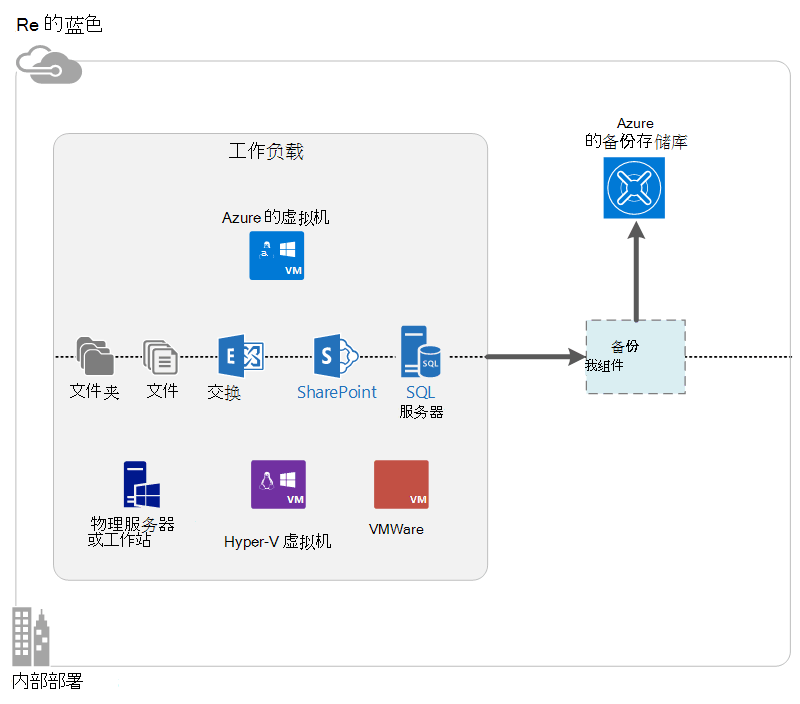

<properties
    pageTitle="什么是 Azure 备份？ |Microsoft Azure"
    description="通过使用 Azure 备份和恢复服务，可以备份和还原数据和应用程序从 Windows 服务器，Windows 客户端计算机、 系统中心 DPM 服务器和 Azure 的虚拟机。"
    services="backup"
    documentationCenter=""
    authors="markgalioto"
    manager="cfreeman"
    editor="tysonn"
    keywords="备份和恢复;恢复服务;备份解决方案"/>

<tags
    ms.service="backup"
    ms.workload="storage-backup-recovery"
    ms.tgt_pltfrm="na"
    ms.devlang="na"
    ms.topic="get-started-article"
    ms.date="10/19/2016"
    ms.author="jimpark; trinadhk"/>

# 什么是 Azure 备份？
Azure 备份是用于备份和还原您在 Microsoft 云中的数据服务。 它会替换您现有的内部部署的或非现场备份解决方案是可靠、 安全和具有成本竞争力的基于云的解决方案。 它还有助于保护运行在云中的资产。 Azure 的备份提供了恢复建立在一个世界一流的基础架构，可扩展、 耐用，且高度可用的服务。

[观看的视频 Azure 备份概述](https://azure.microsoft.com/documentation/videos/what-is-azure-backup/)

## 为什么使用 Azure 备份？
传统的备份解决方案已向前发展以云视为类似于磁盘或磁带的终结点。 虽然这种方法比较简单，它也是有限。 它不会充分利用底层的云平台，并转换为效率低下、 成本高昂的解决方案。
与此相反，Azure 备份提供功能强大而且价格合理的云备份解决方案的所有优势。 下面是一些 Azure 备份提供的主要优点。

| 功能 | 福利 |
| ------- | ------- |
| 自动存储管理 | 内部存储设备不需要任何资本支出。 Azure 的备份自动分配并管理备份存储，并使用为您的使用付费消耗模型。 |
| 无限制的扩展 | 利用下无需维护的开销和监视高可用性保证。 Azure 的备份使用的基础能力和规模的 Azure 的云，使用非侵入式自动缩放功能。 |
| 多个存储选项 | 选择您根据需要的备份存储︰<li>本地冗余存储块斑点是非常在乎价格的客户的理想选择，它仍然有助于保护数据免受本地硬件故障。 <li>Geo 复制存储块斑点提供三个成对的数据中心中的多个副本。 这些额外的副本可以帮助确保您的备份数据具有高可用性，即使 Azure 站点级灾难发生。 |
| 无限的数据传输 | 在还原操作从备份存储库没有任何出口 （出站） 的数据传输不收取任何费用。 数据进入到 Azure 也是免费。 适用于导入服务可用。 |
| 数据加密 | 数据加密的安全传输和存储客户数据在公共云中的允许。 加密密码存储在源位置，并永远不会被传输或存储在 Azure。 恢复的数据，任何所需的加密密钥，只有客户服务中有数据的完全访问权限。 |  
| 应用程序一致性的备份 | 在 Windows 的应用程序一致性备份有助于确保修补程序不需要还原，从而减少了恢复时间目标的时候。 这使客户能够更快地返回到运行状态。 |
| 长期保留 | 而不是支付非现场磁带备份解决方案，客户可以备份到 Azure，提供低成本有吸引力的类似磁带的解决方案。 |

## Azure 备份组件
备份是一个混合的备份解决方案，因为它包含多个组件协同工作以实现端到端备份和恢复工作流。

### 部署方案

| 组件 | 可以部署在 Azure 吗？ | 可以为已部署的内部部署？ | 目标存储支持|
| --- | --- | --- | --- |
| Azure 的备份代理 | 
**是的**
 
Azure 备份代理程序可以部署在任何 Windows 服务器虚拟机在 Azure 中运行。
 | 
**是的**
 
备份代理程序可以部署在任何 Windows 服务器的虚拟机或物理计算机上。
 | 
Azure 备份存储库
 |
| System Center Data Protection Manager (DPM) | 
**是的**

了解更多关于[如何保护系统中心 DPM 使用 Azure 中的工作负载](http://blogs.technet.com/b/dpm/archive/2014/09/02/azure-iaas-workload-protection-using-data-protection-manager.aspx)。
 | 
**是的**
 
了解有关[如何保护工作负载和数据中心的虚拟机](https://technet.microsoft.com/library/hh758173.aspx)。
 | 
本地连接的磁盘
 
Azure 的备份存储库
 
磁带 （上-仅内部部署）
 |
| Azure 的备份服务器 | 
**是的**

了解更多关于[如何保护在 Azure 使用 Azure 备份服务器的工作负载](backup-azure-microsoft-azure-backup.md)。
 | 
**是的**
 
了解更多关于[如何保护在 Azure 使用 Azure 备份服务器的工作负载](backup-azure-microsoft-azure-backup.md)。
 | 
本地连接的磁盘
 
Azure 备份存储库
 |
| Azure 备份 （VM 扩展） | 
**是的**

Azure 结构的一部分

专用于[Azure 基础结构即服务 (IaaS) 虚拟机的备份](backup-azure-vms-introduction.md)。
 | 
**不**
 
使用系统中心 DPM 备份您的数据中心中的虚拟机。
 | 
Azure 备份存储库
 |

### 组件级别上的优势和局限性

| 组件 | 优点 | 限制 | 恢复粒度 |
| --- | --- | --- | --- |
| Azure 的备份 (MARS) 代理 | <li>Windows 操作系统的计算机上文件和文件夹可以备份物理或虚拟 （虚拟机可以是任何地方内部或 Azure）<li>不需要单独的备份服务器<li>使用 Azure 的备份存储库 | <li>三次天备份/文件级别恢复<li>唯一的不是应用程序文件/文件夹/卷级别恢复意识<li>Linux 不支持 | 文件/文件夹/卷 |
| System Center Data Protection Manager | <li>应用程序知道快照 (VSS)<li>充分的时间进行备份的灵活性<li>（所有） 的恢复粒度<li>可以使用 Azure 备份存储库<li>Linux 支持 （如果位于 Hyper-V） | <li>缺少的异构支持 （VMware 虚拟机备份，Oracle 工作负载重新启动）。  | 文件/文件夹/卷 / 虚拟机/应用程序 |
| Microsoft Azure 备份服务器 | <li>应用程序知道快照 (VSS)<li>充分的时间进行备份的灵活性<li>（所有） 的恢复粒度<li>可以使用 Azure 备份存储库<li>Linux 支持 （如果位于 Hyper-V）<li>不需要系统中心许可证 | <li>缺少的异构支持 （VMware 虚拟机备份，Oracle 工作负载重新启动）。<li>总是需要实时 Azure 订阅<li>磁带备份不支持 | 文件/文件夹/卷 / 虚拟机/应用程序 |
| Azure IaaS VM 备份 | <li>Windows/linux 本机备份<li>不需要特定的代理安装<li>与没有所需的备份基础架构的结构级别备份 | <li>一天一次向上/磁盘备份级别的恢复<li>不能备份内部 | 虚拟机 所有磁盘 （使用 PowerShell） |

## 可以备份的应用程序和工作负载？

| 工作负荷 | 源计算机 | Azure 的备份解决方案 |
| --- | --- |---|
| 文件和文件夹 | Windows 服务器 | 
[Azure 备份代理](backup-configure-vault.md)，
 
[System Center DPM](backup-azure-dpm-introduction.md)（+ Azure 备份代理程序），
 
[Azure 的备份服务器](backup-azure-microsoft-azure-backup.md)（包括 Azure 备份代理程序）
  |
| 文件和文件夹 | Windows 客户端 | 
[Azure 备份代理](backup-configure-vault.md)，
 
[System Center DPM](backup-azure-dpm-introduction.md)（+ Azure 备份代理程序），
 
[Azure 的备份服务器](backup-azure-microsoft-azure-backup.md)（包括 Azure 备份代理程序）
  |
| Hyper-V 虚拟机 (Windows) | Windows 服务器 | 
[System Center DPM](backup-azure-backup-sql.md)（+ Azure 备份代理程序），
 
[Azure 的备份服务器](backup-azure-microsoft-azure-backup.md)（包括 Azure 备份代理程序）
 |
| Hyper-V 虚拟机 (Linux) | Windows 服务器 | 
[System Center DPM](backup-azure-backup-sql.md)（+ Azure 备份代理程序），
 
[Azure 的备份服务器](backup-azure-microsoft-azure-backup.md)（包括 Azure 备份代理程序）
  |
| Microsoft SQL Server | Windows 服务器 | 
[System Center DPM](backup-azure-backup-sql.md)（+ Azure 备份代理程序），
 
[Azure 的备份服务器](backup-azure-microsoft-azure-backup.md)（包括 Azure 备份代理程序）
  |
| Microsoft SharePoint | Windows 服务器 | 
[System Center DPM](backup-azure-backup-sql.md)（+ Azure 备份代理程序），
 
[Azure 的备份服务器](backup-azure-microsoft-azure-backup.md)（包括 Azure 备份代理程序）
   |
| Microsoft Exchange |  Windows 服务器 | 
[System Center DPM](backup-azure-backup-sql.md)（+ Azure 备份代理程序），
 
[Azure 的备份服务器](backup-azure-microsoft-azure-backup.md)（包括 Azure 备份代理程序）
   |
| Azure IaaS Vm (Windows) | - | [Azure 备份 （VM 扩展）](backup-azure-vms-introduction.md) |
| Azure IaaS Vm (Linux) | - | [Azure 备份 （VM 扩展）](backup-azure-vms-introduction.md) |

## ARM 和 Linux 支持

| 组件 | ARM 的支持 | Linux (Azure 的认可) 支持 |
| --- | --- | --- |
| Azure 的备份 (MARS) 代理 | 是的 | 否 （仅基于 Windows 的代理） |
| System Center Data Protection Manager | 是 （在来宾代理） | Hyper-V (而不是 Azure VM) 仅文件一致备份是可能的 |
| Azure 备份服务器 (MABS) | 是 （在来宾代理） | 只可能是 Hyper-V (而不是 Azure VM) 仅文件一致的备份 （与 DPM 相同） |
| Azure IaaS VM 备份 | 是的 | 是的 |

[AZURE.INCLUDE [learn-about-deployment-models](../../includes/learn-about-deployment-models-include.md)]

## 备份和恢复高级存储的虚拟机

Azure 备份服务现在保护高级存储虚拟机。

### 高级存储虚拟机备份

高级存储虚拟机备份，同时备份服务高级存储帐户中创建一个临时的临时位置。 临时位置，名为"AzureBackup-"等于总数据附加到虚拟机的最优磁盘大小。

>[AZURE.NOTE] 不要修改或编辑的临时位置。

一旦备份作业完成后，将删除临时位置。 存储用于临时存放的价格是符合所有[高级存储定价](../storage/storage-premium-storage.md#pricing-and-billing)。

### 恢复高级存储虚拟机

高级存储虚拟机可以恢复到任一高级存储或者普通的存储。 将恢复到高级存储的高级存储虚拟机的恢复点是恢复的典型过程。 但是，可以将经济恢复到标准存储的高级存储虚拟机的恢复点。 如果您需要从虚拟机文件的一个子集，则可以使用这种类型的还原操作。

## 功能
以下五个各表概述如何备份功能处理的每个组件中。

### 存储

| 功能 | Azure 的备份代理 | System Center DPM | Azure 的备份服务器 | Azure 备份 （VM 扩展） |
| ------- | --- | --- | --- | ---- |
| Azure 备份存储库 | ![是的][green] | ![是的][green] | ![是的][green] | ![是的][green] |
| 磁盘存储 | | ![是的][green] | ![是的][green] |  |
| 磁带存储 | | ![是的][green] |  | |
| （在备份存储库） 的压缩 | ![是的][green] | ![是的][green]| ![是的][green] | |
| 增量备份 | ![是的][green] | ![是的][green] | ![是的][green] | ![是的][green] |
| 磁盘重复数据消除 | | ![部分][yellow] | ![部分][yellow]| | |

备份电子仓库是首选的存储目标跨所有组件。 System Center DPM 和备份服务器还提供有本地磁盘复制的选项。 但是，只有系统中心 DPM 提供选项以将数据写入到磁带存储设备。

#### 增量备份
每个组件支持增量备份，而不考虑目标存储 （磁盘、 磁带、 备份存储库）。 增量备份可以确保备份是存储和时间效率，通过传输自上次备份以来所做的这些更改。

#### 压缩
备份被压缩，以减少所需的存储空间。 唯一不使用压缩的组件是虚拟机的扩展。 VM 扩展名，所有备份数据从客户存储帐户复制到备份存储库在同一个地区而不压缩其。 虽然稍有转不压缩的情况下将使用的存储，存储的数据而不进行压缩允许更快的恢复时间。

#### 重复数据消除
当[一个 Hyper-V 虚拟机中部署](http://blogs.technet.com/b/dpm/archive/2015/01/06/deduplication-of-dpm-storage-reduce-dpm-storage-consumption.aspx)重复数据消除技术支持系统中心 DPM 和备份服务器。 重复数据消除技术被通过在主机级别使用 Windows 服务器重复数据消除功能的虚拟硬盘 (Vhd) 附加到备份存储为虚拟机上。

>[AZURE.WARNING] 重复数据消除功能不可用在任何备份组件的 Azure 中。 当系统中心 DPM 和备份服务器部署在 Azure 中时，连接到虚拟机的存储磁盘不能消除重复。

### 安全

| 功能 | Azure 的备份代理 | System Center DPM | Azure 的备份服务器 | Azure 备份 （VM 扩展） |
| ------- | --- | --- | --- | ---- |
| 网络安全 （到 Azure) | ![是的][green] |![是的][green] | ![是的][green] | ![部分][yellow]|
| 数据安全性 （在 Azure) | ![是的][green] |![是的][green] | ![是的][green] | ![部分][yellow]|

通过使用高级加密标准 256，所有备份数据流量从您的服务器与备份存储库进行加密。 通过安全的 HTTPS 链接发送数据。 备份数据也存储在备份存储库加密的形式。 只有客户保存密码来解锁此数据。 Microsoft 不能解密随时备份数据。

>[AZURE.WARNING] 用于对备份数据进行加密的密钥有只与客户。 Microsoft 不维护 Azure 中的副本，而又没有任何对密钥的访问。 如果密钥放错了地方，Microsoft 不能恢复备份的数据。

备份虚拟机 Azure 需要设置加密*中*的虚拟机。 在 Windows 虚拟机和**dm crypt** Linux 虚拟机上使用 BitLocker。 Azure 的备份不自动加密备份数据提供此路径。

### 支持工作负载

| 功能 | Azure 的备份代理 | System Center DPM | Azure 的备份服务器 | Azure 备份 （VM 扩展） |
| ------- | --- | --- | --- | ---- |
| Windows Server 计算机 — 文件和文件夹 | ![是的][green] | ![是的][green] | ![是的][green] | |
| Windows 客户机 — 文件和文件夹 | ![是的][green] | ![是的][green] | ![是的][green] | |
| Hyper-V 虚拟机 (Windows) | | ![是的][green] | ![是的][green] | |
| Hyper-V 虚拟机 (Linux) | | ![是的][green] | ![是的][green] | |
| Microsoft SQL Server | | ![是的][green] | ![是的][green] | |
| Microsoft SharePoint | | ![是的][green] | ![是的][green] | |
| Microsoft Exchange  | | ![是的][green] | ![是的][green] | |
| Azure 的虚拟计算机 (Windows) | | | | ![是的][green] |
| Azure 的虚拟机 (Linux) | | | | ![是的][green] |

### 网络

| 功能 | Azure 的备份代理 | System Center DPM | Azure 的备份服务器 | Azure 备份 （VM 扩展） |
| ------- | --- | --- | --- | ---- |
| 网络的压缩 （备份服务器） | | ![是的][green] | ![是的][green] | |
| （到备份存储库） 的网络压缩 | ![是的][green] | ![是的][green] | ![是的][green] | |
| 网络协议 （到备份服务器） | | TCP | TCP | |
| 网络协议 （到备份存储区） | HTTPS | HTTPS | HTTPS | HTTPS |

因为 VM 扩展存储网络上直接从 Azure 存储帐户读取数据，则没有必要为了优化此通信。 通信是通过 Azure 数据中心，在本地存储网络因此几乎不需要压缩考虑带宽。

如果要将数据备份到备份服务器 （DPM 或备份服务器），可以压缩到备份服务器从主服务器通信以节省带宽。

#### 网络限制
Azure 备份代理提供带宽限制功能，允许您控制数据传输过程中网络带宽的使用方式。 带宽限制很有帮助，如果需要备份数据在工作时间，但不是希望备份过程干扰其他互联网通信。 限制数据传输应用备份和恢复活动。

### 备份和保留

|  | Azure 的备份代理 | System Center DPM | Azure 的备份服务器 | Azure 备份 （VM 扩展） |
| --- | --- | --- | --- | --- |
| （到备份存储库） 的备份频率 | 三个每日备份 | 两个每日备份 |两个每日备份 | 每日一个备份 |
| （到磁盘） 的备份频率 | 不适用 | 
对于 SQL Server 每隔 15 分钟
 
对于其他工作负载每隔一小时
 | 
对于 SQL Server 每隔 15 分钟
 
对于其他工作负载每隔一小时
 |不适用 |
| 保留选项 | 每天、 每周、 每月、 每年 | 每天、 每周、 每月、 每年 | 每天、 每周、 每月、 每年 |每天、 每周、 每月、 每年 |
| 保留期 | 最多 99 年 | 最多 99 年 | 最多 99 年 | 最多 99 年 |
| 备份存储库中的恢复点 | 无限制 | 无限制 | 无限制 | 无限制 |
| 在本地磁盘上的恢复点 | 不适用 | 64 个文件服务器  应用程序服务器的 448 | 64 个文件服务器  应用程序服务器的 448 |不适用 |
| 在磁带上的恢复点 | 不适用 | 无限制 | 不适用 | 不适用 |

## 什么是保险存储凭据文件？

存储库凭据文件是生成的每个备份的存储库的门户网站的证书。 门户然后上载中的公共密钥对访问控制服务 (ACS)。 私钥是下载凭据时提供给用户，然后输入计算机注册过程。 专用密钥验证机将备份数据发送到备份 Azure 服务中识别出存储库。

登记工作流期间只使用存储库凭据。 它是您有责任确保该存储库凭据文件不会受到影响。 如果它落在任何恶意用户的手中，可以使用存储库凭据文件注册其他计算机免受同一存储库。 但是，由于对备份数据进行加密使用一个密码短语只属于客户，不能破坏现有备份数据。 为了缓解这一问题，保险存储凭据设置为在 48 小时后到期。 虽然可以下载备份的存储库凭据保险存储任意次数的只是最新的文件是适用在登记工作流过程。

## Azure 备份从 Azure 站点恢复有何区别？
许多客户混淆了备份、 恢复和灾难恢复。 同时捕获数据并提供还原语义，但其核心价值主张不同。

Azure 备份本地数据和在云中。 Azure 站点恢复协调虚拟机和物理服务器的复制、 故障切换和回切。 这两种服务非常重要，因为您的灾难恢复解决方案需要保护您的数据安全和恢复 （备份）*和*保留您的工作负载提供 （站点恢复） 中断发生时。

下面的概念帮助您做出重要决策的备份和灾难恢复。

| 概念 | 详细信息 | 备份 | 灾难恢复 (DR) |
| ------- | ------- | ------ | ----------------- |
| 恢复点目标 (RPO) | 如果需要进行恢复的可接受的数据丢失量。 | 备份解决方案中他们可接受的 RPO 具有宽的可变性。 虚拟机备份通常有一天，的 RPO，而数据库备份有低至 15 分钟的 Rpo。 | 灾难恢复解决方案具有较低的 Rpo。 灾难恢复复制可以后面几秒钟或几分钟的时间。 |
| 恢复时间目标 (RTO) | 完成恢复或还原所需的时间量。 | 由于较大的 RPO、 备份解决方案需要处理的数据量是通常高得多，这将导致较长的 Rto。 例如，可能需要从磁带，根据传输的非现场位置的磁带所花的时间中恢复数据的天数。 | 灾难恢复解决方案具有较小的 Rto，因为它们多与同步源。 较少的更改需要进行处理。 |
| 保留 | 数据需要存储多长时间 | 需要操作恢复 （数据损坏、 意外文件删除操作系统故障） 的情况下，备份数据通常保留 30 天或更少。 从法规遵从性的角度看，可能需要数月甚至数年存储的数据。 备份数据非常适合在这种情况下存档。 | 灾难恢复需要只操作恢复数据，通常要花费几个小时或最多一天。 灾难恢复解决方案中使用细粒度数据捕获，因此不推荐使用灾难恢复数据进行长期保留。 |

## 下一步行动

尝试使用简单的 Azure 备份。 有关说明，请参阅这些教程︰

- [请尝试 Azure 的备份](backup-try-azure-backup-in-10-mins.md)
- [请尝试 Azure VM 备份](backup-azure-vms-first-look.md)

这些教程帮助您备份快速，因为它们显示您仅备份您的数据的最直接路径。 如欲进一步了解您的备份的类型要执行操作，请参阅︰

- [备份 Windows 计算机](backup-configure-vault.md)
- [备份应用程序工作负载](backup-azure-microsoft-azure-backup.md)
- [备份 Azure IaaS 的虚拟机](backup-azure-vms-prepare.md)

[green]: ./media/backup-introduction-to-azure-backup/green.png
[yellow]: ./media/backup-introduction-to-azure-backup/yellow.png
[red]: ./media/backup-introduction-to-azure-backup/red.png
