<properties
   pageTitle="了解如何备份文件和文件夹从 Windows Azure 使用资源管理器部署模型的 Azure 备份到 |Microsoft Azure"
   description="了解如何通过创建一个电子仓库，安装恢复服务代理，您的文件和文件夹备份到 Azure 备份 Windows 服务器数据。"
   services="backup"
   documentationCenter=""
   authors="markgalioto"
   manager="cfreeman"
   editor=""
   keywords="如何备份;如何备份"/>

<tags
   ms.service="backup"
   ms.workload="storage-backup-recovery"
   ms.tgt_pltfrm="na"
   ms.devlang="na"
   ms.topic="hero-article"
   ms.date="09/27/2016"
   ms.author="markgal;"/>

# 先睹为快︰ 备份文件和文件夹使用 Azure 备份使用的资源管理器部署模型

本文介绍如何备份 Windows 服务器 （或 Windows 客户端） 的文件和文件夹到 Azure 使用 Azure 备份使用资源管理器。 它是用来引导您完成基本的教程。 如果您想要开始使用 Azure 备份，那么就在这里。

如果您想要知道有关 Azure 备份的详细信息，请阅读本[概述](backup-introduction-to-azure-backup.md)。

文件和文件夹备份到 Azure 需要这些活动︰

获取 Azure 的订阅 （如果还没有之一）。 
创建恢复服务存储库。 
下载必要的文件。 
安装和注册服务故障恢复代理。 
备份您的文件和文件夹。

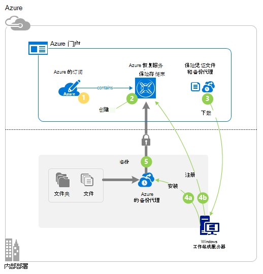

## 步骤 1︰ 获取 Azure 的订阅

如果您没有创建一个[免费帐户](https://azure.microsoft.com/free/)，可以访问任何 Azure 服务的 Azure 订阅。

## 步骤 2︰ 创建恢复服务存储库

若要备份您的文件和文件夹，您需要创建要用来存储数据的区域中恢复服务存储库。 您还需要确定存储复制的方式。

### 要创建恢复服务存储库

1. 如果您还没有登录到[Azure 门户](https://portal.azure.com/)使用 Azure 订购的这么做。

2. 中心的菜单上，单击**浏览**，在资源的列表中，键入**恢复服务**并单击**恢复服务存储库**。

    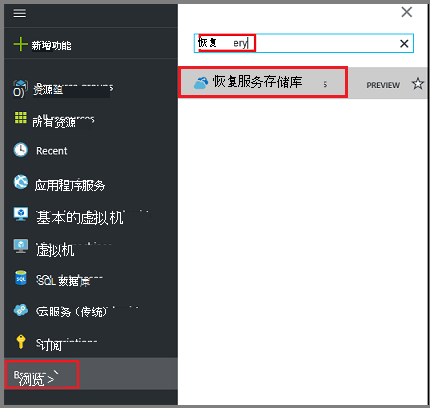  

3. 在**恢复服务存储库**菜单上，单击**添加**。

    

    恢复服务存储库刀片式服务器将打开，并提示您提供的**名称**、**订阅**、**资源组**和**位置**。

    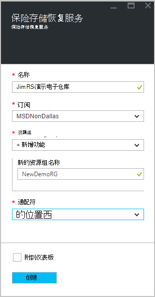

4. 对于**名称**，输入好记的名称来标识该存储库。

5. 单击以查看可用的订阅的**订阅**。

6. 单击**资源组**来查看可用资源组列表，或单击**新建**以创建新的资源组。

7. 单击以选择该存储库的地理区域的**位置**。 此选择确定的地理区域发送备份数据的位置。

8. 单击**创建**。

    如果您看不到已完成之后，列出您的存储库，请单击**刷新**。 当刷新列表时，请单击电子仓库的名称。

### 要确定存储冗余
当您首次创建恢复服务存储库您确定如何复制存储。

1. 单击新的存储库，以打开该仪表板。

2. 在**设置**刀片式服务器，它将自动打开与您的保险存储仪表板，请单击**备份基础结构**。

3. 在备份基础架构刀片式服务器，请单击要查看**存储复制类型**的**备份配置**。

    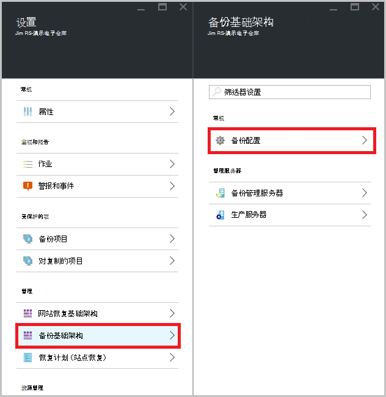

4. 选择适当的存储复制选项为您的存储库。

    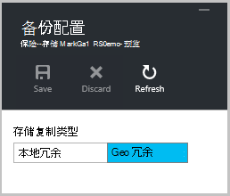

    默认情况下，您的存储库具有地理冗余存储。 如果您使用 Azure 作为主备份存储终结点，则继续使用地理冗余存储。 如果您使用 Azure 作为非主要备份存储终结点，然后选择本地冗余存储，这将降低在 Azure 存储数据的成本。 阅读更多关于[地理冗余](../storage/storage-redundancy.md#geo-redundant-storage)和本[概述](../storage/storage-redundancy.md)中的[本地冗余](../storage/storage-redundancy.md#locally-redundant-storage)存储选项。

现在，您已经创建了一个电子仓库，您准备您的基础架构来备份文件和文件夹下载的 Microsoft Azure 恢复服务代理和保险存储凭据。

## 步骤 3-下载文件

1. 恢复服务存储库操控板上单击**设置**。

    

2. 单击**入门 > 备份**设置刀片式服务器上。

    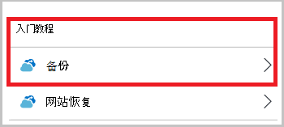

3. 单击备份刀片式服务器上的**备份目标**。

    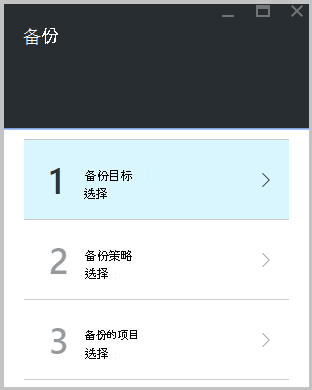

4. 选择**内部**从何处是运行工作负载？菜单。

5. 选择**文件和文件夹**从您做什么要备份？菜单上，单击**确定**。

### 下载恢复服务代理

1. 单击**下载 Windows 服务器的代理程序或 Windows 客户端****准备基础结构**刀片式服务器中。

    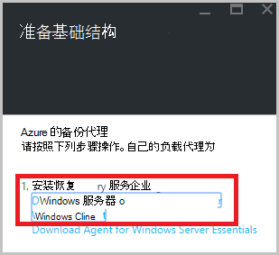

2. 在下载弹出窗口中，单击**保存**。 默认情况下， **MARSagentinstaller.exe**文件保存到您的下载文件夹。

### 下载凭据存储库

1. 单击**下载 > 保存**准备基础结构刀片式服务器上。

    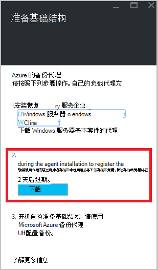

## 步骤 4-安装和注册代理

>[AZURE.NOTE] 通过 Azure 门户启用备份即将登场。 此时，您可以使用内部部署 Microsoft Azure 恢复服务代理要备份您的文件和文件夹。

1. 找到并双击**MARSagentinstaller.exe**从下载文件夹 （或其他保存的位置）。

2. 完成 Microsoft Azure 恢复服务代理安装向导。 要完成此向导，您需要︰

    - 选择安装和缓存文件夹的位置。
    - 如果您使用代理服务器连接到互联网，提供代理服务器的信息。
    - 如果您在使用经过身份验证的代理服务器，提供您的用户名用户名和密码的详细信息。
    - 提供下载存储库凭据
    - 将加密的密码保存在安全的位置。

    >[AZURE.NOTE] 如果您丢失或忘记了密码短语时，Microsoft 不能帮助恢复备份的数据。 请将文件保存在安全的位置。 它需要还原的备份。

现在安装代理，您的计算机注册到该存储库。 您可以配置并计划备份。

## 第 5 步︰ 备份您的文件和文件夹

初始备份包括两个主要任务︰

- 计划备份
- 第一次备份的文件和文件夹

若要完成初始备份，您可以使用 Microsoft Azure 恢复服务代理。

### 安排备份

1. 打开 Microsoft Azure 恢复服务代理。 您可以通过搜索**Microsoft Azure 备份**您的计算机中发现。

    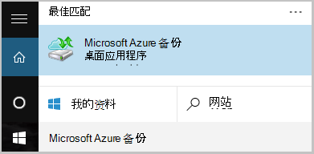

2. 在恢复服务代理，请单击**日程安排备份**。

    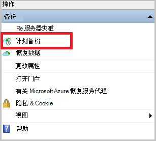

3. 在计划备份向导的入门页面上，单击**下一步**。

4. 在备份页中选择的项目，单击**添加项目**。

5. 选择的文件和您希望备份的文件夹，然后单击**好了**。

6. 单击**下一步**。

7. 在**指定备份计划**页上指定的**备份时间表**并单击**下一步**。

    您可以计划 （速度最大每日三次） 的每日或每周备份。

    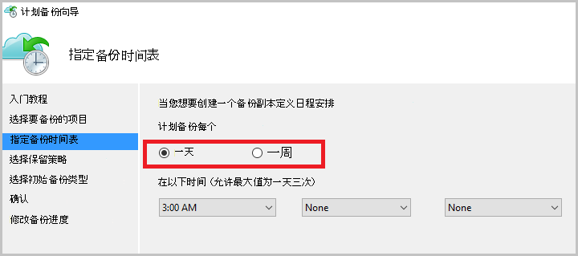

    >[AZURE.NOTE] 有关如何指定备份时间表的详细信息，请参阅文章[使用 Azure 备份来替换您的磁带基础结构](backup-azure-backup-cloud-as-tape.md)。

8. 在**选择保留策略**页上，选择备份副本的**保留策略**。

    保留策略指定的持续时间，将为其存储备份。 而不是只指定备份的所有点"平面策略"，您可以指定备份发生时根据不同的保留策略。 您可以修改每日、 每周、 每月和每年的保留策略，以满足您的需要。

9. 在选择初始备份类型页上选择的初始备份类型。 保留**在网络上自动**选择，选项，然后单击**下一步**。

    您可以自动通过网络备份，也可以离线备份。 本文的其余部分介绍了自动备份的过程。 如果您希望执行脱机备份，请查看文章[在 Azure 备份脱机备份工作流](backup-azure-backup-import-export.md)的其他信息。

10. 在确认页上查看信息，，然后单击**完成**。

11. 在向导完成创建备份时间表后，单击**关闭**。

### 第一次备份的文件和文件夹

1. 在恢复服务代理，请单击**立即备份**完成通过网络初始种子设定。

    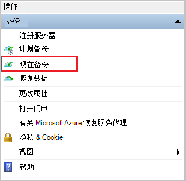

2. 在确认页上查看备份现在向导将使用备份计算机的设置。 然后单击**备份**。

3. 单击**关闭**以关闭向导。 如果您执行此操作之前备份过程完成后，向导将继续运行在后台。

初始备份完成后，**作业完成**状态出现在备份控制台。

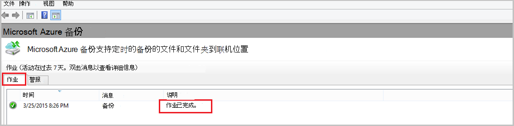

## 问题？
如果您有问题，或[向我们发送反馈](http://aka.ms/azurebackup_feedback)您想要查看包含，任何功能。

## 下一步行动
- 获取有关[备份 Windows 机器](backup-configure-vault.md)的详细信息。
- 现在，您已备份文件和文件夹，您可以[管理您的存储库和服务器](backup-azure-manage-windows-server.md)。
- 如果您需要还原的备份，使用[将文件还原到 Windows 机器](backup-azure-restore-windows-server.md)到这篇文章。
