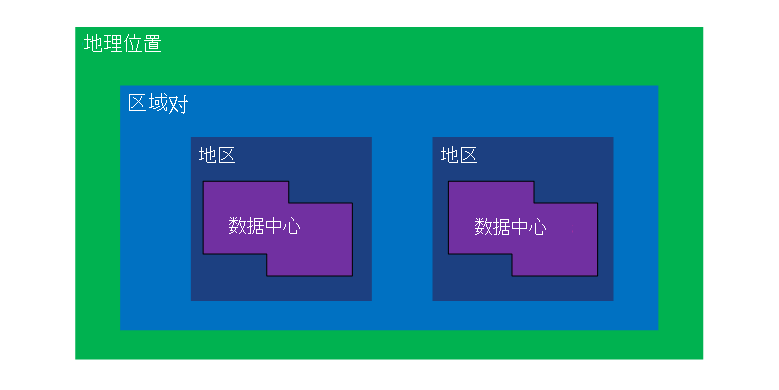
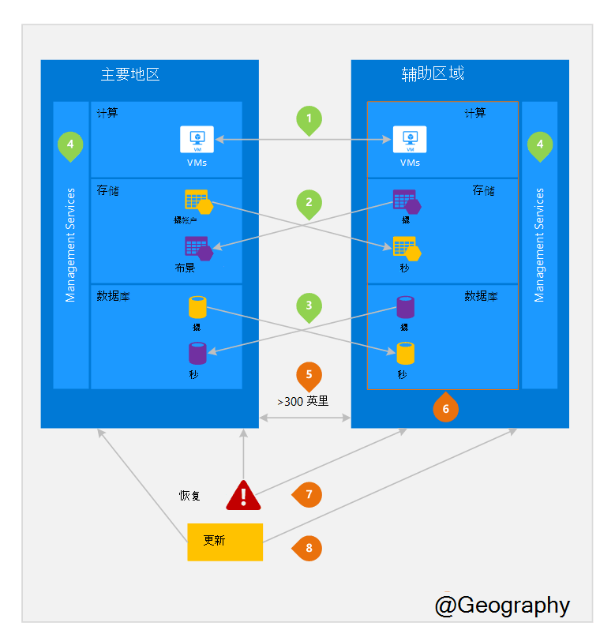

<properties
    pageTitle="业务连续性和灾难恢复 (BCDR): Azure 配对区域 |Microsoft Azure"
    description="Azure 的区域对确保应用程序在数据中心故障期间也能恢复。"
    services="site-recovery"
    documentationCenter=""
    authors="rayne-wiselman"
    manager="jwhit"
    editor=""/>

<tags
    ms.service="site-recovery"
    ms.workload="storage-backup-recovery"
    ms.tgt_pltfrm="na"
    ms.devlang="na"
    ms.topic="article"
    ms.date="08/23/2016"
    ms.author="raynew"/>

# 业务连续性和灾难恢复 (BCDR): Azure 配对区域

## 什么是成对出现的区域？

Azure 的操作在世界各地的多个地区。 Azure 的地理位置是世界上包含至少一个 Azure 区域定义的区域。 Azure 的区域是包含一个或多个数据中心一个地区内的一个区域。

每个 Azure 地区配备在同一地区，一起进行一个地区对其他地区。 例外情况是巴西南部其中配备其地理位置以外的区域。

图 1 – Azure 的区域对关系图

| 地理位置     |  成对的区域  |                     |
| :-------------| :-------------   | :-------------      |
| 北美地区 | 美国中北部 | 美国中南部    |
| 北美地区 | 东亚的美国          | 美国西部             |
| 北美地区 | 美国东部 2        | 美国中部          |
| 北美地区 | 西美国 2        | 美国西中部     |
| 欧洲        | 北欧     | 西欧         |
| 亚洲          | 东南亚  | 东亚           |
| 中国         | 东亚中国       | 北美中国         |
| 日本         | 日本东       | 日本西部          |
| 巴西        | 巴西南部 (1) | 美国中南部    |
| 澳大利亚     | 澳大利亚东部   | 澳大利亚东南部 |
| 美国政府 | 美国 Gov 爱荷华州      | 美国 Gov 弗吉尼亚     |
| 印度         | 中央印度    | 印度南部         |
| 加拿大        | 加拿大中部   | 加拿大东部         |
| 英国            | 英国西          | 英国南部            |

表 1-的 azure 的区域对映射

> （1） 巴西南部是唯一的因为配备在自己地区以外的区域。 巴西南部的次地区是美国南部中部但南部中心美国辅助区域不是巴西南部。

我们建议您跨区域对受益于 Azure 的隔离和可用性策略复制工作负载。 例如，按顺序部署规划的 Azure 系统更新 （而不是在同一时间） 跨成对的地区。 这意味着，即使在出现故障的更新的可能性极小，这两个地区将不会影响同时。 此外，万一发生的大停电，至少一个地区，不是每一对恢复确定优先级。

## 一种成对的区域
下面的图 2 显示了一个假想的应用程序，它使用灾难恢复的区域对。 绿色的数字突出显示三个 Azure 服务 （Azure 计算、 存储和数据库） 和如何配置它们来复制区域间的跨区域活动。 橙色的数字突出显示部署成对区域间的独特优势。

图 2 – 假想 Azure 的区域对

## 跨区域活动
如图 2 中引用的。

 **Azure 计算 (PaaS)** – 必须提供更多的计算资源，事先要确保资源可用在其他地区在灾难期间。 有关详细信息，请参阅[Azure 复原技术指导](./resiliency/resiliency-technical-guidance.md)。

 Azure 存储帐户创建后，默认情况下配置**Azure 存储**的地理冗余存储 (GRS)。 GRS，使用您的数据自动复制三次的主区域中和三次成对的地区。 有关详细信息，请参阅[Azure 存储冗余选项](storage/storage-redundancy.md)。

 **Azure SQL 数据库**– 使用 Azure SQL 标准地区复制，您可以配置异步复制的交易记录到成对的地区。 使用高级地区复制，可以在世界; 配置复制到任何地区但是，我们建议您部署这些资源在成对的地区的大多数灾难恢复方案。 有关详细信息，请参阅[地区复制 SQL Azure 数据库中](./sql-database/sql-database-geo-replication-overview.md)。

 **Azure 资源管理器 (ARM)**的 ARM 本身是区域间提供服务管理组件的逻辑隔离。 这意味着在一个区域中的逻辑故障不太可能会影响另一个。

## 成对的区域的好处
如图 2 中引用的。  

**物理隔离**– 如果可能，虽然这不实际或不可能在所有地理区域 Azure 首选至少 300 英里一区域对数据中心之间的隔离。 物理数据中心分离减少自然灾害、 局势动荡、 电源中断或物理网络中断同时影响两个地区的可能性。 隔离是在地理 （地域大小、 电源/网络基础架构的可用性、 法规等） 约束。  

**平台提供复制**的某些服务，如地理冗余存储提供自动复制到成对的地区。

**地区恢复顺序**– 出现广泛停机时，一个地区的恢复优先顺序不是每一对。 成对的区域间部署的应用程序都有恢复具有优先级的地区之一。 如果未成对的区域间部署应用程序时，恢复可能会延迟 – 选定的区域可能是要恢复的最后两个最坏的情况。

**连续更新**– 计划 Azure 系统更新的顺序推出成对地区 （而不是在同一时间） 尽量减少停机时间、 bug 和逻辑故障中罕见的坏的更新的效果。

**数据派驻服务**--一个地区驻留在相同地理位置作为其对 （除了巴西南） 为了满足数据派驻有关税务和法律强制管辖权目的。

