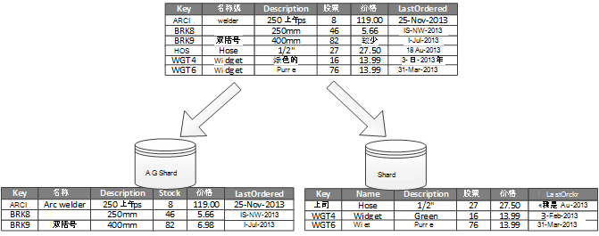
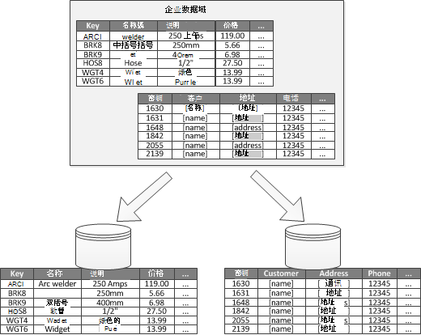

<properties
   pageTitle="数据分区指导 |Microsoft Azure"
   description="有关如何在不同的磁盘分区进行管理和访问单独指导。"
   services=""
   documentationCenter="na"
   authors="dragon119"
   manager="christb"
   editor=""
   tags=""/>

<tags
   ms.service="best-practice"
   ms.devlang="na"
   ms.topic="article"
   ms.tgt_pltfrm="na"
   ms.workload="na"
   ms.date="07/14/2016"
   ms.author="masashin"/>

# 数据分区指导

[AZURE.INCLUDE [pnp-header](../includes/guidance-pnp-header-include.md)]

## 概述

在许多大型解决方案中，数据被分为独立的分区进行管理和访问分别。 必须谨慎选择分区战略，以实现最大的好处，同时尽量减少不利影响。 分区可以帮助改进的可扩展性，减少争用，并优化性能。 分区的另一个好处是它可以提供一种机制，除以使用模式的数据。 例如，您可以存档较旧、 不太活跃的 （冷） 数据更便宜的数据存储区中。

## 为什么数据分区？

大多数云应用程序和服务存储和检索数据，作为其运作的一部分。 应用程序使用的数据存储区的设计可以显著影响性能、 吞吐量和可伸缩性的系统。 通常应用在大型系统中的一种方法是将数据划分为不同的分区。

> 术语_分区_使用本指南中是指物理上将数据划分为不同的数据存储区的过程。 这不是相同 SQL Server 表分区，即不同的概念。

数据分区可以提供很多好处。 例如，它可以应用于顺序︰

- **改进的可扩展性**。 当您扩展单个数据库系统时，它将最终会到达物理硬件限制。 如果您跨多个分区，其中每个单独的服务器承载，划分的数据，可以几乎无限放大系统。
- **提高性能**。 每个分区上的数据访问操作发生在较小的数据量。 假设数据进行分区以合适的方式，在分区，可以使您的系统更有效。 影响多个分区的操作可以并行运行。 每个分区可以靠近使用最小化网络延迟的应用程序。
- **提高可用性**。 跨多个服务器之间的数据可避免单点故障。 如果一个服务器出现故障，或正在进行计划内的维护，只将数据，分区是不可用。 在其他分区上的操作可以继续。 增加的分区数减少将不可用的数据率，从而减少相对单个服务器故障的影响。 复制每个分区可以进一步减少影响操作单个分区出现故障的几率。 这还使 it 可能必须不断的关键数据并从低价值数据高可用性具有更低的可用性要求 （例如，日志文件）。
- **提高安全性**。 根据数据和分区的方式的性质，有可能要将敏感和非敏感数据划分为不同的分区，并因此向不同的服务器或数据存储。 然后可以进行安全专门优化的敏感数据。
- **提供操作灵活性**。 分区提供了许多用于微调操作，最大限度地提高管理效率，和最小化成本的机会。 例如，您可以定义不同的策略来管理、 监视、 备份和恢复和基于每个分区中的数据的重要性的其他管理任务。
- **数据存储使用的模式匹配**。 分区允许每个分区部署在不同类型的数据存储，基于成本和数据存储提供的内置功能。 例如，大型二进制数据可以存储在 blob 数据存储区，而更结构化的数据可以保存在文档数据库中。 详细信息，请参阅[构建 polyglot 解决方案]模式和实践指南中和[高度可伸缩的解决方案的数据访问︰ 使用 SQL，NoSQL 和 polyglot 的持久性]Microsoft 网站上。

某些系统不实现分区，因为它被认为是成本，而不是一个优点。 此原理的常见原因包括︰

- 许多数据存储系统不支持跨分区，联接，它很难在已分区的系统中维护引用完整性。 经常需要实现联接和完整性检查在应用程序代码 （在分区的层），可能会导致额外的 I/O 和应用程序的复杂性。
- 维护分区并不总是一项重要任务。 在其中的数据是易失性系统中，您可能需要重新平衡分区定期以减少争用和热点问题。
- 一些常见工具不适很自然地与已分区数据。

## 设计分区

数据可以以不同的方式进行分区︰ 水平、 垂直或功能上。 所选择的策略取决于分区的数据和应用程序和服务将使用的数据的要求的理由。

> [AZURE.NOTE] 本指南中所述的分区方案所述独立于底层的数据存储技术的一种方式。 它们可以应用到多种类型的数据存储区，其中包括关系和 NoSQL 数据库。

### 分区策略

数据分区的三个典型策略是︰

- **水平分区**（通常称为_分片_）。 在此策略中，每个分区的数据存储在其自己的权利，但所有分区都具有相同的架构。 每个分区称为_shard_ ，包含的数据，例如一组特定的电子商务应用程序中的客户的所有订单的特定子集。
- **垂直分区**。 在此策略中，每个分区包含在数据存储区中项的字段的子集。 字段被划分及其图案的使用。 例如，在一个垂直的分区和更少的频繁访问在另一个字段，可能会放频繁访问的字段。
- **功能分区**。 在此策略中，根据其使用的方式每个绑定上下文系统中聚合数据。 例如，一个电子商务系统实现分隔为开具发票的业务职能，并管理产品库存可能发票数据存储在另一个分区和产品库存数据。

值得注意的是，可以结合使用此处所述的三个策略。 它们并不相互排斥，并建议在设计一种分区方案时考虑所有这些。 例如，您可能将数据划分为 shards，然后使用垂直分区进一步细分每个 shard 中的数据。 同样，功能分区中的数据可以分为 shards （它可以也垂直分区）。

但是，每个策略的不同要求可引发大量矛盾问题。 您必须评估和平衡所有这些设计符合您的系统的总体数据处理性能目标分区方案时。 以下各节探讨每个详细的策略。

### 水平分区 （分片）

图 1 显示了水平分区或分片的概述。 在此示例中，产品库存数据分为 shards 基础的产品密钥。 每个 shard 保存的数据的一组连续的 shard 的键 （A G 和 H Z），按字母顺序组织。

_图 1。水平分区 （分片） 基于分区键的数据_

分片可帮助您将加载分布到更多的计算机，从而减少争用并提高了性能。 您可以通过添加更多的在其他服务器运行的 shards 扩展出系统。

实现此分区的策略都是分片键的选择时，最重要的因素。 它可能很难在系统中操作后更改密钥。 该密钥必须确保数据进行分区以使工作负荷平均尽可能在 shards 之间。

请注意，不同的 shards 不需要包含相似的数据量。 而更重要的考虑因素是平衡的请求数。 某些 shards 可能会非常大，但每个项目进行访问操作的数量较少的主题。 其他 shards 可能较小，但更经常被访问的每一项。 还有一点需要确保一个 shard 不超过 （根据容量和处理资源） 的数据存储区，用于承载该 shard 的比例限制。

如果您使用分片方案，避免创建热点 （或热分区），可能会影响性能和可用性。 例如，如果您使用的客户标识符的哈希值而不是客户的姓名的首字母，则禁止的不均衡的分布，得出常见和常用的首字母。 这是一种有助于跨分区更均匀分布数据的典型技术。

选择最小化任何未来的需求将大 shards 拆分为更小的部分，分片键合并成更大的分区，小 shards 或更改描述一套分区中存储的数据的架构。 这些操作可以是非常耗时，并且可能需要将一个或多个 shards 离线执行它们的同时。

如果 shards 被复制，有可能使一些在线复制副本时其他人拆分、 合并，或重新配置。 但是，系统可能需要限制重新开始执行时可以对这些 shards 中的数据执行的操作。 例如，在复制副本中的数据可以标记为只读--以限制的范围不一致，而 shards 正在重组中可能发生的。

> 有关更多详细信息和有关这些考虑因素以及设计实现水平分区的数据存储技术很好的做法的很多指导，请参阅[分片模式]。

### 垂直分区

垂直分区的最常见用途是以减少 i/o 操作和性能成本与提取项目的访问频率最高。 图 2 显示垂直分区的示例。 在此示例中，为每个数据项的不同属性保存在不同的分区。 一个分区保存数据的访问更频繁，包括名称、 说明和产品价格信息。 另一个持有股票和有序的最后日期中的卷。

_图 2。通过使用其模式的垂直分区数据_

在此示例中，应用程序定期查询产品名称、 说明和价格向客户显示产品详细信息时。 库存水平和上次从制造商处订购产品的日期保存在一个单独的分区中因为这两项通常一起使用。

还有一个好处，这种分区方案相对较慢的移动数据 （产品名称、 说明和价格） 分开更加动态化的数据 （存货水平和有序的最后日期）。 应用程序可能会发现更有利如果经常访问它缓存在内存中的缓慢移动的数据。

为此分区策略的另一个典型方案是最大化敏感数据的安全性。 例如，你可以通过在单独的分区中存储信用卡号码和相应卡安全验证号码。

垂直分区还可以减少需要对数据的并发访问量。

> 垂直分区内数据存储区中，部分规范化分解它从_各种_项目_缩小_项目一套实体实体级别运行。 它非常适合于如 HBase 和卡桑德拉的面向列的数据存储区。 如果列的集合中的数据不太可能更改，您也可以考虑使用列存储在 SQL Server 中。

### 功能分区

系统是可以确定每个不同的业务领域或应用程序中的服务的绑定的上下文中，功能分区改进隔离和数据访问的性能提供一种技术。 功能分区的另一个常见用途是用于报告目的的只读的数据中分隔读写数据。 图 3 显示了清单数据分开客户数据功能分区的概览。

_图 3。通过有限的上下文或子域的功能分区数据_

此分区策略可以帮助减少在系统的不同部分之间的访问冲突。

## 设计了可扩展性的分区

其关键是要考虑大小，并为每个分区的工作负载和平衡它们，以使数据分布达到最大的可伸缩性。 但是，您必须还对数据进行分区，以便它不会超过单个分区存储的比例限制。

设计可伸缩性的分区时，请执行以下步骤︰

1. 分析应用程序理解数据访问模式，如每个查询返回的结果集大小，访问频率、 固有的滞后时间和服务器端计算的处理要求。 在许多情况下，几个主要实体将需要大多数的处理资源。
2. 使用这种分析来确定当前和未来的可扩展性目标、 数据大小和工作量等。 然后在分区以满足可伸缩性目标分发数据。 水平分区策略，选择合适的 shard 密钥是确保分发甚至是重要。 有关详细信息，请参阅[分片模式]。
3. 请确保每个分区的可用资源不足，无法处理数据的大小和吞吐量方面的可伸缩性要求。 例如，宿主分区节点可能施加的处理能力或其提供的网络带宽的存储空间量的硬限制。 如果数据存储和处理要求可能超过这些限制，它可能需要调整您的分区策略或进一步分割出的数据。 例如，可扩展性的一种方法可能是分开的核心应用程序功能的数据记录。 通过使用单独的数据存储区来防止超出比例的限制，节点的总数据存储要求执行此操作。 如果数据存储区的总数超过了节点限制，可能需要使用单独的存储节点。
4. 监视使用验证像预期的那样，分布式数据和分区可以处理对它们施加的负荷下系统。 很可能使用不符预期由分析的使用情况。 在这种情况下，有可能要重新平衡这些分区。 如果不成功，可能需要重新设计以获得所需的平衡系统的某些部分。

请注意某些云环境中分配资源基础结构边界。 请确保所选边界的限制，提供足够的空间存放在该卷的数据，在数据存储、 处理能力和带宽方面的任何预期的增长。

例如，如果您使用 Azure 表存储，忙 shard 可能需要更多的资源，而不只是供单个分区来处理请求。 （没有限制在特定的时间内可以由单个分区处理的请求量。 请参阅页面[Azure 存储可扩展性和性能目标]Microsoft 网站以获取更多详细信息。

 如果出现这种情况，shard 可能需要重新分区以分散负载。 如果这些表中的吞吐量的总大小超过容量的存储帐户，它可能需要创建额外的存储帐户，并分布在这些科目的表。 如果存储帐户的数目超过可供订阅的帐户数，则可能需要使用多个订阅它。

## 设计查询性能的分区

通过使用较小的数据集并运行并行查询，通常可以提升查询性能。 每个分区应包含整个数据集的一小部分。 这种减少卷中的可以提高查询的性能。 不过，分区不是恰当的设计和适当地配置数据库。 例如，请确保具有必要的索引到位，如果您使用的关系数据库。

设计查询性能的分区时，请执行以下步骤︰

1. 检查应用程序的要求和性能︰
    - 使用业务需求来确定关键始终必须快速执行的查询。
    - 监视系统以识别任何执行缓慢的查询。
    - 建立最常执行的查询。 每个查询的单个实例可能具有最小的成本，但累计占用的资源可能很大。 它可能有利，可分隔到不同的分区或甚至一个缓存通过这些查询来检索数据。
2. 分区导致性能降低的数据︰
    - 限制每个分区的大小，以便查询响应时间目标内。
    - 设计 shard 键，以便应用程序可以轻松地找到该分区如果实现水平分区。 这样可以防止查询不必进行扫描，每个分区。
    - 请考虑一个分区的位置。 如果可能，请尝试将数据保存在地理上接近的应用程序和访问它的用户的分区。
3. 如果一个实体具有吞吐量和查询性能要求，使用基于该实体的功能分区。 如果这样仍不能满足要求，应用水平分区也。 在大多数情况下都可以单个分区策略，但在某些情况下它是更有效地结合这两种策略。
4. 可考虑使用异步查询的并行运行跨分区以提高性能。

## 设计可用性的分区

数据分区通过确保整个数据集并不构成单点故障和单个数据集的子集，可以独立地管理可以提高应用程序的可用性。 复制包含关键数据的分区也可以提高可用性。

在设计和实施分区时, 请考虑下列因素会影响可用性︰

- **如何重要的数据是在对业务运营**。 某些数据可能包括关键业务信息，如发票详细信息或银行交易记录。 其他的数据可能包括不太关键的运营数据，如日志文件、 性能跟踪等。 确定后每种数据类型，请考虑︰
    - 与适当的备份计划高可用性分区中存储关键数据。
    - 建立独立的管理和监控机制或不同 criticalities 的每个数据集的过程。 放置，以便它可以备份在一起以适当的频率具有相同级别的危险程度在同一分区中的数据。 例如，存放的银行交易记录的数据的分区可能需要比保存日志记录或跟踪信息的分区更频繁地进行备份。
- **如何可以管理单个分区**。 设计分区以支持独立的管理和维护提供了多种优势。 例如︰
    - 一个分区出现故障，则可以恢复独立而不影响其他分区中的数据访问应用程序的实例。
    - 按地理区域的数据分区允许在非高峰时间为每个位置发生的定期的维护任务。 确保分区不是太大，以防止在此期间完成任何计划中的维护。
- **是否复制跨分区的关键数据**。 这种策略可以提高可用性和性能，但同时也带来了一致性问题。 花些时间来与每个副本进行同步到一个分区中的数据所做的更改。 在此期间，不同的分区将包含不同的数据值。

## 了解如何划分影响设计和开发

使用分区增加的设计和系统开发的复杂性。 请考虑分区作为基本的系统设计，即使一部分系统最初只包含一个分区。 如果您解决分区事后，当系统开始受到影响性能和可伸缩性问题，复杂性增加，因为已经有实时系统维护。

如果您更新系统以合并分区在此环境中，它需要修改数据访问逻辑。 它还涉及到迁移现有数据分发跨分区，通常用户期望能够继续使用系统时的数量很大。

在某些情况下，分区认为并不重要因为初始数据集更小，并且可以由一台服务器很容易处理。 可能会出现的系统，不需要扩展到其初始大小，这但许多商业系统需要扩展用户数量的增加。 这一业务扩展通常伴随中数据量的增长。

还有一点需要了解，分区并不总是大型数据存储库的函数。 例如，较小的数据存储区可能很大程度由几百个并发客户端访问。 在此情况下将数据分区可以帮助减少争用和提高吞吐量。

在设计数据的分区方案时，请考虑以下几点︰

- **如有可能，将最常见的数据库操作的数据放在每个分区，尽量减少跨分区数据访问操作**。 查询跨分区可能是更耗时比查询仅在单个分区，但优化查询的一组分区可能产生负面影响其他集的查询。 当不能避免跨分区查询时，通过最小化查询时间运行并行查询和聚合应用程序内的结果。 这种方法可能无法在某些情况下，如有必要获得从一个查询的结果，并在下一次查询中使用它。
- **如果查询所进行的相对静态的引用数据，如邮政编码表或产品列表的使用，请考虑复制此数据中的所有分区，以减少在不同的分区中的单独查询操作的必要条件**。 这种方法还可以减少日益受到较大的通讯量，从整个系统内的"热门"数据集引用数据的可能性。 但是，没有额外成本与此引用数据对可能发生的任何更改同步。
- **如有可能，尽量减少跨垂直和功能分区的引用完整性的要求**。 在这些方案中，应用程序本身负责更新数据并将其消耗在分区之间维护引用完整性。 必须加入跨多个分区的数据的查询运行速度比联接只在同一分区中的数据，因为应用程序通常需要进行连续查询基于一个密钥，然后一个外键的查询很慢。 相反，请考虑复制或反规范化的相关数据。 最小化查询时间跨分区联接都是必要的在分区上运行并行查询，并将加入到应用程序中的数据。
- **请考虑分区方案可能对跨分区数据一致性的影响。** 评估是否强一致性是实际的要求。 相反，在云中的常用方法是实现最终一致性。 单独更新每个分区中的数据和应用程序逻辑可以确保该更新所有成功完成。 它还可以处理可能产生的最终一致操作运行时查询数据的不一致。 有关实现最终一致性的详细信息，请参阅[数据一致性的初级读本]。
- **考虑如何查询找到正确的分区**。 如果查询必须扫描所有的分区来定位所需的数据，还有很大的影响在性能，即使多个并行查询的运行时。 查询所使用的垂直和功能分区策略自然可以指定分区。 但是，水平分区 （分片） 可以使查找项目很困难，因为每个 shard 具有相同的架构。 典型的解决方案为分片是维护可以用于查找特定数据项的 shard 位置的映射。 此映射可以分片逻辑的应用程序中实现，或如果它支持透明分片所维护的数据存储区。
- **当使用水平分区策略，请考虑定期重新平衡 shards**。 这有助于均匀分布数据，按大小和最小化的热点，尽可能提高查询性能，并解决物理存储限制的工作负载。 但是，这是一个复杂的任务，通常需要使用自定义工具或过程。
- **如果您复制的每个分区，它提供了额外的保护，针对故障**。 如果单个复制副本失败，可以将查询定向向工作副本。
- **如果达到物理极限的分区策略，您可能需要扩展到不同级别的可伸缩性**。 例如，如果分区是在数据库级别，您可能需要定位或复制在多个数据库分区。 如果分区已经是在数据库级别上，并且物理限制问题，它可能意味着您需要定位或复制多个托管帐户中的分区。
- **避免交易记录，访问多个分区中的数据**。 某些数据存储实现事务的一致性和完整性的操作，修改数据，但数据都存储在单个分区。 如果您需要事务支持跨多个分区，您可能需要实现此应用程序逻辑的一部分，因为最分区的系统都不提供本机支持。

所有的数据存储需要一些经营管理和监视活动。 任务的范围可以从加载数据、 备份和还原数据、 重新组织数据，并确保在系统正常、 高效地执行。

请考虑下列因素会影响经营管理︰

- **如何实施适当的管理和操作任务时的数据分区**。 这些任务可能包括备份和恢复、 存档数据、 监视系统，以及其他管理任务。 例如，备份和还原操作期间维护逻辑一致性会很难。
- **如何将数据加载到多个分区中添加新的数据，从其他来源收到**的。 某些工具和实用程序可能不支持 sharded 的数据操作，例如将数据加载到正确的分区。 这意味着，您可能需要创建或获取新的工具和实用程序。
- **如何存档和删除定期数据**。 若要防止过度增长的分区，您需要存档和删除数据 （可能是每月一次） 定期。 它可能需要转换数据以匹配不同的归档模式。
- **如何查找数据完整性问题**。 请考虑运行找到引用缺少的信息，在另一个分区中的任何数据完整性问题，如数据的定期进程。 该过程可以尝试自动修复这些问题或引发警报给操作员手动解决这些问题。 例如，在电子商务应用程序，订单信息可能会保存在一个分区，但构成每个订单行项可能保存在另一个。 下订单的过程需要将数据添加到其他分区。 如果此过程失败，那里可能行项存储为其没有任何相应的顺序。

不同的数据存储技术通常提供自己的功能来支持分区。 以下部分总结了常用的 Azure 应用程序的数据存储区的实现的选项。 他们还描述了用于设计可以最有效地利用这些功能的应用程序的注意事项。

## SQL Azure 数据库的分区策略

Azure SQL 数据库是关系数据库为-服务在云环境中运行。 它基于 Microsoft SQL Server。 关系数据库将信息分为表，并且每个表包含一系列行作为实体的相关信息。 每一行都包含列包含单个字段的实体的数据。 页面[SQL Azure 数据库是什么？]在 Microsoft 网站提供了有关创建和使用 SQL 数据库的详细的文档。

## 用弹性数据库的水平分区

单个的 SQL 数据库的到它可以包含的数据量的限制。 吞吐量受结构因素和它所支持的并发连接数。 弹性的数据库功能的 SQL 数据库支持的 SQL 数据库进行水平缩放。 使用弹性数据库，您可以将数据分割成分布在多个 SQL 数据库的 shards。 您还可以添加或删除 shards，因为您需要处理的数据量的增长和收缩。 使用弹性数据库还可以帮助减少争用数据库间分配负载。

> [AZURE.NOTE] 弹性的数据库是 SQL Azure 数据库的联合功能的替代。 现有的安装可通过联合体迁移工具迁移到弹性数据库的 SQL 数据库联盟。 或者，您可以实现自己的分片机制如果方案不适用于自然所提供的弹性数据库的功能。

每个 shard 作为 SQL 数据库实现。 Shard 中可以包含多个数据集 （称为_shardlet_）。 每个数据库维护元数据来描述它所包含的 shardlets。 Shardlet 可以是单个数据项，也可以是一组共享相同的 shardlet 键的项。 例如，如果您在多租户应用程序分片数据，shardlet 键可以是租户 ID，并给定租户的所有数据可都保存为相同的 shardlet 的一部分。 其他租户的数据都将保留在不同的 shardlets。

它是程序员的责任要 shardlet 键相关联的数据集。 一个单独的 SQL 数据库充当全球 shard 地图管理器。 此数据库包含系统中所有的 shards 和 shardlets 的列表。 客户端应用程序访问的数据首先连接到全局 shard 地图管理器数据库以获取一份 shard 地图 （列出了 shards 和 shardlets），它然后在本地缓存的。

然后，应用程序使用适当的 shard 数据请求路由到此信息。 此功能是隐藏在一系列的包含在 Azure SQL 数据库弹性数据库客户端库，即作为 NuGet 程序包提供的 Api。 在 Microsoft 网站上的[弹性数据库功能概述]页提供了弹性数据库的更全面介绍。

> [AZURE.NOTE] 您可以复制全局 shard 地图管理器数据库以减少等待时间并提高可用性。 如果您使用某一最优定价层实现数据库，您可以配置不断地将数据复制到数据库中不同区域的活动地区-复制。 用户基于每个区域中创建数据库的副本。 然后，配置您的应用程序连接到该副本获取 shard 映射。

> 另一种方法是使用 Azure SQL 数据同步或 Azure 数据工厂管线跨区域复制 shard 映射管理器数据库。 这种形式的复制定期运行，且如果不经常更改的 shard 映射更适合。 此外，shard 映射管理器数据库不必使用定价层津贴来创建。

弹性的数据库提供了用于将数据映射到 shardlets，并将它们存储在 shards 中的两种方案︰

- **列表 shard 图**描述单个密钥和 shardlet 之间的关联。 例如，在多租户的系统中，每个租户的数据可以唯一键关联和存储在其自己的 shardlet。 以保证隐私和隔离 (即，以防止一个租户耗尽空间供其他用户的数据存储资源)，每个 shardlet 可以持有自己的 shard 中。

_图 4。使用列表 shard 映射租户的数据存储在单独的 shards_

- **区域 shard 图**描述了一组连续的密钥值和 shardlet 之间的关联。 在多租户前面描述的示例，除了实现专用的 shardlets，您可以分组内相同的 shardlet （每个都有它们自己的键） 承租人的一组数据。 此方案是比第一个更便宜的 （因为承租人共享数据存储资源），但它会导致减少了的数据的保密性和隔离的危险。

_图 5。使用范围 shard 映射范围的租户的数据存储在 shard_

请注意，单个 shard 可以包含几个 shardlets 的数据。 例如，可以使用列表 shardlets 将数据存储为同一个 shard 中不同非连续的承租人。 虽然解决通过全局 shard 地图管理器数据库中不同的映射，也可以混合范围 shardlets 和在相同的 shard 中，列表 shardlets。 （全局 shard 映射管理器数据库可以包含多个 shard 映射）。图 6 演示了这种方法。

_图 6。实现多个 shard 映射_

实施的分区方案可以对您的系统的性能有重要轴承。 它也会影响的速率的 shards 具有要添加或删除或的数据必须重新分区在 shards 之间的比率。 当您使用弹性数据库对数据进行分区时，请考虑以下几点︰

- 在同一个 shard，一起使用的数据进行分组，以避免需要访问多个 shards 在存放数据的操作。 请记住，使用弹性数据库，shard 是自主权限，SQL 数据库和 SQL Azure 数据库不支持跨数据库联接 （这需要在客户端执行）。 也请记住，在 Azure SQL 数据库中，引用完整性约束、 触发器和存储的过程在一个数据库中不能引用另一个对象。 因此，不要设计系统 shards 之间具有相关性。 SQL 数据库，但是，包含保存频繁使用的查询以及执行其他操作的引用数据份表。 这些表不需要属于任何特定的 shardlet。 在 shards 之间复制此数据可以帮助删除跨越数据库的连接数据的需要。 理想情况下，这样的数据应为静态或移动缓慢将复制工作量降至最低并降低其陈旧的可能性。

    > [AZURE.NOTE] 尽管 SQL 数据库不支持跨数据库的联接，可以执行与弹性的数据库 API 跨 shard 查询。 这些查询可以透明地循环访问由 shard 映射引用的所有 shardlets 中保存的数据。 弹性数据库 API 符跨 shard 向下查询到一系列单个查询 （一个用于每个数据库），然后合并结果。 有关详细信息，请参阅 Microsoft 网站上的[多 shard 查询]的页。

- Shardlets 属于相同的 shard 映射中存储的数据应具有相同的架构。 例如，请不要创建指向包含租户数据一些 shardlets 和其他 shardlets 包含产品信息的列表 shard 映射。 此规则不会强制进行弹性数据库中，但数据管理和查询变得非常复杂，如果每个 shardlet 具有不同架构。 在示例中只是提到，良好是解决方案是创建两个列表 shard 映射︰ 一个引用租户数据，另一个指向产品信息。 请记住，属于不同的 shardlets 的数据可以存储在同一个 shard。

    > [AZURE.NOTE] 弹性的数据库 API 的跨 shard 查询功能取决于每个 shardlet 在 shard 映射中包含相同的架构。

- 都保存在相同的 shard 中，而不是跨 shards 的数据仅支持事务性操作。 交易记录可以跨越 shardlets，只要它们是同一个 shard 的一部分。 因此，如果您的业务逻辑需要进行交易，将受影响的数据存储在同一个 shard 或者实现最终一致性。 有关详细信息，请参阅[数据一致性的初级读本]。
- 将访问这些 shards 中的数据的用户接近 shards (换句话说，geo-找到 shards)。 此策略有助于减少延迟。
- 避免混用强烈活动 （热点） 和相对处于非活动状态的 shards。 试着在 shards 之间均匀分布负载。 这可能需要哈希的 shardlet 键。
- 如果要查找 geo shards，确保哈希的键映射到 shardlets shards 附近访问该数据的用户存储中保存。
- 目前，只有一组有限的 SQL 数据类型都支持作为 shardlet 键;_int、 bigint、 低级_和_唯一标识符_。 SQL _int_和_bigint_类型对应于 C# 中的_int_和_long_数据类型，并且具有相同的范围。 可以在 C# 中使用一个_字节_数组处理 SQL_低级_类型和 SQL _uniqueidentier_类型对应于.NET Framework 中的_Guid_类。

正如名称所示，弹性数据库就可以为系统添加和删除 shards，随着数据量的缩小和放大。 在 Azure SQL 数据库弹性数据库客户端库的 Api 使应用程序可以创建并动态删除 shards （和透明地更新 shard 地图管理器）。 但是，shard 中删除是破坏性操作还需要删除该 shard 中的所有数据。

如果应用程序需要将 shard 拆分为两个单独的 shards 或合并 shards，弹性数据库提供了单独的拆分合并服务。 此服务运行在云托管服务 （它必须由开发人员创建） 和 shards 之间安全地迁移数据。 有关详细信息，请参阅 Microsoft 网站上的[缩放使用弹性数据库拆分合并工具]的主题。

## Azure 存储的分区策略

Azure 存储提供了用于管理数据的三种抽象︰

- 表存储，从而实现可伸缩的结构存储。 表中包含的实体，其中每个可以包含一组属性和值的集合。
- Blob 存储，提供了用于大型对象和文件存储。
- 存储队列，支持可靠异步消息处理应用程序之间。

表存储和 blob 存储都是经过了优化，分别存储结构化和非结构化数据的实质上是键 / 值存储。 存储队列提供一种机制，用于构建松散耦合的、 可扩展的应用程序。 在 Azure 存储帐户的上下文中创建了表存储、 blob 存储和存储队列。 存储帐户支持冗余的三种形式︰

- **本地冗余存储**，从而维护三份单个数据中心中的数据。 这种形式的冗余保护防止出现硬件故障，但不是针对包括整个数据中心灾难。
- **区域冗余存储**，并保留三份数据分布在同一区域内不同数据中心 （或跨两个地理位置关闭的地区）。 这种冗余，可以抵御灾难会发生在单个数据中心，但不能防止大规模的网络中断影响的整个区域。 请注意，区域冗余存储当前仅当前可用于阻止 blob。
- **Geo 冗余存储**，从而维护六份数据︰ 一个地区 （您的本地区域），三份，并在一个远程区域中的其他三份。 这种形式的冗余提供了最高级别的灾难保护。

Microsoft 已经发布 Azure 存储可扩展性的目标。 有关详细信息，请参阅 Microsoft 网站上的页面[Azure 存储可扩展性和性能目标]。 目前，总存储帐户容量不能超过 500 TB。 （这包括保存的数据的大小在表存储 blob 存储以及存储队列中保留的未完成邮件）。

（假设 1 KB 实体、 斑点或邮件大小） 的最大请求速率是 20 KBps。 如果您的系统很可能超出这些限制，可以考虑分散负载跨多个存储帐户。 一个 Azure 订阅可以创建最多 100 个存储帐户。 但是，请注意，这些限制可能会随着时间的推移更改。

## 分区表 Azure 存储

Azure 表存储是围绕分区设计的键 / 值存储。 所有实体都存储在一个分区，并通过 Azure 表存储在分区内部管理。 存储在表中的每个实体必须提供包括两个部分密钥︰

- **分区键**。 这是一个字符串值，用于确定在哪个分区中 Azure 表存储会将该实体。 具有相同的分区键的所有实体将都存储在同一分区中。
- **行项**。 这是另一个 string 值，它标识在分区内的实体。 在分区内的所有实体词法分析升序排序，按此键都排序。 分区键/行键组合必须是唯一的每个实体，长度不能超过 1 KB。

对实体数据的其余部分包含应用程序定义的字段。 没有特定的架构强制的并且每一行可以包含一组不同的应用程序定义的字段。 唯一的限制是实体的最大 （包括分区和行键） 目前为 1 MB。 表格的最大大小为 200 TB，尽管这些数字可能会在将来更改。 （请选择有关这些限制的最新信息的 Microsoft 网站上的页面[Azure 存储可扩展性和性能目标]）。

如果您试图将超过这一容量的实体，则可以考虑将它们拆分为多个表。 使用垂直分区将字段划分到组中，最有可能被同时访问。

图 7 显示一个虚构的电子商务应用程序的示例存储帐户 （Contoso 数据） 的逻辑结构。 存储帐户包含三个表︰ 客户信息、 产品信息和订单信息。 每个表有多个分区。

在客户信息表中的数据分区根据城市的客户所在的和行键包含客户 id。 在产品信息表中，按产品类别划分产品和行键包含产品编号。 在订单信息表中，订单被分区依据放他们，和行键指定的收到订单时的日期。 请注意所有的数据按每个分区中的行项。

_图 7。表和分区的示例存储帐户_

> [AZURE.NOTE] Azure 表存储还向每个实体添加时间戳字段。 时间戳字段由表存储维护和修改实体并将其写回分区每次都会更新。 表存储服务使用此字段来实现开放式并发。 （每次应用程序写入一个实体返回表存储表存储服务将正在写入该实体中的时间戳的值与表存储中保存的值进行比较。 如果这些值不匹配，则表示另一个应用程序必须具有修改实体自上次检索和写入操作将会失败。 不能修改此字段在您自己的代码，并创建新实体时未指定此字段的值。

Azure 表存储使用分区键来确定如何存储数据。 如果与以前未使用的分区键将实体添加到表中，Azure 表存储创建此实体的新的分区。 其他实体具有相同的分区键将存储在相同的分区。

这一机制有效地实现了自动扩张战略。 每个分区都存储在单个服务器中的 Azure 数据中心，以帮助确保从单个分区检索数据的查询的运行速度快。 但是，不同的分区可以分布于多个服务器。 此外，单个服务器可以承载多个分区，如果这些分区的大小受到限制。

当您设计您的 Azure 表存储的实体，请考虑以下几点︰

- 分区键和行值的选择应在访问数据时顺便说一句驱动。 选择分区键/行键组合支持的大部分查询。 通过指定分区键和行键，最高效的查询检索数据。 通过扫描单个分区，指定分区键和行键的范围查询，可以完成。 这是相对较快，因为数据保存在行键顺序。 如果查询没有指定要扫描的分区，分区键所需的 Azure 表存储扫描每个分区的数据。

    > [AZURE.TIP] 如果实体有一个自然的键，然后将其用作分区键并行键指定一个空字符串。 如果实体有复合键包含两个属性，选择更改速度最慢的属性作为分区键，另一个作为行键。 如果实体有两个以上的关键属性，使用属性的串联提供分区和行项。

- 如果定期执行使用不同的分区和行键字段来查找数据的查询，请考虑实现[索引表模式]。
- 如果您通过使用单调增大或减小序列 （如"0001"、"0002"、"0003"等） 生成分区键，每个分区只包含有限的数量的数据，Azure 表存储可以物理分组这些分区在同一台服务器上。 这种机制假定应用程序大多跨分区 （范围查询） 的连续区域中执行查询，并针对这种情况下进行了优化。 然而，这种方法可能会导致因为所有插入新的实体可能会集中在一端或另一个连续范围的重点放在一台服务器上的热点。 它还可以减少可扩展性。 若要在服务器之间更均匀地分布负载，请考虑哈希分区键，以使更多随机序列。
- Azure 表存储支持事务性操作实体属于同一个分区。 这意味着，应用程序可以执行多个插入、 更新、 删除、 替换或合并操作作为一个原子单位 （只要该交易记录不包括 100 多个实体的请求负载不能超过 4 MB）。 跨越多个分区的操作不是事务性的而且可能需要您来实现最终一致性，[数据一致性的初级读本]通过所述。 表存储和交易记录有关的详细信息，请转至页面[执行实体组交易记录]Microsoft 网站。
- 由于以下原因给予注意的分区键的粒度︰
    - 每个实体中使用相同的分区键将导致表存储服务，以创建一个大分区包含一台服务器上。 这防止其扩大规模，而是侧重单个服务器负载。 因此，此方法才适用于少数几个实体管理的系统。 但是，这种方法可以确保所有实体可以都参与实体组的交易记录。
    - 每个实体中使用唯一的分区键会导致表存储服务，以创建一个单独的分区，每个实体，从而可能会导致大量的小分区 （取决于这些实体的大小）。 这种方法比使用单一分区键，可扩展性更高但实体组交易记录是不可能。 此外，提取多个实体的查询可能涉及多个服务器读取。 但是，如果在应用程序执行范围查询，然后使用单调序列生成的分区键可能有助于优化这些查询。
    - 在实体的子集之间共享的分区键使您可以分组相关实体在同一分区中的。 涉及相关的实体的操作可以由使用实体组的交易记录，并获取一组相关实体的查询可以通过访问一台服务器来满足。

在 Azure 表存储分区数据的其他信息，请参阅 Microsoft 网站上的[Azure 存储表设计指南]一文。

## 分区的 Azure blob 存储

Azure blob 存储使可以容纳大型二进制对象--目前达 200GB 的块 blob 的大小或页面 blob 为 1 TB。 （有关的最新信息，转到页[Azure 存储可扩展性和性能目标]在 Microsoft 网站上。）使用块 blob 方案例如流需要上载或下载大容量数据快速。 需要随机而不是串行访问部分数据的应用程序使用页面 blob。

每个 blob （块或页） 都保存在容器中的 Azure 存储帐户。 您可以使用容器分组相关的 blob 具有相同安全要求，虽然这种分组是逻辑，而不是物理。 在容器中，每个 blob 具有唯一的名称。

Blob 存储自动划分基于 blob 名称。 每个 blob 保存在它自己的分区中。 在同一个容器中的 blob 不共享一个分区。 这种体系结构可以帮助 Azure blob 存储，以平衡负载服务器之间透明地因为同一容器中的其他 blob 可以分布在不同的服务器。

编写一个块 (块 blob) 或页面 (页面 blob) 的操作是原子的但跨块、 页面或 blob 的操作不是。 如果您需要确保一致性，跨块、 页面和 blob 执行写操作时，请使用 blob 租约取出写锁定。

Azure blob 存储支持的每种斑点达 60 MB / 每秒的第二个或 500 的请求的传输速率。 如果预计会超越这些限制，而是相对静态的 blob 数据，则可以考虑使用 Azure 内容传递网络复制 blob。 有关详细信息，请参阅 Microsoft 网站上的页 [使用的交付内容网络的 Azure]。 其他指导和注意事项，请参见 [使用内容传递网络的 Azure]。

## 分区的 Azure 存储队列

可以使用 azure 存储队列来实现进程间的异步消息。 Azure 存储帐户可以包含任意数量的队列，并且每个队列可以包含任意数量的消息。 唯一的限制是在存储帐户中可用的空间。 单个邮件的最大大小为 64 KB。 如果您需要比这更大的邮件，则可以考虑改为使用 Azure 服务总线队列。

每个存储队列具有唯一的名称在包含它的存储帐户内。 Azure 分区基于名称的队列。 在同一分区中，它由一台服务器控制的存储在同一队列的所有消息。 不同的队列可由不同的服务器，以帮助平衡负载管理。 分配给服务器的队列是对应用程序和用户透明的。

 在大型应用程序中，不要使用相同的存储队列应用程序的所有实例因为这种方法可能会导致服务器承载队列成为热点。 相反，对于应用程序的不同功能区域使用不同的队列。 Azure 存储队列不支持事务处理，因此将定向到其他队列的消息应该消息一致性的影响很小。

Azure 存储队列可以处理高达每秒 2000 封邮件。  如果要处理消息比这个更高的速度，请考虑创建多个队列。 例如，在全局应用程序中，创建单独的存储在单独的存储帐户来处理每个区域中运行的应用程序实例中的队列。

## Azure 服务总线的分区策略

Azure 服务总线使用消息代理来处理发送到服务总线队列或主题的消息。 默认情况下，由同一个消息代理进程处理所有消息发送到队列或主题。 这种体系结构可以将限制放消息队列的总体吞吐量。 但是，您还可以创建时进行分区队列或主题。 通过将队列或主题描述的_EnablePartitioning_属性设置为_true_来执行此操作。

分区的队列或主题被分为多个碎片，其中每个单独的消息存储库和消息中介后盾。 服务总线负责创建和管理这些片段。 当应用程序发送一条消息到分区的队列或主题时，服务总线邮件分配给该队列或主题的片段。 当应用程序收到消息队列或订阅中时，服务总线检查下一个可用消息的每个片段，然后将其传递给应用程序进行处理。

这种结构可以帮助消息经纪人和消息存储库，提高了可扩展性并提高可用性之间分布负载。 如果一个片段消息代理或消息存储库暂时不可用，则服务总线可以从剩余的可用片段之一检索邮件。

服务总线为消息片段，如下所示︰

- 如果该消息所属的会话，_会话 Id_属性的值相同的所有邮件都发送到相同的片段。
- 消息不属于一个会话，但发件人指定的_PartitionKey_属性的值，然后_PartitionKey_值相同的所有消息都发送到相同的片段。

    > [AZURE.NOTE] 如果_会话 Id_和_PartitionKey_属性均已指定，则它们必须设置为相同的值或消息将被拒绝。
- 如果未指定消息的_会话标识符_和_PartitionKey_属性，但启用了重复检测，则将使用_邮件 Id_属性。 所有的邮件具有相同_邮件 Id_将被定向到相同的片段。
- 如果邮件不包含_会话 Id、 PartitionKey，_或_邮件 Id_属性，然后服务总线为消息片断按顺序。 如果一段不可用，则服务总线将会移到下。 这意味着消息基础结构中的临时故障不会导致邮件发送操作失败。

请考虑以下几点决定如果时或如何服务总线消息队列或主题分区︰

- 服务总线命名空间范围内创建服务总线队列和主题。 服务总线当前允许最多 100 个分区的队列或主题，每个名称空间。
- 每个服务总线命名空间施加配额上可用的资源，如每个主题中，并发发送数的订阅数和接收每秒，并可以建立的并发连接的最大数量的请求。 页面[服务总线配额]在 Microsoft 网站上记录这些配额。 如果您预计会超过这些值，然后用他们自己的队列和主题，创建其他命名空间并将工作分摊到这些命名空间。 例如，在全局应用程序中，每个区域中创建单独的命名空间和配置应用程序实例，在最近的命名空间中使用队列和主题。
- 作为事务的一部分发送的消息必须指定分区键。 这可能是一个_会话标识符_、 _PartitionKey_，或_邮件 Id_属性。 作为同一事务的一部分发送的所有消息必须都指定相同的分区键，因为它们必须由相同的消息代理进程。 您不能向不同的队列或主题在同一事务内的发送消息。
- 分区的队列和主题不能配置为自动删除它们变为空闲的时间。
- 分区的队列和主题当前不能使用高级消息队列协议 (AMQP) 如果您要构建跨平台或混合解决方案。

## 对于 Azure DocumentDB 数据库的分区策略

Azure DocumentDB 是 NoSQL 数据库可以存储文档。 在 DocumentDB 数据库中的文档是 JSON 序列化的对象或其他的数据表示形式。 没有固定的架构会强制执行，只不过每个文档必须包含一个唯一的 id。

文档被组织到集合中。 可以在集合中放在一起的相关的文档进行分组。 例如，在系统中维护博客文章，您可以为集合中的文档存储每个博客帖子的内容。 您还可以创建用于每种主题类型的集合。 或者，多租户应用程序，如不同作者位置控制和管理自己的博客文章，系统可以博客作者进行分区并创建每个作者的独立集合。 存储空间分配给集合是弹性和可收缩或随需要而增长。

文档集合提供对单个数据库中的数据分区的自然机制。 在内部，DocumentDB 数据库可以跨多个服务器，可能会尝试在服务器之间分配集合分散负载。 实施分片的最简单方法是为每个 shard 创建集合。

> [AZURE.NOTE] 每个 DocumentDB 数据库具有_性能级别_决定它所获取的资源量。 性能级别是与_请求单元_(RU) 速率限制。 RU 速率限制指定通过该集合使用的保留，供专用的资源量。 集合中的成本取决于选定为该集合的性能级别。 更高的性能级别 （和 RU 速率限制） 更高的费用。 您可以通过使用 Azure 门户调整集合的性能级别。 有关详细信息，请参阅 Microsoft 网站上的页面[中 DocumentDB 的性能级别]。

DocumentDB 帐户的上下文中创建的所有数据库。 将一个 DocumentDB 帐户可以包含多个数据库，并且指定创建的区域的数据库。 每个 DocumentDB 帐户还实施其自己的访问控制。 您可以使用 DocumentDB 帐户与 geo-找到 shards （集合数据库内） 接近用户需要访问它们，并强制实施限制，以便只那些用户可以连接到它们。

DocumentDB 中的每个帐户都有配额限制的数据库，它可以包含的集合数和可用的文档存储量。 这些限制可能会发生变化，但在 Microsoft 网站上的页[DocumentDB 限制和配额]上描述。 就理论上可能，如果实施在所有 shards 都属于同一个数据库系统时，可能会达到的帐户的存储容量限制。

在这种情况下，您可能需要创建额外的 DocumentDB 帐户和数据库，并在这些数据库中分发的 shards。 但是，即使您不太可能达到数据库的存储容量，最好使用多个数据库。 这是因为每个数据库都有自己的用户和权限集，您可以使用该机制找出对每个数据库基础上的集合的访问。

图 8 说明了 DocumentDB 体系结构的高级结构。

_图 8。 DocumentDB 体系结构的结构_

它是客户端应用程序将请求定向到适当的 shard 中，通常通过实现自己根据定义 shard 键的数据的某些特性的映射机制的任务。 图 9 显示两个 DocumentDB 数据库，每个包含两个将作为 shards 的集合。 数据是按租户 ID sharded，包含特定租户的数据。 在单独的 DocumentDB 帐户中创建数据库。 这些帐户位于同一区域作为承租人对其包含的数据。 客户端应用程序中的路由逻辑 shard 键使用租户 ID。

_图 9。实施分片使用 Azure DocumentDB 数据库_

在决定如何使用 DocumentDB 数据库的数据进行分区时，请考虑以下几点︰

- **DocumentDB 数据库的可用资源受到配额限制的 DocumentDB 帐户**。 每个数据库可以保存的收藏集数量 （再次强调，没有限制），并且每个集合与控制 RU 速率限制 （保留吞吐量） 为该集合的性能级别相关联。 有关详细信息，请转至页面[DocumentDB 限制和配额]Microsoft 网站。
- **每个文档都必须具有可用于唯一标识该文档并保留的集合中的特性**。 此特性是不同的 shard 键，它定义的集合包含该文档。 集合可以包含大量的文档。 从理论上讲，它仅受限于文档 ID 的最大长度 文档 ID 可以包含最多 255 个字符。
- **对文档的所有操作都在事务的上下文中都执行。DocumentDB 数据库中的事务的应用范围限定为在其中包含文档的集合。** 如果操作失败，则回滚它执行的工作。 根据操作文档时，所做的任何更改受到的快照级隔离。 这种机制可保证如果，例如，请求以创建新文档将失败，同时查询数据库的其他用户看不到的部分文档，然后删除。
- **DocumentDB 数据库查询还至集合级别确定范围**。 单个查询可以从一个集合中检索数据。 如果需要从多个集合中检索数据时，必须分别查询每个集合并将结果合并应用程序代码中。
- **DocumentDB 数据库支持可编程的可以全部存储在一起的文档集合中的项**。 这些功能包括存储的过程、 用户定义的函数和触发器 （用 JavaScript 编写）。 这些项可以访问同一程序集中的任何文档。 此外，这些项目运行环境 （对于激发结果的创建、 删除或替换对文档执行操作，如触发器），事务的范围内或通过启动新的事务 （如果运行方式显式客户端请求的结果的存储过程）。 如果一个可编程的项中的代码引发异常，则回滚事务。 您可以使用存储的过程和触发器维护的完整性和一致性之间的文档，但是这些文档必须是同一个集合中的一部分。
- **您想要在 DocumentDB 帐户在数据库中保存的集合应该是不大可能超过定义的集合的性能级别的吞吐量限制**。 在 Microsoft 网站上[管理 DocumentDB 容量需求]页面描述了这些限制。 如果您预计达到这些限制，可以考虑拆分集合数据库中不同的 DocumentDB 帐户，以减少每个集合的负载范围内。

## Azure 搜索分区策略

要搜索的数据的能力通常是导航和勘探提供的许多 web 应用程序的主要方法。 它可以帮助用户找到快速 （例如，电子商务应用程序中的产品） 基于组合搜索条件的资源。 Azure 搜索服务提供对 web 内容的全文搜索功能，包括基于接近匹配和多面导航的提前键入，建议查询等功能。 这些功能的完整描述是使用页上可用[Azure 搜索的是什么？] Microsoft 网站上。

Azure 的搜索将可搜索内容存储为数据库中的 JSON 文档。 定义索引，这些文档中指定的可搜索字段到 Azure 搜索提供这些定义。 当用户提交搜索请求时，Azure 搜索将使用适当的索引来查找匹配项。

以减少争用，Azure 搜索所使用的存储可分为 1、 2、 3、 4、 6 或 12 分区，并且每个分区都可以复制到多达 6 次。 复制副本数的乘积的分区数乘积称为_搜索单元_(SU)。 Azure 搜索的单个实例可以包含最多 36 SUs （12 分区的数据库仅支持 3 复制副本的最大值）。

付费的分配每个 SU 到您的服务。 随着卷的可搜索内容的增加而增加或搜索请求的速率增长，您可以添加到现有实例的 Azure 搜索来处理额外的负载的 SUs。 Azure 搜索本身在分区均匀分布的文档。 目前不支持的任何手动分区策略。

每个分区可以包含最多的 15 万个文档或占用 300 GB 的存储空间 （两者中较小）。 您可以创建最多 50 个索引。 服务的性能各不相同，取决于文档、 可用的索引和网络延迟的效果的复杂性。 一般情况下，单个副本 (1 SU) 应该能够处理 15 查询 / 秒 (QPS)，尽管我们建议采取与您自己的数据，以获得更精确地衡量吞吐量基准测试。 有关详细信息，请参阅 Microsoft 网站上的页面[在 Azure 搜索服务限制]。

> [AZURE.NOTE] 您可以存储在可搜索的文档，包括字符串、 布尔值、 数值、 日期时间数据和一些地理数据的一组有限的数据类型。 有关详细信息，请参阅 Microsoft 网站上的页面[支持的数据类型 （Azure 搜索）] 。

所以只有有限控制如何 Azure 搜索分区服务的每个实例的数据。 但是，在全球化的环境中可能是能够提高性能和减少延迟，进一步争夺分区服务本身使用以下策略之一︰

- 每个地理区域中创建的 Azure 搜索实例，并确保客户端应用程序针对最近的可用实例。 该策略要求所有实例的服务及时复制到可搜索内容的任何更新。

- 创建两个层次的 Azure 搜索︰
    - 包含最频繁访问用户在该区域中的数据的每个区域中的本地服务。 用户可以直接请求这里快速但有限的结果。
    - 全球服务包含的所有数据。 用户可以直接请求这里速度较慢但更为完整的结果。

正在搜索的数据中的区域重大变动时，这种方法是最合适。

## Azure Redis 缓存的分区策略

Azure Redis 缓存提供了云是基于 Redis 键 / 值数据存储区中的共享缓存服务。 正如其名，Azure Redis 高速缓存是一个缓存方案。 仅用于保存瞬态数据，而不是一个永久性的数据存储区，请使用它。 利用 Redis Azure 的高速缓存的应用程序应该能够继续正常工作，如果缓存不可用。 Azure Redis 缓存支持主要/辅助复制，以提供高可用性，但当前限制为 53 GB 的最大高速缓存大小。 如果您需要比这更多的空间，则必须创建附加的高速缓存。 有关详细信息，请转至[Azure Redis 缓存]的页 Microsoft 网站。

分区的 Redis 数据存储涉及到将数据拆分跨 Redis 服务的实例。 每个实例构成单个分区。 Azure Redis 缓存提取表面背后的 Redis 服务，并不直接公开它们。 实现分区的最简单方法是创建多个 Azure Redis 缓存实例，并将数据分布在它们。

您可以使用指定的缓存中存储的数据的项的标识符 （分区键） 关联的每个数据项。 然后，客户端应用程序逻辑可以使用此标识符来将请求路由到适当的分区。 此方案是非常简单，但如果分区方案发生更改 （例如，如果创建其他 Azure Redis 缓存实例），客户端应用程序可能需要重新配置。

本机的 Redis （不 Azure Redis 高速缓存） 支持服务器端分区基于 Redis 群集。 在此方法中，您可以将数据均匀跨服务器通过使用散列机制。 每个 Redis 服务器存储元数据，描述了哈希键分区存放，范围也包含有关哪个哈希键位于其他服务器上的分区中的信息。

只是，客户端应用程序将请求发送至任何参与 Redis 服务器 （可能是最近的一个）。 Redis 服务器会检查客户端请求。 如果本地可以得到解决，它将执行所请求的操作。 否则，它将转发到相应的服务器请求。

此模型通过使用 Redis 群集，实现并在 Redis 网站上[Redis 群集教程]页面上更详细地介绍。 Redis 聚集是对客户端应用程序是透明的。 而无需重新配置客户端，可以向群集中添加附加 Redis 服务器 （和数据可以重新分区）。

> [AZURE.IMPORTANT] Azure Redis 缓存当前不支持 Redis 群集。 如果您想要实现这种方法使用 Azure，然后必须实现 Redis 服务器通过在一套 Azure 的虚拟机上安装 Redis 并手动配置它们。 [在 CentOS Linux 虚拟机在 Azure 上运行 Redis] Microsoft 网站上的页引导完成一个示例，演示如何生成并将其配置为 Azure 虚拟机运行的 Redis 节点。

页面[分区︰ 如何拆分多个 Redis 实例间的数据]在 Redis 网站提供了有关实现的 Redis 分区的详细信息。 本节的其余部分假定您要实现客户端或代理辅助分区。

在决定如何使用 Azure Redis 高速缓存的数据进行分区时，请考虑以下几点︰

- Azure Redis 缓存不应作为永久数据存储区，以便任何分区方案实施过程中，应用程序代码必须能够从一个位置检索数据的不可缓存。
- 在一起经常访问的数据应保持在同一分区中。 Redis 是功能强大的键 / 值存储，提供了结构化数据的几种高度优化的机制。 这些机制可以是下列项之一︰
    - 简单字符串 (二进制数据的长度最多为 512 MB)
    - 聚合类型如列表 （这可以作为队列和堆栈）
    - 设置 （有序和无序）
    - 哈希值 （它可以分组相关的字段，例如表示的对象中的字段的项）

- 聚合类型使您能够将许多相关的值具有相同键相关联。 Redis 关键字标识列表、 集，或哈希而不是它所包含的数据项目。 这些类型都可使用 Azure Redis 高速缓存和 Redis 网站上描述的[数据类型]页。 例如，部分电子商务的系统来跟踪客户所发出的订单，每个客户的详细信息可以存储在 Redis 散列键由使用客户 id。 每个哈希可以为客户保留订单 Id 的集合。 一组单独的 Redis 所能容纳的订单，再次结构形式，哈希值，并使用订单 ID 由键控 图 10 显示了此结构。 请注意 Redis 不是开发人员的责任，以维护顾客和订单之间的关系实现任何形式的引用完整性。

_图 10。建议的结构，用于记录客户订单和合同详细信息的 Redis 存储中_

> [AZURE.NOTE] 在 Redis，所有键 （如 Redis 的字符串） 的二进制数据值，并且可以包含 512 MB 的数据。 从理论上讲，项可以包含几乎所有信息。 但是，我们建议采用一致的命名约定的密钥是描述性的数据的类型和所标识的实体，但不是过长。 一种常见方法是使用窗体的"entity_type:ID"键。 例如，可以使用"客户︰ 99"以指示键 ID 99 与客户。

- 可以通过将相关的信息存储在同一数据库中不同的聚合的垂直分区来实现。 例如，在电子商务应用程序，可以存储在一个 Redis 希和更少的常用的详细信息，在另一个产品的常用的信息。
这两个哈希值可以使用相同的产品 ID 作为关键字的一部分。 例如，您可以使用"产品︰ _nn_"（其中_nn_是产品 ID） 的产品信息和"product_details: _nn_"的详细数据。 这种策略可以帮助减少大多数查询会检索的数据量。
- 您可以对 Redis 数据存储，但是请记住它是一个非常复杂而且耗时的任务进行重新分区。 Redis 群集可以对数据重新分区自动，但此功能不可用 Redis Azure 的高速缓存。 因此，当您设计您的分区方案，尝试将保留足够的可用空间，以实现预期的数据增长一段时间每个分区中。 但是，请记住 Azure Redis 缓存暂时，用于缓存数据，并且数据保留在缓存中也能作为生存时间 (TTL) 值指定有限的终身。 对于相对较易失数据，TTL 会很短，但对于静态数据 TTL 可能会很长。 避免在缓存中存储大量长寿命数据，此数据量很可能会填充缓存。 您可以指定逐出策略，使 Azure Redis 缓存删除的数据，如果磁盘空间非常珍贵。

    > [AZURE.NOTE] 使用 Azure Redis 高速缓存时，您可以通过选择适当的定价层指定 （从 53 GB 为 250 MB) 缓存的最大大小。 但是，Azure Redis 缓存创建后，您不能增加 （或减少） 其大小。

- Redis 批次和交易记录不能跨越多个连接，因此所有批处理或事务影响的数据，应在同一数据库中 (shard) 都举行。

    > [AZURE.NOTE] 一系列 Redis 事务中的操作不是一定是原子的。 构成交易记录的命令将验证，排队在运行之前。 如果在此阶段发生错误，则丢弃整个队列。 但是，该交易记录已成功提交之后，排队的命令将按顺序运行。 如果出现故障的任何命令，该命令仅将停止运行。 在队列中的所有以前和后续命令执行。 有关详细信息，请转至[交易记录]页 Redis 网站。

- Redis 支持有限的数量的原子操作。 这种类型仅支持多个键和值的操作是及 MSET 操作。 MGET 操作返回的值指定的项列表的集合和 MSET 操作存储为键指定列表的值的集合。 如果您需要使用这些操作，必须在同一个数据库内存储引用通过使用 MSET 和 MGET 命令的键 / 值对。

## 重新平衡分区

随着系统的逐渐成熟和理解更好的使用模式，您可能需要调整的分区方案。 例如，各个分区可能会开始吸引流量过多卷，变得热，导致过度的争用。 此外，您可能已低估了某些分区中的数据量也接近这些分区中的存储容量的极限时出现。 任何原因，有时是需要重新分区更均匀地分散负载平衡。

在某些情况下，不公开如何将数据分配给服务器的数据存储系统自动平衡分区内的可用资源的限制。 在其他情况下，重新平衡是一个包含两个阶段的管理任务︰

1. 确定新的分区策略来确定︰
    - 分区可能需要拆分 （或可能组合）。
    - 如何通过设计新的分区键分配给这些新分区的数据。
2. 从旧的分区方案的受影响的数据迁移到新的分区集。

> [AZURE.NOTE] 到服务器的 DocumentDB 数据库集合的映射是透明的但仍然可以访问的存储容量和吞吐量的 DocumentDB 帐户的限制。 如果发生这种情况，您可能需要重新设计您的分区方案和迁移数据。

这取决于数据存储技术和数据存储系统的设计，您可能能够将数据分区时使用 （在线迁移） 之间迁移。 如果此方法不可行，您可能需要使受影响的分区数据时重新定位 （离线迁移） 暂时不可用。

## 离线迁移

离线迁移可以说是最简单的方法，因为它减少了发生争用的可能性。 未做任何更改的数据而正对其进行移动和重组。

从概念上讲，此过程包括以下步骤︰

1. 将标记 shard 脱机。
2. 拆分合并和数据转向新的 shards。
3. 验证数据。
4. 将新的 shards 在线。
5. 删除旧的 shard。

要保留一些可用性，您可以标记为在步骤 1 中以只读的原始 shard，而不是使其不可用。 这允许应用程序在移动时读取数据，但不是能对其进行更改。

## 在线迁移

在线迁移是更复杂，但对用户的中断更少执行，因为在整个过程中的数据保持可用。 此过程类似于使用的离线迁移，只是原始 shard 未标记为脱机 （步骤 1）。 （例如，是否它项目或完成 shard 的 shard） 在迁移过程中的粒度，根据数据访问代码中的客户端应用程序可能需要处理读取和写入数据，在两个位置 （原始 shard 和新 shard） 持有。

支持在线迁移解决方案的示例，请参阅 Microsoft 网站上的文章[缩放使用弹性数据库拆分合并工具]。

## 相关的模式和指南

在考虑实施数据一致性的策略，也可能相关的以下模式︰

- 在 Microsoft 网站上的[数据一致性入门]页描述了在分布式环境中如云的一致性维护策略。
- 在 Microsoft 网站上的[数据分区指导]页提供概要介绍了如何设计满足分布式解决方案中的各种标准的分区。
- [分片模式]在 Microsoft 网站上所述总结了分片数据的一些公共策略。
- [索引表模式]在 Microsoft 网站上所述说明了如何创建辅助索引数据。 应用程序可以快速使用未引用集合中的主关键字的查询检索使用这种方法的数据。
- [实例化视图模式]按照 Microsoft 网站上的说明描述如何生成汇总数据，以支持快速查询操作的预填充的视图。 这种方法可在分区的数据存储区中如果包含汇总数据的分区分布在多个站点。
- [使用 Azure 内容传递网络]文章在 Microsoft 网站上的配置和使用 Azure 内容传递网络提供更多指导。

## 详细信息

- 页面[SQL Azure 数据库是什么？]在 Microsoft 网站提供详细介绍如何创建和使用 SQL 数据库的文档。
- 在 Microsoft 网站上的[弹性数据库功能概述]页提供对弹性数据库进行了全面介绍。
- 在 Microsoft 网站上的[缩放使用弹性数据库拆分合并工具]一页包含有关使用拆分合并服务管理弹性数据库 shards 的信息。
- 在 Microsoft 网站上的页[Azure 存储可扩展性和性能目标](https://msdn.microsoft.com/library/azure/dn249410.aspx)文档当前规模和吞吐量的 Azure 存储限制。
- 页面[执行实体组交易记录]在 Microsoft 网站上的提供有关通过 Azure 表存储中存储的实体实现事务性操作的详细的信息。
- Microsoft 网站上的文章[Azure 存储表设计指南 》]包含有关在 Azure 表存储分区数据的详细的信息。
- 在 Microsoft 网站上的页[使用 Azure 内容传递网络]描述如何通过使用 Azure 内容传递网络保存在 Azure blob 存储的数据复制。
- [管理 DocumentDB 容量需求]的 Microsoft 网站上的页包含有关 Azure DocumentDB 数据库如何分配资源的信息。
- 页面[Azure 搜索的是什么？]在 Microsoft 网站提供了 Azure 搜索中可用的功能的完整说明。
- 在 Microsoft 网站上的页[在 Azure 搜索服务限制]包含 Azure 搜索的每个实例的能力有关的信息。
- 在 Microsoft 网站上的页[支持的数据类型 （Azure 搜索）]总结了您可以使用索引和搜索文档中的数据类型。
- 在 Microsoft 网站上的[Azure Redis 缓存]页介绍了 Azure Redis 高速缓存。
- [分区︰ 如何拆分多个 Redis 实例间的数据]Redis 网站上的页面提供了如何实现与 Redis 分区信息。
- [在 CentOS Linux 虚拟机在 Azure 上运行 Redis] Microsoft 网站上的页引导完成一个示例，演示如何生成并将其配置为 Azure 虚拟机运行的 Redis 节点。
- 在 Redis 网站上的[数据类型]页描述了可用的 Redis 和 Redis Azure 的高速缓存的数据类型。

[Azure 的 Redis 高速缓存]: http://azure.microsoft.com/services/cache/
[Azure 存储可扩展性和性能目标]: storage/storage-scalability-targets.md
[Azure 存储表设计指南]: storage/storage-table-design-guide.md
[构建一个 Polyglot 解决方案]: https://msdn.microsoft.com/library/dn313279.aspx
[高度可扩展的解决方案的数据访问︰ 使用 SQL，NoSQL 和 Polyglot 的持久性]: https://msdn.microsoft.com/library/dn271399.aspx
[数据一致性的初级读本]: http://aka.ms/Data-Consistency-Primer
[数据分区指导]: https://msdn.microsoft.com/library/dn589795.aspx
[数据类型]: http://redis.io/topics/data-types
[DocumentDB 限制和配额]: documentdb/documentdb-limits.md
[弹性的数据库功能概述]: sql-database/sql-database-elastic-scale-introduction.md
[Federations Migration Utility]: https://code.msdn.microsoft.com/vstudio/Federations-Migration-ce61e9c1
[索引表模式]: http://aka.ms/Index-Table-Pattern
[管理 DocumentDB 容量需求]: documentdb/documentdb-manage.md
[实例化的视图模式]: http://aka.ms/Materialized-View-Pattern
[多 shard 查询]: sql-database/sql-database-elastic-scale-multishard-querying.md
[攻击者如何分区︰ 拆分多个 Redis 实例中的数据]: http://redis.io/topics/partitioning
[在 DocumentDB 的性能级别]: documentdb/documentdb-performance-levels.md
[执行实体组的交易记录]: https://msdn.microsoft.com/library/azure/dd894038.aspx
[Redis 群集教程]: http://redis.io/topics/cluster-tutorial
[在 CentOS Linux 虚拟机在 Azure 上运行 Redis]: http://blogs.msdn.com/b/tconte/archive/2012/06/08/running-redis-on-a-centos-linux-vm-in-windows-azure.aspx
[缩放使用弹性数据库拆分合并工具]: sql-database/sql-database-elastic-scale-overview-split-and-merge.md
[使用 Azure 内容交付网络]: cdn/cdn-create-new-endpoint.md
[服务总线配额]: service-bus/service-bus-quotas.md
[在 Azure 搜索服务限制]:  search/search-limits-quotas-capacity.md
[分片模式]: http://aka.ms/Sharding-Pattern
[支持的数据类型 （Azure 搜索）]:  https://msdn.microsoft.com/library/azure/dn798938.aspx
[交易记录]: http://redis.io/topics/transactions
[什么是 Azure 搜索？]: search/search-what-is-azure-search.md
[SQL Azure 数据库是什么？]: sql-database/sql-database-technical-overview.md
