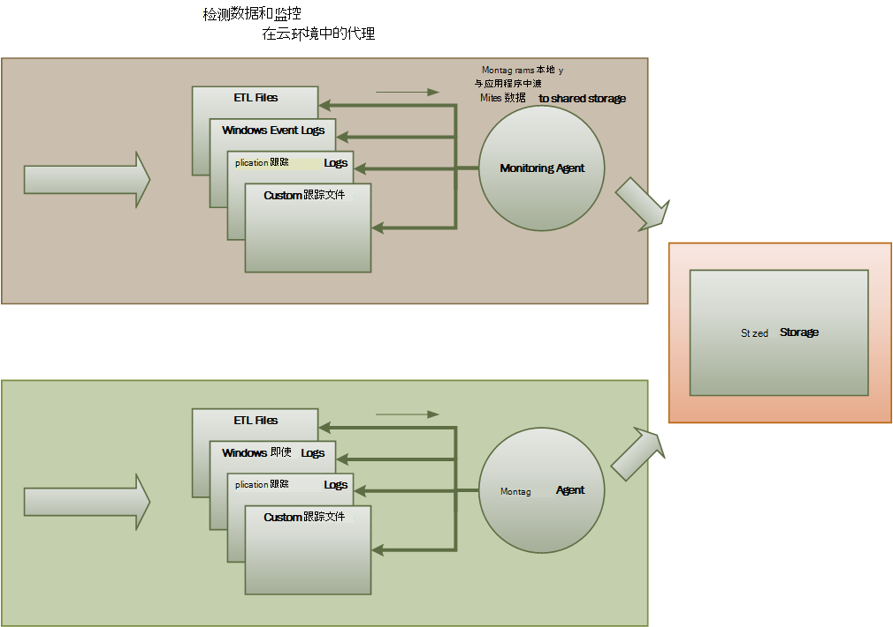
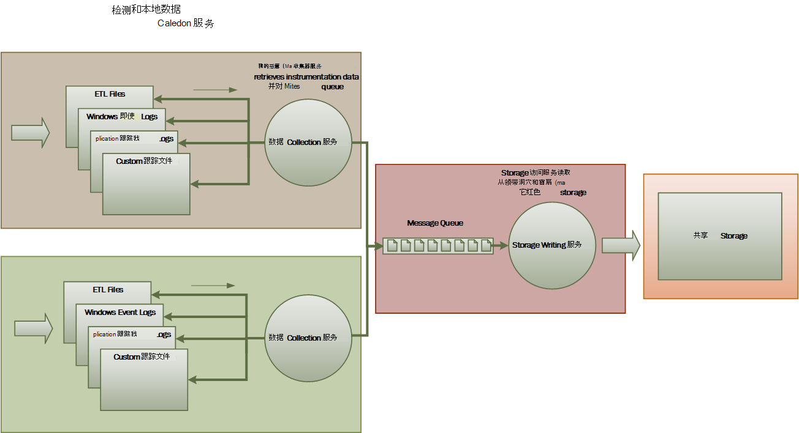
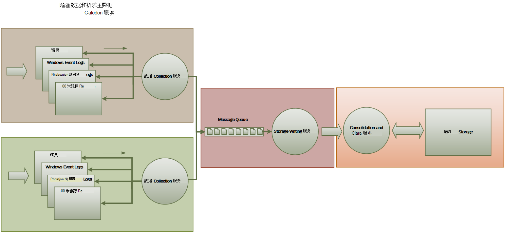

<properties
   pageTitle="监视和诊断指南 |Microsoft Azure"
   description="监视在云环境中的分布式应用程序的最佳做法。"
   services=""
   documentationCenter="na"
   authors="dragon119"
   manager="christb"
   editor=""
   tags=""/>

<tags
   ms.service="best-practice"
   ms.devlang="na"
   ms.topic="article"
   ms.tgt_pltfrm="na"
   ms.workload="na"
   ms.date="07/13/2016"
   ms.author="masashin"/>

# <a name="monitoring-and-diagnostics-guidance"></a>监视和诊断指南

[AZURE.INCLUDE [pnp-header](../includes/guidance-pnp-header-include.md)]

## <a name="overview"></a>概述
分布式应用程序和云环境中运行的服务，其在本质上是，软件的复杂构成许多移动部件的片段。 在生产环境中，是系统的一定要能够跟踪的方式的用户使用您的系统，跟踪资源利用率，并通常监视运行状况和性能。 可以作为诊断的帮助使用此信息来检测和纠正出现的问题，而且还可以帮助发现潜在问题并防止其发生。

## <a name="monitoring-and-diagnostics-scenarios"></a>监视和诊断方案
可以使用监视以深入了解系统如何更好地工作。 监视是维护服务质量目标的一个重要组成部分。 用于收集监控数据的常见方案包括︰

- 确保系统保持正常运行。
- 跟踪系统和其组件元素的可用性。
- 维护性能，以确保该系统的吞吐量不会降级意外与卷的工作增加。
- 确保系统满足任何建立与客户的服务级别协议 (Sla)。
- 保护隐私和安全的系统、 用户和他们的数据。
- 跟踪用于审核或法规执行的操作。
- 监视系统，发现在不解决这些问题可能导致问题的趋势的日常用法。
- 跟踪问题的发生，从初始报告通过分析可能的原因、 修理的要求，随之的软件更新和部署。
- 跟踪的操作和调试软件版本。

> [AZURE.NOTE] 此列表不是必须更加全面。 本文档重点介绍这些方案作为最常见的情况进行监控。 有可能是其他人并不常见，或者是特定于您的环境。

以下各节描述了这些情形的更多详细信息。 每个方案的信息格式如下所述︰

1. 该方案的简要概述
2. 这种情况下的典型的要求
3. 有需要支持方案和可能的此信息来源原始的检测数据
4. 如何分析和组合以生成有意义的诊断信息该原始数据

## <a name="health-monitoring"></a>运行状况监视
系统处于正常状态，如果它正在运行，并且能够处理请求。 运行状况监视的目的是生成系统的当前运行状况的快照，以便您可以验证系统中的所有组件，都能达到预期。

### <a name="requirements-for-health-monitoring"></a>运行状况监视的要求
如果系统的任何部分被确认为不健康，操作员应发出警报迅速 （在数秒之内）。 操作员应能够确定系统中的哪些部分均能正常工作，以及哪些部分出现问题。 通过交通灯系统，可以突出显示系统健康状况︰

- 红色表示不正常 （系统已停止）
- 黄色的部分状态良好 （系统运行功能减少）
- 绿色表示的完全健康

全面的运行状况监视系统使操作员可以通过系统查看子系统和组件的健康状况向下钻取。 例如，如果整个系统被描绘成部分完好，操作员应该能够放大并确定哪些功能是当前不可用。

### <a name="data-sources-instrumentation-and-data-collection-requirements"></a>数据源、 检测和数据收集的要求
运行状况监视支持有需要的原始数据可以生成结果的︰

- 跟踪用户请求的执行。 此信息可用于确定哪些请求已成功、 有失败的和每个请求花费的时间。
- 综合用户监视。 这一过程模拟的用户执行的步骤，并遵循一系列预定义的步骤。 应该捕获每个步骤的结果。
- 日志记录异常、 错误和警告。 此信息可以捕获跟踪语句嵌入到应用程序代码，以及从任何系统引用的服务事件日志中检索信息的结果。
- 监视系统使用的任何第三方服务的运行状况。 这种监视可能需要检索和分析这些服务提供的健康数据。 此信息可能需要为不同的格式。
- 终结点监视。 在"可用性监视"一节中详细介绍了这种机制。
- 收集环境性能的信息，如 CPU 利用率背景或 （包括网络） 的 I/O 活动。

### <a name="analyzing-health-data"></a>分析运行状况数据
运行状况监视的主要重点是迅速指示系统是否正在运行。 热分析的直接数据可以触发警报，如果某个关键组件检测为不正常。 （它没有成功地响应一系列连续的 ping 命令，例如。）然后，操作员可以采取适当的纠正措施。

更高级的系统可能包括对最近和当前的工作负载执行冷分析预测性元素。 冷的分析可以了解趋势并确定系统是否有可能保持正常运行或系统是否将需要额外的资源。 此预测性元素应基于关键性能指标，如︰

- 针对每个服务或子系统的请求的速率。
- 这些请求的响应时间。
- 流动进出每个服务的数据量。

如果任何度量值超过定义的阈值，系统可以产生警报启用操作员或自动缩放 （如果可用） 采取预防性措施需要维护系统运行状况。 这些操作可能会涉及增加资源，重新启动一个或多个服务出现故障，或应用到低优先级请求的限制。

## <a name="availability-monitoring"></a>可用性监视
一个真正健康的系统要求的组件和子系统构成系统可用。 可用性监视密切相关的运行状况监视。 但运行状况监视提供了系统的当前运行状况的直观视图，可用性监视与跟踪的系统或其组件生成统计信息系统的正常运行时间可用性。

在许多系统中，某些组件 （如数据库） 具有内置冗余在发生严重故障或丢失的连接允许快速故障切换配置。 理想情况下，用户应该不知道这种情况发生。 但从可用性监控的角度来看，有必要收集尽可能多的相关信息以确定原因并采取纠正措施以防止再次发生此类故障。

具有所需跟踪可用性的数据可能取决于很多低级的因素。 许多这些因素可能是特定于应用程序、 系统和环境。 有效的监视系统捕获，对应这些低级别的因素，然后聚合来使系统的整体可用性数据。 例如，在电子商务系统中，，客户就可以下订单的业务功能可能取决于存储库中存储订单详细信息和处理这些订单支付的货币交易记录的付款系统。 因此，顺序布置一部分可用性是系统的可用性的存储库和付款子系统的功能。

### <a name="requirements-for-availability-monitoring"></a>可用性监视需求
运算符也应该能够查看的每个系统和子系统，历史的可用性，并使用此信息来了解任何可能会导致一个或多个子系统，定期失败的趋势。 （不要服务启动失败对应处理高峰的一天中的某一时刻吗？）

监视解决方案应提供可用性的一个近期和历史视图或每个子系统不可用。 它也应该能够快速或一个或多个服务失败时用户无法连接到服务时提醒操作员。 这是一种不仅监视每个服务，而且还检查每个用户，如果这些操作失败尝试与服务通信时执行的操作。 在某种程度上，一定程度的连接性故障是正常的可能是由于暂时性错误。 但它可能有助于让系统生成警报数量的指定子系统的连接故障发生在特定的时期。

### <a name="data-sources-instrumentation-and-data-collection-requirements"></a>数据源、 检测和数据收集的要求
使用运行状况监视，支持可用性监视具有必需的原始数据可能导致综合用户监视和记录任何异常、 错误和警告可能会发生的。 此外，可以从可用性数据执行终结点监视。 应用程序可以公开一个或多个运行状况的终结点，每个测试访问系统中的功能区域。 监视系统可以按照定义的计划中 ping 每个终结点，并收集结果 （成功或失败）。

必须记录所有超时、 网络连接故障和连接重试次数。 所有数据都应加盖时间戳。

<a name="analyzing-availability-data"></a>
### <a name="analyzing-availability-data"></a>分析数据的可用性
必须聚合和关联起来以支持以下类型的分析检测数据︰

- 系统和子系统的即时可用性。
- 系统和子系统的可用性故障率。 理想情况下，操作员应能够将故障与特定活动相关联︰ 在系统失败时已发生什么？
- 系统或跨任何任何子系统的故障率的历史视图指定期间和负载系统 （用户请求数） 时出现错误。
- 系统或任何子系统不可用的原因。 例如，原因可能是服务未在运行，连接中断，连接但超时，并已连接但返回错误。

通过使用下面的公式可以计算一段时间内的服务可用性百分比︰

```
%Availability =  ((Total Time – Total Downtime) / Total Time ) * 100
```

这可用于 SLA 的目的。 （[SLA 监视](#SLA-monitoring)所述本指南中后面的更多详细信息。）_停机时间_的定义取决于服务。 例如，Visual Studio 团队生成服务定义停机时间段 （总累计分钟数） 内生成服务不可用。 如果所有连续 HTTP 请求到生成服务来执行整个分钟客户发出的操作导致错误代码或不返回响应，则被视为不可用一分钟的时间。

## <a name="performance-monitoring"></a>性能监视
随着 （通过增加用户的数量） 将该系统放在越来越多的压力下，发展这些用户访问数据集的大小和一个或多个组件发生故障的可能性变得更有可能。 通常情况下，组件故障之前降低性能。 如果你能检测到这种降低，可以采取主动措施来弥补这种情况。

系统性能取决于许多因素。 每个系数通常是通过关键性能指标 (Kpi)，如数据库每秒事务数或卷在指定的时间内成功地提供服务的网络请求的衡量影响。 一些这些 Kpi 可作为特定的性能度量值，而其他人可能会从指标的组合。

> [AZURE.NOTE] 确定性能很差或很好，需要您了解该系统应该能够运行的性能级别。 这就要求观察系统，它在正常负载下正常工作的同时，通过一段时间内每个 KPI 中捕获数据。 这样做可能会在测试环境中运行模拟负载系统，将系统部署到生产环境之前收集相应的数据。

> 您还应该确保用于性能监视不会成为负担的系统。 您可能能够动态地调整性能监视过程中收集的数据的详细信息的级别。

### <a name="requirements-for-performance-monitoring"></a>监视性能的要求
要检查系统性能，操作员通常需要包含的信息，请参阅︰

- 用户请求的响应率。
- 并发用户请求数。
- 网络通信的卷。
- 事务完成时的业务汇率。
- 请求的平均处理时间。

它也会有所帮助，提供工具，使操作员能够帮助发现的关联性，例如︰

- 而不是请求延迟时间 （多长时间启动后用户已发送它处理请求） 的并行用户的数量。
- （需要多少时间来完成一个请求，它已开始处理后） 的平均响应时间与并发用户数。
- 而不是处理错误数的请求量。

此高级功能的信息，以及操作员应该能够获取系统中的每个组件的性能的详细的视图。 此数据通常提供低级别的性能计数器的跟踪信息，例如通过︰

- 内存利用率。
- 线程数。
- CPU 的处理时间。
- 请求队列长度。
- 磁盘或网络 I/O 速率和错误。
- 写入或读取的字节数。
- 中间件的指标，如队列长度。

所有可视化项应使操作员可以指定一个时间段。 所显示的数据可能是当前情况的快照和/或历史视图的性能。

操作员应能够引发警报在任何指定的时间间隔基于任何指定的值的任何性能度量值。

### <a name="data-sources-instrumentation-and-data-collection-requirements"></a>数据源、 检测和数据收集的要求
可以通过监视用户请求的进度，到达并通过系统收集高级性能数据 （吞吐量、 并发用户数、 业务事务、 错误率，等等的数量）。 这涉及到将跟踪语句在应用程序代码，以及计时信息中的关键点。 所有的错误、 异常和警告应获得足够的数据，对引起它们的请求将它们关联起来。 Internet Information Services (IIS) 日志是另一个有用的源代码。

如果可能，还应该捕获性能数据的应用程序使用任何外部系统。 这些外部的系统可能提供自己的性能计数器或其他功能请求的性能数据。 如果这不是可能，记录的信息，例如开始时间和结束时间，每个所发出的请求到外部系统，以及该操作的状态 （成功、 失败或警告）。 例如，您可以使用时间请求的秒表方法︰ 请求启动时启动一个计时器，当请求完成后再停止计时器。

在系统中的各个组件的低级性能数据可以通过功能和 Windows 性能计数器和 Azure 诊断等服务。

### <a name="analyzing-performance-data"></a>分析性能数据
大部分分析工作包括聚合由用户请求类型和/或子系统或每个请求发送到服务的性能数据。 用户请求的示例是将项目添加到购物车或电子商务系统中执行结帐过程。

另一个常见要求汇总选定的百分点中的性能数据。 例如，操作员可以确定请求的 99%、 95%的请求和 70%的请求的响应时间。 有可能是服务级别协议目标或其他目标设置的每个百分点。 持续的结果应接近实时报告，来帮助检测即时问题。 也可用于统计目的的较长时间聚合结果。

在情况下影响性能的延迟问题，操作员应该能够快速通过检查每个请求执行每个步骤的反应来确定瓶颈的原因。 性能数据因此必须提供一种关联的每个步骤以将其绑定到某个特定请求的性能度量。

根据可视化的需求，它可能是有用来生成和存储多维数据集，其中包含原始数据的视图。 此多维数据集可以允许复杂的特殊查询和分析的性能信息。

## <a name="security-monitoring"></a>安全监视
包括敏感数据的所有商业系统必须实现的安全结构。 安全机制的复杂性通常是敏感性的函数的数据。 在系统中，它要求用户进行身份验证，您应该记录︰

- 所有登录尝试，无论失败还是成功。
- -通过执行所有操作，以--身份验证的用户访问的所有资源的详细信息。
- 当用户结束会话，并签名。

监视可以帮助检测系统上的攻击。 例如，大量的失败的登录尝试可能表明暴力攻击。 在请求中的意外的电涌可能是分布式拒绝服务 (DDoS) 攻击的结果。 您必须准备监视这些请求源无关的所有资源的所有请求。 有一个登录漏洞的系统意外可能而无需实际登录的用户公开给外部世界的资源。

### <a name="requirements-for-security-monitoring"></a>为进行安全监视需求
最关键的安全监控应快速使到操作员︰

- 未经身份验证的实体来检测入侵企图。
- 标识要为其他们未被授予访问权限的数据执行操作的实体的尝试。
- 确定系统或系统的某些部分是否在从外部或内部的攻击。 （例如，身份验证的恶意用户可能试图关闭系统。）

为了支持这些需求，应通知操作员︰

- 如果一个帐户进行重复失败的登录尝试指定的时间内。
- 如果一个经过身份验证的帐户重复尝试访问指定期间禁止使用的资源。
- 如果在指定的一段期间出现大量未经授权或未授权的请求。

提供给操作员的信息应包括每个请求的源的主机地址。 如果违反安全定期源自一个特定的地址范围，则可能会阻止这些主机。

维护系统安全的一个关键部分能够快速检测偏离常规模式的操作。 可以直观地显示失败和/或成功登录请求的数量等信息可以帮助您检测是否存在一个峰值活动中在不寻常的时间。 （该活动的一个示例是用户在上午 3:00 登录并执行大量操作时其工作日从上午 9:00 开始）。 此外可以使用此信息来帮助配置基于时间的自动缩放。 例如，如果操作员观察，大量用户经常登录一天中的某一时刻，操作员可以安排启动附加的身份验证服务来处理的工作，该卷，然后在关闭这些附加服务的高峰过后。

### <a name="data-sources-instrumentation-and-data-collection-requirements"></a>数据源、 检测和数据收集的要求
安全是包罗万象的大多数分布式系统方面。 相关的数据很可能会在多个点，在整个系统中生成。 应考虑采用安全信息和事件管理 (SIEM) 的方法来收集得到的由应用程序、 网络设备、 服务器、 防火墙、 防病毒软件和其他入侵防护元素引发的事件与安全相关的信息。

安全监视可以合并来自不属于您的应用程序的工具。 这些工具可包括确定由外部机构或检测到尝试获取未经授权的访问您的应用程序和数据的网络筛选器端口扫描活动的实用程序。

在所有情况下，收集的数据必须使管理员能够确定性质的任何攻击，并采取相应的对策。

### <a name="analyzing-security-data"></a>分析安全数据
安全监视的功能是不同的源数据会出现。 不同的格式和详细程度通常要求的将其联系在一起成一个连贯的信息线程捕获数据进行复杂的分析。 除了最简单的情况下 （例如，检测大量的失败的登录或反复的尝试获取对关键资源的未授权的访问），它可能无法执行任何复杂自动化的数据处理的安全。 相反，它可能最好写入这些数据，但其原始的形式，为安全的存储库，以便专家手动分析在其他情况下加盖时间戳。

<a name="SLA-monitoring"></a>

## <a name="sla-monitoring"></a>SLA 监视
支持客户付款的许多商业系统服务级别协议的形式进行有关系统性能的保证。 实质上，Sla 状态系统可以处理的工作，在商定的时间范围内，而不会丢失关键信息定义的体积块。 SLA 监视致力于确保系统可以满足可测量的 sla 要求。

> [AZURE.NOTE] SLA 监视密切相关的性能监视。 但性能监视致力于确保系统函数_进行优化_，而 SLA 监视受定义何种_最佳方式_实际上意味着合同义务。

通常定义方面的 sla 要求︰

- 整体系统可用性。 例如，一个组织可能保证系统可为 99.9%的时间。 这等于不超过 9 个小时的停机时间，每年或每周约 10 分钟。
- 操作的吞吐量。 这方面通常表示为一个或多个高使用量标记，如保证系统可以支持多达 100000 个并发用户请求或处理 10000 个并发业务事务。
- 操作的响应时间。 系统还可以使保证为处理请求的速率。 例如，在 2 秒内，将完成所有商业交易的 99%，并没有单一的事务将会超过 10 秒钟。

> [AZURE.NOTE] 商业系统的某些合同还可以包括 Sla 为客户支持。 例如，所有求助请求在 5 分钟内，将能都得到响应，99%的所有问题将在 1 个工作天内彻底解决。 有效[问题跟踪](#issue-tracking)（稍后说明在这一节中） 是这种满足 sla 要求的关键。

### <a name="requirements-for-sla-monitoring"></a>用于监视 SLA 的要求
在最高级别，操作员应该能够快速确定是否系统会议商定的服务级别协议或不。 如果不是这样，操作员应该能够钻取和向下并检查基础的因素，以便确定不合标准的性能的原因。

典型的高级特征，可以直观地描述包括︰

- 服务的正常运行时间的百分比。
- （测量方面成功的交易记录和/或每秒的操作） 的应用程序吞吐量。
- 成功/失败应用程序请求的数量。
- 应用程序和系统错误、 异常和警告的数目。

所有这些指标应该是时间的能够被筛选按指定段。

云应用程序可能会包含大量子系统和组件。 操作员应能够选择高级别指示器，并查看如何从运行状况的基本的元素组成。 例如，如果整个系统的正常运行时间低于可接受的值，操作员应该能够放大并确定哪些元素导致此故障。

> [AZURE.NOTE] 需要仔细定义系统的正常运行时间。 在系统中，使用冗余，以确保最大的可用性，各个实例的元素可能会失败，但是系统可以保持正常工作。 根据提供的运行状况监视系统正常运行时间应指示聚合的每个元素运行时间并不一定是系统实际上是否已停止。 此外，故障可能是独立的。 因此，即使特定的系统不可用，系统的其余部分可能仍然可用，虽然具有减少功能。 （在电子商务系统中，系统中的故障可能防止客户订单，但客户仍然可能能够浏览产品目录。

有关警报的目的，系统应该能够引发一个事件，如果任何高级别指标超过指定的阈值。 组成的高级别指示器的多种因素的较低级别详细信息应可作为对警报系统的上下文数据。

### <a name="data-sources-instrumentation-and-data-collection-requirements"></a>数据源、 检测和数据收集的要求
具有所需支持 SLA 监视的原始数据是类似于具有所需的性能监视，以及运行状况和可用性监控的某些方面的原始数据。 （请参阅详细信息部分）。您可以捕获此数据︰

- 执行终结点监视。
- 日志记录异常、 错误和警告。
- 跟踪用户请求的执行。
- 监视系统使用的任何第三方服务的可用性。
- 使用性能度量标准和计数器。

所有数据必须定时和加盖时间戳。

### <a name="analyzing-sla-data"></a>分析 SLA 数据
检测数据必须为聚合生成图片的系统的整体性能。 聚合的数据还必须支持向下钻取以启用检查基础子系统的性能。 例如，您应能够︰

- 指定期间计算用户请求的总数，并确定这些请求中的成功和失败率。
- 结合生成系统响应时间的总体视图的用户请求的响应时间。
- 分析用户的请求将一个请求到该请求中的单个工作项的响应时间的总体响应时间分解的进度。  
- 任何指定的时间段确定系统的整体可用性的正常运行时间的百分比。
- 分析系统中的各个组件和服务的可用性百分比的时间。 这可能需要分析第三方服务已生成的日志。

许多商业系统需要在指定的时间，通常一个月报告对商定的服务级别协议的实际性能数据。 此信息可以用于为客户计算信用或其他形式的 repayments 如果在该期间内未满足 sla 要求。 可以通过使用[分析可用性数据](#analyzing-availability-data)一节中描述的方法来计算服务的可用性。

供内部使用，组织也可能会跟踪的数目和性质的故障而导致服务失败。 学习如何快速，解决这些问题或完全消除它们将有助于减少停机时间并满足 sla 要求。

## <a name="auditing"></a>审核
根据应用程序的性质，可能被指定用于审核用户的操作和记录所有的数据访问要求的法定或其他法律规章。 审核可以提供证据对特定请求该链接的客户。 不可否认性是许多电子商务系统，以帮助维持信任的重要因素是客户和负责的应用程序或服务的组织之间。

### <a name="requirements-for-auditing"></a>审核要求
分析师必须能够跟踪用户的操作，以便您可以重新构造用户的操作的业务操作的顺序。 这可能是有必要，只是作为一种记录，或法庭调查的一部分。

审核信息是高度敏感。 它可能会包括标识系统，它们正在执行的任务的用户的数据。 由于这个原因，审计信息将很有可能采用的仅供可信的分析师的报告形式而不是作为交互式系统支持的图形操作向下钻取。 分析人员应该能够生成一系列报告。 例如，报告可能会列出在指定的时间范围内发生的所有用户的活动，详细介绍了活动的单个用户的青睐或列出针对一个或多个资源执行的操作的顺序。

### <a name="data-sources-instrumentation-and-data-collection-requirements"></a>数据源、 检测和数据收集的要求
审计信息的主要来源可能包括︰

- 管理用户身份验证的安全系统。
- 跟踪日志记录用户活动。
- 安全日志用于跟踪所有可识别和无法识别网络请求。

格式的审核数据，并在其中存储的方式可能会受到管理法规的要求。 例如，它可能无法清理任何方式的数据。 （它必须记录在其原始格式。）访问存储库并保留必须受到保护，以防止篡改。

### <a name="analyzing-audit-data"></a>分析审核数据
分析师必须能够访问原始数据完全显示在其原始形式。 除了生成公共审计报告的要求，很可能是专用的独立于系统分析此数据的工具。

## <a name="usage-monitoring"></a>使用监视
使用监视跟踪如何使用的功能和应用程序的组件。 操作员可以使用收集到的数据︰

- 确定哪些功能过度使用和确定系统中的任何潜在的热点。 从功能分区或甚至复制更均匀地分散负载获益通信量很高的元素。 运算符还可以使用此信息来确定哪些功能很少使用并为退休或更换系统的未来版本中是可能的候选。
- 获取在正常使用情况下的系统操作的事件的信息。 例如，在电子商务网站中，可以记录有关交易记录的数量，都对其负责的客户量的统计信息。 此信息可以用于容量规划，随着客户数量的增长。
- 检测到 （可能是间接的） 用户满意的性能或功能的系统。 例如，如果大量的电子商务系统中的客户经常放弃他们的购物车，这可能是由于签出功能的问题。
- 生成的付费信息。 商业应用程序或多租户服务可能收取客户为他们所使用的资源。
- 强制配额。 如果租户系统中的用户超过了其支付的配额指定期间处理的时间或资源使用状况的可以限制其访问权限或可以中止处理。

### <a name="requirements-for-usage-monitoring"></a>使用监控的要求
要检查系统的使用情况，操作员通常需要包含的信息，请参阅︰

- 处理每个子系统和定向到每个资源的请求数。
- 每个用户执行的工作。
- 每个用户占用存储空间数据的卷。
- 每个用户访问的资源。

运算符也应该能够生成关系图。 例如，关系图可能显示最大量耗费资源的用户，或最常访问的资源或系统功能。

### <a name="data-sources-instrumentation-and-data-collection-requirements"></a>数据源、 检测和数据收集的要求
在相对较高的级别，可以执行使用情况跟踪。 它可以请注意每个请求的开始和结束时间以及请求 （读取、 写入和等等，这取决于所涉及的资源） 的性质。 您可以获取此的信息︰

- 跟踪用户的活动。
- 在捕获性能计数器可以测量每个资源的利用率。
- 监视每个用户的资源消耗。

对于计量的目的，还需要能够识别哪些用户将负责执行哪些操作以及这些操作利用的资源。 所收集的信息应详细，不足以使准确计费。

<a name="issue-tracking"></a>
## <a name="issue-tracking"></a>问题跟踪
如果在系统中发生的意外的事件或行为的客户以及其他用户可能会报告问题。 问题跟踪与管理这些问题，将其与在系统中，解决任何潜在问题的努力并通知可能的解决方案的客户。

### <a name="requirements-for-issue-tracking"></a>问题跟踪的要求
通常，运算符执行问题跟踪使用一个单独的系统，使他们记录和报告问题的详细信息用户报告。 这些详细信息可以包括用户试图执行，症状问题、 序列的事件，以及任何错误或已发出的警告消息的任务。

### <a name="data-sources-instrumentation-and-data-collection-requirements"></a>数据源、 检测和数据收集的要求
问题跟踪数据的初始数据源是最初报告问题的用户。 用户可能能够提供附加数据，例如︰

- 故障转储 （如果应用程序包含在用户的桌面上运行的组件）。
- 屏幕快照。
- 日期和任何其他环境信息，如用户的位置以及错误发生的时间。

此信息可用于帮助调试的工作量以及构造软件的未来版本的积压。

### <a name="analyzing-issue-tracking-data"></a>分析问题跟踪数据
不同的用户可能会报告同样的问题。 问题跟踪系统应将常见的报表相关联。

应根据每个问题报告记录调试工作的进度。 解决此问题，客户可通知的解决方案。

如果用户报告的问题有已知的解决方案，在问题跟踪系统中，操作员应该能够立即通知用户的解决方案。

## <a name="tracing-operations-and-debugging-software-releases"></a>跟踪的操作和调试软件版本
当用户报告问题时，该用户是影响的通常只注意它在其操作有直接。 用户仅可以报告自己体验的结果返回给操作员负责维护系统。 这些体验通常是只是一个或多个基本问题的明显的表现。 在许多情况下，分析师将需要挖到底层的操作来建立问题的根本原因的青睐。 此过程称为_根本原因分析_。

> [AZURE.NOTE] 根本原因分析可能会发现设计中的应用程序的效率低下。 在这些情况下，有可能要修改受影响的元素并将它们作为后续的发行版的一部分部署。 此过程需要小心的控制，并已更新的组件应该严密监视。

### <a name="requirements-for-tracing-and-debugging"></a>跟踪和调试的要求
用于跟踪意外的事件和其他问题，是至关重要的监控数据，提供足够的信息来启用跟踪返回到这些问题的来源分析和重建所发生的事件的序列。 此信息必须足以支持分析人员诊断问题的根本原因。 开发人员可以进行必要的修改，以防止它们再次发生。

### <a name="data-sources-instrumentation-and-data-collection-requirements"></a>数据源、 检测和数据收集的要求
故障诊断可包括的跟踪的所有方法 （和它们的参数） 调用操作，以生成客户发出特定请求时描述了逻辑系统中流程的一个树的一部分。 例外，由于这个流量系统生成的警告需要可以捕获和记录。

为了支持调试，系统可以提供挂钩，使操作员能够捕获系统中的关键点上的状态信息。 或者，系统可提供详细的分步信息，为所选的操作进度。 在这一级别的明细数据的捕获数据可以施加更多的系统负载和应该是临时的过程。 运算符可使用此过程主要是非常罕见的一系列事件发生时，很难复制，或者当新的发行版的一个或多个元素到系统需要仔细的监视，以确保元素都按预期的方式。

## <a name="the-monitoring-and-diagnostics-pipeline"></a>监视和诊断管道
大规模分布式的系统监控会带来重大的挑战。 每上一节中所述的情况不一定认为在隔离中。 还有可能是具有所需的每种情况下，监视和诊断数据中明显重叠，尽管这些数据可能需要处理，并将它们以不同的方式展示。 出于这些原因，应采取监视和诊断的整体视图。

作为管道包括图 1 中所示的各个阶段，可以设想整个监视和诊断过程。


_图 1。监视和诊断管道中的阶段_

图 1 突出显示了如何监视和诊断的数据可以来自各种数据源。 检测和收集阶段都很关心标识需要被捕获数据源确定要捕获的数据，如何捕获它，以及如何设置此数据的格式，以便可以很容易地检查。 分析/诊断阶段采用的原始数据，并使用它来生成有意义的运算符可用于确定系统的状态的信息。 操作员可以使用此信息来做出有关可能的操作才能，并再送回检测和收集阶段的结果。 在可视化/警报阶段阶段提供系统状态的可耗用视图。 通过一系列的仪表板，它可以实时显示信息。 然后，它可以生成报表、 图形和图表提供历史视图可以帮助您识别长期趋势的数据。 如果信息表明 KPI 可能超过可接受的界限，这一阶段还可以触发给操作员的警报。 在某些情况下，警报还可以用来触发一个自动化的过程，以尝试采取纠正措施，如自动缩放。

注意这些步骤构成阶段并行的发生位置的连续流动过程。 理想情况下，所有阶段都应动态配置。 在一些点，尤其是当系统已新部署或出现问题，可能需要更频繁地收集扩展的数据。 在其他时候，它应该可以恢复到捕获的基本信息，以验证系统能够正常的基层。

此外，整个监视进程应考虑微调和改进反馈的结果是实时的、 长期解决方案。 例如，您可以从开始衡量多个因素，以便确定系统运行状况。 随着时间的推移分析可能导致优化，如放弃措施不相关，从而使您能够更精确地专注于您需要的数据同时最小化背景噪音。

## <a name="sources-of-monitoring-and-diagnostic-data"></a>监视和诊断的数据源
如图 1 所示监视进程使用的信息可以来自多个源。 在应用程序级别上，来自信息合并到系统的代码的跟踪日志。 开发人员应该遵循的标准方法，用于跟踪通过其代码控制流。 例如，一项的方法可以发出跟踪消息的指定名称的方法、 当前时间、 每个参数和任何其它相关信息的价值。 录制的进入和退出的时间也非常有用。

您应该记录所有异常和警告，并确保您保留所有嵌套的异常和警告的完全跟踪。 理想情况下，您还应该捕获标识正在运行的代码，以及活动相关的信息 （通过系统跟踪请求） 的用户的信息。 并应记录尝试访问所有资源，如消息队列、 数据库、 文件和其他相关服务。 此信息可用于计量和审计目标。

许多应用程序使用的库和框架来执行常见任务，例如访问数据存储区或通过网络进行通信。 这些框架可能是可配置的提供自己的跟踪消息和原始的诊断信息，如事务率和数据传输成功和失败。

> [AZURE.NOTE] 许多现代框架自动发布性能和跟踪事件。 捕获此类信息时只需提供一种方法来检索和存储它，可以处理和分析。

运行该应用程序的操作系统可以是信息的源的低级系统范围，如指示 I/O 速率、 内存使用率和 CPU 使用率的性能计数器。 可能还会报告操作系统错误 （如未能正确打开文件）。

此外应考虑底层基础结构和它在您的系统上运行的组件。 虚拟机、 虚拟网络和存储服务都可以是源的重要基础设施层级性能计数器和其他诊断数据。

如果您的应用程序使用其他外部服务，如 web 服务器或数据库管理系统，这些服务可能会发布他们自己的跟踪信息、 日志和性能计数器。 用于跟踪对 SQL Server 数据库执行的操作的示例包括 SQL Server 动态管理视图和 IIS 跟踪日志将记录到的 web 服务器发出的请求。

在系统的元件会被修改和部署新版本时，很重要，能够对属性的问题、 事件和指标与每个版本。 此信息应回与发行管道，以便可以快速跟踪和纠正某个组件的特定版本的问题。

在系统中，安全问题可能出现在任何位置。 例如，用户可能会尝试使用无效的用户 ID 或密码登录。 身份验证的用户可能会尝试获取未经授权的访问资源。 或者，用户可能提供访问加密的信息无效或过期键。 始终应记录与安全相关的信息，对成功和失败的请求。

[检测应用程序](#instrumenting-an-application)的部分包含应捕获的信息的详细指南。 但您可以使用多种策略来收集此信息︰

- **应用程序/系统监控**。 这一策略使用内部源的应用程序，应用程序框架，操作系统和基础结构中。 应用程序代码可以生成自己的客户端请求的生命周期过程监视数据显著点。 应用程序可以包括跟踪语句，可能会有选择地启用或禁用根据情况规定。 此外可以通过使用诊断框架动态注入诊断。 这些框架通常提供插件，可以将附加到您的代码中的各个检测点，这些点的跟踪数据捕获。

    此外，您的代码和/或基础结构可能引发事件的关键点。 监视代理程序配置为侦听这些事件可以记录的事件信息。

- **真实的用户的监视**。 这种方法记录用户和应用程序之间的交互，并遵循每个请求和响应的流。 此信息可以有双重目的︰ 它可以用于计量使用每个用户，并可用于确定用户是否接收合适的服务质量的 （例如，快速的响应时间、 低延迟、 和最小的错误）。 捕获的数据可用于识别故障发生往往关注的领域。 您还可用数据来标识元素位置系统变慢了，可能是由于应用程序或某些其他形式的瓶颈中的热点。 如果认真实现这种方法，有可能重新构造通过调试和测试应用程序的用户的流。

    > [AZURE.IMPORTANT] 应考虑通过监视是高度敏感的因为它可能包含机密资料的实际用户捕获的数据。 如果您保存捕获的数据时，将安全地存储。 如果您想要使用的数据进行性能监视或调试目的，则先去除所有的个人身份信息。

- **综合用户监视**。 这种方法，您可以编写自己的测试客户端模拟用户并执行可配置，但典型的一系列操作。 您可以跟踪性能的测试客户端以帮助您确定系统的状态。 您可以为负载测试的操作的一部分使用测试客户端的多个实例建立压力情况下，系统的响应方式，并在这些情况下产生什么样的监视输出。

    > [AZURE.NOTE] 您可以实现实际和综合用户监视通过包括跟踪和时间执行方法调用和应用程序的其他关键部分的代码。

- **分析**。 这种方法主要被面向监控和提高应用程序性能。 而不是在真正和综合用户监视的功能级别操作，它可以捕获在应用程序运行的更低级别信息。 您可以实现使用 （确定哪一部分时间在某一给定的点上运行应用程序的代码） 的应用程序的执行状态的定期取样分析。 您还可以使用 （例如，开始和结尾的方法调用） 的重要接合处的代码中插入探测和记录的方法被调用时，在什么时候，以及多长时间的每次调用所花费的检测。 然后，您可以分析此数据，以确定应用程序的哪些部分可能会导致性能问题。

- **终结点监视**。 该技术使用一个或多个诊断终结点的应用程序公开专门用于启用监视。 终结点提供到应用程序的代码路径，并可以返回有关健康的信息系统。 不同的终结点可以专注于功能的各个方面。 您可以编写自己的诊断客户端将定期请求发送到这些终结点并接受响应。 这种方法中介绍了更多[健康终结点监视模式](https://msdn.microsoft.com/library/dn589789.aspx)在 Microsoft 网站上。

为最大的覆盖范围，应使用这些技术的组合。

<a name="instrumenting-an-application"></a>
## <a name="instrumenting-an-application"></a>规范应用程序
检测是监视进程的一个关键部分。 仅当您第一次捕获的数据，使您能够做出这些决策可以意义决定的性能和系统的运行状况。 通过使用检测收集的信息应足以使您能够评估性能、 诊断问题，并做出决定，而无需登录到远程生产服务器来执行跟踪 （和调试） 手动。 检测数据通常包含指标和写入跟踪日志的信息。

跟踪日志的内容就会出现应用程序写入的文本数据或二进制数据 （如果应用程序使用事件跟踪的窗口--ETW） 创建一个跟踪事件的结果。 他们还可以生成记录事件因部件基础结构，如 web 服务器的系统日志中。 文本日志消息通常设计为可读的但它们也应编写自动化系统，可方便地分析它们的格式。

此外应当对日志进行分类。 不要将所有跟踪数据都写入单个日志，但使用单独的日志记录系统的不同操作方面的跟踪输出。 然后可以快速通过读取相应的日志，而不必重新处理单个的冗长文件中筛选日志消息。 永远不会写的信息记录到同一日志中具有不同的安全要求 （如审核信息和调试数据）。

> [AZURE.NOTE] 日志可以作为一个文件在文件系统上，或它可能持有其他格式，如 blob 存储中的 blob。 也可能是日志信息保存在更结构化存储，例如表中的行。

指标通常将度量值或资源或某些方面的计数系统中在特定的时间，与一个或多个关联的标记或维度 （有时称为一个_示例_）。 跃点值的一个实例并通常不隔离十分有用。 相反，度量标准需要随着时间的推移被捕获。 需要考虑的关键问题是，您应该记录哪些指标和频率。 为生成数据指标往往可以施加巨大附加负载的系统上，而捕获的指标很少可能会导致丢失情况下该潜在顾客的重大事件。 考虑将不同度量指标。 例如，服务器上的 CPU 利用率可能会有显著变化从第二到第二个，但使用率高过于紧张，才会在数分钟长。

<a name="information-for-correlating-data"></a>
### <a name="information-for-correlating-data"></a>关联数据的信息
很容易可以监视各个系统级性能计数器、 捕获指标的资源，并从各种日志文件获取应用程序的跟踪信息。 但某些形式的监视需要监视管道关联检索从多个源的数据的分析和诊断阶段。 此数据可能在原始数据中，采用多种形式，并分析过程必须提供足够的检测数据，以便能够将这些不同形式的映射。 例如，在应用程序框架级别，任务可能被标识的线程 id。 在应用程序中相同的工作可能与正在执行该任务的用户的用户 ID 相关联。

另外，还有可能是由于异步操作可能重复使用相同的线程，若要代表多个用户执行操作的线程和用户请求之间的 1:1 映射。 更复杂的是更多，单个请求可能由线程来处理多个为整个系统的执行流程。 如果可能，请将每个请求作为请求上下文的一部分传播系统唯一的活动 id 相关联。 （用于生成和跟踪信息中包括活动 Id 的方法取决于用于将跟踪数据捕获技术。

所有监视数据应以相同的方式加盖时间戳。 为保持一致性，通过使用协调通用时间记录所有日期和时间。 这将帮助您更轻松地跟踪的事件的序列。

> [AZURE.NOTE] 运行在不同的时区和网络中的计算机可能不同步。 不取决于关联检测数据跨多台计算机使用单独的时间戳。

### <a name="information-to-include-in-the-instrumentation-data"></a>要检测数据中包含的信息
当您决定您需要收集哪些检测数据时，请考虑以下几点︰

- 确保信息捕获跟踪事件的机器和人工读取。 采用此信息，以便日志数据的自动的处理跨多个系统，并提供一致的方式操作和工程人员读取日志定义完善架构。 包括环境信息，如部署环境中，运行的计算机上的进程的过程中，并调用堆栈详细信息。  
- 启用分析只有在必要时，因为它可以强制实施系统上巨大的系统开销。 通过使用检测分析记录一个事件 （如方法调用） 每次发生这种情况，而只采样记录选定的事件。 所选内容可以是基于时间 （一次每隔*n*秒钟），或频率基于 （一旦每*n*个请求）。 如果事件非常频繁地发生，通过检测进行分析可能会导致过多的负担和本身会影响总体性能。 在这种情况下，采样方法可能更可取。 但是，如果事件的频率较低，取样可能会遗漏它们。 在这种情况下，则检测可能是更好的方法。
- 提供足够的上下文，以便开发人员或管理员联系以确定每个请求的来源。 这可能包括某种形式的活动 ID 来标识请求的特定实例。 它还可以包括可用于将此活动与计算工作量和资源使用相关联的信息。 请注意这种工作可能跨进程和计算机边界。 为计量，还应包括环境 (直接或间接地通过其他相关的信息) 引起的请求进行的客户的参考。 此上下文提供了有价值的信息，有关应用程序状态以监视数据被捕获的时间。
- 记录所有的请求，对位置或区域发出这些请求。 此信息可以帮助确定是否有任何特定位置的热点。 此信息也可以是可用于确定是否对应用程序或数据，使用它进行重新分区。
- 记录并仔细捕获异常的详细信息。 通常情况下，重要调试信息都将丢失的结果较差的异常处理。 捕获异常的应用程序引发，包括任何内部异常和其他上下文信息的完整详细的信息。 如果可能，请包括调用堆栈。
- 中保持一致的数据，捕获应用程序的不同元素，因为这可以帮助分析事件并将它们与用户的请求关联。 请考虑使用全面的和可配置日志记录包来收集信息，而不是取决于开发人员可以采用相同的方法，实施系统的不同部分。 从关键性能计数器，如正在执行的 I/O 网络利用率、 请求、 内存使用和 CPU 利用率的数卷收集数据。 一些基础设施服务可能会提供他们自己的特定性能计数器，如连接到数据库、 此时正在执行的交易记录，率和成功或失败的事务数数。 应用程序还可以定义它们自己的特定的性能计数器。
- 登录到外部服务，如数据库系统、 web 服务或其他系统级服务基础结构的一部分进行的所有调用。 有关执行每个呼叫，所需时间的信息记录成功和失败的调用。 如果可能，请捕获所有重试次数和出现的任何瞬态错误的故障信息。

### <a name="ensuring-compatibility-with-telemetry-systems"></a>确保与遥测系统的兼容性
在许多情况下，检测生成的信息是作为一系列的事件生成和传递给一个单独的遥测系统进行处理和分析。 遥测系统是通常独立于任何特定的应用程序或技术，但它需要遵循特定的格式，通常由架构定义的信息。 该架构有效地指定定义的数据字段和遥测系统可以接收的类型的合同。 应通用架构以允许将数据从一系列的平台和设备的到达。

常见架构应包括字段所共有的所有检测事件，如事件名称、 事件时间、 发件人的 IP 地址和所需的其他事件 （如用户 ID、 设备 ID，以及一个应用程序 ID） 与关联的详细信息。 请记住，因此架构不应依赖的设备类型，任意数目的设备可能会引发事件。 此外，各种设备都可能引发事件的同一应用程序;应用程序可能支持漫游或一些其它形式的跨设备分布。

该架构还可以包括域字段相关的特定方案，能够在不同的应用程序之间通用。 这可能是异常，应用程序开始和结束事件和成功和/或失败的 web 服务 API 调用有关的信息。 所有应用程序都使用相同的域字段集应都发出相同的事件，允许在公共报告和分析，以建立一套集。

最后，一个架构可能包含用于捕获应用程序特定事件的详细信息的自定义字段。

### <a name="best-practices-for-instrumenting-applications"></a>规范应用程序的最佳做法
下面的列表汇总了用于检测在云中运行的分布式应用程序的最佳做法。

- 使日志很容易阅读和易于分析。 使用结构化记录在可能的情况。 是简明和描述性日志消息中。
- 所有日志，以确定源数据库和提供上下文和计时信息在写入每条日志记录。
- 使用所有的时间戳相同的时区和格式。 这将有助于将跨越硬件和不同的地理区域中运行的服务的操作的事件相关联。
- 分类日志和消息写入相应的日志文件。
- 不泄露有关系统的敏感信息或用户的个人信息。 清理此信息前则会被记录，但确保保留相关的详细信息。 例如，删除所有数据库的连接字符串的 ID 和密码，但其余的信息写入日志中，以便分析可以确定系统正在访问正确的数据库。 记录所有严重异常，但允许管理员为较低级别的异常和警告打开和关闭日志记录。 此外，捕获并记录所有的重试逻辑信息。 该数据可以用于监视系统的瞬态运行状况。
- 跟踪进程外调用，如外部 web 服务或数据库的请求。
- 不要混合日志消息具有相同的日志文件在不同的安全要求。 例如，不要编写调试和审核信息记录到同一日志。
- 除了对事件的审核，确保所有日志记录调用的火灾和忘记的工序是不会阻止业务操作的进度。 审核事件是例外，因为它们对业务的重要性并且可被归类为业务运作的一个基本部分。
- 请确保日志记录是可扩展的和具体的目标上没有任何直接依赖项。 例如，而不是使用_System.Diagnostics.Trace_中写入信息，定义抽象接口 （如_ILogger_) 公开记录方法，可以通过任何适当的方式实现的。
- 请确保所有日志记录是自动防故障，并且永远不会触发任何级联的错误。 记录必须不引发任何异常。
- 检测视为一个不断循环往复的过程和存在问题时，不只是定期检查日志。

## <a name="collecting-and-storing-data"></a>收集和存储数据
监视进程的集合阶段关心检索工具生成，以使其更容易分析/诊断阶段使用，并将转换后的数据保存在可靠的存储此数据的格式的信息。 分布式系统的不同部分收集检测数据可以以各种不同的位置，并具有不同的格式保存。 例如，应用程序代码可能会生成跟踪日志文件并生成应用程序事件日志数据，而可以通过其他技术捕获性能计数器来监视应用程序使用的基础结构的主要方面。 任何第三方组件和服务，您的应用程序使用可能会提供检测信息以不同的格式，使用单独的跟踪文件，blob 存储或甚至一个自定义数据存储区。

数据收集是通过可以自主运行的应用程序生成的检测数据从一个集合服务经常执行的。 图 2 显示了此体系结构中，突出显示了检测数据收集子系统的一个示例。


_图 2。检测数据收集_

请注意这是一个简单的视图。 收集服务不一定是一个过程，并可能构成许多构成部分在不同的机器上运行，如以下各节中所述。 此外，如果必须快速执行一些遥测数据的分析 （热分析，[支持热，热，冷的分析](#supporting-hot-warm-and-cold-analysis)在本文档后面的部分中所述），本地操作集合服务以外的组件可能会立即执行分析任务。 图 2 描绘了这种情况下为选定事件。 之后分析处理，结果可直接发送到可视化和报警子系统。 受到热或冷分析的数据保存在存储中同时等待处理。

Azure 应用程序和服务，Azure 诊断提供一个可能的解决方案来捕获数据。 Azure 的诊断从以下每个计算节点的源收集数据和聚合，然后将其上载到 Azure 存储︰

- IIS 日志
- 失败请求的 IIS 日志
- Windows 事件日志
- 性能计数器
- 故障转储
- Azure 诊断基础结构日志  
- 自定义错误日志
- .NET EventSource
- 基于清单的 ETW

有关详细信息，请参阅文章[Azure︰ 遥测基础知识和疑难解答](http://social.technet.microsoft.com/wiki/contents/articles/18146.windows-azure-telemetry-basics-and-troubleshooting.aspx)。

### <a name="strategies-for-collecting-instrumentation-data"></a>用于收集检测数据的策略
考虑到云，并避免从每个节点的遥测数据手动检索系统中的弹性性质，应排列的数据传输到一个中央位置，和整合。 在跨越多个数据中心的系统，它可能首先收集、 整合和存储数据的区域为单位，和再聚合到一个中央系统的区域的数据很有用。

若要优化带宽的使用，您可以选择以块的形式，批次为不太紧急的数据传输。 但是，数据必须不会延迟下去，尤其是如果它包含时间敏感的信息。

#### <a name="pulling-and-pushing-instrumentation-data"></a>_拉出并推检测数据_
检测数据收集子系统主动可以从各种日志和其他来源 （_拉模型_） 的应用程序的每个实例检索检测数据。 或者，它可以作为一个被动的接收器，等待发送从组件构成的应用程序 （_推模型_） 的每个实例的数据。

为实现拉模型的一种方法是使用本地运行应用程序的每个实例的监视代理。 监视代理是检索 （拉） 遥测数据在本地节点的收集定期独立的过程，直接将该信息写入应用程序的所有实例都共享的集中式存储。 这是 Azure 诊断程序实现的机制。 可以将 Azure 网站或辅助角色的每个实例配置为捕获诊断和其他跟踪信息存储在本地。 监视代理运行每个实例拷贝到 Azure 存储指定的数据。 文章[在 Azure 云服务和虚拟机中启用诊断](./cloud-services/cloud-services-dotnet-diagnostics.md)提供此过程的更多详细信息。 一些元素，如 IIS 日志、 故障转储和自定义错误日志，写到 blob 存储。 Windows 事件日志、 ETW 事件和性能计数器的数据记录表存储在中。 图 3 显示了这种机制。



_图 3。使用监视 agent 中提取信息并写入共享存储_

> [AZURE.NOTE] 使用监视 agent 被适合于捕捉自然地从数据源的检测数据。 例如，从动态管理视图的 SQL Server 或 Azure 服务总线队列的长度信息。


很难使用只是一个小规模的应用程序，运行在有限数量的节点在一个位置上的遥测数据存储所述的方法。 然而，一个复杂的、 高度可扩展的、 全球的云应用程序可能从数百个网站和辅助的角色，数据库 shards 和其他服务生成巨大的数据量。 此数据的洪水就会轻易搞垮输入/输出带宽可用于在一个中心位置。 因此，遥测解决方案必须具有可伸缩性，以阻止它充当一个瓶颈，随着系统的扩展。 理想情况下，您的解决方案应该体现一定程度的冗余，以减少丢失 （如审核或计费数据） 的重要监视信息，如果属于系统出现故障的风险。

要解决这些问题，可以实现队列，如图 4 所示。 在这种体系结构、 本地监视代理 （如果它可以相应地配置） 或自定义的数据集合服务 （如果没有） 发送数据到队列。 以异步方式运行的单独进程 （图 4 中编写服务存储） 在此队列中接收数据，并将其写入共享存储。 消息队列是适合这种情况下，因为它"至少一次"提供，有助于确保在过帐后不会丢失排队的数据的语义。 您可以实现编写服务使用单独的工作角色的存储。



_图 4。使用缓冲检测数据队列_

本地数据收集服务可以在接收后立即向队列添加数据。 该队列充当缓冲区中，并编写服务的存储可以检索和写入的数据按自己的节奏。 缺省情况下，队列先入先出基础上工作。 但可以确定要加快它们通过队列，如果它们包含的数据必须更快速地处理消息的优先级。 有关详细信息，请参阅[优先级队列](https://msdn.microsoft.com/library/dn589794.aspx)模式。 另外，不同的渠道 （如服务总线主题） 可用于将数据定向到不同的目的地，这取决于所需的分析处理的形式。

可伸缩性，您可以运行编写服务存储的多个实例。 如果有大量的事件，您可以使用事件中心派送到不同的计算资源供处理和存储的数据。

<a name="consolidating-instrumentation-data"></a>
#### <a name="consolidating-instrumentation-data"></a>_将检测数据整合_
从应用程序的单个实例的数据收集服务检索检测数据提供本地化的视图的运行状况和性能的实例。 评估系统的整体运行状况，有必要整合本地视图中的数据的某些方面。 后已存储数据，但在某些情况下，您可以同时实现它收集数据时，您可以执行此。 而不是被直接写入到共享存储，检测数据可以通过将数据组合并作为筛选和清理进程的单独的数据整合服务。 例如，可以 amalgamated 包含相同的相关信息，如活动 ID 的检测数据。 （它是可能的用户开始执行业务操作的某个节点上，然后传输到另一个节点在节点发生故障，或根据负载平衡的配置方式。）此过程还可以检测和删除任何重复的数据 （总是可能性如果遥测服务使用推检测数据出到存储消息队列）。 图 5 说明了该结构的一个示例。



_图 5。使用单独的服务整合并清除检测数据_

### <a name="storing-instrumentation-data"></a>将检测数据存储
上述讨论具有描述中的检测数据存储的方式而不是简单视图。 事实上，它可以使意义上使用的技术最适用于其中每种类型都可能使用的方式存储不同类型的信息。

例如，Azure 的斑点和表存储的方式访问它们有某些相似之处。 但他们在使用它们，您可以执行的操作有局限性，它们包含的数据的精度相差甚远。 如果您需要执行更多的分析操作或需要对数据进行全文搜索功能，它可能更适合使用为特定类型的查询和数据访问提供了功能经过优化的数据存储。 例如︰

- 性能计数器数据可以存储在一个 SQL 数据库以启用特殊分析。
- 跟踪日志可能更好地保存在 Azure DocumentDB。
- 可以将安全信息写入到 HDFS。
- 可以通过 Elasticsearch （它还可以通过使用格式索引可以加快搜索） 存储需要全文本搜索的信息。

您可以实现附加服务定期从共享的存储、 分区和根据其用途，对数据的筛选器中检索数据，然后将其写入一组适当的数据存储，如图 6 所示。 另一种方法是包含此功能整合和清理过程中，直接到这些存储写入数据，因为它具有检索而不是保存在中间共享存储区。 每种方法都有其优点和缺点。 实施单独的分区服务可以减少整合和清理服务上的负载和它至少使一些分区数据 （取决于有多少数据都保留在共享存储中） 必要时重新生成。 但是，它会占用额外的资源。 此外，可能有一个延迟之间收到的每个应用程序实例中的检测数据和此数据转换成可操作的信息。


_图 6。根据分析数据进行分区和存储需求_

为多个目的，可能需要相同的检测数据。 例如，可以使用性能计数器以提供系统性能随着时间的推移的历史视图。 此信息可能结合其他使用数据来生成客户帐单信息。 在这些情况下，可能对多个目标，如可以作为长期存放的付费信息，存储和处理复杂的性能分析的多维存储的文档数据库发送相同的数据。

您还应该考虑数据是必需的迫切程度。 提供有关警报的信息的数据必须能快速存取，以便对它应持有的快速数据存储和索引或从结构上优化报警系统执行的查询。 在某些情况下，则可能有必要收集格式和本地保存数据，以便警报系统的本地实例可以迅速通知您的任何问题的每个节点上的数据的遥测服务。 相同的数据可以被调度到编写服务以前的图中所示，如果它还需要为其他目的而集中存储的存储。

用于更多的信息被视为分析、 报告，以及发现历史的发展趋势是不紧急和可以支持数据挖掘和 ad hoc 查询的方式存储。 有关详细信息，请参阅本文后面的部分[辅助热，热，冷的分析](#supporting-hot-warm-and-cold-analysis)。

#### <a name="log-rotation-and-data-retention"></a>_日志轮换和数据保留_
检测可生成相当大的数据量。 此数据可以保存在多个位置，以原始日志文件、 跟踪文件开始并于统一数据库，每个节点在捕获其他信息清理，并且分区保存在共享存储该数据的视图。 在某些情况下，处理数据并将其传输后的原始的原始源数据可从每个节点。 在其他情况下，它可能是必要的或只是用于保存的原始信息。 例如，生成用于调试目的的数据可能最好地保留以其原始形式提供，但可以再放弃快速后已经纠正任何错误。

性能数据通常具有更长的寿命，以便它可以用来准确确定性能趋势和容量规划。 此数据的统一的视图通常保留有限的期间内，以便能够快速访问联机。 在此之后，它可以被存档或丢弃。 数据收集的计量和计费客户可能需要无限期保存。 此外，法规要求可能规定为审核和安全目的而收集的信息，还需要要存档，并保存。 这些数据也非常敏感，而且可能需要加密或否则保护，以防止篡改。 您应该永远不会记录用户的密码或其他信息，可以用来进行身份欺诈。 存储之前，应从数据清理等详细信息。

#### <a name="down-sampling"></a>_向下采样_
它可用于存储历史数据，以便您可以了解长期趋势。 而不是将旧数据保存完整，有可能要向下双样本的数据，以降低其分辨率和节约存储成本。 举一个例子，而不是保存分钟进行一对一的绩效指标，您可以整合旧形成逐小时查看一个多月的数据。

### <a name="best-practices-for-collecting-and-storing-logging-information"></a>收集和存储的日志记录信息的最佳做法
下面的列表汇总了用于捕获和存储的日志记录信息的最佳做法︰

- 监视代理或数据收集服务应该运行作为一个进程外服务，应该易于部署。
- 所有监视 agent 从输出或数据收集服务应是一种不可知的格式，独立于机器、 操作系统或网络协议。 例如，发出如 JSON，MessagePack，或 Protobuf 而不是 ETL/ETW 自我描述格式的信息。 使用标准格式，系统可以构造处理管道;读取、 转换和以商定的格式发送数据的组件可以方便地集成。
- 监控和数据收集过程必须是自动防故障并且必须不会触发任何级联的错误情况。
- 在将信息发送到数据接收的瞬态故障，监视 agent 或数据收集服务应准备好对遥测数据进行重新排序，以便首先发送最新的信息。 （监视代理/数据收集服务可以选择删除较旧的数据，或在本地保存和传输它后面追赶，自己决定。）

## <a name="analyzing-data-and-diagnosing-issues"></a>分析数据和诊断问题
监视和诊断过程的一个重要部分分析收集的数据获得的整体良好的系统的图片。 应定义您自己的 Kpi 和性能指标，而且一定要了解如何构造数据收集以满足分析要求。 还有一点需要了解相关不同的测量数据和日志文件中捕获的数据的方式，因为这可以跟踪一系列事件的关键和信息帮助诊断出现的问题。

如[整合检测数据](#consolidating-instrumentation-data)一节中所述，为系统的每个部分的数据通常本地捕获，但通常需要结合在系统中加入其它站点生成的数据。 此信息需要进行仔细的互相关函数来确保数据准确地相结合。 例如，某项操作的使用情况数据可能跨承载的网站用户连接到作为该操作，并保存在另一个节点上的数据存储的一部分运行单独的服务访问的节点的节点。 此信息需要绑定在一起可以为操作提供的资源和处理使用情况的全面了解。 而聚合和格式是更可能发生在一个中心节点上，可能捕获数据的节点上发生一些预处理和筛选的数据。

<a name="supporting-hot-warm-and-cold-analysis"></a>
### <a name="supporting-hot-warm-and-cold-analysis"></a>支持热，热，冷的分析
重新格式化数据的可视化分析，报告和警报目的可以是一个复杂的过程，它将使用自己的资源组。 某些形式的监视时间紧迫，需要立即有效的数据分析。 这就称为_热分析_。 例如，分析所需的警报和某些方面的安全监控 （如检测攻击的系统上）。 已为这些目的所需的数据必须快速可用、 高效处理的结构化。 在某些情况下，可能需要移动到单个节点处理保留数据的分析。

其他形式的分析是不太重要时，可能需要一些计算和聚合后已接收到的原始数据。 这被称为_热分析_。 性能分析通常属于这个类别。 在这种情况下，独立、 单一性能事件不太可能无法进行统计分析。 （它可能会因为突然峰值或小故障。）一系列事件中的数据应提供更可靠的系统性能的图片。

热分析也可以用于帮助诊断健康问题。 运行状况事件的通常处理通过热分析，并可以立即发出警告。 操作员应能够通过检查热路径中的日志数据深入到运行状况事件的原因。 这些数据应包含有关导致的问题，导致运行状况事件的事件信息。

某些类型的监视生成更长期的数据。 这种分析可以执行在以后，可能是根据预定义的计划。 在某些情况下，可能需要执行复杂的筛选大量的一段时间内捕获的数据分析。 这被称为_冷分析_。 主要的要求是数据存储安全后捕获它。 例如，使用监控和审核要求正则时刻系统的状态准确及时，但此状态信息没有可用于处理已收集后立即。

运算符还可以使用冷分析提供了数据的预测运行状况分析。 操作员可以收集历史信息，在指定的时间内和它配合使用 （从热路径） 的当前运行状况数据来判断趋势可能很快会导致健康问题。 在这些情况下，可能需要引发警报，以便采取纠正措施。

### <a name="correlating-data"></a>关联数据
检测捕获的数据可以提供系统状态的快照，但分析的目的是要使此数据可操作。 例如︰

- 什么导致密集 I/O 系统级别加载在特定的时间？
- 很大数量的数据库操作的结果？
- 这反映在数据库响应时间、 每秒事务数和相同的接合处的应用程序响应时间是多少？

如果是这样，可以减小负载的一个补救措施可能到 shard 数据在多个服务器上。 此外，由于任何级别的系统中的故障可能会出现异常。 一个级别中的异常通常就会触发另一个故障在高级别。

出于这些原因，您需要能够将不同类型的监控数据，在每个级别产生的总体视图状态的系统，并在其运行的应用程序相关联。 然后可以使用此信息来决定系统是否可以接受或不，工作和确定可以做什么来提高系统的质量。

所述部分[数据相关的信息](#information-for-correlating-data)，您必须确保原始的检测数据，包括足够的上下文和活动 ID 信息以支持所需的聚合的关联事件。 此外，这些数据可能保存在不同的格式，并可能有必要分析该信息，才能将其转换成标准格式进行分析。

### <a name="troubleshooting-and-diagnosing-issues"></a>故障排除和诊断问题
诊断需要能够确定错误或意外的行为，包括执行根本原因分析的原因。 通常所需的信息包括︰

- 从事件日志和跟踪，为整个系统或在指定的时间窗口的指定子系统的详细的信息。
- 完成产生的异常和指定期间发生系统或指定的子系统中的任何指定级别的错误的堆栈跟踪。
- 指定的时间范围内系统中的任意位置，或指定子系统的崩溃转储失败的任何进程。
- 活动日志记录执行的操作的所有用户或针对选定的用户在指定的期间。

分析数据以便进行的诊断通常需要深入的技术知识的系统体系结构和构成解决方案的各个组件。 因此，手动干预很大程度是通常需要解释数据、 建立原因的问题，并建议适当的策略来对其进行更正。 它应该只是以其原始格式存储此信息的副本，并使其可供冷的一位专家分析。

## <a name="visualizing-data-and-raising-alerts"></a>可视化数据和警报
任何监视系统的一个重要方面是，操作员可以快速找到任何趋势或问题的方式显示数据的能力。 此外重要的是能够迅速通知操作员，如果发生重大事件，可能需要注意。

数据演示文稿可以有多种形式，通过使用仪表板，包括可视化警报和报告。

### <a name="visualization-by-using-dashboards"></a>通过使用仪表板的可视化效果
若要可视化的数据的最常见方式是使用可以为一系列图表、 图形或其他某些图的显示信息的仪表板。 这些项目可以进行参数化，并分析人员应该能够选择任何特定的情况下 （如时间段） 的重要参数。

仪表板可以按层次结构组织。 顶级的仪表板可以提供系统的每个方面的总体视图，但使操作员能够深入查看详细信息。 例如，描述了系统的总体磁盘 I/O 的仪表板应允许分析人员查看有关每个磁盘，以确定是否一个 I/O 速率或更特定的设备帐户的流量过多卷。 理想情况下，仪表板也应显示相关的信息，如生成此 I/O 的每个请求 （用户或活动） 的来源。 然后可以使用此信息来确定是否以及如何跨设备，更均匀地分散负载和是否系统会更好如果添加更多设备。

仪表板也可以使用颜色编码或某些其他提示来指示的值出现反常或在预期的范围之外。 使用上面的示例︰

- 具有较长时间接近其最大容量的 I/O 速率的磁盘 （磁盘热） 可以以红色突出显示。
- 定期运行速度极限通过短时期的最大 I/O 速率的磁盘 （热磁盘） 可以用黄色突出显示。
- 显示有正常使用的磁盘可以显示为绿色。

请注意，为仪表板系统有效地发挥作用，它必须具有要使用的原始数据。 如果您要构建自己的仪表板的系统，或使用仪表板开发的另一个组织，必须了解哪些检测数据需要收集，在什么级别的粒度，并且它的仪表板使用格式化的方式。

良好的仪表板不只显示信息，它还允许分析人员带来该信息有关的特别问题。 有些系统提供一个运算符可用于执行这些任务，并探索基础数据的管理工具。 另外，具体取决于存储库，用于保存此信息，有可能直接查询该数据或将其导入 Microsoft Excel 等进行进一步的分析和报告的工具。

> [AZURE.NOTE] 您应该限制访问仪表板为授权的人员，因为这些信息可能是商业敏感。 您还应当保护要防止用户更改该仪表板的基础数据。

### <a name="raising-alerts"></a>警报
警报是分析监视和检测数据并生成通知，如果检测到的重要事件的过程。

警报可帮助确保系统保持正常运行、 响应速度快，而且安全。 它是使用户数据可能需要立即操作的性能、 可用性和保密性的保证的任何系统的重要组成部分。 一个运算符可能需要触发该警报的事件通知。 警报还可以用于调用系统功能，如自动缩放。

警报通常取决于下面的检测数据︰

- 安全事件。 如果事件日志指出，重复身份验证和/或正在进行授权失败，系统可能会受到攻击，操作员应通知。
- 性能度量标准。 系统必须快速响应特定的性能指标如果超过指定的阈值。
- 可用性的信息。 如果检测到故障时，它可能需要快速重新启动一个或多个子系统，或故障转移到备份资源。 子系统中的重复的错误可能意味着更严重的问题。

运算符可能会通过电子邮件、 寻呼设备或短信等多种交付渠道收到预警信息。 警报还可以包括重要程度的一种情况是表示。 许多报警系统支持订阅服务器组，并且所有运算符相同的组的成员可以都接收一组相同的警报。

警报系统应该是可自定义，并且可作为参数提供适当的值，从基础的检测数据。 这种方法使运算符来筛选数据并专注于那些阈值或感兴趣的值的组合。 请注意，在某些情况下，可以将原始的检测数据提供给警报系统。 在其他情况下，它可能更适合提供聚合的数据。 （例如，警报可以触发如果节点的 CPU 利用率已超过 90%，在最后 10 分钟内）。 提供对警报系统的详细信息还应包括任何相应的摘要和上下文信息。 此数据可以帮助减少误报事件将触发警报的可能性。

### <a name="reporting"></a>报告
报告用来生成系统的总体视图。 它可能包含历史数据以及当前的信息。 报告本身的要求分为两大类︰ 运营报告和安全报告。

操作的报告通常包括以下几个方面︰

- 您可以使用它来了解在指定的时间窗口指定的子系统的整体系统的资源利用率的统计信息的聚合
- 指定期间标识为指定的子系统的整体系统资源使用情况的趋势
- 监视已在指定期间指定子系统或整个系统发生的异常
- 确定已部署的资源，根据应用程序的效率，并了解是否可以不会不必要地影响性能的情况下减少的资源量 （和其相关的成本）

安全报告与跟踪系统的客户使用。 它可以包括︰

- 审核用户的操作。 这就要求录制日期和时间以及每个用户执行的单个请求。 数据应该进行结构调整，以使管理员能够快速重建的一段时间的用户执行的操作序列。
- 跟踪用户的资源使用。 这就要求每个请求的方式为用户访问撰写系统的各种资源和如何长时间的记录。 管理员必须能够使用此数据来生成一段时间，可能是为了进行计费用户利用率报告。

在许多情况下，批处理过程可以生成根据定义的计划的报告。 （延迟不正常问题。）但它们也应可在某些特殊情况需要时生成的。 例如，如果要将数据存储在 SQL Azure 的数据库，如关系数据库可用于像 SQL Server 报表服务的工具提取并设置数据的格式并显示为一组的报告。

## <a name="related-patterns-and-guidance"></a>相关的模式和指南
- [自动缩放指南](best-practices-auto-scaling.md)介绍了如何减少管理开销减少了操作员能够不断地监视系统的性能，并决定有关添加或删除资源的需要。
- [健康终结点监视模式](https://msdn.microsoft.com/library/dn589789.aspx)描述如何实现内外部工具可以定期访问通过公开的终结点的应用程序功能检查。
- [优先级队列模式](https://msdn.microsoft.com/library/dn589794.aspx)显示如何确定优先级排队的邮件，以便紧急请求接收，可以先不太紧急的邮件处理。

## <a name="more-information"></a>详细信息
- [监视、 诊断和解决 Microsoft Azure 存储](./storage/storage-monitoring-diagnosing-troubleshooting.md)
- [Azure︰ 遥测基础知识和故障排除](http://social.technet.microsoft.com/wiki/contents/articles/18146.windows-azure-telemetry-basics-and-troubleshooting.aspx)
- [启用诊断在 Azure 的云服务和虚拟机](./cloud-services/cloud-services-dotnet-diagnostics.md)
- [Azure Redis 缓存](https://azure.microsoft.com/services/cache/)、 [Azure 的 DocumentDB](https://azure.microsoft.com/services/documentdb/)和[HDInsight](https://azure.microsoft.com/services/hdinsight/)
- [如何使用服务总线队列](./service-bus-messaging/service-bus-dotnet-get-started-with-queues.md)
- [SQL Server 商业智能在 Azure 的虚拟机](./virtual-machines/virtual-machines-windows-classic-ps-sql-bi.md)
- [接收警报通知](./monitoring-and-diagnostics/insights-receive-alert-notifications.md)和[跟踪服务运行状况](./monitoring-and-diagnostics/insights-service-health.md)
- [应用程序的见解](./application-insights/app-insights-overview.md)
