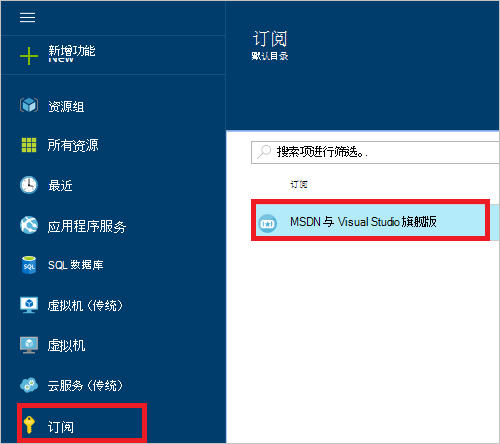
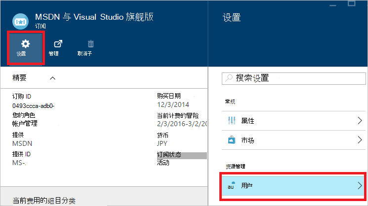
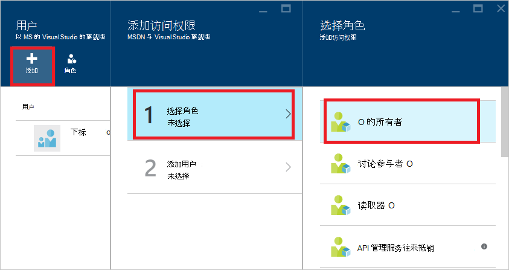
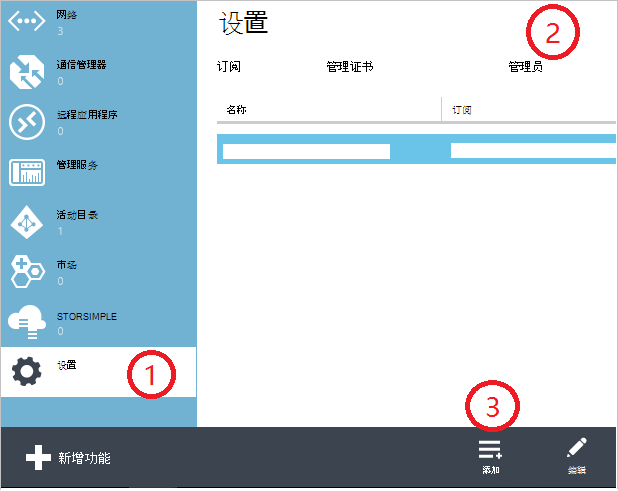
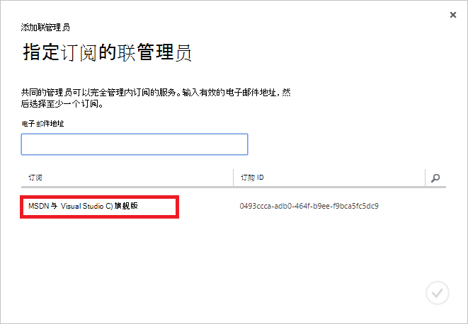
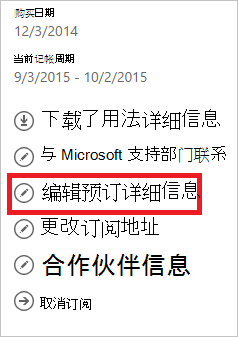
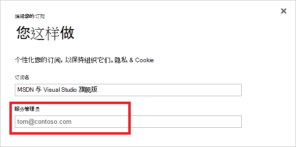

<properties
    pageTitle="如何添加或更改 Azure 管理员角色 |Microsoft Azure"
    description="描述如何添加或更改 Azure 联管理员、 服务管理员和帐户管理员"
    services=""
    documentationCenter=""
    authors="genlin"
    manager="mbaldwin"
    editor=""
    tags="billing"/>

<tags
    ms.service="billing"
    ms.workload="na"
    ms.tgt_pltfrm="na"
    ms.devlang="na"
    ms.topic="article"
    ms.date="08/17/2016"
    ms.author="genli"/>

# 如何添加或更改 Azure 的管理员角色

有三种类型的 Microsoft Azure 中的管理员角色︰

| 管理角色   | 限制  | 说明
| ------------- | ------------- |---------------|
|帐户管理员 (AA)  | 1 每个 Azure 帐户  |这是的人注册或购买了 Azure 订阅，并有权访问[客户中心](https://account.windowsazure.com/Home/Index)和执行各种管理任务。 这些功能包括能够创建订阅、 取消订阅、 更改订阅的记账和更改服务管理员。
| 服务管理员 (SA) | 1 每个 Azure 订阅  |该角色有权在[Azure 的门户网站](https://portal.azure.com)中管理服务。 默认情况下，对于新的订阅，帐户管理员也是服务管理员。|
|在[Azure 的传统门户网站](https://manage.windowsazure.com)共同管理员 (CA)|每个订阅 200| 此角色拥有相同的访问权限作为服务管理员，但不能更改的订阅关联到 Azure 的目录。 |

> [AZURE.NOTE] Azure 基于活动目录角色的访问控制 (RBAC) 允许用户添加到多个角色。 有关详细信息，请参阅[基于 Azure 活动目录角色的访问控制](./active-directory/role-based-access-control-configure.md)。

> [AZURE.NOTE] 如果您需要在此文章中的任何时候更多的帮助，请[与支持人员联系](https://portal.azure.com/?#blade/Microsoft_Azure_Support/HelpAndSupportBlade)以获取您的问题尽快解决。

## 如何添加订阅管理

**Azure 门户**

1. 登录到[Azure 的门户](https://portal.azure.com)。

2. 在集线器菜单中，请选择**订阅** > *订阅所需的管理人员访问*。

    

3. 在订阅刀片式服务器，选择**设置**> **用户**。

    
4. 在用户刀片式服务器，选择**添加**>**中选择一个角色** > **所有者**。

    

    **请注意**
    - 所有者角色具有相同的访问权限，因为共同的管理员。 此角色不具有到[Azure 帐户中心](https://account.windowsazure.com/subscriptions)的访问权限。
    - 添加通过[Azure 的门户网站](https://portal.azure.com)的所有者不能管理[Azure 的传统门户网站](https://manage.windowsazure.com)中的服务。  

5. 键入您想要添加为所有者，单击用户，然后单击**选择**的用户的电子邮件地址。

    

**Azure 的传统门户网站**

1. 登录到[Azure 的传统门户网站](https://manage.windowsazure.com/)。

2. 在导航窗格中，选择**设置**> **管理员**> **添加**。  

    

3. 键入要作为共同管理员添加，然后选择所需共同的管理员才能访问该订阅的人员的电子邮件地址。 

     

作为共同的管理员可添加以下电子邮件地址︰

* **Microsoft 帐户**(以前称为 Windows Live™ ID)  
 可以使用 Microsoft 帐户来登录到所有面向消费者的 Microsoft 产品和云服务，例如 Outlook (Hotmail)、 Skype (MSN)、 OneDrive、 Windows Phone 和 Xbox LIVE。
* **组织的帐户** 
 组织的帐户是在 Azure 活动目录下创建的帐户。 组织的帐户地址如下所示︰ user@&lt;您的域&gt;。 onmicrosoft.com

### 限制和限制

 * 每个订阅程序与 Azure 的广告目录 （也称为默认目录）。 若要查找订阅已与相关联的默认目录，转到[Azure 的传统门户网站](https://manage.windowsazure.com/)，选择**设置** > **预订**。 检查要查找默认目录的订阅 ID。

 * 如果您使用 Microsoft 帐户登录，您只能添加其他 Microsoft 帐户或默认目录中的用户作为共同的管理员。

 * 如果您登录到组织的帐户，可以在您的组织以共同的管理员身份添加其他组织帐户。 例如，abby@contoso.com可以添加bob@contoso.com作为服务管理员或共同的管理员，但不能添加john@notcontoso.com除非john@noncontoso.com是用户在默认目录中的。 使用组织帐户登录的用户可以继续将 Microsoft 帐户用户添加为服务管理员或共同的管理员。

 * 现在，它有可能与组织的帐户登录到 Azure，下面是变为服务管理员和共同的管理员帐户要求︰

    登录方法| 将 Microsoft 客户或默认目录中的用户添加为 CA 或 SA？  |为 CA 或 SA 同一组织中添加组织帐户？ |为 CA 或 SA 不同组织中添加组织帐户？
    ------------- | ------------- |---------------|---------------
    Microsoft 帐户 |是的|不|不
    组织的帐户|是的|是的|不

## 如何更改订阅服务管理员

只有帐户管理员可以更改订阅服务管理员。

1. 使用管理员帐户登录到[Azure 帐户中心](https://account.windowsazure.com/subscriptions)。

2. 选择您想要更改的订阅。

3. 在右侧，单击**编辑订阅**详细信息。  

    

4. 在**服务管理员**框中，输入电子邮件地址的新服务管理员。  

    

## 如何更改帐户管理员

要将 Azure 帐户的所有权转移到另一个帐户，请参阅[传输的 Azure 订阅的所有权](billing-subscription-transfer.md)。

## 下一步行动

* 若要了解有关如何在 Microsoft Azure 中控制资源的访问，请参阅[了解 Azure 中的资源访问](./active-directory/active-directory-understanding-resource-access.md)

* Azure Active Directory 与 Azure 订购的方式的详细信息，请参阅[如何 Azure 订阅将与 Azure Active Directory 相关联](./active-directory/active-directory-how-subscriptions-associated-directory.md)

* Azure Active Directory 与 Azure 订购的方式的详细信息，请参阅[在 Azure Active Directory 中的分配管理员角色](./active-directory/active-directory-assign-admin-roles.md)

> [AZURE.NOTE] 如果您仍然有进一步问题，请[与支持人员联系](https://portal.azure.com/?#blade/Microsoft_Azure_Support/HelpAndSupportBlade)以获取您的问题尽快解决。
