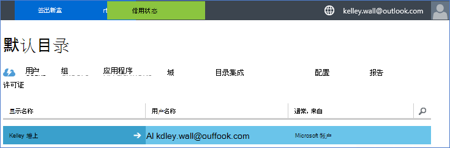
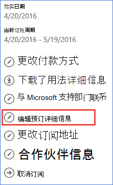
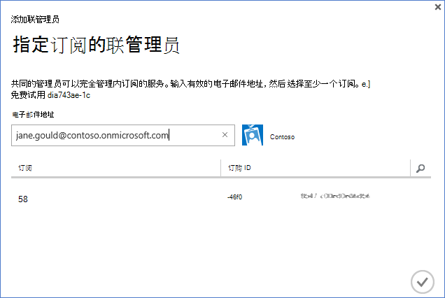

<properties
    pageTitle="Office 365 租户使用 Azure 订阅 |Microsoft Azure"
    description="了解如何添加 Office 365 目录 （租户） 到 Azure 的订阅进行关联。"
    services=""
    documentationCenter=""
    authors="JiangChen79"
    manager="mbaldwin"
    editor=""
    tags="billing,top-support-issue"/>

<tags
    ms.service="billing"
    ms.workload="na"
    ms.tgt_pltfrm="ibiza"
    ms.devlang="na"
    ms.topic="article"
    ms.date="09/16/2016"
    ms.author="cjiang"/>

# Office 365 租户相关联的 Azure 的订阅
如果现在您希望能够从 Azure 订阅访问 Office 365 租户过去，分别获得 Azure 和 Office 365 的订阅，可以很容易地做到这一点。 本文介绍如何。

> [AZURE.NOTE] 这篇文章不能应用于企业协议 (EA) 的客户。

## 快速指南
要与 Azure 订购 Office 365 租户，使用 Azure 帐户添加您的 Office 365 租户，并将与 Office 365 租户的 Azure 订购。

## 详细的步骤
在这种情况下，Kelley 壁是具有在该帐户下的 Azure 订阅的用户kelley.wall@outlook.com。 Kelley 还有帐户下的 Office 365 订阅kelley.wall@contoso.onmicrosoft.com。 现在 Kelley 想要访问 Office 365 租户使用 Azure 的订阅。

### 系统必备组件
正常工作的关联，以下系统必备组件是必要的︰

- 您需要将 Azure 订阅的服务管理员的凭据。 联管理员不能执行的步骤的一个子集。
- 您需要的 Office 365 租户全局管理员的凭据。
- 在 Office 365 租户必须不包含服务管理员的电子邮件地址。
- 服务管理员的电子邮件地址必须与不匹配的 Office 365 租户任何全局管理员。
- 如果您当前使用的是 Microsoft 客户和组织的帐户的电子邮件地址，临时更改 Azure 订购的服务管理员，可以使用另一个 Microsoft 帐户。 在[Microsoft 帐户登录页](https://signup.live.com/)，您可以创建新的 Microsoft 帐户。

若要更改您的服务管理员，请按照下列步骤操作︰

1. 登录到[帐户管理门户](https://account.windowsazure.com/subscriptions)。
2. 选择您想要更改的订阅。
3. 选择**编辑订阅详细信息**。

    

4. 在**服务管理员**框中，输入新的服务管理员的电子邮件地址。

    

### Office 365 租户联 Azure 的订阅
若要将 Office 365 租户与 Azure 预订相关联，请执行以下步骤︰

1.  登录到具有服务管理员凭据的[帐户管理门户](https://account.windowsazure.com/subscriptions)。
2.  在左窗格中，选择**活动目录**。

    

    > [AZURE.NOTE] 不应看到 Office 365 租户。 如果您看到它，请跳过下一步。

    

3. 添加到 Azure 订购 Office 365 租户。

    一。 选择**新建** > **目录** > **自定义创建**。

    

    b。 在**添加目录**页的**目录**下，选择**使用现有目录**。 **我已准备好要立即退出**，然后选择**完整**。

    

    c。 您已注销后，登录的 Office 365 租户的全局管理员的凭据。

    

    d。 选择**继续**。

    

    电子。 选择**立即注销**。

    

    f。 登录到具有服务管理员凭据的[帐户管理门户](https://account.windowsazure.com/subscriptions)。

    

    g。 您应看到您的 Office 365 租户在仪表板中。

    

4. 更改与 Azure 订阅关联的目录。

    一。 选择**设置**。

    

    b。 选择您 Azure 的订阅，然后选择**编辑目录**。
    

    c。 选择**下一步**。

    

    > [AZURE.WARNING] 您将收到一条警告，说明将删除所有共同的管理员。

    

    >[AZURE.WARNING] 此外，也将删除所有[基于角色的访问控制 (RBAC)](./active-directory/role-based-access-control-configure.md)用户与中的现有资源组分配访问权限。 但是，您会收到该警告只提到联管理员删除。

    

    d。 选择**完整**。

5. 现在可以到 Azure Active Directory 租户联管理员身份添加 Office 365 组织帐户。

    一。 选择**管理员**选项卡，然后选择**添加**。

    

    b。 输入您的 Office 365 租户组织帐户，选择 Azure 的订阅，然后选择**完成**。

    

    c。 返回到**管理员**选项卡。 您会看到显示为联管理员组织帐户。

    

6. 下一步可以与管理员联系，共同进行测试访问。

    一。 注销帐户管理门户。

    b。 打开[帐户管理门户](https://account.windowsazure.com/subscriptions)或[Azure 的门户](https://portal.azure.com/)。

    c。 如果 Azure 的登录页**登录到您的组织的帐户**的链接，选择链接。 否则，请跳过此步骤。

    

    d。 输入的联管理员凭据，然后选择**登录**。

    

## 下一步行动
相关的方案包括︰

- 已经有 Office 365 订阅并准备 Azure 的订阅，但您想要使用现有 Office 365 提供用户帐户为您 Azure 的订阅。
- 您是 Azure 的订阅者，并且想要您现有的 Azure Active Directory 实例中获取用户的 Office 365 提供订阅。

若要了解如何完成这些任务，请参阅[的使用您现有的 Office 365 的帐户使用 Azure 的订阅，或反之亦然](billing-use-existing-office-365-account-azure-subscription.md)。
