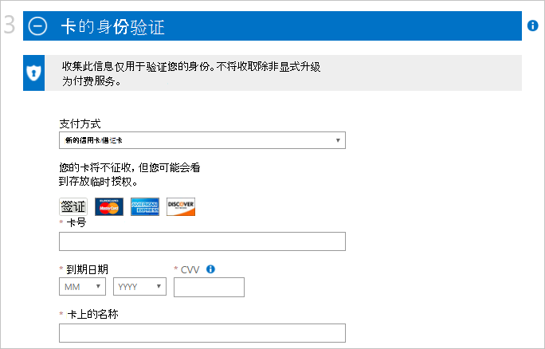

<properties
    pageTitle="如何注册、 采购、 升级或激活订阅了 Azure |Microsoft Azure"
    description="描述如何购买或注册 Azure 的订阅"
    services=""
    documentationCenter=""
    authors="genlin"
    manager="mbaldwin"
    editor=""
    tags="billing,top-support-issue"
    />

<tags
    ms.service="billing"
    ms.workload="na"
    ms.tgt_pltfrm="na"
    ms.devlang="na"
    ms.topic="article"
    ms.date="09/23/2016"
    ms.author="genli"/>

# 如何注册、 采购、 升级或激活 Azure

> [AZURE.NOTE] 如果您需要在此文章中的任何时候更多的帮助，请[与支持人员联系](https://portal.azure.com/?#blade/Microsoft_Azure_Support/HelpAndSupportBlade)以获取您的问题尽快解决。

Azure 提供各种服务，以适应您的业务需求，并开始使用 Azure。 请访问[Azure 提供](https://azure.microsoft.com/support/legal/offer-details/)有关的所有活动提供详细信息的完整列表内容每款盖、 好处和可用性按国家/地区。

## Azure 提供的好处和限度

下表提供的公共产品提供的详细信息︰

| 提供                                                                              | 详细 |
|--------------------------------------------------------------------------------------|---------|
| 免费试用版                                                                           |•[注册和分步指南](billing-buy-sign-up-azure-subscription.md#SignupFreeTrial) •[好处](https://azure.microsoft.com/pricing/free-trial/) •[常见问题解答](https://azure.microsoft.com/pricing/free-trial-faq/) •[升级到即付即用的免费试用版](billing-buy-sign-up-azure-subscription.md#UpgradeFreeToPYG)     |
| 即付即用                                                                        | •[注册](https://azure.microsoft.com/pricing/purchase-options/) •[定价](https://azure.microsoft.com/pricing/)   |
| MPN （Microsoft 合作伙伴网络） 的成员接收免费的每月 Azure 片尾 | •[合作伙伴的 azure 好处](https://azure.microsoft.com/offers/ms-azr-0025p/) •[作为合作伙伴注册](http://go.microsoft.com/fwlink/?linkid=309258&clcid=0x409)或[订阅 Microsoft 操作包](http://go.microsoft.com/fwlink/?linkid=525768&clcid=0x409) • 使用 Azure 的信用-访问[MPN 门户](https://partner.microsoft.com)和验证资格状态和软件密钥和好处按照步骤进行操作。 如果您无法验证资格，请联系[MPN 支持](https://partner.microsoft.com/Support/)。   |
| MSDN 和 Visual Studio 订阅服务器                                                      |• [MSDN 开发/测试的好处](https://azure.microsoft.com/offers/ms-azr-0023p/) • [Visual Studio 订户权益](https://azure.microsoft.com/pricing/member-offers/msdn-benefits-details/) •[激活 Visual Studio 订户 Azure 贷方](https://azure.microsoft.com/pricing/member-offers/msdn-benefits-details/) •[激活 MSDN Azure 好处三个简单的步骤](https://www.youtube.com/watch?v=SN2CA71uOEI&feature=youtu.be)︰  登录到[MSDN 帐户页](https://msdn.microsoft.com/subscriptions/manage/default.aspx)并验证资格，请单击激活 Azure 的好处。 如果您无法验证资格，请联系[MSDN 订阅客户服务中心](https://msdn.microsoft.com/subscriptions/contactus.aspx)。|
| BizSpark                                                                             | •[福利 BizSpark](https://www.microsoft.com/bizspark/default.aspx#start-two)。 有关更多详细信息，请参见[为 Visual Studio 企业每月 Azure 信用](https://azure.microsoft.com/offers/ms-azr-0064p/) •[加入 BizSpark](https://www.microsoft.com/bizspark/signup/default.aspx)。 如果您遇到问题，请联系[BizSpark 团队](mailto:bizspark@microsoft.com?subject=BizSpark%20Support&body=Thank%20you%20for%20contacting%20BizSpark.%20Please%20provide%20as%20much%20of%20the%20following%20information%20as%20possible,%20as%20it%20will%20help%20expedite%20our%20response%20to%20you.%0aContact%20name:%0aStartup%20name:%0aMicrosoft%20Account/Live%20ID:%0aSpecific%20description%20of%20issue%20experienced%20or%20question:%0a%0aThank%20you,%0a%0aThe%20BizSpark%20Team)。      |
| BizSpark 加号                                                                        |•[了解 BizSpark 加号](https://www.microsoft.com/bizspark/plus/default.aspx)。 有关详细信息，请参阅[BizSpark 加上优势](https://azure.microsoft.com/offers/ms-azr-0149p/) •[加入 BizSpark](https://www.microsoft.com/bizspark/signup/default.aspx) ，然后使用您的合作伙伴联系升级到 BizSpark 加号。 如果您遇到问题，请联系[BizSpark 团队](mailto:bizspark@microsoft.com?subject=BizSpark%20Support&body=Thank%20you%20for%20contacting%20BizSpark.%20Please%20provide%20as%20much%20of%20the%20following%20information%20as%20possible,%20as%20it%20will%20help%20expedite%20our%20response%20to%20you.%0aContact%20name:%0aStartup%20name:%0aMicrosoft%20Account/Live%20ID:%0aSpecific%20description%20of%20issue%20experienced%20or%20question:%0a%0aThank%20you,%0a%0aThe%20BizSpark%20Team)。     |
| 转销商 （打开批量许可的程序）                                             |•[在线激活服务密钥的分步指南](billing-buy-sign-up-azure-subscription.md#activateKey) •[购买，好处激活](https://azure.microsoft.com/offers/ms-azr-0111p/)        |
| EA (企业协议)                                                            |•[授权 Azure 的企业](https://azure.microsoft.com/pricing/enterprise-agreement/) • 如果要激活，请联系 Microsoft 客户经理或转销商以立即开始     |

## 注册 Azure 免费试用订阅

若要注册 Azure 免费试用订阅，您必须提供电话号码、 信用卡，以及 Microsoft 客户。 您的 Microsoft 帐户是使用，以及您的密码，以便登录到 Windows Live 程序或服务，如 Outlook，Hotmail 或 OneDrive 的电子邮件地址。 您可以设置 Microsoft 帐户使用任何属于您包括您的公司电子邮件的电子邮件地址。 更多详细信息，请参阅[Microsoft 客户的常见问题](https://www.microsoft.com/account/faq.aspx)。

如果您遇到任何问题，请参阅[疑难解答 Azure 注册问题](billing-troubleshoot-azure-sign-up-issues.md)。

>[AZURE.NOTE] 您的电话号码和信用卡详细信息仅用于验证您的身份。 虽然不会收取您的信用卡，Microsoft 将授权保留上的少量来验证信用卡有效。 在 3-5 个工作日内，根据金融机构的政策，该保留将被释放。

1. 打开[Azure 的免费试用版页面](https://azure.microsoft.com/pricing/free-trial/)，然后选择**立即开始**。

2. 使用您的 Microsoft 客户或组织的帐户登录。

3. 在**关于您的信息**部分中，输入您的个人信息。 [了解更多](billing-troubleshoot-azure-sign-up-issues.md#i-am-getting-an-error-when-entering-my-information-to-sign-up)关于准确地输入您的个人信息。

    

    >[AZURE.NOTE] Azure 订购计划注册时所提供的电子邮件地址和国家/地区信息将始终与订阅，并且以后不能更改。

4. 在**通过电话验证**部分中，您必须提供要收到以完成验证过程，可以提供一个验证码的电话号码。

    您可以选择以短信或语音呼叫通过收到验证码。 通过选择**发送短信**或**呼叫我**做出选择。 在第一个框中，选择您的国家的国际拨号代码，并在第二个框中输入您的电话号码。 您将收到验证码后，在第三个框中，输入，然后选择**验证代码**按钮。 [有关更多详细信息，请参阅](billing-troubleshoot-azure-sign-up-issues.md#i-am-not-getting-text-messages-or-calls-during-account-verification-when-i-try-to-sign-up)。

    >[AZURE.NOTE] 您能对电话验证过程中使用 VOIP 电话号码。

    

    如果您没有收到短信或电话，请尝试使用不同的电话号码或与[Azure 支持](https://portal.azure.com/#blade/Microsoft_Azure_Support/HelpAndSupportBlade)部门联系寻求帮助。

5. 在**卡验证**部分中，输入有效的信用卡的详细信息。 收集此信息仅用于验证您的身份。

    如果您提交信用卡信息后收到错误信息，请参阅文章[试图注册 Azure 时不经过我的信用卡](billing-credit-card-fails-during-azure-sign-up.md)。

    

6. 在**协议**部分中，选中相应的框，如果您同意订阅协议、 优惠详细信息和隐私声明。 然后选择**注册**。 协议窗体可能会因国家/地区。

    

    它可以需要几分钟来设置您的订购。 如果在 15 分钟内没有完成预订设置，联系[Azure 支持](https://portal.azure.com/#blade/Microsoft_Azure_Support/HelpAndSupportBlade)获取帮助。

    > [AZURE.NOTE] 如果您收到一条错误消息，请按照本文要解决的问题的消息。 是典型的错误消息︰

    > **很抱歉，我们无法完成该操作。请稍后重试或重新加载网页**

    > 在这种情况下，请尝试使用另一个浏览器以完成注册过程。 如果此问题仍然存在，与[Azure 支持](https://portal.azure.com/#blade/Microsoft_Azure_Support/HelpAndSupportBlade)联系寻求帮助。

7. 可以订阅时，选择**开始管理我的服务**来开始。

    

### 其他资源

- [我不能激活 Azure 的免费试用版](billing-troubleshoot-azure-sign-up-issues.md#i-cant-activate-an-azure-free-trial)
- [Azure 的免费试用版的常见问题解答](https://azure.microsoft.com/pricing/free-trial-faq/)。

## 将 Azure 的免费试用版升级到即付即用

1. 使用 Microsoft 帐户或您用来注册免费试用您组织的帐户登录到[Azure 帐户门户](https://account.windowsazure.com/subscriptions)。

2. 选择订阅，然后再选择**升级**

    

3. 选择**是**，然后选择**立即升级**。

    

当从一个免费试用订阅升级到即付即用订阅时，从您免费试用 30 天限制如留下的任何好处或 200 美元信用卡使用 Azure 服务将继续，直到其中一个已用尽。 订阅升级之后将会发生。

## 使用在线服务激活密钥激活

如果您从经销商那里购买**Azure 中打开**信用并获得激活码 （5 x 5 键），请按照以下步骤激活您的订购︰

1. 转到[订阅摘要页](https://account.windowsazure.com/subscriptions)。

2. 选择**在打开 Azure**。 在[Azure 中打开许可证密钥](https://azure.microsoft.com/offers/ms-azr-0111p/)页面中，选择**新的订阅激活或现有订阅**。

3. 输入产品密钥，并检查了协议选项。

> [AZURE.NOTE] 如果您仍然有进一步问题，请[与支持人员联系](https://portal.azure.com/?#blade/Microsoft_Azure_Support/HelpAndSupportBlade)以获取您的问题尽快解决。
