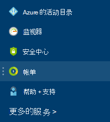

<properties
    pageTitle="如何下载付费发票和每日使用率数据您 Azure |Microsoft Azure"
    description="介绍如何下载您的 Azure 付费的发票和每日的使用率数据"
    services=""
    documentationCenter=""
    authors="genlin"
    manager="mbaldwin"
    editor=""
    tags="billing"
    />

<tags
    ms.service="billing"
    ms.workload="na"
    ms.tgt_pltfrm="na"
    ms.devlang="na"
    ms.topic="article"
    ms.date="10/10/2016"
    ms.author="genli"/>

# 如何下载您 Azure 付费发票和每日使用率数据

> [AZURE.NOTE] 如果您需要在此文章中的任何时候更多的帮助，请[与支持人员联系](https://portal.azure.com/?#blade/Microsoft_Azure_Support/HelpAndSupportBlade)以获取您的问题尽快解决。

作为 Azure 帐户管理员，您可以查看在[Azure 门户](https://portal.azure.com)或[Azure 帐户中心](https://account.windowsazure.com/subscriptions)每日的使用率数据和付费发票。 下面是如何︰

## Azure 门户

1. 以管理员帐户身份登录到[Azure 的门户](https://portal.azure.com)。

    >[AZURE.NOTE] 只有帐户管理员有权访问记帐数据。 有关如何找出是谁订阅的帐户管理员的详细信息，请参阅[常见问题](billing-subscription-transfer.md#faq)。

2. 中心的菜单上，选择**付费**。 **帐单**刀片式服务器，您可以找到一些有用的信息，例如下一个计费日期。

    
3. 在**订购成本**部分中，选择您要查看的订阅。

    
4. 单击**收费和使用情况**。

    

5. **帐单历史**刀片式服务器，请单击**下载发票**查看一份账单。 单击付费的期限内，若要查看每日的使用率数据。

    

## Azure 帐户中心

1. 以管理员帐户身份登录到[Azure 帐户中心](https://account.windowsazure.com/subscriptions)。
2. 选择您想要的发票和使用信息的订阅。
3. 选择**帐单历史记录**。  
4. 最后六个记帐期间和当前未出票的期间，您可以看到您的语句。   
5. 选择**视图当前语句**，以在生成估计的时间，请参阅您的费用的估计。 此信息仅每天进行更新，也可能不包括所有的使用。 每月账单可能不同于此估计值。   
6. 选择要查看的最后一个账单副本**下载发票**。  
7. 选择**下载使用**下载为 CSV 文件的每日使用情况数据。 

> [AZURE.NOTE] 如果您仍然有进一步问题，请[与支持人员联系](https://portal.azure.com/?#blade/Microsoft_Azure_Support/HelpAndSupportBlade)以获取您的问题尽快解决。
