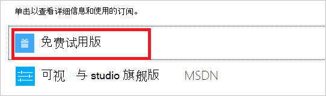

<properties
    pageTitle="取消订阅 Azure |Microsoft Azure"
    description="描述如何取消 Azure 订阅，如免费试用订阅"
    services=""
    documentationCenter=""
    authors="genlin"
    manager="mbaldwin"
    editor=""
    tags="billing"
    />

<tags
    ms.service="billing"
    ms.workload="na"
    ms.tgt_pltfrm="na"
    ms.devlang="na"
    ms.topic="article"
    ms.date="09/26/2016"
    ms.author="genli"/>

# 取消 Azure 订阅

取消从[Azure 帐户中心](https://account.windowsazure.com/subscriptions)Azure 订阅。 取消订阅后，将结束您对 Azure 服务和资源的访问权限。

之前您取消您的订阅︰

- 备份您的数据。 例如，如果您在 SQL Azure 存储中存储数据，下载副本。 如果您有一个虚拟机，将保存本地的图像。

- 关闭您的服务。 任何正在运行的虚拟机、 应用程序或其他服务，请转到[管理门户中的资源页](https://ms.portal.azure.com/?flight=1#blade/HubsExtension/Resources/resourceType/Microsoft.Resources%2Fresources)上，然后**停止**。

如果您取消付费的[Azure 支持计划](https://azure.microsoft.com/support/plans/)，您将仍会按月付费在剩下的 6 个月期限。

## 取消订阅

1. 登录到[Azure 帐户中心](https://account.windowsazure.com/subscriptions)作为帐户管理员。

2. 在下**单击订阅以查看详细信息和使用情况**，选择要取消订阅。 

    

3. 在页面的右侧，选择**取消订阅**。
    
    

4. 选择**是，取消我的预订**。
    
    

5. 单击  若要关闭的对话框窗口并返回到您的订购页面。

取消您的订阅后，我们会等待 90 天之前永久删除您的数据，以防您需要访问它，或者改变了主意。 有关详细信息，请参阅[Microsoft 信任中心-我们如何管理您的数据](https://go.microsoft.com/fwLink/p/?LinkID=822930&clcid=0x409)。

## 重新激活订阅

如果意外取消付费订阅，则可以[重新激活该帐户中心](billing-subscription-become-disable.md#how-to-re-enable-non-pay-as-you-go-subscriptions)。

## 需要帮助吗？ 与支持部门联系。

如果您仍然有进一步问题，请[与支持人员联系](https://portal.azure.com/?#blade/Microsoft_Azure_Support/HelpAndSupportBlade)以获取您的问题尽快解决。
