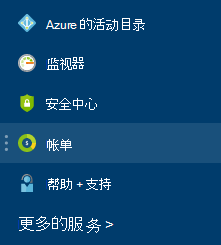

<properties
    pageTitle="了解您 Azure 的外部服务费用 |Microsoft Azure"
    description="了解有关外部的服务，以前称为市场，Azure 中的杂项费用的帐单。"
    services=""
    documentationCenter=""
    authors="adpick"
    manager="felixwu"
    editor=""
    tags="billing"
    />

<tags
    ms.service="billing"
    ms.workload="na"
    ms.tgt_pltfrm="na"
    ms.devlang="na"
    ms.topic="article"
    ms.date="10/12/2016"
    ms.author="adpick"/>

# 了解您 Azure 的外部服务费用

本文介绍了在 Azure 中的外部服务的帐单。 外部服务用于调用市场订单。 外部服务独立服务供应商提供的但它们完全集成的 Azure 的生态系统中。 了解如何︰

- 标识外部服务
- 了解如何计费不同于其他 Azure 的资源
- 查看和跟踪使用外部服务您累算的任何成本
- 管理外部服务订单和您如何为它们付费

## 什么是 Azure 的外部服务？

外部服务用于调用 Azure 市场。 通常情况下，它们的发布由第三方可用的 Azure 服务。 例如，ClearDB 和 SendGrid 都可以购买在 Azure，但不由 Microsoft 发布的外部服务。

### 标识外部服务

当您配置新的外部服务或资源时，将显示警告︰

>[AZURE.NOTE] 外部服务发布的公司不是 Microsoft，但有时 Microsoft 产品还分为外部服务。

### 外部服务单独计费

外部服务被视为各个 Azure 订购的订单。 您购买的服务时，设置每个服务的计费周期。 不要混淆与购买的订阅付费期限。 您还会收到单独的物料清单，分别收取您的信用卡。

### 每个外部服务有不同的计费模型

而其他使用每月的付款基于的模型的某些服务计费随使用而付费的方式。 所需的 Azure 的外部服务的信用卡，不能购买发票付薪的外部服务。

### 不能使用外部服务每月免费信用

如果您正在使用 Azure 的订购，其中包含[可用信用](https://azure.microsoft.com/pricing/spending-limits/)，他们不能应用于外部服务物料清单。 使用信用卡购买外部服务。

## 查看外部服务开支和历史记录

您可以查看位于[Azure 的门户网站](https://portal.azure.com/)中每个订阅的外部服务的列表︰ 

1. 登录到[Azure 的门户](https://portal.azure.com/)和[导航到**计费**刀片式服务器](https://portal.azure.com/?flight=1#blade/Microsoft_Azure_Billing/BillingBlade)。

     
  
2. 在**订购成本**部分中，选择您要查看的订阅。 
   
    

3. 单击**外部服务**。

    

4. 您应该看到每个外部服务订单、 发布者名称，您购买的服务层、 名称的资源和当前的订单状态。 选择外部服务以查看过去的帐单。

    

5. 从这里，您可以查看过去的帐单金额包括税细目。

    

## 管理外部服务订单的付款方式

更新您从[客户中心](https://account.windowsazure.com/)的外部服务订单的付款方式。

> [AZURE.NOTE] 如果您购买了您的订购与工作或学校的帐户应该[与支持部门联系](https://portal.azure.com/?#blade/Microsoft_Azure_Support/HelpAndSupportBlade)以更改您的付款方式。

1. 登录到[客户中心](https://account.windowsazure.com/)并[导航到**市场**选项卡](https://account.windowsazure.com/Store)

    

2. 选择您想要管理的外部服务

    

3. 在页面的右侧，单击**更改付款方式**。 此链接将带您到不同的门户来管理您的付款方式。
    
    

4. 单击**编辑信息**，然后按照说明更新您的付款信息。

    
    
## 取消外部服务订单

如果您想要取消外部服务订单，您需要删除在[Azure 门户](https://portal.azure.com)资源。

## 需要帮助吗？ 与支持部门联系。

如果您仍然有进一步问题，请[与支持人员联系](https://portal.azure.com/?#blade/Microsoft_Azure_Support/HelpAndSupportBlade)以获取您的问题尽快解决。
