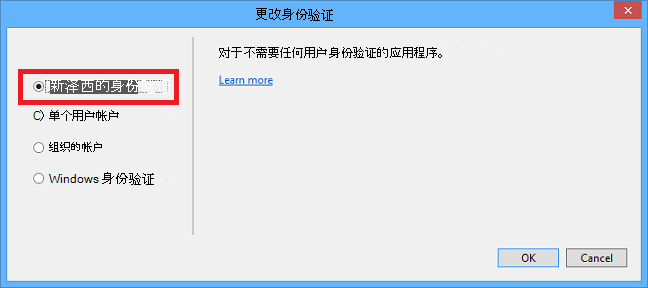

<properties
    pageTitle="开始使用 Azure 云服务和 ASP.NET |Microsoft Azure"
    description="了解如何创建使用 ASP.NET MVC 和 Azure 的多层应用程序。 应用程序运行在云服务中，web 角色和辅助角色。 它使用实体框架、 SQL 数据库和 Azure 存储队列和 blob。"
    services="cloud-services, storage"
    documentationCenter=".net"
    authors="Thraka"
    manager="timlt"
    editor=""/>

<tags
    ms.service="cloud-services"
    ms.workload="tbd"
    ms.tgt_pltfrm="na"
    ms.devlang="dotnet"
    ms.topic="hero-article"
    ms.date="06/10/2016"
    ms.author="adegeo"/>

# <a name="get-started-with-azure-cloud-services-and-aspnet"></a>开始使用 Azure 云服务和 ASP.NET

> [AZURE.SELECTOR]
- [Node.js](cloud-services-nodejs-develop-deploy-app.md)
- [.NET](cloud-services-dotnet-get-started.md)

## <a name="overview"></a>概述

本教程展示如何创建使用 ASP.NET MVC 的多层.NET 应用程序前端，并将其部署到[Azure 的云服务](cloud-services-choose-me.md)。 应用程序使用[SQL Azure 数据库](http://msdn.microsoft.com/library/azure/ee336279)、 [Azure Blob 服务](http://www.asp.net/aspnet/overview/developing-apps-with-windows-azure/building-real-world-cloud-apps-with-windows-azure/unstructured-blob-storage)和[Azure 队列服务](http://www.asp.net/aspnet/overview/developing-apps-with-windows-azure/building-real-world-cloud-apps-with-windows-azure/queue-centric-work-pattern)。 您可以从 MSDN 代码库中[下载的 Visual Studio 项目](http://code.msdn.microsoft.com/Simple-Azure-Cloud-Service-e01df2e4)。

本教程演示了如何生成和运行该应用程序的本地、 如何将其部署到 Azure 和运行在云中，并最后如何从头构建它。 您可以入手，从头构建测试和部署步骤之后，如果您更喜欢。

## <a name="contoso-ads-application"></a>Contoso 广告应用程序

应用程序是广告公告板。 用户通过输入文本和上载图像创建广告。 他们可以看到的广告包含缩览图图像，列表，当用户选择查看详细信息的广告，他们可以看到完整大小的图像。


应用程序使用[队列为中心的工作模式](http://www.asp.net/aspnet/overview/developing-apps-with-windows-azure/building-real-world-cloud-apps-with-windows-azure/queue-centric-work-pattern)减轻了 CPU 密集型操作，创建到后端进程的缩略图。

## <a name="alternative-architecture-websites-and-webjobs"></a>备选体系结构︰ 网站和 WebJobs

本教程展示如何运行，前端和后端在 Azure 的云服务。 另一种方法是[Azure 网站](/services/web-sites/)中运行的前端和后端使用[WebJobs](http://go.microsoft.com/fwlink/?LinkId=390226)功能 （目前在预览）。 使用 WebJobs 的教程，请参阅[开始使用 Azure WebJobs SDK](../app-service-web/websites-dotnet-webjobs-sdk-get-started.md)。 有关如何选择最适合您的方案的服务的信息，请参阅[Azure 网站、 云服务和虚拟机的比较](../app-service-web/choose-web-site-cloud-service-vm.md)。

## <a name="what-youll-learn"></a>您将学习

* 通过安装 Azure SDK 启用 Azure 开发计算机的方式。
* 如何创建一个 Visual Studio 云服务项目 ASP.NET MVC web 角色和辅助角色。
* 如何使用 Azure 存储仿真器测试本地，云服务项目。
* 如何发布云到 Azure 的云服务项目，并测试使用 Azure 存储帐户。
* 若要上载的文件并将它们存储在 Azure Blob 服务的方式。
* 如何使用 Azure 队列服务层之间的通信。

## <a name="prerequisites"></a>系统必备组件

本教程假定您具备[Azure 的云服务有关的基本概念](cloud-services-choose-me.md)，如*web 角色*和*辅助角色*的术语。  它还假定您知道如何使用 Visual Studio 中的[ASP.NET MVC](http://www.asp.net/mvc/tutorials/mvc-5/introduction/getting-started)或[Web 窗体](http://www.asp.net/web-forms/tutorials/aspnet-45/getting-started-with-aspnet-45-web-forms/introduction-and-overview)项目。 示例应用程序使用的 MVC，但本指南的大部分也适用于 Web 窗体。

您可以运行本地没有订阅了 Azure 应用程序，但将为部署到云中的应用程序需要一个。 如果您没有帐户，则可以[激活您的 MSDN 订户权益](/pricing/member-offers/msdn-benefits-details/?WT.mc_id=A55E3C668)或[注册免费试用版](/pricing/free-trial/?WT.mc_id=A55E3C668)。

教程说明使用以下产品之一︰

* Visual Studio 2013 年
* Visual Studio 2015 年

如果没有其中一种，Azure SDK 安装时，将自动安装 Visual Studio 2015年。

## <a name="application-architecture"></a>应用程序体系结构

应用程序存储在 SQL 数据库中，使用实体框架代码第一个创建的表和访问数据的广告。 每个广告数据库存储两个 Url，一个用于完全尺寸的图像和缩略图来个。


当用户上载图像时，前端运行 web 角色中将图像存储在[Azure 斑点](http://www.asp.net/aspnet/overview/developing-apps-with-windows-azure/building-real-world-cloud-apps-with-windows-azure/unstructured-blob-storage)，并且它将广告信息存储在数据库中以一个 URL 指向 blob。 在同一时间，它将消息写入到 Azure 的队列。 定期运行辅助角色中的后端进程轮询队列的新消息。 显示新消息时，辅助角色创建该图像的缩略图，并更新该广告缩略图 URL 数据库字段。 下图显示了应用程序的部件之间的交互方式。


[AZURE.INCLUDE [install-sdk](../../includes/install-sdk-2015-2013.md)]

## <a name="download-and-run-the-completed-solution"></a>下载并运行已完成的解决方案

1. 下载并解压缩[完成解决方案](http://code.msdn.microsoft.com/Simple-Azure-Cloud-Service-e01df2e4)。

2. 启动 Visual Studio。

3. 从**文件**菜单选择**打开项目**，导航到您下载该解决方案，然后打开解决方案文件。

3. 按 CTRL + SHIFT + B 来构建解决方案。

    默认情况下，Visual Studio 将自动还原 NuGet 程序包内容，未包括在*.zip*文件中。 如果不还原软件包，手动安装通过转至**管理的 NuGet 程序包的解决方案**对话框中，单击右上方的**还原**按钮。

3. 在**解决方案资源管理器**中确保选择**ContosoAdsCloudService**作为启动项目。

2. 如果您使用的 Visual Studio 2015年，更改 SQL Server 连接字符串和 ContosoAdsCloudService 项目的*ServiceConfiguration.Local.cscfg*文件 ContosoAdsWeb 项目的应用程序*Web.config*文件中。 在每种情况下，将"(localdb) \v11.0"改"(localdb) \MSSQLLocalDB"。

1. 按 CTRL + F5 以运行应用程序。

    本地运行一个云服务项目时，Visual Studio 将自动调用的 Azure*计算仿真程序*和 Azure*存储仿真器*。 计算仿真程序使用您的计算机资源来模拟 web 角色和工作角色的环境。 存储仿真器使用[SQL Server Express LocalDB](http://msdn.microsoft.com/library/hh510202.aspx)数据库模拟 Azure 的云存储。

    第一次运行一个云服务项目，需要一分钟左右为启动仿真程序。 仿真程序启动完成后，默认的浏览器打开应用程序的主页上。

    

2. 单击**创建广告**。

2. 输入一些测试数据并选择要上载， *.jpg*图像，然后单击**创建**。

    

    应用程序转到索引页上，但不会显示缩略图的新广告因为尚未处理尚未发生了变化。

3. 稍等片刻，然后刷新索引页后，可以看到缩略图。

    

4. 单击**详细信息**为您的广告以查看完整大小的图像。

    

您已运行该应用程序完全在本地计算机没有连接到云上。 存储仿真器将队列和 blob 数据存储在 SQL Server Express LocalDB 数据库和应用程序存储在另一个数据库中 LocalDB 广告数据。 实体框架代码优先自动 ad 数据库首次创建 web 应用程序试图访问它。

下一节中您将配置解决方案时在云中运行队列，blob，和应用数据库使用 Azure 的云资源。 如果您想要继续在本地运行，但使用云存储和数据库资源，您可以做的;它是只需设置连接字符串，您将看到如何执行操作。

## <a name="deploy-the-application-to-azure"></a>部署到 Azure 应用程序

将执行以下步骤以在云中运行应用程序︰

* 创建 Azure 的云服务。
* 创建 SQL Azure 数据库。
* 创建一个 Azure 存储帐户。
* 配置要在 Azure 中运行时使用 SQL Azure 数据库的解决方案。
* 配置要使用 Azure 存储帐户，当它在 Azure 中运行的解决方案。
* 将项目部署到 Azure 的云服务。

### <a name="create-an-azure-cloud-service"></a>创建 Azure 的云服务

Azure 的云服务是在运行该应用程序的环境。

1. 在浏览器中，打开[Azure 的传统门户网站](http://manage.windowsazure.com)。

2. 单击**新 > 计算 > 云服务 > 快速创建**。

4. 在输入 URL 框中输入 URL 前缀。

    该 URL 必须是唯一的。  如果您选择的前缀已被他人使用，您将有一条错误消息。

5. 选择您要在其中部署应用程序的区域。

    此字段指定将中承载您的云服务的数据中心。 对于生产应用程序中，可以选择客户最近的区域。 对于本教程，请选择离您最近的区域。

6. 单击**创建云服务**。

    在下面的图像中，URL contosoads.cloudapp.net 创建的云服务。

    

### <a name="create-an-azure-sql-database"></a>创建 SQL Azure 数据库

当应用程序在云中运行时，它将使用一个基于云的数据库。

1. 在[Azure 的传统门户网站](http://manage.windowsazure.com)中，请单击**新建 > 数据服务 > SQL 数据库 > 快速创建**。

1. 在**数据库名称**框中，输入*contosoads*。

1. 从**服务器**下拉列表中，选择**新的 SQL 数据库服务器**。

    或者，如果您的订阅已经有服务器，您可以从下拉列表中选择该服务器。

1. 选择您选择云服务的同一个**地区**。

    当云服务和数据库位于不同的数据中心 （其他地区），会增加延迟和您将收取在数据中心之外的带宽。 在一个数据中心的带宽是免费的。

1. 输入管理员**登录名**和**密码**。

    如果您选择现有的名称和密码不能输入**新的 SQL 数据库服务器**，您在输入新的名称和密码，您现在定义以后访问数据库时使用。 如果您选择以前创建的服务器时，系统将提示您到已经创建了您的管理用户帐户的密码。

1. 单击**创建 SQL 数据库**。

    

1. Azure 完成创建数据库后，单击左窗格中的门户，在**SQL 数据库**选项卡，然后单击新数据库的名称。

2. 单击**仪表板**选项卡。

3. 单击**管理允许 IP 地址**。

4. 在**允许服务**，变为**Azure 服务****是**。

5. 单击**保存**。

### <a name="create-an-azure-storage-account"></a>创建一个 Azure 存储帐户

Azure 存储帐户提供资源，用于在云中存储队列和 blob 数据。

在实际应用中，通常需要创建单独的帐户为应用程序数据和日志记录数据，并单独占测试数据与生产数据。 在本教程中，您将使用一个帐户。

1. 在[Azure 的传统门户网站](http://manage.windowsazure.com)中，请单击**新建 > 数据服务 > 存储 > 快速创建**。

4. 在**URL**框中，输入一个 URL 前缀。

    此前缀与您在框中看到的文本将在您的存储帐户的唯一 URL。 如果已被其他人使用您输入的前缀，您需要选择不同的前缀。

5. 将**地区**下拉列表设置为您选择云服务的同一个地区。

    在不同数据中心，云服务和存储帐户时 （不同区域），会增加延迟和您将收取在数据中心之外的带宽。 在一个数据中心的带宽是免费的。

    Azure 好友小组提供一种机制，以最小化数据中心，从而减少延迟的资源之间的距离。 本教程不使用关联组。 有关详细信息，请参阅[如何创建 Azure 中的关联组](http://msdn.microsoft.com/library/jj156209.aspx)。

6. 将**复制**下拉列表设置为**本地冗余**。

    存储帐户启用地理复制时，存储的内容被复制到从属数据中心启用故障转移到该位置发生的主要地点，在大的灾难。 Geo 复制可以带来额外的成本。 对于测试和开发帐户，通常不希望支付地区复制。 有关详细信息，请参阅[创建、 管理或删除存储帐户](../storage/storage-create-storage-account.md#replication-options)。

5. 单击**创建存储帐户**。

    

    在图像中，使用的 URL 创建存储帐户`contosoads.core.windows.net`。

### <a name="configure-the-solution-to-use-your-azure-sql-database-when-it-runs-in-azure"></a>配置要在 Azure 中运行时使用 SQL Azure 数据库的解决方案

Web 项目和员工角色项目每个都有其自己的数据库连接字符串，并且每个需要在 Azure 应用程序运行时指向 SQL Azure 数据库。

您将使用[Web.config 转换](http://www.asp.net/mvc/tutorials/deployment/visual-studio-web-deployment/web-config-transformations)web 角色和辅助角色的云服务环境设置。

>[AZURE.NOTE] 在这一节和下一节中您将存储在项目文件中的凭据。 [不要将公开源代码库中的敏感数据](http://www.asp.net/aspnet/overview/developing-apps-with-windows-azure/building-real-world-cloud-apps-with-windows-azure/source-control#secrets)。

1. 在 ContosoAdsWeb 项目中，打开该应用程序的*Web.config*文件的*Web.Release.config*转换文件，请删除注释块包含`<connectionStrings>`元素，然后粘贴下面的代码在其原位置。

    ```xml
    <connectionStrings>
        <add name="ContosoAdsContext" connectionString="{connectionstring}"
        providerName="System.Data.SqlClient" xdt:Transform="SetAttributes" xdt:Locator="Match(name)"/>
    </connectionStrings>
    ```

    保持文件打开以供编辑。

2. 在[Azure 的传统门户网站](http://manage.windowsazure.com)中，单击左窗格中的**SQL 数据库**为本教程中创建的数据库单击**仪表板**选项卡和，然后单击**显示的连接字符串**。

    

    门户显示的连接字符串，与密码的占位符。

    

4. 在*Web.Release.config*的转换文件，删除`{connectionstring}`和粘贴在原地 ADO.NET 连接字符串从 Azure 的传统门户网站。

5. 在您粘贴到*Web.Release.config*转换文件的连接字符串，将替换为`{your_password_here}`与您创建新的 SQL 数据库的密码。

7. 保存该文件。  

6. 选择并复制配置工作人员角色项目在以下步骤中使用 （不带引号） 的连接字符串。

5. 在**解决方案资源管理器**里下**角色**在云服务项目中，用鼠标右键单击**ContosoAdsWorker** ，然后单击**属性**。

    

6. 单击**设置**选项卡。

7. 将**服务配置**更改为**云**。

7. 选择**值**字段中的为`ContosoAdsDbConnectionString`设置，并粘贴上一节教程的复制连接字符串。

    

7. 保存您的更改。  

### <a name="configure-the-solution-to-use-your-azure-storage-account-when-it-runs-in-azure"></a>配置要使用 Azure 存储帐户，当它在 Azure 中运行的解决方案

对于 web 角色项目和员工角色项目 azure 存储帐户连接字符串存储在云服务项目中的环境设置。 每个项目都没有单独的一组设置，以在本地运行应用程序时，当它运行在云中使用。 您将更新 web 和辅助角色项目的云环境设置。

1. 在**解决方案资源管理器**中用鼠标**角色**下的**ContosoAdsWeb**在**ContosoAdsCloudService**项目中，右键单击，然后单击**属性**。

    

2. 单击**设置**选项卡。 在**服务配置**下拉列表框中，选择**云**。

    

3. 选择**StorageConnectionString**条目，，您会看到 （****） 的省略号...行的右端。 单击省略号按钮以打开**创建存储帐户连接字符串**对话框。

    

4. 中**创建存储连接字符串**对话框中，单击**您的订阅**、 选择先前创建的存储帐户，然后单击**确定**。 如果您没有登录，您将被提示 Azure 帐户凭据。

    

5. 保存您的更改。

6. 执行相同的过程使用的`StorageConnectionString`连接字符串来设置`Microsoft.WindowsAzure.Plugins.Diagnostics.ConnectionString`的连接字符串。

    此连接字符串用于日志记录。

7. 按照**ContosoAdsWeb**角色用于设置**ContosoAdsWorker**角色的两个连接字符串相同的过程。 别忘了将**服务配置**为**云**。

您已配置使用 Visual Studio 的 UI 的角色环境设置存储在 ContosoAdsCloudService 项目中的下列文件︰

* *ServiceDefinition.csdef* -定义的设置名称。
* *ServiceConfiguration.Cloud.cscfg* -为该应用程序在云中运行时提供值。
* *ServiceConfiguration.Local.cscfg* -提供应用程序在本地运行的值。

例如，ServiceDefinition.csdef 包含了以下定义。

```xml
<ConfigurationSettings>
    <Setting name="StorageConnectionString" />
    <Setting name="ContosoAdsDbConnectionString" />
</ConfigurationSettings>
```

和*ServiceConfiguration.Cloud.cscfg*文件包含您在 Visual Studio 中的那些设置所输入的值。

```xml
<Role name="ContosoAdsWorker">
    <Instances count="1" />
    <ConfigurationSettings>
        <Setting name="StorageConnectionString" value="{yourconnectionstring}" />
        <Setting name="ContosoAdsDbConnectionString" value="{yourconnectionstring}" />
        <!-- other settings not shown -->

    </ConfigurationSettings>
    <!-- other settings not shown -->

</Role>
```

`<Instances>`设置指定 Azure 将辅助角色代码运行的虚拟机的数量。 [后续步骤](#next-steps)部分中包括横向扩展云服务，有关的详细信息的链接

###  <a name="deploy-the-project-to-azure"></a>将项目部署到 Azure

1.  在**解决方案资源管理器**中用鼠标右键单击**ContosoAdsCloudService**云项目，然后选择**发布**。

    

2. 在**发布 Azure 应用程序**向导的步骤中**登录**，单击**下一步**。

    

3. 在向导的**设置**步骤中，单击**下一步**。

    

    出于本教程中的**高级**选项卡的默认设置是完好的。 有关高级选项卡的信息，请参阅[发布 Azure 应用程序向导](http://msdn.microsoft.com/library/hh535756.aspx)。

4. 在**摘要**步骤中，单击**发布**。

    

   在 Visual Studio 中打开了**Azure 活动日志**窗口。

5. 单击右箭头图标以展开部署详细信息。

    部署可以需要花 5 分钟或更长时间。

    

6. 部署状态完成后，请单击**Web 应用程序 URL**启动应用程序。

7. 就像在本地运行应用程序时，现在可以创建、 查看和编辑一些广告，通过测试应用程序。

>[AZURE.NOTE] 当您完成时测试时，删除或停止的云服务。 即使您没有使用云服务，它因为为其保留的虚拟机资源计入费用。 并且，如果您保持运行状态，发现您的 URL 的任何人可以创建和查看广告。 在[Azure 的传统门户网站](http://manage.windowsazure.com)中，转到云服务，**仪表板**选项卡，然后单击页面底部的**删除**按钮。 如果您只想暂时防止其他人访问该网站，请单击**停止**。 在这种情况下，费用将继续累。 您可以按照类似的过程以删除 SQL 数据库和存储帐户，当您不再需要它们。

## <a name="create-the-application-from-scratch"></a>从头开始创建应用程序

如果您尚未下载[完整的应用程序](http://code.msdn.microsoft.com/Simple-Azure-Cloud-Service-e01df2e4)，做到现在。 会将文件从下载的项目复制到新项目中。

创建 Contoso 广告应用程序包括以下步骤︰

* 创建一个云服务 Visual Studio 解决方案。
* 更新并添加 NuGet 程序包。
* 设置项目引用。
* 配置连接字符串。
* 添加代码文件。

创建解决方案后，您将回顾对云服务项目和 Azure blob 和队列是唯一的代码。

### <a name="create-a-cloud-service-visual-studio-solution"></a>创建一个云服务 Visual Studio 解决方案

1. 在 Visual Studio 中，从**文件**菜单中选择**新建项目**。

2. 在**新建项目**对话框的左窗格中，展开**C#**和选择**云**的模板，然后选择**Azure 云服务**模板。

3. 命名项目和解决方案 ContosoAdsCloudService，，然后单击**确定**。

    

4. 在**新 Azure 云服务**对话框中，添加 web 角色和辅助角色。 命名 web 角色 ContosoAdsWeb，并命名为 ContosoAdsWorker 的辅助角色。 （使用铅笔图标右侧窗格中更改角色的默认名称。

    

5. 当看到 web 角色**新的 ASP.NET 项目**对话框中时，选择 MVC 模板，然后单击**更改身份验证**。

    

7. 在**更改身份验证**对话框中，选择**无身份验证**，，然后单击**确定**。

    

8. 在**新的 ASP.NET 项目**对话框中，单击**确定**。

9. 在**解决方案资源管理器**中，右击解决方案 （而不是项目的），并选择**添加的新项目**。

11. 在**添加新项目**对话框中，在左窗格中，选择**Windows**下**C#** ，然后单击**类库**模板。  

10. 名称*ContosoAdsCommon*，该项目，然后单击**确定**。

    您需要从 web 和辅助角色项目中引用的实体框架上下文和数据模型。 作为一种替代方法可以在 web 角色项目中定义的 EF 相关类，从员工角色项目引用该项目。 但在其他方法中，您的员工角色项目必须对它并不需要的 web 程序集的引用。

### <a name="update-and-add-nuget-packages"></a>更新并添加 NuGet 程序包

1. 此解决方案**管理 NuGet 程序包**对话框中打开。

2. 在窗口的顶部，选择**更新**。

3. *WindowsAzure.Storage*包中，查找并是否在列表中，选择它并选择要更新它，web 和工作人员的项目，然后单击**更新**。

    存储客户端库更新 Visual Studio 项目模板时，比任何时候都更频繁，因此您通常会发现，版本中新创建的计划需要进行更新。

4. 在窗口的顶部，选择**浏览**。

5. 查找*EntityFramework* NuGet 程序包，并将其安装在所有三个项目。

6. 查找*Microsoft.WindowsAzure.ConfigurationManager* NuGet 程序包，并将其安装在辅助角色项目。

### <a name="set-project-references"></a>设置项目引用

1. 在 ContosoAdsWeb 项目中，设置对 ContosoAdsCommon 项目的引用。 用鼠标右键单击 ContosoAdsWeb 项目，然后单击**引用** - **添加引用**。 在**引用管理器**对话框中，在左窗格中选择**的解决方案 – 项目**，选择**ContosoAdsCommon**，然后单击**确定**。

2. 在 ContosoAdsWorker 项目中，设置对 ContosAdsCommon 项目的引用。

    ContosoAdsCommon 将包含实体框架数据模型和上下文类，该类将使用前端和后端。

3. 在 ContosoAdsWorker 项目中，将引用设置为`System.Drawing`。

    此程序集是后端用于将图像转换为缩略图。

### <a name="configure-connection-strings"></a>配置连接字符串

在本节中，您将配置 Azure 存储和 SQL 连接字符串以进行本地测试。 本指南中前面的部署指导说明如何在云中运行应用程序时设置连接字符串。

1. 在 ContosoAdsWeb 项目中，打开应用程序 Web.config 文件中，并插入以下`connectionStrings`元素后的`configSections`元素。

    ```xml
    <connectionStrings>
        <add name="ContosoAdsContext" connectionString="Data Source=(localdb)\v11.0; Initial Catalog=ContosoAds; Integrated Security=True; MultipleActiveResultSets=True;" providerName="System.Data.SqlClient" />
    </connectionStrings>
    ```

    如果您使用的 Visual Studio 2015年，替换为"v11.0""MSSQLLocalDB"。

2. 保存您的更改。

3. 在 ContosoAdsCloudService 项目中，ContosoAdsWeb 在**角色**中，用鼠标右键单击，然后单击**属性**。

    

4. 在**ContosAdsWeb [角色]**属性窗口中，单击**设置**选项卡，然后单击**添加设置**。

    将**服务配置**为**所有配置**设置。

5. 添加一个名为*StorageConnectionString*的新设置。 将**类型**设置为*连接字符串*，并将**值**设置为*UseDevelopmentStorage = true*。

    

6. 保存您的更改。

7. 按照相同的过程添加 ContosoAdsWorker 角色属性中存储的连接字符串。

8. 仍在**ContosoAdsWorker [角色]**属性窗口中，添加另一个连接字符串︰

    * 名称︰ ContosoAdsDbConnectionString
    * 类型︰ 字符串
    * 值︰ 粘贴 web 角色项目使用相同的连接字符串。 （下面的示例是用于 Visual Studio 2013年; 别忘了更改数据源，如果复制此示例中，您使用的 Visual Studio 2015年）。

        ```
        Data Source=(localdb)\v11.0; Initial Catalog=ContosoAds; Integrated Security=True; MultipleActiveResultSets=True;
        ```

### <a name="add-code-files"></a>添加代码文件

在这一节中您将代码文件复制从下载的解决方案到新的解决方案。 以下各节将显示并解释此代码的关键部分。

要将文件添加到项目或文件夹中，右键单击项目或文件夹，然后单击**添加** - **现有项**。 选择的文件，然后单击**添加**。 如果系统询问您是否要替换现有文件，请单击**是**。

3. 在 ContosoAdsCommon 项目中，删除*Class1.cs*文件并添加它的位置的*Ad.cs*和*ContosoAdscontext.cs*文件从下载的项目。

3. 在 ContosoAdsWeb 项目中，从下载的项目中添加以下文件。
    - *Global.asax.cs*。  
    - *Views\Shared*文件夹中︰ * \_Layout.cshtml*。
    - *Views\Home*文件夹中︰ *Index.cshtml*。
    - 在*控制器*文件夹︰ *AdController.cs*。
    - *Views\Ad*文件夹中 （第一次创建文件夹）︰ 五个*.cshtml*文件。

3. 在 ContosoAdsWorker 项目中，从下载的项目中添加*WorkerRole.cs* 。

您现在可以生成并运行该应用程序，按照前面的教程，并且应用程序将使用本地数据库和存储仿真器资源。

以下各节介绍与使用 Azure 环境、 blob 和队列相关的代码。 本教程并不解释如何创建 MVC 控制器和视图使用基架，如何编写实体框架代码适用于 SQL Server 数据库中或在 ASP.NET 4.5 的异步编程的基础知识。 有关这些主题的信息，请参阅以下资源︰

* [开始使用 MVC 5](http://www.asp.net/mvc/tutorials/mvc-5/introduction/getting-started)
* [开始使用 EF 6 和 MVC 5](http://www.asp.net/mvc/tutorials/getting-started-with-ef-using-mvc)
* [介绍异步编程在.NET 4.5 中](http://www.asp.net/aspnet/overview/developing-apps-with-windows-azure/building-real-world-cloud-apps-with-windows-azure/web-development-best-practices#async)。

### <a name="contosoadscommon---adcs"></a>ContosoAdsCommon-Ad.cs

Ad.cs 文件定义枚举的广告类别和广告信息的 POCO 实体类。

```csharp
public enum Category
{
    Cars,
    [Display(Name="Real Estate")]
    RealEstate,
    [Display(Name = "Free Stuff")]
    FreeStuff
}

public class Ad
{
    public int AdId { get; set; }

    [StringLength(100)]
    public string Title { get; set; }

    public int Price { get; set; }

    [StringLength(1000)]
    [DataType(DataType.MultilineText)]
    public string Description { get; set; }

    [StringLength(1000)]
    [DisplayName("Full-size Image")]
    public string ImageURL { get; set; }

    [StringLength(1000)]
    [DisplayName("Thumbnail")]
    public string ThumbnailURL { get; set; }

    [DataType(DataType.Date)]
    [DisplayFormat(DataFormatString = "{0:yyyy-MM-dd}", ApplyFormatInEditMode = true)]
    public DateTime PostedDate { get; set; }

    public Category? Category { get; set; }
    [StringLength(12)]
    public string Phone { get; set; }
}
```

### <a name="contosoadscommon---contosoadscontextcs"></a>ContosoAdsCommon-ContosoAdsContext.cs

ContosoAdsContext 类指定广告类使用实体框架将存储在 SQL 数据库中的 DbSet 集合中。

```csharp
public class ContosoAdsContext : DbContext
{
    public ContosoAdsContext() : base("name=ContosoAdsContext")
    {
    }
    public ContosoAdsContext(string connString)
        : base(connString)
    {
    }
    public System.Data.Entity.DbSet<Ad> Ads { get; set; }
}
```

类有两个构造函数。 其中的第一个由 web 项目中，并指定连接字符串存储在 Web.config 文件中的名称。 第二个构造函数使您可以在实际的连接字符串中传递。 被需要员工角色项目，因为它不存在 Web.config 文件。 您以前看到过此连接字符串存储位置，同时您会看到当它实例化的 DbContext 类，代码以后如何检索连接字符串。

### <a name="contosoadsweb---globalasaxcs"></a>ContosoAdsWeb-Global.asax.cs

从调用代码`Application_Start`方法创建一个 blob 容器，*图像*和*图像*队列，如果尚不存在。 这将确保，每当您开始使用新的存储帐户，或开始使用新的计算机上存储仿真器，需要的 blob 容器和队列将自动创建。

代码使用*.cscfg*文件中存储连接字符串获取对存储帐户的访问。

```csharp
var storageAccount = CloudStorageAccount.Parse
    (RoleEnvironment.GetConfigurationSettingValue("StorageConnectionString"));
```

然后它获取*图像*的 blob 容器的引用，如果它不存在，并在新的容器上设置的访问权限创建容器。 默认情况下，新的容器只允许客户端使用存储帐户凭据访问 blob。 该网站需要为 public 的这样它可以显示图像使用 Url 指向图像 blob 的 blob。

```csharp
var blobClient = storageAccount.CreateCloudBlobClient();
var imagesBlobContainer = blobClient.GetContainerReference("images");
if (imagesBlobContainer.CreateIfNotExists())
{
    imagesBlobContainer.SetPermissions(
        new BlobContainerPermissions
        {
            PublicAccess =BlobContainerPublicAccessType.Blob
        });
}
```

类似的代码获取*图像*队列的引用并创建新的队列。 在这种情况下需要没有权限更改。

```csharp
CloudQueueClient queueClient = storageAccount.CreateCloudQueueClient();
var imagesQueue = queueClient.GetQueueReference("images");
imagesQueue.CreateIfNotExists();
```

### <a name="contosoadsweb---layoutcshtml"></a>ContosoAdsWeb- \_Layout.cshtml

*_Layout.cshtml*文件中的页眉和页脚，设置应用程序名称，并创建的"广告"菜单项。

### <a name="contosoadsweb---viewshomeindexcshtml"></a>ContosoAdsWeb-Views\Home\Index.cshtml

*Views\Home\Index.cshtml*文件显示在主页上的类别链接。 链接传递的整数值`Category`广告索引页面的查询字符串变量中的枚举。

```razor
<li>@Html.ActionLink("Cars", "Index", "Ad", new { category = (int)Category.Cars }, null)</li>
<li>@Html.ActionLink("Real estate", "Index", "Ad", new { category = (int)Category.RealEstate }, null)</li>
<li>@Html.ActionLink("Free stuff", "Index", "Ad", new { category = (int)Category.FreeStuff }, null)</li>
<li>@Html.ActionLink("All", "Index", "Ad", null, null)</li>
```

### <a name="contosoadsweb---adcontrollercs"></a>ContosoAdsWeb-AdController.cs

在*AdController.cs*文件中的构造函数调用`InitializeStorage`方法来创建用于处理 blob 和队列提供 API 的 Azure 存储客户端库对象。

然后代码获取您看到了前面的*Global.asax.cs**图像*blob 容器的引用。 而这样做，它将设置[重试策略](http://www.asp.net/aspnet/overview/developing-apps-with-windows-azure/building-real-world-cloud-apps-with-windows-azure/transient-fault-handling)默认适合 web 应用程序。 默认指数退避算法重试策略可能挂起超过瞬时性故障反复重试上几分钟使 web 应用程序。 此处指定的重试策略等待 3 秒钟之后为最多 3 次尝试每个尝试。

```csharp
var blobClient = storageAccount.CreateCloudBlobClient();
blobClient.DefaultRequestOptions.RetryPolicy = new LinearRetry(TimeSpan.FromSeconds(3), 3);
imagesBlobContainer = blobClient.GetContainerReference("images");
```

类似的代码获取*图像*队列的引用。

```csharp
CloudQueueClient queueClient = storageAccount.CreateCloudQueueClient();
queueClient.DefaultRequestOptions.RetryPolicy = new LinearRetry(TimeSpan.FromSeconds(3), 3);
imagesQueue = queueClient.GetQueueReference("images");
```

大部分的控制器代码是使用实体框架数据模型，使用 DbContext 类的典型。 一个例外是 HttpPost`Create`方法，该上载的文件并将其保存在 blob 存储方法。 模型联编程序提供给该方法的[HttpPostedFileBase](http://msdn.microsoft.com/library/system.web.httppostedfilebase.aspx)对象。

```csharp
[HttpPost]
[ValidateAntiForgeryToken]
public async Task<ActionResult> Create(
    [Bind(Include = "Title,Price,Description,Category,Phone")] Ad ad,
    HttpPostedFileBase imageFile)
```

如果用户选择要上载的文件，代码上载文件、 将其保存在一个 blob，和提供一个指向 blob 的 URL 更新 Ad 数据库记录。

```csharp
if (imageFile != null && imageFile.ContentLength != 0)
{
    blob = await UploadAndSaveBlobAsync(imageFile);
    ad.ImageURL = blob.Uri.ToString();
}
```

上载代码是`UploadAndSaveBlobAsync`方法。 它创建 blob 的 GUID 名称、 上载和保存该文件，并返回到已保存的 blob 的引用。

```csharp
private async Task<CloudBlockBlob> UploadAndSaveBlobAsync(HttpPostedFileBase imageFile)
{
    string blobName = Guid.NewGuid().ToString() + Path.GetExtension(imageFile.FileName);
    CloudBlockBlob imageBlob = imagesBlobContainer.GetBlockBlobReference(blobName);
    using (var fileStream = imageFile.InputStream)
    {
        await imageBlob.UploadFromStreamAsync(fileStream);
    }
    return imageBlob;
}
```

在 HttpPost 后`Create`方法将 blob 上载和更新数据库、 创建队列消息以通知该后端进程图像已准备好于缩略图的转换。

```csharp
string queueMessageString = ad.AdId.ToString();
var queueMessage = new CloudQueueMessage(queueMessageString);
await queue.AddMessageAsync(queueMessage);
```

对于 HttpPost 代码`Edit`方法很类似，不同之处在于，如果用户选择一个新的图像文件，必须先删除任何已存在的 blob。

```csharp
if (imageFile != null && imageFile.ContentLength != 0)
{
    await DeleteAdBlobsAsync(ad);
    imageBlob = await UploadAndSaveBlobAsync(imageFile);
    ad.ImageURL = imageBlob.Uri.ToString();
}
```

下面的示例演示删除 ad 时，将删除 blob 的代码。

```csharp
private async Task DeleteAdBlobsAsync(Ad ad)
{
    if (!string.IsNullOrWhiteSpace(ad.ImageURL))
    {
        Uri blobUri = new Uri(ad.ImageURL);
        await DeleteAdBlobAsync(blobUri);
    }
    if (!string.IsNullOrWhiteSpace(ad.ThumbnailURL))
    {
        Uri blobUri = new Uri(ad.ThumbnailURL);
        await DeleteAdBlobAsync(blobUri);
    }
}
private static async Task DeleteAdBlobAsync(Uri blobUri)
{
    string blobName = blobUri.Segments[blobUri.Segments.Length - 1];
    CloudBlockBlob blobToDelete = imagesBlobContainer.GetBlockBlobReference(blobName);
    await blobToDelete.DeleteAsync();
}
```

### <a name="contosoadsweb---viewsadindexcshtml-and-detailscshtml"></a>ContosoAdsWeb-Views\Ad\Index.cshtml，Details.cshtml

*Index.cshtml*文件会显示缩略图与其他广告数据。

```razor

```

*Details.cshtml*文件显示完全尺寸的图像。

```razor

```

### <a name="contosoadsweb---viewsadcreatecshtml-and-editcshtml"></a>ContosoAdsWeb-Views\Ad\Create.cshtml，Edit.cshtml

*Create.cshtml*和*Edit.cshtml*文件指定窗体的编码，使控制器能够`HttpPostedFileBase`对象。

```razor
@using (Html.BeginForm("Create", "Ad", FormMethod.Post, new { enctype = "multipart/form-data" }))
```

`<input>`元素将告诉浏览器提供一个文件选择对话框。

```razor
<input type="file" name="imageFile" accept="image/*" class="form-control fileupload" />
```

### <a name="contosoadsworker---workerrolecs---onstart-method"></a>ContosoAdsWorker-WorkerRole.cs-OnStart 方法

Azure 辅助角色环境调用`OnStart`在`WorkerRole`类辅助角色快速入门，并调用`Run`方法时`OnStart`方法完成。

`OnStart`方法从*.cscfg*文件中获取数据库连接字符串，并将其传递到实体框架 DbContext 类。 默认情况下，因此不需要指定提供程序使用的 SQLClient 提供程序。

```csharp
var dbConnString = CloudConfigurationManager.GetSetting("ContosoAdsDbConnectionString");
db = new ContosoAdsContext(dbConnString);
```

之后，该方法获取对存储帐户，并创建 blob 容器和队列，如果它们不存在。 该代码是与您已经看到在 web 角色类似`Application_Start`方法。

### <a name="contosoadsworker---workerrolecs---run-method"></a>ContosoAdsWorker-WorkerRole.cs-Run 方法

`Run`时，将调用方法`OnStart`方法完成初始化工作。 该方法执行无限循环，监视队列的新消息到达时处理它们。

```csharp
public override void Run()
{
    CloudQueueMessage msg = null;

    while (true)
    {
        try
        {
            msg = this.imagesQueue.GetMessage();
            if (msg != null)
            {
                ProcessQueueMessage(msg);
            }
            else
            {
                System.Threading.Thread.Sleep(1000);
            }
        }
        catch (StorageException e)
        {
            if (msg != null && msg.DequeueCount > 5)
            {
                this.imagesQueue.DeleteMessage(msg);
            }
            System.Threading.Thread.Sleep(5000);
        }
    }
}
```

后在循环的每次迭代中，如果未不找到任何队列消息，程序休眠第二个。 这样可以防止过多的 CPU 时间和存储交易记录成本辅助角色。 Microsoft 客户顾问团队讲述故事，关于一名开发人员忘记这一点，包括在部署到生产环境，并且保持度假。 当他后，他监督成本休假超过。

有时队列消息的内容将在处理过程中导致错误。 这称为*有害消息*，如果只是记录错误并重新启动循环，您可以不停地尝试处理该消息。  因此在 catch 块包含 if 语句来检查应用程序的次数已尝试处理的当前消息，并已 5 倍以上，从队列中删除消息。

`ProcessQueueMessage`当找到队列消息时调用。

```csharp
private void ProcessQueueMessage(CloudQueueMessage msg)
{
    var adId = int.Parse(msg.AsString);
    Ad ad = db.Ads.Find(adId);
    if (ad == null)
    {
        throw new Exception(String.Format("AdId {0} not found, can't create thumbnail", adId.ToString()));
    }

    CloudBlockBlob inputBlob = this.imagesBlobContainer.GetBlockBlobReference(ad.ImageURL);

    string thumbnailName = Path.GetFileNameWithoutExtension(inputBlob.Name) + "thumb.jpg";
    CloudBlockBlob outputBlob = this.imagesBlobContainer.GetBlockBlobReference(thumbnailName);

    using (Stream input = inputBlob.OpenRead())
    using (Stream output = outputBlob.OpenWrite())
    {
        ConvertImageToThumbnailJPG(input, output);
        outputBlob.Properties.ContentType = "image/jpeg";
    }

    ad.ThumbnailURL = outputBlob.Uri.ToString();
    db.SaveChanges();

    this.imagesQueue.DeleteMessage(msg);
}
```

此代码读取数据库以获取图像 URL，将图像转换为缩略图，blob 中保存缩略图、 具有缩略图 blob 的 URL，更新数据库并删除队列消息。

>[AZURE.NOTE] 中的代码`ConvertImageToThumbnailJPG`方法的简洁性 System.Drawing 命名空间中使用类。 但是，此命名空间中的类被设计为使用 Windows 窗体。 不支持在 Windows 或 ASP.NET 服务中使用。 关于图像处理选项的详细信息，请参阅[动态图像生成](http://www.hanselman.com/blog/BackToBasicsDynamicImageGenerationASPNETControllersRoutingIHttpHandlersAndRunAllManagedModulesForAllRequests.aspx)和[深层内图像大小调整功能](http://www.hanselminutes.com/313/deep-inside-image-resizing-and-scaling-with-aspnet-and-iis-with-imageresizingnet-author-na)。

## <a name="troubleshooting"></a>故障排除

在的情况下是不起作用时您按照本教程中的说明进行操作，下面是一些常见错误以及如何解决这些问题。

### <a name="serviceruntimeroleenvironmentexception"></a>ServiceRuntime.RoleEnvironmentException

`RoleEnvironment` Azure 中运行应用程序时或在本地使用 Azure 计算仿真程序运行时，通过 Azure 提供的对象。  如果您在本地运行时，您会收到此错误，，请确保您已将 ContosoAdsCloudService 项目设置为启动项目。 这将项目设置为使用 Azure 计算仿真程序运行。

应用程序使用的 Azure RoleEnvironment 的事情之一就是要获取存储在*.cscfg*文件中，因此此异常的另一个原因是缺少的连接字符串的字符串值的连接。 请确保您创建在 ContosoAdsWeb 项目中，同时云的 StorageConnectionString 设置和本地配置和您在 ContosoAdsWorker 项目中创建两个连接字符串，这两种配置。 如果执行 StorageConnectionString 在整个解决方案中**查找全部**搜索，它会出现在 9 倍 6 文件中。

### <a name="cannot-override-to-port-xxx-new-port-below-minimum-allowed-value-8080-for-protocol-http"></a>不能覆盖到端口 xxx。 新下的 http 协议的最小允许值 8080 端口

请尝试更改 web 项目所使用的端口号。 ContosoAdsWeb 项目中，用鼠标右键单击，然后单击**属性**。 单击**Web**选项卡，然后更改**项目 Url**设置中的端口号。

或许能够解决该问题的另一种替代方法，请参阅下一节。

### <a name="other-errors-when-running-locally"></a>其他在本地运行时的错误

按默认新云服务项目使用 Azure 计算仿真程序快速模拟 Azure 的环境。 这是完整的计算仿真程序的轻量版本，在某些情况下完全仿真程序时，将工作 express 版本却没有。  

若要更改项目使用完整的仿真程序，ContosoAdsCloudService 项目中，用鼠标右键单击，然后单击**属性**。 在**属性**窗口中单击**Web**选项卡，然后单击**使用完全仿真程序**单选按钮。

为了用完全仿真程序中运行该应用程序，您必须使用管理员权限打开 Visual Studio。

## <a name="next-steps"></a>下一步行动

Contoso 广告应用程序已有意保持简单的快速入门教程。 例如，它不实现[依赖关系注入](http://www.asp.net/mvc/tutorials/hands-on-labs/aspnet-mvc-4-dependency-injection)或[存储库和单位工作模式](http://www.asp.net/mvc/tutorials/getting-started-with-ef-using-mvc/advanced-entity-framework-scenarios-for-an-mvc-web-application#repo)、 它不[使用一个接口，使日志记录](http://www.asp.net/aspnet/overview/developing-apps-with-windows-azure/building-real-world-cloud-apps-with-windows-azure/monitoring-and-telemetry#log)，它不使用[EF 代码第一个迁移](http://www.asp.net/mvc/tutorials/getting-started-with-ef-using-mvc/migrations-and-deployment-with-the-entity-framework-in-an-asp-net-mvc-application)管理数据模型更改或[EF 连接灵活性](http://www.asp.net/mvc/tutorials/getting-started-with-ef-using-mvc/connection-resiliency-and-command-interception-with-the-entity-framework-in-an-asp-net-mvc-application)来管理暂时的网络错误，等等。

下面是一些云服务示例应用程序演示更多真实的编码实践，列出从复杂程度较低到更复杂︰

* [PhluffyFotos](http://code.msdn.microsoft.com/PhluffyFotos-Sample-7ecffd31)。 在 Contoso 广告概念相似但实现更多的功能和更多实际的编码实践。
* [与表、 队列和 Blob 的 azure 的云服务多层应用程序](http://code.msdn.microsoft.com/windowsazure/Windows-Azure-Multi-Tier-eadceb36)。 引入了 Azure 存储表，以及 blob 和队列。 基于.net 的 Azure SDK 的较旧版本，将需要进行一些修改，以适应当前版本。
* [在 Microsoft Azure 的云服务基础知识](http://code.msdn.microsoft.com/Cloud-Service-Fundamentals-4ca72649)。 说明了范围广泛的 Microsoft 模式和实践组所产生的最佳做法的综合示例。

有关针对云开发的常规信息，请参阅[使用 Azure 构建真实的云应用程序](http://www.asp.net/aspnet/overview/developing-apps-with-windows-azure/building-real-world-cloud-apps-with-windows-azure/introduction)。

Azure 存储最佳实践和模式的视频介绍，请参阅[Microsoft Azure 存储--什么是新建、 最佳实践和模式](http://channel9.msdn.com/Events/Build/2014/3-628)。

有关详细信息，请参阅以下资源︰

* [Azure 的云服务第 1 部分︰ 简介](http://justazure.com/microsoft-azure-cloud-services-part-1-introduction/)
* [如何管理云服务](cloud-services-how-to-manage.md)
* [Azure 存储](/documentation/services/storage/)
* [如何选择云服务提供商](https://azure.microsoft.com/overview/choosing-a-cloud-service-provider/)
