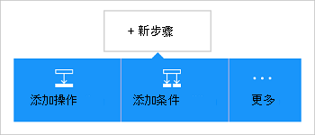

<properties
    pageTitle="逻辑应用程序中添加 Office 365 Outlook 连接器 |Microsoft Azure"
    description="创建 Office 365 连接器，以便与 Office 365 的交互逻辑的应用程序。 例如︰ 创建、 编辑和更新联系人和日历项。"
    services=""    
    documentationCenter=""     
    authors="MandiOhlinger"    
    manager="anneta"    
    editor="" 
    tags="connectors" />

<tags
ms.service="logic-apps"
ms.devlang="na"
ms.topic="article"
ms.tgt_pltfrm="na"
ms.workload="integration"
ms.date="10/18/2016"
ms.author="mandia"/>

# 开始使用 Office 365 Outlook 连接器 

Office 365 Outlook 连接器实现了与 Outlook Office 365 中的交互。 使用此接口来创建、 编辑，和更新联系人和日历项目，并还获得、 发送和回复电子邮件。

使用 Office 365 Outlook，您︰

- 生成您使用 Office 365 中的电子邮件和日历功能的工作流。 
- 使用触发器来启动工作流时新电子邮件中，当更新的日历项目，等等。
- 使用操作发送一封电子邮件，创建新日历事件，等等。 例如，当队伍 （触发器） 有一个新的对象，则可发送电子邮件到 Office 365 Outlook （操作）。 

本主题演示如何在逻辑应用程序中，将使用 Office 365 Outlook 连接器，同时列出触发器和操作。

>[AZURE.NOTE] 此版本的文章将应用于逻辑应用程序一般可用性 (GA)。

要了解更多有关逻辑应用程序，请参见[什么是逻辑应用程序](../app-service-logic/app-service-logic-what-are-logic-apps.md)并[创建一个逻辑应用程序](../app-service-logic/app-service-logic-create-a-logic-app.md)。

## 连接到 Office 365

逻辑应用程序可以访问的任何服务之前，您首先创建一个*连接*到的服务。 连接提供一个逻辑应用程序和其他服务之间的连接。 例如，若要连接到 Office 365 Outlook，首先需要一个 Office 365 的*连接*。 若要创建连接，输入通常用于访问要连接到的服务的凭据。 因此使用 Office 365 Outlook，您 Office 365 的帐户来创建连接到输入的凭据。

## 创建连接

>[AZURE.INCLUDE [Steps to create a connection to Office 365](../../includes/connectors-create-api-office365-outlook.md)]

## 使用触发器

触发器是可以用来启动工作流的逻辑应用程序中定义的事件。 触发器"轮询"服务间隔和所需的频率。 [了解更多有关触发器](../app-service-logic/app-service-logic-what-are-logic-apps.md#logic-app-concepts)的信息。

1. 在逻辑应用程序中，请键入"office 365"获取触发器的列表︰  

    

2. 选择**Office 365 Outlook-当即将举办的活动即将开始**。 如果已存在一个连接，然后从下拉列表中选择一个日历。

    

    如果提示您登录，然后输入符号来创建该连接的详细信息中。 [创建该连接](connectors-create-api-office365-outlook.md#create-the-connection)，本主题中列出的步骤。 

    > [AZURE.NOTE] 在此示例中，逻辑应用程序运行时将更新日历事件。 若要查看此触发器的结果，添加另一个向您发送一条文本消息的操作。 例如，将 Twilio*发送邮件*的操作添加该文本时在 15 分钟内启动日历事件。 

3. 选择**编辑**按钮并设置的**频率**和**时间间隔**的值。 例如，如果您想要轮询的触发器每隔 15 分钟，然后将**频率**设置为**分钟**，并将**间隔**设置为**15**。 

    

4. **保存**所做的更改 （左上的角的工具栏）。 逻辑应用程序保存，并且可能会自动被启用。

## 使用的操作

操作是由逻辑应用程序中定义的工作流执行的操作。 [了解有关操作的详细](../app-service-logic/app-service-logic-what-are-logic-apps.md#logic-app-concepts)信息。

1. 选择加号。 看了几种选择︰**将操作添加**、**添加一个条件**，或**多个**选项之一。

    

2. 选择**添加操作**。

3. 在文本框中，键入"office 365"以获取所有可用操作的列表。

     

4. 在我们的示例中，选择**Office 365 Outlook-创建联系人**。 如果已存在一个连接，然后选择**文件夹 ID**、**给定的名称**和其他属性︰  

    

    如果系统提示您输入连接信息，然后输入要创建的连接的详细信息。 本主题中[创建的连接](connectors-create-api-office365-outlook.md#create-the-connection)描述了这些属性。 

    > [AZURE.NOTE] 在此示例中，我们创建新 Office 365 Outlook 中的联系人。 从另一个触发器的输出可用于创建联系人。 例如，添加队伍*在创建对象时*触发。 然后，添加销售字段用于在 Office 365 中创建新的新联系人的 Office 365 Outlook*联系人创建*操作。 

5. **保存**所做的更改 （左上的角的工具栏）。 逻辑应用程序保存，并且可能会自动被启用。

## 技术详细信息

以下是有关触发器、 操作和支持此连接的响应的详细信息︰

## Office 365 触发器

|触发器 | 说明|
|--- | ---|
|[即将举办的活动时即将开始](connectors-create-api-office365-outlook.md#when-an-upcoming-event-is-starting-soon)|即将到来的日历事件正在启动时，此操作会触发流。|
|[新电子邮件到达时](connectors-create-api-office365-outlook.md#when-a-new-email-arrives)|新电子邮件到达时，此操作会触发流|
|[当创建新的事件](connectors-create-api-office365-outlook.md#when-a-new-event-is-created)|日历中创建一个新事件时，此操作会触发流。|
|[当修改事件](connectors-create-api-office365-outlook.md#when-an-event-is-modified)|此操作会触发流程事件修改日历中时。|

## Office 365 的操作

|操作|说明|
|--- | ---|
|[获取电子邮件](connectors-create-api-office365-outlook.md#get-emails)|此操作获取文件夹中的电子邮件。|
|[发送电子邮件](connectors-create-api-office365-outlook.md#send-an-email)|此操作将发送一封电子邮件。|
|[删除电子邮件](connectors-create-api-office365-outlook.md#delete-email)|此操作将删除电子邮件 id。|
|[标记为已读](connectors-create-api-office365-outlook.md#mark-as-read)|此操作将标记为已读的电子邮件。|
|[答复电子邮件](connectors-create-api-office365-outlook.md#reply-to-email)|此操作回复一封电子邮件。|
|[获取附件](connectors-create-api-office365-outlook.md#get-attachment)|此操作通过 id 获取电子邮件附件。|
|[发送电子邮件的选项](connectors-create-api-office365-outlook.md#send-email-with-options)|此操作将发送一封电子邮件有多个选项并且等待收件人重新使用另一种响应。|
|[发送电子邮件审批](connectors-create-api-office365-outlook.md#send-approval-email)|此操作将审批电子邮件的发送并等待来自收件人的响应。|
|[获取日历](connectors-create-api-office365-outlook.md#get-calendars)|此操作将列出可用的日历。|
|[获取事件](connectors-create-api-office365-outlook.md#get-events)|此操作获取日历中的事件。|
|[创建事件](connectors-create-api-office365-outlook.md#create-event)|此操作在日历中创建一个新事件。|
|[获取事件](connectors-create-api-office365-outlook.md#get-event)|此操作从日历中获取特定的事件。|
|[删除事件](connectors-create-api-office365-outlook.md#delete-event)|此操作将删除日历中的事件。|
|[更新事件](connectors-create-api-office365-outlook.md#update-event)|此操作会更新日历中的事件。|
|[获取联系人文件夹](connectors-create-api-office365-outlook.md#get-contact-folders)|此操作将列出可用的联系人文件夹。|
|[获取联系人](connectors-create-api-office365-outlook.md#get-contacts)|此操作从联系人文件夹中获取联系人。|
|[创建联系人](connectors-create-api-office365-outlook.md#create-contact)|此操作在联系人文件夹中创建新的联系人。|
|[获取联系人](connectors-create-api-office365-outlook.md#get-contact)|此操作从联系人文件夹中获取特定的联系人。|
|[删除联系人](connectors-create-api-office365-outlook.md#delete-contact)|此操作将删除联系人文件夹中的联系人。|
|[更新联系人](connectors-create-api-office365-outlook.md#update-contact)|此操作会更新联系人文件夹中的联系人。|

### 触发器和操作详细信息

在此部分，查看有关每个触发器和操作，包括任何必需的还是可选的输入的属性，以及任何相应的输出与连接器相关联的特定详细信息。

#### 即将举办的活动时即将开始
即将到来的日历事件正在启动时，此操作会触发流。 

|属性名称| 显示名称|说明|
| ---|---|---|
|表 *|日历的 id|日历的唯一标识符|
|lookAheadTimeInMinutes|查找预时间|要展望即将到来的事件的时间 （以分钟为单位）|

星号 （*） 表示该属性是必需的。

##### 输出详细信息
CalendarItemsList: 日历项目的列表

| 属性名称 | 数据类型 | 说明 |
|---|---|---|
|值|数组|列表中的日历项目|

#### 获取电子邮件
此操作获取文件夹中的电子邮件。 

|属性名称| 显示名称|说明|
| ---|---|---|
|采用文件夹路径|文件夹路径|要检索电子邮件的文件夹的路径 (默认: 收件箱)|
|返回页首|返回页首|要检索的电子邮件的数量 (默认值︰ 10)|
|fetchOnlyUnread|提取只未读的邮件|检索只未读电子邮件吗？|
|includeAttachments|包含附件|如果设置为 true，附件也将随电子邮件一起检索|
|searchQuery|搜索查询|搜索查询来筛选电子邮件|
|跳过|跳过|若要跳过的电子邮件的数量 (默认值︰ 0)|
|skipToken|跳过标记|跳到提取新页的标记|

星号 （*） 表示该属性是必需的。

##### 输出详细信息
ReceiveMessage︰ 接收电子邮件

| 属性名称 | 数据类型 | 说明 |
|---|---|---|
|从|字符串|从|
|自|字符串|自|
|主题|字符串|主题|
|正文|字符串|正文|
|重要性|字符串|重要性|
|HasAttachment|布尔值|有附件|
|标识|字符串|消息 Id|
|IsRead|布尔值|读取|
|DateTimeReceived|字符串|收到的日期时间|
|附件|数组|附件|
|抄送|字符串|指定由类似的分号分隔的电子邮件地址someone@contoso.com|
|密件抄送|字符串|指定由类似的分号分隔的电子邮件地址someone@contoso.com|
|IsHtml|布尔值|为 Html|

#### 发送电子邮件
此操作将发送一封电子邮件。 

|属性名称| 显示名称|说明|
| ---|---|---|
|emailMessage *|电子邮件|电子邮件|

星号 （*） 表示该属性是必需的。

##### 输出详细信息
无。

#### 删除电子邮件
此操作将删除电子邮件 id。 

|属性名称| 显示名称|说明|
| ---|---|---|
|邮件 Id *|消息 Id|若要删除该电子邮件的 id|

星号 （*） 表示该属性是必需的。

##### 输出详细信息
无。

#### 标记为已读
此操作将标记为已读的电子邮件。 

|属性名称| 显示名称|说明|
| ---|---|---|
|邮件 Id *|消息 Id|Id 的电子邮件，标记为读取|

星号 （*） 表示该属性是必需的。

##### 输出详细信息
无。

#### 答复电子邮件
此操作回复一封电子邮件。 

|属性名称| 显示名称|说明|
| ---|---|---|
|邮件 Id *|消息 Id|若要回复的电子邮件的 id|
|备注 *|注释|答复批注|
|全部答复|全部答复|答复所有收件人|

星号 （*） 表示该属性是必需的。

##### 输出详细信息
无。

#### 获取附件
此操作通过 id 获取电子邮件附件。 

|属性名称| 显示名称|说明|
| ---|---|---|
|邮件 Id *|消息 Id|电子邮件 id|
|attachmentId *|附件 Id|若要下载该附件的 id|

星号 （*） 表示该属性是必需的。

##### 输出详细信息
无。

#### 新电子邮件到达时
新电子邮件到达时，此操作会触发流。

|属性名称| 显示名称|说明|
| ---|---|---|
|采用文件夹路径|文件夹路径|要检索的电子邮件文件夹 (默认︰ 收件箱)|
|自|自|收件人电子邮件地址|
|从|从|发件人地址|
|重要性|重要性|（高、 普通、 低） 的电子邮件的重要性 (默认︰ 正常)|
|fetchOnlyWithAttachment|带有附件|检索只带有附件的电子邮件|
|includeAttachments|包含附件|包含附件|
|subjectFilter|主题筛选器|要在主题中查找字符串|

星号 （*） 表示该属性是必需的。

##### 输出详细信息
TriggerBatchResponse [ReceiveMessage]

| 属性名称 | 数据类型 |
|---|---|
|值|数组|

#### 发送电子邮件的选项
此操作将发送一封电子邮件有多个选项并且等待收件人重新使用另一种响应。 

|属性名称| 显示名称|说明|
| ---|---|---|
|optionsEmailSubscription *|订阅请求电子邮件选项|订阅请求电子邮件选项|

星号 （*） 表示该属性是必需的。

##### 输出详细信息
审批电子邮件订阅的 SubscriptionResponse︰ 模型

| 属性名称 | 数据类型 | 说明 |
|---|---|---|
|标识|字符串|订阅 id|
|资源|字符串|订阅请求的资源|
|notificationType|字符串|通知类型|
|notificationUrl|字符串|通知 Url|

#### 发送电子邮件审批
此操作将审批电子邮件的发送并等待来自收件人的响应。 

|属性名称| 显示名称|说明|
| ---|---|---|
|approvalEmailSubscription *|审批电子邮件订阅请求|审批电子邮件订阅请求|

星号 （*） 表示该属性是必需的。

##### 输出详细信息
审批电子邮件订阅的 SubscriptionResponse︰ 模型

| 属性名称 | 数据类型 | 说明 |
|---|---|---|
|标识|字符串|订阅 id|
|资源|字符串|订阅请求的资源|
|notificationType|字符串|通知类型|
|notificationUrl|字符串|通知 Url|

#### 获取日历
此操作将列出可用的日历。 

没有此调用的参数。

##### 输出详细信息
TablesList

| 属性名称 | 数据类型 |
|---|---|
|值|数组|

#### 获取事件
此操作获取日历中的事件。 

|属性名称| 显示名称|说明|
| ---|---|---|
|表 *|日历的 id|选择日历|
|$filter|筛选器查询|ODATA 筛选查询来限制返回的项|
|$orderby|排序依据|指定项的顺序的 ODATA orderBy 查询|
|$skip|跳过计数|若要跳过的条目数 (默认值 = 0)|
|$top|获取最大计数|要检索的项的最大数量 (默认值 = 256)|

星号 （*） 表示该属性是必需的。

##### 输出详细信息
CalendarEventList: 日历项目的列表

| 属性名称 | 数据类型 | 说明 |
|---|---|---|
|值|数组|列表中的日历项目|

#### 创建事件
此操作在日历中创建一个新事件。 

|属性名称| 显示名称|说明|
| ---|---|---|
|表 *|日历的 id|选择日历|
|项 *|项目|若要创建的事件|

星号 （*） 表示该属性是必需的。

##### 输出详细信息
CalendarEvent︰ 连接器特定的日历事件的模型类。

| 属性名称 | 数据类型 | 说明 |
|---|---|---|
|标识|字符串|该事件的唯一标识符。|
|与会者|数组|此事件的与会者列表。|
|正文|未定义|与该事件相关联的消息正文。|
|BodyPreview|字符串|与该事件相关联的消息预览。|
|类别|数组|与该事件关联的类别。|
|更改密钥|字符串|标识事件对象的版本。 每次更改事件时，那么也将更改。|
|DateTimeCreated|字符串|日期和事件的创建时间。|
|DateTimeLastModified|字符串|日期和上次修改该事件的时间。|
|结束|字符串|事件的结束时间。|
|EndTimeZone|字符串|指定时区的会议的结束时间。 此值必须是 Windows 中的定义 (示例: 太平洋标准时间)。|
|HasAttachments|布尔值|设置为 true，如果该事件包含附件。|
|重要性|字符串|该事件的重要性︰ 低、 普通或高。|
|IsAllDay|布尔值|设置为 true，如果事件持续一整天。|
|IsCancelled|布尔值|设置为 true，如果该事件已被取消。|
|IsOrganizer|布尔值|如果，设置为 true 的消息发件人也是组织者。|
|位置|未定义|事件的位置。|
|组织者|未定义|该事件的组织者。|
|重复周期|未定义|事件的定期模式。|
|提醒|整数|时间以提醒事件开始之前的分钟数。|
|ResponseRequested|布尔值|设置为 true，如果发件人希望接到响应事件被接受或拒绝时。|
|ResponseStatus|未定义|指示在响应事件消息中发送的响应的类型。|
|SeriesMasterId|字符串|系列主事件类型的唯一标识符。|
|ShowAs|字符串|显示为忙或闲时。|
|启动|字符串|事件的开始时间。|
|StartTimeZone|字符串|指定区域会议的开始时间的时间。 此值必须是 Windows 中的定义 (示例:"太平洋标准时间")。|
|主题|字符串|事件的主题。|
|类型|字符串|事件类型︰ 单实例、 事件、 异常或系列主。|
|网页链接|字符串|与该事件相关联的消息预览。|

#### 获取事件
此操作从日历中获取特定的事件。 

|属性名称| 显示名称|说明|
| ---|---|---|
|表 *|日历的 id|选择日历|
|id *|项 id|选择一个事件|

星号 （*） 表示该属性是必需的。

##### 输出详细信息
CalendarEvent︰ 连接器特定的日历事件的模型类。

| 属性名称 | 数据类型 | 说明 |
|---|---|---|
|标识|字符串|该事件的唯一标识符。|
|与会者|数组|此事件的与会者列表。|
|正文|未定义|与该事件相关联的消息正文。|
|BodyPreview|字符串|与该事件相关联的消息预览。|
|类别|数组|与该事件关联的类别。|
|更改密钥|字符串|标识事件对象的版本。 每次更改事件时，那么也将更改。|
|DateTimeCreated|字符串|日期和事件的创建时间。|
|DateTimeLastModified|字符串|日期和上次修改该事件的时间。|
|结束|字符串|事件的结束时间。|
|EndTimeZone|字符串|指定时区的会议的结束时间。 此值必须是 Windows 中的定义 (示例: 太平洋标准时间)。|
|HasAttachments|布尔值|设置为 true，如果该事件包含附件。|
|重要性|字符串|该事件的重要性︰ 低、 普通或高。|
|IsAllDay|布尔值|设置为 true，如果事件持续一整天。|
|IsCancelled|布尔值|设置为 true，如果该事件已被取消。|
|IsOrganizer|布尔值|如果，设置为 true 的消息发件人也是组织者。|
|位置|未定义|事件的位置。|
|组织者|未定义|该事件的组织者。|
|重复周期|未定义|事件的定期模式。|
|提醒|整数|时间以提醒事件开始之前的分钟数。|
|ResponseRequested|布尔值|设置为 true，如果发件人希望接到响应事件被接受或拒绝时。|
|ResponseStatus|未定义|指示在响应事件消息中发送的响应的类型。|
|SeriesMasterId|字符串|系列主事件类型的唯一标识符。|
|ShowAs|字符串|显示为忙或闲时。|
|启动|字符串|事件的开始时间。|
|StartTimeZone|字符串|指定区域会议的开始时间的时间。 此值必须是 Windows 中的定义 (示例:"太平洋标准时间")。|
|主题|字符串|事件的主题。|
|类型|字符串|事件类型︰ 单实例、 事件、 异常或系列主。|
|网页链接|字符串|与该事件相关联的消息预览。|

#### 删除事件
此操作将删除日历中的事件。 

|属性名称| 显示名称|说明|
| ---|---|---|
|表 *|日历的 id|选择日历|
|id *|标识|选择一个事件|

星号 （*） 表示该属性是必需的。

##### 输出详细信息
无。

#### 更新事件
此操作会更新日历中的事件。 

|属性名称| 显示名称|说明|
| ---|---|---|
|表 *|日历的 id|选择日历|
|id *|标识|选择一个事件|
|项 *|项目|事件以更新|

星号 （*） 表示该属性是必需的。

##### 输出详细信息
CalendarEvent︰ 连接器特定的日历事件的模型类。

| 属性名称 | 数据类型 | 说明 |
|---|---|---|
|标识|字符串|该事件的唯一标识符。|
|与会者|数组|此事件的与会者列表。|
|正文|未定义|与该事件相关联的消息正文。|
|BodyPreview|字符串|与该事件相关联的消息预览。|
|类别|数组|与该事件关联的类别。|
|更改密钥|字符串|标识事件对象的版本。 每次更改事件时，那么也将更改。|
|DateTimeCreated|字符串|日期和事件的创建时间。|
|DateTimeLastModified|字符串|日期和上次修改该事件的时间。|
|结束|字符串|事件的结束时间。|
|EndTimeZone|字符串|指定时区的会议的结束时间。 此值必须是 Windows 中的定义 (示例: 太平洋标准时间)。|
|HasAttachments|布尔值|设置为 true，如果该事件包含附件。|
|重要性|字符串|该事件的重要性︰ 低、 普通或高。|
|IsAllDay|布尔值|设置为 true，如果事件持续一整天。|
|IsCancelled|布尔值|设置为 true，如果该事件已被取消。|
|IsOrganizer|布尔值|如果，设置为 true 的消息发件人也是组织者。|
|位置|未定义|事件的位置。|
|组织者|未定义|该事件的组织者。|
|重复周期|未定义|事件的定期模式。|
|提醒|整数|时间以提醒事件开始之前的分钟数。|
|ResponseRequested|布尔值|设置为 true，如果发件人希望接到响应事件被接受或拒绝时。|
|ResponseStatus|未定义|指示在响应事件消息中发送的响应的类型。|
|SeriesMasterId|字符串|系列主事件类型的唯一标识符。|
|ShowAs|字符串|显示为忙或闲时。|
|启动|字符串|事件的开始时间。|
|StartTimeZone|字符串|指定区域会议的开始时间的时间。 此值必须是 Windows 中的定义 (示例:"太平洋标准时间")。|
|主题|字符串|事件的主题。|
|类型|字符串|事件类型︰ 单实例、 事件、 异常或系列主。|
|网页链接|字符串|与该事件相关联的消息预览。|

#### 当创建新的事件
日历中创建一个新事件时，此操作会触发流。 

|属性名称| 显示名称|说明|
| ---|---|---|
|表 *|日历的 id|选择日历|
|$filter|筛选器查询|ODATA 筛选查询来限制返回的项|
|$orderby|排序依据|指定项的顺序的 ODATA orderBy 查询|
|$skip|跳过计数|若要跳过的条目数 (默认值 = 0)|
|$top|获取最大计数|要检索的项的最大数量 (默认值 = 256)|

星号 （*） 表示该属性是必需的。

##### 输出详细信息
CalendarItemsList: 日历项目的列表

| 属性名称 | 数据类型 | 说明 |
|---|---|---|
|值|数组|列表中的日历项目|

#### 当修改事件
此操作会触发流程事件修改日历中时。 

|属性名称| 显示名称|说明|
| ---|---|---|
|表 *|日历的 id|选择日历|
|$filter|筛选器查询|ODATA 筛选查询来限制返回的项|
|$orderby|排序依据|指定项的顺序的 ODATA orderBy 查询|
|$skip|跳过计数|若要跳过的条目数 (默认值 = 0)|
|$top|获取最大计数|要检索的项的最大数量 (默认值 = 256)|

星号 （*） 表示该属性是必需的。

##### 输出详细信息
CalendarItemsList: 日历项目的列表

| 属性名称 | 数据类型 | 说明 |
|---|---|---|
|值|数组|列表中的日历项目|

#### 获取联系人文件夹
此操作将列出可用的联系人文件夹。 

没有此调用的参数。

##### 输出详细信息
TablesList

| 属性名称 | 数据类型 |
|---|---|
|值|数组|

#### 获取联系人
此操作从联系人文件夹中获取联系人。 

|属性名称| 显示名称|说明|
| ---|---|---|
|表 *|文件夹 id|要检索的联系人文件夹的唯一标识符|
|$filter|筛选器查询|ODATA 筛选查询来限制返回的项|
|$orderby|排序依据|指定项的顺序的 ODATA orderBy 查询|
|$skip|跳过计数|若要跳过的条目数 (默认值 = 0)|
|$top|获取最大计数|要检索的项的最大数量 (默认值 = 256)|

星号 （*） 表示该属性是必需的。

##### 输出详细信息
ContactList︰ 联系人列表

| 属性名称 | 数据类型 | 说明 |
|---|---|---|
|值|数组|联系人列表|

#### 创建联系人
此操作在联系人文件夹中创建新的联系人。 

|属性名称| 显示名称|说明|
| ---|---|---|
|表 *|文件夹 id|选择联系人文件夹|
|项 *|项目|若要创建的联系人|

星号 （*） 表示该属性是必需的。

##### 输出详细信息
联系人︰ 联系人

| 属性名称 | 数据类型 | 说明 |
|---|---|---|
|标识|字符串|联系人的唯一标识符。|
|ParentFolderId|字符串|联系人的父文件夹的 ID|
|生日|字符串|联系人的生日。|
|表示为|字符串|该联系人的名称存档。|
|显示名称|字符串|联系人的显示名称。|
|GivenName|字符串|联系人的名字。|
|首字母缩写|字符串|联系人的姓名首字母缩写。|
|称谓|字符串|联系人的中间名。|
|昵称|字符串|联系人的昵称。|
|姓氏|字符串|联系人的姓氏。|
|标题|字符串|联系人的标题。|
|生成|字符串|联系人的生成。|
|EmailAddresses|数组|联系人的电子邮件地址。|
|ImAddresses|数组|联系人的即时消息 (IM) 地址。|
|职务|字符串|联系人的职务。|
|公司名称|字符串|联系人的公司名称。|
|部门|字符串|联系人的部门。|
|办公室|字符串|联系人的办公室位置。|
|职业|字符串|联系人的职业。|
|BusinessHomePage|字符串|联系人的业务主页。|
|AssistantName|字符串|联系人助理的名称。|
|管理器|字符串|联系人的经理的姓名。|
|HomePhones|数组|联系人的家庭电话号码。|
|BusinessPhones|数组|该联系人业务电话号码|
|MobilePhone1|字符串|联系人的移动电话号码。|
|家庭地址|未定义|联系人的住宅地址。|
|BusinessAddress|未定义|联系人的公司地址。|
|OtherAddress|未定义|联系人的其他地址。|
|YomiCompanyName|字符串|拼音的日本公司的联系人名称。|
|YomiGivenName|字符串|拼音日文名字 （名字） 的联系人。|
|YomiSurname|字符串|拼音日语 surname （姓氏） 的联系人|
|类别|数组|与联系人关联的类别。|
|更改密钥|字符串|标识事件对象的版本|
|DateTimeCreated|字符串|创建联系人的时间。|
|DateTimeLastModified|字符串|该联系人已修改的时间。|

#### 获取联系人
此操作从联系人文件夹中获取特定的联系人。 

|属性名称| 显示名称|说明|
| ---|---|---|
|表 *|文件夹 id|选择联系人文件夹|
|id *|项 id|要检索的联系人的唯一标识符|

星号 （*） 表示该属性是必需的。

##### 输出详细信息
联系人︰ 联系人

| 属性名称 | 数据类型 | 说明 |
|---|---|---|
|标识|字符串|联系人的唯一标识符。|
|ParentFolderId|字符串|联系人的父文件夹的 ID|
|生日|字符串|联系人的生日。|
|表示为|字符串|该联系人的名称存档。|
|显示名称|字符串|联系人的显示名称。|
|GivenName|字符串|联系人的名字。|
|首字母缩写|字符串|联系人的姓名首字母缩写。|
|称谓|字符串|联系人的中间名。|
|昵称|字符串|联系人的昵称。|
|姓氏|字符串|联系人的姓氏。|
|标题|字符串|联系人的标题。|
|生成|字符串|联系人的生成。|
|EmailAddresses|数组|联系人的电子邮件地址。|
|ImAddresses|数组|联系人的即时消息 (IM) 地址。|
|职务|字符串|联系人的职务。|
|公司名称|字符串|联系人的公司名称。|
|部门|字符串|联系人的部门。|
|办公室|字符串|联系人的办公室位置。|
|职业|字符串|联系人的职业。|
|BusinessHomePage|字符串|联系人的业务主页。|
|AssistantName|字符串|联系人助理的名称。|
|管理器|字符串|联系人的经理的姓名。|
|HomePhones|数组|联系人的家庭电话号码。|
|BusinessPhones|数组|该联系人业务电话号码|
|MobilePhone1|字符串|联系人的移动电话号码。|
|家庭地址|未定义|联系人的住宅地址。|
|BusinessAddress|未定义|联系人的公司地址。|
|OtherAddress|未定义|联系人的其他地址。|
|YomiCompanyName|字符串|拼音的日本公司的联系人名称。|
|YomiGivenName|字符串|拼音日文名字 （名字） 的联系人。|
|YomiSurname|字符串|拼音日语 surname （姓氏） 的联系人|
|类别|数组|与联系人关联的类别。|
|更改密钥|字符串|标识事件对象的版本|
|DateTimeCreated|字符串|创建联系人的时间。|
|DateTimeLastModified|字符串|该联系人已修改的时间。|

#### 删除联系人
此操作将删除联系人文件夹中的联系人。 

|属性名称| 显示名称|说明|
| ---|---|---|
|表 *|文件夹 id|选择联系人文件夹|
|id *|标识|若要删除的联系人的唯一标识符|

星号 （*） 表示该属性是必需的。

##### 输出详细信息
无。

#### 更新联系人
此操作会更新联系人文件夹中的联系人。 

|属性名称| 显示名称|说明|
| ---|---|---|
|表 *|文件夹 id|选择联系人文件夹|
|id *|标识|若要更新的联系人的唯一标识符|
|项 *|项目|要更新的联系人项|

星号 （*） 表示该属性是必需的。

##### 输出详细信息
联系人︰ 联系人

| 属性名称 | 数据类型 | 说明 |
|---|---|---|
|标识|字符串|联系人的唯一标识符。|
|ParentFolderId|字符串|联系人的父文件夹的 ID|
|生日|字符串|联系人的生日。|
|表示为|字符串|该联系人的名称存档。|
|显示名称|字符串|联系人的显示名称。|
|GivenName|字符串|联系人的名字。|
|首字母缩写|字符串|联系人的姓名首字母缩写。|
|称谓|字符串|联系人的中间名。|
|昵称|字符串|联系人的昵称。|
|姓氏|字符串|联系人的姓氏。|
|标题|字符串|联系人的标题。|
|生成|字符串|联系人的生成。|
|EmailAddresses|数组|联系人的电子邮件地址。|
|ImAddresses|数组|联系人的即时消息 (IM) 地址。|
|职务|字符串|联系人的职务。|
|公司名称|字符串|联系人的公司名称。|
|部门|字符串|联系人的部门。|
|办公室|字符串|联系人的办公室位置。|
|职业|字符串|联系人的职业。|
|BusinessHomePage|字符串|联系人的业务主页。|
|AssistantName|字符串|联系人助理的名称。|
|管理器|字符串|联系人的经理的姓名。|
|HomePhones|数组|联系人的家庭电话号码。|
|BusinessPhones|数组|该联系人业务电话号码|
|MobilePhone1|字符串|联系人的移动电话号码。|
|家庭地址|未定义|联系人的住宅地址。|
|BusinessAddress|未定义|联系人的公司地址。|
|OtherAddress|未定义|联系人的其他地址。|
|YomiCompanyName|字符串|拼音的日本公司的联系人名称。|
|YomiGivenName|字符串|拼音日文名字 （名字） 的联系人。|
|YomiSurname|字符串|拼音日语 surname （姓氏） 的联系人|
|类别|数组|与联系人关联的类别。|
|更改密钥|字符串|标识事件对象的版本|
|DateTimeCreated|字符串|创建联系人的时间。|
|DateTimeLastModified|字符串|该联系人已修改的时间。|

## HTTP 响应

操作和上面的触发器可以返回一个或多个以下 HTTP 状态代码︰ 

|名称|说明|
|---|---|
|200|还行|
|202|接受|
|400|错误的请求|
|401|未经授权|
|403|禁止访问|
|404|找不到|
|500|内部服务器错误。 出现未知的错误|
|默认|操作失败。|

## 下一步行动

[创建一个逻辑应用程序](../app-service-logic/app-service-logic-create-a-logic-app.md)。 浏览其他可用的连接器，在我们的[Api 列表](apis-list.md)的逻辑应用程序中。