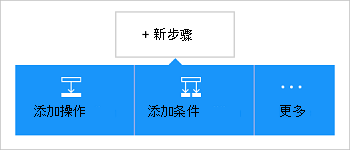
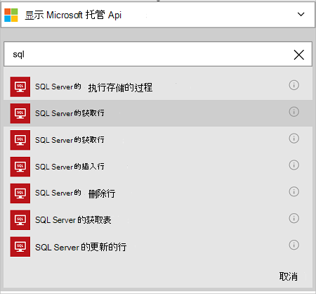
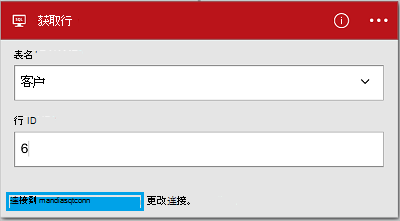

<properties
    pageTitle="逻辑应用程序中添加 SQL Azure 数据库连接器 |Microsoft Azure"
    description="使用 REST API 的参数的 SQL Azure 数据库连接器的概述"
    services=""
    documentationCenter="" 
    authors="MandiOhlinger"
    manager="anneta"
    editor=""
    tags="connectors"/>

<tags
   ms.service="logic-apps"
   ms.devlang="na"
   ms.topic="article"
   ms.tgt_pltfrm="na"
   ms.workload="na" 
   ms.date="10/18/2016"
   ms.author="mandia"/>

# 开始使用 SQL Azure 数据库连接器
使用 SQL Azure 数据库连接器，创建您的组织的工作流来管理表中的数据。 

SQL 数据库中，则︰

- 通过新客户添加到客户数据库，或更新订单数据库中的顺序生成工作流。
- 使用动作数据行，插入一个新行，而且甚至删除。 例如，当 Dynamics CRM Online （触发器） 在创建记录时，然后插入一行在 SQL Azure 数据库 （操作）。 

本主题演示如何在逻辑应用程序中，使用 SQL 数据库连接器，并还列出的操作。

>[AZURE.NOTE] 此版本的文章将应用于逻辑应用程序一般可用性 (GA)。 

要了解更多有关逻辑应用程序，请参见[什么是逻辑应用程序](../app-service-logic/app-service-logic-what-are-logic-apps.md)并[创建一个逻辑应用程序](../app-service-logic/app-service-logic-create-a-logic-app.md)。

## 连接到 SQL Azure 数据库

逻辑应用程序可以访问的任何服务之前，您首先创建一个*连接*到的服务。 连接提供一个逻辑应用程序和其他服务之间的连接。 例如，连接到 SQL 数据库，您首先创建一个 SQL 数据库的*连接*。 若要创建连接，请输入通常用于访问要连接到此服务的凭据。 因此，在 SQL 数据库中输入您的 SQL 数据库凭据以创建连接。 

#### 创建连接

>[AZURE.INCLUDE [Create the connection to SQL Azure](../../includes/connectors-create-api-sqlazure.md)]

## 使用触发器

此接口不具有任何触发器。 使用其他触发器来启动逻辑的应用程序，如定期触发器、 HTTP Webhook 触发器，触发器可用于其他连接器，和更多。 [创建一个逻辑应用程序](../app-service-logic/app-service-logic-create-a-logic-app.md)提供了一个示例。

## 使用的操作
    
操作是由逻辑应用程序中定义的工作流执行的操作。 [了解有关操作的详细](../app-service-logic/app-service-logic-what-are-logic-apps.md#logic-app-concepts)信息。

1. 选择加号。 看了几种选择︰**将操作添加**、**添加一个条件**，或**多个**选项之一。

    

2. 选择**添加操作**。

3. 在文本框中，键入"sql"来获取所有可用操作的列表。

     

4. 在我们的示例中，选择**SQL Server-获取行**。 如果连接已存在，然后从下拉列表中，选择**表名称**，并输入您想要返回的**行 ID** 。

    

    如果系统提示您输入连接信息，然后输入要创建的连接的详细信息。 本主题中[创建的连接](connectors-create-api-sqlazure.md#create-the-connection)描述了这些属性。 

    > [AZURE.NOTE] 在此示例中，我们可以从表返回行。 若要查看该行中的数据，添加另一个使用表中的字段创建文件的操作。 例如，添加 OneDrive 操作所使用的名字字段和姓氏字段中的云存储帐户创建一个新文件。 

5. **保存**所做的更改 （左上的角的工具栏）。 逻辑应用程序保存，并且可能会自动被启用。

## 技术详细信息

## SQL 数据库操作
操作是由逻辑应用程序中定义的工作流执行的操作。 SQL 数据库连接器包括以下操作。 

|操作|说明|
|--- | ---|
|[ExecuteProcedure](connectors-create-api-sqlazure.md#execute-stored-procedure)|在 SQL 中执行存储的过程|
|[GetRow](connectors-create-api-sqlazure.md#get-row)|从 SQL 表中检索单个行|
|[GetRows](connectors-create-api-sqlazure.md#get-rows)|从 SQL 表中检索行|
|[InsertRow](connectors-create-api-sqlazure.md#insert-row)|SQL 表中插入新行|
|[DeleteRow](connectors-create-api-sqlazure.md#delete-row)|从 SQL 表中删除行|
|[GetTables](connectors-create-api-sqlazure.md#get-tables)|从 SQL 数据库检索表|
|[UpdateRow](connectors-create-api-sqlazure.md#update-row)|更新现有 SQL 表中的行|

### 操作详细信息

在此部分，查看有关每个操作，包括任何必需的还是可选的输入的属性，以及任何相应的输出与连接器相关联的特定详细信息。

#### 执行存储的过程
在 SQL 中执行存储的过程。  

| 属性名称| 显示名称 |说明|
| ---|---|---|
|过程 * | 过程名称 | 要执行的存储过程的名称 |
|参数 * | 输入的参数 | 参数是动态的根据您选择的存储过程。    例如，如果您使用的艾德示例数据库，选择*ufnGetCustomerInformation*存储过程。 将显示**客户 ID**的输入的参数。 输入"6"或其他客户 Id 之一。 |

星号 （*） 表示该属性是必需的。

##### 输出详细信息
ProcedureResult︰ 执行存储的过程的执行的结果

| 属性名称 | 数据类型 | 说明 |
|---|---|---|
|输出参数|对象|输出参数值 |
|ReturnCode|整数|过程的返回代码 |
|结果集|对象| 结果集|

#### 获取行 
从 SQL 表中检索单个行。  

| 属性名称| 显示名称 |说明|
| ---|---|---|
|表 * | 表名 |SQL 表的名称|
|id * | 行 id |要检索的行的唯一标识符|

星号 （*） 表示该属性是必需的。

##### 输出详细信息
项目

| 属性名称 | 数据类型 |
|---|---|
|ItemInternalId|字符串|

#### 获取行 
从 SQL 表中检索行。  

|属性名称| 显示名称|说明|
| ---|---|---|
|表 *|表名|SQL 表的名称|
|$skip|跳过计数|若要跳过的条目数 (默认值 = 0)|
|$top|获取最大计数|要检索的项的最大数量 (默认值 = 256)|
|$filter|筛选器查询|ODATA 筛选查询以限制的条目数|
|$orderby|排序依据|指定项的顺序的 ODATA orderBy 查询|

星号 （*） 表示该属性是必需的。

##### 输出详细信息
ItemsList

| 属性名称 | 数据类型 |
|---|---|
|值|数组|

#### 插入行 
SQL 表中插入一个新行。  

|属性名称| 显示名称|说明|
| ---|---|---|
|表 *|表名|SQL 表的名称|
|项 *|一行|要在 SQL 中的指定表中插入行|

星号 （*） 表示该属性是必需的。

##### 输出详细信息
项目

| 属性名称 | 数据类型 |
|---|---|
|ItemInternalId|字符串|

#### 删除行 
从 SQL 表中删除行。  

|属性名称| 显示名称|说明|
| ---|---|---|
|表 *|表名|SQL 表的名称|
|id *|行 id|要删除的行的唯一标识符|

星号 （*） 表示该属性是必需的。

##### 输出详细信息
无。

#### 获取表 
从 SQL 数据库检索表。  

没有此调用的参数。 

##### 输出详细信息 
TablesList

| 属性名称 | 数据类型 |
|---|---|
|值|数组|

#### 更新行 
更新现有 SQL 表中的行。  

|属性名称| 显示名称|说明|
| ---|---|---|
|表 *|表名|SQL 表的名称|
|id *|行 id|要更新的行的唯一标识符|
|项 *|一行|更新后的值的行|

星号 （*） 表示该属性是必需的。

##### 输出详细信息  
项目

| 属性名称 | 数据类型 |
|---|---|
|ItemInternalId|字符串|

### HTTP 响应

当调用不同的操作，您可能会收到的特定响应。 下表概述了响应和它们的说明︰  

|名称|说明|
|---|---|
|200|还行|
|202|接受|
|400|错误的请求|
|401|未经授权|
|403|禁止访问|
|404|找不到|
|500|内部服务器错误。 出现未知的错误|
|默认|操作失败。|

## 下一步行动

[创建一个逻辑应用程序](../app-service-logic/app-service-logic-create-a-logic-app.md)。 浏览其他可用的连接器，在我们的[Api 列表](apis-list.md)的逻辑应用程序中。
