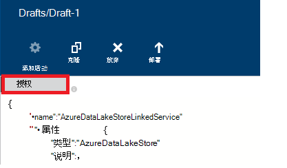

<properties
    pageTitle="将数据移动到/从 Azure 数据湖商店 |Azure 数据工厂"
    description="了解如何将数据移到从 Azure 数据湖存储区使用 Azure 数据工厂"
    services="data-factory"
    documentationCenter=""
    authors="linda33wj"
    manager="jhubbard"
    editor="monicar"/>

<tags
    ms.service="data-factory"
    ms.workload="data-services"
    ms.tgt_pltfrm="na"
    ms.devlang="na"
    ms.topic="article"
    ms.date="09/27/2016"
    ms.author="jingwang"/>

# Azure 数据湖存储区使用 Azure 数据工厂之间转移数据
这篇文章概括介绍了如何使用复制活动在 Azure 数据工厂从到 Azure 数据湖存储移动数据，对其他数据存储区。 本文基于[数据移动活动](data-factory-data-movement-activities.md)文章，概要介绍了数据移动提供复制活动和支持的数据存储区的组合。

> [AZURE.NOTE]
> 要将数据移动到从 Azure 数据湖商店的复制活动与创建管道之前创建 Azure 数据湖存储帐户。 要了解 Azure 数据湖存储区，请参阅[入门 Azure 数据湖商店](../data-lake-store/data-lake-store-get-started-portal.md)。
>  
> 查看[生成您第一个管道教程](data-factory-build-your-first-pipeline.md)详细步骤来创建数据工厂，链接的服务、 数据集和管线。 使用 JSON 段与数据工厂编辑器或 Visual Studio Azure PowerShell 创建数据工厂元。

## 复制数据向导
创建管线将复制到从 Azure 数据湖存储的数据的最简便方法是使用复制数据向导。 请参阅[教程︰ 创建管线使用复制向导](data-factory-copy-data-wizard-tutorial.md)上创建管道使用复制数据向导快速演练。 

下面的示例提供了示例 JSON 定义可用于通过使用[Azure 门户](data-factory-copy-activity-tutorial-using-azure-portal.md)或[Visual Studio](data-factory-copy-activity-tutorial-using-visual-studio.md)或[Azure PowerShell](data-factory-copy-activity-tutorial-using-powershell.md)创建管线。 它们说明了 Azure 数据湖商店和 Azure Blob 存储之间复制数据。 但是，数据可以复制**直接**从任何源对任何接收器规定[此处](data-factory-data-movement-activities.md#supported-data-stores)在 Azure 数据工厂中使用复制活动。  

## 示例︰ 将数据从 Azure Blob 复制到 Azure 数据湖存储区
下面的示例演示︰

1.  链接的类型[AzureStorage](#azure-storage-linked-service-properties)的服务。
2.  链接的类型[AzureDataLakeStore](#azure-data-lake-linked-service-properties)的服务。
3.  [AzureBlob](#azure-blob-dataset-type-properties)类型的输入的[数据集](data-factory-create-datasets.md)。
4.  类型[AzureDataLakeStore](#azure-data-lake-dataset-type-properties)的输出[数据集](data-factory-create-datasets.md)。
4.  使用[BlobSource](#azure-blob-copy-activity-type-properties)和[AzureDataLakeStoreSink](#azure-data-lake-copy-activity-type-properties)的复制活动的[管道](data-factory-create-pipelines.md)。

示例将时间序列数据从 Azure Blob 存储到 Azure 数据湖商店每隔一小时。 在这些示例中使用的 JSON 属性详见以下示例部分。

**Azure 存储链接的服务︰**

    {
      "name": "StorageLinkedService",
      "properties": {
        "type": "AzureStorage",
        "typeProperties": {
          "connectionString": "DefaultEndpointsProtocol=https;AccountName=<accountname>;AccountKey=<accountkey>"
        }
      }
    }

**Azure 数据湖链接的服务︰**

    {
        "name": "AzureDataLakeStoreLinkedService",
        "properties": {
            "type": "AzureDataLakeStore",
            "typeProperties": {
                "dataLakeStoreUri": "https://<accountname>.azuredatalakestore.net/webhdfs/v1",
                "sessionId": "<session ID>",
                "authorization": "<authorization URL>"
            }
        }
    }

### 若要创建使用数据工厂编辑器的 Azure 数据湖链接服务
下面的过程提供创建使用数据工厂编辑器 Azure 数据湖存储链接服务的步骤。

1. 单击命令栏上的**新数据存储**，并选择**Azure 数据湖存储**。
2. 在 JSON 编辑器中，为**dataLakeStoreUri**属性中，输入数据湖 URI。
3. 单击命令栏上的**授权**按钮。 您应该看到一个弹出窗口。

    

4. 使用您的凭据才能登录和**授权**属性在 JSON 中的应分配给一个值现在。
5. （可选）在 JSON 中指定可选的参数，如**帐户名**、 **subscriptionID**和**resourceGroupName**的值 （或者） 从 JSON 中删除这些属性。
6. 若要将链接的服务部署的命令栏上，单击**部署**。

> [AZURE.IMPORTANT] 一段时间后过期使用**授权**按钮生成的授权码。 使用**授权****台上**按钮时**令牌到期**并重新链接的服务部署。 有关详细信息请参阅[Azure 数据湖存储链接服务](#azure-data-lake-store-linked-service-properties)部分。 

**Azure Blob 输入数据集︰**

数据挑选新的斑点从每小时 (频率︰ 小时、 间隔︰ 1)。 Blob 的文件夹路径和文件名称动态地计算基于切片所处理的开始时间。 文件夹路径使用的年、 月和日部分的开始时间和文件的名称使用的小时部分的开始时间。 "外部":"真正的"设置通知数据工厂服务表外部数据工厂并不由数据工厂中的活动。

    {
      "name": "AzureBlobInput",
      "properties": {
        "type": "AzureBlob",
        "linkedServiceName": "StorageLinkedService",
        "typeProperties": {
          "folderPath": "mycontainer/myfolder/yearno={Year}/monthno={Month}/dayno={Day}",
          "partitionedBy": [
            {
              "name": "Year",
              "value": {
                "type": "DateTime",
                "date": "SliceStart",
                "format": "yyyy"
              }
            },
            {
              "name": "Month",
              "value": {
                "type": "DateTime",
                "date": "SliceStart",
                "format": "MM"
              }
            },
            {
              "name": "Day",
              "value": {
                "type": "DateTime",
                "date": "SliceStart",
                "format": "dd"
              }
            },
            {
              "name": "Hour",
              "value": {
                "type": "DateTime",
                "date": "SliceStart",
                "format": "HH"
              }
            }
          ]
        },
        "external": true,
        "availability": {
          "frequency": "Hour",
          "interval": 1
        },
        "policy": {
          "externalData": {
            "retryInterval": "00:01:00",
            "retryTimeout": "00:10:00",
            "maximumRetry": 3
          }
        }
      }
    }

**Azure 数据湖输出数据集︰**

该示例将数据复制到 Azure 数据湖商店。 新数据将复制到数据湖存储每隔一小时。

    {
        "name": "AzureDataLakeStoreOutput",
        "properties": {
            "type": "AzureDataLakeStore",
            "linkedServiceName": "AzureDataLakeStoreLinkedService",
            "typeProperties": {
                "folderPath": "datalake/output/"
            },
            "availability": {
                "frequency": "Hour",
                "interval": 1
            }
        }
    }

**管线与复制活动︰**

管线包含被配置为使用的输入和输出的数据集，并计划每小时运行一次的复制活动。 在管线 JSON 定义中，将**源**类型设置为**BlobSource** ，**接收器**类型设置为**AzureDataLakeStoreSink**。

    {  
        "name":"SamplePipeline",
        "properties":
        {  
            "start":"2014-06-01T18:00:00",
            "end":"2014-06-01T19:00:00",
            "description":"pipeline with copy activity",
            "activities":
            [  
                {
                    "name": "AzureBlobtoDataLake",
                    "description": "Copy Activity",
                    "type": "Copy",
                    "inputs": [
                    {
                        "name": "AzureBlobInput"
                    }
                    ],
                    "outputs": [
                    {
                        "name": "AzureDataLakeStoreOutput"
                    }
                    ],
                    "typeProperties": {
                        "source": {
                            "type": "BlobSource",
                            "treatEmptyAsNull": true,
                            "blobColumnSeparators": ","
                        },
                        "sink": {
                            "type": "AzureDataLakeStoreSink"
                        }
                    },
                    "scheduler": {
                        "frequency": "Hour",
                        "interval": 1
                    },
                    "policy": {
                        "concurrency": 1,
                        "executionPriorityOrder": "OldestFirst",
                        "retry": 0,
                        "timeout": "01:00:00"
                    }
                }
            ]
        }
    }

## 示例︰ 将数据从 Azure 数据湖存储区复制到 Azure Blob
下面的示例演示︰

1.  链接的类型[AzureDataLakeStore](#azure-data-lake-linked-service-properties)的服务。
2.  链接的类型[AzureStorage](#azure-storage-linked-service-properties)的服务。
3.  [AzureDataLakeStore](#azure-data-lake-dataset-type-properties)类型的输入的[数据集](data-factory-create-datasets.md)。
4.  类型[AzureBlob](#azure-blob-dataset-type-properties)的输出[数据集](data-factory-create-datasets.md)。
5.  使用[AzureDataLakeStoreSource](#azure-data-lake-copy-activity-type-properties)和[BlobSink](#azure-blob-copy-activity-type-properties)的复制活动[管线](data-factory-create-pipelines.md)

该示例将复制时间序列数据从 Azure 数据湖商店到 Azure 的 blob 每隔一小时。 在这些示例中使用的 JSON 属性详见以下示例部分。

**Azure 数据湖存储链接的服务︰**

    {
        "name": "AzureDataLakeStoreLinkedService",
        "properties": {
            "type": "AzureDataLakeStore",
            "typeProperties": {
                "dataLakeStoreUri": "https://<accountname>.azuredatalakestore.net/webhdfs/v1",
                "sessionId": "<session ID>",
                "authorization": "<authorization URL>"
            }
        }
    }

> [AZURE.NOTE] 请参阅前面的示例，以获得授权的 URL 中的步骤操作。  

**Azure 存储链接的服务︰**

    {
      "name": "StorageLinkedService",
      "properties": {
        "type": "AzureStorage",
        "typeProperties": {
          "connectionString": "DefaultEndpointsProtocol=https;AccountName=<accountname>;AccountKey=<accountkey>"
        }
      }
    }

**Azure 数据湖输入数据集︰**

设置**"外部": 真**表外部数据工厂并不由数据工厂中的活动通知数据工厂服务。

    {
        "name": "AzureDataLakeStoreInput",
        "properties":
        {
            "type": "AzureDataLakeStore",
            "linkedServiceName": "AzureDataLakeStoreLinkedService",
            "typeProperties": {
                "folderPath": "datalake/input/",
                "fileName": "SearchLog.tsv",
                "format": {
                    "type": "TextFormat",
                    "rowDelimiter": "\n",
                    "columnDelimiter": "\t"
                }
            },
            "external": true,
            "availability": {
                "frequency": "Hour",
                "interval": 1
            },
            "policy": {
                "externalData": {
                    "retryInterval": "00:01:00",
                    "retryTimeout": "00:10:00",
                    "maximumRetry": 3
                }
            }
        }
    }

**Azure Blob 的输出数据集︰**

数据写入到新的斑点每小时 (频率︰ 小时、 间隔︰ 1)。 该 blob 的文件夹路径动态计算基于切片所处理的开始时间。 使用文件夹路径的年、 月、 日和小时部分的开始时间。

    {
      "name": "AzureBlobOutput",
      "properties": {
        "type": "AzureBlob",
        "linkedServiceName": "StorageLinkedService",
        "typeProperties": {
          "folderPath": "mycontainer/myfolder/yearno={Year}/monthno={Month}/dayno={Day}/hourno={Hour}",
          "partitionedBy": [
            {
              "name": "Year",
              "value": {
                "type": "DateTime",
                "date": "SliceStart",
                "format": "yyyy"
              }
            },
            {
              "name": "Month",
              "value": {
                "type": "DateTime",
                "date": "SliceStart",
                "format": "MM"
              }
            },
            {
              "name": "Day",
              "value": {
                "type": "DateTime",
                "date": "SliceStart",
                "format": "dd"
              }
            },
            {
              "name": "Hour",
              "value": {
                "type": "DateTime",
                "date": "SliceStart",
                "format": "HH"
              }
            }
          ],
          "format": {
            "type": "TextFormat",
            "columnDelimiter": "\t",
            "rowDelimiter": "\n"
          }
        },
        "availability": {
          "frequency": "Hour",
          "interval": 1
        }
      }
    }

**管线与复制活动︰**

管线包含被配置为使用的输入和输出的数据集，并计划每小时运行一次的复制活动。 在管线 JSON 定义中，将**源**类型设置为**AzureDataLakeStoreSource** ，**接收器**类型设置为**BlobSink**。

    {  
        "name":"SamplePipeline",
        "properties":{  
            "start":"2014-06-01T18:00:00",
            "end":"2014-06-01T19:00:00",
            "description":"pipeline for copy activity",
            "activities":[  
                {
                    "name": "AzureDakeLaketoBlob",
                    "description": "copy activity",
                    "type": "Copy",
                    "inputs": [
                      {
                        "name": "AzureDataLakeStoreInput"
                      }
                    ],
                    "outputs": [
                      {
                        "name": "AzureBlobOutput"
                      }
                    ],
                    "typeProperties": {
                        "source": {
                            "type": "AzureDataLakeStoreSource",
                        },
                        "sink": {
                            "type": "BlobSink"
                        }
                    },
                    "scheduler": {
                        "frequency": "Hour",
                        "interval": 1
                    },
                    "policy": {
                        "concurrency": 1,
                        "executionPriorityOrder": "OldestFirst",
                        "retry": 0,
                        "timeout": "01:00:00"
                    }
                }
             ]
        }
    }

## Azure 数据湖存储链接服务属性

可以将 Azure 存储帐户链接到 Azure 数据工厂使用 Azure 存储链接服务。 下表提供了 JSON 元素特定于 Azure 存储链接服务的说明。

| 属性 | 说明 | 必填 |
| :-------- | :----------- | :-------- |
| 类型 | 类型属性必须设置为︰ **AzureDataLakeStore** | 是的 |
| dataLakeStoreUri | 指定有关 Azure 数据湖存储帐户信息。 它是以下面的格式︰ https://<Azure Data Lake account name>.azuredatalakestore.net/webhdfs/v1 | 是的 |
| 授权 | 单击**数据工厂编辑器**中的**授权**按钮并输入您的凭据将自动生成授权 URL 分配给此属性。  | 是的 |
| 会话标识符 | OAuth oauth 授权会话的会话 id。 每个会话 id 是唯一的并且只能使用一次。 当您使用数据工厂编辑器时，此设置会自动生成。 | 是的 |  
| 帐户名 | 数据湖帐户名 | 不 |
| subscriptionId | Azure 订阅 id。 | 否 （如果未指定，则使用订阅的数据工厂）。 |
| resourceGroupName |  Azure 的资源组名称 | 否 （如果未指定，则使用数据工厂的资源组）。 |

## 令牌到期 
一段时间后过期您使用**授权**按钮生成的授权码。 不同类型的用户帐户的过期时间，请参阅下表。 您可能会看到以下错误消息时身份验证**令牌过期**:"凭据操作时出现错误︰ invalid_grant-AADSTS70002︰ 验证凭据时出错。 AADSTS70008︰ 提供访问权限授予是过期或被吊销。 跟踪 ID: d18629e8-af88-43c5-88e3-d8419eb1fca1 相关性 ID: fac30a0c-6be6-4e02-8d69-a776d2ffefd7 时间戳︰ 2015年-12-15 21-09 31Z"。

| 用户类型 | 过期时间 |
| :-------- | :----------- | 
| 用户帐户不受 Azure Active Directory (@hotmail.com, @live.com,等。)。 | 12 个小时 |
| 管理通过 Azure 活动目录 (AAD) 的用户帐户 | 最后层切面的运行后的 14 天。   90 天，如果一块基于基于 OAuth 的链接服务运行每 14 天至少一次。 |

如果此令牌过期之前更改您的密码，标记立即过期，请参阅本节中提到的错误。 

若要避免/解决此错误，台上使用**授权**按钮时**令牌到期**并重新链接的服务部署。 您还可以生成**会话 Id**和**授权**使用下一节中的代码以编程方式的属性的值︰

### 若要以编程方式生成会话 Id 和授权值 

    if (linkedService.Properties.TypeProperties is AzureDataLakeStoreLinkedService ||
        linkedService.Properties.TypeProperties is AzureDataLakeAnalyticsLinkedService)
    {
        AuthorizationSessionGetResponse authorizationSession = this.Client.OAuth.Get(this.ResourceGroupName, this.DataFactoryName, linkedService.Properties.Type);

        WindowsFormsWebAuthenticationDialog authenticationDialog = new WindowsFormsWebAuthenticationDialog(null);
        string authorization = authenticationDialog.AuthenticateAAD(authorizationSession.AuthorizationSession.Endpoint, new Uri("urn:ietf:wg:oauth:2.0:oob"));

        AzureDataLakeStoreLinkedService azureDataLakeStoreProperties = linkedService.Properties.TypeProperties as AzureDataLakeStoreLinkedService;
        if (azureDataLakeStoreProperties != null)
        {
            azureDataLakeStoreProperties.SessionId = authorizationSession.AuthorizationSession.SessionId;
            azureDataLakeStoreProperties.Authorization = authorization;
        }

        AzureDataLakeAnalyticsLinkedService azureDataLakeAnalyticsProperties = linkedService.Properties.TypeProperties as AzureDataLakeAnalyticsLinkedService;
        if (azureDataLakeAnalyticsProperties != null)
        {
            azureDataLakeAnalyticsProperties.SessionId = authorizationSession.AuthorizationSession.SessionId;
            azureDataLakeAnalyticsProperties.Authorization = authorization;
        }
    }

[AzureDataLakeStoreLinkedService 类](https://msdn.microsoft.com/library/microsoft.azure.management.datafactories.models.azuredatalakestorelinkedservice.aspx)、 [AzureDataLakeAnalyticsLinkedService 类](https://msdn.microsoft.com/library/microsoft.azure.management.datafactories.models.azuredatalakeanalyticslinkedservice.aspx)和[AuthorizationSessionGetResponse 类](https://msdn.microsoft.com/library/microsoft.azure.management.datafactories.models.authorizationsessiongetresponse.aspx)主题有关在代码中使用的数据工厂类的详细信息，请参阅。 添加到在代码中使用的 WindowsFormsWebAuthenticationDialog 类**Microsoft.IdentityModel.Clients.ActiveDirectory.WindowsForms.dll** **2.9.10826.1824**版本的引用。 
 

## Azure 数据湖数据集类型属性

JSON 部分和属性可用于定义数据集的完整列表，请参阅文章[创建数据集](data-factory-create-datasets.md)。 节如结构、 可用性和 JSON 数据集策略为所有的数据集类型 (Azure SQL，Azure blob，Azure 表，等等。) 相近。

**TypeProperties**部分对于每种类型的数据集是不同的并提供信息的位置，设置的格式等等，数据存储区中的数据。 TypeProperties 部分类型**AzureDataLakeStore**数据集的数据集具有以下属性︰

| 属性 | 说明 | 必填 |
| :-------- | :----------- | :-------- |
| 采用文件夹路径 | 存储容器和 Azure 数据湖中的文件夹路径。 | 是的 |
| 文件名 | Azure 数据湖存储区中的文件的名称。 文件名是可选的并且区分大小写。   如果您指定一个文件名，该活动 （包括副本） 处理所需的文件。  当未指定文件名时，副本将包含的所有文件中的输入数据集采用文件夹路径。  当输出数据集未指定文件名时，所生成的文件的名称将在下面的格式︰ 数据。<Guid>.txt (例如:: Data.0a405f8a-93ff-4c6f-b3be-f69616f1df7a.txt | 不 |
| partitionedBy | partitionedBy 是一个可选属性。 可用于指定的动态采用文件夹路径和文件名的时间系列数据。 例如，可以为每个小时的数据参数化采用文件夹路径。 请参见[使用 partitionedBy 属性](#using-partitionedby-property)的详细信息和示例。 | 不 |
| 格式 | 支持以下格式类型︰**绑定**、 **AvroFormat**、 **JsonFormat**、 **OrcFormat**、 **ParquetFormat**。 将格式下的**类型**属性设置为下列值之一。 请参阅[指定格式](#specifying-textformat)，[指定 AvroFormat](#specifying-avroformat)、[指定 JsonFormat](#specifying-jsonformat)、[指定 OrcFormat](#specifying-orcformat)，并[指定 ParquetFormat](#specifying-parquetformat)部分以了解详细信息。 如果您想要复制的文件-是之间的基于文件的存储 （二进制副本），则可以跳过这两个输入和输出数据集定义中的格式部分。| 不
| 压缩 | 指定的类型和级别的数据压缩。 支持的类型包括︰ **GZip**， **Deflate**， **BZip2**并受支持的级别是︰**最佳**和**最快**。 目前， **AvroFormat**或**OrcFormat**中的数据不支持的压缩设置。 有关详细信息，请参阅[压缩支持](#compression-support)部分。  | 不 |

### 使用 partitionedBy 属性
您可以使用**partitionedBy**部分、 数据工厂宏和系统变量指定的动态采用文件夹路径和文件名的时间系列数据︰ SliceStart 和 SliceEnd，指示给定的数据片的开始和结束时间。

请参阅[创建数据集](data-factory-create-datasets.md)，并[计划与执行](data-factory-scheduling-and-execution.md)的文章，以了解更多详细信息的时间系列数据集、 调度和切片。

#### 示例 1

    "folderPath": "wikidatagateway/wikisampledataout/{Slice}",
    "partitionedBy":
    [
        { "name": "Slice", "value": { "type": "DateTime", "date": "SliceStart", "format": "yyyyMMddHH" } },
    ],

在此示例中，{切片} 替换指定的格式 (YYYYMMDDHH) 中的数据工厂系统变量 SliceStart 的值。 SliceStart 是指切片的开始时间。 采用文件夹路径是不同的每个扇区。 例如︰ wikidatagateway/wikisampledataout/2014100103 或 wikidatagateway/wikisampledataout/2014100104

#### 示例 2

    "folderPath": "wikidatagateway/wikisampledataout/{Year}/{Month}/{Day}",
    "fileName": "{Hour}.csv",
    "partitionedBy":
     [
        { "name": "Year", "value": { "type": "DateTime", "date": "SliceStart", "format": "yyyy" } },
        { "name": "Month", "value": { "type": "DateTime", "date": "SliceStart", "format": "MM" } },
        { "name": "Day", "value": { "type": "DateTime", "date": "SliceStart", "format": "dd" } },
        { "name": "Hour", "value": { "type": "DateTime", "date": "SliceStart", "format": "hh" } }
    ],

在此示例中，年、 月、 日和时间 SliceStart 提取到不同采用文件夹路径和文件名属性所使用的变量。

[AZURE.INCLUDE [data-factory-file-format](../../includes/data-factory-file-format.md)]
 

### 支持压缩  
处理大型数据集可能会导致 I/O 和网络瓶颈。 因此，压缩的数据存储区中可以不仅加快跨网络传输数据和节省磁盘空间，但也会带来显著的性能改进，在处理大数据。 目前，对于如 Azure Blob 或本地文件系统的基于文件的数据存储区支持压缩。  

指定压缩的数据集，如下面的示例中所示的 JSON 数据集中使用**压缩**属性︰   

    {  
        "name": "AzureDatalakeStoreDataSet",  
        "properties": {  
            "availability": {  
                "frequency": "Day",  
                "interval": 1  
            },  
            "type": "AzureDatalakeStore",  
            "linkedServiceName": "DataLakeStoreLinkedService",  
            "typeProperties": {  
                "fileName": "pagecounts.csv.gz",  
                "folderPath": "compression/file/",  
                "compression": {  
                    "type": "GZip",  
                    "level": "Optimal"  
                }  
            }  
        }  
    }  
 
**压缩**部分有两个属性︰  
  
- **类型︰**可以是**GZIP**、 **Deflate**或**BZIP2**压缩编。  
- **级别︰**的压缩比，它可以是**最佳**或**最快**。 
    - **最快︰**即使结果文件不以最佳方式压缩，压缩操作应尽可能快地完成。 
    - **最佳**︰ 压缩操作应采用最佳压缩，即使操作花费更长的时间才能完成。 
    
    有关详细信息，请参阅[压缩级别](https://msdn.microsoft.com/library/system.io.compression.compressionlevel.aspx)主题。 

假定示例数据集用作复制活动的输出。 复制活动用 GZIP 编码解码器使用最佳的比率压缩输出数据，然后将压缩的数据写入到名为 pagecounts.csv.gz Azure 数据湖存储区中的文件。   

当您指定压缩属性中输入的数据集 JSON 时，管线从源读取压缩的数据。 当 JSON 输出集内指定属性时，复制活动可以压缩的数据写入目标。 下面是一些示例方案︰ 

- 从 Azure 数据湖商店，读 GZIP 压缩数据解压缩，并写入 SQL Azure 数据库结果数据。 在这种情况下定义压缩 JSON 属性与输入的 Azure 数据湖存储数据集。 
- 从纯文本格式的文件从本地文件系统读取数据、 压缩使用 GZip 格式和压缩的数据写入 Azure 数据湖存储区。 在这种情况下定义输出 Azure 数据湖数据集压缩 JSON 属性。  
- GZIP 压缩的数据从 Azure 数据湖商店、 解压缩、 压缩使用 BZIP2，对读取和写入结果数据 Azure 数据湖存储区。 GZIP 和 BZIP2 压缩类型集设置输入和输出数据集分别。   

## Azure 数据湖复制活动类型属性  
节和可用于定义活动属性的完整列表，请参阅[创建管线](data-factory-create-pipelines.md)文章。 属性，例如名称、 说明、 输入和输出表和策略都可用于所有类型的活动。

该活动的 typeProperties 部分中可用的属性在另一方面随每种活动类型。 对于复制活动，它们因种源和接收器

**AzureDataLakeStoreSource**支持以下属性**typeProperties**部分︰

| 属性 | 说明 | 允许的值 | 必填 |
| -------- | ----------- | -------------- | -------- |
| 递归 | 指示数据只能从指定的文件夹或子文件夹是否为只读以递归方式。 | True （默认值），则返回 False | 不 |

**AzureDataLakeStoreSink**支持以下属性**typeProperties**部分︰

| 属性 | 说明 | 允许的值 | 必填 |
| -------- | ----------- | -------------- | -------- |
| copyBehavior | 指定的复制行为。 | **PreserveHierarchy:**保留在目标文件夹中的文件层次结构。 源代码文件到源文件夹的相对路径等同于目标文件的目标文件夹的相对路径。  **FlattenHierarchy:**在第一级的目标文件夹中创建的源文件夹中的所有文件。 使用自动生成的名称创建目标文件。  **MergeFiles:**将合并到一个文件的源文件夹中所有文件。 如果指定了文件/Blob 名称，合并的文件的名称将指定的名称;否则，将自动生成的文件的名称。 | 不 |

[AZURE.INCLUDE [data-factory-structure-for-rectangualr-datasets](../../includes/data-factory-structure-for-rectangualr-datasets.md)]

[AZURE.INCLUDE [data-factory-type-conversion-sample](../../includes/data-factory-type-conversion-sample.md)]

[AZURE.INCLUDE [data-factory-column-mapping](../../includes/data-factory-column-mapping.md)]

## 性能和调整  
请参阅[复制活动性能及调优指南](data-factory-copy-activity-performance.md)，了解移动数据 （副本活动） 在 Azure 数据工厂，并对其优化的各种方法中影响性能的关键因素。
