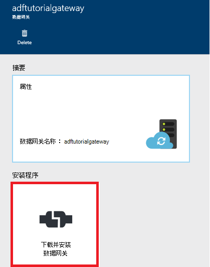

<properties 
    pageTitle="数据工厂数据管理网关 |Microsoft Azure"
    description="设置数据网关内部和云之间移动数据。 使用在 Azure 数据工厂数据管理网关移动数据。" 
    services="data-factory" 
    documentationCenter="" 
    authors="linda33wj" 
    manager="jhubbard" 
    editor="monicar"/>

<tags 
    ms.service="data-factory" 
    ms.workload="data-services" 
    ms.tgt_pltfrm="na" 
    ms.devlang="na" 
    ms.topic="article" 
    ms.date="10/11/2016" 
    ms.author="jingwang"/>

# 数据管理网关
数据管理网关是必须安装在您的内部环境，要复制一个客户机代理云和内部数据存储之间的数据。 [支持数据源](data-factory-data-movement-activities.md##supported-data-stores)部分中列出内部数据存储区支持的数据工厂。 

> [AZURE.NOTE] 目前，网关只支持复制活动和存储的过程活动数据工厂中。 不能使用从自定义活动的网关访问内部数据源。 

这篇文章是在演练对补充[内部和云之间移动数据的数据存储区](data-factory-move-data-between-onprem-and-cloud.md)文章。 在本演练中，您将创建管线网关用于将数据从本地 SQL Server 数据库移动到 Azure 的 blob。 本文提供了数据管理网关进行详细的深入了解。   

## 概述

### 数据管理网关功能
数据管理网关提供了以下功能︰

- 模型内部数据源和云数据源中的相同数据工厂和移动数据。
- 具有单一的监视和管理与从数据工厂刀片式服务器网关状态的可视性。
- 安全地管理访问内部数据源。
    - 到公司防火墙需要做任何更改。 网关只能使通过基于 HTTP 的出站连接，打开互联网。
    - 对您的证书您内部的数据存储的凭据进行加密。
- 高效地将数据移动--数据传输并行，自动适应间歇性网络问题重试逻辑。

### 命令流和数据流
当您使用复制活动内部和云之间复制数据时，活动使用网关内部数据源中的数据传输到云，反之亦然。

这里的高级数据流程和步骤来复制数据网关与摘要︰

1.  数据开发人员为使用[Azure 门户](https://portal.azure.com)或[PowerShell Cmdlet](https://msdn.microsoft.com/library/dn820234.aspx)Azure 数据工厂创建一个网关。 
2.  数据开发人员通过指定网关创建链接的服务的内部数据存储区。 作为设置链接服务的一部分，数据开发人员使用的凭据设置应用程序指定身份验证类型和凭据。  设置凭据应用程序对话框通信与数据存储区，以测试连接和网关以保存的凭据。
3. 网关凭据进行加密证书后与网关 （提供数据的开发人员），将凭据保存在云中之前。
4. 数据工厂服务与计划编制和管理的作业通过使用共享的 Azure 服务总线队列控制通道的网关进行通信。 当复制活动作业需要被激发时，数据工厂排队的请求和凭据信息。 网关开始作业轮询队列之后。
5.  网关对使用同一证书凭据进行解密，然后连接到内部数据存储区使用正确的身份验证类型和凭据。
6.  网关将数据复制从内部存储到云存储，或者反过来取决于复制活动数据管道中的配置方式。 有关此步骤中，网关直接与云存储服务，例如 Azure Blob 存储在安全 (HTTPS) 信道上通信。

### 使用网关的注意事项
- 数据管理网关的一个实例可以用于多个内部数据源。 但是，**单个网关实例被限制到只有一个 Azure 数据工厂**并不能与另一个数据工厂共享。
- 您可以安装在一台计算机上**只能有一个实例的数据管理网关**。 假设您有两个需要访问内部数据源的数据工厂，您需要在两个本地计算机上安装网关。 换句话说，一个网关被限制到特定的数据工厂
- **网关不需要在数据源的同一台计算机上**。 但是，有通往更近的数据源减少了网关连接到数据源的时间。 我们建议您在不同承载内部数据源的计算机上安装网关。 不同的计算机上的网关和数据源时，该网关不争用资源与数据源。
- 您可以**连接到相同的不同计算机上的多个网关部署数据源**。 例如，可能有两个网关服务的两个数据工厂，但数据工厂注册相同的本地数据源。
- 如果您已经安装在您的计算机提供**电源 BI**方案上的网关，在另一台计算机上安装一个**单独的 Azure 数据工厂的网关**。
- 即使您使用**ExpressRoute**，则必须使用网关。
- 内部数据源 （即位于防火墙后面） 被视为数据源甚至当您使用**ExpressRoute**。 使用网关建立的服务和数据源之间的连接。
- 必须**使用网关**，即使在**Azure IaaS VM**在云中的数据存储区。 

## 安装

### 系统必备组件
- 受支持的**操作系统**版本的 Windows 7，Windows 8/8.1、 Windows 10，Windows Server 2008 R2、 Windows Server 2012，Windows Server 2012 R2。 当前不支持在域控制器上的数据管理网关安装。
- .NET Framework 4.5.1 或以上是必需的。 如果在 Windows 7 的计算机上安装网关安装.NET Framework 4.5 或更高版本。 有关详细信息，请参见[.NET Framework 系统要求](https://msdn.microsoft.com/library/8z6watww.aspx)。 
- 网关计算机推荐的**配置**是至少 2 GHz、 4 核，8 GB RAM 和 80 GB 的磁盘。
- 主机计算机进入休眠状态，如果网关不响应数据请求。 因此，安装网关之前在计算机上配置相应的**电源计划**。 如果计算机被配置为休眠状态，网关安装程序提示消息。
- 您必须是计算机上的管理员安装和配置数据管理网关成功。 您可以将其他用户添加到**数据管理网关用户**本地 Windows 组。 此组的成员都可以使用数据管理网关配置管理器工具来配置网关。 

如在特定频率上发生复制活动运行，计算机上的资源使用量 （CPU、 内存） 也会遵循同一模式峰值和空闲时间。 资源利用率也严重依赖正在移动的数据量。 多个副本作业时，您会看到资源使用率上升在高峰时间。 

### 安装选项
可以通过以下方式安装数据管理网关︰ 

- 通过下载 MSI 安装程序从[Microsoft 下载中心获取](https://www.microsoft.com/download/details.aspx?id=39717)包。  此外可以使用 MSI 能够以保留所有设置升级到最新版本的现有数据管理网关。
- 通过单击下手动安装或速成版安装程序在**安装在此计算机上直接****下载和安装数据网关**链接。 请参阅[移动数据内部和云之间](data-factory-move-data-between-onprem-and-cloud.md)文章使用的分步说明速成版安装程序。 该手动步骤可将您带到下载中心。  接下来是下载并从下载中心安装网关的说明进行操作。 

### 最佳安装方法︰
1.  电源计划配置为网关主机计算机上，使机器无法休眠。 主机计算机进入休眠状态，如果网关不响应数据请求。
2.  备份网关与关联的证书。

### 从下载中心安装网关
1. 导航到[Microsoft 数据管理网关下载页面](https://www.microsoft.com/download/details.aspx?id=39717)。 
2. 单击**下载**，选择适当的版本 （**32 位**与**64 位**），并单击**下一步**。 
3. 直接运行**MSI**或将其保存到硬盘并运行。
4. 在**欢迎**页上，选择一种**语言中**单击**下一步**。
5. **接受**最终用户许可协议，然后单击**下一步**。 
6. 选择要安装的网关，然后单击**下一步**的**文件夹**。 
7. 在**准备安装**页上单击**安装**。 
8. 单击**完成**以完成安装。
9. 从 Azure 门户中获取密钥。 请参阅下一节的分步说明。 
10. 在**数据管理网关配置管理器**在您的计算机上运行的页面上**注册网关**，请执行以下步骤︰ 
    1. 将密钥粘贴的文本中。
    2. 或者，单击**显示网关键**以查看密钥文本。
    3. 单击**注册**。 

### 注册使用密钥的网关

#### 如果没有在门户中创建逻辑网关
若要在门户中创建一个网关并从**配置**刀片式服务器获得的密钥，从演练[移动数据内部和云之间](data-factory-move-data-between-onprem-and-cloud.md)的文章中的步骤。    

#### 如果您已经在门户中创建逻辑网关
1. 在 Azure 门户中，导航到**数据工厂**刀片式服务器，并单击**链接服务**拼贴。

    
2. 在**链接服务**刀片式服务器，请选择在门户中创建逻辑**网关**。 

      
2. 在**数据网关**刀片式服务器，单击**下载并安装数据网关**。

       
3. 在**配置**刀片式服务器，请单击**重新创建密钥**。 单击是在警告消息后仔细阅读它。

    
4. 单击该项旁边的复制按钮。 该密钥复制到剪贴板。
    
     

### 系统托盘图标 / 通知
下图显示了一些您请参阅任务栏图标。 

如果您将光标移动到系统托盘图标/通知消息时，您会看到一个弹出窗口中的网关/更新操作的状态细节。

### 端口和防火墙
有两个防火墙，您需要考虑︰**公司防火墙**中央组织和作为守护程序在本地计算机上配置**Windows 防火墙**的路由器上运行网关的安装位置。  

在公司防火墙级别，您需要配置下列域和出站端口︰

| 域名称 | 端口 | 说明 |
| ------ | --------- | ------------ |
| *。 servicebus.windows.net | 443 80 | 侦听器上通过 TCP （访问控制标记购置需要 443） 服务总线中继 | 
| *。 servicebus.windows.net | 9350-9354 5671 | 通过 TCP 的可选服务总线中继 | 
| *。 core.windows.net | 443 | HTTPS | 
| *。 clouddatahub.net | 443 | HTTPS | 
| graph.windows.net | 443 | HTTPS |
| login.windows.net | 443 | HTTPS | 

在 windows 防火墙级别，通常情况下启用这些出站端口。 如果不是这样，可以相应地配置域和端口网关计算机上。

#### 源数据存储区中的数据复制到一个接收器数据存储区

确保在公司防火墙上的网关计算机上的 Windows 防火墙正确启用的防火墙规则和数据存储本身。 启用这些规则允许连接到这两个源和接收器成功的网关。 启用复制操作中涉及的每个数据存储的规则。

例如，要将从**接收到的 SQL Azure 数据库接收器或 Azure SQL 数据仓库的内部数据存储库**，请执行以下步骤︰ 

- 在 Windows 防火墙和企业级防火墙的端口**1433年**上允许出站**TCP**通信
- 配置 SQL Azure 服务器的防火墙设置，将网关计算机的 IP 地址添加到允许的 IP 地址的列表。 

### 代理服务器注意事项
如果您公司的网络环境使用代理服务器来访问 internet，则配置数据管理网关使用适当的代理设置。 您可以在初始注册阶段设置代理。 

网关将使用代理服务器连接到云服务。 在初始安装过程中单击**更改**链接。 您将看到**代理设置**对话框。

有三种配置选项︰ 

- **不使用代理服务器**︰ 网关不显式使用任何代理服务器来连接到云服务。
- **使用系统代理**︰ 网关使用在 diahost.exe.config 配置代理设置。  如果没有代理配置在 diahost.exe.config 中，网关将直接无需通过代理服务器连接到云服务。
- **使用自定义代理**︰ 配置 HTTP 代理服务器设置，以使用网关，而不是在 diahost.exe.config 中使用的配置。  地址和端口是必需的。  用户名和密码是可选取决于您的代理服务器身份验证设置。  使用网关凭据的证书加密和网关主机计算机上本地存储所有设置。

保存已更新的代理服务器设置后，数据管理网关主机服务将自动重新启动。 

网关已成功注册，如果您想要查看或更新代理设置后，可以使用数据管理网关配置管理器。 

1. 启动数据管理网关配置管理器。
2. 切换到**设置**选项卡。
3. 单击**HTTP 代理**部分启动**设置 HTTP 代理服务器**对话框中的**更改**链接。  
4. 单击**下一步**按钮后，您将看到一个警告对话框，询问您保存代理服务器设置，然后重新启动该网关主机服务的权限。

您可以查看和使用配置管理器工具来更新 HTTP 代理。 

> [AZURE.NOTE] 如果您设置了代理服务器使用 NTLM 身份验证，则网关主机服务运行在域帐户下。 如果您更改为更高版本的域帐户的密码，请务必更新服务的配置设置，并相应地重新启动。 由于这一要求，我们建议使用专用的域帐户可以访问代理服务器不要求您经常更新的密码。

### 在 diahost.exe.config 中配置代理服务器设置
如果您选择**使用系统代理**设置 HTTP 代理，网关将使用代理设置在 diahost.exe.config 中。  如果未指定代理在 diahost.exe.config 中，网关将直接无需通过代理服务器连接到云服务。 下面的过程提供有关更新配置文件的说明。 

1.  文件资源管理器，请安全 C:\Program 数值数据管理 Gateway\2.0\Shared\diahost.exe.config 备份原始文件的副本。
2.  启动 Notepad.exe 以管理员身份运行并打开文本文件"C:\Program 数值数据管理 Gateway\2.0\Shared\diahost.exe.config。 下面的代码中所示的 system.net 中找到默认标记︰

            <system.net>
                <defaultProxy useDefaultCredentials="true" />
            </system.net>   

    然后可以添加代理服务器的详细信息，如下面的示例所示︰

            <system.net>
                  <defaultProxy enabled="true">
                        <proxy bypassonlocal="true" proxyaddress="http://proxy.domain.org:8888/" />
                  </defaultProxy>
            </system.net>

    附加属性允许代理标记中指定所需的设置，如 scriptLocation。 请参阅[代理服务器元素 （网络设置）](https://msdn.microsoft.com/library/sa91de1e.aspx)语法。

            <proxy autoDetect="true|false|unspecified" bypassonlocal="true|false|unspecified" proxyaddress="uriString" scriptLocation="uriString" usesystemdefault="true|false|unspecified "/>

3. 将配置文件保存到原始位置，然后重新启动数据管理网关主机服务，拾取所做的更改。 重新启动该服务︰ 使用控制面板中，从或**数据管理网关配置管理器**的服务小程序 > 单击**停止服务**按钮，然后单击**启动服务**。 如果该服务没有启动，则可能已将不正确的 XML 标记语法添加到应用程序配置文件中编辑过。     

除了这些点，还需要确保 Microsoft Azure 公司的白名单中。 可以从[Microsoft 下载中心](https://www.microsoft.com/download/details.aspx?id=41653)下载的有效 Microsoft Azure IP 地址列表。

#### 防火墙和代理服务器相关的问题可能出现的症状
如果您遇到类似下面的错误，则可能是由于防火墙或代理服务器，阻止网关连接到数据工厂自行进行身份验证的配置不正确。 请参阅上一节，以确保您的防火墙和代理服务器配置正确。

1.  当您尝试注册网关时，您收到以下错误:"无法注册的网关键。 然后再尝试重新注册的网关键，请确认数据管理网关是连接状态，并启动了数据管理网关主机服务。
2.  当您打开配置管理器时，查看状态为"已断开"或"连接"。 当查看 Windows 事件日志，在"事件查看器">"应用程序和服务日志">"数据管理网关，"您看到错误消息，例如以下的错误︰`Unable to connect to the remote server` 
    `A component of Data Management Gateway has become unresponsive and restarts automatically. Component name: Gateway.`

### 打开端口 8050 凭据加密 
**设置凭据**应用程序使用内部部署设置时，入站的端口**8050**中继凭据到网关链接在 Azure 的门户服务。 在网关安装时，默认情况下，数据管理网关安装打开该网关计算机上。
 
如果您正在使用第三方防火墙，则可以手动打开端口 8050。 如果网关安装过程中会遇到防火墙问题，您可以尝试使用下面的命令来安装网关没有配置防火墙。

    msiexec /q /i DataManagementGateway.msi NOFIREWALL=1

如果您选择不打开端口 8050 网关计算机上的，使用机制而不是使用**设置凭据**应用程序配置数据存储凭据。 例如，您可以使用[New AzureRmDataFactoryEncryptValue](https://msdn.microsoft.com/library/mt603802.aspx) PowerShell cmdlet。 可以设置[设置凭据和安全](#set-credentials-and-securityy)部分数据是如何存储的凭据，请参阅。

## 更新 
默认情况下，网关的较新版本可用时自动更新数据管理网关。 网关不会更新，直至完成所有预定的任务。 在完成更新操作之前由网关处理其他任务。 如果此更新失败，网关回滚到旧的版本。 

在下列位置中查看计划的更新时间︰

- 在 Azure 门户网关属性刀片。
- 主页上的数据管理网关配置管理器
- 系统托盘通知消息。 

数据管理网关配置管理器的主页选项卡显示的更新计划上, 一次网关安装更新。 

您可以立即安装更新或等待网关在预定的时间自动更新。 例如下, 图显示了您在网关配置管理器更新按钮，您可以单击立即安装它并通知消息。 

如下图所示，系统托盘中的通知消息将如下︰ 

您看到系统托盘中的更新操作 （手动或自动） 的状态。 当您下一次启动网关配置管理器时，您将看到一条消息，网关已被更新并提供一个链接到[新主题](data-factory-gateway-release-notes.md)的通知栏上。

### 若要禁用自动更新功能
您可以禁用/启用自动更新功能通过执行以下步骤︰ 

1. 网关计算机上启动 Windows PowerShell。 
2. 切换到 C:\Program 数值数据管理 Gateway\2.0\PowerShellScript 文件夹。
3. 运行以下命令来打开自动更新功能关闭 （禁用）。   

        .\GatewayAutoUpdateToggle.ps1  -off

4. 若要重新打开它︰ 
    
        .\GatewayAutoUpdateToggle.ps1  -on  

## 配置管理器 
一旦安装网关，您可以通过以下方式之一启动数据管理网关配置管理器︰ 

- 在**搜索**窗口中，键入**数据管理网关**来实现此功能。 
- 在文件夹中运行可执行文件**ConfigManager.exe** : **C:\Program 数值数据管理 Gateway\2.0\Shared** 
 
### 主页
主页页面允许您执行以下操作︰ 

- 查看状态 （连接到云服务等等。） 的网关。 
- **注册**使用门户的钥匙。
- **停止**并启动**数据管理网关主机服务**网关计算机上。
- **计划更新**中各天的特定时间。
- 查看网关是**最后一次更新**的日期。 

### 设置页面
设置页面允许您执行以下操作︰

- 查看、 更改和导出**证书**使用的网关。 此证书用于加密数据源凭据。
- **HTTPS 端口**更改为终结点。 网关将打开的端口来设置数据源凭据。 
- 终结点的**状态**
- 查看**SSL 证书**用于 SSL 通信门户和网关之间设置为数据源凭据。  

### 诊断程序页面
诊断页允许您执行以下操作︰

- 启用详细**日志记录**，在事件查看器中查看日志并将日志发送到 Microsoft，如果发生了错误。
- **测试连接**到数据源。  

### 帮助页
帮助页将显示以下信息︰  

- 网关的简要说明
- 版本号
- 链接到联机帮助、 隐私保护声明和许可协议。  

## 故障排除

- 您可以查找在网关的详细的信息将记录在 Windows 事件日志中。 您可以通过使用 Windows**事件查看器****应用程序和服务日志**下找到它们 > **数据管理网关**。 在解决与网关相关的问题，寻找错误级别事件在事件查看器。
- 如果网关会停止工作后，您**更改的证书**，请重新启动使用 Microsoft 数据管理网关配置管理器工具或服务控制面板小程序的**数据管理网关服务**。 如果仍然出现错误，您可能需要提供数据管理网关服务用户访问该证书的证书管理器 (certmgr.msc) 中的显式权限。  服务的默认用户帐户是︰ **NT Service\DIAHostService**。 
- 如果单击加密按钮在数据工厂编辑器时，**凭据管理器**应用程序**加密**凭据失败，请验证**网关计算机**上运行此应用程序。 如果不是，网关计算机上运行应用程序并尝试加密凭据。  
- 如果您看到的数据存储的连接或与驱动程序相关的错误，请执行以下步骤︰ 
    - 网关计算机上启动**数据管理网关配置管理器**。
    - 切换到**诊断**选项卡
    - 选择/输入适当的值**测试连接到使用此网关内部数据源**组中的字段
    - 单击**测试连接**以查看是否可以从使用的凭据和连接信息的网关计算机连接到本地数据源。 如果测试连接安装驱动程序后仍然无法正常工作，请重新启动以使它能够获得最新的更改的网关。  

    

### 向 Microsoft 发送网关日志
当您联系 Microsoft 技术支持以获取网关故障排除的帮助时，可能会要求您共享您的网关日志。 网关的版本允许您方便地共享需要网关到网关配置管理器中的两个按钮单击的日志。   

1. 切换到网关配置管理器的**诊断**标签。
 
    
2. 请单击**发送日志**链接请参阅下面的对话框︰ 

    
3. （可选）单击**查看日志**，以检查事件查看器中的日志。
4. （可选）单击**隐私**查看 Microsoft 在线服务的隐私声明。 
3. 当您满意您正准备上载，请单击**发送日志**实际日志中最后一个七天向 Microsoft 发送问题的疑难解答。 您应该看到如下图所示发送日志操作的状态︰

    
4. 完成此操作后，您会看到一个对话框，如下图所示︰
    
    
5. 记下该**报表 ID**并与 Microsoft 支持部门共享。 报表 ID 用于定位网关日志上载进行故障排除。  在事件查看器中供您参考还保存报表 ID。  您可以通过查看事件 ID"25"找到它，检查日期和时间。
    
        

### 在网关主机计算机上记录存档网关
有一些情况，其中有网关的问题，不能直接共享网关日志︰ 

- 手动安装网关和注册网关;
- 您尝试使用配置管理器; 重新生成密钥注册网关 
- 您尝试发送日志，系统无法连接的网关主机服务;

在这种情况下，您可以将网关日志保存为 zip 文件并在以后联系 Microsoft 技术支持时共享。 例如，如果注册为网关时，收到错误下面的图像中所示︰   

单击**存档网关**日志链接可归档和保存日志，请与 Microsoft 支持共享 zip 文件。 

### 网关是联机，使用有限的功能 
看的网关状态为**联机，使用有限的功能**由于以下原因之一。

- 网关不能连接到云服务，通过服务总线。
- 云服务无法连接到服务总线的网关。

联机，使用有限的功能网关时，您可能不能使用数据工厂复制向导创建复制到从内部数据存储的数据的数据管道。

分辨率/解决此问题的基础是否能网关连接到云服务或其他方式 （联机，使用有限的功能）。 以下各节提供了这些解决方法。 

#### 网关不能连接到云服务，通过服务总线
请按照以下步骤获取返回到联机状态的网关︰ 

1. 启用网关计算机上 Windows 防火墙和企业级防火墙的出站端口 9350 9354。 有关详细信息请参阅[端口和防火墙](#ports-and-firewall)部分。
2. 网关配置代理服务器设置。 有关详细信息请参阅[代理服务器注意事项](#proxy-server-considerations)一节。 

作为一种变通方法，Azure 门户 （或） Visual Studio （或） Azure PowerShell 使用数据工厂编辑器。

#### 错误︰ 云服务无法连接到服务总线通过网关。
请按照以下步骤获取返回到联机状态的网关︰
 
1. 启用出站端口 5671 和网关计算机上 Windows 防火墙和公司防火墙上的 9350 9354。 有关详细信息请参阅[端口和防火墙](#ports-and-firewall)部分。
2. 网关配置代理服务器设置。 有关详细信息请参阅[代理服务器注意事项](#proxy-server-considerations)一节。
3. 删除代理服务器上的静态 IP 限制。 

作为一种变通方法，您可以使用 Azure 门户 （或） Visual Studio （或） Azure PowerShell 数据工厂编辑器。
 
## 从一台计算机到另一个的移动网关
本节提供了步骤移动网关客户端从一台机器到另一台计算机。 

2. 在门户中，导航到**数据工厂的主页上**，并单击**链接服务**拼贴。 

     
3. **数据网关****链接服务**刀片式服务器一节中，选择您的网关。
    
    
4. 在**数据网关**刀片式服务器，单击**下载并安装数据网关**。
    
     
5. 在**配置**刀片式服务器，单击**下载和安装数据网关**，并按照说明安装在计算机上的数据网关。 

    
6. 使**Microsoft 数据管理网关配置管理器**保持打开状态。 
 
     
7. 在门户中的**配置**刀片式服务器，请单击命令栏上**重新创建密钥**和警告消息单击**是**。 单击**复制按钮**键将该密钥复制到剪贴板上的文本的旁边。 网关与旧计算机上的停止运行为您重新创建该项，很快。  
    
    
     
8. 将**密钥**粘贴到文本框在页中**注册的网关**计算机上的**数据管理网关配置管理器**。 （可选）单击**显示网关密钥**复选框以查看密钥文本。 
 
    
9. 单击**注册**注册云服务网关。
10. 在**设置**选项卡上，单击**更改**选择与旧网关使用同一个证书，输入**密码**，然后单击**完成**。 
 
    

    您可以导出证书从旧的网关通过执行以下步骤︰ 在旧计算机上启动数据管理网关配置管理器、 切换到**证书**选项卡，单击**导出**按钮并按照说明进行操作。 
10. 注册成功后的网关，您应该看到**登记**设置为**已注册**并且**状态**设置为**已启动**在主页上的网关配置管理器。 

## 加密的凭据 
要加密凭据数据工厂编辑器中，请执行以下步骤︰

1. 启动 web 浏览器的**网关计算机**上，请导航到[Azure 的门户](http://portal.azure.com)。 数据工厂如果需要请打开数据工厂**数据工厂**刀片式服务器中的搜索，然后单击**作者和部署**启动数据工厂编辑器。   
1. 单击现有**链接的服务**在树视图中以查看其 JSON 定义或创建需要数据管理网关链接的服务 (例如︰ SQL Server 或 Oracle)。 
2. 在 JSON 编辑器中，为**gatewayName**属性中，输入网关的名称。 
3. 在**连接字符串**中输入服务器名称的**数据源**属性。
4. 在**连接字符串**中输入数据库**的初始目录**属性的名称。    
5. 单击启动单击了命令栏上的**加密**按钮-一次**凭据管理器**应用程序。 您应该看到**设置凭据**对话框。 
    
6. 在**设置凭据**对话框中，请执行以下步骤︰  
    1.  选择要用于连接到数据库的数据工厂服务的**身份验证**。 
    2.  输入的用户有权访问数据库的**用户名**设置的名称。 
    3.  输入的**密码**设置为用户的密码。  
    4.  单击**确定**以加密的凭据并关闭对话框。 
5.  现在，您应该看到在**连接字符串**中的**encryptedCredential**属性。      
        
            {
                "name": "SqlServerLinkedService",
                "properties": {
                    "type": "OnPremisesSqlServer",
                    "description": "",
                    "typeProperties": {
                        "connectionString": "data source=myserver;initial catalog=mydatabase;Integrated Security=False;EncryptedCredential=eyJDb25uZWN0aW9uU3R",
                        "gatewayName": "adftutorialgateway"
                    }
                }
            }

如果您从一台计算机不同的网关计算机访问门户，您必须确保凭据管理器应用程序可以连接到网关的计算机。 如果应用程序不能访问网关计算机，它不允许您设置为数据源凭据并测试与数据源的连接。  

当您使用应用程序**设置凭据**时，门户的凭据进行加密**网关配置管理器**的网关计算机上的**证书**选项卡中指定的证书。 

如果您正在寻找一种基于 API 的方法来加密凭据，您可以使用[新建 AzureRmDataFactoryEncryptValue](https://msdn.microsoft.com/library/mt603802.aspx) PowerShell cmdlet 凭据进行加密。 该 cmdlet 使用该证书的网关配置为使用凭据进行加密。 **连接字符串**在 JSON 中的**EncryptedCredential**元素中添加加密的凭据。 与[新建 AzureRmDataFactoryLinkedService](https://msdn.microsoft.com/library/mt603647.aspx) cmdlet 或数据工厂编辑器中，您可以使用 JSON。 

    "connectionString": "Data Source=<servername>;Initial Catalog=<databasename>;Integrated Security=True;EncryptedCredential=<encrypted credential>",

没有更多的方法之一设置凭据使用数据工厂编辑器。 如果通过使用编辑器创建链接的 SQL Server 服务，则以纯文本形式输入凭据，凭据加密使用数据工厂服务拥有的证书。 它不使用证书的网关配置为使用。 虽然这种方法可能在某些情况下更快一点，这样做不太安全。 因此，我们建议您按照这种方法仅用于开发/测试目的。 

## PowerShell cmdlet 
本部分介绍如何创建和注册使用 Azure PowerShell cmdlet 的网关。 

1. 在管理员模式下启动**Azure PowerShell** 。 
2. 通过运行以下命令，然后输入您 Azure 的凭据登录到您的 Azure 帐户。 

    登录 AzureRmAccount
2. 使用**New AzureRmDataFactoryGateway** cmdlet，如下所示创建一个逻辑的网关︰

        $MyDMG = New-AzureRmDataFactoryGateway -Name <gatewayName> -DataFactoryName <dataFactoryName> -ResourceGroupName ADF –Description <desc>

    **示例命令和输出**︰

        PS C:\> $MyDMG = New-AzureRmDataFactoryGateway -Name MyGateway -DataFactoryName $df -ResourceGroupName ADF –Description “gateway for walkthrough”

        Name              : MyGateway
        Description       : gateway for walkthrough
        Version           :
        Status            : NeedRegistration
        VersionStatus     : None
        CreateTime        : 9/28/2014 10:58:22
        RegisterTime      :
        LastConnectTime   :
        ExpiryTime        :
        ProvisioningState : Succeeded
        Key               : ADF#00000000-0000-4fb8-a867-947877aef6cb@fda06d87-f446-43b1-9485-78af26b8bab0@4707262b-dc25-4fe5-881c-c8a7c3c569fe@wu#nfU4aBlq/heRyYFZ2Xt/CD+7i73PEO521Sj2AFOCmiI

    
4. 在 Azure PowerShell 切换到文件夹︰ * *C:\Program 数值数据管理 Gateway\2.0\PowerShellScript\**。运行* *RegisterGateway.ps1* *与本地变量* *$Key** 以下命令中所示。 此脚本注册与您在前面创建的逻辑网关计算机上安装客户端代理。

        PS C:\> .\RegisterGateway.ps1 $MyDMG.Key
        
        Agent registration is successful!

    可以通过使用 IsRegisterOnRemoteMachine 参数来注册远程计算机上的网关。 示例︰
        
        .\RegisterGateway.ps1 $MyDMG.Key -IsRegisterOnRemoteMachine true

5. 可以使用**Get AzureRmDataFactoryGateway** cmdlet 以获取数据工厂中的网关列表。 **状态**显示为已**联机**，则意味着您的网关已准备好使用。

        Get-AzureRmDataFactoryGateway -DataFactoryName <dataFactoryName> -ResourceGroupName ADF

可以删除使用**删除 AzureRmDataFactoryGateway** cmdlet 的网关，网关使用的**组 AzureRmDataFactoryGateway** cmdlet 的更新说明。 有关语法和其他有关这些 cmdlet 的详细信息，请参阅数据工厂 Cmdlet 参考。  

### 列表使用 PowerShell 的网关

    Get-AzureRmDataFactoryGateway -DataFactoryName jasoncopyusingstoredprocedure -ResourceGroupName ADF_ResourceGroup

### 删除使用 PowerShell 的网关
    
    Remove-AzureRmDataFactoryGateway -Name JasonHDMG_byPSRemote -ResourceGroupName ADF_ResourceGroup -DataFactoryName jasoncopyusingstoredprocedure -Force 

## 下一步行动
- 请参阅[内部和云之间移动数据的数据存储区](data-factory-move-data-between-onprem-and-cloud.md)文章。 在本演练中，您将创建管线网关用于将数据从本地 SQL Server 数据库移动到 Azure 的 blob。  
