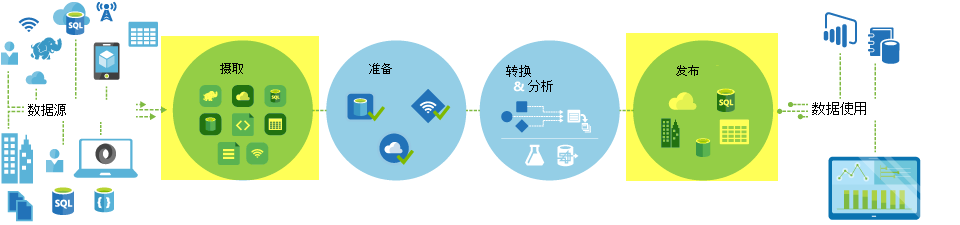
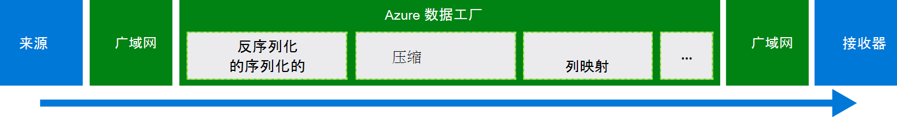
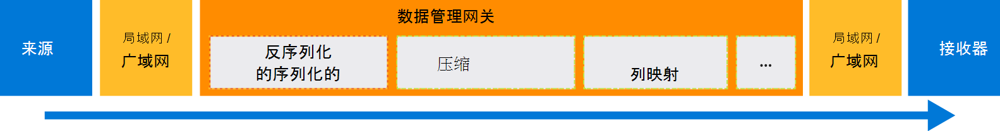

<properties
    pageTitle="通过使用复制活动移动数据 |Microsoft Azure"
    description="了解如何在数据工厂管道中移动数据︰ 云存储之间和内部存储和云存储之间的数据迁移。 使用复制活动。"
    keywords="复制数据、 数据移动和数据迁移，传输数据"
    services="data-factory"
    documentationCenter=""
    authors="linda33wj"
    manager="jhubbard"
    editor="monicar"/>

<tags
    ms.service="data-factory"
    ms.workload="data-services"
    ms.tgt_pltfrm="na"
    ms.devlang="na"
    ms.topic="article"
    ms.date="09/22/2016"
    ms.author="jingwang"/>

# 通过使用复制活动移动数据

## 概述
在 Azure 数据工厂，您可以使用复制活动中各种内部部署的不同形状的数据复制和数据源到 Azure 的云。 复制数据后，它能进一步转换和分析。 您可以使用复制活动发布转换和商业智能 (BI) 和应用程序消耗的分析结果。

复制活动采用安全、 可靠、 可伸缩和[全局可用的服务](#global)。 这篇文章详细说明数据工厂和复制活动中的数据移动。

首先，让我们看看两个云数据存储库之间和内部数据存储区和云数据存储区之间数据迁移发生的方式。

> [AZURE.NOTE] 若要了解有关活动一般情况下，请参阅[了解管线和活动](data-factory-create-pipelines.md)。

### 两个云数据存储之间复制数据
当源和接收器的数据存储在云中，复制活动会经历以下几个阶段将数据从源复制到接收器。 启动复制活动的服务︰

1. 源数据存储区中读取数据。
2. 执行序列化/反序列化、 压缩/解压、 列映射，并类型转换。 是基于输入数据集、 输出集，并复制活动配置这些操作。
3.  将数据写入目标数据存储。

该服务将自动选择要执行的数据移动的最佳区域。 此区域通常是一个最接近的接收器的数据存储区。

### 内部数据存储区和云数据存储之间复制数据
要安全地云数据存储区的内部数据存储库之间移动数据，请在内部计算机上安装数据管理网关。 数据管理网关是实现混合数据移动和处理的代理。 您可以安装在同一台计算机上数据存储本身，或一台计算机上具有访问数据存储区。

在此方案中，数据管理网关执行序列化/反序列化、 压缩/解压、 列映射，和类型转换。 数据没有排到 Azure 数据工厂服务。 相反，数据管理网关直接将数据写入到目标存储。

请参阅[内部和云之间移动数据的数据存储区](data-factory-move-data-between-onprem-and-cloud.md)的简介和演练。 此代理的详细信息，请参阅[数据管理网关](data-factory-data-management-gateway.md)。

您还可以移动使用数据管理网关位于 Azure IaaS 虚拟机 (Vm) 的数据与支持数据存储区。 在这种情况下，可以在同一个虚拟机上安装数据管理网关，如数据存储本身，或在一个单独的虚拟机上，有权访问数据存储区。

## 支持的数据存储和格式
[AZURE.INCLUDE [data-factory-supported-data-stores](../../includes/data-factory-supported-data-stores.md)]

如果您需要移动到中的数据的数据存储复制活动并不支持，**自定义活动**数据工厂与您自己的逻辑使用复制/移动数据。 有关创建和使用自定义活动的详细信息，请参阅[使用 Azure 数据工厂管道中的自定义活动](data-factory-use-custom-activities.md)。

### 支持的文件格式
可以使用复制活动将复制的文件的两个基于文件的数据存储区，例如 Azure Blob、 文件系统和 HDFS 之间。 若要执行此操作，则可以跳过[格式部分](data-factory-create-datasets.md)输入和输出数据集定义中。 不任何序列化/反序列化的情况下高效地复制数据。

复制活动也从读取和写入文件中指定的格式︰ 文本、 Avro、 ORC、 Parquet 和 JSON。 可以执行下面的复制活动，例如︰

-   Azure Blob 中的数据复制的文本 (CSV) 格式，SQL Azure 数据库写入。
-   将文件从本地文件系统复制文本 (CSV) 格式和 Avro 格式写入到 Azure Blob。
-   复制 SQL Azure 数据库中的数据以及写入 HDFS 内部 ORC 格式。

## 全球可用的数据移动
Azure 数据工厂只有是美国西部、 东部美国和北欧地区。 不过，可以复制活动的服务中提供了全局以下区域和地理区域。 全球可用的拓扑结构可确保通常可以避免跨地区跃点的高效数据移动。 数据工厂和在一个区域中移动数据的可用性，请参阅[服务的地区](https://azure.microsoft.com/regions/#services)。

### 将云数据存储之间的数据复制
当源和接收器的数据存储在云中，数据工厂的接收器在同一地理位置，将数据移到最接近的区域中使用服务部署。 请参阅下表的映射︰

目标数据存储的区域 | 用于移动数据的区域
:----------------------------------- | :----------------------------
东亚的美国 | 东亚的美国
东亚美国 2 | 东亚美国 2
美国西部 | 美国西部
西美国 2 | 美国西部
美国中部 | 美国中部
美国西中部 | 美国中部
美国中北部 | 美国中北部
美国中南部 | 美国中南部
北欧 | 北欧
西欧 | 西欧
东南亚 | 东南亚
东亚 | 东南亚
日本东 | 日本东
日本西部 | 日本东
巴西南部 | 巴西南部
澳大利亚东部 | 澳大利亚东部
澳大利亚东南部 | 澳大利亚东南部
中央印度 | 中央印度
印度南部 | 中央印度
西部的印度 | 中央印度

> [AZURE.NOTE] 目标数据存储的区域不在前面的列表中，如果复制活动无法正常工作，而不是通过另一地区。

### 内部数据存储区和云数据存储之间复制数据
当数据复制之间内部 （或 Azure 的虚拟机 IaaS） 和云存储，[数据管理网关](data-factory-data-management-gateway.md)内部计算机或虚拟机上执行数据移动。 除非您使用[转移复制](data-factory-copy-activity-performance.md#staged-copy)功能数据没有排到云中的服务。 在这种情况下，数据流通过临时 Azure Blob 存储写入到接收器的数据存储区之前。

## 使用复制活动创建管线
您可以使用两种方法中的复制活动创建管线︰

### 使用复制向导
数据工厂复制向导可帮助您使用复制活动创建管线。 该管道可支持来源的数据复制到目标*而无需编写 JSON*定义为链接的服务、 数据集和管道。 有关该向导的详细信息，请参阅[数据工厂复制向导](data-factory-copy-wizard.md)。  

### 通过使用 JSON 脚本
可用于数据工厂编辑器在 Azure 门户、 Visual Studio 或 Azure PowerShell 创建管线的 JSON 定义 （通过使用复制活动）。 然后，您可以部署在数据工厂创建管线。 请参阅[教程︰ 使用 Azure 数据工厂管道中的复制活动](data-factory-copy-data-from-azure-blob-storage-to-sql-database.md)有关的教程的分步指导。    

JSON 属性 （例如名称、 说明、 输入和输出表和策略） 都可用于所有类型的活动。 中可用的属性`typeProperties`节活动的变化与每种活动类型。

复制活动`typeProperties`部分取决于类型的源和接收器。 单击源/接收器[支持源和接收器](#supported-data-stores)部分了解有关类型属性的复制活动支持的该数据存储区中。   

下面是一个示例 JSON 定义︰

    {
      "name": "ADFTutorialPipeline",
      "properties": {
        "description": "Copy data from Azure blob to Azure SQL table",
        "activities": [
          {
            "name": "CopyFromBlobToSQL",
            "type": "Copy",
            "inputs": [
              {
                "name": "InputBlobTable"
              }
            ],
            "outputs": [
              {
                "name": "OutputSQLTable"
              }
            ],
            "typeProperties": {
              "source": {
                "type": "BlobSource"
              },
              "sink": {
                "type": "SqlSink",
                "writeBatchSize": 10000,
                "writeBatchTimeout": "60:00:00"
              }
            },
            "Policy": {
              "concurrency": 1,
              "executionPriorityOrder": "NewestFirst",
              "retry": 0,
              "timeout": "01:00:00"
            }
          }
        ],
        "start": "2016-07-12T00:00:00Z",
        "end": "2016-07-13T00:00:00Z"
      }
    }

输出数据集中定义日程安排确定该活动的运行时 (例如︰**每**日**一天**，频率和时间间隔为**1**)。 该活动将数据复制到一个输出数据集 （**接收器**） 输入的数据集 （**源**）。

您可以指定多个输入数据集，对复制活动。 它们用于验证依赖项之前运行该活动。 但是，只有从第一个数据集的数据复制到目标数据集中。 有关详细信息，请参阅[计划和执行](data-factory-scheduling-and-execution.md)。  

## 性能和调整
请参阅[复制活动性能和优化指南](data-factory-copy-activity-performance.md)，它描述了影响在 Azure 数据工厂中移动数据 （副本活动） 的性能的关键因素。 此外列出了在内部测试的过程中观察到的性能，并讨论了优化性能的复制活动的各种方式。

## 时间安排和顺序复制
有关计划和执行在数据工厂中的工作方式的详细信息，请参阅[计划和执行](data-factory-scheduling-and-execution.md)。 就可以逐个运行多个复制操作顺序/排序方式。 请参阅[订购拷贝](data-factory-scheduling-and-execution.md#ordered-copy)部分。

## 类型转换
不同的数据存储具有不同的本机类型系统。 复制活动执行自动类型转换来水池下面两个方法的类型的源类型︰

1. 从本机源类型转换为.NET 类型。
2. 从.NET 类型转换到本机的接收器类型。

在各自数据存储文章是从本机类型系统映射到数据存储区的.NET 类型。 （单击[受支持的数据存储区](#supported-data-stores)表中特定的链接）。 这些映射可用于创建您的表时需要确定适当的类型，以便复制活动执行正确的转换。

## 下一步行动
- 要更了解复制活动，请参阅[从 Azure Blob 存储到 SQL Azure 数据库的数据复制](data-factory-copy-data-from-azure-blob-storage-to-sql-database.md)。
- 若要了解如何将数据从本地数据存储区移动到云数据存储区，请参阅[将数据从内部云数据存储区](data-factory-move-data-between-onprem-and-cloud.md)。
