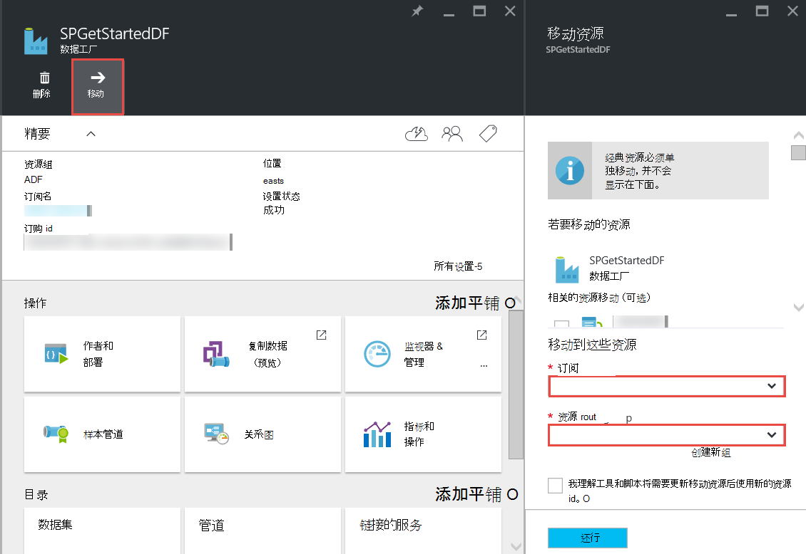

<properties 
    pageTitle="Azure 数据工厂-常见问题" 
    description="Azure 数据工厂有关的常见问题。" 
    services="data-factory" 
    documentationCenter="" 
    authors="sharonlo101" 
    manager="jhubbard" 
    editor="monicar"/>

<tags 
    ms.service="data-factory" 
    ms.workload="data-services" 
    ms.tgt_pltfrm="na" 
    ms.devlang="na" 
    ms.topic="article" 
    ms.date="09/12/2016" 
    ms.author="shlo"/>

# Azure 数据工厂-常见问题

## 一般性问题

### 什么是 Azure 数据工厂？

数据工厂是基于云的数据集成服务**可以自动移动和数据转换**。 就像一个工厂运行设备获取原材料，并将其转换为成品，数据工厂协调，收集原始数据并将其转换为随时可用的信息的现有服务。 
 
数据工厂可以创建数据驱动的工作流云数据存储和内部以及进程/变换数据使用 Azure HDInsight 和 Azure 数据湖分析等的计算服务之间移动数据。 创建执行操作所需的管道后，您可以安排定期运行 （每小时、 每天、 每周等）。   

更多详细信息，请参阅[概述和重要的概念](data-factory-introduction.md)。 

### 在哪里可以找到的 Azure 数据工厂定价详细信息？

[数据工厂定价详细信息页面]，请参阅[adf-pricing-details]Azure 数据工厂有关定价的详细信息。  

### 如何开始使用 Azure 数据工厂？

- Azure 数据工厂的概述，请参阅[Azure 数据工厂简介](data-factory-introduction.md)。
- 如何使用复制活动的**复制/移动数据**的教程，请参阅[从 Azure Blob 存储到 SQL Azure 数据库复制数据](data-factory-copy-data-from-azure-blob-storage-to-sql-database.md)。
- 有关如何**将数据转换**的教程使用 HDInsight 配置单元的活动。 [通过运行 Hadoop 群集上的配置单元脚本的流程数据](data-factory-build-your-first-pipeline.md)，请参阅 
  
### 什么是数据工厂的地区可用性？
数据工厂位于**美国西部**和**北部的欧洲**。 数据工厂所使用的计算和存储服务可以在其他地区。 请参见[支持区域](data-factory-introduction.md#supported-regions)。 
 
### 数据工厂/管道/活动/数据集的数量上的限制有哪些？
 
请参见**Azure 数据工厂限制** [Azure 订阅和服务限制、 配额和限制](../azure-subscription-service-limits.md#data-factory-limits)文章的一节。

### Azure 数据工厂服务与创作/开发人员的体验是什么？

您可以作者/创建数据工厂使用下列方法之一︰

- **Azure 的门户网站** 
  数据工厂刀片的 Azure 门户提供丰富的用户界面，您可以创建数据工厂广告链接服务。 **数据工厂编辑器**，它也是门户网站的一部分，允许您通过指定这些项目的定义，JSON 轻松创建链接的服务、 表、 数据集和管道。 使用门户网站编辑器创建和部署数据工厂的示例，请参阅[生成第一个数据管道使用 Azure 的门户](data-factory-build-your-first-pipeline-using-editor.md)。

- **Visual Studio**  
  可以使用 Visual Studio 创建 Azure 数据工厂。 有关详细信息，请参阅[生成您使用 Visual Studio 的第一个数据管道](data-factory-build-your-first-pipeline-using-vs.md)。 

- **Azure PowerShell**  
   ，请参阅[创建和监视 Azure 数据工厂使用 Azure PowerShell](data-factory-build-your-first-pipeline-using-powershell.md)教程/演练创建使用 PowerShell 的数据工厂。 请参见[数据工厂 Cmdlet 参考][adf-powershell-reference]在 MSDN 库数据工厂 cmdlet 的全面的文档记录的内容。
   
- **.NET 类库** 
  您可以通过使用数据工厂.NET SDK 通过编程方式创建数据工厂。 有关使用.NET SDK 的数据工厂创建的演练，请参阅[创建、 监视和管理使用.NET SDK 的数据工厂](data-factory-create-data-factories-programmatically.md)。 请参阅[数据工厂类库引用][msdn-class-library-reference]的数据工厂.NET SDK 的全面的文档记录。

- **REST API**  
   Azure 数据工厂服务公开的 REST API 还可用来创建和部署数据工厂。 请参见[数据工厂 REST API 参考][msdn-rest-api-reference]的工厂 REST API，数据的全面的文档记录。
 
- **Azure 的资源管理器模板**
  请参阅[教程︰ 生成第一个 Azure 数据工厂使用 Azure 资源管理器模板](data-factory-build-your-first-pipeline-using-arm.md)fo 的详细信息。 

### 可以重命名数据工厂
不。 像其他 Azure 的资源，不能更改 Azure 数据工厂的名称。 

### 移动数据工厂从一个 Azure 订阅到另一个？ 
是的。 数据工厂刀片式服务器上使用**移动**按钮，如下面的关系图中所示。 

### 数据工厂支持的计算环境是什么？
下表列出了支持的数据工厂，并在其可以运行的活动的计算环境。 

| 计算环境 | 活动 |
| ------------------- | -------- | 
| [按需 HDInsight 群集](data-factory-compute-linked-services.md#azure-hdinsight-on-demand-linked-service)或[HDInsight 群集](data-factory-compute-linked-services.md#azure-hdinsight-linked-service) | [最低](data-factory-use-custom-activities.md)[配置单元](data-factory-hive-activity.md)、[小猪](data-factory-pig-activity.md)， [MapReduce](data-factory-map-reduce.md)， [Hadoop 流](data-factory-hadoop-streaming-activity.md) | 
| [Azure 的批次](data-factory-compute-linked-services.md#azure-batch-linked-service) | [最低](data-factory-use-custom-activities.md) |  
| [Azure 的机器学习](data-factory-compute-linked-services.md#azure-machine-learning-linked-service) | [机器学习活动︰ 批处理执行和更新资源](data-factory-azure-ml-batch-execution-activity.md) |
| [Azure 数据湖分析](data-factory-compute-linked-services.md#azure-data-lake-analytics-linked-service) | [数据分析湖 U-SQL](data-factory-usql-activity.md)
| [SQL azure](data-factory-compute-linked-services.md#azure-sql-linked-service)， [SQL Azure 数据仓库](data-factory-compute-linked-services.md#azure-sql-data-warehouse-linked-service)中， [SQL Server](data-factory-compute-linked-services.md#sql-server-linked-service) | [存储的过程](data-factory-stored-proc-activity.md)

## 活动-常见问题解答
### 可以使用数据工厂管线中的活动的不同类型有哪些？ 

- 移动数据的[数据移动活动](data-factory-data-movement-activities.md)。
- [数据转换活动](data-factory-data-transformation-activities.md)进程/转换数据。 

### 活动的运行时
在表中输出数据的**可用性**配置设置决定何时运行该活动。 如果指定了输入数据集，则活动会检查是否满足所有输入的数据相关性 （即**就绪**状态） 开始运行之前。 

## 复制活动-常见问题解答
### 最好具有与多个活动管线或为每个活动的独立管道？ 
管道应该捆绑在一起的相关的活动。 如果通过管道之外的任何其他活动中不会消耗连接它们的数据集，可以在一个管道中保持活动。 这种方式，不需要到链管道活动期间，以便它们相互对齐。 同时，更新管线时更好地保留到管道内部表中的数据完整性。 管线更新实质上是停止在管道内的所有活动、 删除它们，然后重新创建它们。 从创作的角度来看，它也可能更易于查看管道的一个 JSON 文件中的相关活动中的数据的流。

### 支持的数据存储区有哪些？
[AZURE.INCLUDE [data-factory-supported-data-stores](../../includes/data-factory-supported-data-stores.md)]

### 支持的文件格式是什么？ 
[AZURE.INCLUDE [data-factory-file-format](../../includes/data-factory-file-format.md)]

### 在其中执行复制操作？ 
有关详细信息，请参见[全局可用的数据移动](data-factory-data-movement-activities.md#global)部分。 简单地说，当涉及内部数据存储区时，由您的内部环境中管理数据网关被执行复制操作。 而且，当两个云存储之间的数据移动，在靠近接收器在同一地理位置的区域执行复制操作。 

## HDInsight 活动-常见问题解答

### HDInsight 支持哪些地区？

请参阅以下文章的地理可用性部分︰ [HDInsight 定价详细信息]或[hdinsight-supported-regions]。

### 按需 HDInsight 群集使用哪个地区？

按需 HDInsight 群集创建指定用于群集存储所在的同一地区。    

### 如何关联到 HDInsight 群集的其他存储帐户？

如果您使用您自己的 HDInsight 群集 (BYOC-让自己群集)，请参阅下列主题︰ 

- [与其他存储帐户和 Metastores 使用 HDInsight 群集][hdinsight-alternate-storage]
- [使用 HDInsight 配置单元具有额外的存储帐户][hdinsight-alternate-storage-2]

如果您使用的创建数据工厂服务的按需群集，指定 HDInsight 的额外的存储帐户链接服务，这样的数据工厂服务可以以您的名义注册它们。 在 JSON 定义为按需链接服务中，使用**additionalLinkedServiceNames**属性指定备用存储帐户下面的 JSON 段中所示︰
 
    {
        "name": "MyHDInsightOnDemandLinkedService",
        "properties":
        {
            "type": "HDInsightOnDemandLinkedService",
            "typeProperties": {
                "clusterSize": 1,
                "timeToLive": "00:01:00",
                "linkedServiceName": "LinkedService-SampleData",
                "additionalLinkedServiceNames": [ "otherLinkedServiceName1", "otherLinkedServiceName2" ] 
            }
        }
    } 

在上面的示例中，otherLinkedServiceName1 和 otherLinkedServiceName2 表示链接的服务，其定义中包含 HDInsight 群集需要访问备用存储帐户的凭据。

## 片-常见问题解答

### 为什么是我输入的扇区未处于准备就绪状态？  
数据工厂 （数据工厂不生产） 的外部输入的数据时，一个常见的错误不是设置**外部**属性设置为**true**的输入数据集。 

在以下示例中，您只需要**外部**上设置为 true **dataset1**。  

**DataFactory1**管线 1: dataset1-> activity1-> dataset2-> activity2-> dataset3 管道 2: dataset3-> activity3-> dataset4

如果您有另一数据采用 dataset4 （由管道中数据工厂 1 2） 管道工厂，将标记为外部数据集 dataset4，因为数据集由一个不同的数据工厂 （DataFactory1，不是 DataFactory2）。  

**DataFactory2**    
管线 1: dataset4-> activity4-> dataset5

如果正确地设置外部属性，验证输入的数据是否存在于指定的输入数据集定义中的位置。 

### 如何在另一个时间片每日产生的午夜比运行切片？
**偏移量**属性用于指定切片要生产所需的时间。 有关此属性的详细信息请参见[数据集可用性](data-factory-create-datasets.md#Availability)一节。 这里是一个快速的示例︰

    "availability":
    {
        "frequency": "Day",
        "interval": 1,
        "offset": "06:00:00"
    }

凌晨**6 点**而不是默认午夜开始每日快讯。     

### 如何重新运行一块？
可以按以下方式之一来重新运行切片︰ 

- 使用监视和管理应用程序可以重新运行活动窗口或切片。 有关说明，请参阅[重新运行所选活动窗口](data-factory-monitor-manage-app.md#re-run-selected-activity-windows)。   
- 在 Azure 门户中的扇区的**数据切片**刀片式服务器的命令栏中，单击**运行**。
- 运行状态设置为**等待**切片**集 AzureRmDataFactorySliceStatus** cmdlet。   
    
        Set-AzureRmDataFactorySliceStatus -Status Waiting -ResourceGroupName $ResourceGroup -DataFactoryName $df -TableName $table -StartDateTime "02/26/2015 19:00:00" -EndDateTime "02/26/2015 20:00:00" 

请参阅[设置 AzureRmDataFactorySliceStatus] [set-azure-datafactory-slice-status]有关该 cmdlet 的详细信息。 

### 处理切片未需要多长时间？
使用监视和管理应用程序中的活动窗口浏览器知道多长时间内要处理的数据切片。 [活动窗口资源管理器](data-factory-monitor-manage-app.md#activity-window-explorer)的详细信息，请参见 

您还可以执行下列操作在 Azure 门户︰  

1. 单击数据工厂**数据工厂**刀片式服务器上的**数据集**拼贴。
2. 单击**数据集**刀片式服务器上特定的数据集。
3. 选择您所感兴趣从**表**刀片式服务器上的**新片**列表的切片。
4. 单击在**数据切片**刀片式服务器上运行**活动运行**列表中的活动。 
5. 单击**活动运行详细信息**刀片式服务器上的**属性**平铺。 
6. 您应该看到**工期**域中的值。 此值是处理切片所需的时间。   

### 如何停止正在运行的切片？
如果您需要停止执行的管道，可以使用[挂起 AzureRmDataFactoryPipeline](https://msdn.microsoft.com/library/mt603721.aspx) cmdlet。 目前，暂停管道不会停止正在进行中的扇区执行。 一旦完成正在执行，没有额外的切片拾取。

如果您真的想要立即停止所有执行，唯一的方法是删除管道并重新创建它。 如果您选择删除管道，您不需要删除表和链接的管道使用的服务。 

[create-factory-using-dotnet-sdk]: data-factory-create-data-factories-programmatically.md
[msdn-class-library-reference]: https://msdn.microsoft.com/library/dn883654.aspx
[msdn-rest-api-reference]: https://msdn.microsoft.com/library/dn906738.aspx

[adf-powershell-reference]: https://msdn.microsoft.com/library/dn820234.aspx 
[azure-portal]: http://portal.azure.com
[set-azure-datafactory-slice-status]: https://msdn.microsoft.com/library/mt603522.aspx

[adf-pricing-details]: http://go.microsoft.com/fwlink/?LinkId=517777
[hdinsight-supported-regions]: http://azure.microsoft.com/pricing/details/hdinsight/
[hdinsight-alternate-storage]: http://social.technet.microsoft.com/wiki/contents/articles/23256.using-an-hdinsight-cluster-with-alternate-storage-accounts-and-metastores.aspx
[hdinsight-alternate-storage-2]: http://blogs.msdn.com/b/cindygross/archive/2014/05/05/use-additional-storage-accounts-with-hdinsight-hive.aspx
 
