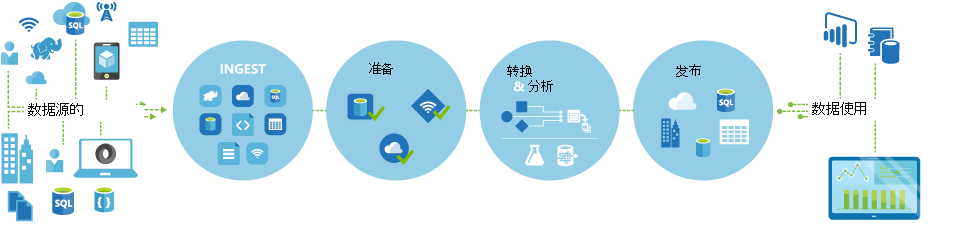

<properties 
    pageTitle="数据工厂，数据集成服务简介 |Microsoft Azure" 
    description="了解什么是 Azure 数据工厂︰ 协调和自动化移动和转换数据的云数据集成服务。" 
    keywords="数据集成，云数据集成，什么是 azure 数据工厂"
    services="data-factory" 
    documentationCenter="" 
    authors="sharonlo101" 
    manager="jhubbard" 
    editor="monicar"/>

<tags 
    ms.service="data-factory" 
    ms.workload="data-services" 
    ms.tgt_pltfrm="na" 
    ms.devlang="na" 
    ms.topic="get-started-article" 
    ms.date="09/22/2016" 
    ms.author="shlo"/>

# Azure 数据工厂服务，云中的数据集成服务简介

## 什么是 Azure 数据工厂？ 
数据工厂是协调和自动化**移动**和**转换**数据的基于云的数据集成服务。 您可以创建数据集成解决方案使用数据工厂服务可以接收各种数据存储区中的数据，转换/处理数据，并将结果数据发布到数据存储区。 

数据工厂服务允许您创建数据管道的移动和转换数据，并按照指定的时间表 （每小时、 每天、 每周等） 运行管道。 它还提供了丰富的可视化效果显示的沿袭和数据管线，之间的相关性并监视从单个的统一视图，可以方便地查明问题和设置监控警报的所有数据管道。

**图 1。** 接收来自各种数据源的数据、 准备、 转换，并分析数据，，然后发布消耗的现成数据。

## 管线和活动
在数据工厂解决方案中，您可以创建一个或多个数据**管道**。 管线是一种逻辑分组的活动。 他们习惯于到单元组合在一起执行任务的组活动。 

**活动**定义要对数据执行的操作。 例如，复制活动可用于将数据从一个数据存储区复制到另一个数据存储区。 同样，您可以使用运行配置单元查询转换或分析数据 Azure HDInsight 群集配置单元活动。 数据工厂支持两种类型的活动︰ 数据移动活动和数据转换活动。 
  
## 数据移动活动 
[AZURE.INCLUDE [data-factory-supported-data-stores](../../includes/data-factory-supported-data-stores.md)]

有关更多详细信息请参阅[数据移动活动](data-factory-data-movement-activities.md)文章。 

## 数据转换活动
[AZURE.INCLUDE [data-factory-transformation-activities](../../includes/data-factory-transformation-activities.md)]

有关更多详细信息请参阅[数据转换活动](data-factory-data-transformation-activities.md)文章。

如果您需要移动到中的数据的数据存储复制活动，不支持，或使用您自己的逻辑转换数据，创建**自定义的.NET 活动**。 有关创建和使用自定义活动的详细信息，请参阅[使用 Azure 数据工厂管道中的自定义活动](data-factory-use-custom-activities.md)。

## 链接的服务
链接的服务定义为连接到外部资源的数据工厂所需的信息 (示例︰ Azure 存储部署 SQL Server，Azure HDInsight)。 链接的服务用于数据工厂中的两个目的︰

- 表示**数据存储**包括但不是限于内部部署 SQL Server，Oracle 数据库文件共享或 Azure Blob 存储帐户。 请参阅列表支持的数据存储区的[数据移动活动](data-factory-data-movement-activities.md)部分。 
- 表示**计算资源**所能承载的活动的执行。 例如，HDInsightHive 活动在 HDInsight Hadoop 群集上运行。 请参阅[数据转换活动](data-factory-data-transformation-activities.md)部分列表支持的计算环境。 

## 数据集 
链接的服务链接到 Azure 数据工厂的数据存储区。 数据集表示的数据结构与数据存储区中。 例如，链接的 Azure 存储服务提供连接信息连接到 Azure 存储帐户的数据工厂。 Azure Blob 数据集指定管线应从中读取数据的 Azure Blob 存储区中的 blob 容器和文件夹。 同样，Azure SQL 链接服务提供 SQL Azure 数据库连接信息，SQL Azure 数据集指定包含数据的表。   

## 数据工厂实体之间的关系
数据工厂有几个关键实体，它们一起定义输入和输出数据，处理事件，并计划和执行所需的数据流所需的资源。

**图 2。** 数据集、 活动、 管道和链接服务之间的关系

与链接的服务、 数据集、 活动和管线的四个简单的概念，您就可以开始 ！ 您可以[创建您的第一个渠道](data-factory-build-your-first-pipeline.md)。 

## 支持的地区
目前，您可以创建数据工厂在**美国西部**、**东部美国**和**北欧**地区。 但是，数据工厂可以访问的数据存储和计算其他 Azure 的地区数据存储之间移动数据服务或使用的流程数据计算服务。 

Azure 数据工厂本身不存储任何数据。 它允许您创建数据驱动的流程协调[支持数据存储](data-factory-data-movement-activities.md#supported-data-stores)和处理的数据在其他地区还是在内部部署环境中使用[计算服务](data-factory-compute-linked-services.md)之间的数据移动。 它还允许您[监视和管理工作流](data-factory-monitor-manage-pipelines.md)使用编程和 UI 机制。 

即使 Azure 数据工厂位于**美国西部**、**东部美国**和**北欧**地区，关闭工厂数据中的数据移动服务是提供[全球](data-factory-data-movement-activities.md#global)多个地区。 如果数据存储在防火墙之后再[数据管理网关](data-factory-move-data-between-onprem-and-cloud.md)安装在您的内部环境移动数据。 

例如，让我们假设您的计算环境，如 Azure HDInsight 群集和 Azure 机器学习完了欧洲西部地区。 您可以创建并使用在北欧 Azure 数据工厂实例使用它来计划对您的计算环境中西欧的作业。 数据工厂为触发您的计算环境作业的几毫秒，但您的计算环境上运行作业的时间不会更改。

我们打算在将来支持 Azure 各地区将 Azure 数据工厂。
  
## 下一步行动
若要了解如何生成数据与数据管道的工厂，请在下面的教程按照循序渐进的说明。 

教程 | 说明
-------- | -----------
[生成数据管道处理使用 Hadoop 群集数据](data-factory-build-your-first-pipeline.md) | 在本教程中，您构建数据管道与您第一个 Azure 数据工厂**流程数据**通过 Azure HDInsight (Hadoop) 群集上运行脚本的配置单元。 |
[生成数据管道两个云数据存储之间移动数据](data-factory-copy-data-from-azure-blob-storage-to-sql-database.md) | 在本教程中，您创建数据工厂使用管道**移动数据**从 Blob 存储到 SQL 数据库。
[生成数据管道的内部数据存储和使用数据管理网关云数据存储区之间移动数据](data-factory-move-data-between-onprem-and-cloud.md) | 在本教程中，您构建与管线数据工厂，**移动数据**从**本地**SQL Server 数据库到 Azure 的 blob。 作为演练的一部分，安装和配置您的计算机上的数据管理网关。 
