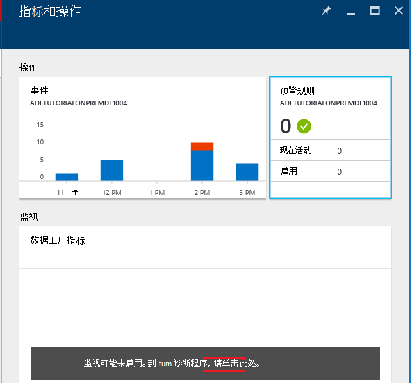

<properties 
    pageTitle="监视和管理 Azure 数据工厂管线" 
    description="了解如何使用 Azure 门户和 Azure PowerShell 来监视和管理 Azure 数据工厂和已创建的管线。" 
    services="data-factory" 
    documentationCenter="" 
    authors="spelluru" 
    manager="jhubbard" 
    editor="monicar"/>

<tags 
    ms.service="data-factory" 
    ms.workload="data-services" 
    ms.tgt_pltfrm="na" 
    ms.devlang="na" 
    ms.topic="article" 
    ms.date="09/06/2016" 
    ms.author="spelluru"/>

# 监视和管理 Azure 数据工厂管线
> [AZURE.SELECTOR]
- [使用 Azure 门户/Azure PowerShell](data-factory-monitor-manage-pipelines.md)
- [使用监视和管理应用程序](data-factory-monitor-manage-app.md)

数据工厂服务提供了可靠和完整视图存储、 处理和数据移动服务。 该服务为您提供了可用于执行以下任务的监视仪表板帮助︰ 

- 快速评估的端到端数据管道的运行状况。
- 发现问题，并采取纠正措施，如果需要。 
- 跟踪数据沿袭。 
- 跟踪在任何源数据之间的关系。
- 查看执行作业，系统运行状况和依赖项的完整历史记账。

本文介绍了如何监视、 管理和调试您的管线。 它还提供有关如何创建警报并获得通知有关故障的信息。

## 了解管线和活动状态
使用 Azure 的门户，您可以︰

- 以图表方式查看数据工厂
- 查看管道中的活动
- 查看输入和输出数据集
- 和更多。 

本部分还提供了如何切片从一个状态转换到另一状态。   

### 导航到数据工厂
1.  登录到[Azure 的门户](https://portal.azure.com)。
2.  在左侧的菜单中，单击**数据工厂**。 如果您看不到它，请单击**更多服务 >** **智能 + 分析**类别下单击**数据工厂**。 

    

    您应该会看到**数据工厂**刀片式服务器中的所有数据工厂。 
4. 中数据工厂刀片式服务器，请选择您感兴趣的数据工厂。

      
5.  您应看到主页上 （**数据工厂**刀片式服务器） 的数据工厂。

    

#### 关系图视图的数据工厂
数据工厂的关系图视图提供了单一的监视和管理数据工厂和它的资产。

要查看数据工厂的关系图视图，请单击数据工厂主页上**图**。

您可以放大、 缩小、 缩放以适合、 放大到 100%、 锁定该关系图的布局和自动定位管道和表。 您还可以查看数据沿袭信息 （显示选定项的上游和下游项目）。
 

### 在管线内的活动 
1. 用鼠标右键单击该管道，单击**打开管道**可以活动的输入和输出数据集以及管道中的所有活动。 当管道组成多个活动，并且想要了解一条管线运营沿袭，此功能非常有用。

      
2. 在下面的示例中，您将看到两个活动中通过它们的输入和输出管道。 在此管线中的示例是题为 HDInsight 配置单元活动类型的**JoinData**和**EgressDataAzure**的复制活动类型的活动。 
    
     
3. 您可以通过单击左上角的痕迹导航中的数据工厂链接导航回数据工厂的主页上。

    

### 在管线内的每个活动的视图状态
您可以通过查看任何的状态活动所产生的数据集查看活动的当前状态。 

例如︰ 在下面的示例中， **BlobPartitionHiveActivity**已成功运行并生成一个数据集，名为**PartitionedProductsUsageTable**，其中处于**就绪**状态。

双击**PartitionedProductsUsageTable**在关系图视图中展示了在管道内的不同活动运行所产生的所有扇区。 您可以看到**BlobPartitionHiveActivity**已成功运行每个月为过去八个月，生产**就绪**状态中的扇区。

数据集切片数据工厂中的可以具有以下状态之一︰

<table>
<tr>
    <th align="left">状态</th><th align="left">子状态</th><th align="left">说明</th>
</tr>
<tr>
    <td rowspan="8">等待</td><td>ScheduleTime</td><td>不，时代已经到来的切片来运行。</td>
</tr>
<tr>
<td>DatasetDependencies</td><td>上游的依赖项未准备就绪。</td>
</tr>
<tr>
<td>ComputeResources</td><td>计算资源将不可用。</td>
</tr>
<tr>
<td>ConcurrencyLimit</td> <td>所有活动实例都都忙于运行其它切片。</td>
</tr>
<tr>
<td>ActivityResume</td><td>活动已暂停，直至其恢复不能运行这些切片。</td>
</tr>
<tr>
<td>重试</td><td>活动执行重试。</td>
</tr>
<tr>
<td>验证</td><td>验证尚未开始。</td>
</tr>
<tr>
<td>ValidationRetry</td><td>正在等待要进行重试的验证。</td>
</tr>
<tr>
<tr
<td rowspan="2">正在进行</td><td>验证</td><td>正在验证。</td>
</tr>
<td></td>
<td>正在处理该切片。</td>
</tr>
<tr>
<td rowspan="4">失败</td><td>超时</td><td>执行比时间长，所允许的活动。</td>
</tr>
<tr>
<td>已取消</td><td>用户操作被取消。</td>
</tr>
<tr>
<td>验证</td><td>验证失败。</td>
</tr>
<tr>
<td></td><td>未能生成和/或验证该切片。</td>
</tr>
<td>准备就绪</td><td></td><td>该切片可供消耗。</td>
</tr>
<tr>
<td>跳过</td><td></td><td>未处理该切片。</td>
</tr>
<tr>
<td>无</td><td></td><td>一块用于存在具有不同的状态，但已被重置。</td>
</tr>
</table>

您可以通过单击切片入口**最近的扇区**刀片式服务器中查看切片有关的详细信息。

 
如果已经多次执行该扇区，则看到**活动运行**列表中的多个行。 您可以查看有关运行通过单击运行的该项**活动运行**列表中的活动的详细信息。 此列表显示所有日志文件，以及一条错误消息，如果有的话。 此功能可用于查看日志和调试日志，而无需离开您的数据工厂。

如果切片未处于**就绪**状态，您可以看到的上游片时，还没有准备好，并阻碍当前片从**上游都没有准备好的切片**列表中执行。 当切片处于**等待**状态，并且您希望了解在其等待切片的上游依赖项时，此功能非常有用。

### 数据集状态图
一旦部署数据工厂和管线具有有效的活动期间，数据集切片转换从一个状态到另一个。 目前切片状态将遵循下列状态关系图︰

数据集状态过渡流数据工厂中︰ 等待-> 中进度/进行中 （验证）-> 就绪/失败

扇区开始前在执行之前必须满足的条件为**等待**状态。 然后，活动开始执行切片都处于**进行中**状态。 活动执行可能成功或失败。 该扇区标记为**就绪**或**失败**基础执行的结果。 

您可以重置的扇区，若要返回从**准备好**或**失败**状态为**等待**状态。 可以将切片状态设置为**跳过**，这样可以防止执行活动并处理切片。

## 管理管道
您可以管理您使用 Azure PowerShell 的管道。 例如，可以暂停和继续运行 Azure PowerShell cmdlet 的管道。 

### 暂停和继续管线
您可以暂停/暂停使用**挂起 AzureRmDataFactoryPipeline** Powershell cmdlet 的管道。 此 cmdlet 非常有用，当您不想运行管线，直到问题得到解决。

例如︰ 在下面的屏幕快照中，已发现问题，与**PartitionProductsUsagePipeline**在**productrecgamalbox1dev**数据工厂和我们想要暂停的管道。

若要暂停管线，运行下面的 PowerShell 命令︰

    Suspend-AzureRmDataFactoryPipeline [-ResourceGroupName] <String> [-DataFactoryName] <String> [-Name] <String>

例如︰

    Suspend-AzureRmDataFactoryPipeline -ResourceGroupName ADF -DataFactoryName productrecgamalbox1dev -Name PartitionProductsUsagePipeline 

一旦与**PartitionProductsUsagePipeline**已修复此问题，可以通过运行下面的 PowerShell 命令继续挂起的管道︰

    Resume-AzureRmDataFactoryPipeline [-ResourceGroupName] <String> [-DataFactoryName] <String> [-Name] <String>

例如︰

    Resume-AzureRmDataFactoryPipeline -ResourceGroupName ADF -DataFactoryName productrecgamalbox1dev -Name PartitionProductsUsagePipeline 

## 调试的管道
Azure 数据工厂提供了丰富的功能，通过 Azure 门户和 Azure PowerShell 进行调试和排除故障的管线。

### 在管道中查找错误
如果活动运行失败在管道中，管道所产生的数据集处于故障错误状态。 您可以调试并解决 Azure 数据工厂使用以下机制中的错误。

#### 使用 Azure 门户网站调试错误︰

3.  在**表**刀片式服务器，单击**状态**设置为**失败**问题切片。

    
4.  在**数据切片**刀片式服务器，单击运行失败的活动。
    
    
5.  在**活动运行详细信息**刀片式服务器，您可以下载 HDInsight 处理相关联的文件。 单击下载的状态/stderr 下载错误日志文件，其中包含有关该错误的详细信息。

      

#### 使用 PowerShell 调试错误
1.  启动**Azure PowerShell**。
3.  运行**Get AzureRmDataFactorySlice**命令来查看切片和及其状态。 您应该会看到一块状态︰**失败**。       

            Get-AzureRmDataFactorySlice [-ResourceGroupName] <String> [-DataFactoryName] <String> [-TableName] <String> [-StartDateTime] <DateTime> [[-EndDateTime] <DateTime> ] [-Profile <AzureProfile> ] [ <CommonParameters>]
    
    例如︰
        
            Get-AzureRmDataFactorySlice -ResourceGroupName ADF -DataFactoryName LogProcessingFactory -TableName EnrichedGameEventsTable -StartDateTime 2014-05-04 20:00:00

    **开始日期时间**替换为组 AzureRmDataFactoryPipelineActivePeriod 指定的开始日期时间值。
4. 现在，运行**Get AzureRmDataFactoryRun**用于获取有关运行切片的活动详细信息。

        Get-AzureRmDataFactoryRun [-ResourceGroupName] <String> [-DataFactoryName] <String> [-TableName] <String> [-StartDateTime] 
        <DateTime> [-Profile <AzureProfile> ] [ <CommonParameters>]
    
    例如︰

        Get-AzureRmDataFactoryRun -ResourceGroupName ADF -DataFactoryName LogProcessingFactory -TableName EnrichedGameEventsTable -StartDateTime "5/5/2014 12:00:00 AM"

    开始日期时间值为上一步中记下该错误/问题切片的开始时间。 日期-时间应括在双引号中。
5.  您应该看到的输出 （类似于以下） 错误详细信息︰

            Id                      : 841b77c9-d56c-48d1-99a3-8c16c3e77d39
            ResourceGroupName       : ADF
            DataFactoryName         : LogProcessingFactory3
            TableName               : EnrichedGameEventsTable
            ProcessingStartTime     : 10/10/2014 3:04:52 AM
            ProcessingEndTime       : 10/10/2014 3:06:49 AM
            PercentComplete         : 0
            DataSliceStart          : 5/5/2014 12:00:00 AM
            DataSliceEnd            : 5/6/2014 12:00:00 AM
            Status                  : FailedExecution
            Timestamp               : 10/10/2014 3:04:52 AM
            RetryAttempt            : 0
            Properties              : {}
            ErrorMessage            : Pig script failed with exit code '5'. See wasb://     adfjobs@spestore.blob.core.windows.net/PigQuery
                                            Jobs/841b77c9-d56c-48d1-99a3-
                        8c16c3e77d39/10_10_2014_03_04_53_277/Status/stderr' for
                        more details.
            ActivityName            : PigEnrichLogs
            PipelineName            : EnrichGameLogsPipeline
            Type                    :
    
    
6.  您可以使用 Id 值从输出中看到和使用 cmdlet **-DownloadLogsoption**日志文件下载运行**保存 AzureRmDataFactoryLog** cmdlet。

            Save-AzureRmDataFactoryLog -ResourceGroupName "ADF" -DataFactoryName "LogProcessingFactory" -Id "841b77c9-d56c-48d1-99a3-8c16c3e77d39" -DownloadLogs -Output "C:\Test"

## 在管道中重新运行失败

### 使用 Azure 门户

一旦诊断和调试在管道中的故障，您可以通过导航到该错误扇区并单击命令栏上的**运行**按钮重新运行失败。

在切片由于策略失败的验证失败的情况下 (为 ex︰ 数据不可用)，可以修复故障，并通过单击命令栏上的**验证**按钮来重新验证。

### 使用 Azure PowerShell

通过使用一组 AzureRmDataFactorySliceStatus cmdlet，您可以重新运行失败。 请参阅有关语法[设置 AzureRmDataFactorySliceStatus](https://msdn.microsoft.com/library/mt603522.aspx)主题和有关该 cmdlet 的其他详细信息。 

**示例︰**下面的示例设置的状态表的所有扇区 'DAWikiAggregatedData' '等待' 在 Azure 数据工厂 'WikiADF'。

UpdateType 设置为 UpstreamInPipeline，这意味着，每个扇区表和所有相关的 （上游） 表的状态设置为"等待"。 其他可能的值，此参数是"个人"。

    Set-AzureRmDataFactorySliceStatus -ResourceGroupName ADF -DataFactoryName WikiADF -TableName DAWikiAggregatedData -Status Waiting -UpdateType UpstreamInPipeline -StartDateTime 2014-05-21T16:00:00 -EndDateTime 2014-05-21T20:00:00

## 创建通知
Azure 日志用户事件时 Azure 的资源 （例如，一个数据工厂） 是创建、 更新或删除。 在这些事件上，您可以创建警报。 数据工厂允许您捕获各种标准和指标创建通知。 我们建议您将事件用于实时监控和度量作为历史记录。 

### 有关事件通知
Azure 事件提供了有用的见解在 Azure 资源发生了什么。 Azure 日志用户事件时 Azure 的资源 （例如，一个数据工厂） 是创建、 更新或删除。 当使用 Azure 数据工厂时，会生成事件时︰

- Azure 数据工厂是创建/更新/删除。
- 数据处理 （运行时称为） 已开始/完成。
- 按需 HDInsight 群集创建和删除。

可以创建警报，这些用户事件上，并将其配置为向管理员和订阅的联管理员发送电子邮件通知。 此外，您还可以指定其他电子邮件地址的用户需要在满足条件时收到电子邮件通知。 想要获得通知有关故障并不需要连续地监视数据工厂时，此功能非常有用。

> [AZURE.NOTE] 目前，门户将不显示警报事件。 使用[监视和管理应用程序](data-factory-monitor-manage-app.md)来查看所有通知。

#### 指定警报定义︰
若要指定警报定义，您创建一个描述您想要得到预警上的操作的 JSON 文件。 在下面的示例中，警报将发送电子邮件通知 RunFinished 操作。 要具体，发送电子邮件通知是在完成数据工厂中的运行并且运行失败 (状态 = FailedExecution)。

    {
        "contentVersion": "1.0.0.0",
         "$schema": "http://schema.management.azure.com/schemas/2014-04-01-preview/deploymentTemplate.json#",
        "parameters": {},
        "resources": 
        [
            {
                "name": "ADFAlertsSlice",
                "type": "microsoft.insights/alertrules",
                "apiVersion": "2014-04-01",
                "location": "East US",
                "properties": 
                {
                    "name": "ADFAlertsSlice",
                    "description": "One or more of the data slices for the Azure Data Factory has failed processing.",
                    "isEnabled": true,
                    "condition": 
                    {
                        "odata.type": "Microsoft.Azure.Management.Insights.Models.ManagementEventRuleCondition",
                        "dataSource": 
                        {
                            "odata.type": "Microsoft.Azure.Management.Insights.Models.RuleManagementEventDataSource",
                            "operationName": "RunFinished",
                            "status": "Failed",
                            "subStatus": "FailedExecution"   
                        }
                    },
                    "action": 
                    {
                        "odata.type": "Microsoft.Azure.Management.Insights.Models.RuleEmailAction",
                        "customEmails": [ "<your alias>@contoso.com" ]
                    }
                }
            }
        ]
    }

从 JSON 定义，如果不想在特定的故障发出警报，则可以删除**子状态**。

本示例设置在您的订阅中的所有数据工厂的通知。 如果您想要为特定数据工厂设置警报，您可以指定在**数据源**中的数据工厂**resourceUri** :

    "resourceUri" : "/SUBSCRIPTIONS/<subscriptionId>/RESOURCEGROUPS/<resourceGroupName>/PROVIDERS/MICROSOFT.DATAFACTORY/DATAFACTORIES/<dataFactoryName>"

下表列出的可用操作和状态 （和子状态）。

操作名称 | 状态 | 子状态
-------------- | ------ | ----------
RunStarted | 启动 | 启动
RunFinished | 失败 / 成功 | FailedResourceAllocation  成功  FailedExecution  超时  < 取消  FailedValidation  放弃
OnDemandClusterCreateStarted | 启动
OnDemandClusterCreateSuccessful | 成功
OnDemandClusterDeleted | 成功

有关示例中使用 JSON 元素的详细信息，请参阅[创建预警规则](https://msdn.microsoft.com/library/azure/dn510366.aspx)。 

#### 部署该警报 
若要部署此警报，请使用 Azure PowerShell cmdlet:**新建 AzureRmResourceGroupDeployment**，如下面的示例所示︰

    New-AzureRmResourceGroupDeployment -ResourceGroupName adf -TemplateFile .\ADFAlertFailedSlice.json  

已成功完成资源组部署后，您会看到以下消息︰

    VERBOSE: 7:00:48 PM - Template is valid.
    WARNING: 7:00:48 PM - The StorageAccountName parameter is no longer used and will be removed in a future release.
    Please update scripts to remove this parameter.
    VERBOSE: 7:00:49 PM - Create template deployment 'ADFAlertFailedSlice'.
    VERBOSE: 7:00:57 PM - Resource microsoft.insights/alertrules 'ADFAlertsSlice' provisioning status is succeeded
    
    DeploymentName    : ADFAlertFailedSlice
    ResourceGroupName : adf
    ProvisioningState : Succeeded
    Timestamp         : 10/11/2014 2:01:00 AM
    Mode              : Incremental
    TemplateLink      :
    Parameters        :
    Outputs           :

> [AZURE.NOTE] [创建警报规则](https://msdn.microsoft.com/library/azure/dn510366.aspx)REST API，可用于创建预警规则。 JSON 负载是与 JSON 的示例类似。  

#### 正在检索列表的 Azure 资源组部署
若要检索已部署的 Azure 资源组部署的列表，请使用 cmdlet:**获取 AzureRmResourceGroupDeployment**，如下面的示例所示︰

    Get-AzureRmResourceGroupDeployment -ResourceGroupName adf
    
    DeploymentName    : ADFAlertFailedSlice
    ResourceGroupName : adf
    ProvisioningState : Succeeded
    Timestamp         : 10/11/2014 2:01:00 AM
    Mode              : Incremental
    TemplateLink      :
    Parameters        :
    Outputs           :

#### 用户事件的故障排除

1. 您可以查看单击**指标和操作**铺后生成的所有事件。

    

2. 单击要查看的事件的**事件**拼贴。 

    
3. 在**事件**刀片式服务器，可以有关事件的详细信息，请参阅、 筛选事件，等等。 

    
4. 单击**操作**将导致错误的操作列表中。
    
     
5. 单击以查看有关该错误的详细信息的**错误**事件。

    
  

请参阅[Azure 的见解 Cmdlet](https://msdn.microsoft.com/library/mt282452.aspx)文章的 PowerShell cmdlet，您可以使用添加/get/删除警报。 下面是使用**Get AlertRule** cmdlet 的几个示例︰ 

    PS C:\> get-alertrule -res $resourceGroup -n ADFAlertsSlice -det
        
            Properties :
            Action      : Microsoft.Azure.Management.Insights.Models.RuleEmailAction
            Condition   :
            DataSource :
            EventName             :
            Category              :
            Level                 :
            OperationName         : RunFinished
            ResourceGroupName     :
            ResourceProviderName  :
            ResourceId            :
            Status                : Failed
            SubStatus             : FailedExecution
            Claims                : Microsoft.Azure.Management.Insights.Models.RuleManagementEventClaimsDataSource
            Condition   :
            Description : One or more of the data slices for the Azure Data Factory has failed processing.
            Status      : Enabled
            Name:       : ADFAlertsSlice
            Tags       :
            $type          : Microsoft.WindowsAzure.Management.Common.Storage.CasePreservedDictionary, Microsoft.WindowsAzure.Management.Common.Storage
            Id: /subscriptions/<subscription ID>/resourceGroups/<resource group name>/providers/microsoft.insights/alertrules/ADFAlertsSlice
            Location   : West US
            Name       : ADFAlertsSlice
    
    PS C:\> Get-AlertRule -res $resourceGroup

            Properties : Microsoft.Azure.Management.Insights.Models.Rule
            Tags       : {[$type, Microsoft.WindowsAzure.Management.Common.Storage.CasePreservedDictionary, Microsoft.WindowsAzure.Management.Common.Storage]}
            Id         : /subscriptions/<subscription id>/resourceGroups/<resource group name>/providers/microsoft.insights/alertrules/FailedExecutionRunsWest0
            Location   : West US
            Name       : FailedExecutionRunsWest0
    
            Properties : Microsoft.Azure.Management.Insights.Models.Rule
            Tags       : {[$type, Microsoft.WindowsAzure.Management.Common.Storage.CasePreservedDictionary, Microsoft.WindowsAzure.Management.Common.Storage]}
            Id         : /subscriptions/<subscription id>/resourceGroups/<resource group name>/providers/microsoft.insights/alertrules/FailedExecutionRunsWest3
            Location   : West US
            Name       : FailedExecutionRunsWest3

    PS C:\> Get-AlertRule -res $resourceGroup -Name FailedExecutionRunsWest0
    
            Properties : Microsoft.Azure.Management.Insights.Models.Rule
            Tags       : {[$type, Microsoft.WindowsAzure.Management.Common.Storage.CasePreservedDictionary, Microsoft.WindowsAzure.Management.Common.Storage]}
            Id         : /subscriptions/<subscription id>/resourceGroups/<resource group name>/providers/microsoft.insights/alertrules/FailedExecutionRunsWest0
            Location   : West US
            Name       : FailedExecutionRunsWest0

运行详细信息和获取 AlertRule cmdlet 的示例，请参阅以下获取帮助命令。 

    get-help Get-AlertRule -detailed 
    get-help Get-AlertRule -examples

- 如果您看到门户刀片式服务器上的警报生成事件，但没有收到电子邮件通知，请检查是否设置指定电子邮件地址以接收来自外部发件人的电子邮件。 预警电子邮件可能会被阻止的电子邮件设置。

### 指标预警
数据工厂允许您捕获各种标准和指标创建通知。 您可以监视并在数据工厂以下指标用于切片上创建通知。
 
- 失败的运行
- 成功运行

这些指标非常有用，您可在其数据工厂得到概述整体失败和成功运行。 每次一片运行发出的指标。 On top of 小时，这些衡量标准进行聚合和推到您的存储帐户。 因此，若要启用度量值，请设置存储帐户。

#### 启用度量标准︰
要启用度量，请单击以下数据工厂刀片式服务器︰

**监视** -> **指标** -> **诊断设置** -> **诊断**

**诊断**刀片式服务器，**请单击**并选择存储帐户并保存。

保存后，可能需要最多一小时的度量标准，因为指标聚合是每小时要监视刀片式服务器，可见。

### 设置警报的度量标准︰

请单击**数据工厂指标**刀片式服务器︰ 

在**指标**刀片式服务器，单击**+ 添加通知**工具栏上的。 

在**预警规则中添加**页上，请执行以下步骤，然后单击**确定**。
 
- 为该警报输入一个名称 (示例︰ 失败警报)。
- 输入该通知的说明 (示例︰ 发送电子邮件，在出现故障时)。
- 选择的度量 （成功运行与故障运行）。
- 指定一个条件和一个门限值。   
- 指定的期间。 
- 指定是否应为所有者、 参与者和读者发送一封电子邮件。
- 和更多。 

一旦成功添加的预警规则，则关闭刀片式服务器和**公制**页上看到新的警报。 

您还会看到**警报**图块上的警报的数量。 单击**警报**拼贴。

在**警报**刀片式服务器，您将看到任何现有的警报。 若要添加警报，单击工具栏上的**添加通知**。

### 警报通知︰
一旦与条件匹配时的预警规则，您应该获取激活的电子邮件警报。 一旦问题得到解决，预警的条件不匹配任何更多，您获得解析的电子邮件警报。

这种行为是不同的事件，每个失败时发送一条通知满足哪些预警规则。

### 部署使用 PowerShell 的警报
那样的事件，您可以以相同的方式部署预警指标。 

**警报定义︰**

    {
        "contentVersion" : "1.0.0.0",
        "$schema" : "http://schema.management.azure.com/schemas/2014-04-01-preview/deploymentTemplate.json#",
        "parameters" : {},
        "resources" : [
        {
                "name" : "FailedRunsGreaterThan5",
                "type" : "microsoft.insights/alertrules",
                "apiVersion" : "2014-04-01",
                "location" : "East US",
                "properties" : {
                    "name" : "FailedRunsGreaterThan5",
                    "description" : "Failed Runs greater than 5",
                    "isEnabled" : true,
                    "condition" : {
                        "$type" : "Microsoft.WindowsAzure.Management.Monitoring.Alerts.Models.ThresholdRuleCondition, Microsoft.WindowsAzure.Management.Mon.Client",
                        "odata.type" : "Microsoft.Azure.Management.Insights.Models.ThresholdRuleCondition",
                        "dataSource" : {
                            "$type" : "Microsoft.WindowsAzure.Management.Monitoring.Alerts.Models.RuleMetricDataSource, Microsoft.WindowsAzure.Management.Mon.Client",
                            "odata.type" : "Microsoft.Azure.Management.Insights.Models.RuleMetricDataSource",
                            "resourceUri" : "/SUBSCRIPTIONS/<subscriptionId>/RESOURCEGROUPS/<resourceGroupName
    >/PROVIDERS/MICROSOFT.DATAFACTORY/DATAFACTORIES/<dataFactoryName>",
                            "metricName" : "FailedRuns"
                        },
                        "threshold" : 5.0,
                        "windowSize" : "PT3H",
                        "timeAggregation" : "Total"
                    },
                    "action" : {
                        "$type" : "Microsoft.WindowsAzure.Management.Monitoring.Alerts.Models.RuleEmailAction, Microsoft.WindowsAzure.Management.Mon.Client",
                        "odata.type" : "Microsoft.Azure.Management.Insights.Models.RuleEmailAction",
                        "customEmails" : ["abhinav.gpt@live.com"]
                    }
                }
            }
        ]
    }
 
SubscriptionId、 resourceGroupName 和 dataFactoryName 示例中的替换为适当的值。

*metricName*目前支持两种值︰
- FailedRuns
- SuccessfulRuns

**部署此警报︰**

若要部署此警报，请使用 Azure PowerShell cmdlet:**新建 AzureRmResourceGroupDeployment**，如下面的示例所示︰

    New-AzureRmResourceGroupDeployment -ResourceGroupName adf -TemplateFile .\FailedRunsGreaterThan5.json

您应该看到成功部署后以下消息︰

    VERBOSE: 12:52:47 PM - Template is valid.
    VERBOSE: 12:52:48 PM - Create template deployment 'FailedRunsGreaterThan5'.
    VERBOSE: 12:52:55 PM - Resource microsoft.insights/alertrules 'FailedRunsGreaterThan5' provisioning status is succeeded
    
    
    DeploymentName    : FailedRunsGreaterThan5
    ResourceGroupName : adf
    ProvisioningState : Succeeded
    Timestamp         : 7/27/2015 7:52:56 PM
    Mode              : Incremental
    TemplateLink      :
    Parameters        :
    Outputs           

您可以使用**添加 AlertRule** cmdlet 部署预警规则。 请参阅[添加 AlertRule](https://msdn.microsoft.com/library/mt282468.aspx)详细信息和示例的主题。  

## 移动到不同的资源组或订阅数据工厂
数据工厂的主页上使用的**移动**命令栏按钮可以移动到不同的资源组或其他订阅的数据工厂。 

此外可以与数据工厂一起移动任何相关的资源 （例如数据工厂相关联的警报）。

