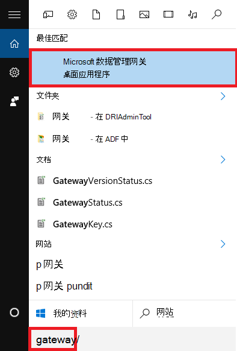
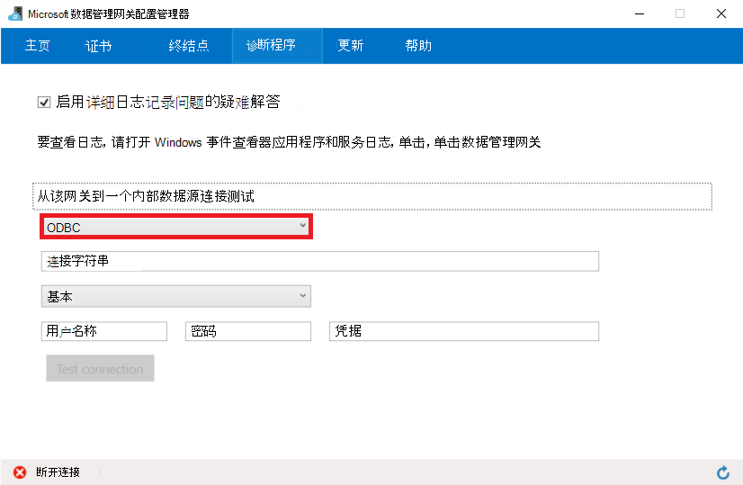

<properties 
    pageTitle="从 ODBC 数据存储移动数据 |Azure 数据工厂" 
    description="了解如何将数据从 ODBC 数据存储使用 Azure 数据工厂移动。" 
    services="data-factory" 
    documentationCenter="" 
    authors="linda33wj" 
    manager="jhubbard" 
    editor="monicar"/>

<tags 
    ms.service="data-factory" 
    ms.workload="data-services" 
    ms.tgt_pltfrm="na" 
    ms.devlang="na" 
    ms.topic="article" 
    ms.date="09/12/2016" 
    ms.author="jingwang"/>

# 移动数据从 ODBC 数据存储使用 Azure 数据工厂
这篇文章概括介绍了如何使用复制活动在 Azure 数据工厂将数据从一个内部部署 ODBC 数据存储区移动到另一个数据存储区。 本文基于[数据移动活动](data-factory-data-movement-activities.md)文章，概要介绍了数据移动提供副本的活动和受支持的数据存储区的组合。

数据工厂目前支持内部部署 ODBC 数据存储区中的其他数据存储的唯一移动的数据。 它不支持将数据从其他数据存储到内部部署 ODBC 数据存储区。

## 启用连接
数据工厂服务支持连接到内部部署 ODBC 源使用数据管理网关。 请查看[内部位置和云之间移动数据](data-factory-move-data-between-onprem-and-cloud.md)文章以了解有关数据管理网关和网关设置的分步指导。 使用网关连接到 ODBC 数据存储，即使它位于 Azure IaaS VM 中。 

可以作为 ODBC 数据存储区所在的本地计算机或 Azure 虚拟机上安装网关。 但是，我们建议您安装网关，在单独的计算机/Azure IaaS VM 避免资源争用和更好的性能。 在网关安装在单独的计算机上时，计算机应该能够访问与 ODBC 数据存储的计算机。 

除了数据管理网关，您还需要网关计算机上安装的 ODBC 驱动程序的数据存储区。 

> [AZURE.NOTE] 请参阅故障排除连接/网关版的提示[疑难解答网关问题](data-factory-data-management-gateway.md#troubleshoot-gateway-issues)相关的问题。 

## 复制数据向导
创建管线从 ODBC 源复制数据的最简便方法是使用复制数据向导。 请参阅[教程︰ 创建管线使用复制向导](data-factory-copy-data-wizard-tutorial.md)上创建管道使用复制数据向导快速演练。 

下面的示例提供了示例 JSON 定义可用于通过使用[Azure 门户](data-factory-copy-activity-tutorial-using-azure-portal.md)或[Visual Studio](data-factory-copy-activity-tutorial-using-visual-studio.md)或[Azure PowerShell](data-factory-copy-activity-tutorial-using-powershell.md)创建管线。 它们显示了如何将数据从 ODBC 源复制到 Azure Blob 存储。 但是，数据可复制到任何接收器规定[此处](data-factory-data-movement-activities.md#supported-data-stores)在 Azure 数据工厂中使用复制活动。

## 示例︰ 将数据从 ODBC 数据存储区复制到 Azure Blob

此示例演示如何将数据从 ODBC 数据存储区复制到 Azure Blob 存储。 但是，数据可以复制**直接**对任何接收器规定[此处](data-factory-data-movement-activities.md#supported-data-stores)在 Azure 数据工厂中使用复制活动。  
 
此示例具有以下数据工厂实体︰

1.  链接的类型[OnPremisesOdbc](#odbc-linked-service-properties)的服务。
2.  链接的类型[AzureStorage](data-factory-azure-blob-connector.md#azure-storage-linked-service-properties)的服务。
3.  [RelationalTable](#odbc-dataset-type-properties)类型的输入的[数据集](data-factory-create-datasets.md)。
4.  类型[AzureBlob](data-factory-azure-blob-connector.md#azure-blob-dataset-type-properties)的输出[数据集](data-factory-create-datasets.md)。
4.  [管线](data-factory-create-pipelines.md)与使用[RelationalSource](#odbc-copy-activity-type-properties)和[BlobSink](data-factory-azure-blob-connector.md#azure-blob-copy-activity-type-properties)的复制活动。

该示例将数据从 ODBC 数据存储区中的查询结果对 blob 每隔一小时。 在这些示例中使用的 JSON 属性详见以下示例部分。 

作为第一步，设置数据管理网关。 在[内部部署位置和云之间移动数据](data-factory-move-data-between-onprem-and-cloud.md)的文章的说明。 

**ODBC 链接服务**此示例使用基本身份验证。 为不同类型的可以使用的身份验证，请参见[ODBC 链接服务](#odbc-linked-service-properties)部分。 

    {
        "name": "OnPremOdbcLinkedService",
        "properties":
        {
            "type": "OnPremisesOdbc",
            "typeProperties":
            {
                "authenticationType": "Basic",
                "connectionString": "Driver={SQL Server};Server=Server.database.windows.net; Database=TestDatabase;",
                "userName": "username",
                "password": "password",
                "gatewayName": "mygateway"
            }
        }
    }

**Azure 存储链接服务**

    {
      "name": "AzureStorageLinkedService",
      "properties": {
        "type": "AzureStorage",
        "typeProperties": {
          "connectionString": "DefaultEndpointsProtocol=https;AccountName=<accountname>;AccountKey=<accountkey>"
        }
      }
    }

**ODBC 输入数据集**

该示例假设您已在 ODBC 数据库中创建表"MyTable"和它包含名为"timestampcolumn"的时间系列数据的列。

设置为"外部":"真正的"通知数据工厂服务数据集外部数据工厂并不由数据工厂中的活动。
    
    {
        "name": "ODBCDataSet",
        "properties": {
            "published": false,
            "type": "RelationalTable",
            "linkedServiceName": "OnPremOdbcLinkedService",
            "typeProperties": {},
            "availability": {
                "frequency": "Hour",
                "interval": 1
            },
            "external": true,
            "policy": {
                "externalData": {
                    "retryInterval": "00:01:00",
                    "retryTimeout": "00:10:00",
                    "maximumRetry": 3
                }
            }
        }
    }

**Azure Blob 输出数据集**

数据写入到新的斑点每小时 (频率︰ 小时、 间隔︰ 1)。 该 blob 的文件夹路径动态计算基于切片所处理的开始时间。 使用文件夹路径的年、 月、 日和小时部分的开始时间。

    {
        "name": "AzureBlobOdbcDataSet",
        "properties": {
            "type": "AzureBlob",
            "linkedServiceName": "AzureStorageLinkedService",
            "typeProperties": {
                "folderPath": "mycontainer/odbc/yearno={Year}/monthno={Month}/dayno={Day}/hourno={Hour}",
                "format": {
                    "type": "TextFormat",
                    "rowDelimiter": "\n",
                    "columnDelimiter": "\t"
                },
                "partitionedBy": [
                    {
                        "name": "Year",
                        "value": {
                            "type": "DateTime",
                            "date": "SliceStart",
                            "format": "yyyy"
                        }
                    },
                    {
                        "name": "Month",
                        "value": {
                            "type": "DateTime",
                            "date": "SliceStart",
                            "format": "MM"
                        }
                    },
                    {
                        "name": "Day",
                        "value": {
                            "type": "DateTime",
                            "date": "SliceStart",
                            "format": "dd"
                        }
                    },
                    {
                        "name": "Hour",
                        "value": {
                            "type": "DateTime",
                            "date": "SliceStart",
                            "format": "HH"
                        }
                    }
                ]
            },
            "availability": {
                "frequency": "Hour",
                "interval": 1
            }
        }
    }

**管线与复制活动**

管线包含被配置为使用这些输入和输出的数据集，并计划每小时运行一次的复制活动。 在管线 JSON 定义中，将**源**类型设置为**RelationalSource** ，**接收器**类型设置为**BlobSink**。 **查询**属性指定的 SQL 查询选择过去小时要复制的数据。
    
    {
        "name": "CopyODBCToBlob",
        "properties": {
            "description": "pipeline for copy activity",
            "activities": [
                {
                    "type": "Copy",
                    "typeProperties": {
                        "source": {
                            "type": "RelationalSource",
                            "query": "$$Text.Format('select * from MyTable where timestamp >= \\'{0:yyyy-MM-ddTHH:mm:ss}\\' AND timestamp < \\'{1:yyyy-MM-ddTHH:mm:ss}\\'', WindowStart, WindowEnd)"
                        },
                        "sink": {
                            "type": "BlobSink",
                            "writeBatchSize": 0,
                            "writeBatchTimeout": "00:00:00"
                        }
                    },
                    "inputs": [
                        {
                            "name": "OdbcDataSet"
                        }
                    ],
                    "outputs": [
                        {
                            "name": "AzureBlobOdbcDataSet"
                        }
                    ],
                    "policy": {
                        "timeout": "01:00:00",
                        "concurrency": 1
                    },
                    "scheduler": {
                        "frequency": "Hour",
                        "interval": 1
                    },
                    "name": "OdbcToBlob"
                }
            ],
            "start": "2014-06-01T18:00:00Z",
            "end": "2014-06-01T19:00:00Z"
        }
    }

## ODBC 链接服务属性

下表提供了说明 JSON 元素特定于 ODBC 链接服务。

| 属性 | 说明 | 必填 |
| -------- | ----------- | -------- | 
| 类型 | 类型属性必须设置为︰ **OnPremisesOdbc** | 是的 |
| 连接字符串 | 在连接字符串和可选的加密的凭据非访问凭据部分中。 请参阅以下各节中的示例。 | 是的
| 凭据 | 访问凭据指定特定于驱动程序的属性值格式的连接字符串的一部分。 示例:"Uid =<user ID>;Pwd =<password>;RefreshToken =<secret refresh token>;"。 | 不
| authenticationType | 用于连接到 ODBC 数据存储的身份验证类型。 可能的值包括︰ 匿名和基本。 | 是的 | 
| 用户名 | 如果您使用的基本身份验证，请指定用户名。 | 不 | 
| 密码 | 指定对您指定的用户名的用户帐户的密码。 | 不 | 
| gatewayName | 数据工厂服务连接到 ODBC 数据存储区应使用的网关的名称。 | 是的 |

请参阅[设置凭据和安全](data-factory-move-data-between-onprem-and-cloud.md#set-credentials-and-security)有关的详细信息设置凭据对于内部部署 ODBC 数据存储。

### 使用基本身份验证

    {
        "name": "odbc",
        "properties":
        {
            "type": "OnPremisesOdbc",
            "typeProperties":
            {
                "authenticationType": "Basic",
                "connectionString": "Driver={SQL Server};Server=Server.database.windows.net; Database=TestDatabase;",
                "userName": "username",
                "password": "password",
                "gatewayName": "mygateway"
            }
        }
    }

### 使用加密凭据使用基本身份验证
可以使用[新建 AzureRMDataFactoryEncryptValue](https://msdn.microsoft.com/library/mt603802.aspx) （Azure PowerShell 1.0 版） cmdlet 或[新建 AzureDataFactoryEncryptValue](https://msdn.microsoft.com/library/dn834940.aspx) （Azure PowerShell 的 0.9 或更早版本） 的凭据进行加密。  

    {
        "name": "odbc",
        "properties":
        {
            "type": "OnPremisesOdbc",
            "typeProperties":
            {
                "authenticationType": "Basic",
                "connectionString": "Driver={SQL Server};Server=myserver.database.windows.net; Database=TestDatabase;;EncryptedCredential=eyJDb25uZWN0...........................",
                "gatewayName": "mygateway"
            }
        }
    }

### 使用匿名身份验证

    {
        "name": "odbc",
        "properties":
        {
            "type": "OnPremisesOdbc",
            "typeProperties":
            {
                "authenticationType": "Anonymous",
                "connectionString": "Driver={SQL Server};Server={servername}.database.windows.net; Database=TestDatabase;",
                "credential": "UID={uid};PWD={pwd}",
                "gatewayName": "mygateway"
            }
        }
    }

## ODBC 数据集类型属性

部分和属性可用于定义数据集的完整列表，请参阅文章[创建数据集](data-factory-create-datasets.md)。 节如结构、 可用性和 JSON 数据集策略为所有的数据集类型 (Azure SQL，Azure blob，Azure 表，等等。) 相近。

**TypeProperties**节对于每种类型的数据集是不同的并提供有关的数据存储区中的数据位置的信息。 TypeProperties 部分类型**RelationalTable** （其中包括 ODBC 数据集） 的数据集具有以下属性

| 属性 | 说明 | 必填 |
| -------- | ----------- | -------- |
| 表名 | ODBC 数据存储区中的表的名称。 | 是的 | 

## ODBC 复制活动类型属性

节和可用于定义活动属性的完整列表，请参阅[创建管线](data-factory-create-pipelines.md)文章。 属性，例如名称、 说明、 输入和输出表和策略都可用于所有类型的活动。 

该活动的**typeProperties**部分中可用的属性在另一方面随每种活动类型。 对于复制活动，它们因种源和接收器。

在复制活动中，当源类型**RelationalSource** （其中包括 ODBC），下列属性部分提供了 typeProperties:

| 属性 | 说明 | 允许的值 | 必填 |
| -------- | ----------- | -------------- | -------- |
| 查询 | 使用自定义查询中读取数据。 | SQL 查询字符串。 例如︰ 选择 * 从 MyTable。 | 是的 | 

[AZURE.INCLUDE [data-factory-structure-for-rectangualr-datasets](../../includes/data-factory-structure-for-rectangualr-datasets.md)]

### 对于 ODBC 类型映射

如[数据移动活动](data-factory-data-movement-activities.md)文章中提到，复制活动执行自动类型转换来水池下面两个方法的类型的源类型︰

1. 从本机源类型转换为.NET 类型
2. 从.NET 类型转换为本机的接收器类型

当从 ODBC 数据移动数据存储时，ODBC 数据类型映射到.NET 类型的[ODBC 数据类型映射](https://msdn.microsoft.com/library/cc668763.aspx)主题中所述。

[AZURE.INCLUDE [data-factory-column-mapping](../../includes/data-factory-column-mapping.md)]

[AZURE.INCLUDE [data-factory-type-repeatability-for-relational-sources](../../includes/data-factory-type-repeatability-for-relational-sources.md)]

## GE 历史学家商店
创建 ODBC 链接服务链接到 Azure 数据工厂的[GE Proficy 历史学家 （现在是 GE 历史学家）](http://www.geautomation.com/products/proficy-historian)数据存储区，如下面的示例所示︰ 

    {
        "name": "HistorianLinkedService",
        "properties":
        {
            "type": "OnPremisesOdbc",
            "typeProperties":
            {
                "connectionString": "DSN=<name of the GE Historian store>",
                "gatewayName": "<gateway name>",
                "authenticationType": "Basic",
                "userName": "<user name>",
                "password": "<password>"
            }
        }
    }

在本地计算机上安装数据管理网关并注册该门户网关。 安装在本地计算机上的网关使用 GE 史学家的 ODBC 驱动程序来连接到 GE 历史学家数据存储区。 如果它不在网关计算机上已安装，因此，安装驱动程序。 有关详细信息，请参见[启用连接](#enabling-connectivity)部分。

使用 GE 历史学家商店数据工厂解决方案中的之前，验证该网关是否可以连接到数据存储区使用下一节中说明。 

有关的详细概述从头一文使用 ODBC 数据将存储为复制操作中的源数据存储区的读。  

## 解决连接问题
若要解决连接问题，请使用**数据管理网关配置管理器**的**诊断**选项卡。 

1. 启动**数据管理网关配置管理器**。 您可以直接运行"C:\Program 数值数据管理 Gateway\1.0\Shared\ConfigManager.exe"（或者） 搜索的**网关**来查找**Microsoft 数据管理网关**应用程序的链接，如下图中所示。 

    
2. 切换到**诊断**标签。

     
3. 选择数据存储 （链接服务） 的**类型**。 
4. 指定**身份验证**和输入**凭据**（或者） 输入用于连接到数据存储区的**连接字符串**。 
5. 单击**测试连接**以检测到数据存储区的连接。 

## 性能和调整  
请参阅[复制活动性能及调优指南](data-factory-copy-activity-performance.md)，了解移动数据 （副本活动） 在 Azure 数据工厂，并对其优化的各种方法中影响性能的关键因素。

