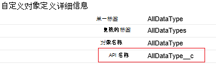

<properties
    pageTitle="队伍从移动数据，通过数据工厂 |Microsoft Azure"
    description="了解如何使用 Azure 数据工厂的销售队伍从移动数据。"
    services="data-factory"
    documentationCenter=""
    authors="linda33wj"
    manager="jhubbard"
    editor="monicar"/>

<tags
    ms.service="data-factory"
    ms.workload="data-services"
    ms.tgt_pltfrm="na"
    ms.devlang="na"
    ms.topic="article"
    ms.date="10/25/2016"
    ms.author="jingwang"/>

# 将数据从队伍移动通过使用 Azure 数据工厂
这篇文章概括介绍了如何使用复制活动在 Azure 数据工厂从队伍的数据复制到[支持源和接收器](data-factory-data-movement-activities.md#supported-data-stores)表中的接收列将列出任何数据存储区。 本文基于[数据移动活动](data-factory-data-movement-activities.md)文章，概要介绍了数据移动提供副本的活动和受支持的数据存储区的组合。

Azure 数据工厂目前支持唯一的移动数据从队伍到 [支持的接收器数据 stores]((data-factory-data-movement-activities.md#supported-data-stores)，但不是支持将数据从其他数据存储到队伍的那样。

## 系统必备组件
- 您必须使用以下版本的队伍之一︰ 开发人员版、 专业版、 企业版或无限制的版本。
- 必须启用 API 权限。 请参阅[如何使队伍中的权限集的 API 访问？](https://www.data2crm.com/migration/faqs/enable-api-access-salesforce-permission-set/)
- 销售队伍的数据复制到本地数据存储区中，您必须至少具有数据管理网关 2.0 安装在您的内部环境。

## 销售队伍请求限制
队伍有 API 请求总数和并发 API 请求限制。 请参阅[销售队伍开发限制](http://resources.docs.salesforce.com/200/20/en-us/sfdc/pdf/salesforce_app_limits_cheatsheet.pdf)文章的详细信息的"API 请求限制"一节。 请注意，是否并发请求数超过该限制，限制出现，您将看到随机故障;销售帐户的总请求数超过该限制，如果将阻止 24 小时;在这两种方案中，您也可能接收"REQUEST_LIMIT_EXCEEDED"错误。

## 复制数据向导
创建管线从队伍的数据复制到任何受支持的接收数据存储的最简单方法是使用数据复制向导。 请参阅[教程︰ 创建管线使用复制向导](data-factory-copy-data-wizard-tutorial.md)上使用数据复制向导创建管线快速演练。

下面的示例提供了示例 JSON 定义可用于通过使用[Azure 门户](data-factory-copy-activity-tutorial-using-azure-portal.md)、 [Visual Studio](data-factory-copy-activity-tutorial-using-visual-studio.md)或[Azure PowerShell](data-factory-copy-activity-tutorial-using-powershell.md)创建管线。 它们显示了如何将数据复制到 Azure Blob 存储销售队伍。 但是，数据可复制到任何接收器规定[此处](data-factory-data-movement-activities.md#supported-data-stores)在 Azure 数据工厂中使用复制活动。   

## 示例︰ 将销售数据复制到 Azure 的斑点
本示例将数据从队伍到 Azure 的 blob 每隔一小时。 在这些示例中使用的 JSON 属性各节所述的示例之后。 您可以直接与接收器在 Azure 数据工厂中使用复制活动[数据移动活动](data-factory-data-movement-activities.md#supported-data-stores)文章中列出的任何复制数据。

这里是您将需要创建以实现该方案的数据工厂项目。 列表后面的各节提供有关这些步骤的详细信息。

- 链接的类型的服务的[队伍](#salesforce-linked-service-properties)
- 类型[AzureStorage](data-factory-azure-blob-connector.md#azure-storage-linked-service-properties)的链接的服务
- [RelationalTable](#salesforce-dataset-properties)的类型输入的[数据集](data-factory-create-datasets.md)
- 类型[AzureBlob](data-factory-azure-blob-connector.md#azure-blob-dataset-type-properties)的输出[数据集](data-factory-create-datasets.md)
- [管线](data-factory-create-pipelines.md)与使用[RelationalSource](#relationalsource-type-properties)和[BlobSink](data-factory-azure-blob-connector.md#azure-blob-copy-activity-type-properties)的复制活动

**链接的销售服务**

此示例使用该链接的**销售**服务。 请参阅属性支持此链接服务的[销售链接服务](#salesforce-linked-service-properties)部分。  有关如何重置/获取安全令牌的说明，请参阅[获取安全令牌](https://help.salesforce.com/apex/HTViewHelpDoc?id=user_security_token.htm)。

    {
        "name": "SalesforceLinkedService",
        "properties":
        {
            "type": "Salesforce",
            "typeProperties":
            {
                "username": "<user name>",
                "password": "<password>",
                "securityToken": "<security token>"
            }
        }
    }

**Azure 存储链接服务**

    {
      "name": "AzureStorageLinkedService",
      "properties": {
        "type": "AzureStorage",
        "typeProperties": {
          "connectionString": "DefaultEndpointsProtocol=https;AccountName=<accountname>;AccountKey=<accountkey>"
        }
      }
    }

**销售队伍输入数据集**

    {
        "name": "SalesforceInput",
        "properties": {
            "linkedServiceName": "SalesforceLinkedService",
            "type": "RelationalTable",
            "typeProperties": {
                "tableName": "AllDataType__c"  
            },
            "availability": {
                "frequency": "Hour",
                "interval": 1
            },
            "external": true,
            "policy": {
                "externalData": {
                    "retryInterval": "00:01:00",
                    "retryTimeout": "00:10:00",
                    "maximumRetry": 3
                }
            }
        }
    }

将设置为**true**的**外部**通知数据工厂服务，数据集是外部数据工厂并不由数据工厂中的活动。

> [AZURE.IMPORTANT] API 名称"__c"部分是所需的任何自定义对象。

**Azure blob 输出数据集**

数据写入到新的斑点每小时 (频率︰ 小时、 间隔︰ 1)。

    {
        "name": "AzureBlobOutput",
        "properties":
        {
            "type": "AzureBlob",
            "linkedServiceName": "AzureStorageLinkedService",
            "typeProperties":
            {
                "folderPath": "adfgetstarted/alltypes_c"
            },
            "availability":
            {
                "frequency": "Hour",
                "interval": 1
            }
        }
    }

**管线与复制活动**

管线包含复制活动，被配置为使用上面的输入和输出数据集，并计划每小时运行一次。 在管线 JSON 定义中，将**源**类型设置为**RelationalSource**，和**接收器**类型设置为**BlobSink**。

支持的 RelationalSource 属性的列表，请参阅[RelationalSource 类型属性](#relationalsource-type-properties)。

    {  
        "name":"SamplePipeline",
        "properties":{  
            "start":"2016-06-01T18:00:00",
            "end":"2016-06-01T19:00:00",
            "description":"pipeline with copy activity",
            "activities":[  
            {
                "name": "SalesforceToAzureBlob",
                "description": "Copy from Salesforce to an Azure blob",
                "type": "Copy",
                "inputs": [
                {
                    "name": "SalesforceInput"
                }
                ],
                "outputs": [
                {
                    "name": "AzureBlobOutput"
                }
                ],
                "typeProperties": {
                    "source": {
                        "type": "RelationalSource",
                        "query": "SELECT Id, Col_AutoNumber__c, Col_Checkbox__c, Col_Currency__c, Col_Date__c, Col_DateTime__c, Col_Email__c, Col_Number__c, Col_Percent__c, Col_Phone__c, Col_Picklist__c, Col_Picklist_MultiSelect__c, Col_Text__c, Col_Text_Area__c, Col_Text_AreaLong__c, Col_Text_AreaRich__c, Col_URL__c, Col_Text_Encrypt__c, Col_Lookup__c FROM AllDataType__c"             
                    },
                    "sink": {
                        "type": "BlobSink"
                    }
                },
                "scheduler": {
                    "frequency": "Hour",
                    "interval": 1
                },
                "policy": {
                    "concurrency": 1,
                    "executionPriorityOrder": "OldestFirst",
                    "retry": 0,
                    "timeout": "01:00:00"
                }
            }
            ]
        }
    }

> [AZURE.IMPORTANT] API 名称"__c"部分是所需的任何自定义对象。

## 链接的队伍服务属性

下表提供的 JSON 元素特定于销售链接服务的描述。

| 属性 | 说明 | 必填 |
| -------- | ----------- | -------- |
| 类型 | 类型属性必须设置为︰**销售队伍**。 | 是的 |
| 用户名 |指定的用户帐户的用户名。 | 是的 |
| 密码 | 指定用户帐户的密码。  | 是的 |
| securityToken | 指定的用户帐户的安全令牌。 有关如何重置/获取一个安全令牌的说明，请参阅[获取安全令牌](https://help.salesforce.com/apex/HTViewHelpDoc?id=user_security_token.htm)。 若要了解有关安全令牌一般情况下，请参阅[安全和 API](https://developer.salesforce.com/docs/atlas.en-us.api.meta/api/sforce_api_concepts_security.htm)。  | 是的 |

## 销售数据集属性

部分以及可用于定义数据集的属性的完整列表，请参阅文章[创建数据集](data-factory-create-datasets.md)。 节如结构、 可用性和 JSON 数据集策略相近 （SQL Azure，Azure blob，Azure 表，等等） 中的所有数据集类型。

**TypeProperties**节对于每种类型的数据集是不同的并提供有关的数据存储区中的数据位置的信息。 为数据集类型**RelationalTable**的 typeProperties 部分具有以下属性︰

| 属性 | 说明 | 必填 |
| -------- | ----------- | -------- |
| 表名 | 队伍中的表的名称。 | 否 （如果指定了**RelationalSource** **查询**） |

> [AZURE.IMPORTANT]  API 名称"__c"部分是所需的任何自定义对象。

## RelationalSource 类型属性

部分可用于定义活动属性的完整列表，请参阅[创建管线](data-factory-create-pipelines.md)文章。 属性如名称、 说明、 输入和输出表和各种策略是可用于所有类型的活动。

属性都可用在 typeProperties 部分中的活动，另一方面，随每种活动类型。 为复制活动，它们因种源和接收器。

在复制活动中，当源类型**RelationalSource** （其中包括销售队伍），下列属性部分提供了 typeProperties:

| 属性 | 说明 | 允许的值 | 必填 |
| -------- | ----------- | -------------- | -------- |
| 查询 | 使用自定义查询中读取数据。 | SQL 92 查询或[销售对象查询语言 (SOQL)](https://developer.salesforce.com/docs/atlas.en-us.soql_sosl.meta/soql_sosl/sforce_api_calls_soql.htm)查询。 例如︰ `select * from MyTable__c`。 | 否 （如果指定的**数据集**的**表名**） |

> [AZURE.IMPORTANT] API 名称"__c"部分是所需的任何自定义对象。

## 查询提示

### 检索数据使用 where 子句在日期时间列
何时指定 SOQL 或 SQL 查询，注意日期时间格式差异。 例如︰

- **SOQL 示例**︰ $$Text.Format (选择 Id、 名称、 BillingCity 从帐户位置 LastModifiedDate > = {0:yyyy-毫米-ddTHH:mm:ssZ} 和 LastModifiedDate < {1:yyyy-毫米-ddTHH:mm:ssZ}，WindowStart，WindowEnd)
- **SQL 示例**︰ $$Text.Format (选择 * 从帐户位置 LastModifiedDate > = {{ts\'{0:yyyy-毫米-dd︰ 分︰ 秒}\'}} 和 LastModifiedDate < {{ts\'{1:yyyy-毫米-dd︰ 分︰ 秒}\'}}，WindowStart、 WindowEnd)。

### 从销售报表中检索数据
可以通过指定为查询从销售报表中检索数据`{call "<report name>"}`，例如`"query": "{call \"TestReport\"}"`。

### 从队伍回收站检索已删除的记录
要查询从队伍回收站软已删除的记录，您可以指定**"被 = 1"**在您的查询中。 例如， 

- 要查询仅将已删除的记录，请指定"*从 MyTable__c*中选择*地方被 = 1**"
- 要查询所有包括现有的和已删除的记录，请指定"*从 MyTable__c*中选择*地方被 = 0 或被 = 1**"

[AZURE.INCLUDE [data-factory-structure-for-rectangualr-datasets](../../includes/data-factory-structure-for-rectangualr-datasets.md)]

### 销售队伍的类型映射
销售类型 | .基于网络的类型
--------------- | ---------------
自动编号 | 字符串
复选框 | 布尔值
货币 | 双
日期 | 日期时间
日期/时间 | 日期时间
电子邮件 | 字符串
标识 | 字符串
查找关系 | 字符串
多选列表 | 字符串
编号 | 双
百分比 | 双
电话 | 字符串
选择列表 | 字符串
文本 | 字符串
文本区域 | 字符串
文本区域 （长格式） | 字符串
文本区域 （富） | 字符串
文本 （已加密） | 字符串
URL | 字符串

[AZURE.INCLUDE [data-factory-column-mapping](../../includes/data-factory-column-mapping.md)]
[AZURE.INCLUDE [data-factory-structure-for-rectangualr-datasets](../../includes/data-factory-structure-for-rectangualr-datasets.md)]

## 性能和调整  
请参阅[复制活动性能和优化指南](data-factory-copy-activity-performance.md)，了解移动数据 （副本活动） 在 Azure 数据工厂，并对其优化的各种方法中影响性能的关键因素。
