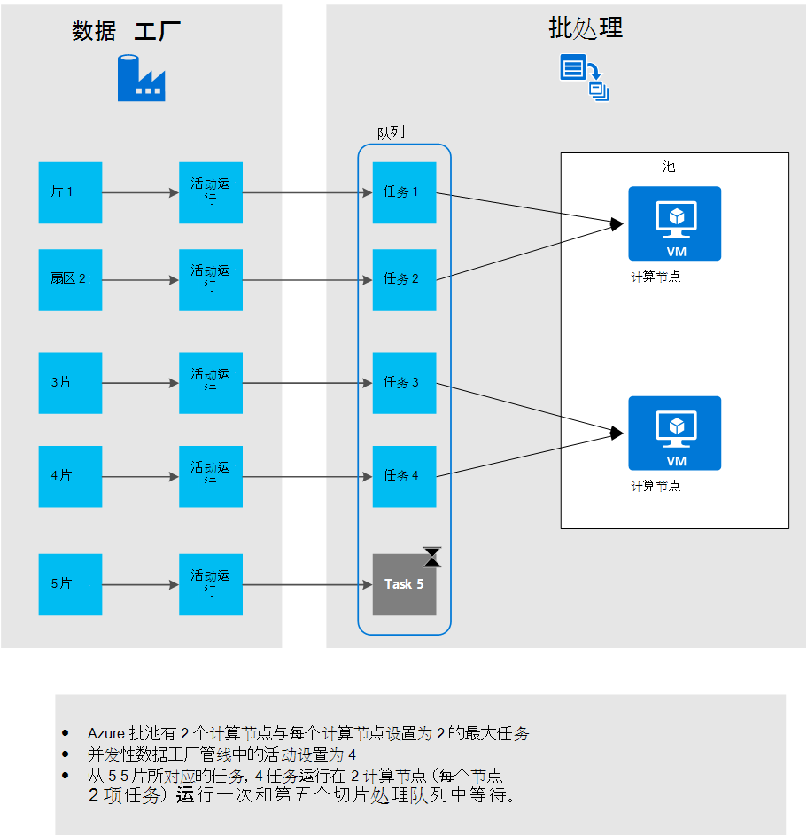

<properties
    pageTitle="在 Azure 数据工厂管道中使用自定义活动"
    description="了解如何创建自定义活动并在 Azure 数据工厂管线中使用它们。"
    services="data-factory"
    documentationCenter=""
    authors="spelluru"
    manager="jhubbard"
    editor="monicar"/>

<tags
    ms.service="data-factory"
    ms.workload="data-services"
    ms.tgt_pltfrm="na"
    ms.devlang="na"
    ms.topic="article"
    ms.date="10/17/2016"
    ms.author="spelluru"/>

# 在 Azure 数据工厂管道中使用自定义活动
> [AZURE.SELECTOR]
[配置单元](data-factory-hive-activity.md)  
[小猪](data-factory-pig-activity.md)  
[MapReduce](data-factory-map-reduce.md)  
[Hadoop 流](data-factory-hadoop-streaming-activity.md)
[机器学习](data-factory-azure-ml-batch-execution-activity.md) 
[存储过程](data-factory-stored-proc-activity.md)
[数据湖分析 U SQL](data-factory-usql-activity.md)
[.NET 自定义](data-factory-use-custom-activities.md)

有两种类型的活动，您可以在 Azure 数据工厂管道中使用。
 
- [数据移动活动](data-factory-data-movement-activities.md)[支持数据存储](data-factory-data-movement-activities.md#supported-data-stores)之间移动数据。
- 为转换/进程使用的数据的[数据转换活动](data-factory-data-transformation-activities.md)计算 Azure HDInsight、 Azure 批处理和 Azure 机器学习等。 例如︰ HDInsight 配置单元和机器学习批处理执行。  

如果您需要将数据移到从 Azure 数据工厂不支持的数据存储区，可以用数据移动逻辑创建自定义的.NET 活动和在管道中使用的活动。 

同样，如果您需要转换/处理数据以一种不受数据工厂，可以使用您自己的数据处理逻辑中创建自定义活动，并在管道中使用的活动。

> [AZURE.NOTE] 目前，数据管理网关只支持复制活动和存储的过程活动数据工厂中。 不能使用从自定义活动的网关访问内部数据源。
 
您可以配置要使用**Azure 批**服务或**Azure HDInsight**群集运行的自定义.NET 活动。   

下面的演练提供了用于创建自定义的.NET 活动和在管道中使用的自定义活动的分步指导。 本演练使用**Azure 批**链接服务。 要使用 Azure HDInsight 链接服务相反，您创建链接的类型的服务的**HDInsight** （如果您正在使用 HDInsight 群集） 或**HDInsightOnDemand** （如果您希望数据工厂创建 HDInsight 群集点播） 并使用它在管道 JSON (**linkedServiceName**) 的活动部分。 有关使用 Azure HDInsight 运行自定义活动的详细信息，请参见[使用 Azure HDInsight 链接服务](#use-azure-hdinsight-linked-services)部分。

> [AZURE.IMPORTANT] 4.5.2 集版本的.NET Framework 作为在 Visual Studio.NET 的自定义活动项目的目标框架。 数据工厂不支持针对.NET Framework 版本高于 4.5.2 编译的自定义活动。   

## 演练 

### 系统必备组件

- Visual Studio 2012/2013年/2015
- 下载并安装[Azure.NET SDK][azure-developer-center]

### Azure 的批处理系统必备组件
在本演练中，您可以运行您自定义的.NET 活动作为计算资源使用 Azure 批次。 请参阅[Azure 批处理基础][batch-technical-overview]的 Azure 批处理概览服务并[开始使用.NET Azure 批库]，请参阅[batch-get-started]快速入门 Azure 批服务。

对于本教程，您需要创建与虚拟机池的 Azure 批帐户。 步骤如下︰

1. 创建一个**批处理 Azure 帐户**使用[Azure 的门户](http://manage.windowsazure.com)。 请参阅[创建和管理批处理 Azure 帐户][batch-create-account]的说明。 记下 Azure 批帐户用户名和帐户密码。

    您还可以使用[New AzureBatchAccount] [ new-azure-batch-account] cmdlet 以创建批处理 Azure 帐户。 请参阅[管理 Azure 批帐户使用 Azure PowerShell] [azure-batch-blog]有关使用此 cmdlet 的详细说明。
2. 创建一个**Azure 批池**。
    1. 在[Azure 的门户](https://portal.azure.com)，在左边的菜单中，单击**浏览**，然后单击**批帐户**。 
    2. 选择您的 Azure 批帐户打开**批处理帐户**刀片式服务器。 
    3. 请单击**池**平铺。
    4. 在**池**刀片式服务器，请单击添加工具栏上的按钮来添加一个池。
        1. 输入池 (**池 ID**) 的 ID。 请记下**ID 池**;创建数据工厂解决方案时，您需要它。 
        2. 指定操作系统系列设置**Windows Server 2012 R2** 。
        3. 选择一个**节点定价层**。 
        3. 为该**目标专门**设置输入值**2** 。
        4. 输入的**每个节点的最大任务**设置值为**2** 。
    5. 单击**确定**以创建池。 
 
    此外可以使用[New AzureBatchPool](https://msdn.microsoft.com/library/mt628690.aspx) cmdlet 创建 Azure 批池。    

### 高级别的步骤 
1.  **创建自定义活动时**要使用的数据工厂管线。 在此示例中的自定义活动包含数据转换/处理逻辑。 
    1.  在 Visual Studio，创建.NET 类库项目，添加代码以处理输入的数据，并编译该项目。 
    2.  压缩所有二进制文件和 PDB （可选） 文件中的输出文件夹。  
    3.  将 zip 文件上载到 Azure blob 存储。 在创建自定义活动部分是详细的步骤。 
2. **使用自定义活动的 Azure 数据工厂创建**︰
    1. 创建 Azure 数据工厂。
    2. 创建链接的服务。
        1. AzureStorageLinkedService︰ 提供用于访问 blob 存储凭据。
        2. AzureBatchLinkedService︰ 指定 Azure 批一样计算。
    3. 创建数据集。
        1. InputDataset︰ 指定存储容器和文件夹输入的 blob。
        1. OuputDataset︰ 指定存储容器和输出 blob 的文件夹。
    2. 创建使用自定义活动的管道。
    3. 运行并测试管道。
    4. 调试的管道。

## 创建自定义活动
若要创建.NET 自定义活动，实现**IDotNetActivity**接口的类中创建**.NET 类库**项目。 此接口具有一个方法︰[执行](https://msdn.microsoft.com/library/azure/mt603945.aspx)和签名是︰

    public IDictionary<string, string> Execute(
            IEnumerable<LinkedService> linkedServices, 
            IEnumerable<Dataset> datasets, 
            Activity activity, 
            IActivityLogger logger)
        

方法采用四个参数︰

- **linkedServices**。 此属性会将输入/输出数据源链接的链接服务的可枚举列表 (例如︰ Azure Blob 存储) 到数据工厂。 在此示例中，没有一个链接的类型的服务的 Azure 存储用于输入和输出。 
- **数据集**。 此属性是数据集的可枚举列表。 可以使用此参数来获取位置和定义的输入和输出数据集的架构。
- **活动**。 此属性表示当前计算实体-在这种情况下，Azure 批处理。
- **记录器**。 此对象可以作为管道的"用户"日志写入调试注释该曲面。 

该方法返回一个字典，其中可用于链接在一起在以后自定义活动。 此功能尚未实施，因此，从该方法返回一个空字典。  

### 过程 
1.  创建**.NET 类库**项目。
    <ol type="a">
        <li>启动<b>Visual Studio 2015年</b>或<b>Visual Studio 2013年</b>或<b>Visual Studio 2012</b>。</li>
        <li>单击<b>文件</b>，指向<b>新建</b>，单击<b>项目</b>。</li>
        <li>展开<b>模板</b>，然后选择<b>C#</b>。 在本演练中，您使用 C#，但您可以使用任何.NET 语言来开发自定义活动。</li>
        <li>从右侧的项目类型的列表中选择<b>类库</b>。</li>
        <li><b>名称</b>中输入<b>MyDotNetActivity</b> 。</li>
        <li>选择<b>C:\ADFGetStarted</b>的<b>位置</b>。</li>
        <li>单击<b>确定</b>以创建项目。</li>
    </ol>
2.  单击**工具**，指向**NuGet 程序包管理器**，，单击**程序包管理器控制台**。
3.  在程序包管理器控制台上，执行以下命令来导入**Microsoft.Azure.Management.DataFactories**。

        Install-Package Microsoft.Azure.Management.DataFactories

4. 导入项目中的**Azure 存储**NuGet 程序包。

        Install-Package Azure.Storage

5. 将以下**using**语句添加到项目中的源文件。

        using System.IO;
        using System.Globalization;
        using System.Diagnostics;
        using System.Linq;

        using Microsoft.Azure.Management.DataFactories.Models;
        using Microsoft.Azure.Management.DataFactories.Runtime;

        using Microsoft.WindowsAzure.Storage;
        using Microsoft.WindowsAzure.Storage.Blob;

6. 将**命名空间**的名称更改为**MyDotNetActivityNS**。

        namespace MyDotNetActivityNS

7. 将该类的名称更改为**MyDotNetActivity** ，如下面的代码段所示从**IDotNetActivity**接口派生︰

        public class MyDotNetActivity : IDotNetActivity

8. 实现**MyDotNetActivity**类的**IDotNetActivity**界面的 （添加）**执行**方法，并将以下示例代码复制到该方法。

    下面的示例在每个 blob 数据切片与关联计算搜索术语 ("Microsoft") 的次数。 

        /// 

        /// Execute method is the only method of IDotNetActivity interface you must implement. 
        /// In this sample, the method invokes the Calculate method to perform the core logic.  
        /// 

        public IDictionary<string, string> Execute(
            IEnumerable<LinkedService> linkedServices,
            IEnumerable<Dataset> datasets,
            Activity activity,
            IActivityLogger logger)
        {
            // to get extended properties (for example: SliceStart)
            DotNetActivity dotNetActivity = (DotNetActivity)activity.TypeProperties;
            string sliceStartString = dotNetActivity.ExtendedProperties["SliceStart"];

            // to log all extended properties           
            IDictionary<string, string> extendedProperties = dotNetActivity.ExtendedProperties;
            logger.Write("Logging extended properties if any...");
            foreach (KeyValuePair<string, string> entry in extendedProperties)
            {
                logger.Write("<key:{0}> <value:{1}>", entry.Key, entry.Value);
            }
        
            // declare types for input and output data stores
            AzureStorageLinkedService inputLinkedService;

            // declare dataset types
            CustomDataset inputLocation;
            AzureBlobDataset outputLocation;

            Dataset inputDataset = datasets.Single(dataset => dataset.Name == activity.Inputs.Single().Name);
            inputLocation = inputDataset.Properties.TypeProperties as CustomDataset;

            foreach (LinkedService ls in linkedServices)
                logger.Write("linkedService.Name {0}", ls.Name);

            // using First method instead of Single since we are using the same 
            // Azure Storage linked service for input and output. 
            inputLinkedService = linkedServices.First(
                linkedService =>
                linkedService.Name ==
                inputDataset.Properties.LinkedServiceName).Properties.TypeProperties
                as AzureStorageLinkedService;

            string connectionString = inputLinkedService.ConnectionString; 

            // To create an input storage client.
            string folderPath = GetFolderPath(inputDataset);
            string output = string.Empty; // for use later.

            // create storage client for input. Pass the connection string.
            CloudStorageAccount inputStorageAccount = CloudStorageAccount.Parse(connectionString);
            CloudBlobClient inputClient = inputStorageAccount.CreateCloudBlobClient();

            // initialize the continuation token before using it in the do-while loop.
            BlobContinuationToken continuationToken = null;
            do
            {   // get the list of input blobs from the input storage client object.
                BlobResultSegment blobList = inputClient.ListBlobsSegmented(folderPath,
                                         true,
                                         BlobListingDetails.Metadata,
                                         null,
                                         continuationToken,
                                         null,
                                         null);
                
                // Calculate method returns the number of occurrences of 
                // the search term (“Microsoft”) in each blob associated
                // with the data slice. definition of the method is shown in the next step.
 
                output = Calculate(blobList, logger, folderPath, ref continuationToken, "Microsoft");

            } while (continuationToken != null);

            // get the output dataset using the name of the dataset matched to a name in the Activity output collection.
            Dataset outputDataset = datasets.Single(dataset => dataset.Name == activity.Outputs.Single().Name);
            // convert to blob location object.
            outputLocation = outputDataset.Properties.TypeProperties as AzureBlobDataset;

            folderPath = GetFolderPath(outputDataset);

            logger.Write("Writing blob to the folder: {0}", folderPath);

            // create a storage object for the output blob.
            CloudStorageAccount outputStorageAccount = CloudStorageAccount.Parse(connectionString);
            // write the name of the file. 
            Uri outputBlobUri = new Uri(outputStorageAccount.BlobEndpoint, folderPath + "/" + GetFileName(outputDataset));

            logger.Write("output blob URI: {0}", outputBlobUri.ToString());
            // create a blob and upload the output text.
            CloudBlockBlob outputBlob = new CloudBlockBlob(outputBlobUri, outputStorageAccount.Credentials);
            logger.Write("Writing {0} to the output blob", output);
            outputBlob.UploadText(output);

            // The dictionary can be used to chain custom activities together in the future.
            // This feature is not implemented yet, so just return an empty dictionary.  

            return new Dictionary<string, string>();
        }

9. 添加下面的帮助器方法。 **执行**方法调用这些帮助程序方法。 **GetConnectionString**方法检索 Azure 存储连接字符串和**GetFolderPath**方法检索 blob 位置。 最重要的是，该**计算**方法将循环访问每个 blob 的代码分隔开来。

        /// 

        /// Gets the folderPath value from the input/output dataset.
        /// 

        private static string GetFolderPath(Dataset dataArtifact)
        {
            if (dataArtifact == null || dataArtifact.Properties == null)
            {
                return null;
            }

            AzureBlobDataset blobDataset = dataArtifact.Properties.TypeProperties as AzureBlobDataset;
            if (blobDataset == null)
            {
                return null;
            }

            return blobDataset.FolderPath;
        }

        /// 

        /// Gets the fileName value from the input/output dataset.   
        /// 

        private static string GetFileName(Dataset dataArtifact)
        {
            if (dataArtifact == null || dataArtifact.Properties == null)
            {
                return null;
            }

            AzureBlobDataset blobDataset = dataArtifact.Properties.TypeProperties as AzureBlobDataset;
            if (blobDataset == null)
            {
                return null;
            }

            return blobDataset.FileName;
        }

        /// 

        /// Iterates through each blob (file) in the folder, counts the number of instances of search term in the file, 
        /// and prepares the output text that is written to the output blob. 
        /// 

        public static string Calculate(BlobResultSegment Bresult, IActivityLogger logger, string folderPath, ref BlobContinuationToken token, string searchTerm)
        {
            string output = string.Empty;
            logger.Write("number of blobs found: {0}", Bresult.Results.Count<IListBlobItem>());
            foreach (IListBlobItem listBlobItem in Bresult.Results)
            {
                CloudBlockBlob inputBlob = listBlobItem as CloudBlockBlob;
                if ((inputBlob != null) && (inputBlob.Name.IndexOf("$$$.$$$") == -1))
                {
                    string blobText = inputBlob.DownloadText(Encoding.ASCII, null, null, null);
                    logger.Write("input blob text: {0}", blobText);
                    string[] source = blobText.Split(new char[] { '.', '?', '!', ' ', ';', ':', ',' }, StringSplitOptions.RemoveEmptyEntries);
                    var matchQuery = from word in source
                                     where word.ToLowerInvariant() == searchTerm.ToLowerInvariant()
                                     select word;
                    int wordCount = matchQuery.Count();
                    output += string.Format("{0} occurrences(s) of the search term \"{1}\" were found in the file {2}.\r\n", wordCount, searchTerm, inputBlob.Name);
                }
            }
            return output;
        }

    GetFolderPath 方法返回数据集所指向的文件夹的路径和 GetFileName 方法返回数据集中指向 blob/文件的名称。 如果您的 havefolderPath 定义了使用变量，如 {年} {月} {一} 天等，该方法返回相同的字符串而不使用运行时的值替换它们。 有关访问 SliceStart、 SliceEnd 等的详细信息请参见[访问扩展属性](#access-extended-properties)部分。    
    
            "name": "InputDataset",
            "properties": {
                "type": "AzureBlob",
                "linkedServiceName": "AzureStorageLinkedService",
                "typeProperties": {
                    "fileName": "file.txt",
                    "folderPath": "adftutorial/inputfolder/",
    
    该计算方法计算关键字中的输入文件 (文件夹中的 blob) Microsoft 的实例的数。 搜索词 ("Microsoft") 是硬编码在代码中。

10. 编译该项目。 单击**生成**菜单中，单击**生成解决方案**。

    > [AZURE.IMPORTANT] 4.5.2 集版本的.NET Framework 作为您的项目的目标框架︰ 用鼠标右键单击该项目，然后单击**属性**来设置目标框架。 数据工厂不支持针对.NET Framework 版本高于 4.5.2 编译的自定义活动。 
11. 启动**Windows 资源管理器**，然后定位到**bin\debug**或**bin\release**文件夹根据生成的类型。
12. 创建一个 zip 文件，其中包含中的所有二进制文件的**MyDotNetActivity.zip** <project folder>\bin\Debug 文件夹。 您可能需要包含的**MyDotNetActivity.pdb**文件，以便获取中引起问题，如果发生了错误的源代码行号等其他详细信息。 自定义活动的 zip 文件中的所有文件都必须在**最高级别**与任何子文件夹。

    
13. 上载到 blob 容器斑点为**MyDotNetActivity.zip** : **customactivitycontainer** Azure blob 存储**AzureStorageLinkedService**链接服务，在**ADFTutorialDataFactory**中使用。  如果不存在，则创建 blob 容器**customactivitycontainer** 。

> [AZURE.NOTE] 如果您将此.NET 活动项目添加到解决方案中包含有数据工厂项目时，Visual Studio 并添加对.NET 活动项目从数据工厂应用程序项目的引用，则不需要执行两个步骤手动创建 zip 文件并将其上载到 Azure blob 存储。 发布数据工厂实体使用 Visual Studio 时，自动由发布过程完成以下步骤。 创建和发布数据工厂使用 Visual Studio 的实体，请参阅[生成第一个管道使用 Visual Studio](data-factory-build-your-first-pipeline-using-vs.md)并[复制到 Azure SQL Azure Blob 数据](data-factory-copy-activity-tutorial-using-visual-studio.md)的文章，以了解有关。  

### 执行方法

本部分提供更多详细信息和有关**执行**方法中的代码的注释。
 
1. [Microsoft.WindowsAzure.Storage.Blob](https://msdn.microsoft.com/library/azure/microsoft.windowsazure.storage.blob.aspx)命名空间中找到用于循环访问输入集合的成员。 循环访问 blob 集合，则需要使用**BlobContinuationToken**类。 实质上，您必须使用 do-while 循环与标记为退出循环的机制。 有关详细信息，请参阅[如何使用 Blob 存储从.NET](../storage/storage-dotnet-how-to-use-blobs.md)。 下面是一个基本的循环︰

        // Initialize the continuation token.
        BlobContinuationToken continuationToken = null;
        do
        {   
            // Get the list of input blobs from the input storage client object.
            BlobResultSegment blobList = inputClient.ListBlobsSegmented(folderPath,
                                      true,
                                      BlobListingDetails.Metadata,
                                      null,
                                      continuationToken,
                                      null,
                                      null);
            // Return a string derived from parsing each blob.
            output = Calculate(blobList, logger, folderPath, ref continuationToken, "Microsoft");
        } while (continuationToken != null);

    请参阅[ListBlobsSegmented](https://msdn.microsoft.com/library/jj717596.aspx)方法的详细信息的文档。

2.  学习 blob 的一套逻辑的代码内不要转的 while 循环。 在**Execute**方法，不要-同时循环将 blob 的列表传递给名为**计算**的方法。 该方法返回一个字符串变量名为是具有循环段中所有 blob 的结果的**输出**。 

    它在传递给**计算**方法将 blob 返回的搜索术语 (**Microsoft**) 的次数。 

            output += string.Format("{0} occurrences of the search term \"{1}\" were found in the file {2}.\r\n", wordCount, searchTerm, inputBlob.Name);

3.  一旦该**计算**方法已完成工作，它必须将其写入新的斑点。 因此对 blob 处理每套，新 blob 可以编写的结果。 要写入新的斑点，先找到输出数据集。 

            // Get the output dataset using the name of the dataset matched to a name in the Activity output collection.
            Dataset outputDataset = datasets.Single(dataset => dataset.Name == activity.Outputs.Single().Name);

            // Convert to blob location object.
            outputLocation = outputDataset.Properties.TypeProperties as AzureBlobDataset;

4.  该代码还会调用的帮助器方法︰ **GetFolderPath**检索文件夹路径 （存储容器名称）。
 
            folderPath = GetFolderPath(outputDataset);

    **GetFolderPath**将强制转换为 AzureBlobDataSet，有一个名为 FolderPath 的数据集对象。
            
            AzureBlobDataset blobDataset = dataArtifact.Properties.TypeProperties as AzureBlobDataset;
            
            return blobDataset.FolderPath;

5.  代码调用**GetFileName**方法来检索文件的名称 （blob）。  

            AzureBlobDataset blobDataset = dataArtifact.Properties.TypeProperties as AzureBlobDataset;

            return blobDataset.FileName;

6.  通过创建 URI 对象写入的文件的名称。 URI 构造函数使用**BlobEndpoint**属性返回的容器名称。 为构建输出 blob URI 添加的文件夹路径和文件名称。  

            // Write the name of the file. 
            Uri outputBlobUri = new Uri(outputStorageAccount.BlobEndpoint, folderPath + "/" + GetFileName(outputDataset));

7.  已写入的文件的名称，现在您可以写入输出字符串计算方法从新 blob:

            // Create a blob and upload the output text.
            CloudBlockBlob outputBlob = new CloudBlockBlob(outputBlobUri, outputStorageAccount.Credentials);
            logger.Write("Writing {0} to the output blob", output);
            outputBlob.UploadText(output);

## 创建使用 Azure 门户数据工厂

中的**创建自定义活动**部分中，您可以创建自定义活动并上载到 Azure blob 容器的二进制文件的 zip 文件和 PDB 文件。 在此部分中，可以使用**管道**使用**的自定义活动**创建 Azure**数据工厂**。
 
自定义活动的输入数据集表示中输入文件夹 (adftutorial\inputfolder) 的 blob 存储 blob （文件）。 活动的输出数据集表示的输出文件夹 (adftutorial\outputfolder) 中 blob 存储输出 blob。 

创建名为使用以下内容**: file.txt**的文件并将其上传到**adftutorial\inputfolder** （adftutorial 是 Azure blob 容器名称和 inputfolder 是该容器中的文件夹的名称）。

    test custom activity Microsoft test custom activity Microsoft

输入的文件夹对应于在 Azure 数据工厂中的片即使文件夹包含两个或多个文件。 当管道处理每个切片时，自定义活动循环访问该片的输入文件夹中的所有 blob。 

您将看到一个输出带有 adftutorial\output 文件夹中的文件与一个或多个行 （输入文件夹中的 blob 数相同）︰
 
    2 occurrences(s) of the search term "Microsoft" were found in the file inputfolder/2015-11-16-00/file.txt.

下面是执行这一节中的步骤操作︰

1. 创建一个**数据工厂**。
2. **链接服务**的 Azure 批池中的虚拟机上运行自定义活动和 Azure 存储包含输入/输出 blob。 
2. 输入和输出**数据集**表示输入和输出的自定义活动。 
3. 使用自定义活动的**管道**。
4. **数据工厂**。 发布到 Azure 的这些实体时，您创建一个。 

> [AZURE.NOTE] 创建**file.txt**并将其上载到 blob 容器，如果还没有这么做。 请参见上面的说明。  

### 步骤 1︰ 创建数据工厂

1.  登录后到 Azure 的门户，请执行以下步骤︰
    1.  单击左侧菜单上的**新建**。
    2.  单击**新建**刀片式服务器中的**数据 + 分析**。
    3.  单击**数据分析**刀片式服务器上的**数据工厂**。
2.  在**新数据工厂**刀片式服务器，输入名称**CustomActivityFactory** 。 Azure 数据工厂的名称必须是全局唯一的。 如果您收到错误︰**数据工厂名称"CustomActivityFactory"是不可用**的更改数据工厂 (例如， **yournameCustomActivityFactory**) 的名称，然后尝试重新创建。
3.  单击**资源组的名称**，并选择现有资源组或创建资源组。 
4.  请验证您正在使用正确**的订阅**和**地区**所需数据工厂创建的位置。 
5.  在**新数据工厂**刀片式服务器，请单击**创建**。
6.  您会看到在 Azure 门户的**仪表板**中创建的数据工厂。
7.  数据工厂创建成功后，您会看到数据工厂刀片式服务器，它显示的内容的数据工厂。

### 步骤 2︰ 创建链接的服务

链接的服务链接的数据存储区或计算到 Azure 数据工厂服务。 在此步骤中，您链接您的 Azure 存储帐户和 Azure 批帐户到数据工厂。

#### 创建链接的 Azure 存储服务

1.  单击**作者和部署**的**CustomActivityFactory****数据工厂**刀片上平铺。 您会看到数据工厂编辑器。
2.  单击命令栏上的**新数据存储**，并选择**Azure 存储**。 您应该看到 JSON 脚本用于在编辑器中创建链接的 Azure 存储服务。
3.  **帐户名称**替换您 Azure 存储帐户和**帐户密钥**使用 Azure 存储帐户的访问键的名称。 若要了解如何获取您的存储访问密钥，请参阅[查看、 复制和重新生成存储访问键](../storage/storage-create-storage-account.md#view-copy-and-regenerate-storage-access-keys)。
4.  若要将链接的服务部署的命令栏上，单击**部署**。

#### 创建链接的 Azure 批服务

2. 在数据工厂编辑器中，单击命令栏中的**新建计算**并从菜单中选择**Azure 批次**。
3. 对 JSON 脚本中进行以下更改︰
    1. 指定的**帐户名**属性的 Azure 批帐户名。 从**Azure 批帐户刀片式服务器**的**URL**是以下面的格式︰ http://**帐户名**。 region.batch.azure.com。 在 JSON 中的**batchUri**属性，您需要**删除"帐户名"。** 从 URL 和使用**帐户名**的**帐户名**JSON 属性。
    2. 指定**accessKey**属性 Azure 批帐户密钥。 
    3. 作为系统必备组件的**poolName**属性指定您创建的池的名称。 您还可以指定池的池名称代替的 ID。
    4. **BatchUri**属性指定 Azure 批 URI。 请参见上面的**帐户名**属性的说明。 示例︰ https://westus.batch.azure.com。  
    5. 指定**AzureStorageLinkedService**的**linkedServiceName**属性。
        
            {
              "name": "AzureBatchLinkedService",
              "properties": {
                "type": "AzureBatch",
                "typeProperties": {
                  "accountName": "myazurebatchaccount",
                  "batchUri": "https://westus.batch.azure.com",
                  "accessKey": "<yourbatchaccountkey>",
                  "poolName": "myazurebatchpool",
                  "linkedServiceName": "AzureStorageLinkedService"
                }
              }
            }

        对于**poolName**属性还可以指定池的池名称代替的 ID。

    > [AZURE.NOTE] 数据工厂服务不支持拨号选项 Azure 批 HDInsight 一样。 在 Azure 数据工厂只能使用 Azure 批池。
    
### 步骤 3︰ 创建数据集
在此步骤中，您将创建数据集来表示输入和输出数据。

#### 创建输入数据集
1.  数据工厂**编辑器**中单击工具栏上的**新数据集**按钮，从下拉菜单中单击**Azure Blob 存储**。
2.  在右窗格中 JSON 替换下面的 JSON 段︰

            {
                "name": "InputDataset",
                "properties": {
                    "type": "AzureBlob",
                    "linkedServiceName": "AzureStorageLinkedService",
                    "typeProperties": {
                        "folderPath": "adftutorial/customactivityinput/",
                        "format": {
                            "type": "TextFormat"
                        }
                    },
                    "availability": {
                        "frequency": "Hour",
                        "interval": 1
                    },
                    "external": true,
                    "policy": {}
                }
            }

    开始时间使用本演练中稍后创建管线︰ 2015年-11-16T00:00:00Z 和结束时间︰ 2015年-11-16T05:00:00Z。 计划产生的数据，因此有 5 输入/输出切片 (介于**00**: 00:00-> **05**: 00:00)。 

    **频率**和**时间间隔**的输入数据集设置为**小时**和**1**，这意味着输入的片可用每小时。 在此示例中，它是 intputfolder 中的相同文件 (file.txt)。 

    以下是由上面的 JSON 代码段中的 SliceStart 系统变量表示每个切片的启动时间。 

    
3.  创建和部署**InputDataset**工具栏上，单击**部署**。 请确认您在编辑器的标题栏上看到**表创建成功**的消息。

#### 创建一个输出数据集

1. 在**数据工厂编辑器**中，**新的数据集**，请单击，然后从命令栏中单击**Azure Blob 存储**。
2. 在右窗格中的 JSON 脚本替换为下面的 JSON 脚本︰

        {
            "name": "OutputDataset",
            "properties": {
                "type": "AzureBlob",
                "linkedServiceName": "AzureStorageLinkedService",
                "typeProperties": {
                    "fileName": "{slice}.txt",
                    "folderPath": "adftutorial/customactivityoutput/",
                    "partitionedBy": [
                        {
                            "name": "slice",
                            "value": {
                                "type": "DateTime",
                                "date": "SliceStart",
                                "format": "yyyy-MM-dd-HH"
                            }
                        }
                    ]
                },
                "availability": {
                    "frequency": "Hour",
                    "interval": 1
                }
            }
        }

    输出位置是**adftutorial/customactivityoutput/**和输出文件的名称是 yyyy MM dd HH.txt，其中 yyyy MM dd HH 是年、 月、 日和小时扇区所生产。 [开发人员参考]，请参阅[adf-developer-reference]的详细信息。

    为每个输入的切片生成输出 blob/文件。 下面是输出文件为每个切片的命名方式。 一个输出文件夹中生成的所有输出文件︰ **adftutorial\customactivityoutput**。

  	| 快讯 | 开始时间 | 输出文件 |
  	| :---- | :--------- | :---------- | 
  	| 1 | 2015-11-16T00:00:00 | 2015-11-16 00.txt |
  	| 2 | 2015-11-16T01:00:00 | 2015-11-16 01.txt |
  	| 3 | 2015-11-16T02:00:00 | 2015-11-16 02.txt |
  	| 4 | 2015-11-16T03:00:00 | 2015-11-16 03.txt |
  	| 5 | 2015-11-16T04:00:00 | 2015-11-16 04.txt |

    请记住输入文件夹中的所有文件都都与上面提到的启动时间片的一部分。 此切片器进行处理时，自定义活动通过扫描每个文件，并生成的搜索术语 ("Microsoft") 的次数与输出文件中的行。 在 inputfolder 中有三个文件，如果有三行在输出文件中为每个小时切片︰ 2015年-11-16-00.txt，2015年-11-16:01:00:00.txt，等等。 

2. 若要部署**OutputDataset**的命令栏上，单击**部署**。

### 创建并运行一个管道，它使用自定义活动

1. 在数据工厂编辑器中，单击命令栏上**新管道**。 如果看不到此命令，请单击**按钮。.（省略号）**若要查看它。
2. 在右窗格中 JSON 替换下面的 JSON 脚本。 

        {
          "name": "ADFTutorialPipelineCustom",
          "properties": {
            "description": "Use custom activity",
            "activities": [
              {
                "Name": "MyDotNetActivity",
                "Type": "DotNetActivity",
                "Inputs": [
                  {
                    "Name": "InputDataset"
                  }
                ],
                "Outputs": [
                  {
                    "Name": "OutputDataset"
                  }
                ],
                "LinkedServiceName": "AzureBatchLinkedService",
                "typeProperties": {
                  "AssemblyName": "MyDotNetActivity.dll",
                  "EntryPoint": "MyDotNetActivityNS.MyDotNetActivity",
                  "PackageLinkedService": "AzureStorageLinkedService",
                  "PackageFile": "customactivitycontainer/MyDotNetActivity.zip",
                  "extendedProperties": {
                    "SliceStart": "$$Text.Format('{0:yyyyMMddHH-mm}', Time.AddMinutes(SliceStart, 0))"
                  }
                },
                "Policy": {
                  "Concurrency": 2,
                  "ExecutionPriorityOrder": "OldestFirst",
                  "Retry": 3,
                  "Timeout": "00:30:00",
                  "Delay": "00:00:00"
                }
              }
            ],
            "start": "2015-11-16T00:00:00Z",
            "end": "2015-11-16T05:00:00Z",
            "isPaused": false
          }
        }

    请注意以下几点︰

    - **并发**设置为**2** ，以便两个切片并行处理的 2 Azure 批池中的虚拟机。
    - 在动作区域内没有一个活动和它的类型是︰ **DotNetActivity**。
    - **程序集名称**设置为 DLL 的名称︰ **MyDotnetActivity.dll**。
    - **入口点**设置为**MyDotNetActivityNS.MyDotNetActivity**。
    - **PackageLinkedService**设置为指向 blob 存储包含自定义活动的 zip 文件中的**AzureStorageLinkedService** 。 如果您使用不同的 Azure 存储帐户输入/输出文件和自定义活动的 zip 文件，您将创建另一个 Azure 存储链接服务。 本文假定您使用的相同的 Azure 存储帐户。
    - **PackageFile**设置为**customactivitycontainer/MyDotNetActivity.zip**。 它采用以下格式︰ containerforthezip/nameofthezip.zip。
    - 自定义活动采用**InputDataset**作为输入和输出为**OutputDataset** 。
    - 自定义活动的 linkedServiceName 属性指向**AzureBatchLinkedService**，它告诉 Azure 数据工厂需要在 Azure 批虚拟机上运行的自定义活动。
    - 默认情况下， **isPaused**属性设置为**false** 。 管道将立即运行在此示例中因为过去启动扇区。 您可以设置该属性为 true 可暂停管道并将其设置为 false，则重新启动回。 
    - **开始**时间和**结束**时间为**五**小时分离，因此五片所产生的管道，每小时，产生切片。 

4. 要部署管线的命令栏上，单击**部署**。

### 监视管道
 
8. 在 Azure 门户中数据工厂刀片式服务器，单击**图表**。
    
    
 
9. 现在，在关系图视图中，单击 OutputDataset。
 
    

10. 应看到输出五个切片处于就绪状态，是否他们已生产。

    
    
12. 请验证**adftutorial**容器中的 blob 存储在生成的输出文件。

    ![输出的自定义活动][image-data-factory-ouput-from-custom-activity]

9. 如果打开输出文件时，您应该看到类似于下面的输出的输出︰

    2 (s) 的搜索词"Microsoft"找到在文件 inputfolder/2015-11-16-00/file.txt。

10. 使用[Azure 的门户网站][azure-preview-portal]或 Azure PowerShell cmdlet 来监视您的数据工厂、 管道和数据集。 您可以看到从**ActivityLogger**中的代码可以从门户网站或使用 cmdlet 下载日志 (尤其是用户 0.log) 中的自定义活动的消息。

    ![从自定义活动下载日志][image-data-factory-download-logs-from-custom-activity]

有关监视数据集和管道的详细步骤，请参阅[监视和管理管道](data-factory-monitor-manage-pipelines.md)。      

### 数据工厂和批集成
数据工厂服务创建在 Azure 批处理作业名称︰ **adf-poolname:job-xxx**。 

切片的每次活动运行创建任务。 如果没有准备好处理 10 个扇区，在此 job 中创建 10 个任务。 您可以并行运行，如果池中有多个计算节点的多个切片。 此外，您还可以运行在相同的计算，如果每个计算节点的最大任务设置为 > 1 的多个切片。 

下图阐释了 Azure 数据工厂和批处理任务之间的关系。 

## 调试管道
调试的一些基本技术包括︰

1.  如果看到下面的错误消息，请确认 CS 文件中的类的名称与您为 JSON 的管道中的**入口点**属性指定的名称相匹配。 在上面的演练，是类的名称︰ MyDotNetActivity，并在 JSON 中的入口点是︰ MyDotNetActivityNS。**MyDotNetActivity**。 

            MyDotNetActivity assembly does not exist or doesn't implement the type Microsoft.DataFactories.Runtime.IDotNetActivity properly

    如果名称匹配，确认所有的二进制文件的 zip 文件的**根文件夹**中。 也就是说，打开 zip 文件时，您应该看到在根文件夹中，不在任何子文件夹中的所有文件。   
2.  如果输入的扇区未设置为**就绪**，确认输入的文件夹结构正确并且**file.txt**存在输入文件夹中。 
2.  在自定义活动的**执行**方法，使用**IActivityLogger**对象来记录信息，可帮助您解决问题。 用户日志文件中记录的消息显示 (一个或多个文件，名为︰ 用户 0.log，用户 1.log，用户 2.log，等等。)。 

    在**OutputDataset**刀片式服务器，请单击切片为该片**数据切片**刀片式服务器，请参阅。 您会看到该扇区**活动运行**。 您应该看到运行切片的一个活动。 如果您单击运行命令栏中，您可以开始运行同一切片的另一个活动。 

    当您单击活动运行时，您会看到**活动运行详细信息**刀片式服务器的日志文件的列表。 您看到的 user_0.log 文件中记录的消息。 发生错误时，您会看到三个活动的运行，因为重试计数设置为管道/活动 JSON 的 3。 单击活动运行时，您会看到您可以检查来诊断错误的日志文件。 

    在日志文件的列表中，单击**用户 0.log**。 在右侧面板中将使用**IActivityLogger.Write**方法的结果。 如果您没有看到所有邮件，检查您是否具有多个日志文件命名为︰ user_1.log、 user_2.log 等。否则，最后一次登录消息后可能失败的代码。

    此外应检查**系统 0.log**的任何系统错误消息和异常。

3.  在 zip 文件中包括的**PDB**文件，这样错误的详细信息都如**调用堆栈**的信息时发生错误。
4.  自定义活动的 zip 文件中的所有文件都必须在**最高级别**与任何子文件夹。
5.  确保**程序集名称**(MyDotNetActivity.dll)，**入口点**(MyDotNetActivityNS.MyDotNetActivity)、 **packageFile** (customactivitycontainer/MyDotNetActivity.zip) 和**packageLinkedService** （应指向包含该 zip 文件的 Azure blob 存储） 将设置为正确的值。 
6.  如果您修复错误并且想要重新处理该扇区，用鼠标右键单击**OutputDataset**刀片式服务器中的扇区，然后单击**运行**。 
7.  自定义活动不使用**app.config**文件从您的软件包，因此如果您的代码从配置文件读取任何连接字符串，它不运行，在运行时。 使用 Azure 批处理时，最佳做法是在**Azure KeyVault**中保存任何机密信息中使用基于证书的服务主体保护**keyvault**，并将证书分发到 Azure 批池。 然后，.NET 自定义活动可以从 KeyVault 在运行时访问机密信息。 此解决方案是一个通用的解决方案，可以扩展到任何类型的秘密，而不仅仅是连接字符串。

    没有容易的解决方法 （而不是一个最佳做法）︰ 您可以创建**SQL Azure 链接服务**与连接字符串设置，创建一个数据集，使用链接服务，并链接到自定义的.NET 活动虚拟输入数据集作为数据集。 然后，您可以访问链接的服务的自定义活动代码中的连接字符串，则应在运行时可以正常工作。  

## 更新自定义活动
如果您更新自定义活动代码，生成它，并上载包含 blob 存储到新的二进制文件的 zip 文件。

## 拷贝/移动数据 
将**源**数据中的数据存储的活动副本复制到**接收器**的数据存储区。 支持复制活动作为源和接收器的数据存储的列表，请参阅[支持的数据存储区](data-factory-data-movement-activities.md#supported-data-stores)。 

如果您需要将数据移到从数据存储区不支持的**复制活动**，您可以使用**自定义活动**数据工厂在您自己的逻辑与复制/移动数据。 请参见在 GitHub 上的[HTTP 数据下载程序示例](https://github.com/Azure/Azure-DataFactory/tree/master/Samples/HttpDataDownloaderSample)。  

## 应用程序域隔离 
请参阅[跨应用程序域的示例](https://github.com/Azure/Azure-DataFactory/tree/master/Samples/CrossAppDomainDotNetActivitySample)，介绍如何创作自定义的.NET 活动为到 Azure 数据工厂启动程序 （例如，WindowsAzure.Storage v4.3.0，Newtonsoft.Json v6.0.x 等） 所使用的程序集版本不受约束的 Azure 数据工厂。

## 扩展属性的访问
您可以声明如下所示的 JSON 的活动中的扩展的属性︰ 

    "typeProperties": {
      "AssemblyName": "MyDotNetActivity.dll",
      "EntryPoint": "MyDotNetActivityNS.MyDotNetActivity",
      "PackageLinkedService": "AzureStorageLinkedService",
      "PackageFile": "customactivitycontainer/MyDotNetActivity.zip",
      "extendedProperties": {
        "SliceStart": "$$Text.Format('{0:yyyyMMddHH-mm}', Time.AddMinutes(SliceStart, 0))",
        "DataFactoryName": "CustomActivityFactory"
      }
    },

在代码中，有两个的扩展的属性︰ **SliceStart**和**DataFactoryName**。 SliceStart 的值基于 SliceStart 的系统变量。 支持的系统变量的列表，请参阅[系统变量](data-factory-scheduling-and-execution.md#data-factory-system-variables)。 DataFactoryName 的值是"CustomActivityFactory"的硬编码。 

若要访问这些扩展的属性的**Execute**方法中，使用与以下代码类似的代码︰ 

    // to get extended properties (for example: SliceStart)
    DotNetActivity dotNetActivity = (DotNetActivity)activity.TypeProperties;
    string sliceStartString = dotNetActivity.ExtendedProperties["SliceStart"];

    // to log all extended properties                               
    IDictionary<string, string> extendedProperties = dotNetActivity.ExtendedProperties;
    logger.Write("Logging extended properties if any...");
    foreach (KeyValuePair<string, string> entry in extendedProperties)
    {
        logger.Write("<key:{0}> <value:{1}>", entry.Key, entry.Value);
    }

## Azure 批的自动缩放功能
您还可以使用**自动缩放**功能创建 Azure 批池。 例如，可创建带有 0 专用的虚拟机和基于挂起的任务的次数自动缩放公式 azure 批池︰

每个挂起的一次任务的一个 VM (例如︰ 五个待决任务-> 五个 Vm):

    pendingTaskSampleVector=$PendingTasks.GetSample(600 * TimeInterval_Second);
    $TargetDedicated = max(pendingTaskSampleVector);

与挂起的任务的次数无关，一次一个虚拟机的最大值︰

    pendingTaskSampleVector=$PendingTasks.GetSample(600 * TimeInterval_Second);
    $TargetDedicated = (max(pendingTaskSampleVector)>0)?1:0;

有关详细信息，请参阅[自动比例计算 Azure 批池中的节点](../batch/batch-automatic-scaling.md)。 

如果该池正在使用默认值[autoScaleEvaluationInterval](https://msdn.microsoft.com/library/azure/dn820173.aspx)，批服务可能需要 15-30 分钟的时间来运行自定义活动之前准备虚拟机。  如果该池使用不同的 autoScaleEvaluationInterval，批服务可能需要 autoScaleEvaluationInterval + 10 分钟。

## 使用 Azure HDInsight 链接服务
在本演练中，您可以使用 Azure 批处理计算运行自定义活动。 您还可以使用 HDInsight 群集或有数据工厂创建按需 HDInsight 群集，并且在 HDInsight 群集上运行的自定义活动。 以下是使用 HDInsight 群集的高级步骤。  

1. 创建链接的 Azure HDInsight 服务。   
2. 使用管道 JSON 中代替**AzureBatchLinkedService**的 HDInsight 链接服务。 

您可能需要更改管线的**开始**和**结束**时间，以便您可以测试与 Azure HDInsight 服务的方案。

#### 创建链接的 Azure HDInsight 服务 
Azure 数据工厂服务支持按需群集创建并使用它来处理输入以产生输出数据。 此外可以使用您自己的群集来执行同样的操作。 当您使用按需 HDInsight 群集时，获取针对每个切片创建的群集。 而如果使用 HDInsight 群集时，群集就可以立即处理该切片。 因此，在使用按需群集时，您可能无法看到的输出数据尽快为当您使用您自己的群集。

> [AZURE.NOTE] 在运行时，.NET 活动的实例只有一个工作人员在节点上运行 HDInsight 群集;它不能被缩放在多个节点上运行。 .NET 活动的多个实例可以并行运行的 HDInsight 群集的其他节点上。

##### 使用按需 HDInsight 群集

1. 在**Azure 的门户**中，数据工厂主页中单击**作者和部署**。
2. 在数据工厂编辑器中，单击命令栏中的**新建计算**并从菜单中选择**点播 HDInsight 群集**。
2. 对 JSON 脚本中进行以下更改︰
    1. 对于**clusterSize**属性指定 HDInsight 群集的大小。
    3. **TimeToLive**属性指定多长时间客户可以被删除之前空闲。
    4. **版本**属性以指定要使用的 HDInsight 版本。 如果排除了此属性，则使用最新版本。  
    5. 为**linkedServiceName**中，指定在**AzureStorageLinkedService**中获取您已创建启动教程。

            {
                "name": "HDInsightOnDemandLinkedService",
                "properties": {
                    "type": "HDInsightOnDemand",
                    "typeProperties": {
                        "clusterSize": 4,
                        "timeToLive": "00:05:00",
                        "osType": "Windows",
                        "linkedServiceName": "AzureStorageLinkedService",
                    }
                }
            }

2. 若要将链接的服务部署的命令栏上，单击**部署**。

##### 若要使用 HDInsight 群集︰

1. 在**Azure 的门户**中，数据工厂主页中单击**作者和部署**。
2. 在**数据工厂编辑器**中，单击**新建计算**命令栏中，从菜单中选择**HDInsight 群集**。
2. 对 JSON 脚本中进行以下更改︰
    1. 为**clusterUri**属性中，输入您 HDInsight 的 URL。 例如︰ https://<clustername>.azurehdinsight.net/     
    2. **用户名**属性中，输入对 HDInsight 群集具有访问权限的用户名。
    3. **口令**属性中，输入用户的密码。
    4. 对于**LinkedServiceName**属性中，输入**AzureStorageLinkedService**。 获取启动教程中创建此链接的服务。

2. 若要将链接的服务部署的命令栏上，单击**部署**。

有关详细信息，请参阅[计算链接的服务](data-factory-compute-linked-services.md)。 

在**管线 JSON**，使用 HDInsight (按需或自己) 链接服务︰ 

    {
      "name": "ADFTutorialPipelineCustom",
      "properties": {
        "description": "Use custom activity",
        "activities": [
          {
            "Name": "MyDotNetActivity",
            "Type": "DotNetActivity",
            "Inputs": [
              {
                "Name": "InputDataset"
              }
            ],
            "Outputs": [
              {
                "Name": "OutputDataset"
              }
            ],
            "LinkedServiceName": "HDInsightOnDemandLinkedService",
            "typeProperties": {
              "AssemblyName": "MyDotNetActivity.dll",
              "EntryPoint": "MyDotNetActivityNS.MyDotNetActivity",
              "PackageLinkedService": "AzureStorageLinkedService",
              "PackageFile": "customactivitycontainer/MyDotNetActivity.zip",
              "extendedProperties": {
                "SliceStart": "$$Text.Format('{0:yyyyMMddHH-mm}', Time.AddMinutes(SliceStart, 0))"
              }
            },
            "Policy": {
              "Concurrency": 2,
              "ExecutionPriorityOrder": "OldestFirst",
              "Retry": 3,
              "Timeout": "00:30:00",
              "Delay": "00:00:00"
            }
          }
        ],
        "start": "2015-11-16T00:00:00Z",
        "end": "2015-11-16T05:00:00Z",
        "isPaused": false
      }
    }

## 示例

示例 | 何种自定义活动 
------ | ----------- 
[HTTP 数据下载程序](https://github.com/Azure/Azure-DataFactory/tree/master/Samples/HttpDataDownloaderSample)。 | 将数据从 HTTP 端点下载到 Azure Blob 存储在数据工厂中使用自定义 C# 活动。
[Twitter 的观点分析示例](https://github.com/Azure/Azure-DataFactory/tree/master/Samples/TwitterAnalysisSample-CustomC%23Activity) | 调用 Azure ML 模型和 do 观点分析、 评分、 预测等。
[运行 R 脚本](https://github.com/Azure/Azure-DataFactory/tree/master/Samples/RunRScriptUsingADFSample)。 | 通过运行 RScript.exe HDInsight 群集已 R 安装在其上调用 R 脚本。 
[跨应用程序域.NET 活动](https://github.com/Azure/Azure-DataFactory/tree/master/Samples/CrossAppDomainDotNetActivitySample) | 使用不同的程序集版本与数据工厂启动程序所使用  
 

## 请参见

[Azure 数据工厂更新︰ 执行 ADF 自定义.NET 活动使用 Azure 批次](https://azure.microsoft.com/blog/2015/05/01/azure-data-factory-updates-execute-adf-custom-net-activities-using-azure-batch/)。

[batch-net-library]: ../batch/batch-dotnet-get-started.md
[batch-create-account]: ../batch/batch-account-create-portal.md
[batch-technical-overview]: ../batch/batch-technical-overview.md
[batch-get-started]: ../batch/batch-dotnet-get-started.md
[use-custom-activities]: data-factory-use-custom-activities.md
[troubleshoot]: data-factory-troubleshoot.md
[data-factory-introduction]: data-factory-introduction.md
[azure-powershell-install]: https://github.com/Azure/azure-sdk-tools/releases

[developer-reference]: http://go.microsoft.com/fwlink/?LinkId=516908
[cmdlet-reference]: http://go.microsoft.com/fwlink/?LinkId=517456

[new-azure-batch-account]: https://msdn.microsoft.com/library/mt125880.aspx
[new-azure-batch-pool]: https://msdn.microsoft.com/library/mt125936.aspx
[azure-batch-blog]: http://blogs.technet.com/b/windowshpc/archive/2014/10/28/using-azure-powershell-to-manage-azure-batch-account.aspx

[nuget-package]: http://go.microsoft.com/fwlink/?LinkId=517478
[azure-developer-center]: http://azure.microsoft.com/develop/net/
[adf-developer-reference]: http://go.microsoft.com/fwlink/?LinkId=516908
[azure-preview-portal]: https://portal.azure.com/

[adfgetstarted]: data-factory-copy-data-from-azure-blob-storage-to-sql-database.md
[hivewalkthrough]: data-factory-data-transformation-activities.md

[image-data-factory-ouput-from-custom-activity]: ./media/data-factory-use-custom-activities/OutputFilesFromCustomActivity.png

[image-data-factory-download-logs-from-custom-activity]: ./media/data-factory-use-custom-activities/DownloadLogsFromCustomActivity.png
