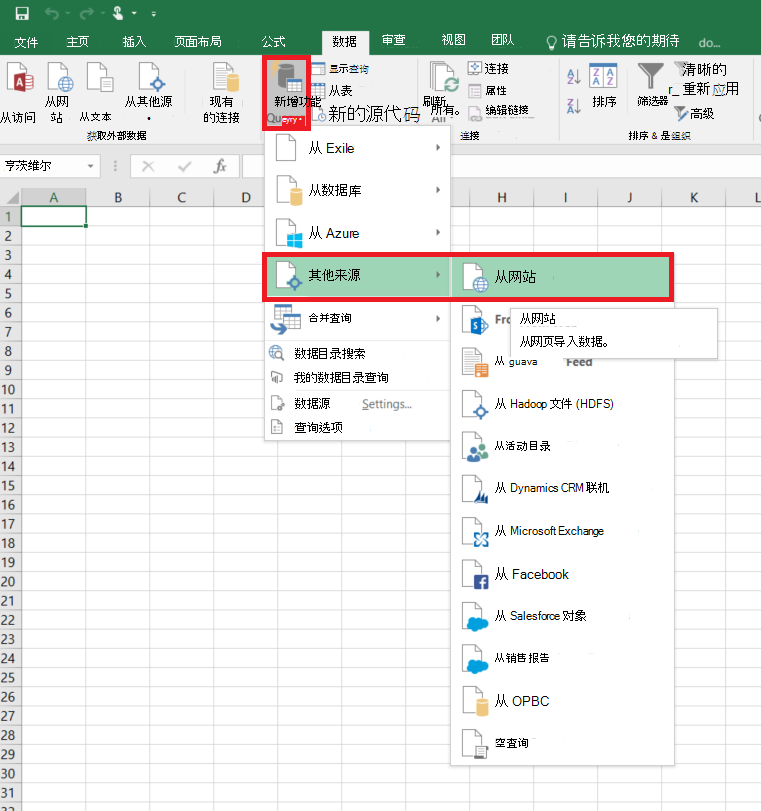
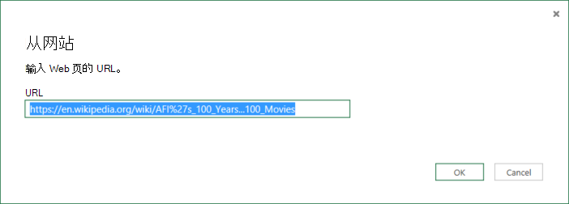
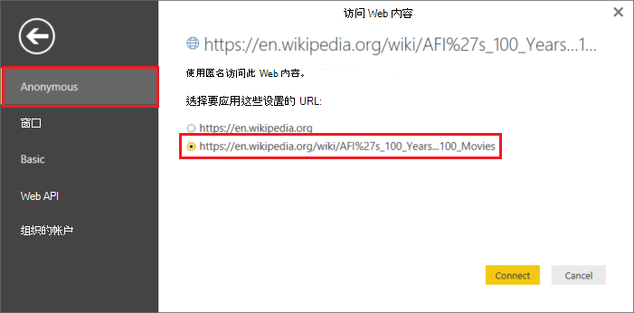
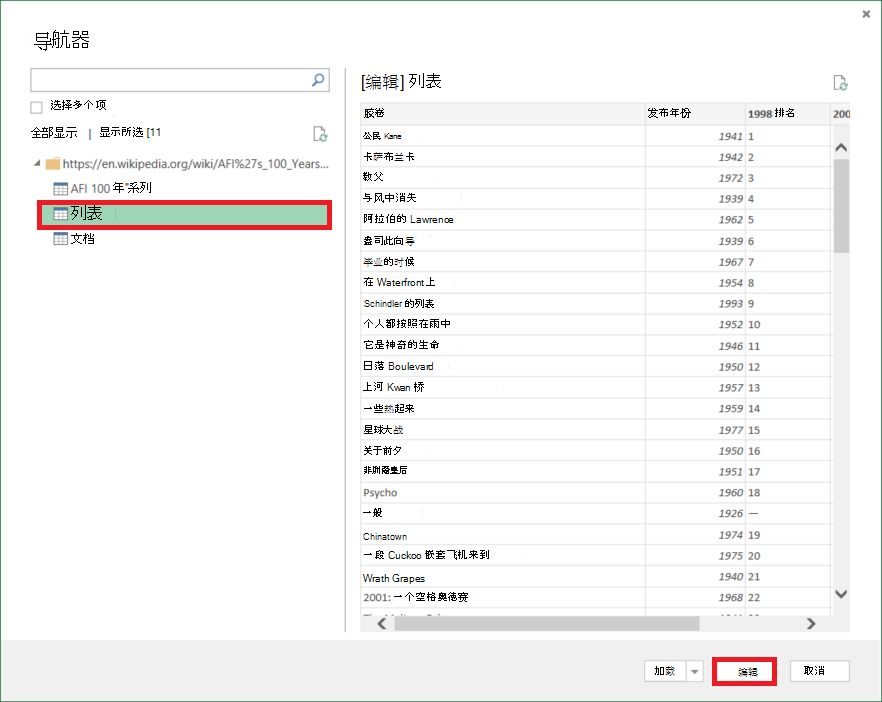
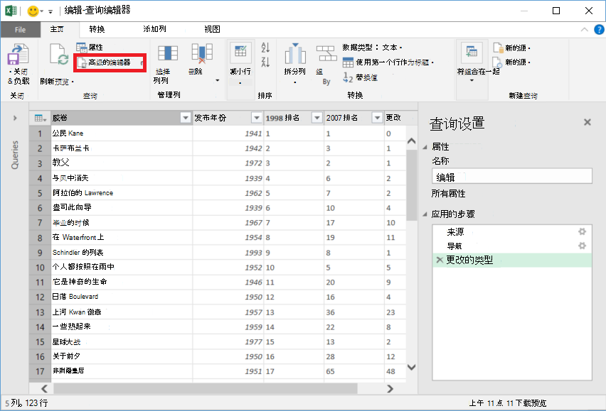
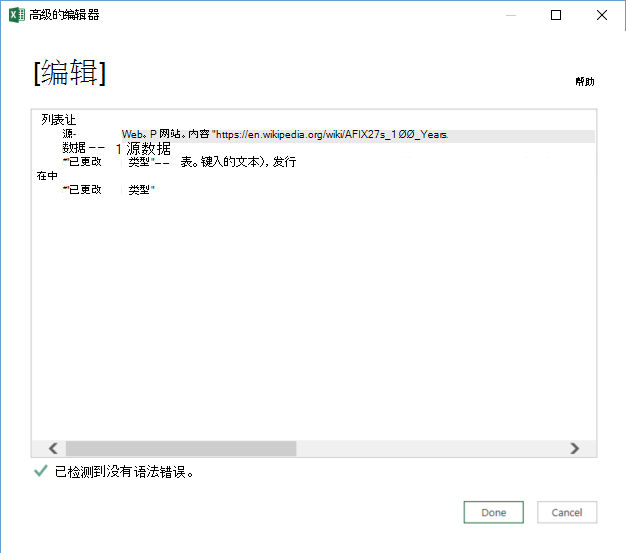

<properties 
    pageTitle="将数据从 Web 表移动 |Azure 数据工厂" 
    description="了解如何将数据从内部移动表格在网页上使用 Azure 数据工厂。" 
    services="data-factory" 
    documentationCenter="" 
    authors="linda33wj" 
    manager="jhubbard" 
    editor="monicar"/>

<tags 
    ms.service="data-factory" 
    ms.workload="data-services" 
    ms.tgt_pltfrm="na" 
    ms.devlang="na" 
    ms.topic="article" 
    ms.date="09/26/2016" 
    ms.author="jingwang"/>

# 将数据从 Web 表源使用 Azure 数据工厂
这篇文章概括介绍了如何使用复制活动在 Azure 数据工厂以将数据从 Web 页中的一个表复制到另一个数据存储区。 本文基于[数据移动活动](data-factory-data-movement-activities.md)文章，概要介绍了数据移动提供副本的活动和受支持的数据存储区的组合。

数据工厂目前支持唯一的移动数据从 Web 表到其他数据存储，但不是将数据从其他数据移动到 Web 表目标存储。

> [AZURE.NOTE] 目前，此 Web 连接器支持仅从 HTML 页面的解压表内容。

## 示例︰ 将数据从 Web 表复制到 Azure Blob

下面的示例演示︰

1.  链接的类型[Web](#web-linked-service-properties)的服务。
2.  链接的类型[AzureStorage](data-factory-azure-blob-connector.md#azure-storage-linked-service-properties)的服务。
3.  [WebTable](#WebTable-dataset-properties)类型的输入的[数据集](data-factory-create-datasets.md)。
4.  类型[AzureBlob](data-factory-azure-blob-connector.md#azure-blob-dataset-type-properties)的输出[数据集](data-factory-create-datasets.md)。
4.  [管线](data-factory-create-pipelines.md)与使用[WebSource](#websource-copy-activity-type-properties)和[BlobSink](data-factory-azure-blob-connector.md#azure-blob-copy-activity-type-properties)的复制活动。

该示例将数据从 Web 表到 Azure 的 blob 每隔一小时。 在这些示例中使用的 JSON 属性详见以下示例部分。 

下面的示例演示如何将数据从一个 Web 目录复制到 Azure 的 blob。 但是，数据可以直接复制到任何在 Azure 数据工厂中使用复制活动[数据移动活动](data-factory-data-movement-activities.md)文章中所述的接收器。 

**Web 链接服务**此示例使用匿名身份验证的链接的 Web 服务。 为不同类型的可以使用的身份验证，请参见[Web 链接服务](#web-linked-service-properties)部分。 

    {
        "name": "WebLinkedService",
        "properties":
        {
            "type": "Web",
            "typeProperties":
            {
                "authenticationType": "Anonymous",
                "url" : "https://en.wikipedia.org/wiki/"
            }
        }
    }

**Azure 存储链接服务**

    {
      "name": "AzureStorageLinkedService",
      "properties": {
        "type": "AzureStorage",
        "typeProperties": {
          "connectionString": "DefaultEndpointsProtocol=https;AccountName=<accountname>;AccountKey=<accountkey>"
        }
      }
    }

**WebTable 的输入数据集**将设置为**true**的**外部**通知数据工厂服务，数据集是外部数据工厂并不由数据工厂中的活动。

> [AZURE.NOTE] 为获取索引表的 HTML 页中的步骤，请参见[获取 HTML 页面中的表的索引](#get-index-of-a-table-in-an-html-page)部分。  

    
    {
        "name": "WebTableInput",
        "properties": {
            "type": "WebTable",
            "linkedServiceName": "WebLinkedService",
            "typeProperties": {
                "index": 1,
                "path": "AFI's_100_Years...100_Movies"
            },
            "external": true,
            "availability": {
                "frequency": "Hour",
                "interval":  1
            }
        }
    }

**Azure Blob 输出数据集**

数据写入到新的斑点每小时 (频率︰ 小时、 间隔︰ 1)。 

    {
        "name": "AzureBlobOutput",
        "properties":
        {
            "type": "AzureBlob",
            "linkedServiceName": "AzureStorageLinkedService",
            "typeProperties":
            {
                "folderPath": "adfgetstarted/Movies"
            },
            "availability":
            {
                "frequency": "Hour",
                "interval": 1
            }
        }
    }

**管线与复制活动**

管道中包含一个配置为使用上面的输入和输出数据集的复制活动，并计划每小时运行一次。 在管线 JSON 定义中，将**源**类型设置为**WebSource** ，**接收器**类型设置为**BlobSink**。 

WebSource 支持的属性的列表，请参见[WebSource 类型属性](#websource-copy-activity-type-properties)。 
    
    {  
        "name":"SamplePipeline",
        "properties":{  
        "start":"2014-06-01T18:00:00",
        "end":"2014-06-01T19:00:00",
        "description":"pipeline with copy activity",
        "activities":[  
          {
            "name": "WebTableToAzureBlob",
            "description": "Copy from a Web table to an Azure blob",
            "type": "Copy",
            "inputs": [
              {
                "name": "WebTableInput"
              }
            ],
            "outputs": [
              {
                "name": "AzureBlobOutput"
              }
            ],
            "typeProperties": {
              "source": {
                "type": "WebSource"
              },
              "sink": {
                "type": "BlobSink"
              }
            },
           "scheduler": {
              "frequency": "Hour",
              "interval": 1
            },
            "policy": {
              "concurrency": 1,
              "executionPriorityOrder": "OldestFirst",
              "retry": 0,
              "timeout": "01:00:00"
            }
          }
          ]
       }
    }

## Web 链接的服务属性

下表提供了 JSON 元素特定于 Web 链接的服务的说明。

| 属性 | 说明 | 必填 |
| -------- | ----------- | -------- | 
| 类型 | 类型属性必须设置为︰ **Web** | 是的 | 
| Url | Web 源 URL | 是的 |
| authenticationType | 匿名或基本。 | 是的 |
| 用户名 | 对于基本身份验证的用户名。 | 是 （对于基本身份验证）
| 密码 | 对于基本身份验证的密码。 | 是 （对于基本身份验证）

### 使用匿名身份验证

    {
        "name": "web",
        "properties":
        {
            "type": "Web",
            "typeProperties":
            {
                "authenticationType": "Anonymous",
                "url" : "https://en.wikipedia.org/wiki/"
            }
        }
    }

### 使用基本身份验证
    
    {
        "name": "web",
        "properties":
        {
            "type": "Web",
            "typeProperties":
            {
                "authenticationType": "basic",
                "url" : "http://myit.mycompany.com/",
                "userName": "Administrator",
                "password": "password"
            }
        }
    }

## WebTable 数据集属性

部分和属性可用于定义数据集的完整列表，请参阅文章[创建数据集](data-factory-create-datasets.md)。 节如结构、 可用性和 JSON 数据集策略为所有的数据集类型 (Azure SQL，Azure blob，Azure 表，等等。) 相近。

**TypeProperties**节对于每种类型的数据集是不同的并提供有关的数据存储区中的数据位置的信息。 类型**WebTable**的 typeProperties 部分数据集具有以下属性

属性 | 说明 | 必填
:-------- | :----------- | :--------
类型    | 数据集的类型。 必须设置为**WebTable** | 是的
路径 | 相对于包含表的资源的 URL。 | 不。 当未指定路径时，将使用仅在链接的服务定义中指定的 URL。 
索引 | 在资源中的表的索引。 为获取索引表的 HTML 页中的步骤，请参见[获取 HTML 页面中的表的索引](#get-index-of-a-table-in-an-html-page)部分。 | 是的

**示例︰**

    {
        "name": "WebTableInput",
        "properties": {
            "type": "WebTable",
            "linkedServiceName": "WebLinkedService",
            "typeProperties": {
                "index": 1,
                "path": "AFI's_100_Years...100_Movies"
            },
            "external": true,
            "availability": {
                "frequency": "Hour",
                "interval":  1
            }
        }
    }

## WebSource-复制活动类型属性

节和可用于定义活动属性的完整列表，请参阅[创建管线](data-factory-create-pipelines.md)文章。 属性，例如名称、 说明、 输入和输出表和策略都可用于所有类型的活动。 

该活动的 typeProperties 部分中可用的属性在另一方面随每种活动类型。 对于复制活动，它们因种源和接收器。

目前， **WebSource**类型的复制活动源时，没有附加属性支持。 

## 在 HTML 页面获取表的索引

1. 启动**Excel 2016**并切换到**数据**选项卡。  
2. 单击工具栏上的**新查询**，指向**自其他来源**，单击**Web**。
    
     
3. 在**Web 上的**对话框中，输入链接的 JSON 服务中使用的**URL** (例如︰ https://en.wikipedia.org/wiki/) 会指定为数据集的路径 (例如︰ AFI %27s_100_years...100_Movies)，然后单击**确定**。 

     

    在此示例中使用的 URL: https://en.wikipedia.org/wiki/AFI%27s_100_Years...100_Movies 
4.  如果您看到**访问 Web 内容**对话框中，选择正确**的 URL**，**身份验证**，然后单击**连接**。 

    
5.  单击**表**项在树视图中查看表中的内容，然后单击底部的**编辑**按钮。  

     

5. 在**查询编辑器**窗口中，单击工具栏上的**高级编辑器**按钮。

    

6. 在高级编辑器对话框中，"源"旁边的数字是索引。

     

如果您使用的 Excel 2013，使用[Microsoft excel 的电源查询](https://www.microsoft.com/download/details.aspx?id=39379)来获取索引。 有关详细信息请参阅[连接到一个 web 页](https://support.office.com/article/Connect-to-a-web-page-Power-Query-b2725d67-c9e8-43e6-a590-c0a175bd64d8)文章。 是如果您使用的[Microsoft 桌面的电源双](https://powerbi.microsoft.com/desktop/)类似的步骤。 

[AZURE.INCLUDE [data-factory-column-mapping](../../includes/data-factory-column-mapping.md)]

[AZURE.INCLUDE [data-factory-structure-for-rectangualr-datasets](../../includes/data-factory-structure-for-rectangualr-datasets.md)]

## 性能和调整  
请参阅[复制活动性能及调优指南](data-factory-copy-activity-performance.md)，了解移动数据 （副本活动） 在 Azure 数据工厂，并对其优化的各种方法中影响性能的关键因素。
