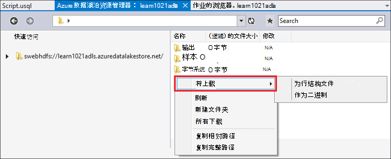

<properties
   pageTitle="开发 U SQL 脚本使用 Visual Studio 数据湖工具 |Azure"
   description="了解如何安装 Visual Studio，如何开发和测试 U SQL 脚本的数据湖工具。 "
   services="data-lake-analytics"
   documentationCenter=""
   authors="edmacauley"
   manager="jhubbard"
   editor="cgronlun"/>

<tags
   ms.service="data-lake-analytics"
   ms.devlang="na"
   ms.topic="get-started-article"
   ms.tgt_pltfrm="na"
   ms.workload="big-data"
   ms.date="05/16/2016"
   ms.author="edmaca"/>

# 教程︰ 开发数据湖工具使用 Visual Studio 的 U SQL 脚本

[AZURE.INCLUDE [get-started-selector](../../includes/data-lake-analytics-selector-get-started.md)]

了解如何安装 Visual Studio，数据湖工具以及如何使用 Visual Studio 的数据湖工具来编写和测试 U SQL 脚本。

U SQL 是超级可扩展性、 高度可扩展的准备、 转换和分析所有的数据在数据湖及以后语言。 有关详细信息，请参阅 [U SQL 参考] (http://go.microsoft.com/fwlink/p/?LinkId=691348)。

##系统必备组件

- **Visual Studio 2015年，Visual Studio 2013年更新 4 或 Visual Studio 2012。企业 （终极 / 特优）、 专业，社区版本支持;速成版不支持。当前不支持 Visual Studio"15"，我们正在从事的。**
- **Microsoft 的.NET 版本 2.7.1 或上方的 Azure SDK**。  安装使用[Web 平台安装程序](http://www.microsoft.com/web/downloads/platform.aspx)。
- **[Visual Studio 工具数据湖](http://aka.ms/adltoolsvs)**。

    一旦安装了 Visual Studio 的数据湖工具，您将看到在服务器资源管理器中 （您可以通过按 Ctrl + Alt + S 打开服务器资源管理器）"Azure"节点下的"数据湖分析"节点。

- **通过下面的两节中[开始使用 Azure 数据湖分析使用 Azure 的门户](data-lake-analytics-get-started-portal.md)**。

    - [创建 Azure 数据湖分析帐户](data-lake-analytics-get-started-portal.md#create_adl_analytics_account)。
    - [上载到默认数据湖存储帐户的 SearchLog.tsv](data-lake-analytics-get-started-portal.md#update-data-to-the-default-adl-storage-account)。

    为方便起见，可以[Appx-A PowerShell 准备本教程的示例](data-lake-analytics-data-lake-tools-get-started.md#appx-a-powershell-sample-for-preparing-the-tutorial)中找到 PowerShell 示例脚本用于创建数据湖分析服务和上传数据源文件。

    数据湖工具不支持创建数据湖分析帐户。 因此，您需要创建它使用 Azure 的门户，Azure PowerShell、.NET SDK 或 Azure CLI。 若要运行数据湖分析作业，将需要一些数据。 即使数据湖工具支持上载数据，您将使用门户上载为了便于按照本教程中的示例数据。

## 连接到 Azure

**若要连接到数据湖分析**

1. 打开 Visual Studio。
2. 从**视图**菜单上，单击**服务器资源管理器中**打开服务器资源管理器。 或按**[CTRL] + [ALT] + S**。
3. 用鼠标右键单击**Azure**，请单击"连接到 Microsoft Azure 订阅"，然后按照说明进行操作。
4. 从**服务器资源管理器中**，展开**Azure**，然后再展开**数据湖分析**。 如果有的话，您应看到数据湖分析帐户的列表。 您不能从 Visual Studio 创建数据湖分析帐户。 若要创建一个帐户，请参阅[开始使用 Azure 数据湖分析使用 Azure 门户](data-lake-analytics-get-started-portal.md)或[入门使用 Azure PowerShell Azure 数据湖分析](data-lake-analytics-get-started-powershell.md)。

## 将源数据文件上载

在本指南的前面部分中上载的**先决条件**部分中的某些数据。  

以防您想要使用您自己的数据，以下是从数据湖工具上载数据的过程。

**若要将文件上载到相关的 Azure 数据湖科目**

1. 从**服务器资源管理器**，依次展开**Azure**、**数据湖分析**、 数据湖分析帐户及展开**存储帐户**。 您应看到默认的数据湖存储帐户，和链接的数据湖存储帐户和链接的 Azure 存储帐户。 默认数据湖帐户具有"默认存储帐户"的标签。
2. 默认数据湖存储帐户，用鼠标右键单击，然后单击**资源管理器**。  它打开 Visual Studio 的资源管理器窗格数据湖工具。  在左侧，它显示树视图中，内容视图位于右侧。
3. 浏览到想要上载文件的文件夹
4. 用鼠标右键单击任意空白区域，然后单击**上载**。

    

**若要将文件上载到链接的 Azure Blob 存储帐户**

1. 从**服务器资源管理器**，依次展开**Azure**、**数据湖分析**、 数据湖分析帐户及展开**存储帐户**。 您应看到默认的数据湖存储帐户，和链接的数据湖存储帐户和链接的 Azure 存储帐户。
2. 展开的 Azure 存储帐户。
3. 用鼠标右键单击想要上传文件，的容器，然后单击**资源管理器**。 如果您没有一个容器，您必须首先创建一个使用 Azure 的门户，Azure PowerShell 或其他工具。
4. 浏览到想要上载文件的文件夹
5. 用鼠标右键单击任意空白区域，然后单击**上载**。

## 开发 U SQL 脚本

在 U SQL 语言编写数据湖分析作业。 若要了解有关 U SQL 的详细信息，请参阅[开始使用 U SQL 语言](data-lake-analytics-u-sql-get-started.md)和[U SQL 语言参考](http://go.microsoft.com/fwlink/?LinkId=691348)。

**若要创建和提交数据湖分析作业**

1. 从**文件**菜单上，单击**新建**，然后单击**项目**。
2. 选择**U SQL 项目**类型。

    

3. 单击**确定**。 与**Script.usql**文件，visual studio 将创建一个解决方案。
4. 在**Script.usql**中输入下面的脚本︰

        @searchlog =
            EXTRACT UserId          int,
                    Start           DateTime,
                    Region          string,
                    Query           string,
                    Duration        int?,
                    Urls            string,
                    ClickedUrls     string
            FROM "/Samples/Data/SearchLog.tsv"
            USING Extractors.Tsv();

        @res =
            SELECT *
            FROM @searchlog;        

        OUTPUT @res   
            TO "/Output/SearchLog-from-Data-Lake.csv"
        USING Outputters.Csv();

    该 U SQL 脚本读取源数据文件使用**Extractors.Tsv()**，，，然后创建 csv 文件使用**Outputters.Csv()**。

    不要修改这两条路径，除非源文件复制到其他位置。  如果不存在数据湖分析将创建的输出文件夹。

    它是简单的文件存储在默认数据湖帐户使用相对路径。 您也可以使用绝对路径。  例如

        adl://<Data LakeStorageAccountName>.azuredatalakestore.net:443/Samples/Data/SearchLog.tsv

    必须使用绝对路径来访问文件中链接的存储帐户。  在链接的 Azure 存储帐户中存储的文件的语法如下︰

        wasb://<BlobContainerName>@<StorageAccountName>.blob.core.windows.net/Samples/Data/SearchLog.tsv

    >[AZURE.NOTE] 目前不支持 azure Blob 容器公钥 blob 或公共容器的访问权限。  

    注意到下列功能︰

    - **IntelliSense**

        名称自动完成，成员将显示为行集、 类、 数据库、 架构和用户定义的对象 (UDOs)。

        为目录实体 （数据库、 架构、 表等 UDOs） IntelliSense 计算帐户相关。 您可以检查当前活动计算帐户、 数据库和架构在顶部的工具栏中，并通过下拉列表进行切换。

    - **展开*列**

        单击右侧的*，您应看到下面的蓝色下划线*。 在蓝色下划线，鼠标光标悬停，然后单击向下箭头。
        

        单击**展开列**，该工具将替换 * 列名称。

    - **自动套用格式**

        用户可以更改缩进 U SQL 脚本基于代码的结构下编辑-> 高级︰

        - 设置文档的格式 （Ctrl + E、 D）︰ 设置整个文档的格式   
        - 选定内容的格式 （Ctrl + K，Ctrl + F）︰ 选定内容的格式。 如果已没有选择，此快捷方式设置光标所在的行的格式。  

        所有格式设置规则可配置在工具-> 选项-> 文本编辑器-> SIP-> 格式。  
    - **智能缩进**

        数据湖 Visual Studio 工具是能够使您在编写脚本时自动缩进的表达式。 默认情况下禁用此功能，用户需要启用它通过检查 U-SQL-> 选项和设置-> 开关-> 启用智能缩进。

    - **转到定义和查找所有引用**

        右键单击行集/参数/列/UDO 等的名称，然后单击转到定义 (F12) 允许您导航到其定义。 通过单击查找所有引用 (Shift + F12)，将显示的所有引用。

    - **插入 Azure 的路径**

        它编写脚本，数据湖 Visual Studio 工具时手动而不是记住 Azure 的文件路径和类型提供一种简便方法︰ 用鼠标右键单击编辑器中，单击插入 Azure 路径。 导航到 Azure Blob 浏览器对话框中的文件。 单击**确定**。 文件路径将被插入到代码中。

5. 指定数据湖分析帐户、 数据库和架构。 您可以选择**（本地）**若要为测试目的在本地运行脚本。 有关详细信息，请参阅[运行 U-SQL 本地](#run-u-sql-locally)。

    

    有关详细信息，请参阅[使用 U SQL 目录](data-lake-analytics-use-u-sql-catalog.md)。

5. 从**解决方案资源管理器中**，用鼠标右键单击**Script.usql**，然后单击**生成脚本**。 确认输出窗格中的结果。
6. 从**解决方案资源管理器中**，用鼠标右键单击**Script.usql**，，然后单击**提交脚本**。 或者，也可以从 Script.usql 窗格中单击**提交**。  请参阅上面的屏幕快照。  请单击提交按钮提交使用的预付款选项旁边的向下箭头︰
7. 指定**作业名**，验证**分析帐户**，然后单击**提交**。 完成提交后，提交结果和作业链接是在 Visual Studio 的结果窗口的数据湖工具可用。

    

8. 您必须单击刷新按钮以查看最新的作业状态并刷新屏幕。 当作业成功，它将显示**作业图**中，**元数据操作**，**历史记录状态**，**诊断程序**︰

    

    * 作业摘要。 显示当前的作业的摘要信息，例如︰ 状态、 进度、 执行时间、 运行时名称、 审批等。   
    * 作业详细信息。 提供此作业的详细的信息，包括脚本、 资源，顶点执行视图。
    * 作业图。 提供了四个关系图来可视化作业的信息︰ 进度、 数据读取、 写入数据、 执行时间、 每个节点的平均执行时间、 吞吐量输入、 输出吞吐量。
    * 元数据操作。 它显示元数据的所有操作。
    * 状态的历史记录。
    * 诊断程序。 数据湖工具 Visual Studio 将自动诊断作业执行。 有一些错误或在工作中的性能问题时，您将收到通知。 作业诊断 （链接 TBD） 部件的详细信息，请参阅。

**检查作业状态**

1. 从服务器资源管理器，依次展开**Azure**、**数据湖分析**及展开数据湖分析帐户名
2. 双击要列出的作业的**作业**。
2. 单击要查看的状态的作业。

**若要查看作业输出**

1. 从**服务器资源管理器中**，展开**Azure**、 展开**数据湖分析**、 展开数据湖分析帐户，展开**存储帐户**，用鼠标右键单击默认的数据湖存储帐户，然后单击**资源管理器**。
2.  双击要打开的文件夹的**输出**
3.  双击**SearchLog 从 adltools.csv**。

###作业播放

作业播放使您能够监视作业执行进度，并直观地检测出性能异常和瓶颈。 该作业完成后 （即正在运行作业的时间） 在执行前，以及在执行完成后，可以使用此功能。 执行作业期间进行播放，将允许用户播放截至当前时间的进度。

**若要查看作业执行进度**  

1. 单击右上角的**负载配置文件**。 请参阅前面的屏幕快照。
2. 单击左下角查看作业执行进度上的播放按钮上。
3. 在播放期间，单击**暂停**停止它或直接将进度条拖到特定位置。

###热图

数据湖 Visual Studio 工具提供作业视图进行数据 i/o 操作、 执行时间、 I/O 吞吐量的每个阶段表示用户可以选择颜色叠加。 通过此操作，用户可以计算出潜在的问题和分发作业属性直接和直观的方式。 您可以选择要显示的下拉列表的数据源。  

## 本地运行 U SQL

使用 U SQL 本地运行的经验，在 Visual Studio 中，您可以︰

- 运行 C# 程序集与本地，U SQL 脚本。
- C# 程序集本地进行调试。
- 创建/删除/查看本地数据库、 程序集、 架构和表在服务器资源管理器就像可以对 Azure 数据湖分析服务。

您将看到在 Visual Studio 中，*本地*帐户和安装程序创建*DataRoot*文件夹位于*C:\LocalRunRoot*。 将使用 DataRoot 文件夹︰

- 存储元数据包括表，数据库、 TVFs 等。
- 对于某些脚本︰ 如果输入/输出路径中引用的相对路径，我们将查找 DataRoot （以及脚本的路径，如果它的输入）
- 如果您尝试注册程序集，并使用相对路径，不能引用 DataRoot 文件夹 （请参阅"使用程序集时执行本地运行"的更多详细信息的一部分）

下面的视频演示 U SQL 本地运行的功能︰

>[AZURE.VIDEO usql-localrun]

### 已知的问题和限制

- 不能创建表/数据库等在服务器资源管理器中的本地帐户。
- 如果引用，则相对路径︰

    - 在脚本输入 (提取 * 发"/ 路径/abc")-将搜索 DataRoot 路径和脚本路径。
    - 在脚本输出 （输出到"路径/abc"）︰ DataRoot 路径将被用作输出文件夹。
    - 程序集注册中 (从创建程序集 xyz"/ 路径/abc"): 将搜索脚本路径，但不是 DataRoot。
    - 在注册 TVF/视图和其他实体的元数据︰ DataRoot 路径将搜索，而不是脚本路径。

    脚本运行数据湖服务上，默认的存储帐户将用作根文件夹并将相应地搜索。

### 测试本地 U SQL 脚本
有关开发 U SQL 脚本的说明，请参阅[开发 U-SQL 脚本](#develop-and-test-u-sql-scripts)。 生成并运行 U SQL 脚本本地，在群集下拉列表中，选择**（本地）** ，然后单击**提交**。 请确保您有适当的数据引用-或者参考的绝对路径，或将数据放在 DataRoot 文件夹下。

您可以也右击脚本和在上下文菜单中，单击**运行本地计划**，或按**CTRL + F5**到触发本地运行。

### 在本地运行中使用的程序集

有两种方法运行自定义的 C# 文件︰

- 在代码隐藏文件中编写程序集，程序集将自动注册和脚本完成后丢弃。
- 创建一个 C# 程序集项目和注册到本地帐户通过类似下面的脚本的输出 dll。 请注意，该路径是相对于该脚本，而不是 DataRoot 文件夹。

### 调试脚本和 C# 程序集本地

您可以调试 C# 程序集无需提交并注册到 Azure 数据湖分析服务。 在代码隐藏文件中，并引用 C# 项目中，您可以设置断点。

**在代码隐藏文件中的本地代码进行调试**
1.  在代码隐藏文件中设置断点。
2.  按**F5** ，以调试本地脚本。

以下过程仅适用于 Visual Studio 2015年中。 在旧版本的 Visual Studio 中可能需要手动添加 pdb 文件。

**引用的 C# 项目中的本地代码进行调试**
1.  创建一个 C# 程序集项目，并编译它以生成输出 dll。
2.  注册 dll 使用 U SQL 语句︰

        CREATE ASSEMBLY assemblyname FROM @"..\..\path\to\output\.dll";
3.  在 C# 代码中设置断点。
4.  按**F5** ，以调试与引用 C# dll 本地脚本。  

##请参见

要开始使用数据使用不同的工具的湖泊分析，请参阅︰

- [有关数据使用 Azure 门户的湖泊分析入门](data-lake-analytics-get-started-portal.md)
- [有关数据使用 Azure PowerShell 的湖泊分析入门](data-lake-analytics-get-started-powershell.md)
- [数据使用.NET SDK 的湖泊分析入门](data-lake-analytics-get-started-net-sdk.md)
- [调试中 U SQL 作业的 C# 代码](data-lake-analytics-debug-u-sql-jobs.md)

若要查看更多开发主题︰

- [分析网络日志使用数据湖分析](data-lake-analytics-analyze-weblogs.md)
- [开发数据湖工具用于 Visual Studio U SQL 脚本](data-lake-analytics-data-lake-tools-get-started.md)
- [Azure 数据湖分析 U SQL 语言入门](data-lake-analytics-u-sql-get-started.md)
- [开发数据湖分析作业的 U SQL 用户定义运算符](data-lake-analytics-u-sql-develop-user-defined-operators.md)

##为准备教程 Appx A PowerShell 示例

下面的 PowerShell 脚本准备 Azure 数据湖分析帐户和源数据，以便于[开发 U-SQL 脚本](data-lake-analytics-data-lake-tools-get-started.md#develop-u-sql-scripts)，则可以跳过。

    #region - used for creating Azure service names
    $nameToken = "<Enter an alias>"
    $namePrefix = $nameToken.ToLower() + (Get-Date -Format "MMdd")
    #endregion

    #region - service names
    $resourceGroupName = $namePrefix + "rg"
    $dataLakeStoreName = $namePrefix + "adas"
    $dataLakeAnalyticsName = $namePrefix + "adla"
    $location = "East US 2"
    #endregion

    # Treat all errors as terminating
    $ErrorActionPreference = "Stop"

    #region - Connect to Azure subscription
    Write-Host "`nConnecting to your Azure subscription ..." -ForegroundColor Green
    try{Get-AzureRmContext}
    catch{Login-AzureRmAccount}
    #endregion

    #region - Create an Azure Data Lake Analytics service account
    Write-Host "Create a resource group ..." -ForegroundColor Green
    New-AzureRmResourceGroup `
        -Name  $resourceGroupName `
        -Location $location

    Write-Host "Create a Data Lake account ..."  -ForegroundColor Green
    New-AzureRmDataLakeStoreAccount `
        -ResourceGroupName $resourceGroupName `
        -Name $dataLakeStoreName `
        -Location $location

    Write-Host "Create a Data Lake Analytics account ..."  -ForegroundColor Green
    New-AzureRmDataLakeAnalyticsAccount `
        -Name $dataLakeAnalyticsName `
        -ResourceGroupName $resourceGroupName `
        -Location $location `
        -DefaultDataLake $dataLakeStoreName

    Write-Host "The newly created Data Lake Analytics account ..."  -ForegroundColor Green
    Get-AzureRmDataLakeAnalyticsAccount `
        -ResourceGroupName $resourceGroupName `
        -Name $dataLakeAnalyticsName  
    #endregion

    #region - prepare the source data
    Write-Host "Import the source data ..."  -ForegroundColor Green
    $localFolder = "C:\Tutorials\Downloads\" # A temp location for the file.
    $storageAccount = "adltutorials"  # Don't modify this value.
    $container = "adls-sample-data"  #Don't modify this value.

    # Create the temp location  
    New-Item -Path $localFolder -ItemType Directory -Force

    # Download the sample file from Azure Blob storage
    $context = New-AzureStorageContext -StorageAccountName $storageAccount -Anonymous
    $blobs = Azure\Get-AzureStorageBlob -Container $container -Context $context
    $blobs | Get-AzureStorageBlobContent -Context $context -Destination $localFolder

    # Upload the file to the default Data Lake Store account    
    Import-AzureRmDataLakeStoreItem -AccountName $dataLakeStoreName -Path $localFolder"SearchLog.tsv" -Destination "/Samples/Data/SearchLog.tsv"

    Write-Host "List the source data ..."  -ForegroundColor Green
    Get-AzureRmDataLakeStoreChildItem -Account $dataLakeStoreName -Path  "/Samples/Data/"
    #endregion
