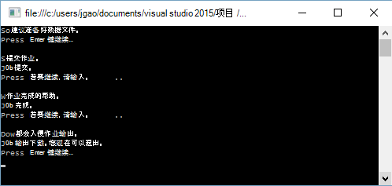

<properties 
   pageTitle="开始使用 Azure 数据湖分析使用.NET SDK |Azure" 
   description="了解如何使用.NET SDK 来创建数据湖存储帐户，创建数据湖分析作业并提交作业用 U SQL 编写的。 " 
   services="data-lake-analytics" 
   documentationCenter="" 
   authors="edmacauley" 
   manager="jhubbard" 
   editor="cgronlun"/>
 
<tags
   ms.service="data-lake-analytics"
   ms.devlang="na"
   ms.topic="hero-article"
   ms.tgt_pltfrm="na"
   ms.workload="big-data" 
   ms.date="10/26/2016"
   ms.author="edmaca"/>

# 有关使用.NET SDK Azure 数据湖分析入门教程︰

[AZURE.INCLUDE [get-started-selector](../../includes/data-lake-analytics-selector-get-started.md)]

了解如何使用 Azure.NET SDK 提交写入数据湖分析[U SQL](data-lake-analytics-u-sql-get-started.md)中的作业。 有关数据湖分析的详细信息，请参阅[Azure 数据湖分析概述](data-lake-analytics-overview.md)。

在本教程中，您将开发一个 C# 控制台应用程序提交读取一个标签的 U SQL 作业分隔的值 (TSV) 文件并将其转换为逗号分隔的值 (CSV) 文件。 要通过同一教程使用其他支持的工具，请单击本文顶部的选项卡。

##系统必备组件

在开始本教程之前，您必须具有以下︰

- **Visual Studio 2015年，Visual Studio 2013年更新 4 或用 Visual C++ 安装的 Visual Studio 2012**。
- **Microsoft 的.NET 版本 2.5 或更高的 Azure SDK**。  安装使用[Web 平台安装程序](http://www.microsoft.com/web/downloads/platform.aspx)。
- **Azure 数据湖分析帐户**。 请参阅[管理使用 Azure.NET SDK 数据湖分析](data-lake-analytics-manage-use-dotnet-sdk.md)。

##创建控制台应用程序

在本教程中，您可以处理某些搜索日志。  搜索日志可以存储在数据湖商店或 Azure Blob 存储中。 

在公用的 Azure Blob 容器中找不到搜索日志示例。 在应用程序中，将文件下载到您的工作站，然后将该文件上载到数据湖分析帐户的默认数据湖存储帐户。

**若要创建一个 U SQL 脚本**

在 U SQL 语言编写数据湖分析作业。 若要了解有关 U SQL 的详细信息，请参阅[开始使用 U SQL 语言](data-lake-analytics-u-sql-get-started.md)和[U SQL 语言参考](http://go.microsoft.com/fwlink/?LinkId=691348)。

使用下面的 U SQL 脚本创建**SampleUSQLScript.txt**文件并将文件放在 **C:\temp\**路径。  此路径是在下一个过程中创建的.NET 应用程序中硬编码。  

    @searchlog =
        EXTRACT UserId          int,
                Start           DateTime,
                Region          string,
                Query           string,
                Duration        int?,
                Urls            string,
                ClickedUrls     string
        FROM "/Samples/Data/SearchLog.tsv"
        USING Extractors.Tsv();
    
    OUTPUT @searchlog   
        TO "/Output/SearchLog-from-Data-Lake.csv"
    USING Outputters.Csv();

该 U SQL 脚本读取源数据文件使用**Extractors.Tsv()**，，，然后创建 csv 文件使用**Outputters.Csv()**。 

在 C# 程序中，您需要准备的**/Samples/Data/SearchLog.tsv**文件和**/Output/**文件夹。    

它是简单的文件存储在默认数据湖帐户使用相对路径。 您也可以使用绝对路径。  例如 

    adl://<Data LakeStorageAccountName>.azuredatalakestore.net:443/Samples/Data/SearchLog.tsv
    
必须使用绝对路径来访问文件中链接的存储帐户。  在链接的 Azure 存储帐户中存储的文件的语法如下︰

    wasb://<BlobContainerName>@<StorageAccountName>.blob.core.windows.net/Samples/Data/SearchLog.tsv

>[AZURE.NOTE] 目前 Azure 数据湖服务的已知的问题。  如果示例应用程序中断或遇到错误，则可能需要手动删除该脚本创建的湖泊数据存储和数据湖分析帐户。  如果你不熟悉的 Azure 的门户，[管理 Azure 数据湖分析使用 Azure 门户](data-lake-analytics-manage-use-portal.md)指南会您入门。       

**若要创建应用程序**

1. 打开 Visual Studio。
2. 创建一个 C# 控制台应用程序。
3. NuGet 程序包管理控制台中，打开并运行以下命令︰

        Install-Package Microsoft.Azure.Management.DataLake.Analytics -Pre
        Install-Package Microsoft.Azure.Management.DataLake.Store -Pre
        Install-Package Microsoft.Azure.Management.DataLake.StoreUploader -Pre
        Install-Package Microsoft.Rest.ClientRuntime.Azure.Authentication -Pre
        Install-Package WindowsAzure.Storage

       
5. 在 Program.cs 中，粘贴以下代码︰

        using System;
        using System.IO;
        using System.Collections.Generic;
        using System.Threading;
        using Microsoft.Rest;
        using Microsoft.Rest.Azure.Authentication;
        using Microsoft.Azure.Management.DataLake.Store;
        using Microsoft.Azure.Management.DataLake.StoreUploader;
        using Microsoft.Azure.Management.DataLake.Analytics;
        using Microsoft.Azure.Management.DataLake.Analytics.Models;
        using Microsoft.WindowsAzure.Storage.Blob;

        namespace SdkSample
        {
          class Program
          {
            private const string SUBSCRIPTIONID = "<Enter Your Azure Subscription ID>";
            private const string CLIENTID = "1950a258-227b-4e31-a9cf-717495945fc2";
            private const string DOMAINNAME = "common"; // Replace this string with the user's Azure Active Directory tenant ID or domain name, if needed.

            private static string _adlaAccountName = "<Enter an Existing Data Lake Analytics Account Name>";
            private static string _adlsAccountName = "<Enter the default Data Lake Store Account Name>";

            private static DataLakeAnalyticsAccountManagementClient _adlaClient;
            private static DataLakeStoreFileSystemManagementClient _adlsFileSystemClient;
            private static DataLakeAnalyticsJobManagementClient _adlaJobClient;
        
            private static void Main(string[] args)
            {
                string localFolderPath = @"c:\temp\";

                // Connect to Azure
                var creds = AuthenticateAzure(DOMAINNAME, CLIENTID);

                SetupClients(creds, SUBSCRIPTIONID);

                // Transfer the source file from a public Azure Blob container to Data Lake Store.
                CloudBlockBlob blob = new CloudBlockBlob(new Uri("https://adltutorials.blob.core.windows.net/adls-sample-data/SearchLog.tsv"));
                blob.DownloadToFile(localFolderPath + "SearchLog.tsv", FileMode.Create); // from WASB
                UploadFile(localFolderPath + "SearchLog.tsv", "/Samples/Data/SearchLog.tsv"); // to ADLS
                WaitForNewline("Source data file prepared.", "Submitting a job.");

                // Submit the job
                Guid jobId = SubmitJobByPath(localFolderPath + "SampleUSQLScript.txt", "My First ADLA Job");
                WaitForNewline("Job submitted.", "Waiting for job completion.");

                // Wait for job completion
                WaitForJob(jobId);
                WaitForNewline("Job completed.", "Downloading job output.");

                // Download job output
                DownloadFile(@"/Output/SearchLog-from-Data-Lake.csv", localFolderPath + "SearchLog-from-Data-Lake.csv");
        
                WaitForNewline("Job output downloaded. You can now exit.");
            }
        
            public static ServiceClientCredentials AuthenticateAzure(
                string domainName,
                string nativeClientAppCLIENTID)
            {
                // User login via interactive popup
                SynchronizationContext.SetSynchronizationContext(new SynchronizationContext());
                // Use the client ID of an existing AAD "Native Client" application.
                var activeDirectoryClientSettings = ActiveDirectoryClientSettings.UsePromptOnly(nativeClientAppCLIENTID, new Uri("urn:ietf:wg:oauth:2.0:oob"));
                return UserTokenProvider.LoginWithPromptAsync(domainName, activeDirectoryClientSettings).Result;
            }

            public static void SetupClients(ServiceClientCredentials tokenCreds, string subscriptionId)
            {
                _adlaClient = new DataLakeAnalyticsAccountManagementClient(tokenCreds);
                _adlaClient.SubscriptionId = subscriptionId;

                _adlaJobClient = new DataLakeAnalyticsJobManagementClient(tokenCreds);

                _adlsFileSystemClient = new DataLakeStoreFileSystemManagementClient(tokenCreds);
            }

            public static void UploadFile(string srcFilePath, string destFilePath, bool force = true)
            {
                var parameters = new UploadParameters(srcFilePath, destFilePath, _adlsAccountName, isOverwrite: force);
                var frontend = new DataLakeStoreFrontEndAdapter(_adlsAccountName, _adlsFileSystemClient);
                var uploader = new DataLakeStoreUploader(parameters, frontend);
                uploader.Execute();
            }

            public static void DownloadFile(string srcPath, string destPath)
            {
                var stream = _adlsFileSystemClient.FileSystem.Open(_adlsAccountName, srcPath);
                var fileStream = new FileStream(destPath, FileMode.Create);

                stream.CopyTo(fileStream);
                fileStream.Close();
                stream.Close();
            }

            // Helper function to show status and wait for user input
            public static void WaitForNewline(string reason, string nextAction = "")
            {
                Console.WriteLine(reason + "\r\nPress ENTER to continue...");

                Console.ReadLine();

                if (!String.IsNullOrWhiteSpace(nextAction))
                    Console.WriteLine(nextAction);
            }

            // List all Data Lake Analytics accounts within the subscription
            public static List<DataLakeAnalyticsAccount> ListADLAAccounts()
            {
                var response = _adlaClient.Account.List();
                var accounts = new List<DataLakeAnalyticsAccount>(response);

                while (response.NextPageLink != null)
                {
                    response = _adlaClient.Account.ListNext(response.NextPageLink);
                    accounts.AddRange(response);
                }

                Console.WriteLine("You have %i Data Lake Analytics account(s).", accounts.Count);
                for (int i = 0; i < accounts.Count; i++)
                {
                    Console.WriteLine(accounts[i].Name);
                }

                return accounts;
            }
            public static Guid SubmitJobByPath(string scriptPath, string jobName)
            {
                var script = File.ReadAllText(scriptPath);

                var jobId = Guid.NewGuid();
                var properties = new USqlJobProperties(script);
                var parameters = new JobInformation(jobName, JobType.USql, properties, priority: 1, degreeOfParallelism: 1, jobId: jobId);
                var jobInfo = _adlaJobClient.Job.Create(_adlaAccountName, jobId, parameters);

                return jobId;
            }

            public static JobResult WaitForJob(Guid jobId)
            {
                var jobInfo = _adlaJobClient.Job.Get(_adlaAccountName, jobId);
                while (jobInfo.State != JobState.Ended)
                {
                    jobInfo = _adlaJobClient.Job.Get(_adlaAccountName, jobId);
                }
                return jobInfo.Result.Value;
            }
          }
        }

6. 按**f5 键**以运行该应用程序。 输出内容类似︰

    

7. 请检查输出文件。  默认的路径和文件名称是 c:\Temp\SearchLog-from-Data-Lake.csv。

## 请参见

- 若要查看同一教程使用其他工具，请单击页面顶部的选项卡上选择器。
- 更复杂的查询，请参阅[分析网站日志使用 Azure 数据湖分析](data-lake-analytics-analyze-weblogs.md)。
- 首先开发 U SQL 应用程序，请参见[使用 Visual Studio 的数据湖工具开发 U-SQL 脚本](data-lake-analytics-data-lake-tools-get-started.md)。
- U SQL，请参阅[开始使用 Azure 数据湖分析 U SQL 语言](data-lake-analytics-u-sql-get-started.md)，和[U SQL 语言参考](http://go.microsoft.com/fwlink/?LinkId=691348)。
- 管理任务，请参阅[管理 Azure 数据湖分析使用 Azure 的门户](data-lake-analytics-manage-use-portal.md)。
- 若要获取数据分析湖泊功能的概述，请参阅[Azure 数据湖分析概述](data-lake-analytics-overview.md)。
