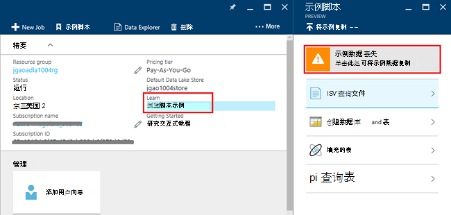
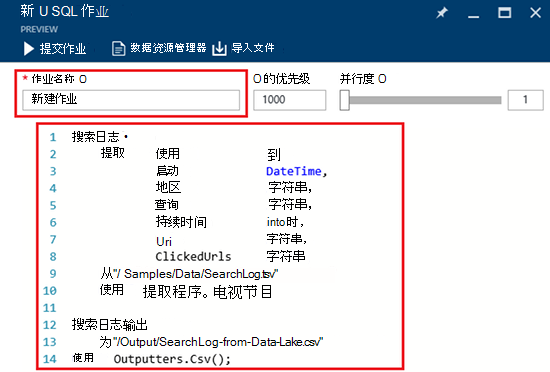
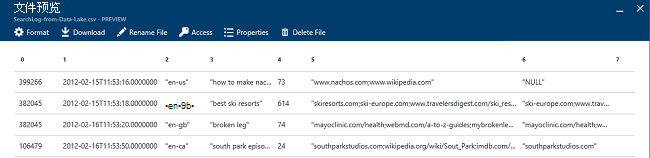

<properties 
   pageTitle="开始使用 Azure 数据湖分析使用 Azure 门户 |Azure" 
   description="了解如何使用 Azure 门户创建一个数据湖分析帐户，请创建使用 U-SQL 数据湖分析作业并提交作业。 " 
   services="data-lake-analytics" 
   documentationCenter="" 
   authors="edmacauley" 
   manager="jhubbard" 
   editor="cgronlun"/>
 
<tags
   ms.service="data-lake-analytics"
   ms.devlang="na"
   ms.topic="hero-article"
   ms.tgt_pltfrm="na"
   ms.workload="big-data" 
   ms.date="10/06/2016"
   ms.author="edmaca"/>

# 有关使用 Azure 门户 Azure 数据湖分析入门教程︰

[AZURE.INCLUDE [get-started-selector](../../includes/data-lake-analytics-selector-get-started.md)]

了解如何使用 Azure 门户创建 Azure 数据湖分析科目在[U SQL](data-lake-analytics-u-sql-get-started.md)中，定义数据湖分析作业，将作业提交到数据湖分析服务。 有关数据湖分析的详细信息，请参阅[Azure 数据湖分析概述](data-lake-analytics-overview.md)。

在本教程中，您将开发制表符分隔的值 (TSV) 文件并将它转换为逗号分隔值 (CSV) 文件中读取作业。 要通过同一教程使用其他支持的工具，请单击本节顶部的选项卡。 一旦您第一个作业成功，您可以开始编写更复杂的数据转换与 U SQL。

##系统必备组件

在开始本教程之前，您必须具有以下各项︰

- **Azure 订阅**。 请参阅[获取 Azure 免费试用版](https://azure.microsoft.com/pricing/free-trial/)。

##创建数据湖分析帐户

您可以运行任何作业之前，您必须具有数据湖分析帐户。

每个数据湖分析帐户具有[Azure 数据湖存储]()帐户依赖关系。  此帐户被称为默认数据湖存储帐户。  事先或创建数据湖分析帐户时，您可以创建数据湖存储帐户。 在本教程中，您将使用数据湖分析帐户创建数据湖存储帐户。

**若要创建一个数据湖分析帐户**

1. 登录到[Azure 的门户](https://portal.azure.com)。
2. 单击**新建**，单击**智能 + 分析**，然后单击**数据湖分析**。
3. 键入或选择以下值︰

    

    - **名称**︰ 命名数据湖分析帐户。
    - **订阅**︰ 选择 Azure 用于分析客户的预订。
    - **资源组**。 选择一个现有的 Azure 资源组或新建一个。 Azure 的资源管理器使您可以使用作为一个组应用程序中的资源。 有关详细信息，请参阅[Azure 资源管理器概述](resource-group-overview.md)。 
    - **位置**。 选择数据湖分析帐户 Azure 数据中心。 
    - **数据湖商店**︰ 每个数据湖分析帐户有相关的数据湖存储帐户。 数据湖分析帐户和相关数据湖存储帐户必须位于相同的 Azure 数据中心。 按照说明创建新的数据湖存储帐户，或选择一个现有。

8. 单击**创建**。 它将带您的门户的主页屏幕。 新的拼贴显示"部署 Azure 数据湖分析"标签添加到 StartBoard。 花费一些时间来创建一个数据湖分析帐户。 创建帐户时，门户将打开新的刀片式服务器上的帐户。

创建一个数据湖分析帐户后，可以添加其他数据湖存储帐户和 Azure 存储帐户。 有关说明，请参阅[管理数据湖分析客户数据源](data-lake-analytics-manage-use-portal.md#manage-account-data-sources)。

##准备源数据

在本教程中，您可以处理某些搜索日志。  搜索日志可以存储在 dData 湖商店或 Azure Blob 存储中。 

Azure 的门户网站提供的用户界面，用于将某些示例数据文件复制到默认数据湖存储帐户，其中包括搜索日志文件。

**要将示例数据复制文件**

1. 从[Azure 门户](https://portal.azure.com)，打开数据湖分析帐户。  请参阅[管理数据湖分析帐户](data-lake-analytics-get-started-portal.md#manage-accounts)创建并打开在门户中的客户。
3. 展开**精要**窗格，然后单击**资源管理器的示例脚本**。 它会打开另一台刀片式服务器调用**的示例脚本**。

    

4. 单击**示例数据丢失**复制示例数据文件。 完成后，门户将显示**示例数据已成功更新**。
7. 从数据湖分析帐户刀片式服务器，请单击**数据资源管理器**顶部。 

    

    它会打开两个刀片。 一个**数据资源管理器**，和另一种是默认的数据湖存储帐户。
8. 在默认数据湖存储帐户刀片式服务器，请单击**样本**，以展开该文件夹，然后单击以展开文件夹的**数据**。 您应看到以下文件和文件夹︰

    - AmbulanceData /
    - AdsLog.tsv
    - SearchLog.tsv
    - version.txt
    - WebLog.log
    
    在本教程中，您可以使用 SearchLog.tsv。

在实践中，或者编写您的应用程序将数据写入到链接的存储帐户或上载数据。 上传文件，请参阅[将上载到数据湖存储区](data-lake-analytics-manage-use-portal.md#upload-data-to-adls)或[上载到 Blob 存储的数据](data-lake-analytics-manage-use-portal.md#upload-data-to-wasb)。

##创建和提交数据湖分析作业

您已经准备源数据之后，可以开始开发 U SQL 脚本。  

**若要提交作业**

1. 从数据湖分析帐户刀片式服务器在门户网站上，单击**新建作业**。 

    

    如果您看不到刀片式服务器，请参阅[打开门户网站从一个数据湖分析帐户](data-lake-analytics-manage-use-portal.md#access-adla-account)。
2. 输入**作业的名称**和下面的 U SQL 脚本︰

        @searchlog =
            EXTRACT UserId          int,
                    Start           DateTime,
                    Region          string,
                    Query           string,
                    Duration        int?,
                    Urls            string,
                    ClickedUrls     string
            FROM "/Samples/Data/SearchLog.tsv"
            USING Extractors.Tsv();
        
        OUTPUT @searchlog   
            TO "/Output/SearchLog-from-Data-Lake.csv"
        USING Outputters.Csv();

    

    该 U SQL 脚本读取源数据文件使用**Extractors.Tsv()**，，，然后创建 csv 文件使用**Outputters.Csv()**。 
    
    不要修改这两条路径，除非您将源文件复制到其他位置。  数据湖分析创建的输出文件夹，如果它不存在。  在这种情况下，我们使用简单的相对路径。  
    
    它是简单地使用默认数据湖帐户中存储的文件的相对路径。 您也可以使用绝对路径。  例如 
    
        adl://<Data LakeStorageAccountName>.azuredatalakestore.net:443/Samples/Data/SearchLog.tsv
      

    关于 U SQL 的详细信息，请参阅[开始使用 Azure 数据湖分析 U SQL 语言](data-lake-analytics-u-sql-get-started.md)和[U SQL 语言参考](http://go.microsoft.com/fwlink/?LinkId=691348)。
     
3. 从顶部单击**提交作业**。   
4. 等待，直到作业状态更改为**成功**。 您可以看到该作业所花费大约一分钟才能完成。
    
    如果作业失败，请参见[显示器并解决数据湖分析作业](data-lake-analytics-monitor-and-troubleshoot-jobs-tutorial.md)。

5. 刀片式服务器的底部，单击**输出**选项卡，然后单击**SearchLog 从数据 Lake.csv**。 可以预览、 下载、 重命名和删除的输出文件。

    

##请参见

- 更复杂的查询，请参阅[分析网站日志使用 Azure 数据湖分析](data-lake-analytics-analyze-weblogs.md)。
- 首先开发 U SQL 应用程序，请参见[使用 Visual Studio 的数据湖工具开发 U-SQL 脚本](data-lake-analytics-data-lake-tools-get-started.md)。
- U SQL，请参阅[开始使用 Azure 数据湖分析 U SQL 语言](data-lake-analytics-u-sql-get-started.md)。
- 管理任务，请参阅[管理 Azure 数据湖分析使用 Azure 的门户](data-lake-analytics-manage-use-portal.md)。
- 若要获取数据分析湖泊功能的概述，请参阅[Azure 数据湖分析概述](data-lake-analytics-overview.md)。
- 若要查看同一教程使用其他工具，请单击页面顶部的选项卡上选择器。
- 若要记录的诊断信息，请参阅[访问诊断日志中的 Azure 数据湖分析](data-lake-analytics-diagnostic-logs.md)
