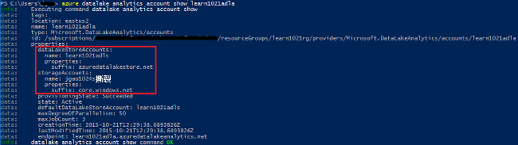
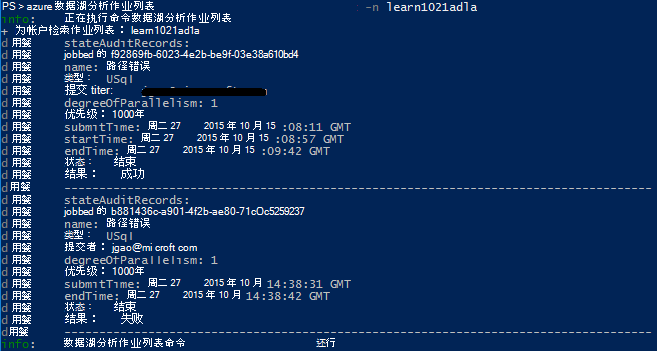
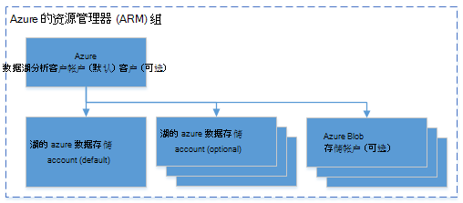

<properties 
   pageTitle="管理 Azure 数据湖分析使用 Azure 命令行界面 |Azure" 
   description="了解如何管理数据湖分析帐户、 数据源、 作业和用户使用 Azure CLI" 
   services="data-lake-analytics" 
   documentationCenter="" 
   authors="edmacauley" 
   manager="jhubbard" 
   editor="cgronlun"/>
 
<tags
   ms.service="data-lake-analytics"
   ms.devlang="na"
   ms.topic="article"
   ms.tgt_pltfrm="na"
   ms.workload="big-data" 
   ms.date="05/16/2016"
   ms.author="edmaca"/>

# 管理 Azure 数据湖分析使用 Azure 的命令行界面 (CLI)

[AZURE.INCLUDE [manage-selector](../../includes/data-lake-analytics-selector-manage.md)]

了解如何管理 Azure 数据湖分析帐户、 数据源、 用户和使用 Azure 作业。 使用其他工具管理主题，请单击上面的选项卡上选择。

**系统必备组件**

在开始本教程之前，您必须具有以下︰

- **Azure 订阅**。 请参阅[获取 Azure 免费试用版](https://azure.microsoft.com/pricing/free-trial/)。
- **Azure CLI**。 请参阅[安装和配置 Azure CLI](../xplat-cli-install.md)。
    - 下载并安装**预发布** [Azure CLI 工具](https://github.com/MicrosoftBigData/AzureDataLake/releases)来完成此演示。
- **身份验证**，使用下面的命令︰

        azure login
    使用工作或学校的帐户进行验证的详细信息，请参阅[连接到 Azure CLI 从 Azure 订阅](../xplat-cli-connect.md)。
- **切换到 Azure 资源管理器模式**，使用下面的命令︰

        azure config mode arm

**若要列出数据湖存储和数据湖分析命令︰**

    azure datalake store
    azure datalake analytics

<!-- ################################ -->
<!-- ################################ -->
## 管理帐户

在运行任何数据湖分析作业之前, 必须有数据湖分析帐户。 Azure HDInsight 与您不想花钱分析帐户时未运行作业。  只需付费次运行作业时。  有关详细信息，请参阅[Azure 数据湖分析概述](data-lake-analytics-overview.md)。  

###创建帐户

    azure datalake analytics account create "<Data Lake Analytics Account Name>" "<Azure Location>" "<Resource Group Name>" "<Default Data Lake Account Name>"

###更新帐户

下面的命令更新现有数据湖分析帐户的属性
    
    azure datalake analytics account set "<Data Lake Analytics Account Name>"

###列表中的帐户

列表数据湖分析帐户 

    azure datalake analytics account list

列表数据湖分析特定资源组中的帐户

    azure datalake analytics account list -g "<Azure Resource Group Name>"

获取特定数据湖分析帐户的详细信息

    azure datalake analytics account show -g "<Azure Resource Group Name>" -n "<Data Lake Analytics Account Name>"

###删除数据湖分析帐户

    azure datalake analytics account delete "<Data Lake Analytics Account Name>"

<!-- ################################ -->
<!-- ################################ -->
## 管理帐户数据源

数据湖分析目前支持下列数据源︰

- [Azure 数据湖存储区](../data-lake-store/data-lake-store-overview.md)
- [Azure 存储](../storage/storage-introduction.md)

创建一个分析帐户时，必须指定 Azure 数据湖存储帐户是默认的存储帐户。 默认的 ADL 存储帐户用于存储作业元数据和作业审核日志。 已创建分析帐户后，可以添加额外的数据湖存储帐户和/或 Azure 存储帐户。 

### 查找默认 ADL 存储帐户

    azure datalake analytics account show "<Data Lake Analytics Account Name>"

值将出现在属性︰ datalakeStoreAccount:name。

### 添加其他 Azure Blob 存储帐户

    azure datalake analytics account datasource add -n "<Data Lake Analytics Account Name>" -b "<Azure Blob Storage Account Short Name>" -k "<Azure Storage Account Key>"

>[AZURE.NOTE] 支持仅 Blob 存储短名称。  不要使用 FQDN，例如"myblob.blob.core.windows.net"。

### 添加其他数据湖存储帐户

    azure datalake analytics account datasource add -n "<Data Lake Analytics Account Name>" -l "<Data Lake Store Account Name>" [-d]

[-d] 是一个可选的参数，以指示是否正在添加数据湖是默认的数据湖帐户。 

### 更新现有的数据源

若要将现有数据湖存储帐户成为默认设置︰

    azure datalake analytics account datasource set -n "<Data Lake Analytics Account Name>" -l "<Azure Data Lake Store Account Name>" -d
      
若要更新现有的 Blob 存储帐户密钥︰

    azure datalake analytics account datasource set -n "<Data Lake Analytics Account Name>" -b "<Blob Storage Account Name>" -k "<New Blob Storage Account Key>"

### 列出数据源︰

    azure datalake analytics account show "<Data Lake Analytics Account Name>"
    

### 删除数据源︰

若要删除数据湖存储帐户︰

    azure datalake analytics account datasource delete "<Data Lake Analytics Account Name>" "<Azure Data Lake Store Account Name>"

若要删除一个 Blob 存储帐户︰

    azure datalake analytics account datasource delete "<Data Lake Analytics Account Name>" "<Blob Storage Account Name>"

## 管理作业

您可以创建一个作业前，您必须具有数据湖分析帐户。  有关详细信息，请参阅[管理数据湖分析帐户](#manage-accounts)。

### 列表中的作业

    azure datalake analytics job list -n "<Data Lake Analytics Account Name>"

### 获取作业详细信息

    azure datalake analytics job show -n "<Data Lake Analytics Account Name>" -j "<Job ID>"
    
### 提交作业

> [AZURE.NOTE] 作业的默认优先级是 1000年，并行作业的默认度为 1。

    azure datalake analytics job create  "<Data Lake Analytics Account Name>" "<Job Name>" "<Script>"

### 取消作业

使用列表命令来查找作业 id，然后使用取消按钮的取消作业。

    azure datalake analytics job list -n "<Data Lake Analytics Account Name>"
    azure datalake analytics job cancel "<Data Lake Analytics Account Name>" "<Job ID>"

## 管理目录

U SQL 目录用于组织数据和代码，以便它们可以共享由 U SQL 脚本。 目录提供了 Azure 数据湖中的数据可能的最高性能。 有关详细信息，请参阅[使用 U SQL 目录](data-lake-analytics-use-u-sql-catalog.md)。
 
###列表中的目录项

    #List databases
    azure datalake analytics catalog list -n "<Data Lake Analytics Account Name>" -t database

    #List tables
    azure datalake analytics catalog list -n "<Data Lake Analytics Account Name>" -t table
    
类型包括数据库、 架构、 程序集、 外部数据源、 表、 表值函数或表统计信息。

###创建目录密码

    azure datalake analytics catalog secret create -n "<Data Lake Analytics Account Name>" <databaseName> <hostUri> <secretName>

### 修改目录密码

    azure datalake analytics catalog secret set -n "<Data Lake Analytics Account Name>" <databaseName> <hostUri> <secretName>

###删除目录密码

    azure datalake analytics catalog secrete delete -n "<Data Lake Analytics Account Name>" <databaseName> <hostUri> <secretName>

<!-- ################################ -->
<!-- ################################ -->
## 使用 ARM 组

应用程序通常组成许多组件，例如 web 应用程序、 数据库、 数据库服务器、 存储和第三方服务。 Azure 资源管理器 (ARM) 使您能够使用您的应用程序作为一个组，称为 Azure 资源组中的资源。 可以部署、 更新、 监视或删除单个、 协调操作中的应用程序的所有资源。 您的部署使用的模板，该模板可以适合不同的环境，如测试、 过渡和生产。 您可以通过查看整个组的汇总的成本为您的组织澄清计费。 有关详细信息，请参阅[Azure 资源管理器概述](../azure-resource-manager/resource-group-overview.md)。 

数据湖分析服务可以包括以下组件︰

- Azure 数据湖分析帐户
- 所需的默认 Azure 数据湖存储帐户
- 其他数据湖 Azure 存储帐户
- 其他 Azure 存储帐户

您可以创建一个 ARM 组以使其更易于管理下的所有这些组件。

数据湖分析帐户和从属存储帐户必须位于相同的 Azure 数据中心。
ARM 组但是可以位于不同的数据中心。  

##请参见 

- [Microsoft Azure 数据湖分析的概述](data-lake-analytics-overview.md)
- [有关数据使用 Azure 门户的湖泊分析入门](data-lake-analytics-get-started-portal.md)
- [管理 Azure 数据湖分析使用 Azure 门户](data-lake-analytics-manage-use-portal.md)
- [监视和故障排除使用 Azure 门户的 Azure 数据湖分析作业](data-lake-analytics-monitor-and-troubleshoot-jobs-tutorial.md)

