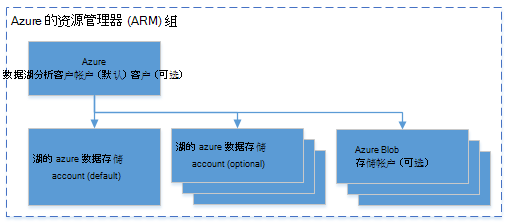

<properties 
   pageTitle="管理 Azure 数据湖分析使用 Azure.NET SDK |Azure" 
   description="了解如何管理数据湖分析作业、 数据源、 用户。 " 
   services="data-lake-analytics" 
   documentationCenter="" 
   authors="mumian" 
   manager="jhubbard" 
   editor="cgronlun"/>
 
<tags
   ms.service="data-lake-analytics"
   ms.devlang="na"
   ms.topic="article"
   ms.tgt_pltfrm="na"
   ms.workload="big-data" 
   ms.date="09/23/2016"
   ms.author="jgao"/>

# 管理使用 Azure.NET SDK Azure 数据湖分析

[AZURE.INCLUDE [manage-selector](../../includes/data-lake-analytics-selector-manage.md)]

了解如何管理 Azure 数据湖分析帐户、 数据源、 用户和使用 Azure.NET SDK 的作业。 使用其他工具管理主题，请单击上面的选项卡上选择。

**系统必备组件**

在开始本教程之前，您必须具有以下︰

- **Azure 订阅**。 请参阅[获取 Azure 免费试用版](https://azure.microsoft.com/pricing/free-trial/)。

<!-- ################################ -->
<!-- ################################ -->

## 连接到 Azure 数据湖分析

您将需要以下 Nuget 程序包︰

    Install-Package Microsoft.Rest.ClientRuntime.Azure.Authentication -Pre
    Install-Package Microsoft.Azure.Common 
    Install-Package Microsoft.Azure.Management.ResourceManager -Pre
    Install-Package Microsoft.Azure.Management.DataLake.Analytics -Pre

下面的代码示例演示了如何连接到 Azure 并列出在 Azure 订购下的现有数据湖分析帐户。

    using System;
    using System.Collections.Generic;
    using System.Threading;

    using Microsoft.Rest;
    using Microsoft.Rest.Azure.Authentication;

    using Microsoft.Azure.Management.ResourceManager;
    using Microsoft.Azure.Management.DataLake.Store;
    using Microsoft.Azure.Management.DataLake.Analytics;
    using Microsoft.Azure.Management.DataLake.Analytics.Models;

    namespace ConsoleAcplication1
    {
        class Program
        {

            private const string SUBSCRIPTIONID = "<Enter Your Azure Subscription ID>";
            private const string CLIENTID = "1950a258-227b-4e31-a9cf-717495945fc2";
            private const string DOMAINNAME = "common"; // Replace this string with the user's Azure Active Directory tenant ID or domain name, if needed.

            private static DataLakeAnalyticsAccountManagementClient _adlaClient;

            private static void Main(string[] args)
            {

                var creds = AuthenticateAzure(DOMAINNAME, CLIENTID);

                _adlaClient = new DataLakeAnalyticsAccountManagementClient(creds);
                _adlaClient.SubscriptionId = SUBSCRIPTIONID;

                var adlaAccounts = ListADLAAccounts();

                Console.WriteLine("You have %i Data Lake Analytics account(s).", adlaAccounts.Count);
                for (int i = 0; i < adlaAccounts.Count; i ++)
                {
                    Console.WriteLine(adlaAccounts[i].Name);
                }

                System.Console.WriteLine("Press ENTER to continue");
                System.Console.ReadLine();
            }

            public static ServiceClientCredentials AuthenticateAzure(
            string domainName,
            string nativeClientAppCLIENTID)
            {
                // User login via interactive popup
                SynchronizationContext.SetSynchronizationContext(new SynchronizationContext());
                // Use the client ID of an existing AAD "Native Client" application.
                var activeDirectoryClientSettings = ActiveDirectoryClientSettings.UsePromptOnly(nativeClientAppCLIENTID, new Uri("urn:ietf:wg:oauth:2.0:oob"));
                return UserTokenProvider.LoginWithPromptAsync(domainName, activeDirectoryClientSettings).Result;
            }

            public static List<DataLakeAnalyticsAccount> ListADLAAccounts()
            {
                var response = _adlaClient.Account.List();
                var accounts = new List<DataLakeAnalyticsAccount>(response);

                while (response.NextPageLink != null)
                {
                    response = _adlaClient.Account.ListNext(response.NextPageLink);
                    accounts.AddRange(response);
                }

                return accounts;
            }
        }
    }

## 管理帐户

在运行任何数据湖分析作业之前, 必须有数据湖分析帐户。 Azure HDInsight 与您不想花钱分析帐户时未运行作业。  只需付费次运行作业时。  有关详细信息，请参阅[Azure 数据湖分析概述](data-lake-analytics-overview.md)。  

###创建帐户

您可以运行下面的示例之前，必须有 Azure 资源管理组中，并且数据湖存储帐户。

下面的代码演示如何创建资源组︰

    public static async Task<ResourceGroup> CreateResourceGroupAsync(
        ServiceClientCredentials credential,
        string groupName,
        string subscriptionId,
        string location)
    {

        Console.WriteLine("Creating the resource group...");
        var resourceManagementClient = new ResourceManagementClient(credential)
        { SubscriptionId = subscriptionId };
        var resourceGroup = new ResourceGroup { Location = location };
        return await resourceManagementClient.ResourceGroups.CreateOrUpdateAsync(groupName, resourceGroup);
    }

下面的代码演示如何创建数据湖存储帐户︰

    var adlsParameters = new DataLakeStoreAccount(location: _location);
    _adlsClient.Account.Create(_resourceGroupName, _adlsAccountName, adlsParameters);

下面的代码演示如何创建数据湖分析帐户︰

    var defaultAdlsAccount = new List<DataLakeStoreAccountInfo> { new DataLakeStoreAccountInfo(adlsAccountName, new DataLakeStoreAccountInfoProperties()) };
    var adlaProperties = new DataLakeAnalyticsAccountProperties(defaultDataLakeStoreAccount: adlsAccountName, dataLakeStoreAccounts: defaultAdlsAccount);
    var adlaParameters = new DataLakeAnalyticsAccount(properties: adlaProperties, location: location);
    var adlaAccount = _adlaClient.Account.Create(resourceGroupName, adlaAccountName, adlaParameters);

###列表中的帐户

请参阅[连接到 Azure 数据湖分析](#connect_to_azure_data_lake_analytics)。

###查找帐户

一旦获得数据湖分析帐户的列表的对象，可以使用下列查找帐户︰

    Predicate<DataLakeAnalyticsAccount> accountFinder = (DataLakeAnalyticsAccount a) => { return a.Name == adlaAccountName; };
    var myAdlaAccount = adlaAccounts.Find(accountFinder);

###删除数据湖分析帐户

下面的代码段中删除数据湖分析帐户︰

    _adlaClient.Account.Delete(resourceGroupName, adlaAccountName);

<!-- ################################ -->
<!-- ################################ -->
## 管理帐户数据源

数据湖分析目前支持下列数据源︰

- [湖的 azure 数据存储](../data-lake-store/data-lake-store-overview.md)
- [Azure 存储](../storage/storage-introduction.md)

创建一个分析帐户时，必须指定 Azure 数据湖存储帐户是默认的存储帐户。 默认数据湖存储帐户用于存储作业元数据和作业审核日志。 已创建分析帐户后，可以添加额外的数据湖存储帐户和/或 Azure 存储帐户。 

### 找到该默认数据湖存储帐户

请参见查找帐户在此文章中查找数据湖分析帐户。 然后使用以下命令︰

    string adlaDefaultDataLakeStoreAccountName = myAccount.Properties.DefaultDataLakeStoreAccount;

## 使用 Azure 资源管理器组

应用程序通常组成许多组件，例如 web 应用程序、 数据库、 数据库服务器、 存储和第三方服务。 Azure 的资源管理器使您能够使用您的应用程序作为一个组，称为 Azure 资源组中的资源。 可以部署、 更新、 监视或删除单个、 协调操作中的应用程序的所有资源。 您的部署使用的模板，该模板可以适合不同的环境，如测试、 过渡和生产。 您可以通过查看整个组的汇总的成本为您的组织澄清计费。 有关详细信息，请参阅[Azure 资源管理器概述](../azure-resource-manager/resource-group-overview.md)。 

数据湖分析服务可以包括以下组件︰

- Azure 数据湖分析帐户
- 所需的默认 Azure 数据湖存储帐户
- 其他数据湖 Azure 存储帐户
- 其他 Azure 存储帐户

您可以创建一个以使其更易于管理的资源管理组下的所有这些组件。

数据湖分析帐户和从属存储帐户必须位于相同的 Azure 数据中心。
资源管理组但是可以位于不同的数据中心。  

##请参见 

- [Microsoft Azure 数据湖分析的概述](data-lake-analytics-overview.md)
- [有关数据使用 Azure 门户的湖泊分析入门](data-lake-analytics-get-started-portal.md)
- [管理 Azure 数据湖分析使用 Azure 门户](data-lake-analytics-manage-use-portal.md)
- [监视和故障排除使用 Azure 门户的 Azure 数据湖分析作业](data-lake-analytics-monitor-and-troubleshoot-jobs-tutorial.md)

