<properties 
   pageTitle="管理 Azure 数据湖分析使用 Azure 门户 |Azure" 
   description="了解如何管理数据湖分析 acounts、 数据源、 用户和作业。" 
   services="data-lake-analytics" 
   documentationCenter="" 
   authors="edmacauley" 
   manager="jhubbard" 
   editor="cgronlun"/>
 
<tags
   ms.service="data-lake-analytics"
   ms.devlang="na"
   ms.topic="article"
   ms.tgt_pltfrm="na"
   ms.workload="big-data" 
   ms.date="10/06/2016"
   ms.author="edmaca"/>

# 管理 Azure 数据湖分析使用 Azure 门户

[AZURE.INCLUDE [manage-selector](../../includes/data-lake-analytics-selector-manage.md)]

了解如何管理 Azure 数据湖分析帐户、 帐户数据源、 用户和作业使用 Azure 的门户。 若要查看使用其他工具管理主题，请单击页面顶部的选项卡上选择器。

**系统必备组件**

在开始本教程之前，您必须具有以下各项︰

- **Azure 订阅**。 请参阅[获取 Azure 免费试用版](https://azure.microsoft.com/pricing/free-trial/)。

<!-- ################################ -->
<!-- ################################ -->
## 管理帐户

在运行任何数据湖分析作业之前, 必须有数据湖分析帐户。 与不同的 Azure HDInsight，只需付费数据湖分析帐户运行作业时。  只需付费次运行作业时。  有关详细信息，请参阅[Azure 数据湖分析概述](data-lake-analytics-overview.md)。  

**若要创建一个数据湖分析帐户**

1. 登录到[Azure 的门户](https://portal.azure.com)。
2. 单击**新建**，单击**智能 + 分析**，然后单击**数据湖分析**。
3. 键入或选择以下值︰

    

    - **名称**︰ 命名数据湖分析帐户。
    - **订阅**︰ 选择 Azure 用于分析客户的预订。
    - **资源组**。 选择一个现有的 Azure 资源组或新建一个。 Azure 的资源管理器使您可以使用作为一个组应用程序中的资源。 有关详细信息，请参阅[Azure 资源管理器概述](resource-group-overview.md)。 
    - **位置**。 选择数据湖分析帐户 Azure 数据中心。 
    - **数据湖商店**︰ 每个数据湖分析帐户有相关的数据湖存储帐户。 数据湖分析帐户和相关数据湖存储帐户必须位于相同的 Azure 数据中心。 按照说明创建新的数据湖存储帐户，或选择一个现有。

8. 单击**创建**。 它将带您的门户的主页屏幕。 新的拼贴显示"部署 Azure 数据湖分析"标签添加到 StartBoard。 花费一些时间来创建一个数据湖分析帐户。 创建帐户时，门户将打开新的刀片式服务器上的帐户。

创建一个数据湖分析帐户后，可以添加其他数据湖存储帐户和 Azure 存储帐户。 有关说明，请参阅[管理数据湖分析客户数据源](data-lake-analytics-manage-use-portal.md#manage-account-data-sources)。

**若要访问/打开数据湖分析帐户**

1. 登录到[Azure 的门户](https://portal.azure.com/)。
2. 单击左侧菜单上的**湖泊分析数据**。  如果您看不到它，单击**更多的服务**，然后单击**智能 + 分析**下的**数据湖分析**。
3. 单击您要访问的数据湖分析帐户。 它将在新的刀片打开帐户。

**若要删除数据湖分析帐户**

1. 打开您想要删除的数据湖分析帐户。 有关说明，请参阅[Access 数据湖分析帐户](#access-adla-account)。
2. 从刀片式服务器顶部按钮菜单中单击**删除**。
3. 键入帐户名，然后单击**删除**。

删除数据湖分析帐户不会删除相关的数据湖存储帐户。 删除数据湖存储帐户的说明，请参阅[删除数据湖存储帐户](data-lake-store-get-started-portal.md#delete-azure-data-lake-store-account)。

<!-- ################################ -->
<!-- ################################ -->
## 管理帐户数据源

数据湖分析目前支持下列数据源︰

- [Azure 数据湖存储区](../data-lake-store/data-lake-store-overview.md)
- [Azure 存储](../storage/storage-introduction.md)

当您创建数据湖分析帐户时，您必须指定 Azure 数据湖存储帐户是默认的存储帐户。 默认数据湖存储帐户用于存储作业元数据和作业审核日志。 您已创建了数据湖分析帐户后，可以添加额外的数据湖存储帐户和/或 Azure 存储帐户。 

**若要查找默认数据湖存储帐户**

- 打开您想要管理的数据湖分析帐户。 有关说明，请参阅[Access 数据湖分析帐户](#access-adla-account)。 **基本**显示默认数据湖存储︰

    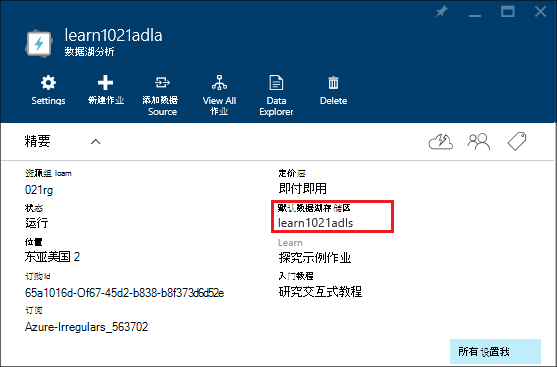

**若要添加其他数据源**

1. 打开您想要管理的数据湖分析帐户。 有关说明，请参阅[Access 数据湖分析帐户](#access-adla-account)。
2. 单击**设置**，然后单击**数据源**。 您应看到列出的默认数据湖存储帐户。 
3. 单击**添加数据源**。

    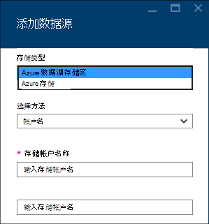

    若要添加 Azure 数据湖存储帐户，您需要该帐户名称和访问帐户能够对其进行查询。
    若要添加 Azure Blob 存储，您需要存储帐户和帐户密码，可以通过导航到存储帐户在门户网站中找到。

**浏览数据源**  

1. 打开您想要管理的分析帐户。 有关说明，请参阅[Access 数据湖分析帐户](#access-adla-account)。
2. 单击**设置**，然后单击**数据资源管理器**。 
 
    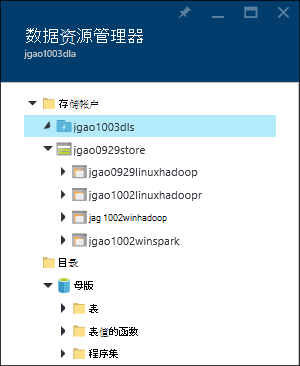
    
3. 单击以打开该帐户数据湖存储帐户。

    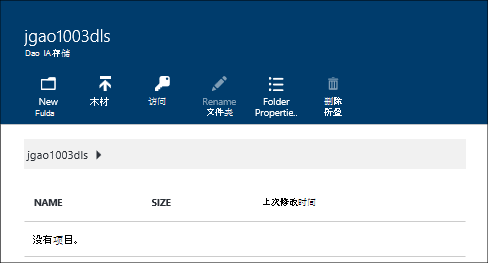
    
    对于每个数据湖存储帐户，您可以
    
    - **新建文件夹**︰ 添加新的文件夹。
    - **上载**︰ 从您的工作站将文件上载到的存储帐户。
    - **访问**︰ 配置访问权限。
    - **重命名文件夹**︰ 重命名文件夹。
    - **文件夹属性**︰ 显示文件或文件夹的属性，如 WASB 路径，而 WEBHDFS 路径，最后修改时间等。
    - **删除文件夹**︰ 删除文件夹。

**若要将文件上载到数据湖存储帐户**

1. 从门户中，从左侧的菜单中，单击**浏览**，然后单击**数据湖商店**。
2. 单击您要上载到数据的数据湖存储帐户。 若要查找默认数据湖存储帐户，请参阅[此处](#default-adl-account)。
3. 从顶部的菜单中单击**数据资源管理器**。
4. 单击**新的目录**创建一个新文件夹，或单击更改文件夹的文件夹名称。
6. 从顶部的菜单，要上载文件，请单击**上载**。

**若要将文件上载到 Azure Blob 存储帐户**

请参阅[HDInsight 中的 Hadoop 作业的数据上载](../hdinsight/hdinsight-upload-data.md)。  应用于数据湖分析信息。

## 管理用户

数据湖分析与 Azure Active Directory 使用基于角色的访问控制。 当您创建数据湖分析帐户时，帐户中加入"预订管理员"角色。 您可以添加其他用户和安全组具有下列角色︰

|角色|说明|
|----|-----------|
|所有者|使您可以管理所有内容，包括对资源的访问。|
|参与者|访问门户网站;提交和监视作业。 若要能够提交作业，参与者需要数据湖存储帐户的读取或写入权限。|
|DataLakeAnalyticsDeveloper | 提交，监视并取消作业。  这些用户只能取消自己的作业。 他们不能管理他们自己的帐户，例如，将用户添加、 更改权限，或者删除该帐户。 为了能够运行作业，他们需要读取或写入访问权限的数据湖存储帐户     | 
|读取器|允许您查看的所有内容，但不是进行任何更改。|  
|DevTest 实验室用户|允许您查看的所有内容，以及连接，启动、 重新启动和关闭虚拟机。|  
|用户访问管理员|允许您管理用户对 Azure 的资源的访问。|  

有关创建 Azure Active Directory 用户和安全组的信息，请参阅[什么是 Azure 活动目录](../active-directory/active-directory-whatis.md)。

**若要将用户或安全组添加到数据湖分析帐户**

1. 打开您想要管理的分析帐户。 有关说明，请参阅[Access 数据湖分析帐户](#access-adla-account)。
2. 单击**设置**，然后单击**用户**。 也可以在下面的屏幕快照中所示的**精要**标题栏上单击**访问**︰

    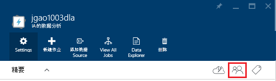
3. 从**用户**刀片式服务器，请单击**添加**。
4. 选择一个角色并添加用户，然后单击**确定**。

**注意︰ 如果此用户或安全组需要提交作业，他们需要在数据湖商店上授予的权限。有关详细信息，请参阅[安全数据湖存储中的数据](../data-lake-store/data-lake-store-secure-data.md)。**

<!-- ################################ -->
<!-- ################################ -->
## 管理作业

您可以运行任何 U SQL 作业之前，您必须具有数据湖分析帐户。  有关详细信息，请参阅[管理数据湖分析帐户](#manage-data-lake-analytics-accounts)。

**创建作业**

1. 打开您想要管理的分析帐户。 有关说明，请参阅[Access 数据湖分析帐户](#access-adla-account)。
2. 单击**新建作业**。

    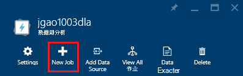

    您应看到类似于新刀片式服务器︰

    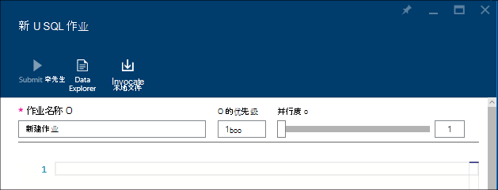

    您可以为每个作业，配置

  	|名称|说明|
  	|----|-----------|
  	|作业名称|输入作业的名称。|
  	|优先级|较小的数字具有更高的优先级。 如果两个作业都排队，一个具有较低优先级运行第一次|
  	|并行度 |计算过程可以在同一时间发生的最大数目。 增加此数量可以提高性能，但也会增加成本。|
  	|脚本|输入 U SQL 脚本的作业。|

    使用相同的界面，您可以浏览链接数据源，并将其他文件添加到链接的数据源。 
3. 如果您要提交作业，请单击**提交作业**。

**若要提交作业**

请参阅[创建数据湖分析作业](#create-job)。

**若要监视作业**

1. 打开您想要管理的分析帐户。 有关说明，请参阅[Access 数据湖分析帐户](#access-adla-account)。 作业管理面板中显示的基本作业信息︰

    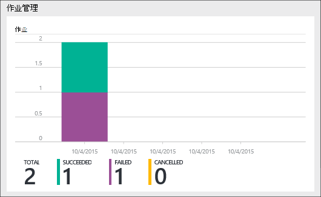

3. 上面的屏幕快照中所示，请单击**作业管理**。

    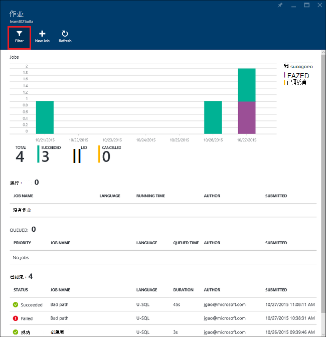

4. 单击列表中的作业。 或者，单击**筛选器**可帮助您查找作业︰

    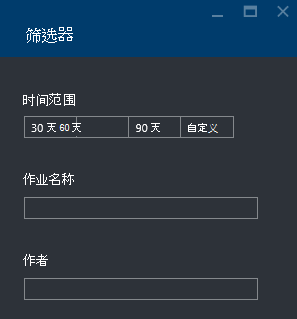

    您可以筛选通过**时间范围**、**作业名称**和**作者**的工作。
5. 如果您想要重新提交作业，请单击**重新提交**。

**若要重新提交作业**

请参阅[显示器数据湖分析作业](#monitor-jobs)。

##监视器帐户使用情况

**若要监视帐户使用情况**

1. 打开您想要管理的分析帐户。 有关说明，请参阅[Access 数据湖分析帐户](#access-adla-account)。 使用面板显示的使用率︰

    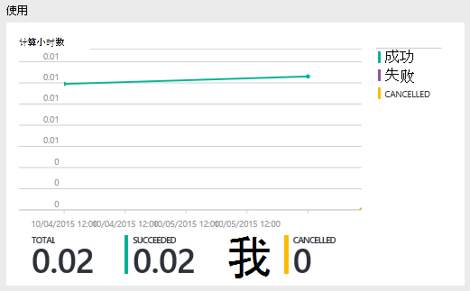

2. 双击要查看其详细信息窗格。

##查看 U SQL 目录

[U SQL 目录](data-lake-analytics-use-u-sql-catalog.md)用于组织数据和代码，以便它们可以共享由 U SQL 脚本。 目录提供了 Azure 数据湖中的数据可能的最高性能。 从 Azure 的门户网站，您将能够查看 U SQL 目录。

**若要浏览 U SQL 目录**

1. 打开您想要管理的分析帐户。 有关说明，请参阅[Access 数据湖分析帐户](#access-adla-account)。
2. 从顶部的菜单中单击**数据资源管理器**。
3. 依次展开**目录**、**主机**及展开**的表，或**表值函数**，或**程序集 * *。 下面的屏幕快照显示了一个表值函数。

    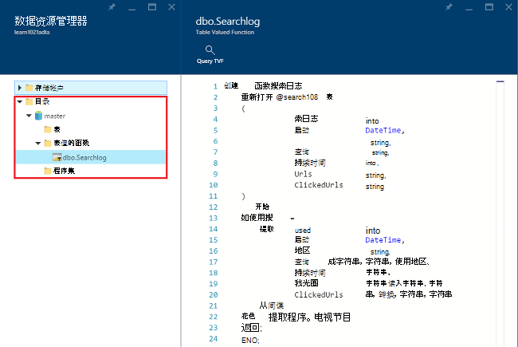

<!-- ################################ -->
<!-- ################################ -->
## 使用 Azure 资源管理器组

应用程序通常组成许多组件，例如 web 应用程序、 数据库、 数据库服务器、 存储和第三方服务。 Azure 的资源管理器使您能够使用您的应用程序作为一个组，称为 Azure 资源组中的资源。 可以部署、 更新、 监视，或删除单个、 协调操作中应用程序的所有资源。 您的部署使用的模板，该模板可以适合不同的环境，如测试、 临时和生产。 您可以通过查看整个组的汇总的成本为您的组织澄清计费。 有关详细信息，请参阅[Azure 资源管理器概述](../azure-resource-manager/resource-group-overview.md)。 

数据湖分析服务可以包括以下组件︰

- Azure 数据湖分析帐户
- 所需的默认 Azure 数据湖存储帐户
- 其他 Azure 数据湖存储帐户
- 其他 Azure 存储帐户

您可以创建一个以使其更易于管理的资源管理组下的所有这些组件。

数据湖分析帐户和从属存储帐户必须位于相同的 Azure 数据中心。
资源管理组但是可以位于不同的数据中心。  

##请参见 

- [Microsoft Azure 数据湖分析的概述](data-lake-analytics-overview.md)
- [有关数据使用 Azure 门户的湖泊分析入门](data-lake-analytics-get-started-portal.md)
- [管理使用 Azure PowerShell Azure 数据湖分析](data-lake-analytics-manage-use-powershell.md)
- [监视和故障排除使用 Azure 门户的 Azure 数据湖分析作业](data-lake-analytics-monitor-and-troubleshoot-jobs-tutorial.md)

