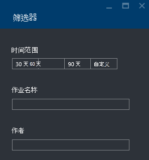

<properties 
   pageTitle="疑难解答使用 Azure 门户的 Azure 数据湖分析作业 |Azure" 
   description="了解如何使用 Azure 门户来解决数据湖分析作业。 " 
   services="data-lake-analytics" 
   documentationCenter="" 
   authors="edmacauley" 
   manager="jhubbard" 
   editor="cgronlun"/>
 
<tags
   ms.service="data-lake-analytics"
   ms.devlang="na"
   ms.topic="article"
   ms.tgt_pltfrm="na"
   ms.workload="big-data" 
   ms.date="05/16/2016"
   ms.author="edmaca"/>

# 疑难解答使用 Azure 门户的 Azure 数据湖分析作业

了解如何使用 Azure 门户来解决数据湖分析作业。

在本教程中，将安装丢失的源代码文件出现问题，并使用 Azure 门户来解决该问题。

**系统必备组件**

在开始本教程之前，您必须具有以下︰

- **数据湖分析的基本知识作业过程**。 请参阅[开始使用 Azure 数据湖分析使用 Azure 门户](data-lake-analytics-get-started-portal.md)。
- **数据湖分析帐户**。 请参阅[开始使用 Azure 数据湖分析使用 Azure 门户](data-lake-analytics-get-started-portal.md#create-adl-analytics-account)。
- **复制到默认数据湖存储帐户的示例数据**。  [准备源数据](data-lake-analytics-get-started-portal.md#prepare-source-data)，请参阅

##提交数据湖分析作业

现在您将创建 U SQL 作业与错误的源文件的名称。  

**若要提交作业**

1. 从 Azure 门户，单击左上角中的**Microsoft Azure** 。
2. 单击与您的数据湖分析帐户名拼贴。  它被固定在此处创建该帐户时。
如果该帐户不存在锁定，请参阅[打开门户分析帐户](data-lake-analytics-manage-use-portal.md#access-adla-account)。
3. 从顶部的菜单中单击**新建作业**。
4. 输入作业的名称和下面的 U SQL 脚本︰

        @searchlog =
            EXTRACT UserId          int,
                    Start           DateTime,
                    Region          string,
                    Query           string,
                    Duration        int?,
                    Urls            string,
                    ClickedUrls     string
            FROM "/Samples/Data/SearchLog.tsv1"
            USING Extractors.Tsv();
        
        OUTPUT @searchlog   
            TO "/output/SearchLog-from-adls.csv"
        USING Outputters.Csv();

    在脚本中定义的源文件是**/Samples/Data/SearchLog.tsv1**，它应**/Samples/Data/SearchLog.tsv**。
     
5. 从顶部单击**提交作业**。 新的作业详细信息窗格中打开。 在标题栏上，它显示作业状态。 需要几分钟才能完成。 您可以单击**刷新**以获取最新状态。
6. 等待，直到作业状态更改为**失败**。  如果作业**成功**，这是因为您没有删除 /Samples 文件夹。 在开始本教程请参见**先决条件**部分中。

您可能会想-为什么花费这么长时间的小型作业。  请记住数据湖分析旨在处理大数据。  在处理使用其分布式的系统的数据量大时，它非常出色。

让我们假定您已提交作业，并关闭门户。  在下一部分中，您将学习如何解决作业。

## 解决作业

最后一节，已提交作业，作业失败。  

**若要查看所有作业**

1. 从 Azure 的门户，单击左上角中的**Microsoft Azure** 。
2. 单击与您的数据湖分析帐户名拼贴。  显示摘要作业在**作业管理**界面上。

    
    
    作业管理使您可以快速查看作业的状态。 请注意没有失败的作业。
   
3. 单击要查看的作业的**作业管理**拼贴。 作业分类中**运行**、**已排队**和**已结束**。 您应看到您失败的作业的**结束**部分。 它应为第一个列表中。 当您有大量的作业时，您可以单击**筛选器**可帮助您找到作业。

    

4. 单击从列表中打开新的刀片在作业详细信息失败的作业︰

    
    
    请注意**重新提交**按钮。 解决您的问题之后，您可以重新提交作业。

5. 单击突出显示的部分，从上面的屏幕快照以打开错误的详细信息。  您应看到类似︰

    

    它告诉您找不到源文件夹。
    
6. 单击**复制脚本**。
7. 更新以下**FROM**路径︰

    "/ Samples/Data/SearchLog.tsv"

8. 单击**提交作业**。

##请参见

- [Azure 数据湖分析概述](data-lake-analytics-overview.md)
- [有关使用 Azure PowerShell Azure 数据湖分析入门](data-lake-analytics-get-started-powershell.md)
- [开始使用 Azure 数据湖分析和 U SQL 使用 Visual Studio](data-lake-analytics-u-sql-get-started.md)
- [管理 Azure 数据湖分析使用 Azure 门户](data-lake-analytics-manage-use-portal.md)

