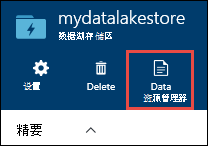
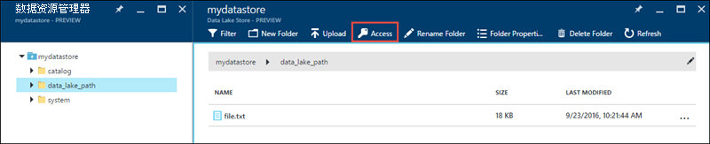
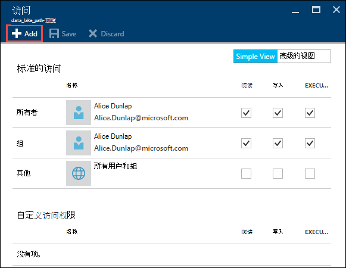

<properties
   pageTitle="身份验证与使用 Active Directory 数据湖商店 |Microsoft Azure"
   description="学习如何与数据使用 Active Directory 的湖泊存储区验证"
   services="data-lake-store"
   documentationCenter=""
   authors="nitinme"
   manager="jhubbard"
   editor="cgronlun"/>

<tags
   ms.service="data-lake-store"
   ms.devlang="na"
   ms.topic="article"
   ms.tgt_pltfrm="na"
   ms.workload="big-data"
   ms.date="10/17/2016"
   ms.author="nitinme"/>

# 与使用 Azure Active Directory 数据湖存储服务到服务身份验证

> [AZURE.SELECTOR]
- [服务的服务身份验证](data-lake-store-authenticate-using-active-directory.md)
- [最终用户身份验证](data-lake-store-end-user-authenticate-using-active-directory.md)

Azure 数据湖商店使用 Azure Active Directory 进行身份验证。 在创作应用程序适用于 Azure 数据湖商店或 Azure 数据湖分析之前, 必须先决定如何想要对您的应用程序使用 Azure 活动目录 (AD Azure) 进行身份验证。 可用的两个主要选项有︰

* 最终用户身份验证，并 
* 提供服务的身份验证。 

这两个选项会导致应用程序正在使用 OAuth 2.0 令牌，获取附加到 Azure 数据湖商店或 Azure 数据湖分析对每个请求提供。

此文章讨论的是如何创建服务的服务身份验证的 web 应用程序 Azure 的广告。 Azure 广告最终用户身份验证的应用程序配置的说明请参阅[最终用户身份验证，与数据湖存储使用 Azure Active Directory](data-lake-store-end-user-authenticate-using-active-directory.md)。

## 系统必备组件

* Azure 的订阅。 请参阅[获取 Azure 免费试用版](https://azure.microsoft.com/pricing/free-trial/)。
* 您的订阅 id。 您可以从 Azure 门户网站检索它。 例如，就可从数据湖存储帐户刀片式服务器。

    

* Azure AD 域的名称。 您可以将鼠标指针悬停在 Azure 门户网站的右上角上的鼠标进行检索。 从下面的屏幕截图，域名为**contoso.microsoft.com**，并在中括号内的 GUID 是租户 id。 

    

## 服务的服务身份验证

这是推荐的方法，如果您希望您的应用程序使用 Azure 的广告，而无需最终用户提供的凭据自动进行身份验证。 您的应用程序将能够验证自己的身份，只要它的凭据是有效的它可以自定义需要多年的。

### 使用这种方法需要什么？

* Azure AD 域的名称。 这已列入本文的先决条件。

* Azure 广告**web 应用程序**。

* Azure 广告 web 应用程序的客户端 ID。

* Azure 广告 web 应用程序客户端密码。

* 令牌 Azure 广告 web 应用程序的终结点。

* 启用在 Azure 广告 web 应用程序访问数据湖存储文件夹或您想要使用的数据湖分析帐户。

有关如何创建 Azure 广告 web 应用程序并将其配置为上面列出的要求说明，请参阅[创建活动目录应用程序](#create-an-active-directory-application)下面的部分。

>[AZURE.NOTE] 默认情况下广告 Azure 应用程序配置为使用客户端密码，可以从 AD Azure 应用程序检索。 但是，如果要使用证书代替 Azure 的广告应用程序，必须创建使用 Azure PowerShell 的 Azure 广告 web 应用程序，在[创建服务主体与证书](../resource-group-authenticate-service-principal.md#create-service-principal-with-certificate)所述。

## 创建活动目录应用程序

在本节中我们了解如何创建和配置与 Azure 数据湖商店 Azure 广告 web 应用程序身份验证服务与服务使用 Azure Active Directory。 

### 步骤 1︰ 创建一个 Active Directory 的 Azure 应用程序

>[AZURE.NOTE] 下面的步骤使用 Azure 门户。 您还可以创建使用[Azure PowerShell](../resource-group-authenticate-service-principal.md)或[Azure CLI](../resource-group-authenticate-service-principal-cli.md)的 Azure AD 应用程序。

1. 登录到 Azure 帐户通过[经典的门户](https://manage.windowsazure.com/)。

2. 从左窗格中选择**活动目录**。

     
     
3. 选择要用于创建新的应用程序的活动目录。 如果您有多个活动目录，您通常想要在您的订阅所在的目录中创建应用程序。 只能在您的订阅您的订阅相同的目录中的应用程序授予对资源的访问。  

     
    
    
3. 要查看应用程序在您的目录中，请单击**应用程序**。

     

4. 如果尚未创建应用程序在该目录中之前，您应该看到类似于下面的图像。 单击**添加应用程序**

     

     或者，单击底部窗格中的**添加**。

     

6. 提供应用程序的名称并选择您想要创建的应用程序的类型。 对于本教程，创建一个**WEB 应用程序和/或 WEB API** ，并单击下一步按钮。

     

7. 填写您的应用程序的属性。 对于**符号上的 URL**，提供网站描述您的应用程序的 URI。 不验证网站的存在。 对于**应用程序 ID URI**，可提供标识您的应用程序的 URI。

     

    单击复选标记以完成此向导并创建应用程序。

### 步骤 2︰ 获取客户端 id、 客户端密钥，随机密钥和令牌的终结点

当以编程方式记录时，您的应用程序需要标识。 如果在自己的凭据下运行应用程序，您还需要一个身份验证密钥。

1. 单击**配置**选项卡来配置应用程序的密码。

     

2. 复制**客户机 ID**。
  
     

3. 如果应用程序将在自己的凭据下运行，向下滚动到**密钥**部分中，选择有效密码多长时间。

     

4. 选择**保存**以创建您的密钥。

    

    显示保存的项，您可以将其复制。 您将不能稍后检索该密钥，因此必须立即复制它。

    

5. 通过选择**查看终结点**在屏幕的底部和检索**OAuth 2.0 令牌端点**字段的值来检索令牌的终结点，如下所示。  

    

### 步骤 3︰ 将分配到 Azure 数据湖存储帐户文件或文件夹 （仅适用于服务的服务身份验证） 的 Azure AD 应用程序

1. 登录到新[Azure 门户](https://portal.azure.com)并打开您想要与您在前面创建的 Azure Active Directory 应用程序相关联的 Azure 数据湖存储帐户。

1. 在您数据湖存储帐户刀片式服务器，单击**数据资源管理器**。

    

2. 在**数据资源管理器**刀片式服务器，请单击该文件或文件夹，您要提供访问 Azure 广告应用程序，，然后单击**访问**。 若要配置对文件的访问，必须从**文件预览**刀片式服务器单击**访问**。

    

3. **访问**刀片式服务器列出的标准访问和自定义访问已分配给根。 单击**添加**图标可添加自定义级别的 Acl。

    

4. 单击**添加**图标以打开**添加自定义访问**刀片式服务器。 在此刀片式服务器，单击**选择用户或组**，然后**选择用户或组**刀片，在查找 Azure Active Directory 在前面创建的安全组。 如果您有大量的组中搜索，使用顶部的文本框中要作为筛选依据的组名称。 单击添加，然后单击**选择**您要的组。

    

5. 单击**选择权限**选择权限，是否要将权限分配的默认 ACL，访问和 / 或 ACL。 单击**确定**。

    

    有关数据湖存储和默认值中的访问 Acl 中的权限的详细信息，请参阅[数据湖存储区中的访问控制](data-lake-store-access-control.md)。

6. 在**添加自定义访问**刀片式服务器，请单击**确定**。 新添加的组中，使用相关联的权限，现在将列入**访问**刀片式服务器。

     

## 下一步行动

在这篇文章中，您创建 Azure 广告 web 应用程序并收集的信息，您需要在客户端应用程序中使用.NET SDK、 Java SDK 等创作。您现在可以继续下面谈一谈如何使用 Azure 广告 web 应用程序与数据存储湖泊区首先进行身份验证，然后执行其他操作存储区上的文章。

- [学习如何使用 Azure 数据湖存储区使用.NET SDK](data-lake-store-get-started-net-sdk.md)
- [学习如何使用 Azure 数据湖存储区使用 Java SDK](data-lake-store-get-started-java-sdk.md)
