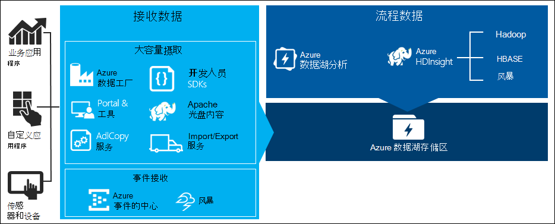
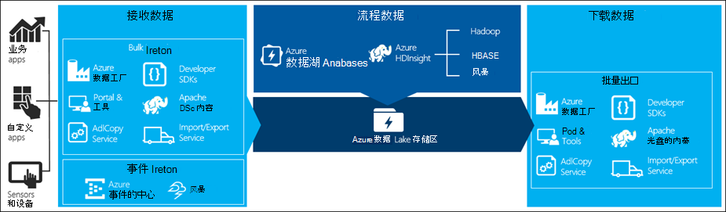

<properties 
   pageTitle="涉及数据湖存储区的数据方案 |Microsoft Azure" 
   description="了解不同的方案和工具使用的数据可以 ingested、 处理、 下载和可视化数据存储中存储湖" 
   services="data-lake-store" 
   documentationCenter="" 
   authors="nitinme" 
   manager="jhubbard" 
   editor="cgronlun"/>
 
<tags
   ms.service="data-lake-store"
   ms.devlang="na"
   ms.topic="article"
   ms.tgt_pltfrm="na"
   ms.workload="big-data" 
   ms.date="09/06/2016"
   ms.author="nitinme"/>

# 针对大数据需求使用 Azure 数据湖存储区

在大数据处理中有四个主要阶段︰

* 接收大量的数据，到数据存储，在实时或在批处理中
* 处理数据
* 下载数据
* 可视化数据

在本文中，我们看 Azure 数据湖存储选项和工具可用来满足大数据需要了解关于这些阶段。

## 接收到数据湖存储数据

本节重点介绍不同来源的数据，这些数据可以 ingested 入数据湖存储帐户的不同方式。

### 零星的数据

这表示较小的数据集的使用大数据应用程序原型。 有不同的方法来接收的零星数据，具体取决于数据源。

| 数据源        | 摄取它使用                                                                        |
|--------------------|----------------------------------------------------------------------------------------|
| 本地计算机     | <ul> <li>[Azure 门户](/data-lake-store-get-started-portal.md)</li> <li>[Azure PowerShell](data-lake-store-get-started-powershell.md)</li> <li>[Azure 的跨平台 CLI](data-lake-store-get-started-cli.md)</li> <li>[使用 Visual Studio 数据湖工具](../data-lake-analytics/data-lake-analytics-data-lake-tools-get-started.md#upload-source-data-files) </li></ul> |
| Azure 存储 Blob | <ul> <li>[Azure 数据工厂](../data-factory/data-factory-azure-datalake-connector.md#sample-copy-data-from-azure-blob-to-azure-data-lake-store)</li> <li>[AdlCopy 工具](data-lake-store-copy-data-azure-storage-blob.md)</li><li>[在 HDInsight 群集上运行的 DistCp](data-lake-store-copy-data-wasb-distcp.md)</li> </ul> |

 
### 流的数据

这表示可以生成的如应用程序、 设备、 传感器等各种来源的数据。此数据可以 ingested 到数据湖库中，通过各种工具。 这些工具通常将捕获和处理事件的事件为单位中的数据实时、 然后写事件分批到数据湖库中，以便它们可以进一步处理。 

以下是可以使用的工具︰
 
* [Azure 流分析](../ 流分析数据-湖-输出的）-事件到事件集线器 ingested 可写入到 Azure 数据湖使用 Azure 数据湖存储输出。
* [Azure HDInsight 风暴](../hdinsight/hdinsight-storm-write-data-lake-store.md)-可以从风暴群集直接向数据湖存储区写入数据。
* [EventProcessorHost](../event-hubs/event-hubs-csharp-ephcs-getstarted.md#receive-messages-with-eventprocessorhost) – 可以接收事件从事件集线器，然后将其写入到数据湖商店使用[数据湖存储.NET SDK](data-lake-store-get-started-net-sdk.md)。

### 关系数据

您还可以源关系数据库中的数据。 一段时间，关系数据库收集了大量的数据，它可以提供关键的见解，如果通过大数据管道处理。 以下工具可用于将此类数据移入数据湖存储区。

* [Apache Sqoop](data-lake-store-data-transfer-sql-sqoop.md)
* [Azure 数据工厂](../data-factory/data-factory-data-movement-activities.md)

### Web 服务器日志数据 （使用自定义应用程序上载）

因为 web 服务器日志数据的分析是大数据应用程序的常见用例，而且需要大量的日志文件将上载到数据湖商店专门调用这种类型的数据集。 可以使用以下工具的任何编写您自己的脚本或应用程序可以将此类数据上载。

* [Azure 的跨平台 CLI](data-lake-store-get-started-cli.md)
* [Azure PowerShell](data-lake-store-get-started-powershell.md)
* [Azure 数据湖存储.NET SDK](data-lake-store-get-started-net-sdk.md)
* [Azure 数据工厂](../data-factory/data-factory-data-movement-activities.md)

用于上载 web 服务器日志数据，以及上载其他类型的数据 （例如社会心声） 是一个好的方法来编写您自己的自定义脚本/应用程序，因为它使您能够灵活地包括数据上载组件作为更大的数据应用程序的一部分。 在某些情况下此代码可能需要的脚本或简单的命令行实用程序的形式。 在其他情况下，代码可能用于将大的数据处理集成到业务应用程序或解决方案。

### 如果使用 Azure HDInsight 群集关联的数据

大多数 HDInsight 群集类型 （Hadoop，HBase，风暴） 作为数据存储库支持数据湖存储区。 HDInsight 群集访问的数据从 Azure 存储 Blob (WASB)。 为了提高性能，可以将数据从 WASB 复制到与群集相关的数据湖存储帐户。 可以使用以下工具来复制数据。

* [Apache DistCp](data-lake-store-copy-data-wasb-distcp.md)
* [AdlCopy 服务](data-lake-store-copy-data-azure-storage-blob.md)
* [Azure 数据工厂](../data-factory/data-factory-azure-datalake-connector.md#sample-copy-data-from-azure-blob-to-azure-data-lake-store)

### 数据存储在后端或 IaaS Hadoop 群集

可能在现有 Hadoop 群集中，在使用 HDFS 的计算机上本地存储大量的数据。 Hadoop 群集后端部署中可能会或可能在 Azure 上 IaaS 群集内。 可能需要将这些数据复制到 Azure 数据湖存储，一次性方法或一种重复的方式。 没有可用于实现此目的的各种选项。 下面是一份备选方案和相关联的利弊。

| 方法  | 详细信息 | 优势   | 注意事项  |
|-----------|---------|--------------|-----------------|
| 使用 Azure 数据工厂 (ADF) 将数据直接从 Hadoop 群集复制到 Azure 数据湖商店 | [ADF 支持 HDFS 作为数据源](../data-factory/data-factory-hdfs-connector.md) | ADF 的框为提供支持，HDFS 和头等舱的端到端管理和监视 | 需要数据管理网关内部部署或 IaaS 群集中部署 |
| 将数据从 Hadoop 导出为文件。 然后将文件复制到 Azure 数据湖商店使用适当的机制。                                   | 您可以将文件复制到使用 Azure 数据湖存储区︰ <ul><li>[对于 Windows 操作系统 azure PowerShell](data-lake-store-get-started-powershell.md)</li><li>[Azure 的跨平台 CLI 非 Windows 操作系统](data-lake-store-get-started-cli.md)</li><li>使用任何数据湖商店 SDK 的自定义应用程序</li></ul> | 快速入门。 可以执行自定义的上载                                                   | 多步骤过程，它涉及多项技术。 管理和监视将增长长期工具的自定义特性是一项挑战 |
| 使用 Distcp Hadoop Azure 存储之间复制数据。 然后将从 Azure 存储的数据复制到数据湖存储使用适当的机制中。 | 从 Azure 存储到数据湖商店使用可以复制数据︰ <ul><li>[Azure 数据工厂](../data-factory/data-factory-data-movement-activities.md)</li><li>[AdlCopy 工具](data-lake-store-copy-data-azure-storage-blob.md)</li><li>[Apache DistCp HDInsight 群集上运行](data-lake-store-copy-data-wasb-distcp.md)</li></ul>| 您可以使用开源工具。 | 涉及多项技术的多步骤过程 |

### 真正的大型数据集

上载中几千吉字节范围的数据集，使用上面介绍的方法有时很缓慢而且代价高昂。 在这种情况下，您可以使用下面的选项。

* **使用 Azure ExpressRoute**。 Azure ExpressRoute 允许您创建在您的场所的 Azure 数据中心和基础架构间的专用连接。 这提供了一个可靠的选择传输大量的数据。 有关详细信息，请参阅[Azure ExpressRoute 文档](../expressroute/expressroute-introduction.md)。

* **"脱机"上载的数据**。 如果使用 Azure ExpressRoute 不可行出于任何原因，可使用[Azure 导入/导出服务](../storage/storage-import-export-service.md)发运到 Azure 数据中心数据的硬盘。 第一次上载到 Azure 存储 Blob 数据。 然后可以使用[Azure 数据工厂](../data-factory/data-factory-azure-datalake-connector.md#sample-copy-data-from-azure-blob-to-azure-data-lake-store)或[AdlCopy 工具](data-lake-store-copy-data-azure-storage-blob.md)以将数据复制到数据湖商店 Azure 存储 Blob。

    >[AZURE.NOTE] 在使用导入/导出服务，到 Azure 数据中心提供的磁盘上文件的大小不应超过 200 GB。

## 处理数据湖存储中的数据

一旦数据存储中存储湖有可用的数据可以使用支持大数据应用程序的数据上运行分析。 目前，可以使用 Azure HDInsight 和 Azure 数据湖分析数据湖存储区中存储的数据运行数据分析作业。 

您可以查看以下示例。

* [作为存储与数据湖商店创建 HDInsight 群集](data-lake-store-hdinsight-hadoop-use-portal.md)
* [与数据湖商店使用 Azure 数据湖分析](../data-lake-analytics/data-lake-analytics-get-started-portal.md)

## 从数据湖商店下载数据

您可能还想要下载或移动数据存储中的 Azure 数据湖方案如︰

* 将数据移到其他存储库与您现有的数据处理管道的接口。 例如，您可能希望将数据从数据湖存储区移动到 SQL Azure 数据库或 SQL Server 内部。
* 将数据下载到本地计算机的 IDE 环境中生成应用程序原型时的处理。

在这种情况下，可以使用下列选项︰

* [Apache Sqoop](data-lake-store-data-transfer-sql-sqoop.md)
* [Azure 数据工厂](../data-factory/data-factory-data-movement-activities.md)
* [Apache DistCp](data-lake-store-copy-data-wasb-distcp.md)

下列方法也可以用于书写您自己脚本/应用程序从数据湖商店下载的数据。

* [Azure 的跨平台 CLI](data-lake-store-get-started-cli.md)
* [Azure PowerShell](data-lake-store-get-started-powershell.md)
* [Azure 数据湖存储.NET SDK](data-lake-store-get-started-net-sdk.md)

## 可视化数据湖存储区中的数据

可以使用服务的组合来创建可视化表示形式的数据存储在数据存储中湖。

* 您可以通过使用[Azure 数据工厂移到 Azure SQL 数据仓库的数据湖存储区](../data-factory/data-factory-data-movement-activities.md#supported-data-stores)
* 在此之后，您可以[集成电源 BI 与 Azure SQL 数据仓库](../sql-data-warehouse/sql-data-warehouse-integrate-power-bi.md)以创建数据的可视表示形式。
