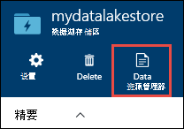

<properties 
   pageTitle="学习如何使用数据湖存储 |Azure" 
   description="使用门户网站创建数据湖存储帐户并执行基本的操作，数据存储中存储湖" 
   services="data-lake-store" 
   documentationCenter="" 
   authors="nitinme" 
   manager="jhubbard" 
   editor="cgronlun"/>
 
<tags
   ms.service="data-lake-store"
   ms.devlang="na"
   ms.topic="hero-article"
   ms.tgt_pltfrm="na"
   ms.workload="big-data" 
   ms.date="09/13/2016"
   ms.author="nitinme"/>

# 学习如何使用 Azure 数据湖存储区使用 Azure 门户

> [AZURE.SELECTOR]
- [门户网站](data-lake-store-get-started-portal.md)
- [PowerShell](data-lake-store-get-started-powershell.md)
- [.NET SDK](data-lake-store-get-started-net-sdk.md)
- [Java SDK](data-lake-store-get-started-java-sdk.md)
- [REST API，](data-lake-store-get-started-rest-api.md)
- [Azure CLI](data-lake-store-get-started-cli.md)
- [Node.js](data-lake-store-manage-use-nodejs.md)

了解如何使用 Azure 门户创建 Azure 数据湖存储帐户并执行基本的操作，如创建文件夹，上载和下载的数据文件，请删除您的帐户，等等。有关数据湖商店的详细信息，请参阅[Azure 数据湖存储概述](data-lake-store-overview.md)。

## 系统必备组件

在开始本教程之前，您必须具有以下︰

- **Azure 订阅**。 请参阅[获取 Azure 免费试用版](https://azure.microsoft.com/pricing/free-trial/)。

## 请与视频快速学习吗？

观看以下视频与数据湖商店开始。

* [创建一个数据湖存储帐户](https://mix.office.com/watch/1k1cycy4l4gen)
* [管理数据湖存储区使用数据资源管理器中的数据](https://mix.office.com/watch/icletrxrh6pc)

## 创建一个 Azure 数据湖存储帐户

1. 登录到新[Azure 门户](https://portal.azure.com)。

2. 单击**新建**，单击**数据 + 存储**，然后单击**Azure 数据湖商店**。 **Azure 数据湖商店**刀片式服务器，将信息读入，然后单击**创建**在刀片式服务器的左下角。

3. 在**新建数据湖商店**刀片式服务器，提供的值，如下面的屏幕抓图中所示︰

    

    - **订阅**。 选择要在其下创建一个新数据湖存储帐户的订购。
    - **资源组**。 选择现有的资源组，或单击**创建资源组**创建一个。 资源组是一个容器，包含应用程序的相关的资源。 有关详细信息，请参阅[在 Azure 中的资源组](azure-resource-manager/resource-group-overview.md#resource-groups)。
    - **位置**︰ 选择您的要用来创建数据湖存储帐户。

4. 如果您希望能够通过 Startboard 的数据湖存储帐户，请选择**附到 Startboard** 。

5. 单击**创建**。 如果您选择要固定到 startboard 的帐户，您将返回到 startboard，可以看到进度的数据湖存储帐户设置。 一旦配置数据湖存储帐户时，帐户刀片式服务器显示。

6. 展开**重点**下拉列表以查看有关数据湖存储帐户信息等资源将其组合的一部分，位置，等等。单击**快速启动**图标查看到湖边的数据存储相关的其他资源的链接。

    

## 在 Azure 数据湖存储帐户中创建文件夹

您的数据湖存储帐户管理和存储数据，可以创建文件夹。

1. 打开您刚创建的数据湖存储帐户。 从左窗格中，单击**浏览**，单击**数据湖存储区**，然后从数据湖商店刀片式服务器，单击要在其下创建文件夹的帐户名。 如果固定到 startboard 的帐户，请单击该帐户平铺。

2. 在您数据湖存储帐户刀片式服务器，单击**数据资源管理器**。

    

3. 您数据湖存储帐户刀片中, 单击**新文件夹**，输入新文件夹的名称，然后单击**确定**。
    
    
    
    新创建的文件夹将出现在**数据资源管理器**刀片。 您可以创建嵌套的文件夹最多包含任何级别。

    

## 将数据上载到 Azure 数据湖存储帐户

直接位于根级别 Azure 数据湖存储帐户或帐户内创建一个文件夹，您可以上载您的数据。 在下面屏幕抓图，请按照步骤从刀片式服务器**数据资源管理器**将文件上载到子文件夹。 此屏幕抓图，在该文件上载到 （红色框中标记） 痕迹导航中显示子文件夹。

如果您正在寻找一些示例数据上载，可以从[Azure 数据湖 Git 存储库](https://github.com/MicrosoftBigData/usql/tree/master/Examples/Samples/Data/AmbulanceData)获取**急救数据**文件夹。

## 属性和操作可用的存储数据

单击新添加的文件以打开**属性**刀片式服务器。 此刀片有与文件，您可以对文件执行的操作关联的属性。 您可以在 Azure 数据湖存储帐户中，在下面屏幕抓图中的红色框中突出显示的完整路径将复制到文件。

* 单击**预览**可查看的文件，请直接在浏览器中预览。 您可以指定预览以及的格式。 单击**预览**中**预览文件**刀片式服务器，单击**格式**，**文件预览格式**刀片式服务器中指定选项，如行数显示，编码以使用时，分隔符使用等。

  

* 单击**下载**以将文件下载到您的计算机。

* 单击**文件重命名**来重命名该文件。

* 单击**删除文件**以删除该文件。

## 保护您的数据

您可以保护您的 Azure 数据湖存储帐户使用 Azure Active Directory 和访问控制 (Acl) 中存储的数据。 有关如何执行此操作的说明，请参阅[保护 Azure 数据湖存储区中的数据](data-lake-store-secure-data.md)。

## 删除 Azure 数据湖存储帐户

若要删除数据湖商店刀片从 Azure 数据湖存储帐户，，请单击**删除**。 确认该操作，您将会提示您输入要删除的帐户的名称。 输入的帐户名称，然后单击**删除**。

## 下一步行动

- [保护数据湖存储区中的数据](data-lake-store-secure-data.md)
- [与数据湖商店使用 Azure 数据湖分析](../data-lake-analytics/data-lake-analytics-get-started-portal.md)
- [与数据湖商店使用 Azure HDInsight](data-lake-store-hdinsight-hadoop-use-portal.md)
- [数据湖商店访问诊断日志](data-lake-store-diagnostic-logs.md)
