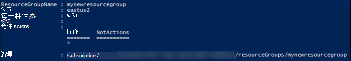
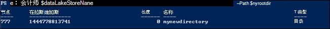

<properties
   pageTitle="学习如何使用数据湖存储 |Azure"
   description="使用 Azure PowerShell 创建数据湖存储帐户并执行基本的操作"
   services="data-lake-store"
   documentationCenter=""
   authors="nitinme"
   manager="jhubbard"
   editor="cgronlun"/>

<tags
   ms.service="data-lake-store"
   ms.devlang="na"
   ms.topic="hero-article"
   ms.tgt_pltfrm="na"
   ms.workload="big-data"
   ms.date="10/04/2016"
   ms.author="nitinme"/>

# 学习如何使用 Azure 数据湖存储区使用 Azure PowerShell

> [AZURE.SELECTOR]
- [门户网站](data-lake-store-get-started-portal.md)
- [PowerShell](data-lake-store-get-started-powershell.md)
- [.NET SDK](data-lake-store-get-started-net-sdk.md)
- [Java SDK](data-lake-store-get-started-java-sdk.md)
- [REST API，](data-lake-store-get-started-rest-api.md)
- [Azure CLI](data-lake-store-get-started-cli.md)
- [Node.js](data-lake-store-manage-use-nodejs.md)

了解如何使用 Azure PowerShell 创建 Azure 数据湖存储帐户并执行基本的操作，如创建文件夹，上载和下载的数据文件，请删除您的帐户，等等。有关数据湖商店的详细信息，请参阅[数据湖商店的概述](data-lake-store-overview.md)。

## 系统必备组件

在开始本教程之前，您必须具有以下︰

* **Azure 订阅**。 请参阅[获取 Azure 免费试用版](https://azure.microsoft.com/pricing/free-trial/)。

* **Azure PowerShell 1.0 或更高版本**。 了解[如何安装和配置 Azure PowerShell](../powershell-install-configure.md)。

## 身份验证

本文简单的身份验证方法使用数据湖存储位置提示您输入您的 Azure 帐户的凭据。 对数据湖存储帐户和文件系统再受登录的用户的访问级别访问级别。 不过，有其他方法以及进行身份验证与数据湖商店，哪些**最终用户身份验证**或**身份验证服务的服务**。 有关说明和如何进行身份验证的详细信息，请参阅[身份验证数据湖存储区使用 Azure Active Directory](data-lake-store-authenticate-using-active-directory.md)。

## 创建一个 Azure 数据湖存储帐户

1. 从您的桌面，打开一个新的 Windows PowerShell 窗口，并输入下面的代码段以登录到您的 Azure 帐户、 设置订阅，以及注册数据湖存储提供程序。 当系统提示您登录，请确保作为一个订阅 admininistrators/所有者登录︰

        # Log in to your Azure account
        Login-AzureRmAccount

        # List all the subscriptions associated to your account
        Get-AzureRmSubscription

        # Select a subscription
        Set-AzureRmContext -SubscriptionId <subscription ID>

        # Register for Azure Data Lake Store
        Register-AzureRmResourceProvider -ProviderNamespace "Microsoft.DataLakeStore"

2. Azure 数据湖存储帐户都使用 Azure 资源组相关联。 首先创建一个 Azure 的资源组。

        $resourceGroupName = "<your new resource group name>"
        New-AzureRmResourceGroup -Name $resourceGroupName -Location "East US 2"

    

2. 创建一个 Azure 数据湖存储帐户。 您指定的名称只能包含小写字母和数字。

        $dataLakeStoreName = "<your new Data Lake Store name>"
        New-AzureRmDataLakeStoreAccount -ResourceGroupName $resourceGroupName -Name $dataLakeStoreName -Location "East US 2"

    

3. 验证已成功创建该帐户。

        Test-AzureRmDataLakeStoreAccount -Name $dataLakeStoreName

    此输出应为**True**。

## 在 Azure 数据湖存储区中创建目录结构

您的 Azure 数据湖存储帐户管理和存储数据，可以创建目录。

1. 指定的根目录。

        $myrootdir = "/"

2. 创建新的目录调用指定根目录下的**mynewdirectory** 。

        New-AzureRmDataLakeStoreItem -Folder -AccountName $dataLakeStoreName -Path $myrootdir/mynewdirectory

3. 验证已成功创建新的目录。

        Get-AzureRmDataLakeStoreChildItem -AccountName $dataLakeStoreName -Path $myrootdir

    它应该显示类似于下面的输出︰

    

## 将数据上载到 Azure 数据湖存储区

到数据湖商店直接位于根级别或帐户内创建一个目录，您可以上载您的数据。 下面的代码段演示了如何将一些示例数据上载到您在上一节中创建的目录 (**mynewdirectory**)。

如果您正在寻找一些示例数据上载，可以从[Azure 数据湖 Git 存储库](https://github.com/MicrosoftBigData/usql/tree/master/Examples/Samples/Data/AmbulanceData)获取**急救数据**文件夹。 下载该文件并将其存储在您的计算机 （如 C:\sampledata） 上的本地目录\.

    Import-AzureRmDataLakeStoreItem -AccountName $dataLakeStoreName -Path "C:\sampledata\vehicle1_09142014.csv" -Destination $myrootdir\mynewdirectory\vehicle1_09142014.csv

## 重命名、 下载和删除数据湖存储区中的数据

若要重命名的文件，请使用下面的命令︰

    Move-AzureRmDataLakeStoreItem -AccountName $dataLakeStoreName -Path $myrootdir\mynewdirectory\vehicle1_09142014.csv -Destination $myrootdir\mynewdirectory\vehicle1_09142014_Copy.csv

若要下载一个文件，请使用下面的命令︰

    Export-AzureRmDataLakeStoreItem -AccountName $dataLakeStoreName -Path $myrootdir\mynewdirectory\vehicle1_09142014_Copy.csv -Destination "C:\sampledata\vehicle1_09142014_Copy.csv"

若要删除某个文件，请使用下面的命令︰

    Remove-AzureRmDataLakeStoreItem -AccountName $dataLakeStoreName -Paths $myrootdir\mynewdirectory\vehicle1_09142014_Copy.csv

出现提示时，输入**Y**以删除该项目。 如果您有多个要删除的文件，您可以用逗号分隔的所有路径。

    Remove-AzureRmDataLakeStoreItem -AccountName $dataLakeStoreName -Paths $myrootdir\mynewdirectory\vehicle1_09142014.csv, $myrootdir\mynewdirectoryvehicle1_09142014_Copy.csv

## 删除您的 Azure 数据湖存储帐户

使用下面的命令来删除数据湖存储帐户。

    Remove-AzureRmDataLakeStoreAccount -Name $dataLakeStoreName

出现提示时，输入**Y**以删除该帐户。

## 下一步行动

- [保护数据湖存储区中的数据](data-lake-store-secure-data.md)
- [与数据湖商店使用 Azure 数据湖分析](../data-lake-analytics/data-lake-analytics-get-started-portal.md)
- [与数据湖商店使用 Azure HDInsight](data-lake-store-hdinsight-hadoop-use-portal.md)
