<properties
   pageTitle="使用 Azure 数据湖存储区使用门户创建 HDInsight 群集 |Azure"
   description="使用 Azure 门户创建和使用 Azure 数据湖存储区使用 HDInsight 群集"
   services="data-lake-store,hdinsight" 
   documentationCenter=""
   authors="nitinme"
   manager="jhubbard"
   editor="cgronlun"/>

<tags
   ms.service="data-lake-store"
   ms.devlang="na"
   ms.topic="article"
   ms.tgt_pltfrm="na"
   ms.workload="big-data"
   ms.date="10/21/2016"
   ms.author="nitinme"/>

# 与数据湖存储区使用 Azure 门户创建一个 HDInsight 群集

> [AZURE.SELECTOR]
- [使用门户](data-lake-store-hdinsight-hadoop-use-portal.md)
- [使用 PowerShell](data-lake-store-hdinsight-hadoop-use-powershell.md)
- [使用资源管理器](data-lake-store-hdinsight-hadoop-use-resource-manager-template.md)

了解如何使用 Azure 门户创建 HDInsight 群集 Hadoop，HBase、 触发，（冲击） 到 Azure 数据湖存储区的访问。 此版本的一些重要的注意事项︰

* **为触发群集 (Linux) 和 Hadoop 群集 （Windows 和 Linux）**、 数据湖商店只能作为一个额外的存储帐户。 此类群集的默认存储帐户仍将 Azure 存储 Blob (WASB)。

* **对于风暴簇 （Windows 和 Linux）**、 数据湖商店可以用于将数据写入从风暴拓扑结构。 数据湖商店也可用来存储可以读取的引用数据通过风暴拓扑。 有关详细信息，请参阅[风暴拓扑中使用数据湖库](#use-data-lake-store-in-a-storm-topology)。

* **对 HBase 群集 （Windows 和 Linux）**、 数据湖商店可以用作默认存储以及额外的存储。 有关详细信息，请参阅[使用数据湖库使用 HBase 群集](#use-data-lake-store-with-hbase-clusters)。

> [AZURE.NOTE] 注意的一些要点。 
> 
> * 创建有权访问数据湖商店 HDInsight 群集选项可仅为 3.2 和 3.4 （对于 Windows 以及 Linux 的 Hadoop，HBase 和风暴簇） 的 HDInsight 版本。 对于 Linux 上的触发群集，此选项才可用 HDInsight 3.4 群集上。
>
> * 正如前面提到的数据湖存储在某些群集类型 (HBase) 的默认存储和附加存储空间，对于其他群集类型 Hadoop，触发 （冲击） 是可用的。 作为一个额外的存储帐户使用数据湖存储区不会影响性能或读/写存储从群集的能力。 在数据湖商店用作附加存储空间的情况下，与群集相关的文件 （如日志等） 将写入默认存储 (Azure Blob)，而您想要处理的数据可以存储在一个数据湖存储帐户。

## 系统必备组件

在开始本教程之前，您必须具有以下︰

- **Azure 订阅**。 请参阅[获取 Azure 免费试用版](https://azure.microsoft.com/pricing/free-trial/)。

- **Azure 数据湖存储帐户**。 按照在[学习如何使用 Azure 数据湖存储区使用 Azure 门户](data-lake-store-get-started-portal.md)的说明。 

- **上载到 Azure 数据湖存储帐户的一些示例数据**。 一旦您创建了帐户，请执行下面的任务以便上载一些示例数据。 教程从 HDInsight 群集访问数据湖存储中的数据运行作业中以后，您将需要此数据。

    * [创建数据湖存储区中的文件夹](data-lake-store-get-started-portal.md#createfolder)。
    * [上载文件到数据存储区湖](data-lake-store-get-started-portal.md#uploaddata)。 如果您正在寻找一些示例数据上载，可以从[Azure 数据湖 Git 存储库](https://github.com/Azure/usql/tree/master/Examples/Samples/Data/AmbulanceData)获取**急救数据**文件夹。

- **Azure 主动目录服务主体**。 在本教程中的步骤介绍了如何在 Azure AD 中创建服务主体。 但是，您必须是 Azure AD 管理员能够创建服务主体。 如果是 Azure AD 管理员，您可以跳过此先决条件，继续本教程。
    
    **如果您不是 Azure AD 管理员**，您将不能执行创建服务主体所需的步骤。 在这种情况下，Azure AD 管理员必须先创建服务主体与数据湖商店创建 HDInsight 群集之前。 此外，服务主体必须使用创建一个证书，在[创建服务主体与证书](../resource-group-authenticate-service-principal.md#create-service-principal-with-certificate)所述。

## 做您更快地学会使用视频？

观看以下视频来了解如何配置 HDInsight 数据湖存储与访问群集。

* [创建有权访问数据湖商店 HDInsight 群集](https://mix.office.com/watch/l93xri2yhtp2)
* 群集设置之后，[数据湖存储区使用配置单元和猪的脚本中访问数据](https://mix.office.com/watch/1n9g5w0fiqv1q)

## 创建一个 HDInsight 群集到 Azure 数据湖存储区的访问

在本节中，您将创建 HDInsight Hadoop 群集数据湖存储区用作额外的存储空间。 在此版本中，对于 Hadoop 群集，数据湖商店只可作为额外的存储群集。 默认存储仍将 Azure 存储 blob (WASB)。 因此，我们将首先创建存储帐户和群集所需的存储容器。

1. 登录到新[Azure 门户](https://portal.azure.com)。

2. 按照在[HDInsight 中的创建 Hadoop 群集](../hdinsight/hdinsight-provision-clusters.md#create-using-the-preview-portal)，以开始设置 HDInsight 群集的步骤。

3. 在**可选配置**刀片式服务器，单击**数据源**。 在**数据源**刀片式服务器，指定的详细信息的存储帐户和存储容器，作为**东亚美国 2**，指定**位置**，然后单击**群集 AAD 标识**。

    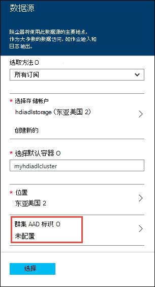

4. 在**群集 AAD 标识**刀片式服务器，您可以选择选择现有的服务主体，或创建一个新。

    * **创建新的服务主体**

        * 在**群集 AAD 标识**刀片式服务器，单击**创建**并单击**服务主体**，然后在**创建服务主体**刀片式服务器，提供值，以创建新的服务主体。 作为程序的一部分，将创建一个证书和一个 Active Directory 的 Azure 应用程序。 单击**创建**。

            

        * 在**群集 AAD 标识**刀片式服务器，请单击**管理 ADLS 访问**。 窗格中显示与此订阅关联的数据湖存储帐户。 但是，您可以设置只能为您创建帐户的权限。 选择您想要与 HDInsight 群集，然后单击**保存权限**的帐户的读取/写入/执行权限。

            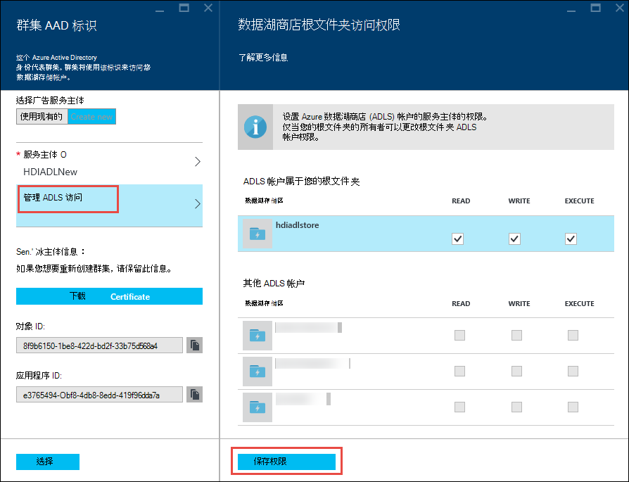

        * 在**群集 AAD 标识**刀片式服务器，请单击**下载证书**下载与主体创建服务关联的证书。 这很有用，如果您想要创建其他 HDInsight 群集时以后，使用同一个服务主体。 单击**选择**。

            

    * **选择一个现有服务承担者**

        * 在**群集 AAD 标识**刀片式服务器，请单击**使用现有的**、 单击**服务主体**，然后在**服务主体中选择**刀片式服务器，搜索现有的服务主体。 单击服务主体名称，然后单击**选择**。

            

        * **群集 AAD 标识**刀片上, 传与选择，服务主体关联的证书 (.pfx)，则提供证书密码。

5. 单击**管理 ADLS 访问**，然后单击**选择文件的权限**。 

    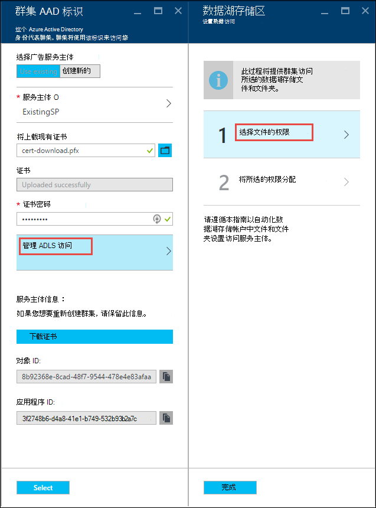

6. 在**选择文件权限**刀片式服务器，从**帐户**下拉列表，选择您想要使用 HDInsight 群集关联的数据湖存储帐户。 刀片式服务器列出的文件和文件夹中所选的数据湖存储帐户可用。 
 
    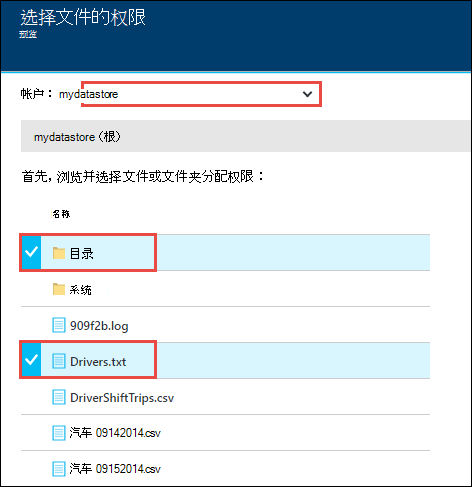

    在此之后，确定所提供的权限所选的文件和文件夹。 对于文件夹，还指定是否权限适用于文件夹或售予该文件夹和文件夹中的所有子项目。 可以通过选择适当的值**应用于**下拉列表进行选择此选项。 若要删除权限，请单击**删除**图标

    

    重复从其它的数据湖存储帐户相关联的文件和文件夹到这些步骤。 完成分配的权限，请单击底部的刀片式服务器**选择**。

7. **指定所选的权限**刀片式服务器，在审查所提供的权限，然后单击**运行**授予这些权限。

    

    状态列将显示进度。 一旦成功地分配的所有权限，请单击**完毕**。 

6. 单击**选择****群集 AAD 标识**和**数据源**刀片式服务器，然后继续使用群集创建，在[创建 Hadoop 群集在 HDInsight 中的](../hdinsight/hdinsight-hadoop-create-linux-clusters-portal.md)所述。

7. 一旦配置群集时，您可以验证服务主要是与 HDInsight 群集。 为此，请从群集刀片式服务器，请单击**群集 AAD 身份**来查看关联的服务主体。

    

## 在 HDInsight 群集使用 Azure 数据湖存储上运行测试作业

配置 HDInsight 群集后，您可以测试 HDInsight 群集可以访问 Azure 数据湖存储区中的数据在群集上运行测试作业。 若要这样做，我们将运行某些配置单元查询数据湖存储区为目标。

### 对于 Linux 群集

1. 打开群集刀片式服务器只需配置的群集，然后单击**仪表板**。 这将对 Linux 群集打开 Ambari。 在访问 Ambari 时，将提示您要对站点进行身份验证。 输入 (默认 admin，) 该管理员帐户名称和密码在创建群集时使用。

    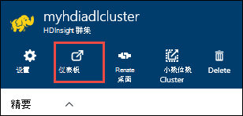

    您可以直接定位到 Ambari 转到 web 浏览器中的 https://CLUSTERNAME.azurehdinsight.net （其中，**群集名称**是 HDInsight 群集的名称）。

2. 打开配置单元视图。 到列表中的可用视图 （旁边的**管理**链接和按钮在页面的右侧） 页面菜单中选择方块套。 选择**配置单元**的视图。

    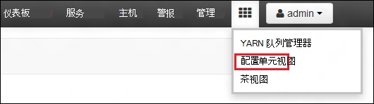

3. 您应该看到类似以下的页︰

    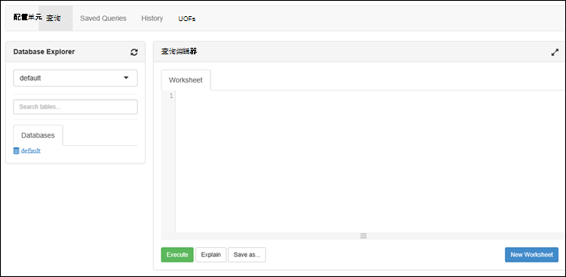

4. 在页上的**查询编辑器**部分中，将下面的 HiveQL 语句粘贴到工作表中︰

        CREATE EXTERNAL TABLE vehicles (str string) LOCATION 'adl://mydatalakestore.azuredatalakestore.net:443/mynewfolder'

5. 单击 [**执行**] 按钮底部的**查询编辑器**来启动查询。 **查询进程结果**部分应当显示在**查询编辑器**下方，显示有关作业的信息。

6. 一旦完成查询，**查询过程结果**部分将显示操作的结果。 **结果**选项卡应包含以下信息︰

7. 运行下面的查询来验证表已创建。

        SHOW TABLES;

    **结果**选项卡应显示以下信息︰

        hivesampletable
        vehicles

    **交通工具**是您在前面创建的表。 **hivesampletable**是在默认情况下所有 HDInsight 群集可用的示例表。

8. 您还可以运行查询来从**车辆**表检索数据。

        SELECT * FROM vehicles LIMIT 5;

### 对于 Windows 群集

1. 打开群集刀片式服务器只需配置的群集，然后单击**仪表板**。

    

    出现提示时，输入群集管理员凭据。

2. 这将打开 Microsoft Azure HDInsight 查询控制台。 单击**配置单元编辑器**。

    

3. 在配置单元编辑器中，输入下面的查询，然后单击**提交**。

        CREATE EXTERNAL TABLE vehicles (str string) LOCATION 'adl://mydatalakestore.azuredatalakestore.net:443/mynewfolder'

    在此配置单元查询中，我们从创建表数据存储在数据湖存储在`adl://mydatalakestore.azuredatalakestore.net:443/mynewfolder`。 此位置已应早上载您的示例数据文件。

    在底部**作业会话**表显示**初始化**，从更改为**运行**于**已完成**的作业的状态。 您还可以单击**查看详细信息**以查看已完成的作业有关的详细信息。

    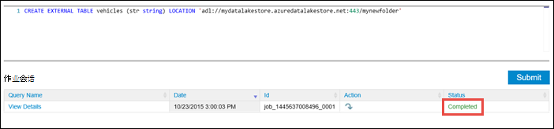

4. 运行下面的查询来验证表已创建。

        SHOW TABLES;

    单击**查看详细信息**对应于此查询和输出应显示如下︰

        hivesampletable
        vehicles

    **交通工具**是您在前面创建的表。 **hivesampletable**是在默认情况下所有 HDInsight 群集可用的示例表。

5. 您还可以运行查询来从**车辆**表检索数据。

        SELECT * FROM vehicles LIMIT 5;

## 访问数据湖存储区使用 HDFS 命令

一旦配置 HDInsight 群集使用数据湖商店，可以使用 HDFS 外壳命令来访问存储区。

### 对于 Linux 群集

通过本节，您将 SSH 到群集并运行 HDFS 的命令。 Windows 不提供内置的 SSH 客户端。 我们建议使用**PuTTY**，这可以从[http://www.chiark.greenend.org.uk/~sgtatham/putty/download.html](http://www.chiark.greenend.org.uk/~sgtatham/putty/download.html)下载。

使用 PuTTY 的详细信息，请参阅[使用 SSH 在从 Windows HDInsight 基于 Linux 的 Hadoop 使用](../hdinsight/hdinsight-hadoop-linux-use-ssh-windows.md)。

建立连接后，使用以下 HDFS 文件系统命令列出数据湖存储中的文件。

    hdfs dfs -ls adl://<Data Lake Store account name>.azuredatalakestore.net:443/

这应列出前面到数据湖存储上载的文件。

    15/09/17 21:41:15 INFO web.CaboWebHdfsFileSystem: Replacing original urlConnectionFactory with org.apache.hadoop.hdfs.web.URLConnectionFactory@21a728d6
    Found 1 items
    -rwxrwxrwx   0 NotSupportYet NotSupportYet     671388 2015-09-16 22:16 adl://mydatalakestore.azuredatalakestore.net:443/mynewfolder

您还可以使用`hdfs dfs -put`命令来将某些文件上载到数据湖存储器内，然后使用`hdfs dfs -ls`来验证是否已成功上载文件。

### 对于 Windows 群集

1. 登录到新[Azure 门户](https://portal.azure.com)。

2. 单击**浏览**， **HDInsight 群集**，请单击，然后单击创建 HDInsight 群集。

3. 在群集刀片式服务器，单击**远程桌面**，然后在**远程桌面**刀片式服务器，单击**连接**。

    

    出现提示时，输入您的远程桌面用户提供的凭据。

4. 在远程会话中，启动 Windows PowerShell 并使用 HDFS 文件系统命令列出 Azure 数据湖存储区中的文件。

        hdfs dfs -ls adl://<Data Lake Store account name>.azuredatalakestore.net:443/

    这应列出前面到数据湖存储上载的文件。

        15/09/17 21:41:15 INFO web.CaboWebHdfsFileSystem: Replacing original urlConnectionFactory with org.apache.hadoop.hdfs.web.URLConnectionFactory@21a728d6
        Found 1 items
        -rwxrwxrwx   0 NotSupportYet NotSupportYet     671388 2015-09-16 22:16 adl://mydatalakestore.azuredatalakestore.net:443/mynewfolder

    您还可以使用`hdfs dfs -put`命令来将某些文件上载到数据湖存储器内，然后使用`hdfs dfs -ls`来验证是否已成功上载文件。

## 使用数据湖库与触发群集

在此部分中，使用可用的 Jupyter 笔记本 HDInsight 触发群集运行的作业，从您与 HDInsight 触发群集，而不是默认的 Azure 存储 Blob 帐户相关联的数据湖存储帐户读取数据。

1. 通过一些示例数据复制与触发群集与群集相关的 Azure 数据湖存储帐户相关联的默认存储帐户 (WASB)。 可以使用[ADLCopy 工具](http://aka.ms/downloadadlcopy)来执行此操作。 下载并安装此工具的链接。

2. 打开命令提示窗口，然后定位到 AdlCopy 的安装的目录，通常`%HOMEPATH%\Documents\adlcopy`。

3. 运行下面的命令以将特定 blob 从源容器复制到数据湖存储︰

        AdlCopy /source https://<source_account>.blob.core.windows.net/<source_container>/<blob name> /dest swebhdfs://<dest_adls_account>.azuredatalakestore.net/<dest_folder>/ /sourcekey <storage_account_key_for_storage_container>

    对于本教程，复制在**HVAC.csv**示例数据文件**/HdiSamples/HdiSamples/SensorSampleData/hvac/**到 Azure 数据湖存储帐户。 代码段应如下所示︰

        AdlCopy /Source https://mydatastore.blob.core.windows.net/mysparkcluster/HdiSamples/HdiSamples/SensorSampleData/hvac/HVAC.csv /dest swebhdfs://mydatalakestore.azuredatalakestore.net/hvac/ /sourcekey uJUfvD6cEvhfLoBae2yyQf8t9/BpbWZ4XoYj4kAS5Jf40pZaMNf0q6a8yqTxktwVgRED4vPHeh/50iS9atS5LQ==

    >[AZURE.WARNING] 请确保您的文件名和路径名称是正确的大小写。

4. 系统将提示您输入身份凭证必须依据数据湖存储帐户的 Azure 订阅。 您将看到类似于下面的输出︰

        Initializing Copy.
        Copy Started.
        100% data copied.
        Copy Completed. 1 file copied.

    将在数据湖存储帐户文件夹**/hvac**下复制数据文件 (**HVAC.csv**)。

4. 从[Azure 门户网站](https://portal.azure.com/)，startboard，从单击触发群集的拼贴 （如果您将它固定到 startboard）。 您还可以向下**浏览所有**群集导航 > **HDInsight 群集**。   

2. 从触发群集刀片式服务器，单击**快速链接**，然后从**群集仪表板**刀片式服务器，请单击**Jupyter 笔记本**。 出现提示时，输入群集管理员凭据。

    > [AZURE.NOTE] 通过在浏览器中打开下面的 URL，还可能会达到 Jupyter 笔记本为群集。 __群集名称__替换您的群集的名称︰
    >
    > `https://CLUSTERNAME.azurehdinsight.net/jupyter`

2. 创建新的笔记本。 单击**新建**，然后单击**PySpark**。

    

3. 创建并打开名为**Untitled.pynb**的新笔记本。 

4. 由于在创建笔记本使用 PySpark 内核，您不需要显式创建任何上下文。 运行第一个代码单元格时，将为您自动创建添姿加配置单元的上下文。 您可以通过导入该方案所需的类型。 为此，请在单元格中粘贴下面的代码段和按**SHIFT + ENTER**。

        from pyspark.sql.types import *
        
    每次 Jupyter 在运行作业时，您的 web 浏览器窗口标题将显示笔记本标题以及**（忙碌）**状态。 您还将看到右上角中的**PySpark**文本旁边实心圆。 在作业完成后，这将变成空心圆。

     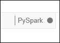

4. 将示例数据加载到临时表使用**HVAC.csv**文件复制到数据湖存储帐户。 您可以访问使用下面的 URL 模式的数据湖存储帐户中的数据。

        adl://<data_lake_store_name>.azuredatalakestore.net/<path_to_file>

    空单元格中粘贴下面的代码示例、 **MYDATALAKESTORE**替换数据湖存储帐户名，并按**SHIFT + ENTER**。 此代码示例将数据注册到一个名为**hvac**的临时表。

        # Load the data
        hvacText = sc.textFile("adl://MYDATALAKESTORE.azuredatalakestore.net/hvac/HVAC.csv")
        
        # Create the schema
        hvacSchema = StructType([StructField("date", StringType(), False),StructField("time", StringType(), False),StructField("targettemp", IntegerType(), False),StructField("actualtemp", IntegerType(), False),StructField("buildingID", StringType(), False)])
        
        # Parse the data in hvacText
        hvac = hvacText.map(lambda s: s.split(",")).filter(lambda s: s[0] != "Date").map(lambda s:(str(s[0]), str(s[1]), int(s[2]), int(s[3]), str(s[6]) ))
        
        # Create a data frame
        hvacdf = sqlContext.createDataFrame(hvac,hvacSchema)
        
        # Register the data fram as a table to run queries against
        hvacdf.registerTempTable("hvac")

5. 因为您正在使用 PySpark 内核，您现在可以直接运行 SQL 查询上使用刚创建的临时表**hvac** `%%sql`魔术。 有关详细信息`%%sql`的神奇功能，以及其他 magics 与 PySpark 内核，可查看[Jupyter 笔记本与触发 HDInsight 群集上可用的内核](hdinsight-apache-spark-jupyter-notebook-kernels.md#why-should-i-use-the-new-kernels)。
        
        %%sql
        SELECT buildingID, (targettemp - actualtemp) AS temp_diff, date FROM hvac WHERE date = \"6/1/13\"

5. 一旦作业成功完成后，默认情况下显示下面的表格格式输出。

    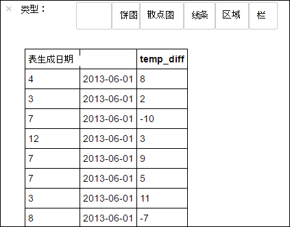

    您还可以查看其他的可视化项的结果。 例如，一个区域图，对于相同的输出应如下所示。

    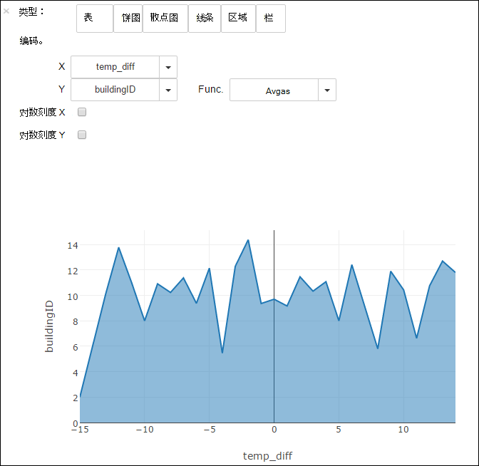

6. 运行应用程序之后，您应该关闭笔记本以释放资源。 为此，请从笔记本上的**文件**菜单上，单击**关闭并暂停**。 这将关闭和关闭笔记本。

## 在风暴拓扑中使用数据湖库

数据湖存储可用于将数据写入从风暴拓扑结构。 有关如何实现此方案的说明，请参阅[使用 Azure 数据湖库与 Apache 风暴与 HDInsight](../hdinsight/hdinsight-storm-write-data-lake-store.md)。

## 如果使用 HBase 群集使用数据湖库

使用 HBase 群集，可用作数据湖存储默认存储以及额外的存储。 要这样做︰

1.  在**数据源**刀片式服务器， **HBase 数据位置**，选择**数据湖商店**。
2.  选择所需数据湖存储的名称或新建一个。
3.  最后，指定数据湖商店内的**HBase 根文件夹**。 如果数据湖存储帐户没有创建一个新的根文件夹。

    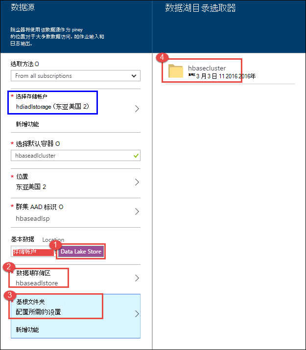

### 使用 HBase 群集作为默认存储数据湖存储区时的注意事项

* 可用于多个 HBase 群集相同的数据湖存储帐户。 但是，您的群集 （上面的步骤 4 中屏幕抓图） 提供**HBase 根文件夹**必须是唯一的。 您**不必须**跨两个不同的 HBase 群集使用相同的根文件夹。
* 即使数据湖存储帐户用作默认存储，HBase 群集日志文件仍存储在 Azure 存储 Blob (WASB) 与群集相关。 这是在上面的屏幕捕获中的蓝色框中突出显示。

## 请参见

* [PowerShell︰ 创建使用数据湖商店 HDInsight 群集](data-lake-store-hdinsight-hadoop-use-powershell.md)

[makecert]: https://msdn.microsoft.com/library/windows/desktop/ff548309(v=vs.85).aspx
[pvk2pfx]: https://msdn.microsoft.com/library/windows/desktop/ff550672(v=vs.85).aspx
