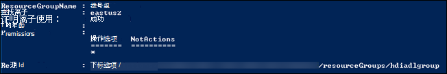
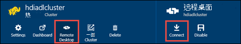

<properties
   pageTitle="使用 Azure 数据湖存储区使用 PowerShell 创建 HDInsight 群集 |Azure"
   description="使用 Azure PowerShell 创建并使用 Azure 数据湖 HDInsight 群集"
   services="data-lake-store,hdinsight" 
   documentationCenter=""
   authors="nitinme"
   manager="jhubbard"
   editor="cgronlun"/>

<tags
   ms.service="data-lake-store"
   ms.devlang="na"
   ms.topic="article"
   ms.tgt_pltfrm="na"
   ms.workload="big-data"
   ms.date="10/21/2016"
   ms.author="nitinme"/>

# 与数据湖存储区使用 Azure PowerShell 创建 HDInsight 群集

> [AZURE.SELECTOR]
- [使用门户](data-lake-store-hdinsight-hadoop-use-portal.md)
- [使用 PowerShell](data-lake-store-hdinsight-hadoop-use-powershell.md)
- [使用资源管理器](data-lake-store-hdinsight-hadoop-use-resource-manager-template.md)

了解如何使用 Azure PowerShell Azure 数据湖存储访问配置 HDInsight 群集 （Hadoop，HBase 或冲击）。 此版本的一些重要的注意事项︰

* **为触发群集 (Linux) 和 Hadoop/风暴群集 （Windows 和 Linux）**、 数据湖商店只能作为一个额外的存储帐户。 此类群集的默认存储帐户仍将 Azure 存储 Blob (WASB)。

* **对 HBase 群集 （Windows 和 Linux）**、 数据湖商店可以用作默认存储或其他存储。

> [AZURE.NOTE] 注意的一些要点。 
> 
> * 创建有权访问数据湖商店 HDInsight 群集选项可仅为 3.2 和 3.4 （对于 Windows 以及 Linux 的 Hadoop，HBase 和风暴簇） 的 HDInsight 版本。 对于 Linux 上的触发群集，此选项才可用 HDInsight 3.4 群集上。
>
> * 正如前面提到的数据湖存储在某些群集类型 (HBase) 的默认存储和附加存储空间，对于其他群集类型 Hadoop，触发 （冲击） 是可用的。 作为一个额外的存储帐户使用数据湖存储区不会影响性能或读/写存储从群集的能力。 在数据湖商店用作附加存储空间的情况下，与群集相关的文件 （如日志等） 将写入默认存储 (Azure Blob)，而您想要处理的数据可以存储在一个数据湖存储帐户。

在本文中，我们作为额外的存储配置 Hadoop 群集数据湖存储区。

配置 HDInsight 处理数据湖商店使用 PowerShell 涉及以下步骤︰

* 创建 Azure 数据湖商店
* 设置基于角色的访问数据湖存储的身份验证
* 使用身份验证对数据湖存储创建 HDInsight 群集
* 在群集上运行的测试作业

## 系统必备组件

在开始本教程之前，您必须具有以下︰

- **Azure 订阅**。 请参阅[获取 Azure 免费试用版](https://azure.microsoft.com/pricing/free-trial/)。

- **Azure PowerShell 1.0 或更高版本**。 了解[如何安装和配置 Azure PowerShell](../powershell-install-configure.md)。

- **Windows SDK**。 您可以从[这里](https://dev.windows.com/en-us/downloads)安装它。 您可以使用此创建一个安全证书。

- **Azure 主动目录服务主体**。 在本教程中的步骤介绍了如何在 Azure AD 中创建服务主体。 但是，您必须是 Azure AD 管理员能够创建服务主体。 如果是 Azure AD 管理员，您可以跳过此先决条件，继续本教程。
    
    **如果您不是 Azure AD 管理员**，您将不能执行创建服务主体所需的步骤。 在这种情况下，Azure AD 管理员必须先创建服务主体与数据湖商店创建 HDInsight 群集之前。 此外，服务主体必须使用创建一个证书，在[创建服务主体与证书](../resource-group-authenticate-service-principal.md#create-service-principal-with-certificate)所述。 

## 创建 Azure 数据湖商店

按照以下步骤创建数据湖商店。

1. 从您的桌面，打开一个新的 Azure PowerShell 窗口，并输入下面的代码段。 当系统提示您登录，请确保作为一个订阅 admininistrators/所有者登录︰

        # Log in to your Azure account
        Login-AzureRmAccount

        # List all the subscriptions associated to your account
        Get-AzureRmSubscription

        # Select a subscription
        Set-AzureRmContext -SubscriptionId <subscription ID>

        # Register for Data Lake Store
        Register-AzureRmResourceProvider -ProviderNamespace "Microsoft.DataLakeStore"

    >[AZURE.NOTE] 如果您收到错误信息类似于`Register-AzureRmResourceProvider : InvalidResourceNamespace: The resource namespace 'Microsoft.DataLakeStore' is invalid`注册时数据湖存储资源提供程序，则可能您 subsrcription 不是 Azure 数据湖商店的白名单。 请确保您按照以下[说明](data-lake-store-get-started-portal.md#signup)启用数据湖存储公共预览您对 Azure 的订购。

3. Azure 数据湖存储帐户都使用 Azure 资源组相关联。 首先创建一个 Azure 的资源组。

        $resourceGroupName = "<your new resource group name>"
        New-AzureRmResourceGroup -Name $resourceGroupName -Location "East US 2"

    

2. 创建一个 Azure 数据湖存储帐户。 您指定的帐户名称只能包含小写字母和数字。

        $dataLakeStoreName = "<your new Data Lake Store name>"
        New-AzureRmDataLakeStoreAccount -ResourceGroupName $resourceGroupName -Name $dataLakeStoreName -Location "East US 2"

    

3. 验证已成功创建该帐户。

        Test-AzureRmDataLakeStoreAccount -Name $dataLakeStoreName

    此输出应为**True**。

4. 将一些示例数据上载到 Azure 数据湖。 我们将使用此本文内下文中以验证数据可从 HDInsight 群集访问。 如果您正在寻找一些示例数据上载，可以从[Azure 数据湖 Git 存储库](https://github.com/MicrosoftBigData/usql/tree/master/Examples/Samples/Data/AmbulanceData)获取**急救数据**文件夹。

        $myrootdir = "/"
        Import-AzureRmDataLakeStoreItem -AccountName $dataLakeStoreName -Path "C:\<path to data>\vehicle1_09142014.csv" -Destination $myrootdir\vehicle1_09142014.csv

## 设置基于角色的访问数据湖存储的身份验证

每个 Azure 预订是与 Azure Active Directory 相关联。 用户和服务访问订阅使用 Azure 经典门户或 Azure 资源管理器 API 的资源首先必须与该 Azure Active Directory 验证。 访问权限授予 Azure 订阅和服务通过将他们分配在 Azure 资源上适当的角色。  对于服务，服务主体标识的服务 Azure 活动目录 (AAD) 中。 本部分阐述了如何将应用程序服务，如 HDInsight，到 Azure 资源 （您在前面创建的 Azure 数据湖存储帐户） 的访问权限授予通过创建的应用程序服务主体和 Azure PowerShell 通过将角色分配给的。

若要设置 Azure 数据湖活动目录身份验证，必须执行以下任务。

* 创建自行签署式证书
* 在 Azure Active Directory 和服务主体中创建的应用程序

### 创建自行签署式证书

请确保您具有[Windows SDK](https://dev.windows.com/en-us/downloads)安装本部分中的步骤之前。 您必须还创建一个目录，如**C:\mycertdir**，在其中创建证书。

1. 从 PowerShell 窗口中，导航到安装 Windows SDK 的位置 (通常情况下， `C:\Program Files (x86)\Windows Kits\10\bin\x86` ，并使用[MakeCert] [makecert]实用程序创建一个自签名的证书和私钥。 使用以下命令。

        $certificateFileDir = "<my certificate directory>"
        cd $certificateFileDir
        $startDate = (Get-Date).ToString('MM/dd/yyyy')
        $endDate = (Get-Date).AddDays(365).ToString('MM/dd/yyyy')

        makecert -sv mykey.pvk -n "cn=HDI-ADL-SP" CertFile.cer -b $startDate -e $endDate -r -len 2048

    系统将提示您输入私钥密码。 命令已成功执行后，您应该看到一个**CertFile.cer**和**mykey.pvk**中指定的证书目录。

4. 使用[Pvk2Pfx] [pvk2pfx]实用程序将创建 MakeCert 的.pvk 和.cer 文件转换到一个.pfx 文件。 运行以下命令。

        pvk2pfx -pvk mykey.pvk -spc CertFile.cer -pfx CertFile.pfx -po <password>

    当系统提示时输入您在前面指定私钥密码。 为**采购订单**参数指定的值是与.pfx 文件相关联的密码。 命令成功完成之后，您还会看到在您指定的证书目录 CertFile.pfx。

###  创建 Azure Active Directory 和服务主体

在本节中，您可以执行创建服务主体为 Active Directory 的 Azure 应用程序，将角色分配给该服务主体，并以服务主体通过提供证书的身份验证的步骤。 运行下面的命令在 Azure 活动目录中创建应用程序。

1. 将以下 cmdlet 粘贴 PowerShell 控制台窗口中。 请确保您指定**的显示名称**属性的值是唯一的。 此外，**主页-**和**-IdentiferUris**的值是占位符值并不验证。

        $certificateFilePath = "$certificateFileDir\CertFile.pfx"

        $password = Read-Host –Prompt "Enter the password" # This is the password you specified for the .pfx file

        $certificatePFX = New-Object System.Security.Cryptography.X509Certificates.X509Certificate2($certificateFilePath, $password)

        $rawCertificateData = $certificatePFX.GetRawCertData()

        $credential = [System.Convert]::ToBase64String($rawCertificateData)

        $application = New-AzureRmADApplication `
                    -DisplayName "HDIADL" `
                    -HomePage "https://contoso.com" `
                    -IdentifierUris "https://mycontoso.com" `
                    -KeyValue $credential  `
                    -KeyType "AsymmetricX509Cert"  `
                    -KeyUsage "Verify"  `
                    -StartDate $startDate  `
                    -EndDate $endDate

        $applicationId = $application.ApplicationId

2. 创建服务主体使用应用程序 id。

        $servicePrincipal = New-AzureRmADServicePrincipal -ApplicationId $applicationId

        $objectId = $servicePrincipal.Id

3. 授予对数据湖存储区文件/文件夹，您将从 HDInsight 群集访问服务主体访问权限。 下面的代码段提供了访问数据湖存储帐户的根。

        Set-AzureRmDataLakeStoreItemAclEntry -AccountName $dataLakeStoreName -Path / -AceType User -Id $objectId -Permissions All

    在出现提示时，输入**Y**键确认。

## 使用身份验证对数据湖存储创建 HDInsight 群集

在本节中，我们将创建 HDInsight Hadoop 群集。 有关此版本中，HDInsight 群集和数据湖存储必须在相同的位置 （东亚美国 2）。

1. 开始检索订阅租户 id。 您将稍后需要的。

        $tenantID = (Get-AzureRmContext).Tenant.TenantId

2. 对于此版本，Hadoop 群集，数据湖商店只可作为附加的存储群集。 默认存储仍将 Azure 存储 blob (WASB)。 因此，我们将首先创建存储帐户和群集所需的存储容器。

        # Create an Azure storage account
        $location = "East US 2"
        $storageAccountName = "<StorageAcccountName>"   # Provide a Storage account name

        New-AzureRmStorageAccount -ResourceGroupName $resourceGroupName -StorageAccountName $storageAccountName -Location $location -Type Standard_GRS

        # Create an Azure Blob Storage container
        $containerName = "<ContainerName>"              # Provide a container name
        $storageAccountKey = Get-AzureRmStorageAccountKey -Name $storageAccountName -ResourceGroupName $resourceGroupName | %{ $_.Key1 }
        $destContext = New-AzureStorageContext -StorageAccountName $storageAccountName -StorageAccountKey $storageAccountKey
        New-AzureStorageContainer -Name $containerName -Context $destContext

3. 创建 HDInsight 群集。 使用以下 cmdlet。

        # Set these variables
        $clusterName = $containerName                   # As a best practice, have the same name for the cluster and container
        $clusterNodes = <ClusterSizeInNodes>            # The number of nodes in the HDInsight cluster
        $httpCredentials = Get-Credential
        $rdpCredentials = Get-Credential

        New-AzureRmHDInsightCluster -ClusterName $clusterName -ResourceGroupName $resourceGroupName -HttpCredential $httpCredentials -Location $location -DefaultStorageAccountName "$storageAccountName.blob.core.windows.net" -DefaultStorageAccountKey $storageAccountKey -DefaultStorageContainer $containerName  -ClusterSizeInNodes $clusterNodes -ClusterType Hadoop -Version "3.2" -RdpCredential $rdpCredentials -RdpAccessExpiry (Get-Date).AddDays(14) -ObjectID $objectId -AadTenantId $tenantID -CertificateFilePath $certificateFilePath -CertificatePassword $password

    该 cmdlet 成功完成之后，您应该看到类似下面的输出︰

        Name                      : hdiadlcluster
        Id                        : /subscriptions/65a1016d-0f67-45d2-b838-b8f373d6d52e/resourceGroups/hdiadlgroup/providers/Mi
                                    crosoft.HDInsight/clusters/hdiadlcluster
        Location                  : East US 2
        ClusterVersion            : 3.2.7.707
        OperatingSystemType       : Windows
        ClusterState              : Running
        ClusterType               : Hadoop
        CoresUsed                 : 16
        HttpEndpoint              : hdiadlcluster.azurehdinsight.net
        Error                     :
        DefaultStorageAccount     :
        DefaultStorageContainer   :
        ResourceGroup             : hdiadlgroup
        AdditionalStorageAccounts :

## 在 HDInsight 群集使用数据湖存储上运行测试作业

配置 HDInsight 群集后，您可以测试 HDInsight 群集可以访问数据湖存储在群集上运行测试作业。 为此，我们将运行创建表使用的示例数据来早上载到数据存储区湖泊的示例配置单元作业。

### 对于 Linux 群集

在本部分将 SSH 到群集并运行示例配置单元查询。 Windows 不提供内置的 SSH 客户端。 我们建议使用**PuTTY**，这可以从[http://www.chiark.greenend.org.uk/~sgtatham/putty/download.html](http://www.chiark.greenend.org.uk/~sgtatham/putty/download.html)下载。

使用 PuTTY 的详细信息，请参阅[使用 SSH 在从 Windows HDInsight 基于 Linux 的 Hadoop 使用](../hdinsight/hdinsight-hadoop-linux-use-ssh-windows.md)。

1. 建立连接后，使用下面的命令启动配置单元 CLI:

        hive

2. 使用 CLI，输入下列语句来创建新的表名**车辆**为数据存储中存储湖中使用的示例数据︰

        DROP TABLE vehicles;
        CREATE EXTERNAL TABLE vehicles (str string) LOCATION 'adl://<mydatalakestore>.azuredatalakestore.net:443/';
        SELECT * FROM vehicles LIMIT 10;

    您应该看到类似于下面的输出︰

        1,1,2014-09-14 00:00:03,46.81006,-92.08174,51,S,1
        1,2,2014-09-14 00:00:06,46.81006,-92.08174,13,NE,1
        1,3,2014-09-14 00:00:09,46.81006,-92.08174,48,NE,1
        1,4,2014-09-14 00:00:12,46.81006,-92.08174,30,W,1
        1,5,2014-09-14 00:00:15,46.81006,-92.08174,47,S,1
        1,6,2014-09-14 00:00:18,46.81006,-92.08174,9,S,1
        1,7,2014-09-14 00:00:21,46.81006,-92.08174,53,N,1
        1,8,2014-09-14 00:00:24,46.81006,-92.08174,63,SW,1
        1,9,2014-09-14 00:00:27,46.81006,-92.08174,4,NE,1
        1,10,2014-09-14 00:00:30,46.81006,-92.08174,31,N,1

### 对于 Windows 群集

使用以下 cmdlet 以运行该配置单元查询。 在此查询中我们从数据湖存储区中的数据创建一个表，然后运行选择查询创建的表。

    $queryString = "DROP TABLE vehicles;" + "CREATE EXTERNAL TABLE vehicles (str string) LOCATION 'adl://$dataLakeStoreName.azuredatalakestore.net:443/';" + "SELECT * FROM vehicles LIMIT 10;"

    $hiveJobDefinition = New-AzureRmHDInsightHiveJobDefinition -Query $queryString

    $hiveJob = Start-AzureRmHDInsightJob -ResourceGroupName $resourceGroupName -ClusterName $clusterName -JobDefinition $hiveJobDefinition -ClusterCredential $httpCredentials

    Wait-AzureRmHDInsightJob -ResourceGroupName $resourceGroupName -ClusterName $clusterName -JobId $hiveJob.JobId -ClusterCredential $httpCredentials

这会产生下面的输出。 **ExitValue**的输出中的 0 表示作业已成功完成。

    Cluster         : hdiadlcluster.
    HttpEndpoint    : hdiadlcluster.azurehdinsight.net
    State           : SUCCEEDED
    JobId           : job_1445386885331_0012
    ParentId        :
    PercentComplete :
    ExitValue       : 0
    User            : admin
    Callback        :
    Completed       : done

通过使用以下 cmdlet 检索作业的输出︰

    Get-AzureRmHDInsightJobOutput -ClusterName $clusterName -JobId $hiveJob.JobId -DefaultContainer $containerName -DefaultStorageAccountName $storageAccountName -DefaultStorageAccountKey $storageAccountKey -ClusterCredential $httpCredentials

作业输出如下所示︰

    1,1,2014-09-14 00:00:03,46.81006,-92.08174,51,S,1
    1,2,2014-09-14 00:00:06,46.81006,-92.08174,13,NE,1
    1,3,2014-09-14 00:00:09,46.81006,-92.08174,48,NE,1
    1,4,2014-09-14 00:00:12,46.81006,-92.08174,30,W,1
    1,5,2014-09-14 00:00:15,46.81006,-92.08174,47,S,1
    1,6,2014-09-14 00:00:18,46.81006,-92.08174,9,S,1
    1,7,2014-09-14 00:00:21,46.81006,-92.08174,53,N,1
    1,8,2014-09-14 00:00:24,46.81006,-92.08174,63,SW,1
    1,9,2014-09-14 00:00:27,46.81006,-92.08174,4,NE,1
    1,10,2014-09-14 00:00:30,46.81006,-92.08174,31,N,1

## 访问数据湖存储区使用 HDFS 命令

一旦配置 HDInsight 群集使用数据湖商店，可以使用 HDFS 外壳命令来访问存储区。

### 对于 Linux 群集

通过本节，您将 SSH 到群集并运行 HDFS 的命令。 Windows 不提供内置的 SSH 客户端。 我们建议使用**PuTTY**，这可以从[http://www.chiark.greenend.org.uk/~sgtatham/putty/download.html](http://www.chiark.greenend.org.uk/~sgtatham/putty/download.html)下载。

使用 PuTTY 的详细信息，请参阅[使用 SSH 在从 Windows HDInsight 基于 Linux 的 Hadoop 使用](../hdinsight/hdinsight-hadoop-linux-use-ssh-windows.md)。

建立连接后，使用以下 HDFS 文件系统命令列出数据湖存储中的文件。

    hdfs dfs -ls adl://<Data Lake Store account name>.azuredatalakestore.net:443/

这应列出前面到数据湖存储上载的文件。

    15/09/17 21:41:15 INFO web.CaboWebHdfsFileSystem: Replacing original urlConnectionFactory with org.apache.hadoop.hdfs.web.URLConnectionFactory@21a728d6
    Found 1 items
    -rwxrwxrwx   0 NotSupportYet NotSupportYet     671388 2015-09-16 22:16 adl://mydatalakestore.azuredatalakestore.net:443/mynewfolder

您还可以使用`hdfs dfs -put`命令来将某些文件上载到数据湖存储器内，然后使用`hdfs dfs -ls`来验证是否已成功上载文件。

### 对于 Windows 群集

1. 登录到新[Azure 门户](https://portal.azure.com)。

2. 单击**浏览**， **HDInsight 群集**，请单击，然后单击创建 HDInsight 群集。

3. 在群集刀片式服务器，单击**远程桌面**，然后在**远程桌面**刀片式服务器，单击**连接**。

    

    出现提示时，输入您的远程桌面用户提供的凭据。

4. 在远程会话中，启动 Windows PowerShell 并使用 HDFS 文件系统命令列出 Azure 数据湖存储区中的文件。

        hdfs dfs -ls adl://<Data Lake Store account name>.azuredatalakestore.net:443/

    这应列出前面到数据湖存储上载的文件。

        15/09/17 21:41:15 INFO web.CaboWebHdfsFileSystem: Replacing original urlConnectionFactory with org.apache.hadoop.hdfs.web.URLConnectionFactory@21a728d6
        Found 1 items
        -rwxrwxrwx   0 NotSupportYet NotSupportYet     671388 2015-09-16 22:16 adl://mydatalakestore.azuredatalakestore.net:443/vehicle1_09142014.csv

    您还可以使用`hdfs dfs -put`命令来将某些文件上载到数据湖存储器内，然后使用`hdfs dfs -ls`来验证是否已成功上载文件。

## 请参见

* [门户︰ 创建使用数据湖商店 HDInsight 群集](data-lake-store-hdinsight-hadoop-use-portal.md)

[makecert]: https://msdn.microsoft.com/library/windows/desktop/ff548309(v=vs.85).aspx
[pvk2pfx]: https://msdn.microsoft.com/library/windows/desktop/ff550672(v=vs.85).aspx
